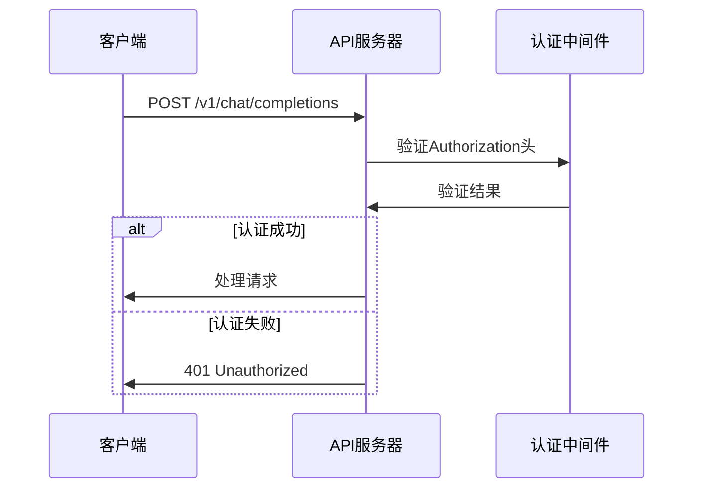
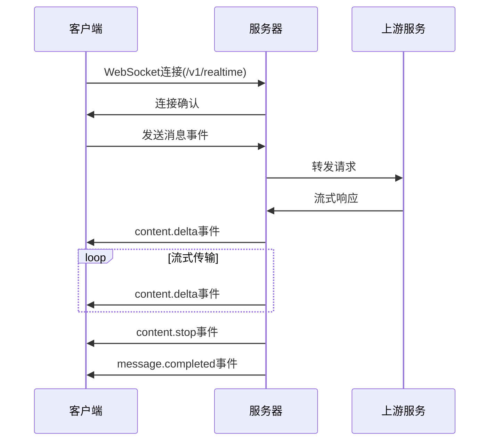
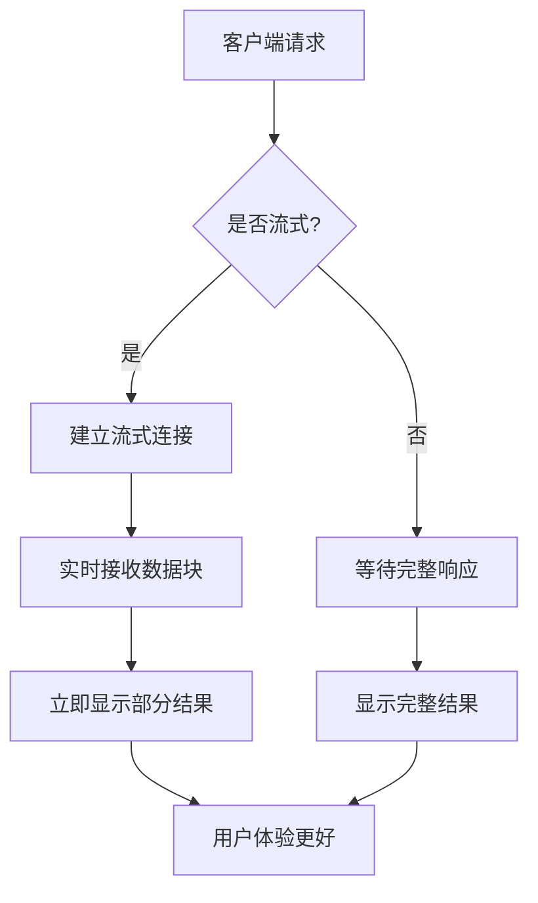

# API参考

<cite>
**本文档引用的文件**
- [main.go](file://main.go)
- [relay-router.go](file://router/relay-router.go)
- [api-router.go](file://router/api-router.go)
- [relay.go](file://controller/relay.go)
- [openai_request.go](file://dto/openai_request.go)
- [openai_response.go](file://dto/openai_response.go)
- [claude.go](file://dto/claude.go)
- [gemini.go](file://dto/gemini.go)
- [error.go](file://dto/error.go)
- [relay_adaptor.go](file://relay/relay_adaptor.go)
- [websocket.go](file://relay/websocket.go)
- [relay_format.go](file://types/relay_format.go)
- [relay.json](file://docs/openapi/relay.json)
</cite>

## 目录
1. [简介](#简介)
2. [认证方法](#认证方法)
3. [中继API](#中继api)
   1. [OpenAI格式](#openai格式)
   2. [Claude格式](#claude格式)
   3. [Gemini格式](#gemini格式)
   4. [WebSocket实时对话](#websocket实时对话)
4. [错误码](#错误码)
5. [客户端实现指南](#客户端实现指南)
6. [性能优化技巧](#性能优化技巧)

## 简介
本API参考文档详细介绍了AI中继API的所有公开端点。该API支持多种AI服务提供商的请求格式，包括OpenAI、Anthropic Claude和Google Gemini，并将这些请求转发到相应的上游服务。API通过统一的接口简化了与不同AI模型的交互，同时提供了丰富的功能，如流式响应、模型列表查询和详细的使用统计。

**Section sources**
- [main.go](file://main.go#L39-L169)
- [relay-router.go](file://router/relay-router.go#L13-L206)

## 认证方法
所有需要认证的API端点都使用Bearer Token进行身份验证。用户需要在HTTP请求头中包含`Authorization`字段，其值为`Bearer <your_api_key>`。

API密钥可以通过用户面板生成和管理。每个API密钥都与一个用户账户关联，并受到该账户的配额和权限限制。



**Diagram sources**
- [relay-router.go](file://router/relay-router.go#L19-L20)
- [api-router.go](file://router/api-router.go#L20-L21)

**Section sources**
- [relay-router.go](file://router/relay-router.go#L19-L20)
- [api-router.go](file://router/api-router.go#L20-L21)

## 中继API
中继API是本系统的核心功能，它接收来自客户端的请求，根据请求的格式和目标模型，将其转换并转发到相应的上游AI服务。

### OpenAI格式
中继API完全兼容OpenAI API格式，支持所有主要的OpenAI端点。

#### 聊天补全
创建聊天对话的API端点。

**HTTP方法**: POST
**URL模式**: `/v1/chat/completions`

**请求JSON模式**:
```json
{
  "model": "string",
  "messages": [
    {
      "role": "string",
      "content": "string"
    }
  ],
  "stream": false,
  "temperature": 0.7,
  "max_tokens": 1000
}
```

**响应JSON模式**:
```json
{
  "id": "string",
  "object": "chat.completion",
  "created": 0,
  "model": "string",
  "choices": [
    {
      "index": 0,
      "message": {
        "role": "string",
        "content": "string"
      },
      "finish_reason": "string"
    }
  ],
  "usage": {
    "prompt_tokens": 0,
    "completion_tokens": 0,
    "total_tokens": 0
  }
}
```

**请求示例**:
```bash
curl -X POST https://api.example.com/v1/chat/completions \
  -H "Authorization: Bearer your-api-key" \
  -H "Content-Type: application/json" \
  -d '{
    "model": "gpt-3.5-turbo",
    "messages": [
      {"role": "user", "content": "Hello!"}
    ]
  }'
```

**响应示例**:
```json
{
  "id": "chatcmpl-123",
  "object": "chat.completion",
  "created": 1677652288,
  "model": "gpt-3.5-turbo-0613",
  "choices": [
    {
      "index": 0,
      "message": {
        "role": "assistant",
        "content": "Hello! How can I help you today?"
      },
      "finish_reason": "stop"
    }
  ],
  "usage": {
    "prompt_tokens": 9,
    "completion_tokens": 12,
    "total_tokens": 21
  }
}
```

**流式响应示例**:
```bash
curl -X POST https://api.example.com/v1/chat/completions \
  -H "Authorization: Bearer your-api-key" \
  -H "Content-Type: application/json" \
  -d '{
    "model": "gpt-3.5-turbo",
    "messages": [
      {"role": "user", "content": "Tell me a story"}
    ],
    "stream": true
  }'
```

**Section sources**
- [relay-router.go](file://router/relay-router.go#L88-L90)
- [openai_request.go](file://dto/openai_request.go#L26-L87)
- [openai_response.go](file://dto/openai_response.go#L24-L47)

#### 模型列表
获取可用模型列表的API端点。

**HTTP方法**: GET
**URL模式**: `/v1/models`

**响应JSON模式**:
```json
{
  "object": "list",
  "data": [
    {
      "id": "string",
      "object": "model",
      "created": 0,
      "owned_by": "string"
    }
  ]
}
```

**响应示例**:
```json
{
  "object": "list",
  "data": [
    {
      "id": "gpt-3.5-turbo",
      "object": "model",
      "created": 1677610600,
      "owned_by": "openai"
    },
    {
      "id": "gpt-4",
      "object": "model",
      "created": 1677610600,
      "owned_by": "openai"
    }
  ]
}
```

**Section sources**
- [relay-router.go](file://router/relay-router.go#L18-L30)
- [relay.json](file://docs/openapi/relay.json#L74-L154)

### Claude格式
中继API支持Anthropic Claude的API格式，通过特定的请求头来识别和处理Claude格式的请求。

#### 消息创建
创建Claude消息的API端点。

**HTTP方法**: POST
**URL模式**: `/v1/messages`

**请求头**:
- `x-api-key`: Claude API密钥
- `anthropic-version`: API版本（如`2023-06-01`）

**请求JSON模式**:
```json
{
  "model": "string",
  "max_tokens": 1000,
  "messages": [
    {
      "role": "string",
      "content": "string"
    }
  ]
}
```

**响应JSON模式**:
```json
{
  "id": "string",
  "type": "message",
  "role": "string",
  "content": [
    {
      "type": "text",
      "text": "string"
    }
  ],
  "model": "string",
  "usage": {
    "input_tokens": 0,
    "output_tokens": 0
  }
}
```

**请求示例**:
```bash
curl -X POST https://api.example.com/v1/messages \
  -H "x-api-key: your-anthropic-key" \
  -H "anthropic-version: 2023-06-01" \
  -H "Content-Type: application/json" \
  -d '{
    "model": "claude-3-opus-20240229",
    "max_tokens": 1000,
    "messages": [
      {"role": "user", "content": "Hello!"}
    ]
  }'
```

**Section sources**
- [relay-router.go](file://router/relay-router.go#L80-L82)
- [claude.go](file://dto/claude.go#L193-L215)

### Gemini格式
中继API支持Google Gemini的API格式，通过特定的请求头或查询参数来识别和处理Gemini格式的请求。

#### 模型列表(Gemini格式)
以Gemini API格式获取可用模型列表。

**HTTP方法**: GET
**URL模式**: `/v1beta/models`

**请求头**:
- `x-goog-api-key`: Google API密钥

**响应JSON模式**:
```json
{
  "models": [
    {
      "name": "string",
      "version": "string",
      "displayName": "string",
      "description": "string"
    }
  ]
}
```

**Section sources**
- [relay-router.go](file://router/relay-router.go#L42-L48)
- [relay.json](file://docs/openapi/relay.json#L156-L185)

### WebSocket实时对话
中继API支持WebSocket连接，用于实时对话流。

#### 实时对话连接
建立实时对话WebSocket连接。

**HTTP方法**: GET
**URL模式**: `/v1/realtime`

**连接处理**:
1. 客户端通过WebSocket连接到`/v1/realtime`端点
2. 服务器验证认证信息
3. 建立双向通信通道
4. 客户端发送对话事件，服务器返回实时响应

**消息格式**:
```json
{
  "type": "string",
  "message": "string"
}
```

**事件类型**:
- `conversation.created`: 对话创建
- `message.created`: 消息创建
- `content.start`: 内容开始流式传输
- `content.delta`: 内容增量更新
- `content.stop`: 内容流式传输结束
- `message.completed`: 消息完成

**连接示例**:
```javascript
const socket = new WebSocket('wss://api.example.com/v1/realtime');

socket.onopen = function(event) {
  console.log('WebSocket连接已建立');
  // 发送认证和初始化消息
  socket.send(JSON.stringify({
    type: 'session.update',
    session: {
      model: 'gpt-4'
    }
  }));
};

socket.onmessage = function(event) {
  const data = JSON.parse(event.data);
  console.log('收到消息:', data);
};

socket.onclose = function(event) {
  console.log('WebSocket连接已关闭');
};
```



**Diagram sources**
- [relay-router.go](file://router/relay-router.go#L68-L72)
- [websocket.go](file://relay/websocket.go#L15-L47)

**Section sources**
- [relay-router.go](file://router/relay-router.go#L68-L72)
- [websocket.go](file://relay/websocket.go#L15-L47)

## 错误码
API返回标准化的错误响应，包含错误类型、消息和状态码。

**错误响应格式**:
```json
{
  "error": {
    "message": "string",
    "type": "string",
    "param": "string",
    "code": "string"
  }
}
```

**常见错误码**:

| 状态码 | 错误码 | 描述 |
|--------|--------|------|
| 401 | authentication_failed | 认证失败，API密钥无效或缺失 |
| 400 | invalid_request_error | 请求格式无效或缺少必需参数 |
| 429 | rate_limit_exceeded | 请求频率超过限制 |
| 500 | server_error | 服务器内部错误 |
| 502 | bad_gateway | 上游服务返回无效响应 |
| 503 | service_unavailable | 服务暂时不可用 |
| 504 | gateway_timeout | 上游服务响应超时 |

**错误处理示例**:
```json
{
  "error": {
    "message": "Invalid API key",
    "type": "invalid_request_error",
    "param": null,
    "code": "invalid_api_key"
  }
}
```

**Section sources**
- [error.go](file://dto/error.go#L17-L89)
- [relay.go](file://controller/relay.go#L86-L103)

## 客户端实现指南
本节提供客户端实现的最佳实践和示例代码。

### 重试策略
实现指数退避重试策略以处理临时性错误：

```python
import time
import random

def make_request_with_retry(url, data, max_retries=3):
    for attempt in range(max_retries):
        try:
            response = requests.post(url, json=data, headers=headers)
            if response.status_code == 200:
                return response.json()
            elif response.status_code in [429, 500, 502, 503, 504]:
                # 指数退避
                wait_time = (2 ** attempt) + random.uniform(0, 1)
                time.sleep(wait_time)
                continue
            else:
                # 其他错误，不重试
                response.raise_for_status()
        except requests.RequestException:
            if attempt == max_retries - 1:
                raise
            wait_time = (2 ** attempt) + random.uniform(0, 1)
            time.sleep(wait_time)
    return None
```

### 流式响应处理
处理流式响应的示例代码：

```javascript
async function streamChatCompletion() {
  const response = await fetch('https://api.example.com/v1/chat/completions', {
    method: 'POST',
    headers: {
      'Authorization': 'Bearer your-api-key',
      'Content-Type': 'application/json'
    },
    body: JSON.stringify({
      model: 'gpt-3.5-turbo',
      messages: [{role: 'user', content: 'Hello!'}],
      stream: true
    })
  });

  const reader = response.body.getReader();
  const decoder = new TextDecoder();
  let buffer = '';

  while (true) {
    const {done, value} = await reader.read();
    if (done) break;
    
    buffer += decoder.decode(value, {stream: true});
    const lines = buffer.split('\n');
    buffer = lines.pop(); // 保留不完整的行
    
    for (const line of lines) {
      if (line.startsWith('data: ')) {
        const data = line.slice(6);
        if (data === '[DONE]') {
          return;
        }
        try {
          const json = JSON.parse(data);
          console.log('流式响应:', json);
        } catch (e) {
          console.error('解析JSON失败:', e);
        }
      }
    }
  }
}
```

**Section sources**
- [relay.go](file://controller/relay.go#L167-L199)
- [openai_response.go](file://dto/openai_response.go#L141-L197)

## 性能优化技巧
### 批量请求
对于多个独立的请求，考虑使用批量处理来减少网络开销。

### 连接复用
保持HTTP连接复用，避免频繁建立和关闭连接。

### 缓存策略
实现适当的缓存策略，特别是对于频繁请求的模型列表等静态数据。

### 流式传输
对于长文本生成，优先使用流式传输，以便用户能够立即看到部分结果。



**Diagram sources**
- [relay-router.go](file://router/relay-router.go#L88-L90)
- [openai_response.go](file://dto/openai_response.go#L141-L197)

**Section sources**
- [relay-router.go](file://router/relay-router.go#L88-L90)
- [openai_response.go](file://dto/openai_response.go#L141-L197)