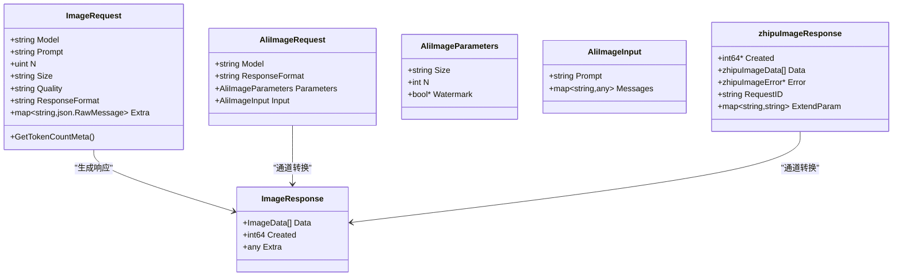

# 图像生成API

<cite>
**本文引用的文件**
- [controller/relay.go](file://controller/relay.go)
- [relay/image_handler.go](file://relay/image_handler.go)
- [relay/relay_adaptor.go](file://relay/relay_adaptor.go)
- [relay/helper/valid_request.go](file://relay/helper/valid_request.go)
- [dto/openai_image.go](file://dto/openai_image.go)
- [relay/channel/ali/image.go](file://relay/channel/ali/image.go)
- [relay/channel/zhipu_4v/image.go](file://relay/channel/zhipu_4v/image.go)
- [relay/channel/gemini/relay-gemini.go](file://relay/channel/gemini/relay-gemini.go)
- [service/pre_consume_quota.go](file://service/pre_consume_quota.go)
- [relay/compatible_handler.go](file://relay/compatible_handler.go)
- [types/error.go](file://types/error.go)
- [docs/openapi/relay.json](file://docs/openapi/relay.json)
</cite>

## 目录
1. [简介](#简介)
2. [项目结构](#项目结构)
3. [核心组件](#核心组件)
4. [架构总览](#架构总览)
5. [详细组件分析](#详细组件分析)
6. [依赖关系分析](#依赖关系分析)
7. [性能与计费](#性能与计费)
8. [故障排查指南](#故障排查指南)
9. [结论](#结论)
10. [附录](#附录)

## 简介
本文件面向开发者与运维人员，系统化梳理“图像生成API”的实现与使用，重点覆盖以下要点：
- 端点与HTTP方法：/v1/images/generations（POST）
- 请求体格式：multipart/form-data 或 application/json（OpenAI兼容）
- 关键参数：prompt、size、n、quality、response_format 等
- 返回值：图像URL或base64编码结果
- 兼容性：对百炼（qwen-image）、智谱（zhipu_4v）等多厂商通道的适配
- 路由链路：从控制器到适配器再到具体通道的调用流程
- 错误码与常见问题
- 计费与配额管理

## 项目结构
围绕图像生成API的关键模块分布如下：
- 控制层：统一入口在 relay 路由分发，按模式选择图像生成或编辑路径
- 协议层：请求校验与OpenAI兼容参数映射
- 适配层：按供应商类型选择具体适配器（如阿里、智谱等）
- 通道层：各厂商API的具体实现与响应转换
- 计费层：预扣费、补扣费、返还与日志记录

图表来源
- [controller/relay.go](file://controller/relay.go#L31-L52)
- [relay/image_handler.go](file://relay/image_handler.go#L23-L136)
- [relay/relay_adaptor.go](file://relay/relay_adaptor.go#L52-L122)
- [relay/compatible_handler.go](file://relay/compatible_handler.go#L192-L397)

章节来源
- [controller/relay.go](file://controller/relay.go#L31-L52)
- [relay/image_handler.go](file://relay/image_handler.go#L23-L136)
- [relay/relay_adaptor.go](file://relay/relay_adaptor.go#L52-L122)

## 核心组件
- 请求模型与参数
  - 请求体支持两种形态：multipart/form-data（图像编辑场景）与application/json（生成场景）
  - 关键字段：prompt、size、n、quality、response_format、watermark 等
  - 字段校验与默认值：如 size、quality、n 的默认策略
- 请求校验与映射
  - 根据路径与Content-Type进行模式判定（生成/编辑）
  - 对水印、尺寸、质量等参数进行合法性检查
- 适配器与通道
  - 依据供应商类型选择适配器（如阿里、智谱等）
  - 不同通道对请求体与响应体做兼容转换
- 计费与配额
  - 预扣费、补扣费、返还与日志
  - 使用令牌计数与价格比率计算

章节来源
- [dto/openai_image.go](file://dto/openai_image.go#L14-L37)
- [dto/openai_image.go](file://dto/openai_image.go#L127-L157)
- [relay/helper/valid_request.go](file://relay/helper/valid_request.go#L128-L214)
- [relay/relay_adaptor.go](file://relay/relay_adaptor.go#L52-L122)

## 架构总览
图像生成请求从客户端发起，经由Gin路由进入统一的relayHandler，再由ImageHelper完成请求校验、适配器选择与下游调用，最后由通道适配器进行响应转换并触发计费。

图表来源
- [controller/relay.go](file://controller/relay.go#L31-L52)
- [relay/image_handler.go](file://relay/image_handler.go#L23-L136)
- [relay/relay_adaptor.go](file://relay/relay_adaptor.go#L52-L122)
- [relay/compatible_handler.go](file://relay/compatible_handler.go#L192-L397)

## 详细组件分析

### 请求与响应模型
- 请求模型
  - 字段定义：prompt、n、size、quality、response_format、style、user、extra_fields、background、moderation、output_format、output_compression、partial_images、watermark、zhipu_4v扩展字段等
  - 参数映射：支持将未知字段保留到额外容器，便于通道适配器扩展
  - 令牌估算：根据模型、尺寸、质量、数量计算图像价格比率
- 响应模型
  - data数组：包含url、b64_json、revised_prompt
  - created时间戳
  - extra扩展字段

章节来源
- [dto/openai_image.go](file://dto/openai_image.go#L14-L37)
- [dto/openai_image.go](file://dto/openai_image.go#L127-L157)
- [dto/openai_image.go](file://dto/openai_image.go#L169-L178)

### 请求校验与参数映射
- 模式判定
  - 生成：application/json或multipart/form-data（编辑场景）
  - 编辑：multipart/form-data，提取prompt、model、n、quality、size、image、watermark等
- 参数校验
  - model必填；size不接受“×”乘号，需使用“x”
  - dall-e系列尺寸限制与默认值
  - n默认为1
- 参数映射
  - quality、size、n等映射到通道适配器期望的参数结构

章节来源
- [relay/helper/valid_request.go](file://relay/helper/valid_request.go#L128-L214)

### 适配器与通道
- 适配器选择
  - 根据API类型映射到具体适配器（如阿里、智谱等）
- 通道实现要点
  - 阿里通道
    - 支持multipart/form-data图像编辑场景，自动提取image字段并转为base64 data URL
    - 异步任务轮询，最终输出OpenAI兼容的图像URL或b64_json
  - 智谱（zhipu_4v）
    - 统一响应结构，兼容多种返回字段（url、image_url、b64_json、b64_image）
    - 自动回填缺失字段，必要时从URL下载并转为b64_json
  - Gemini通道
    - 将quality映射为图像尺寸参数，固定每张图的提示词令牌数，用于计费

章节来源
- [relay/relay_adaptor.go](file://relay/relay_adaptor.go#L52-L122)
- [relay/channel/ali/image.go](file://relay/channel/ali/image.go#L61-L127)
- [relay/channel/ali/image.go](file://relay/channel/ali/image.go#L129-L160)
- [relay/channel/ali/image.go](file://relay/channel/ali/image.go#L236-L306)
- [relay/channel/zhipu_4v/image.go](file://relay/channel/zhipu_4v/image.go#L57-L128)
- [relay/channel/gemini/relay-gemini.go](file://relay/channel/gemini/relay-gemini.go#L1348-L1369)

### 计费与配额
- 预扣费
  - 判断用户额度与令牌额度，满足条件则预扣费
- 补扣费/返还
  - 根据实际使用量与预扣量差额进行补扣或返还
- 日志与统计
  - 记录用户、通道、模型、分组比率、模型比率、缓存比率、图像比率等
- 图像计费规则
  - Gemini通道：每张图固定提示词令牌数，用于计费
  - 其他通道：根据通道适配器返回的Usage进行计费

章节来源
- [service/pre_consume_quota.go](file://service/pre_consume_quota.go#L31-L80)
- [relay/compatible_handler.go](file://relay/compatible_handler.go#L192-L397)
- [relay/channel/gemini/relay-gemini.go](file://relay/channel/gemini/relay-gemini.go#L1348-L1369)

### 错误处理与错误码
- 常见错误码
  - 请求体解析失败、请求类型不匹配、参数非法、模型映射失败、通道无可用密钥、通道参数覆盖无效、通道响应异常、读取响应体失败、预扣费失败、用户额度不足等
- 错误传播
  - 适配器与通道在发生错误时返回NewAPIError，包含错误类型、错误码与HTTP状态码
- 建议处理
  - 对于400类参数错误，优先检查model、size、n、response_format等字段
  - 对于403额度不足，检查用户配额与令牌额度
  - 对于上游通道错误，查看通道适配器返回的错误信息

章节来源
- [types/error.go](file://types/error.go#L51-L85)
- [relay/image_handler.go](file://relay/image_handler.go#L23-L136)
- [relay/channel/ali/image.go](file://relay/channel/ali/image.go#L266-L306)
- [relay/channel/zhipu_4v/image.go](file://relay/channel/zhipu_4v/image.go#L57-L128)

## 依赖关系分析

图表来源
- [dto/openai_image.go](file://dto/openai_image.go#L14-L37)
- [dto/openai_image.go](file://dto/openai_image.go#L169-L178)
- [relay/channel/ali/image.go](file://relay/channel/ali/image.go#L24-L59)
- [relay/channel/ali/image.go](file://relay/channel/ali/image.go#L129-L160)
- [relay/channel/zhipu_4v/image.go](file://relay/channel/zhipu_4v/image.go#L17-L47)

章节来源
- [dto/openai_image.go](file://dto/openai_image.go#L14-L37)
- [dto/openai_image.go](file://dto/openai_image.go#L169-L178)
- [relay/channel/ali/image.go](file://relay/channel/ali/image.go#L24-L59)
- [relay/channel/ali/image.go](file://relay/channel/ali/image.go#L129-L160)
- [relay/channel/zhipu_4v/image.go](file://relay/channel/zhipu_4v/image.go#L17-L47)

## 性能与计费
- 性能特性
  - 通道异步任务轮询（如阿里）：在任务完成后统一输出结果，避免长连接阻塞
  - 响应体转换：通道适配器负责将厂商原始响应转换为OpenAI兼容格式
- 计费逻辑
  - 预扣费：满足条件时预扣取额度
  - 补扣/返还：根据实际使用量与预扣量差额调整
  - 图像计费：不同通道采用不同计费策略（如Gemini固定每张图的提示词令牌数）

章节来源
- [relay/channel/ali/image.go](file://relay/channel/ali/image.go#L194-L234)
- [relay/channel/gemini/relay-gemini.go](file://relay/channel/gemini/relay-gemini.go#L1348-L1369)
- [service/pre_consume_quota.go](file://service/pre_consume_quota.go#L31-L80)
- [relay/compatible_handler.go](file://relay/compatible_handler.go#L192-L397)

## 故障排查指南
- 400 参数错误
  - 检查model是否为空
  - 检查size是否使用“x”而非“×”
  - 检查n是否为0（默认为1）
  - 检查response_format是否合法
- 403 额度不足
  - 检查用户剩余额度与令牌额度
  - 若为无限额度令牌，确认信任阈值设置
- 通道错误
  - 阿里：检查multipart/form-data中image字段是否存在
  - 智谱：检查返回字段（url、image_url、b64_json、b64_image）是否齐全
- 响应异常
  - 检查通道适配器是否正确转换响应
  - 检查上游响应状态码与消息

章节来源
- [relay/helper/valid_request.go](file://relay/helper/valid_request.go#L157-L214)
- [relay/channel/ali/image.go](file://relay/channel/ali/image.go#L61-L127)
- [relay/channel/zhipu_4v/image.go](file://relay/channel/zhipu_4v/image.go#L57-L128)
- [types/error.go](file://types/error.go#L51-L85)

## 结论
本图像生成API通过统一的relayHandler与适配器机制，实现了对多家供应商（如阿里、智谱等）的兼容。请求体支持OpenAI兼容的JSON与multipart/form-data两种形式，参数校验严格，通道适配器负责响应转换与计费。计费采用预扣费、补扣费与返还机制，确保资源消耗与账单准确。建议在生产环境中结合配额策略与监控告警，保障服务稳定性与成本可控。

## 附录

### 端点与请求示例
- 端点：POST /v1/images/generations
- 请求体（application/json）
  - 字段：prompt、size、n、quality、response_format、watermark 等
- 请求体（multipart/form-data）
  - 场景：图像编辑
  - 字段：prompt、model、n、quality、size、image（文件）、watermark（可选）
- 成功响应
  - data数组：包含url、b64_json、revised_prompt
  - created时间戳
  - extra扩展字段（通道适配器透传）

章节来源
- [docs/openapi/relay.json](file://docs/openapi/relay.json#L1-L200)
- [dto/openai_image.go](file://dto/openai_image.go#L169-L178)
- [relay/helper/valid_request.go](file://relay/helper/valid_request.go#L128-L214)