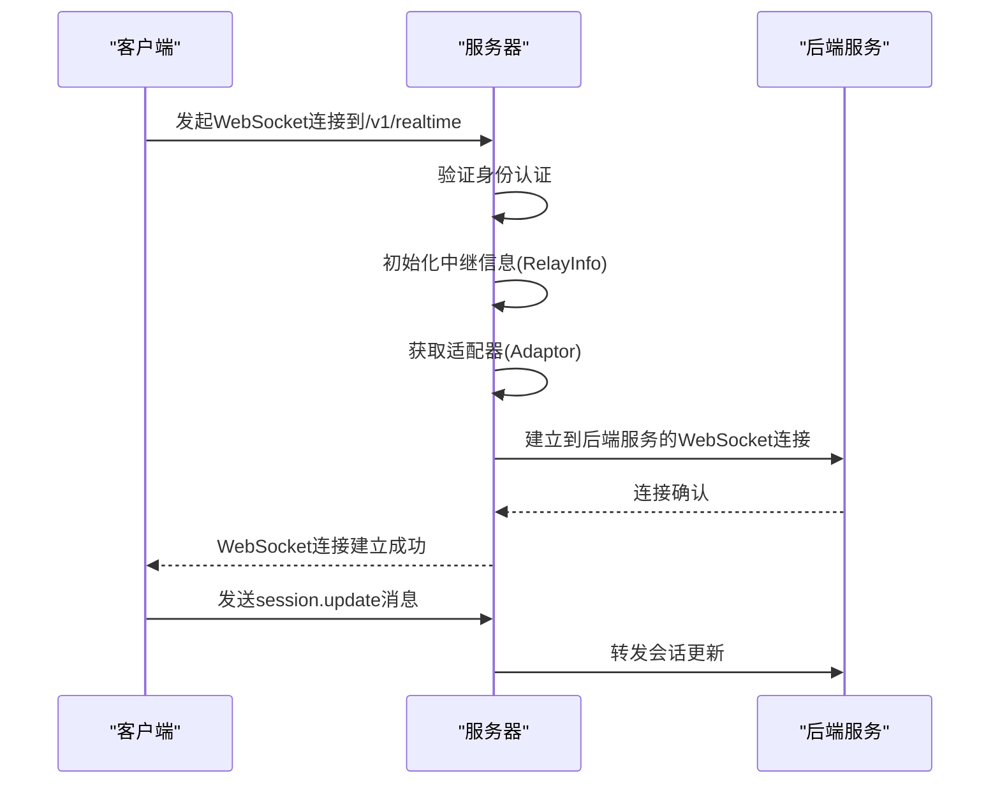
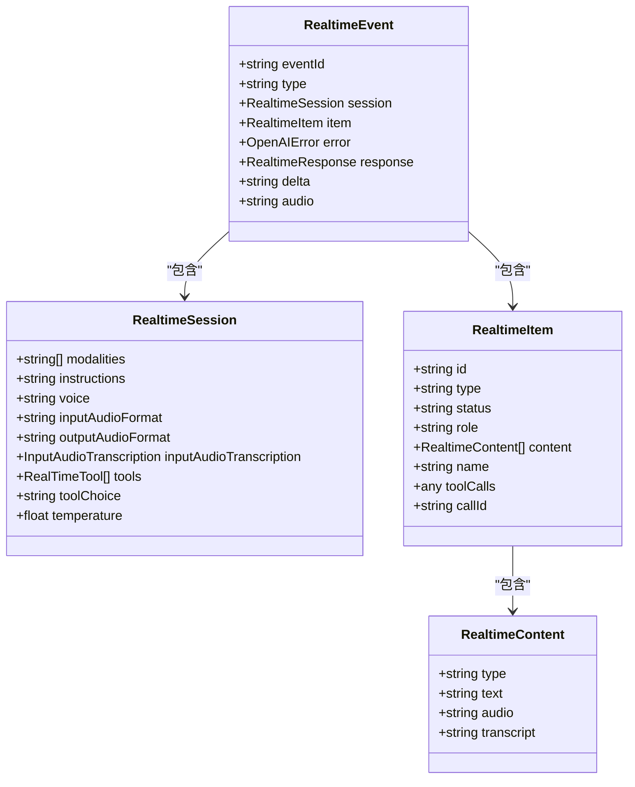
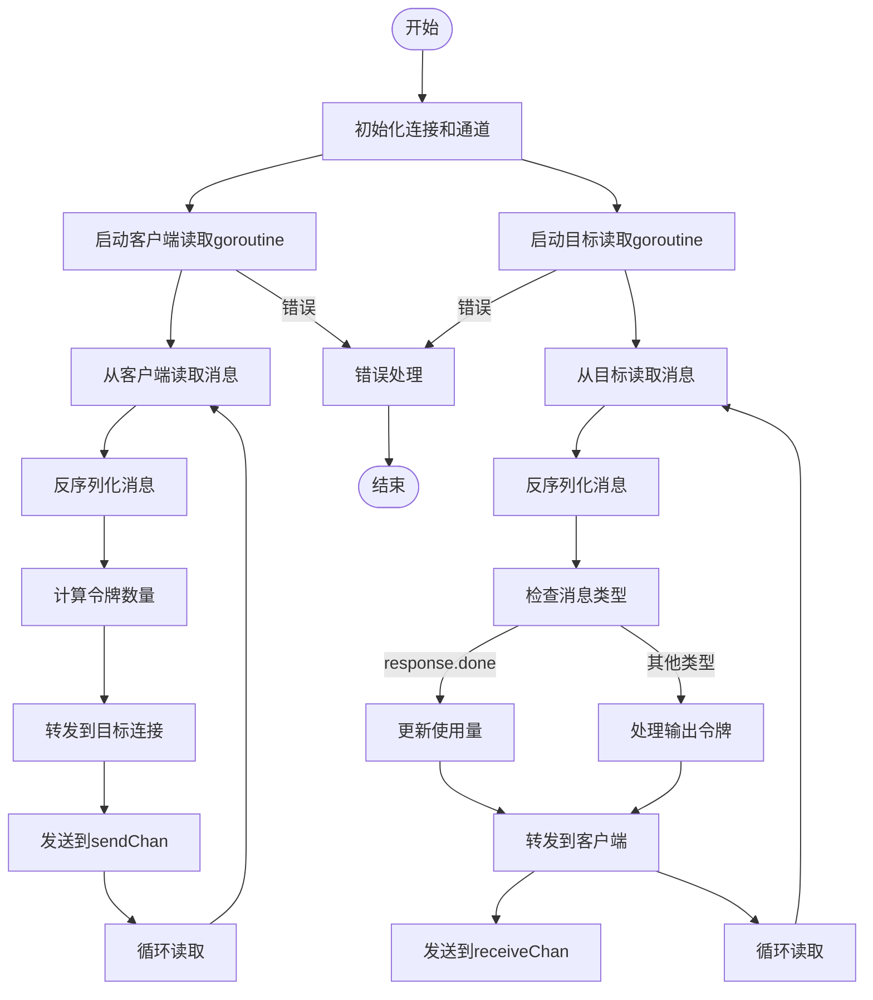
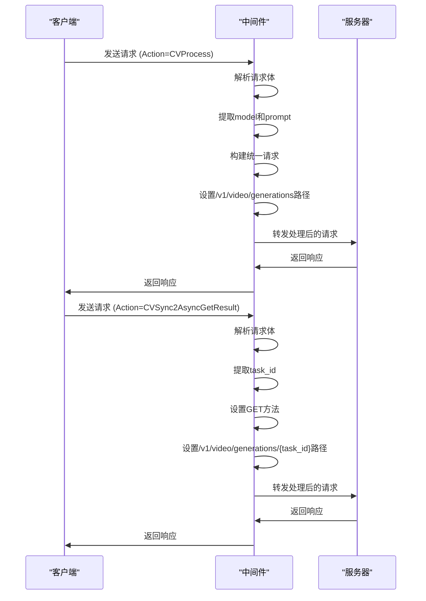

# 实时对话API

<cite>
**本文档引用的文件**   
- [relay/websocket.go](file://relay/websocket.go)
- [dto/realtime.go](file://dto/realtime.go)
- [relay/channel/openai/relay-openai.go](file://relay/channel/openai/relay-openai.go)
- [controller/relay.go](file://controller/relay.go)
- [relay/channel/api_request.go](file://relay/channel/api_request.go)
- [relay/helper/common.go](file://relay/helper/common.go)
- [middleware/jimeng_adapter.go](file://middleware/jimeng_adapter.go)
- [web/src/pages/Playground/index.jsx](file://web/src/pages/Playground/index.jsx)
</cite>

## 目录
1. [简介](#简介)
2. [连接建立过程](#连接建立过程)
3. [消息格式](#消息格式)
4. [WebSocket连接处理](#websocket连接处理)
5. [中间件集成](#中间件集成)
6. [JavaScript客户端示例](#javascript客户端示例)
7. [连接保持与错误恢复](#连接保持与错误恢复)
8. [总结](#总结)

## 简介
实时对话API提供基于WebSocket的双向流式对话功能，通过/v1/realtime端点实现低延迟通信。该API支持实时会话控制、流式响应和双向消息传递，适用于需要即时交互的应用场景。

**Section sources**
- [relay/websocket.go](file://relay/websocket.go#L1-L46)
- [dto/realtime.go](file://dto/realtime.go#L1-L89)

## 连接建立过程
实时对话API的连接建立过程始于客户端向/v1/realtime端点发起WebSocket连接请求。服务器使用gorilla/websocket库处理连接升级，通过Upgrader配置支持"realtime"子协议并允许跨域请求。

连接建立后，系统初始化中继信息(RelayInfo)，根据API类型获取相应的适配器(Adaptor)，并建立与后端服务的WebSocket连接。整个过程由WssHelper函数协调，确保连接的正确建立和错误处理。



**Diagram sources**
- [controller/relay.go](file://controller/relay.go#L208-L213)
- [relay/websocket.go](file://relay/websocket.go#L15-L46)
- [relay/channel/api_request.go](file://relay/channel/api_request.go#L125-L151)

**Section sources**
- [controller/relay.go](file://controller/relay.go#L208-L251)
- [relay/websocket.go](file://relay/websocket.go#L15-L46)

## 消息格式
实时对话API使用标准化的消息格式进行客户端和服务器之间的通信。所有消息都封装在RealtimeEvent结构中，包含事件ID、类型和相关数据。

### 会话控制消息
会话控制消息用于配置对话参数和管理会话状态：

- **session.update**: 更新会话配置，包括语音模式、转录设置和工具配置
- **session.created**: 会话创建确认
- **session.updated**: 会话更新确认

### 对话内容消息
对话内容消息用于传输对话内容和响应：

- **conversation.item.create**: 创建新的对话项
- **conversation.item.created**: 对话项创建确认
- **response.create**: 创建响应
- **response.done**: 响应完成

### 流式响应消息
流式响应消息用于实时传输响应内容：

- **response.audio.delta**: 音频响应增量
- **response.audio_transcript.delta**: 音频转录增量
- **response.function_call_arguments.delta**: 函数调用参数增量



**Diagram sources**
- [dto/realtime.go](file://dto/realtime.go#L24-L88)

**Section sources**
- [dto/realtime.go](file://dto/realtime.go#L5-L88)

## WebSocket连接处理
WebSocket连接处理由relay包中的WssHelper函数负责。该函数协调客户端和后端服务之间的双向通信，管理连接生命周期和错误处理。

连接处理采用goroutine并发模型，为客户端读取和后端读取分别创建独立的goroutine。每个goroutine持续监听消息，进行反序列化处理，并将消息转发到另一端。系统使用通道(channel)在goroutine之间传递消息和错误信息。

消息处理包括：
- 消息反序列化：将JSON消息转换为RealtimeEvent结构
- 令牌计数：计算输入和输出令牌数量
- 消息转发：将消息转发到目标连接
- 使用量跟踪：记录会话的令牌使用情况



**Diagram sources**
- [relay/channel/openai/relay-openai.go](file://relay/channel/openai/relay-openai.go#L329-L534)

**Section sources**
- [relay/channel/openai/relay-openai.go](file://relay/channel/openai/relay-openai.go#L329-L534)
- [relay/helper/common.go](file://relay/helper/common.go#L124-L144)

## 中间件集成
系统通过中间件与支持实时流的后端服务对接，其中jimeng_adapter.go是即梦服务的适配器中间件。该中间件负责请求转换、参数处理和路由调整。

中间件功能包括：
- 请求参数转换：将Action查询参数映射到内部操作
- 请求体重构：将原始请求转换为统一格式
- 路径重写：根据操作类型调整请求路径
- 方法调整：根据操作类型调整HTTP方法

即梦适配器支持文本生成、图像生成和视频生成等操作，通过Action参数区分不同操作类型。对于异步任务结果获取，适配器会修改请求路径和方法，实现无缝集成。



**Diagram sources**
- [middleware/jimeng_adapter.go](file://middleware/jimeng_adapter.go#L15-L67)

**Section sources**
- [middleware/jimeng_adapter.go](file://middleware/jimeng_adapter.go#L15-L67)
- [relay/channel/jimeng/adaptor.go](file://relay/channel/jimeng/adaptor.go#L1-L48)

## JavaScript客户端示例
以下JavaScript示例展示了如何使用实时对话API发送文本、接收部分响应和处理会话控制命令。

```javascript
// 创建WebSocket连接
const socket = new WebSocket('wss://api.example.com/v1/realtime', ['realtime']);

// 连接建立后发送会话更新
socket.addEventListener('open', () => {
  const sessionUpdate = {
    event_id: 'evt_123',
    type: 'session.update',
    session: {
      modalities: ['text'],
      instructions: '请用中文回答',
      voice: 'alloy',
      input_audio_format: 'pcm16',
      output_audio_format: 'pcm16',
      input_audio_transcription: {
        model: 'whisper-1'
      },
      turn_detection: null,
      tools: [],
      tool_choice: 'auto',
      temperature: 0.8,
      max_response_output_tokens: 1024
    }
  };
  socket.send(JSON.stringify(sessionUpdate));
});

// 发送文本消息
function sendText(text) {
  const message = {
    event_id: 'evt_456',
    type: 'conversation.item.create',
    item: {
      type: 'message',
      role: 'user',
      content: [{
        type: 'text',
        text: text
      }]
    }
  };
  socket.send(JSON.stringify(message));
}

// 处理传入消息
socket.addEventListener('message', (event) => {
  const data = JSON.parse(event.data);
  
  switch (data.type) {
    case 'response.audio.delta':
      // 处理音频增量
      console.log('音频数据:', data.delta);
      break;
      
    case 'response.text.delta':
      // 处理文本增量
      console.log('部分响应:', data.delta);
      break;
      
    case 'response.done':
      // 响应完成
      console.log('响应完成，使用量:', data.response.usage);
      break;
      
    case 'error':
      // 处理错误
      console.error('错误:', data.error);
      break;
      
    default:
      console.log('未知消息类型:', data.type);
  }
});

// 发送文本消息示例
sendText('你好，今天天气怎么样？');

// 关闭连接
function closeConnection() {
  socket.close();
}
```

**Section sources**
- [web/src/pages/Playground/index.jsx](file://web/src/pages/Playground/index.jsx#L20-L200)

## 连接保持与错误恢复
系统实现了完善的连接保持和错误恢复机制，确保实时对话的稳定性和可靠性。

### 心跳机制
系统通过定期发送PING消息保持连接活跃，防止连接因超时而断开。心跳间隔可配置，默认使用默认间隔。PING消息发送受到超时保护，防止goroutine无限运行。

### 错误处理
错误处理机制包括：
- 连接错误检测：识别正常关闭和异常错误
- Panic恢复：使用defer和recover捕获goroutine中的panic
- 错误通道：使用通道集中处理错误信息
- 资源清理：确保连接和通道的正确关闭

### 连接恢复
连接恢复策略包括：
- 超时控制：为PING操作设置最大持续时间
- 上下文取消：使用context控制goroutine生命周期
- 异常终止检测：检测请求上下文的完成状态
- 资源释放：确保在任何情况下都正确释放资源

```mermaid
flowchart TD
PingerStart([PING启动]) --> CreateContext["创建带取消功能的上下文"]
CreateContext --> StartGoroutine["启动PING goroutine"]
StartGoroutine --> SetupTicker["设置PING定时器"]
SetupTicker --> SetupTimeout["设置超时定时器"]
loop1["主循环"] --> Select["select选择"]
Select --> |ticker.C| SendPing["发送PING数据"]
SendPing --> Lock["获取写锁"]
Lock --> WritePing["写入PING数据"]
WritePing --> Unlock["释放写锁"]
Unlock --> loop1
Select --> |pingerCtx.Done| Stop["停止PING"]
Stop --> Cleanup["清理资源"]
Select --> |c.Request.Context().Done| RequestEnd["请求结束"]
RequestEnd --> Cleanup
Select --> |pingTimeout.C| Timeout["超时"]
Timeout --> Cleanup
Cleanup --> StopTicker["停止定时器"]
StopTicker --> Log["记录日志"]
Log --> End([结束])
```

**Diagram sources**
- [relay/helper/stream_scanner.go](file://relay/helper/stream_scanner.go#L111-L145)
- [relay/channel/api_request.go](file://relay/channel/api_request.go#L153-L233)

**Section sources**
- [relay/helper/common.go](file://relay/helper/common.go#L94-L107)
- [relay/helper/stream_scanner.go](file://relay/helper/stream_scanner.go#L111-L145)
- [relay/channel/api_request.go](file://relay/channel/api_request.go#L153-L233)

## 总结
实时对话API通过WebSocket提供低延迟的双向流式对话功能，支持灵活的会话控制和实时响应。系统架构设计合理，通过适配器模式支持多种后端服务，中间件机制实现了请求的灵活转换。

关键特性包括：
- 基于WebSocket的实时双向通信
- 标准化的消息格式和会话控制
- 高效的连接管理和错误处理
- 灵活的中间件集成机制
- 完善的心跳和错误恢复机制

该API适用于需要实时交互的应用场景，如语音助手、实时翻译和交互式教育应用。