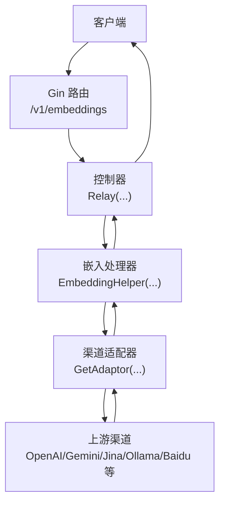
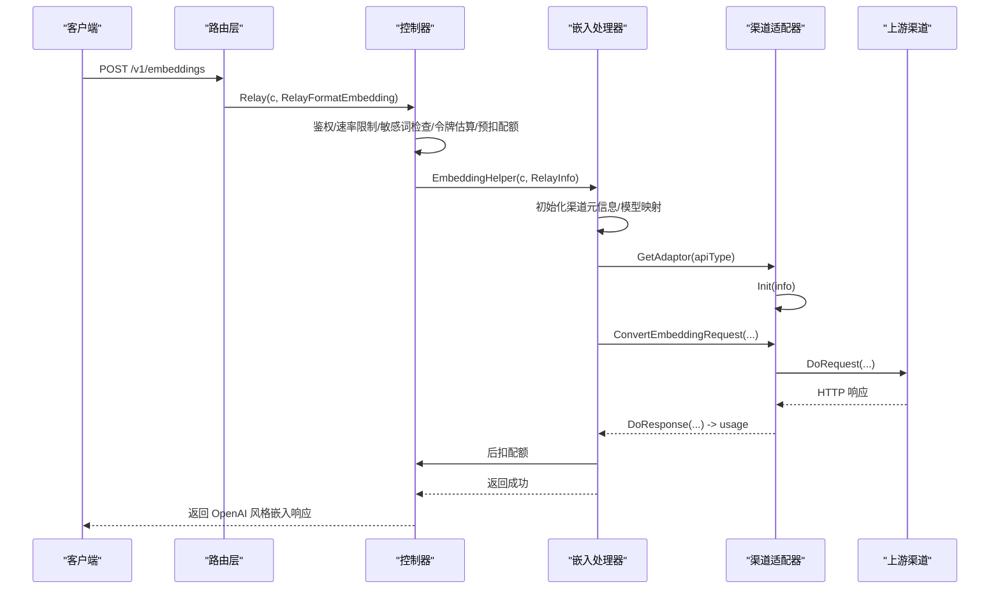
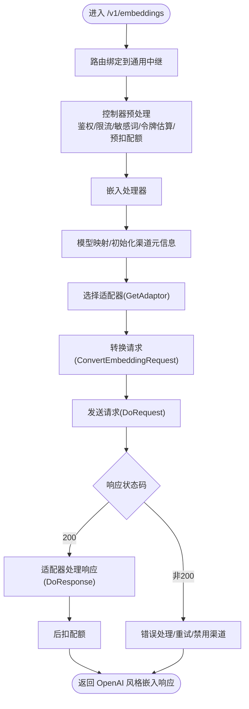
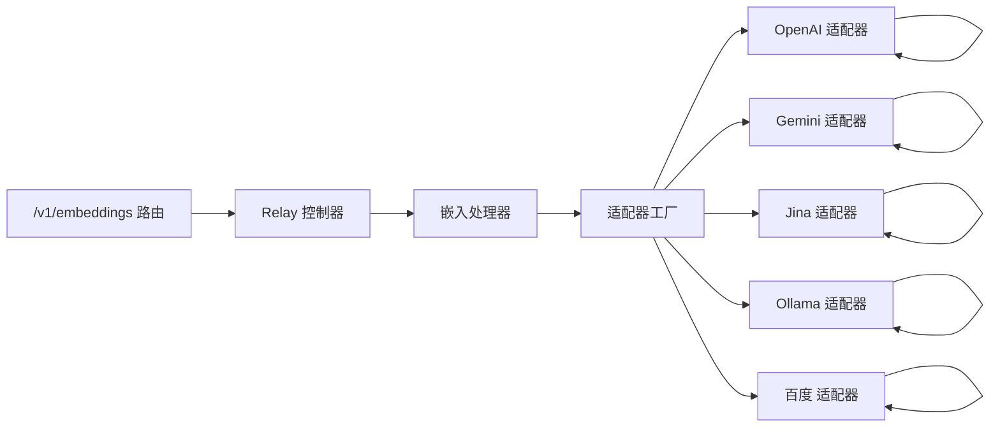

# 嵌入向量API

<cite>
**本文引用的文件**
- [embedding_handler.go](file://relay/embedding_handler.go)
- [dto/embedding.go](file://dto/embedding.go)
- [dto/openai_response.go](file://dto/openai_response.go)
- [router/relay-router.go](file://router/relay-router.go)
- [common/endpoint_defaults.go](file://common/endpoint_defaults.go)
- [relay/relay_adaptor.go](file://relay/relay_adaptor.go)
- [relay/channel/openai/adaptor.go](file://relay/channel/openai/adaptor.go)
- [relay/channel/gemini/adaptor.go](file://relay/channel/gemini/adaptor.go)
- [relay/channel/gemini/relay-gemini.go](file://relay/channel/gemini/relay-gemini.go)
- [relay/channel/jina/adaptor.go](file://relay/channel/jina/adaptor.go)
- [relay/channel/ollama/relay-ollama.go](file://relay/channel/ollama/relay-ollama.go)
- [relay/channel/baidu/relay-baidu.go](file://relay/channel/baidu/relay-baidu.go)
- [controller/relay.go](file://controller/relay.go)
</cite>

## 目录
1. [简介](#简介)
2. [项目结构](#项目结构)
3. [核心组件](#核心组件)
4. [架构总览](#架构总览)
5. [详细组件分析](#详细组件分析)
6. [依赖分析](#依赖分析)
7. [性能考量](#性能考量)
8. [故障排查指南](#故障排查指南)
9. [结论](#结论)
10. [附录](#附录)

## 简介
本文件面向使用者与开发者，系统性说明“嵌入向量API”的设计与使用，重点覆盖以下内容：
- 端点与HTTP方法：/v1/embeddings（POST）
- 请求体字段：input（字符串或字符串数组）、model（模型标识）、可选参数（encoding_format、dimensions、user、seed、temperature、top_p、frequency_penalty、presence_penalty 等）
- 返回体结构：data 字段（对象列表，包含每个输入的索引与向量）、model 字段、usage 字段（令牌用量统计）
- 通用中继处理流程：路由层接收请求，控制器进行预处理与配额预扣，嵌入处理器根据渠道类型选择适配器，转换请求并转发至上游渠道，再将上游响应转换为统一的OpenAI风格返回
- 支持的渠道：OpenAI、Gemini、Jina、Ollama、百度等（部分渠道可能未实现或存在差异）
- 应用场景：语义搜索、相似度检索、聚类、推荐系统等
- 性能考量：批量处理、令牌估算、配额预扣、重试策略与限流

## 项目结构
/v1/embeddings 端点通过 Gin 路由注册，进入通用中继层，最终由嵌入处理器与各渠道适配器完成请求转换与响应转换。

图表来源
- [router/relay-router.go](file://router/relay-router.go#L108-L112)
- [controller/relay.go](file://controller/relay.go#L64-L106)
- [relay/embedding_handler.go](file://relay/embedding_handler.go#L20-L87)
- [relay/relay_adaptor.go](file://relay/relay_adaptor.go#L52-L98)

章节来源
- [router/relay-router.go](file://router/relay-router.go#L108-L112)
- [common/endpoint_defaults.go](file://common/endpoint_defaults.go#L19-L33)

## 核心组件
- 路由层：在 /v1 组下注册 /embeddings 的 POST 路由，绑定到通用中继控制器。
- 控制器层：负责鉴权、速率限制、敏感词检查、令牌估算、预扣配额、通道选择与重试。
- 嵌入处理器：校验请求类型、模型映射、选择适配器、转换请求、发送请求、处理响应、更新用量并后扣配额。
- DTO 层：定义嵌入请求与响应的数据结构，支持 input 的字符串或数组解析、OpenAI 风格响应结构。
- 适配器层：按渠道类型实现请求转换与响应转换逻辑，统一输出 OpenAI 风格的嵌入响应。

章节来源
- [router/relay-router.go](file://router/relay-router.go#L108-L112)
- [controller/relay.go](file://controller/relay.go#L31-L52)
- [relay/embedding_handler.go](file://relay/embedding_handler.go#L20-L87)
- [dto/embedding.go](file://dto/embedding.go#L22-L89)
- [dto/openai_response.go](file://dto/openai_response.go#L54-L65)
- [relay/relay_adaptor.go](file://relay/relay_adaptor.go#L52-L98)

## 架构总览
下面的时序图展示一次典型的 /v1/embeddings 请求从客户端到上游渠道再到返回的完整流程。

图表来源
- [router/relay-router.go](file://router/relay-router.go#L108-L112)
- [controller/relay.go](file://controller/relay.go#L64-L106)
- [relay/embedding_handler.go](file://relay/embedding_handler.go#L20-L87)
- [relay/relay_adaptor.go](file://relay/relay_adaptor.go#L52-L98)

## 详细组件分析

### /v1/embeddings 端点与请求体
- 方法：POST
- 路由：/v1/embeddings
- 默认上游端点：/v1/embeddings（OpenAI风格）
- 请求体字段
  - model：字符串，目标模型标识
  - input：字符串或字符串数组，待编码的文本
  - encoding_format：字符串，可选；部分渠道支持
  - dimensions：整数，可选；部分渠道支持维度控制
  - user：字符串，可选；用于标识用户
  - seed、temperature、top_p、frequency_penalty、presence_penalty 等：可选参数，部分渠道支持
- 响应体字段
  - object：字符串，固定为 "list"
  - data：数组，元素包含
    - object：字符串，固定为 "embedding"
    - index：整数，对应输入数组中的位置
    - embedding：浮点数组，向量值
  - model：字符串，上游模型名
  - usage：对象，包含 prompt_tokens、completion_tokens、total_tokens 等

章节来源
- [router/relay-router.go](file://router/relay-router.go#L108-L112)
- [common/endpoint_defaults.go](file://common/endpoint_defaults.go#L19-L33)
- [dto/embedding.go](file://dto/embedding.go#L22-L89)
- [dto/openai_response.go](file://dto/openai_response.go#L54-L65)

### 通用中继处理流程
- 路由层将 /v1/embeddings 绑定到通用中继控制器
- 控制器执行鉴权、速率限制、敏感词检查、令牌估算与预扣配额
- 嵌入处理器初始化渠道元信息，执行模型映射，选择适配器，转换请求体，发送请求，处理响应并计算 usage
- 最终将 OpenAI 风格的嵌入响应返回给客户端，并在必要时后扣配额

图表来源
- [controller/relay.go](file://controller/relay.go#L64-L106)
- [relay/embedding_handler.go](file://relay/embedding_handler.go#L20-L87)
- [relay/relay_adaptor.go](file://relay/relay_adaptor.go#L52-L98)

章节来源
- [controller/relay.go](file://controller/relay.go#L31-L52)
- [controller/relay.go](file://controller/relay.go#L106-L168)
- [relay/embedding_handler.go](file://relay/embedding_handler.go#L20-L87)

### 渠道适配器与响应转换
- OpenAI 适配器：支持将 OpenAI 风格的嵌入请求转换为上游渠道请求，并在 DoResponse 中将上游响应转换为 OpenAI 风格的嵌入响应，同时计算 usage
- Gemini 适配器：将嵌入请求转换为批量请求（batch），并在 DoResponse 中将 Gemini 批量嵌入响应转换为 OpenAI 风格
- Jina 适配器：将嵌入请求转换为上游渠道请求，并在 DoResponse 中调用 OpenAI 适配器的处理逻辑
- Ollama 适配器：读取上游响应，将多条嵌入结果转换为 OpenAI 风格响应并计算 usage
- 百度 适配器：读取上游响应，转换为 OpenAI 风格响应并返回 usage

章节来源
- [relay/channel/openai/adaptor.go](file://relay/channel/openai/adaptor.go#L1-L200)
- [relay/channel/gemini/adaptor.go](file://relay/channel/gemini/adaptor.go#L190-L230)
- [relay/channel/gemini/relay-gemini.go](file://relay/channel/gemini/relay-gemini.go#L1280-L1315)
- [relay/channel/jina/adaptor.go](file://relay/channel/jina/adaptor.go#L44-L77)
- [relay/channel/ollama/relay-ollama.go](file://relay/channel/ollama/relay-ollama.go#L263-L285)
- [relay/channel/baidu/relay-baidu.go](file://relay/channel/baidu/relay-baidu.go#L166-L189)

### 数据结构与复杂度
- 请求解析
  - 输入解析：将 input 解析为字符串数组，时间复杂度 O(n)，n 为输入项数量
  - 令牌估算：基于 CombineText 进行估算，复杂度与文本长度线性相关
- 响应生成
  - 将上游嵌入结果映射为 OpenAI 风格的 data 数组，时间复杂度 O(n)
  - usage 计算：依据上游返回或估算规则，通常与输入文本长度成正比

章节来源
- [dto/embedding.go](file://dto/embedding.go#L58-L75)
- [dto/embedding.go](file://dto/embedding.go#L35-L46)
- [dto/openai_response.go](file://dto/openai_response.go#L54-L65)

### 计算文本嵌入的代码示例
以下为“计算文本嵌入”的参考路径，便于定位实现细节：
- 嵌入请求体定义与解析
  - [嵌入请求结构](file://dto/embedding.go#L22-L46)
  - [输入解析函数](file://dto/embedding.go#L58-L75)
- 响应结构
  - [OpenAI 风格嵌入响应](file://dto/openai_response.go#L54-L65)
- 适配器转换
  - [OpenAI 适配器转换与响应处理](file://relay/channel/openai/adaptor.go#L1-L200)
  - [Gemini 适配器批量转换](file://relay/channel/gemini/adaptor.go#L190-L230)
  - [Gemini 响应转换](file://relay/channel/gemini/relay-gemini.go#L1280-L1315)
  - [Jina 适配器请求与响应处理](file://relay/channel/jina/adaptor.go#L44-L77)
  - [Ollama 响应转换](file://relay/channel/ollama/relay-ollama.go#L263-L285)
  - [百度 响应转换](file://relay/channel/baidu/relay-baidu.go#L166-L189)

章节来源
- [dto/embedding.go](file://dto/embedding.go#L22-L89)
- [dto/openai_response.go](file://dto/openai_response.go#L54-L65)
- [relay/channel/openai/adaptor.go](file://relay/channel/openai/adaptor.go#L1-L200)
- [relay/channel/gemini/adaptor.go](file://relay/channel/gemini/adaptor.go#L190-L230)
- [relay/channel/gemini/relay-gemini.go](file://relay/channel/gemini/relay-gemini.go#L1280-L1315)
- [relay/channel/jina/adaptor.go](file://relay/channel/jina/adaptor.go#L44-L77)
- [relay/channel/ollama/relay-ollama.go](file://relay/channel/ollama/relay-ollama.go#L263-L285)
- [relay/channel/baidu/relay-baidu.go](file://relay/channel/baidu/relay-baidu.go#L166-L189)

## 依赖分析
- 路由与控制器
  - /v1/embeddings 路由绑定到通用中继控制器
  - 控制器负责预处理与通道选择、重试与错误处理
- 嵌入处理器
  - 依赖适配器接口，按 apiType 选择具体适配器
  - 依赖模型映射与参数覆盖机制
- 适配器
  - OpenAI/Gemini/Jina/Ollama/Baidu 等适配器分别实现请求转换与响应转换
  - 响应转换统一输出 OpenAI 风格嵌入响应

图表来源
- [router/relay-router.go](file://router/relay-router.go#L108-L112)
- [controller/relay.go](file://controller/relay.go#L64-L106)
- [relay/embedding_handler.go](file://relay/embedding_handler.go#L20-L87)
- [relay/relay_adaptor.go](file://relay/relay_adaptor.go#L52-L98)

章节来源
- [router/relay-router.go](file://router/relay-router.go#L108-L112)
- [controller/relay.go](file://controller/relay.go#L31-L52)
- [relay/relay_adaptor.go](file://relay/relay_adaptor.go#L52-L98)

## 性能考量
- 批量处理
  - input 可以为字符串数组，适配器通常将数组逐条转换为批量请求（如 Gemini），减少往返次数
- 令牌估算与配额
  - 控制器在预处理阶段估算令牌并进行预扣配额，避免下游失败导致的资源浪费
- 重试与降级
  - 控制器根据错误类型与状态码决定是否重试，支持自动禁用异常渠道
- 流式与非流式
  - 嵌入请求通常为非流式，响应一次性返回，简化处理逻辑
- 维度与编码格式
  - 部分渠道支持 dimensions 与 encoding_format 参数，合理设置可减少数据体积与传输成本

章节来源
- [controller/relay.go](file://controller/relay.go#L106-L168)
- [controller/relay.go](file://controller/relay.go#L253-L293)
- [relay/channel/gemini/adaptor.go](file://relay/channel/gemini/adaptor.go#L190-L230)

## 故障排查指南
- 常见错误与处理
  - 请求类型不匹配：嵌入处理器期望 EmbeddingRequest 类型，否则返回错误
  - 无效渠道类型：适配器工厂无法识别 apiType，返回错误
  - 请求转换失败：适配器转换请求失败，返回错误
  - 上游响应非 200：通过错误处理器转换并重置状态码
  - 参数覆盖无效：参数覆盖失败，返回错误
- 重试策略
  - 当状态码为 429、307 或 5xx（除特定超时）时触发重试
  - 对于 400、408、2xx 等不触发重试
- 渠道禁用
  - 对于某些渠道错误，若满足条件则自动禁用该渠道

章节来源
- [relay/embedding_handler.go](file://relay/embedding_handler.go#L20-L87)
- [controller/relay.go](file://controller/relay.go#L253-L293)
- [controller/relay.go](file://controller/relay.go#L295-L333)

## 结论
/v1/embeddings 端点通过统一的路由与控制器接入，借助嵌入处理器与适配器体系，实现了对多种上游渠道的兼容与统一响应格式。请求体遵循 OpenAI 风格，响应体包含 data 与 usage 字段，便于在语义搜索、聚类等场景中使用。通过令牌估算、预扣配额与重试机制，系统在可用性与稳定性方面具备良好保障。

## 附录
- 应用场景建议
  - 语义搜索：将查询与文档向量化后进行相似度检索
  - 聚类与降维：对大规模文本进行聚类或可视化
  - 推荐系统：基于用户与物品的向量表示构建协同过滤或混合模型
- 最佳实践
  - 合理设置 input 数组大小，避免单次请求过大
  - 使用 dimensions 与 encoding_format 控制向量维度与格式
  - 关注 usage 字段，结合配额策略进行成本控制
  - 在高并发场景下启用批量处理与合理的重试策略