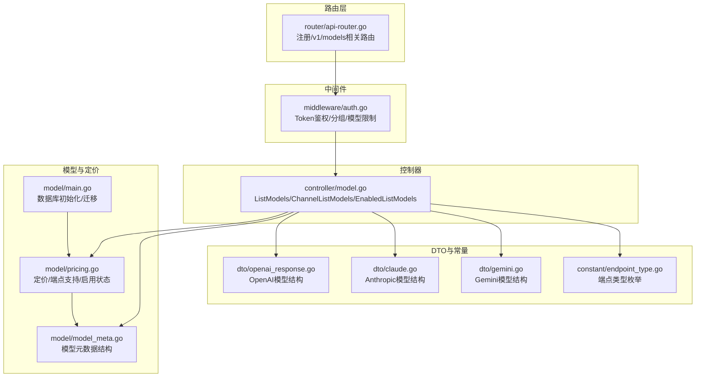
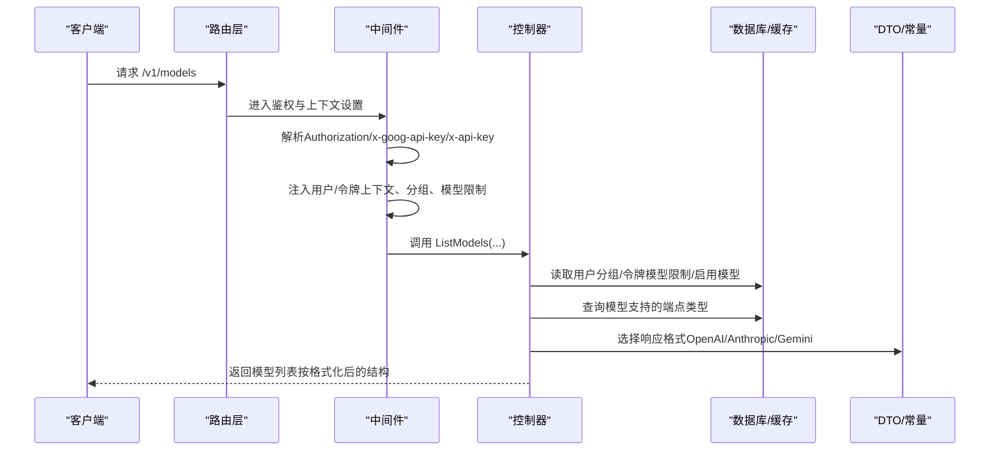
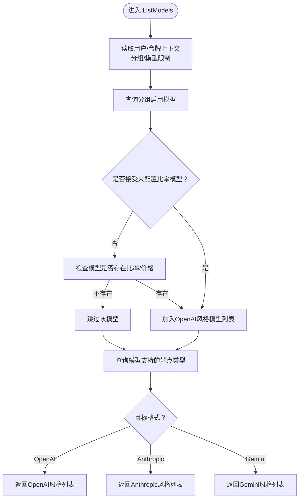
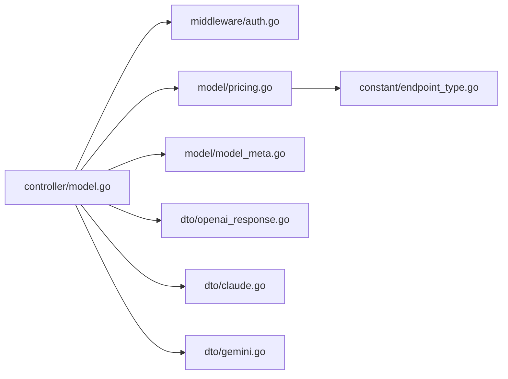

# 模型管理API

<cite>
**本文引用的文件**
- [controller/model.go](file://controller/model.go)
- [router/api-router.go](file://router/api-router.go)
- [middleware/auth.go](file://middleware/auth.go)
- [dto/openai_response.go](file://dto/openai_response.go)
- [dto/claude.go](file://dto/claude.go)
- [dto/gemini.go](file://dto/gemini.go)
- [constant/endpoint_type.go](file://constant/endpoint_type.go)
- [model/model_meta.go](file://model/model_meta.go)
- [model/pricing.go](file://model/pricing.go)
- [model/main.go](file://model/main.go)
</cite>

## 目录
1. [简介](#简介)
2. [项目结构](#项目结构)
3. [核心组件](#核心组件)
4. [架构总览](#架构总览)
5. [详细组件分析](#详细组件分析)
6. [依赖关系分析](#依赖关系分析)
7. [性能考量](#性能考量)
8. [故障排查指南](#故障排查指南)
9. [结论](#结论)

## 简介
本文件面向“模型管理API”的文档，重点围绕/v1/models端点（以及相关路由）展开，说明如何根据请求上下文（如用户令牌、分组、模型启用状态等）返回当前系统支持的模型列表，并解释响应格式如何适配不同客户端（OpenAI、Anthropic、Gemini）。文档还涵盖模型元数据字段（如id、object、created、owned_by等）的来源与含义，以及模型启用/禁用状态对返回结果的影响。

## 项目结构
与模型管理API相关的关键模块：
- 路由层：负责将/v1/models等请求映射到控制器
- 中间件：负责鉴权、令牌解析、分组与模型限制上下文注入
- 控制器：实现模型列表查询、格式化与响应
- DTO与常量：定义响应结构与端点类型
- 模型与定价：提供模型启用状态、端点支持、分组与计费类型等数据



图表来源
- [router/api-router.go](file://router/api-router.go#L1-L261)
- [middleware/auth.go](file://middleware/auth.go#L1-L322)
- [controller/model.go](file://controller/model.go#L1-L290)
- [dto/openai_response.go](file://dto/openai_response.go#L1-L415)
- [dto/claude.go](file://dto/claude.go#L1-L559)
- [dto/gemini.go](file://dto/gemini.go#L1-L464)
- [constant/endpoint_type.go](file://constant/endpoint_type.go#L1-L19)
- [model/model_meta.go](file://model/model_meta.go#L1-L149)
- [model/pricing.go](file://model/pricing.go#L1-L314)
- [model/main.go](file://model/main.go#L1-L479)

章节来源
- [router/api-router.go](file://router/api-router.go#L1-L261)
- [middleware/auth.go](file://middleware/auth.go#L1-L322)
- [controller/model.go](file://controller/model.go#L1-L290)
- [dto/openai_response.go](file://dto/openai_response.go#L1-L415)
- [dto/claude.go](file://dto/claude.go#L1-L559)
- [dto/gemini.go](file://dto/gemini.go#L1-L464)
- [constant/endpoint_type.go](file://constant/endpoint_type.go#L1-L19)
- [model/model_meta.go](file://model/model_meta.go#L1-L149)
- [model/pricing.go](file://model/pricing.go#L1-L314)
- [model/main.go](file://model/main.go#L1-L479)

## 核心组件
- 路由与入口
  - /v1/models端点由路由层注册，控制器中实现模型列表查询逻辑
- 鉴权与上下文
  - 中间件负责解析Authorization/x-goog-api-key/x-api-key等头部，注入用户/令牌上下文、分组、模型限制等
- 控制器
  - ListModels：根据用户分组、令牌模型限制、是否接受未配置比率的模型等条件筛选模型，并按请求目标格式返回
  - ChannelListModels：返回系统内置通道支持的模型清单
  - EnabledListModels：返回启用状态的模型清单
- 数据与格式化
  - OpenAI格式：id、object、created、owned_by、supported_endpoint_types等
  - Anthropic格式：data数组，包含id/display_name等
  - Gemini格式：models数组，包含name/display_name等

章节来源
- [router/api-router.go](file://router/api-router.go#L1-L261)
- [middleware/auth.go](file://middleware/auth.go#L1-L322)
- [controller/model.go](file://controller/model.go#L112-L241)
- [dto/openai_response.go](file://dto/openai_response.go#L1-L415)
- [dto/claude.go](file://dto/claude.go#L1-L559)
- [dto/gemini.go](file://dto/gemini.go#L1-L464)

## 架构总览
/v1/models端点的调用链路如下：



图表来源
- [router/api-router.go](file://router/api-router.go#L1-L261)
- [middleware/auth.go](file://middleware/auth.go#L1-L322)
- [controller/model.go](file://controller/model.go#L112-L241)
- [dto/openai_response.go](file://dto/openai_response.go#L1-L415)
- [dto/claude.go](file://dto/claude.go#L1-L559)
- [dto/gemini.go](file://dto/gemini.go#L1-L464)

## 详细组件分析

### /v1/models 端点与响应格式
- 路由注册
  - /v1/models由路由层注册，控制器中实现模型列表查询逻辑
- 请求上下文与筛选
  - 用户分组：优先使用令牌携带的分组，否则使用用户所属分组；当分组为“auto”时，合并多个自动分组的启用模型
  - 令牌模型限制：若开启模型限制，则仅返回令牌允许的模型
  - 接受未配置比率模型：若系统或用户设置允许，未配置比率/价格的模型也会被返回
  - 模型启用状态：仅返回启用状态的模型
- 响应格式
  - 默认（OpenAI兼容）：返回包含data数组的对象，数组元素为OpenAI风格的模型对象，字段包括id、object、created、owned_by、supported_endpoint_types等
  - Anthropic：返回data数组，每项包含id/display_name等字段
  - Gemini：返回models数组，每项包含name/display_name等字段
- 模型元数据字段说明
  - id：模型名称
  - object：固定为“model”
  - created：时间戳（固定值）
  - owned_by：模型归属方（通道名称或“custom”）
  - supported_endpoint_types：该模型支持的端点类型（如openai、openai-response、anthropic、gemini、embeddings等）

章节来源
- [router/api-router.go](file://router/api-router.go#L1-L261)
- [controller/model.go](file://controller/model.go#L112-L241)
- [constant/endpoint_type.go](file://constant/endpoint_type.go#L1-L19)
- [dto/openai_response.go](file://dto/openai_response.go#L1-L415)
- [dto/claude.go](file://dto/claude.go#L1-L559)
- [dto/gemini.go](file://dto/gemini.go#L1-L464)

### 请求头与上下文注入
- Authorization
  - 中间件解析Bearer令牌，验证用户有效性，并注入用户/令牌上下文
- x-goog-api-key
  - 在特定路径（如/v1beta/models或/v1/models）下，中间件会将该头部转换为Authorization，以便后续流程识别
- x-api-key
  - 在某些场景（如/v1/messages）下，中间件会将该头部转换为Authorization
- 分组与模型限制
  - 中间件根据令牌设置上下文中的分组与模型限制开关，控制器据此筛选模型

章节来源
- [middleware/auth.go](file://middleware/auth.go#L1-L322)

### 数据来源与格式化流程
- 数据来源
  - 用户分组与令牌模型限制：从中间件注入的上下文中读取
  - 启用模型：从数据库/缓存中读取分组启用模型列表
  - 端点支持类型：从定价缓存中读取模型支持的端点类型
  - 模型启用状态：从模型元数据中读取（状态=1为启用）
- 格式化流程
  - 构造OpenAI风格的模型对象
  - 根据目标格式（Anthropic/Gemini/OpenAI）转换字段
  - 返回最终响应



图表来源
- [controller/model.go](file://controller/model.go#L112-L241)
- [model/pricing.go](file://model/pricing.go#L1-L314)

### 模型启用/禁用状态与返回结果
- 启用状态
  - 仅返回状态为启用（例如状态=1）的模型
- 禁用状态
  - 禁用的模型不会出现在返回列表中
- 分组与自动分组
  - 当分组为“auto”时，会合并多个自动分组的启用模型，去重后返回
- 令牌模型限制
  - 若开启令牌模型限制，仅返回令牌允许的模型

章节来源
- [controller/model.go](file://controller/model.go#L112-L241)
- [model/pricing.go](file://model/pricing.go#L265-L314)
- [model/model_meta.go](file://model/model_meta.go#L1-L149)

### 类图：模型与响应结构
```mermaid
classDiagram
class OpenAIModels {
+string id
+string object
+int64 created
+string owned_by
+EndpointType[] supported_endpoint_types
}
class AnthropicModel {
+string id
+string display_name
+string type
+string created_at
}
class GeminiModel {
+string name
+string display_name
}
class EndpointType {
<<enumeration>>
"openai"
"openai-response"
"anthropic"
"gemini"
"embeddings"
"image-generation"
"openai-video"
"jina-rerank"
}
OpenAIModels --> EndpointType : "支持端点类型"
```

图表来源
- [dto/openai_response.go](file://dto/openai_response.go#L1-L415)
- [dto/claude.go](file://dto/claude.go#L1-L559)
- [dto/gemini.go](file://dto/gemini.go#L1-L464)
- [constant/endpoint_type.go](file://constant/endpoint_type.go#L1-L19)

## 依赖关系分析
- 控制器依赖
  - 中间件：提供用户/令牌上下文、分组、模型限制
  - 定价缓存：提供模型支持的端点类型、启用分组、计费类型
  - 模型元数据：提供模型状态、描述、图标、标签、供应商等
- 响应格式依赖
  - OpenAI风格：使用OpenAIModels结构
  - Anthropic风格：使用AnthropicModel结构
  - Gemini风格：使用GeminiModel结构
- 端点类型依赖
  - EndpointType枚举定义了支持的端点类型，用于标注模型支持的端点



图表来源
- [controller/model.go](file://controller/model.go#L1-L290)
- [middleware/auth.go](file://middleware/auth.go#L1-L322)
- [model/pricing.go](file://model/pricing.go#L1-L314)
- [model/model_meta.go](file://model/model_meta.go#L1-L149)
- [dto/openai_response.go](file://dto/openai_response.go#L1-L415)
- [dto/claude.go](file://dto/claude.go#L1-L559)
- [dto/gemini.go](file://dto/gemini.go#L1-L464)
- [constant/endpoint_type.go](file://constant/endpoint_type.go#L1-L19)

## 性能考量
- 缓存与批量查询
  - 定价缓存定期更新，减少频繁查询数据库
  - 批量查询模型支持的端点类型，避免N+1查询
- 分组与自动分组
  - “auto”分组会合并多个分组的启用模型，注意去重与合并成本
- 比率检查
  - 若关闭接受未配置比率模型，则会对每个模型进行比率/价格检查，建议合理设置以减少不必要的过滤

[本节为通用指导，无需列出具体文件来源]

## 故障排查指南
- 无权限或令牌无效
  - 中间件会校验Authorization/x-goog-api-key/x-api-key等头部，若无效会返回相应错误
- 用户被封禁
  - 中间件会检查用户状态，封禁用户会被拒绝访问
- 模型未返回
  - 检查模型状态是否为启用
  - 检查分组与令牌模型限制是否正确设置
  - 检查是否开启了“接受未配置比率模型”的策略

章节来源
- [middleware/auth.go](file://middleware/auth.go#L1-L322)
- [controller/model.go](file://controller/model.go#L112-L241)
- [model/pricing.go](file://model/pricing.go#L265-L314)

## 结论
/v1/models端点通过中间件注入的上下文与数据库/缓存的数据，实现了对模型列表的灵活筛选与格式化输出。OpenAI、Anthropic、Gemini三种格式的响应均由控制器统一生成，确保与不同客户端的兼容性。模型启用/禁用状态、分组与令牌模型限制共同决定了最终返回的模型集合。通过合理的配置与缓存策略，可获得稳定高效的模型列表查询体验。