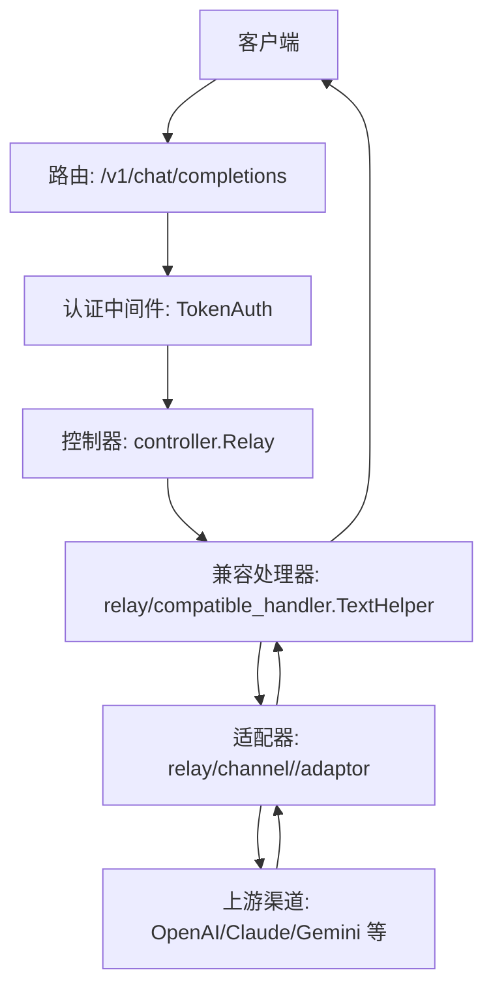
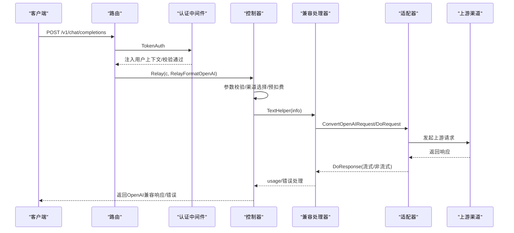
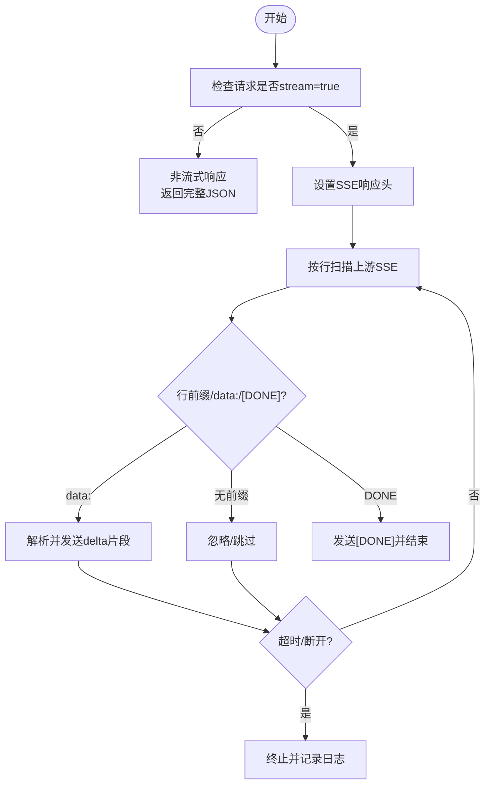
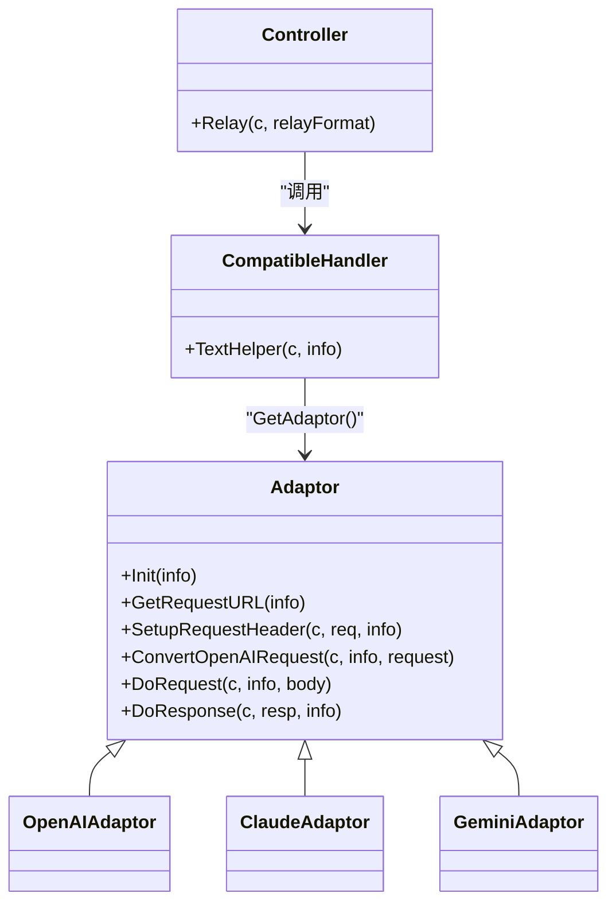
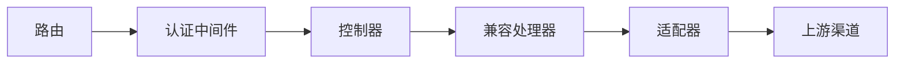

# 聊天API

<cite>
**本文引用的文件**
- [main.go](file://main.go)
- [router/relay-router.go](file://router/relay-router.go)
- [middleware/auth.go](file://middleware/auth.go)
- [controller/relay.go](file://controller/relay.go)
- [relay/compatible_handler.go](file://relay/compatible_handler.go)
- [relay/helper/common.go](file://relay/helper/common.go)
- [relay/helper/stream_scanner.go](file://relay/helper/stream_scanner.go)
- [relay/channel/adapter.go](file://relay/channel/adapter.go)
- [relay/channel/openai/adaptor.go](file://relay/channel/openai/adaptor.go)
- [relay/channel/claude/adaptor.go](file://relay/channel/claude/adaptor.go)
- [relay/channel/gemini/adaptor.go](file://relay/channel/gemini/adaptor.go)
- [dto/openai_request.go](file://dto/openai_request.go)
- [dto/openai_response.go](file://dto/openai_response.go)
</cite>

## 目录
1. [简介](#简介)
2. [项目结构](#项目结构)
3. [核心组件](#核心组件)
4. [架构总览](#架构总览)
5. [详细组件分析](#详细组件分析)
6. [依赖关系分析](#依赖关系分析)
7. [性能考虑](#性能考虑)
8. [故障排查指南](#故障排查指南)
9. [结论](#结论)
10. [附录](#附录)

## 简介
本文件面向开发者与集成者，系统化说明聊天API的HTTP接口与内部实现，重点覆盖：
- /v1/chat/completions 端点的HTTP POST方法与请求/响应规范
- 认证方式（Bearer Token）
- 请求体JSON模式（含model、messages、temperature等）
- 响应格式与流式响应（SSE）行为
- 与OpenAI API的兼容性与差异
- 后端通过compatible_handler与适配器转发到不同AI服务（Claude、Gemini等）
- 错误处理（401认证失败、429限流等）
- 性能优化建议（合理设置max_tokens）

## 项目结构
聊天API属于“中继”体系，入口由路由注册，经认证中间件校验后进入控制器，再由兼容处理器与适配器层转发至具体上游渠道（OpenAI、Claude、Gemini等），最终回传给客户端。

图表来源
- [router/relay-router.go](file://router/relay-router.go#L74-L96)
- [middleware/auth.go](file://middleware/auth.go#L197-L216)
- [controller/relay.go](file://controller/relay.go#L64-L106)
- [relay/compatible_handler.go](file://relay/compatible_handler.go#L28-L190)
- [relay/channel/adapter.go](file://relay/channel/adapter.go#L15-L33)

章节来源
- [router/relay-router.go](file://router/relay-router.go#L74-L96)
- [middleware/auth.go](file://middleware/auth.go#L197-L216)

## 核心组件
- 路由与入口
  - /v1/chat/completions 对应 POST 方法，由路由注册到控制器
- 认证中间件
  - TokenAuth 统一处理 Authorization: Bearer <密钥>，并注入用户上下文
- 控制器
  - Relay 负责参数校验、渠道选择、预扣费、重试与错误处理
- 兼容处理器
  - TextHelper 负责将通用OpenAI请求映射到各上游，处理流式与非流式响应
- 适配器
  - OpenAI/Claude/Gemini 等适配器负责请求URL、Header、请求体转换与响应处理
- DTO
  - OpenAI请求/响应结构体定义了消息、流式片段、Usage等

章节来源
- [router/relay-router.go](file://router/relay-router.go#L74-L96)
- [middleware/auth.go](file://middleware/auth.go#L197-L216)
- [controller/relay.go](file://controller/relay.go#L64-L106)
- [relay/compatible_handler.go](file://relay/compatible_handler.go#L28-L190)
- [relay/channel/adapter.go](file://relay/channel/adapter.go#L15-L33)
- [dto/openai_request.go](file://dto/openai_request.go#L26-L80)
- [dto/openai_response.go](file://dto/openai_response.go#L24-L47)

## 架构总览
下图展示了从客户端到上游渠道的关键交互流程，以及认证、预扣费、重试与错误处理的控制流。

图表来源
- [router/relay-router.go](file://router/relay-router.go#L74-L96)
- [middleware/auth.go](file://middleware/auth.go#L197-L216)
- [controller/relay.go](file://controller/relay.go#L64-L106)
- [relay/compatible_handler.go](file://relay/compatible_handler.go#L28-L190)
- [relay/channel/adapter.go](file://relay/channel/adapter.go#L15-L33)

## 详细组件分析

### /v1/chat/completions 端点
- HTTP方法：POST
- 路由位置：/v1/chat/completions
- 认证：需携带 Authorization: Bearer <密钥>
- 请求体：JSON，遵循OpenAI兼容模式（见下一节）
- 响应：OpenAI兼容格式；若stream=true则为SSE流

章节来源
- [router/relay-router.go](file://router/relay-router.go#L74-L96)
- [middleware/auth.go](file://middleware/auth.go#L197-L216)

### 请求体JSON模式（OpenAI兼容）
- 必填字段
  - model: 字符串，目标模型名
  - messages: 数组，元素为对象，包含role与content
- 常用可选字段
  - stream: 布尔，开启SSE流式响应
  - stream_options: 对象，包含include_usage（仅部分上游支持）
  - max_tokens/max_completion_tokens: 整数，限制最大输出长度
  - temperature/top_p/n: 数值/整数，采样参数
  - tools/tool_choice/response_format等：函数调用与格式控制
- 其他字段
  - user、seed、stop、logprobs、top_logprobs、metadata等
- 媒体内容
  - content支持文本、图片URL、音频、文件、视频等多种媒体组合

章节来源
- [dto/openai_request.go](file://dto/openai_request.go#L26-L80)
- [dto/openai_request.go](file://dto/openai_request.go#L283-L396)
- [dto/openai_request.go](file://dto/openai_request.go#L500-L610)

### 响应格式与SSE流式
- 非流式响应
  - 结构：包含id、object、created、model、choices、usage等
  - choices[].message.role/content/…，choices[].finish_reason
- 流式响应（SSE）
  - Content-Type: text/event-stream
  - 每条数据以"data: "开头，最后一条为"[DONE]"
  - choices[].delta.content/…，choices[].finish_reason
  - 可选usage（取决于上游与stream_options.include_usage）
- SSE扫描与心跳
  - StreamScannerHandler按行扫描上游SSE，处理心跳与超时
  - SetEventStreamHeaders设置SSE必要响应头

图表来源
- [relay/helper/common.go](file://relay/helper/common.go#L41-L55)
- [relay/helper/stream_scanner.go](file://relay/helper/stream_scanner.go#L180-L273)

章节来源
- [dto/openai_response.go](file://dto/openai_response.go#L80-L171)
- [dto/openai_response.go](file://dto/openai_response.go#L222-L265)
- [relay/helper/common.go](file://relay/helper/common.go#L41-L55)
- [relay/helper/stream_scanner.go](file://relay/helper/stream_scanner.go#L180-L273)

### 与OpenAI API的兼容性
- 兼容点
  - 端点与请求/响应结构基本一致
  - 支持stream与stream_options.include_usage
  - 支持tools/tool_choice/response_format等高级特性
- 差异点
  - 部分上游不支持某些字段（如stream_options），兼容层会自动移除或强制设置
  - 不同上游对reasoning/thinking后缀、参数语义存在差异，适配器会做转换
  - Azure/OpenRouter等特殊路径与Header处理

章节来源
- [relay/compatible_handler.go](file://relay/compatible_handler.go#L50-L66)
- [relay/channel/openai/adaptor.go](file://relay/channel/openai/adaptor.go#L216-L336)
- [relay/channel/openai/adaptor.go](file://relay/channel/openai/adaptor.go#L110-L179)

### 后端处理链路与适配器
- 入口
  - 路由 -> TokenAuth -> controller.Relay -> compatible_handler.TextHelper
- 兼容层
  - 解析请求、模型映射、系统提示注入、参数覆盖、SSE探测
- 适配器
  - OpenAI/Claude/Gemini等适配器分别负责：
    - 请求URL构建与Header设置
    - 请求体转换（OpenAI <-> 上游）
    - 响应处理（流式/非流式）
- 上游
  - OpenAI、Anthropic、Google Gemini、Azure OpenAI等

图表来源
- [controller/relay.go](file://controller/relay.go#L64-L106)
- [relay/compatible_handler.go](file://relay/compatible_handler.go#L28-L190)
- [relay/channel/adapter.go](file://relay/channel/adapter.go#L15-L33)
- [relay/channel/openai/adaptor.go](file://relay/channel/openai/adaptor.go#L110-L179)
- [relay/channel/claude/adaptor.go](file://relay/channel/claude/adaptor.go#L55-L87)
- [relay/channel/gemini/adaptor.go](file://relay/channel/gemini/adaptor.go#L128-L169)

章节来源
- [controller/relay.go](file://controller/relay.go#L64-L106)
- [relay/compatible_handler.go](file://relay/compatible_handler.go#L28-L190)
- [relay/channel/adapter.go](file://relay/channel/adapter.go#L15-L33)
- [relay/channel/openai/adaptor.go](file://relay/channel/openai/adaptor.go#L110-L179)
- [relay/channel/claude/adaptor.go](file://relay/channel/claude/adaptor.go#L55-L87)
- [relay/channel/gemini/adaptor.go](file://relay/channel/gemini/adaptor.go#L128-L169)

### 认证与限流
- 认证
  - Authorization: Bearer <密钥>，TokenAuth会校验并注入用户上下文
  - 部分上游路径（/v1/messages、/v1beta/models）有额外Header/Query键处理
- 限流
  - 路由层使用模型级请求限流中间件
  - 控制器层对上游错误（如429）进行重试策略与渠道禁用

章节来源
- [middleware/auth.go](file://middleware/auth.go#L197-L216)
- [router/relay-router.go](file://router/relay-router.go#L63-L73)
- [controller/relay.go](file://controller/relay.go#L253-L293)

### 错误处理
- 认证失败（401）
  - TokenAuth返回OpenAI风格错误
- 限流（429）
  - 控制器层判定并重试或返回上游错误
- 其他错误
  - 适配器DoRequest/DoResponse阶段捕获并映射为NewAPIError
  - 记录错误日志并返回统一OpenAI错误结构

章节来源
- [middleware/auth.go](file://middleware/auth.go#L238-L240)
- [controller/relay.go](file://controller/relay.go#L253-L293)
- [relay/compatible_handler.go](file://relay/compatible_handler.go#L158-L190)

### 性能优化建议
- 合理设置max_tokens/max_completion_tokens，避免过长输出导致成本与延迟上升
- 使用stream=true获得低延迟首字节体验，结合SSE心跳与超时控制
- 选择合适的模型与参数（temperature/top_p），平衡质量与速度
- 使用模型映射与参数覆盖减少不必要的上游字段，降低网络与解析开销

章节来源
- [dto/openai_request.go](file://dto/openai_request.go#L26-L80)
- [relay/compatible_handler.go](file://relay/compatible_handler.go#L50-L66)
- [relay/helper/stream_scanner.go](file://relay/helper/stream_scanner.go#L24-L29)

## 依赖关系分析
- 路由依赖认证中间件与分发中间件
- 控制器依赖兼容处理器与适配器
- 兼容处理器依赖适配器与上游响应处理
- 适配器依赖具体渠道的请求/响应转换

图表来源
- [router/relay-router.go](file://router/relay-router.go#L74-L96)
- [middleware/auth.go](file://middleware/auth.go#L197-L216)
- [controller/relay.go](file://controller/relay.go#L64-L106)
- [relay/compatible_handler.go](file://relay/compatible_handler.go#L28-L190)
- [relay/channel/adapter.go](file://relay/channel/adapter.go#L15-L33)

章节来源
- [router/relay-router.go](file://router/relay-router.go#L74-L96)
- [middleware/auth.go](file://middleware/auth.go#L197-L216)
- [controller/relay.go](file://controller/relay.go#L64-L106)
- [relay/compatible_handler.go](file://relay/compatible_handler.go#L28-L190)
- [relay/channel/adapter.go](file://relay/channel/adapter.go#L15-L33)

## 性能考虑
- 流式传输
  - 使用SSE与StreamScannerHandler，合理设置超时与心跳间隔
- 资源管理
  - 扫描器缓冲区大小可配置，避免过大内存占用
- 重试与退避
  - 控制器层对上游错误进行有限次重试，避免雪崩
- 预扣费与补扣费
  - 兼容处理器在完成后根据实际用量进行补扣或返还

章节来源
- [relay/helper/stream_scanner.go](file://relay/helper/stream_scanner.go#L24-L29)
- [relay/compatible_handler.go](file://relay/compatible_handler.go#L192-L469)
- [controller/relay.go](file://controller/relay.go#L160-L206)

## 故障排查指南
- 401 未授权
  - 检查Authorization头是否为Bearer <密钥>，确认密钥有效与IP白名单
- 429 限流
  - 观察上游返回，控制器层会自动重试；必要时降低并发或调整限流策略
- SSE无数据/断流
  - 检查上游是否返回SSE，确认SetEventStreamHeaders已设置
  - 查看StreamScannerHandler日志，关注超时与心跳
- 响应格式异常
  - 确认上游是否支持stream_options/include_usage
  - 检查适配器转换逻辑（如OpenAI/Claude/Gemini差异）

章节来源
- [middleware/auth.go](file://middleware/auth.go#L238-L240)
- [controller/relay.go](file://controller/relay.go#L253-L293)
- [relay/helper/common.go](file://relay/helper/common.go#L41-L55)
- [relay/helper/stream_scanner.go](file://relay/helper/stream_scanner.go#L180-L273)

## 结论
本聊天API以OpenAI兼容为核心，通过统一的路由、认证、控制器与兼容处理器，将请求适配到多家上游渠道，既保证了易用性，又提供了灵活的扩展能力。SSE流式响应与完善的错误处理机制提升了用户体验与稳定性。建议在生产环境中合理设置参数与限流策略，充分利用模型映射与参数覆盖，以获得更优的成本与性能表现。

## 附录

### OpenAI兼容请求示例（文字描述）
- 请求头
  - Authorization: Bearer <你的密钥>
  - Content-Type: application/json
- 请求体
  - model: "gpt-4o"
  - messages:
    - [{ role: "system", content: "你是助手" }]
    - [{ role: "user", content: "你好" }]
  - stream: true/false
  - max_tokens: 1024
  - temperature: 0.7
- 响应
  - 非流式：完整JSON，包含choices与usage
  - 流式：SSE，逐条delta，最后[DONE]

章节来源
- [dto/openai_request.go](file://dto/openai_request.go#L26-L80)
- [dto/openai_response.go](file://dto/openai_response.go#L24-L47)
- [dto/openai_response.go](file://dto/openai_response.go#L80-L171)