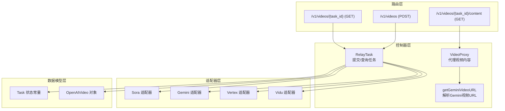
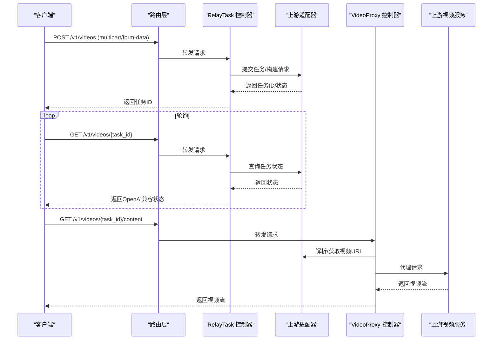
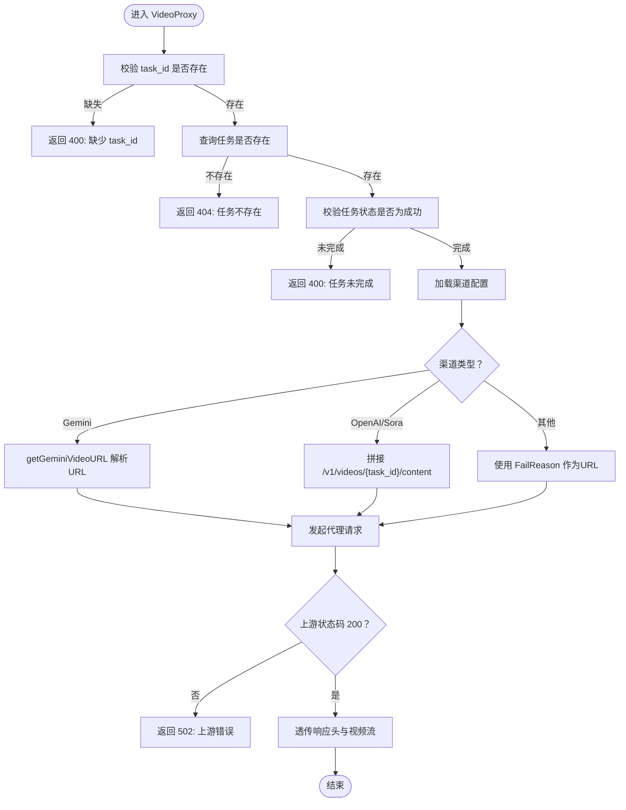
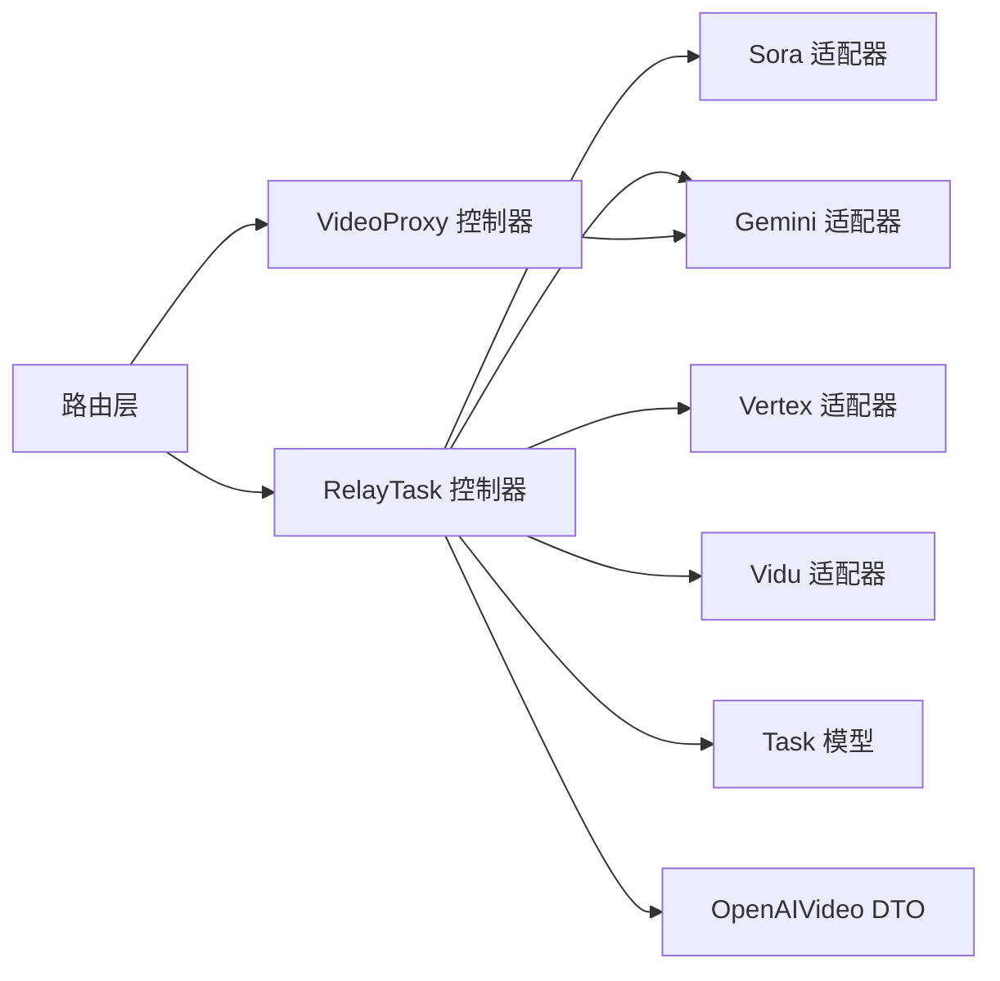

# 视频生成API

<cite>
**本文引用的文件列表**
- [router/video-router.go](file://router/video-router.go)
- [controller/video_proxy.go](file://controller/video_proxy.go)
- [controller/video_proxy_gemini.go](file://controller/video_proxy_gemini.go)
- [controller/relay_task.go](file://controller/relay_task.go)
- [dto/openai_video.go](file://dto/openai_video.go)
- [dto/video.go](file://dto/video.go)
- [model/task.go](file://model/task.go)
- [relay/channel/task/sora/adaptor.go](file://relay/channel/task/sora/adaptor.go)
- [relay/channel/task/gemini/adaptor.go](file://relay/channel/task/gemini/adaptor.go)
- [relay/channel/task/vertex/adaptor.go](file://relay/channel/task/vertex/adaptor.go)
- [relay/channel/task/vidu/adaptor.go](file://relay/channel/task/vidu/adaptor.go)
- [relay/common/relay_utils.go](file://relay/common/relay_utils.go)
- [docs/openapi/relay.json](file://docs/openapi/relay.json)
</cite>

## 目录
1. [简介](#简介)
2. [项目结构](#项目结构)
3. [核心组件](#核心组件)
4. [架构总览](#架构总览)
5. [详细组件分析](#详细组件分析)
6. [依赖关系分析](#依赖关系分析)
7. [性能考量](#性能考量)
8. [故障排查指南](#故障排查指南)
9. [结论](#结论)
10. [附录](#附录)

## 简介
本文件面向“视频生成API”的使用者与维护者，系统性说明基于OpenAI兼容格式的视频生成能力，重点覆盖以下内容：
- /v1/videos端点的POST请求（multipart/form-data），支持prompt、model、seconds以及可选的input_reference（参考图）。
- 异步任务模式：先返回任务ID，随后通过/v1/videos/{task_id}轮询状态，最终通过/v1/videos/{task_id}/content获取视频文件。
- 后端通过video_proxy对上游视频生成服务进行代理与整合，当前已对接的服务包括Gemini、OpenAI/Sora等。
- 提供完整的端到端使用流程示例、错误处理策略与视频文件下载方式。

## 项目结构
视频生成API由路由层、控制器层、适配器层与数据模型层协同完成。关键路径如下：
- 路由层：在/v1下注册视频相关端点，统一鉴权与分发。
- 控制器层：负责任务提交、状态查询与视频内容代理。
- 适配器层：封装各上游服务（如Sora、Gemini、Vertex、Vidu）的请求/响应转换与任务状态映射。
- 数据模型层：任务状态常量与OpenAI兼容视频对象。

图表来源
- [router/video-router.go](file://router/video-router.go#L10-L24)
- [controller/relay_task.go](file://controller/relay_task.go)
- [controller/video_proxy.go](file://controller/video_proxy.go#L19-L189)
- [controller/video_proxy_gemini.go](file://controller/video_proxy_gemini.go#L1-L159)
- [relay/channel/task/sora/adaptor.go](file://relay/channel/task/sora/adaptor.go#L1-L215)
- [relay/channel/task/gemini/adaptor.go](file://relay/channel/task/gemini/adaptor.go#L1-L310)
- [relay/channel/task/vertex/adaptor.go](file://relay/channel/task/vertex/adaptor.go#L1-L389)
- [relay/channel/task/vidu/adaptor.go](file://relay/channel/task/vidu/adaptor.go#L1-L320)
- [model/task.go](file://model/task.go#L1-L40)
- [dto/openai_video.go](file://dto/openai_video.go#L1-L53)

章节来源
- [router/video-router.go](file://router/video-router.go#L10-L24)

## 核心组件
- 路由与鉴权
  - /v1/videos（POST）：提交视频生成任务，兼容OpenAI格式。
  - /v1/videos/{task_id}（GET）：查询任务状态。
  - /v1/videos/{task_id}/content（GET）：代理获取视频文件流。
  - 统一使用Token鉴权与分发中间件。
- 控制器
  - RelayTask：统一处理视频任务提交与状态查询，适配多上游服务。
  - VideoProxy：根据任务状态与渠道类型，代理上游视频内容。
  - getGeminiVideoURL：从任务数据或上游任务查询中解析Gemini视频URL。
- DTO与模型
  - OpenAIVideo：用于统一返回视频任务状态与元数据。
  - TaskStatus：任务状态常量与OpenAI状态映射。
- 上游适配器
  - Sora、Gemini、Vertex、Vidu：负责请求构造、任务状态映射与结果转换。

章节来源
- [router/video-router.go](file://router/video-router.go#L10-L24)
- [controller/relay_task.go](file://controller/relay_task.go)
- [controller/video_proxy.go](file://controller/video_proxy.go#L19-L189)
- [controller/video_proxy_gemini.go](file://controller/video_proxy_gemini.go#L1-L159)
- [dto/openai_video.go](file://dto/openai_video.go#L1-L53)
- [model/task.go](file://model/task.go#L1-L40)

## 架构总览
下图展示从客户端到上游视频服务的整体调用链路与数据流转。

图表来源
- [router/video-router.go](file://router/video-router.go#L10-L24)
- [controller/relay_task.go](file://controller/relay_task.go)
- [controller/video_proxy.go](file://controller/video_proxy.go#L19-L189)
- [controller/video_proxy_gemini.go](file://controller/video_proxy_gemini.go#L1-L159)
- [relay/channel/task/sora/adaptor.go](file://relay/channel/task/sora/adaptor.go#L1-L215)
- [relay/channel/task/gemini/adaptor.go](file://relay/channel/task/gemini/adaptor.go#L1-L310)
- [relay/channel/task/vertex/adaptor.go](file://relay/channel/task/vertex/adaptor.go#L1-L389)
- [relay/channel/task/vidu/adaptor.go](file://relay/channel/task/vidu/adaptor.go#L1-L320)

## 详细组件分析

### 路由与端点
- /v1/videos（POST）
  - 请求体为multipart/form-data，包含字段：
    - model：模型名称（例如 sora-2、sora-2-pro 等）。
    - prompt：提示词。
    - seconds：生成时长（字符串形式）。
    - input_reference：可选的参考图片文件（二进制）。
  - 响应：返回任务ID与OpenAI兼容的任务状态对象。
- /v1/videos/{task_id}（GET）
  - 查询任务状态，返回OpenAI兼容的视频任务对象。
- /v1/videos/{task_id}/content（GET）
  - 代理获取已完成任务的视频文件流。

章节来源
- [docs/openapi/relay.json](file://docs/openapi/relay.json#L506-L749)
- [router/video-router.go](file://router/video-router.go#L10-L24)

### 控制器：RelayTask（任务提交与状态查询）
- 功能要点
  - 接收OpenAI兼容的multipart/form-data请求，解析字段并设置默认值（如尺寸、秒数）。
  - 根据model与输入字段选择任务动作（如生成/参考生成）。
  - 将请求转发给对应上游适配器，提交任务并返回任务ID。
  - 在查询任务状态时，将上游状态映射为OpenAI兼容状态。
- 关键行为
  - Sora兼容参数校验与价格比率计算。
  - 任务状态到OpenAI状态的映射。
  - 非OpenAI路径下的兼容输出（format、status、task_id、url）。

章节来源
- [controller/relay_task.go](file://controller/relay_task.go)
- [relay/common/relay_utils.go](file://relay/common/relay_utils.go#L156-L202)
- [model/task.go](file://model/task.go#L1-L40)

### 控制器：VideoProxy（视频内容代理）
- 功能要点
  - 校验task_id与任务状态（仅在成功后允许拉取内容）。
  - 根据渠道类型构造上游请求：
    - Gemini：通过getGeminiVideoURL解析视频URL并附加API Key。
    - OpenAI/Sora：直接拼接/v1/videos/{task_id}/content。
    - 其他渠道：从任务FailReason中提取URL。
  - 代理上游视频流并设置缓存头。
- 错误处理
  - 缺少task_id、任务不存在、任务未完成、上游状态非200、URL解析失败等均返回相应错误。

图表来源
- [controller/video_proxy.go](file://controller/video_proxy.go#L19-L189)
- [controller/video_proxy_gemini.go](file://controller/video_proxy_gemini.go#L1-L159)

章节来源
- [controller/video_proxy.go](file://controller/video_proxy.go#L19-L189)

### 控制器：getGeminiVideoURL（Gemini视频URL解析）
- 功能要点
  - 优先从任务Data中提取已存在的视频URI。
  - 若不可用，则调用上游适配器FetchTask获取任务结果，解析生成的视频URI。
  - 确保URI包含API Key参数。
- 失败场景
  - 适配器未找到、API Key缺失、解析失败、未找到视频URI等。

章节来源
- [controller/video_proxy_gemini.go](file://controller/video_proxy_gemini.go#L1-L159)
- [relay/channel/task/gemini/adaptor.go](file://relay/channel/task/gemini/adaptor.go#L1-L310)

### 上游适配器：Sora/Gemini/Vertex/Vidu
- Sora
  - 任务状态映射：queued/pending→Queued；processing/in_progress→InProgress；completed→Success；failed/cancelled→Failure。
  - 完成时设置任务URL为/v1/videos/{task_id}/content。
- Gemini
  - 任务ID编码为本地ID，完成后设置远程URL为上游生成的URI。
  - ConvertToOpenAIVideo将内部状态映射为OpenAI兼容状态。
- Vertex
  - 任务状态映射与Sora类似。
  - 若FailReason以data:开头，将其作为元数据URL。
- Vidu
  - 任务状态映射：created/queueing→Submitted；processing→InProgress；success→Success；failed→Failure。
  - ConvertToOpenAIVideo将第一个creation的URL写入元数据。

章节来源
- [relay/channel/task/sora/adaptor.go](file://relay/channel/task/sora/adaptor.go#L185-L215)
- [relay/channel/task/gemini/adaptor.go](file://relay/channel/task/gemini/adaptor.go#L257-L310)
- [relay/channel/task/vertex/adaptor.go](file://relay/channel/task/vertex/adaptor.go#L340-L389)
- [relay/channel/task/vidu/adaptor.go](file://relay/channel/task/vidu/adaptor.go#L255-L320)

### 数据模型与DTO
- OpenAIVideo
  - 字段：id、object、model、status、progress、created_at、completed_at、seconds、size、error、metadata等。
  - 提供SetProgressStr与SetMetadata辅助方法。
- TaskStatus
  - 内部状态与OpenAI状态的映射：Queued/Submitted→queued；InProgress→in_progress；Success→completed；Failure→failed。

章节来源
- [dto/openai_video.go](file://dto/openai_video.go#L1-L53)
- [model/task.go](file://model/task.go#L1-L40)

## 依赖关系分析
- 路由到控制器
  - /v1/videos → RelayTask
  - /v1/videos/{task_id} → RelayTask
  - /v1/videos/{task_id}/content → VideoProxy
- 控制器到适配器
  - RelayTask根据渠道类型选择对应适配器（Sora/Gemini/Vertex/Vidu）。
- 控制器到模型与DTO
  - VideoProxy依赖Task模型与OpenAIVideo DTO。
- 适配器到上游服务
  - 通过HTTP客户端与渠道BaseURL交互，解析任务状态与视频URL。

图表来源
- [router/video-router.go](file://router/video-router.go#L10-L24)
- [controller/relay_task.go](file://controller/relay_task.go)
- [controller/video_proxy.go](file://controller/video_proxy.go#L19-L189)
- [dto/openai_video.go](file://dto/openai_video.go#L1-L53)
- [model/task.go](file://model/task.go#L1-L40)
- [relay/channel/task/sora/adaptor.go](file://relay/channel/task/sora/adaptor.go#L1-L215)
- [relay/channel/task/gemini/adaptor.go](file://relay/channel/task/gemini/adaptor.go#L1-L310)
- [relay/channel/task/vertex/adaptor.go](file://relay/channel/task/vertex/adaptor.go#L1-L389)
- [relay/channel/task/vidu/adaptor.go](file://relay/channel/task/vidu/adaptor.go#L1-L320)

## 性能考量
- 代理超时控制：VideoProxy使用上下文超时，避免长时间阻塞。
- 缓存策略：代理返回设置Cache-Control，便于CDN缓存视频内容。
- 并发与分发：路由层统一启用鉴权与分发中间件，有助于负载均衡与限流。
- 上游请求优化：适配器按需构造请求，减少不必要的网络往返。

章节来源
- [controller/video_proxy.go](file://controller/video_proxy.go#L92-L189)

## 故障排查指南
- 400 缺少task_id
  - 检查请求参数是否包含task_id。
- 404 任务不存在
  - 确认任务ID正确且尚未过期。
- 400 任务未完成
  - 继续轮询/v1/videos/{task_id}直至状态为completed。
- 502 上游错误
  - 检查上游服务可用性、鉴权信息与网络连通性。
- 500 API Key缺失（Gemini）
  - 确认任务存储的API Key有效且未过期。
- 视频URL解析失败
  - 检查任务Data或上游FetchTask响应中是否包含视频URI。

章节来源
- [controller/video_proxy.go](file://controller/video_proxy.go#L19-L189)
- [controller/video_proxy_gemini.go](file://controller/video_proxy_gemini.go#L1-L159)

## 结论
该视频生成API以OpenAI兼容格式为核心，结合统一的RelayTask控制器与多渠道适配器，实现了从任务提交、状态查询到视频内容代理的完整闭环。通过VideoProxy对上游服务的抽象与代理，系统能够灵活扩展至更多视频生成服务，同时保持对外一致的API体验。

## 附录

### 端到端使用流程示例
- 步骤1：提交任务
  - 方法：POST /v1/videos
  - 表单字段：model、prompt、seconds、input_reference（可选）
  - 返回：任务ID与初始状态
- 步骤2：轮询状态
  - 方法：GET /v1/videos/{task_id}
  - 返回：OpenAI兼容的视频任务对象（包含status、progress、created_at、seconds等）
- 步骤3：获取视频
  - 方法：GET /v1/videos/{task_id}/content
  - 返回：视频文件流（MP4等），可通过浏览器或下载工具保存

章节来源
- [docs/openapi/relay.json](file://docs/openapi/relay.json#L506-L749)
- [router/video-router.go](file://router/video-router.go#L10-L24)

### 错误处理与状态对照
- 任务状态映射
  - Internal：NOT_START/SUBMITTED/QUEUED/IN_PROGRESS/FAILURE/SUCCESS/UNKNOWN → OpenAI：queued/in_progress/completed/failed/unknown
- 常见错误
  - 缺少参数、任务不存在、任务未完成、上游服务异常、URL解析失败等

章节来源
- [model/task.go](file://model/task.go#L1-L40)
- [dto/openai_video.go](file://dto/openai_video.go#L1-L53)
- [controller/video_proxy.go](file://controller/video_proxy.go#L19-L189)