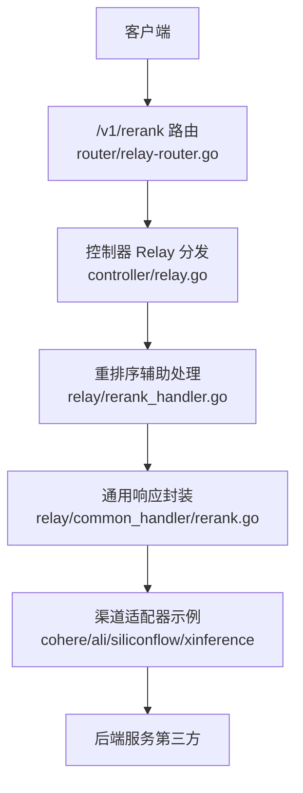
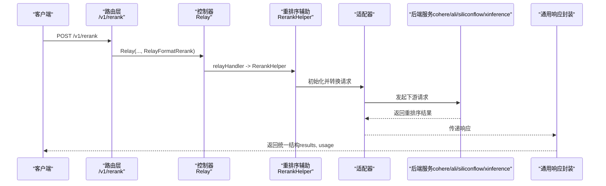
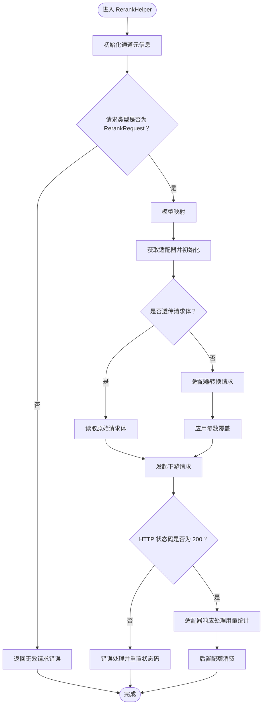
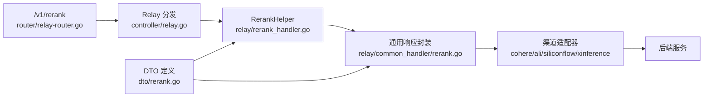

# 重排序API

<cite>
**本文引用的文件**
- [main.go](file://main.go)
- [router/main.go](file://router/main.go)
- [router/relay-router.go](file://router/relay-router.go)
- [docs/openapi/relay.json](file://docs/openapi/relay.json)
- [controller/relay.go](file://controller/relay.go)
- [relay/rerank_handler.go](file://relay/rerank_handler.go)
- [relay/common_handler/rerank.go](file://relay/common_handler/rerank.go)
- [dto/rerank.go](file://dto/rerank.go)
- [relay/channel/cohere/relay-cohere.go](file://relay/channel/cohere/relay-cohere.go)
- [relay/channel/cohere/dto.go](file://relay/channel/cohere/dto.go)
- [relay/channel/ali/rerank.go](file://relay/channel/ali/rerank.go)
- [relay/channel/ali/dto.go](file://relay/channel/ali/dto.go)
- [relay/channel/siliconflow/relay-siliconflow.go](file://relay/channel/siliconflow/relay-siliconflow.go)
- [relay/channel/xinference/dto.go](file://relay/channel/xinference/dto.go)
</cite>

## 目录
1. [简介](#简介)
2. [项目结构](#项目结构)
3. [核心组件](#核心组件)
4. [架构总览](#架构总览)
5. [详细组件分析](#详细组件分析)
6. [依赖关系分析](#依赖关系分析)
7. [性能考量](#性能考量)
8. [故障排查指南](#故障排查指南)
9. [结论](#结论)
10. [附录](#附录)

## 简介
本文件面向开发者与使用者，系统化说明“重排序API”的设计与使用，重点覆盖以下内容：
- 端点定义与访问路径：/v1/rerank
- 请求参数：model、query（查询文本）、documents（文档列表），以及可选参数 top_n、return_documents、max_chunk_per_doc、overlap_tokens
- 返回结果：results 数组，其中每个元素包含 index、relevance_score，以及可选的 document 字段；同时包含 usage 统计
- 处理流程：从路由注册到控制器分发、再到具体适配器转换与后端调用，最终统一封装返回
- 支持的后端服务：示例包括 cohere、阿里、SiliconFlow、Xinference 等（以适配器形式接入）
- 实际应用示例：基于检索到的候选文档，按查询进行相关性重排序，再按分数排序输出

## 项目结构
重排序API在整体项目中的位置如下：
- 路由层：在 /v1 下注册 /rerank POST 路由，交由控制器统一转发
- 控制器层：根据请求格式选择对应处理分支，重排序走 relay.RerankHelper
- 适配器层：各渠道（如 cohere、ali、siliconflow、xinference）实现各自的请求转换与响应封装
- DTO 层：定义请求与响应的数据结构，确保跨渠道一致性

图表来源
- [router/relay-router.go](file://router/relay-router.go#L124-L127)
- [controller/relay.go](file://controller/relay.go#L31-L52)
- [relay/rerank_handler.go](file://relay/rerank_handler.go#L20-L100)
- [relay/common_handler/rerank.go](file://relay/common_handler/rerank.go#L18-L75)

章节来源
- [router/relay-router.go](file://router/relay-router.go#L124-L127)
- [controller/relay.go](file://controller/relay.go#L31-L52)
- [relay/rerank_handler.go](file://relay/rerank_handler.go#L20-L100)
- [relay/common_handler/rerank.go](file://relay/common_handler/rerank.go#L18-L75)

## 核心组件
- 路由注册：/v1/rerank 使用 POST 方法，绑定到 Relay 并指定 RelayFormatRerank
- 控制器分发：Relay(c, RelayFormatRerank) -> relayHandler -> relay.RerankHelper
- 重排序处理：RerankHelper 完成请求类型校验、模型映射、适配器初始化、请求体转换或透传、下游请求、错误处理与用量统计
- 通用响应封装：common_handler.RerankHandler 将不同渠道的响应统一为统一的 RerankResponse 结构
- DTO 定义：RerankRequest/RerankResponse/RerankResponseResult 统一字段，便于跨渠道兼容

章节来源
- [router/relay-router.go](file://router/relay-router.go#L124-L127)
- [controller/relay.go](file://controller/relay.go#L31-L52)
- [relay/rerank_handler.go](file://relay/rerank_handler.go#L20-L100)
- [relay/common_handler/rerank.go](file://relay/common_handler/rerank.go#L18-L75)
- [dto/rerank.go](file://dto/rerank.go#L11-L67)

## 架构总览
重排序请求从客户端到后端服务的整体时序如下：

图表来源
- [router/relay-router.go](file://router/relay-router.go#L124-L127)
- [controller/relay.go](file://controller/relay.go#L31-L52)
- [relay/rerank_handler.go](file://relay/rerank_handler.go#L20-L100)
- [relay/common_handler/rerank.go](file://relay/common_handler/rerank.go#L18-L75)

## 详细组件分析

### 接口定义与请求/响应
- 端点：/v1/rerank（POST）
- OpenAPI 描述：支持安全认证（BearerAuth），请求体为 RerankRequest，响应体为 RerankResponse
- 请求参数（RerankRequest）：
  - model：模型标识
  - query：查询文本
  - documents：文档列表（任意数组元素）
  - top_n：可选，限制返回前 N 个结果
  - return_documents：可选，是否返回原始文档
  - max_chunk_per_doc：可选，每篇文档最大分块数
  - overlap_tokens：可选，分块重叠 token 数
- 响应参数（RerankResponse）：
  - results：数组，每个元素包含 index、relevance_score、可选 document
  - usage：包含 prompt_tokens、completion_tokens、total_tokens

章节来源
- [docs/openapi/relay.json](file://docs/openapi/relay.json#L1754-L1792)
- [dto/rerank.go](file://dto/rerank.go#L11-L67)

### 处理流程与关键函数
- 路由注册：/v1/rerank -> controller.Relay(RelayFormatRerank)
- 控制器分发：Relay -> relayHandler -> relay.RerankHelper
- RerankHelper 关键步骤：
  - 初始化通道元信息
  - 类型校验：确认请求为 RerankRequest
  - 模型映射：根据配置映射实际模型名
  - 适配器初始化：获取对应适配器并初始化
  - 请求体准备：支持透传或按适配器转换
  - 参数覆盖：支持按配置覆盖参数
  - 发起下游请求：DoRequest
  - 错误处理：非 200 状态码通过 RelayErrorHandler 处理并重置状态码
  - 响应处理：DoResponse 获取用量并消费配额
- 通用响应封装：common_handler.RerankHandler
  - 读取响应体并反序列化
  - 针对特定渠道（如 Xinference）做字段映射与文档回填
  - 统一设置 Content-Type 为 application/json 并返回 RerankResponse

图表来源
- [relay/rerank_handler.go](file://relay/rerank_handler.go#L20-L100)

章节来源
- [controller/relay.go](file://controller/relay.go#L31-L52)
- [relay/rerank_handler.go](file://relay/rerank_handler.go#L20-L100)
- [relay/common_handler/rerank.go](file://relay/common_handler/rerank.go#L18-L75)

### 渠道适配器与后端服务
- Cohere 适配器
  - 请求转换：将 RerankRequest 转换为 CohereRerankRequest（含 top_n 默认值、强制返回文档）
  - 响应封装：读取响应体，提取 results 与 meta.billed_units，计算 usage 并统一封装为 RerankResponse
- 阿里适配器
  - 请求转换：将 RerankRequest 转换为 AliRerankRequest（包含 input.query/documents 与 parameters.top_n/return_documents）
  - 响应封装：解析输出 results，填充 usage 并统一封装
- SiliconFlow 适配器
  - 响应封装：解析 meta.tokens.input/output，计算 usage 并统一封装
- Xinference 适配器
  - 响应封装：读取 results，按需回填 document 字段（当后端未返回时使用原始 documents）

章节来源
- [relay/channel/cohere/relay-cohere.go](file://relay/channel/cohere/relay-cohere.go#L54-L80)
- [relay/channel/cohere/relay-cohere.go](file://relay/channel/cohere/relay-cohere.go#L215-L249)
- [relay/channel/cohere/dto.go](file://relay/channel/cohere/dto.go#L34-L60)
- [relay/channel/ali/rerank.go](file://relay/channel/ali/rerank.go#L16-L33)
- [relay/channel/ali/rerank.go](file://relay/channel/ali/rerank.go#L35-L75)
- [relay/channel/ali/dto.go](file://relay/channel/ali/dto.go#L128-L151)
- [relay/channel/siliconflow/relay-siliconflow.go](file://relay/channel/siliconflow/relay-siliconflow.go#L16-L45)
- [relay/channel/xinference/dto.go](file://relay/channel/xinference/dto.go#L1-L11)

### 数据模型与字段说明
- RerankRequest
  - documents：[]any
  - query：string
  - model：string
  - top_n：int（可选）
  - return_documents：*bool（可选）
  - max_chunk_per_doc：int（可选）
  - overlap_tokens：int（可选）
- RerankResponseResult
  - index：int
  - relevance_score：float64
  - document：any（可选）
- RerankResponse
  - results：[]RerankResponseResult
  - usage：Usage（prompt_tokens、completion_tokens、total_tokens）

章节来源
- [dto/rerank.go](file://dto/rerank.go#L11-L67)

### 评分机制与排序规则
- relevance_score：由后端服务计算，表示文档与查询的相关性分数
- 排序规则：通常按 relevance_score 降序排列（具体取决于后端实现与 top_n）
- top_n：限制返回前 N 个结果
- return_documents：控制是否将原始文档随结果返回

章节来源
- [dto/rerank.go](file://dto/rerank.go#L11-L67)
- [relay/channel/cohere/relay-cohere.go](file://relay/channel/cohere/relay-cohere.go#L54-L80)
- [relay/common_handler/rerank.go](file://relay/common_handler/rerank.go#L18-L75)

### 实际应用示例
场景：用户输入查询 query，系统已检索到候选文档 documents 列表。调用 /v1/rerank 对这些候选文档进行相关性重排序，得到 relevance_score 更高的文档排在前面，再按分数排序输出。

步骤概览：
1) 准备请求体：包含 model、query、documents，必要时设置 top_n、return_documents
2) 发送请求至 /v1/rerank
3) 解析响应：遍历 results，按 relevance_score 降序排序
4) 取前 top_n 文档作为最终结果

注意：具体排序行为受后端服务影响，建议结合 top_n 与 return_documents 进行控制。

## 依赖关系分析
- 路由层依赖控制器层，控制器层根据 RelayFormat 分发到对应处理函数
- 重排序处理依赖适配器层，适配器负责请求转换与响应封装
- 通用响应封装独立于具体渠道，保证对外一致的返回结构
- DTO 层提供统一的数据契约，降低渠道差异带来的耦合

图表来源
- [router/relay-router.go](file://router/relay-router.go#L124-L127)
- [controller/relay.go](file://controller/relay.go#L31-L52)
- [relay/rerank_handler.go](file://relay/rerank_handler.go#L20-L100)
- [relay/common_handler/rerank.go](file://relay/common_handler/rerank.go#L18-L75)
- [dto/rerank.go](file://dto/rerank.go#L11-L67)

章节来源
- [router/relay-router.go](file://router/relay-router.go#L124-L127)
- [controller/relay.go](file://controller/relay.go#L31-L52)
- [relay/rerank_handler.go](file://relay/rerank_handler.go#L20-L100)
- [relay/common_handler/rerank.go](file://relay/common_handler/rerank.go#L18-L75)
- [dto/rerank.go](file://dto/rerank.go#L11-L67)

## 性能考量
- 透传模式：当启用 PassThroughRequestEnabled 或通道允许透传时，直接读取原始请求体，减少转换开销
- 参数覆盖：在请求体转换后支持参数覆盖，避免重复构造请求
- 统一响应封装：减少渠道差异导致的重复解析与转换
- 用量统计：按渠道返回的 billed_units 或估算值计算 usage，便于计费与配额管理

章节来源
- [relay/rerank_handler.go](file://relay/rerank_handler.go#L44-L73)
- [relay/rerank_handler.go](file://relay/rerank_handler.go#L61-L67)
- [relay/channel/cohere/relay-cohere.go](file://relay/channel/cohere/relay-cohere.go#L215-L249)
- [relay/channel/siliconflow/relay-siliconflow.go](file://relay/channel/siliconflow/relay-siliconflow.go#L16-L45)

## 故障排查指南
- 无效请求类型：当请求体无法转换为 RerankRequest 时，返回 400 并提示无效请求
- 适配器初始化失败：当 api_type 无效或找不到适配器时，返回错误
- 请求发送失败：DoRequest 失败返回 500
- 非 200 状态码：通过 RelayErrorHandler 处理错误并重置状态码
- 响应体解析失败：读取或解析响应体失败返回 500
- 渠道错误：当后端返回业务错误（如 ali 的 code/message），统一包装为 OpenAI 风格错误返回

章节来源
- [relay/rerank_handler.go](file://relay/rerank_handler.go#L23-L41)
- [relay/rerank_handler.go](file://relay/rerank_handler.go#L75-L99)
- [relay/common_handler/rerank.go](file://relay/common_handler/rerank.go#L18-L33)
- [relay/channel/ali/rerank.go](file://relay/channel/ali/rerank.go#L35-L75)

## 结论
重排序API通过统一的路由、控制器与适配器架构，实现了对多后端服务的一致接入。请求体与响应体均以 DTO 为准，配合通用响应封装，确保了跨渠道的稳定性与可维护性。实际使用中，建议明确设置 top_n、return_documents 等参数以满足检索排序需求，并结合后端服务的评分机制进行结果排序。

## 附录
- 端点定义与安全策略：见 OpenAPI 中 /v1/rerank 的描述与安全要求
- 路由注册位置：/v1/rerank -> Relay(RelayFormatRerank)

章节来源
- [docs/openapi/relay.json](file://docs/openapi/relay.json#L1754-L1792)
- [router/relay-router.go](file://router/relay-router.go#L124-L127)