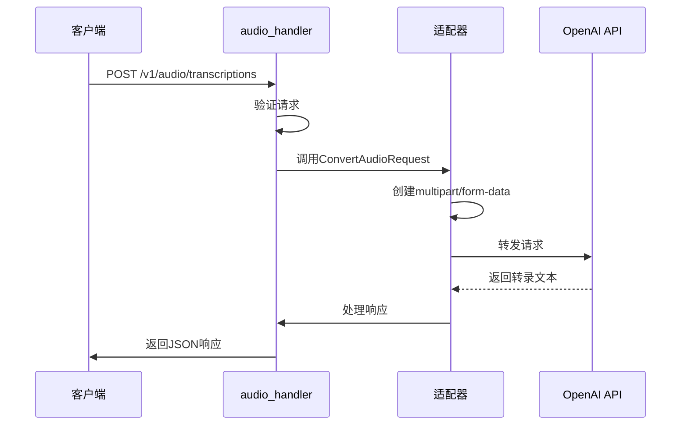
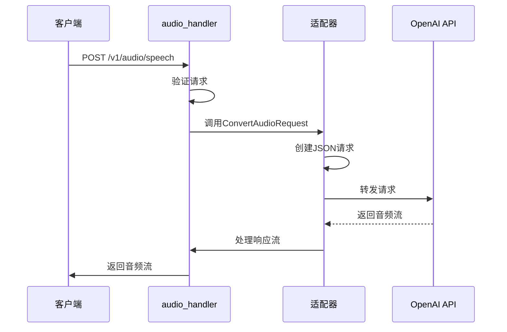
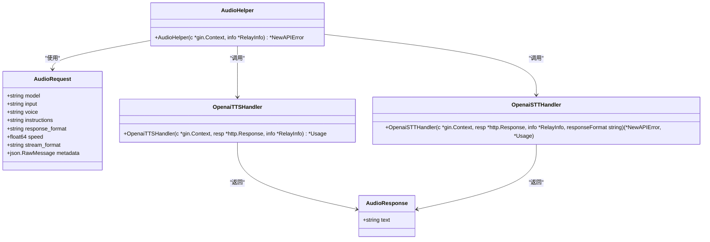

# 音频处理API

<cite>
**本文档引用的文件**
- [audio_handler.go](file://relay/audio_handler.go)
- [audio.go](file://service/audio.go)
- [audio.go](file://dto/audio.go)
- [common/audio.go](file://common/audio.go)
- [relay/channel/openai/adaptor.go](file://relay/channel/openai/adaptor.go)
- [docs/openapi/relay.json](file://docs/openapi/relay.json)
</cite>

## 目录
1. [简介](#简介)
2. [端点详情](#端点详情)
3. [请求处理流程](#请求处理流程)
4. [使用示例](#使用示例)
5. [音频格式与限制](#音频格式与限制)
6. [兼容性与扩展](#兼容性与扩展)

## 简介
本API提供语音转文本和文本转语音功能，兼容OpenAI API规范。API通过`/v1/audio/transcriptions`端点将音频文件转换为文本，通过`/v1/audio/speech`端点将文本转换为语音。系统支持多种音频格式，并通过后端服务进行处理。

**Section sources**
- [docs/openapi/relay.json](file://docs/openapi/relay.json#L1554-L1713)

## 端点详情

### 语音转文本 (/v1/audio/transcriptions)
此端点将上传的音频文件转换为文本。

**请求方法**: POST

**认证方式**: Bearer Token (通过Authorization头)

**请求参数**:
- `file`: 音频文件 (必需, multipart/form-data)
- `model`: 模型名称 (必需, 如 "whisper-1")
- `language`: ISO-639-1语言代码
- `prompt`: 提示文本
- `response_format`: 响应格式 (json, text, srt, verbose_json, vtt)
- `temperature`: 温度参数
- `timestamp_granularities`: 时间戳粒度 (word, segment)

**响应格式**:
```json
{
  "text": "转换后的文本"
}
```

### 文本转语音 (/v1/audio/speech)
此端点将文本转换为语音音频。

**请求方法**: POST

**认证方式**: Bearer Token (通过Authorization头)

**请求参数**:
- `model`: 模型名称 (必需, 如 "tts-1")
- `input`: 要转换的文本 (必需, 最大4096字符)
- `voice`: 语音类型 (必需, alloy, echo, fable, onyx, nova, shimmer)
- `response_format`: 响应格式 (mp3, opus, aac, flac, wav, pcm)
- `speed`: 语速 (0.25-4.0)

**响应格式**: 音频流 (如audio/mpeg)

**Section sources**
- [docs/openapi/relay.json](file://docs/openapi/relay.json#L1554-L1713)
- [dto/audio.go](file://dto/audio.go#L12-L21)

## 请求处理流程

### 处理架构
```mermaid
graph TD
Client[客户端] --> API[/v1/audio/*]
API --> Router[路由处理器]
Router --> Middleware[中间件认证]
Middleware --> AudioHandler[audio_handler.go]
AudioHandler --> Adaptor[适配器]
Adaptor --> OpenAIAPI[OpenAI API]
OpenAIAPI --> Adaptor
Adaptor --> Response[响应处理]
Response --> Client
```

**Diagram sources**
- [audio_handler.go](file://relay/audio_handler.go#L18-L78)
- [relay/channel/openai/adaptor.go](file://relay/channel/openai/adaptor.go#L346-L409)

### 语音转文本处理流程


**Diagram sources**
- [audio_handler.go](file://relay/audio_handler.go#L18-L78)
- [relay/channel/openai/adaptor.go](file://relay/channel/openai/adaptor.go#L346-L409)

### 文本转语音处理流程


**Diagram sources**
- [audio_handler.go](file://relay/audio_handler.go#L18-L78)
- [relay/channel/openai/adaptor.go](file://relay/channel/openai/adaptor.go#L346-L354)

### 核心组件分析


**Diagram sources**
- [audio_handler.go](file://relay/audio_handler.go#L18-L78)
- [dto/audio.go](file://dto/audio.go#L12-L46)
- [relay/channel/openai/audio.go](file://relay/channel/openai/audio.go#L21-L112)

**Section sources**
- [audio_handler.go](file://relay/audio_handler.go#L18-L78)
- [service/audio.go](file://service/audio.go#L9-L48)
- [dto/audio.go](file://dto/audio.go#L12-L67)

## 使用示例

### 语音转文本示例
```bash
curl https://api.example.com/v1/audio/transcriptions \
  -H "Authorization: Bearer your-api-key" \
  -H "Content-Type: multipart/form-data" \
  -F "file=@/path/to/audio.mp3" \
  -F "model=whisper-1" \
  -F "response_format=json"
```

### 文本转语音示例
```bash
curl https://api.example.com/v1/audio/speech \
  -H "Authorization: Bearer your-api-key" \
  -H "Content-Type: application/json" \
  -d '{
    "model": "tts-1",
    "input": "你好，这是一个测试",
    "voice": "alloy"
  }' --output speech.mp3
```

**Section sources**
- [docs/openapi/relay.json](file://docs/openapi/relay.json#L1554-L1713)

## 音频格式与限制

### 支持的音频编解码器
| 格式 | 扩展名 | 说明 |
|------|-------|------|
| MP3 | .mp3 | MPEG音频层III |
| WAV | .wav | 波形音频文件格式 |
| FLAC | .flac | 免费无损音频编解码器 |
| M4A | .m4a, .mp4 | MPEG-4音频 |
| OGG | .ogg, .oga | Ogg容器格式 |
| OPUS | .opus | Opus音频编解码器 |
| AIFF | .aiff, .aif | 音频交换文件格式 |
| AAC | .aac | 高级音频编码 |

### 文件大小限制
- 最大文件大小: 25MB
- 最长持续时间: 30分钟
- 采样率: 支持8kHz到48kHz
- 位深度: 支持8位和16位

### 音频时长计算
系统使用纯Go库计算音频时长，支持以下格式:
- MP3: 通过帧解析计算
- WAV: 通过文件头信息计算
- FLAC: 通过STREAMINFO块计算
- M4A/MP4: 通过'mvhd' box计算
- OGG/Vorbis: 通过读取整个文件计算
- AIFF: 通过文件头信息计算
- AAC: 通过ADTS帧解析计算

**Section sources**
- [common/audio.go](file://common/audio.go#L19-L348)
- [docs/openapi/relay.json](file://docs/openapi/relay.json#L1554-L1713)

## 兼容性与扩展

### OpenAI API兼容性
本API完全兼容OpenAI的音频API规范:
- 端点路径与OpenAI相同
- 请求参数与OpenAI一致
- 响应格式与OpenAI兼容
- 错误处理机制相似

### 可能的扩展点
1. **新增语音模型**: 可通过扩展`AudioRequest`结构体添加新的语音模型
2. **支持更多格式**: 可通过扩展`common/audio.go`中的`GetAudioDuration`函数支持更多音频格式
3. **自定义处理**: 可通过实现新的适配器处理不同后端服务
4. **流式处理**: 支持SSE流式响应，可通过`stream_format=sse`参数启用
5. **批量处理**: 可扩展支持批量音频文件处理

### 性能优化
- 使用内存缓存减少重复计算
- 支持并发处理多个请求
- 优化音频时长计算算法
- 实现连接池管理HTTP客户端

**Section sources**
- [audio_handler.go](file://relay/audio_handler.go#L18-L78)
- [common/audio.go](file://common/audio.go#L19-L348)
- [service/audio.go](file://service/audio.go#L9-L48)