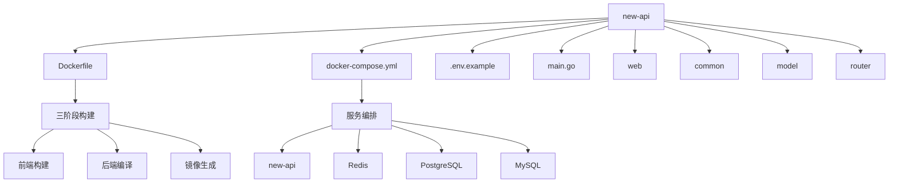
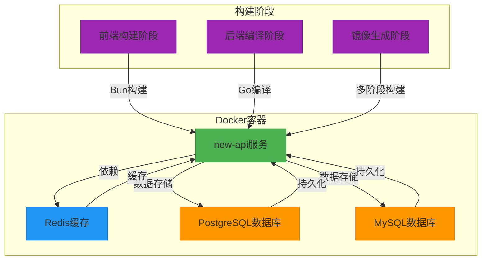
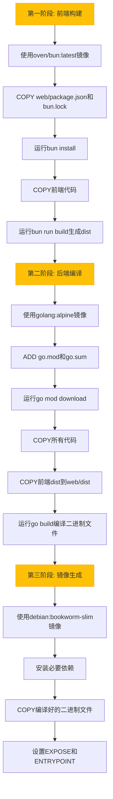
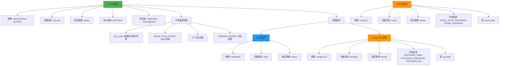
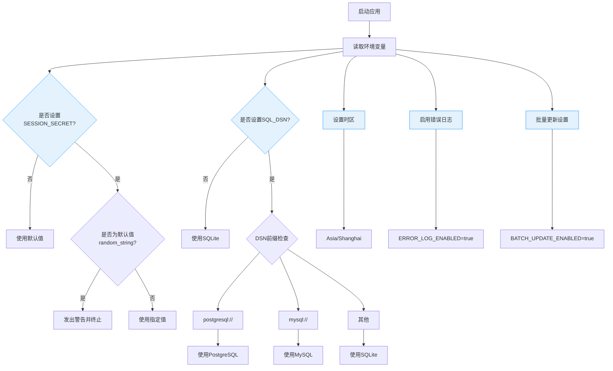
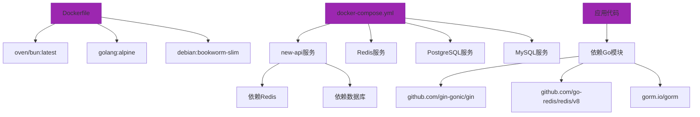

# Docker部署

<cite>
**本文档引用的文件**
- [Dockerfile](file://Dockerfile)
- [docker-compose.yml](file://docker-compose.yml)
- [.env.example](file://.env.example)
- [main.go](file://main.go)
- [common/env.go](file://common/env.go)
- [common/database.go](file://common/database.go)
- [common/redis.go](file://common/redis.go)
- [model/main.go](file://model/main.go)
- [setting/config/config.go](file://setting/config/config.go)
- [common/init.go](file://common/init.go)
</cite>

## 目录
1. [简介](#简介)
2. [项目结构](#项目结构)
3. [核心组件](#核心组件)
4. [架构概述](#架构概述)
5. [详细组件分析](#详细组件分析)
6. [依赖分析](#依赖分析)
7. [性能考虑](#性能考虑)
8. [故障排除指南](#故障排除指南)
9. [结论](#结论)

## 简介
本文档详细说明了基于Docker的部署方案，涵盖Docker镜像构建流程、容器化部署步骤和多服务编排配置。文档基于Dockerfile说明前端构建（Bun）、Go后端编译和最终镜像生成的三阶段构建策略。详细解释docker-compose.yml中的服务定义：new-api主服务、Redis缓存、PostgreSQL/MySQL数据库的配置与依赖关系。包括端口映射、卷挂载、环境变量注入和健康检查机制的配置说明。提供生产环境安全建议，如修改默认密码、设置SESSION_SECRET、启用日志监控等。演示如何通过docker-compose快速启动、停止和更新服务，并说明不同数据库后端（PostgreSQL vs MySQL）的切换方法。

## 项目结构



**图示来源**
- [Dockerfile](file://Dockerfile)
- [docker-compose.yml](file://docker-compose.yml)

**章节来源**
- [Dockerfile](file://Dockerfile)
- [docker-compose.yml](file://docker-compose.yml)

## 核心组件

本项目的核心组件包括：
- **Dockerfile**: 定义了三阶段构建策略，分别用于前端构建、后端编译和最终镜像生成
- **docker-compose.yml**: 定义了多服务编排配置，包括主服务、缓存和数据库服务
- **环境配置**: 通过.env文件和环境变量管理应用配置
- **数据库支持**: 支持PostgreSQL、MySQL和SQLite三种数据库
- **缓存系统**: 使用Redis作为缓存后端

**章节来源**
- [Dockerfile](file://Dockerfile)
- [docker-compose.yml](file://docker-compose.yml)
- [.env.example](file://.env.example)

## 架构概述



**图示来源**
- [Dockerfile](file://Dockerfile)
- [docker-compose.yml](file://docker-compose.yml)

## 详细组件分析

### Docker镜像构建分析

#### 三阶段构建策略


**图示来源**
- [Dockerfile](file://Dockerfile)

**章节来源**
- [Dockerfile](file://Dockerfile)

### Docker Compose服务编排分析

#### 服务定义与依赖关系


**图示来源**
- [docker-compose.yml](file://docker-compose.yml)

**章节来源**
- [docker-compose.yml](file://docker-compose.yml)

### 环境变量与配置分析

#### 环境变量配置流程


**图示来源**
- [main.go](file://main.go)
- [common/init.go](file://common/init.go)
- [common/database.go](file://common/database.go)

**章节来源**
- [main.go](file://main.go)
- [common/init.go](file://common/init.go)

## 依赖分析



**图示来源**
- [Dockerfile](file://Dockerfile)
- [docker-compose.yml](file://docker-compose.yml)
- [go.mod](file://go.mod)

**章节来源**
- [Dockerfile](file://Dockerfile)
- [docker-compose.yml](file://docker-compose.yml)
- [go.mod](file://go.mod)

## 性能考虑

### 构建优化
- **多阶段构建**: 通过三阶段构建策略，将构建环境与运行环境分离，减小最终镜像大小
- **缓存利用**: 在构建过程中合理利用Docker层缓存，提高构建效率
- **依赖管理**: 分阶段安装依赖，确保构建过程的可重复性和稳定性

### 运行时优化
- **连接池**: 配置数据库最大空闲连接数和最大打开连接数，优化数据库连接管理
- **缓存策略**: 使用Redis作为缓存后端，减少数据库查询压力
- **内存管理**: 启用内存缓存，设置合理的同步频率

**章节来源**
- [Dockerfile](file://Dockerfile)
- [docker-compose.yml](file://docker-compose.yml)
- [common/database.go](file://common/database.go)
- [common/redis.go](file://common/redis.go)

## 故障排除指南

### 常见问题及解决方案
- **数据库连接失败**: 检查SQL_DSN环境变量配置，确保数据库服务已启动
- **Redis连接失败**: 检查REDIS_CONN_STRING环境变量，确认Redis服务状态
- **会话密钥警告**: 确保SESSION_SECRET已设置为非默认值的随机字符串
- **构建失败**: 检查网络连接，确保可以访问外部依赖源

### 健康检查机制
```mermaid
graph TD
A[健康检查] --> B[执行命令]
B --> C[wget -q -O - http://localhost:3000/api/status]
C --> D[检查响应]
D --> E{包含"success": true?}
E --> |是| F[健康]
E --> |否| G[不健康]
F --> H[通过健康检查]
G --> I[重试]
I --> J{达到重试次数?}
J --> |否| B
J --> |是| K[标记为不健康]
style A fill:#E3F2FD,stroke:#2196F3
style E fill:#E3F2FD,stroke:#2196F3
style J fill:#E3F2FD,stroke:#2196F3
```

**图示来源**
- [docker-compose.yml](file://docker-compose.yml)

**章节来源**
- [docker-compose.yml](file://docker-compose.yml)

## 结论

本文档详细介绍了new-api项目的Docker部署方案，涵盖了从镜像构建到服务编排的完整流程。通过三阶段构建策略，实现了前端构建、后端编译和镜像生成的分离，确保了最终镜像的轻量化。docker-compose.yml文件定义了完整的多服务编排配置，包括主服务、缓存和数据库服务，支持PostgreSQL和MySQL两种数据库后端。环境变量配置提供了灵活的部署选项，同时强调了生产环境的安全性要求。整体部署方案设计合理，易于维护和扩展。