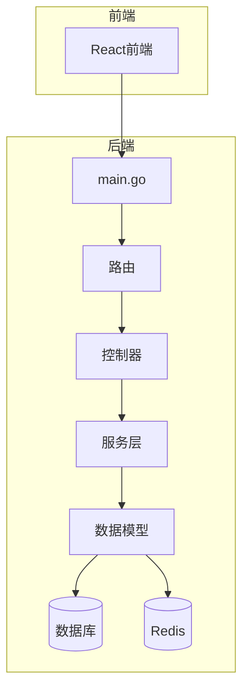
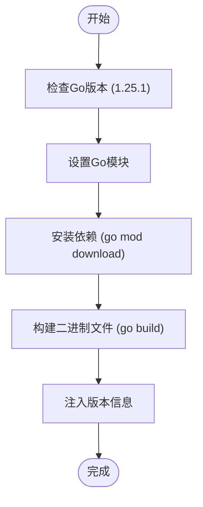
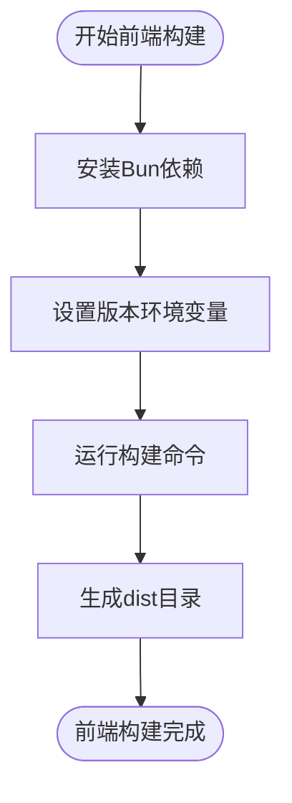
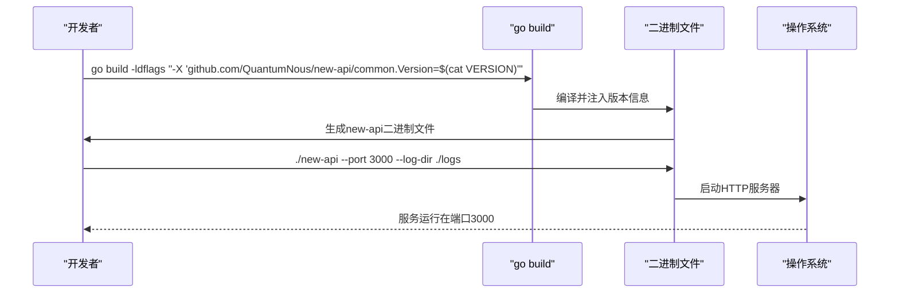
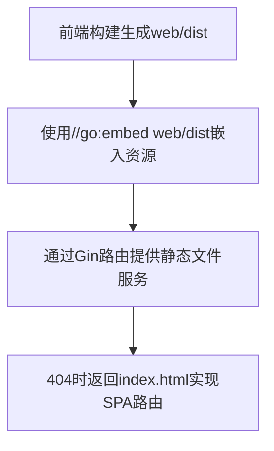
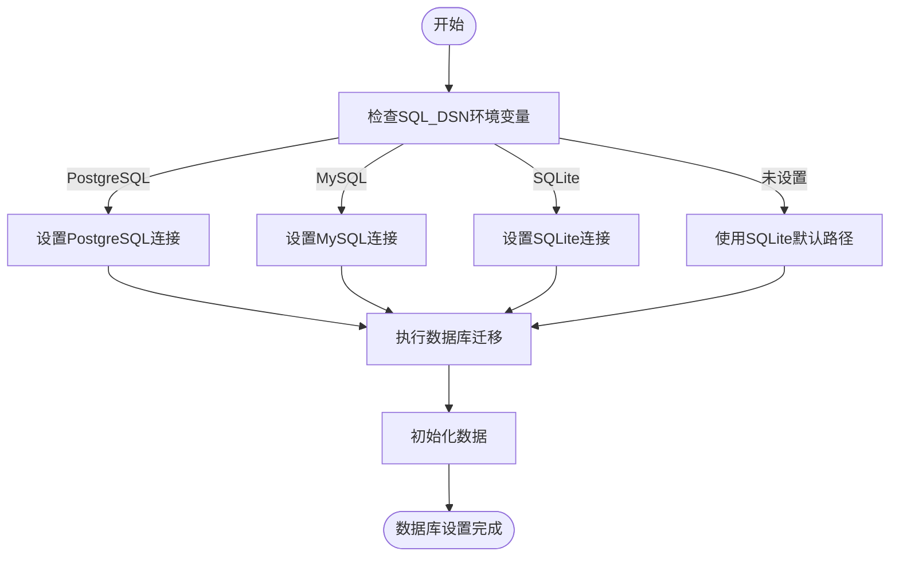
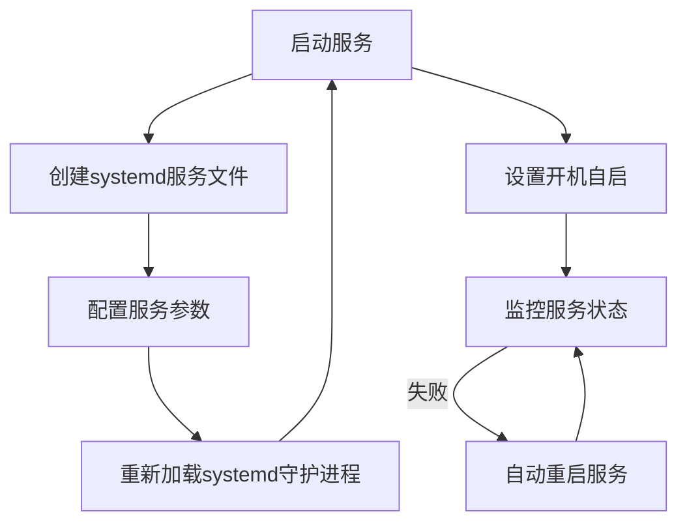
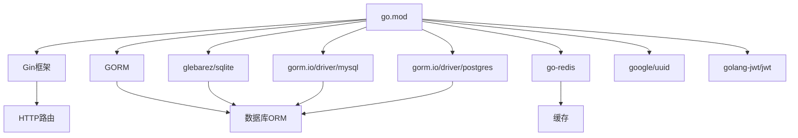

# 手动部署

<cite>
**本文档中引用的文件**   
- [main.go](file://main.go)
- [go.mod](file://go.mod)
- [makefile](file://makefile)
- [Dockerfile](file://Dockerfile)
- [new-api.service](file://new-api.service)
- [common/env.go](file://common/env.go)
- [common/constants.go](file://common/constants.go)
- [common/init.go](file://common/init.go)
- [setting/config/config.go](file://setting/config/config.go)
- [model/main.go](file://model/main.go)
- [common/redis.go](file://common/redis.go)
- [VERSION](file://VERSION)
- [web/package.json](file://web/package.json)
</cite>

## 目录
1. [简介](#简介)
2. [项目结构](#项目结构)
3. [核心组件](#核心组件)
4. [架构概述](#架构概述)
5. [详细组件分析](#详细组件分析)
6. [依赖分析](#依赖分析)
7. [性能考虑](#性能考虑)
8. [故障排除指南](#故障排除指南)
9. [结论](#结论)
10. [附录](#附录)（如有必要）

## 简介
本指南详细说明了如何在无Docker环境下从源码构建和运行系统。涵盖了Go开发环境配置要求、前端依赖安装、构建命令、二进制文件编译与运行、静态资源部署、系统依赖设置以及进程守护方案建议。

## 项目结构
本项目采用典型的Go Web应用结构，包含后端Go代码、前端React应用和相关配置文件。主要目录包括：

- `bin/`: 包含数据库迁移脚本和测试脚本
- `common/`: 公共工具和常量
- `constant/`: 常量定义
- `controller/`: 业务控制器
- `dto/`: 数据传输对象
- `electron/`: Electron桌面应用相关
- `logger/`: 日志模块
- `middleware/`: Gin中间件
- `model/`: 数据模型和数据库操作
- `relay/`: API中继逻辑
- `router/`: 路由配置
- `service/`: 业务服务
- `setting/`: 配置设置
- `types/`: 类型定义
- `web/`: 前端React应用
- 根目录: 包含主程序文件、构建文件和配置文件

**Section sources**
- [main.go](file://main.go#L1-L261)
- [go.mod](file://go.mod#L1-L124)

## 核心组件

本系统的核心组件包括：
- `main.go`: 应用程序入口点，负责初始化资源、设置路由和启动HTTP服务器
- `common/`: 包含环境变量处理、常量定义和公共函数
- `model/`: 数据库模型和操作，使用GORM进行ORM管理
- `relay/`: API中继功能，支持多种AI服务提供商
- `web/`: 前端用户界面，基于React构建

**Section sources**
- [main.go](file://main.go#L1-L261)
- [common/constants.go](file://common/constants.go#L1-L208)
- [model/main.go](file://model/main.go#L1-L479)

## 架构概述



**Diagram sources **
- [main.go](file://main.go#L1-L261)
- [router/main.go](file://router/main.go#L1-L34)
- [model/main.go](file://model/main.go#L1-L479)

## 详细组件分析

### Go开发环境配置

系统需要Go 1.25.1版本进行构建，这可以从go.mod文件中确认。构建过程使用Go模块进行依赖管理。



**Diagram sources **
- [go.mod](file://go.mod#L1-L124)
- [Dockerfile](file://Dockerfile#L11-L26)

**Section sources**
- [go.mod](file://go.mod#L1-L124)
- [Dockerfile](file://Dockerfile#L1-L39)

### 前端依赖安装与构建

前端应用位于web目录，使用Bun作为包管理器和构建工具。构建过程会将VERSION文件中的版本信息注入到前端应用中。



**Diagram sources **
- [makefile](file://makefile#L8-L10)
- [web/package.json](file://web/package.json#L1-L97)

**Section sources**
- [makefile](file://makefile#L1-L15)
- [web/package.json](file://web/package.json#L1-L97)

### 二进制文件编译与运行

系统使用go build命令编译二进制文件，并通过ldflags参数注入版本信息。二进制文件支持多种运行参数，包括端口和日志目录指定。



**Diagram sources **
- [main.go](file://main.go#L16-L21)
- [common/init.go](file://common/init.go#L16-L21)
- [Dockerfile](file://Dockerfile#L26)

**Section sources**
- [main.go](file://main.go#L1-L261)
- [common/init.go](file://common/init.go#L1-L150)

### 静态资源部署

前端构建生成的静态资源位于web/dist目录，这些资源通过Go的embed功能嵌入到二进制文件中，实现静态文件服务。



**Diagram sources **
- [main.go](file://main.go#L33-L34)
- [router/main.go](file://router/main.go#L15-L33)

**Section sources**
- [main.go](file://main.go#L1-L261)
- [router/main.go](file://router/main.go#L1-L34)

### 系统依赖设置

系统需要Redis和PostgreSQL/MySQL数据库支持。数据库类型通过环境变量SQL_DSN确定，支持SQLite作为轻量级选项。



**Diagram sources **
- [model/main.go](file://model/main.go#L118-L175)
- [common/redis.go](file://common/redis.go#L24-L53)

**Section sources**
- [model/main.go](file://model/main.go#L1-L479)
- [common/redis.go](file://common/redis.go#L1-L328)

### 进程守护方案

推荐使用systemd作为进程守护方案，确保服务的稳定运行。示例配置文件new-api.service提供了基本的systemd服务配置。



**Diagram sources **
- [new-api.service](file://new-api.service#L1-L19)

**Section sources**
- [new-api.service](file://new-api.service#L1-L19)

## 依赖分析



**Diagram sources **
- [go.mod](file://go.mod#L1-L124)

**Section sources**
- [go.mod](file://go.mod#L1-L124)

## 性能考虑

系统在性能方面进行了多项优化：
- 使用GORM的PrepareStmt功能预编译SQL语句
- 配置数据库连接池的最大空闲连接和最大打开连接数
- 使用Redis作为缓存层减少数据库访问
- 支持批量更新以提高性能
- 使用Go协程处理异步任务

**Section sources**
- [model/main.go](file://model/main.go#L194-L196)
- [common/constants.go](file://common/constants.go#L117-L120)

## 故障排除指南

常见问题及解决方案：
- **数据库连接失败**: 检查SQL_DSN环境变量配置是否正确
- **Redis连接失败**: 检查REDIS_CONN_STRING环境变量配置
- **前端资源无法访问**: 确保web/dist目录已正确构建并嵌入
- **版本信息未更新**: 确保VERSION文件存在且内容正确
- **服务无法启动**: 检查端口是否被占用，日志目录是否有写入权限

**Section sources**
- [common/init.go](file://common/init.go#L211-L219)
- [model/main.go](file://model/main.go#L207-L209)
- [common/redis.go](file://common/redis.go#L45-L48)

## 结论

本指南详细介绍了从源码构建和部署系统的完整流程。通过遵循这些步骤，用户可以在无Docker环境下成功部署和运行系统。关键要点包括正确配置Go开发环境、使用Bun构建前端、通过go build编译二进制文件、设置必要的系统依赖以及使用systemd确保服务稳定性。

## 附录

### 环境变量参考

| 环境变量 | 描述 | 默认值 |
|---------|------|-------|
| SQL_DSN | 数据库连接字符串 | 使用SQLite |
| REDIS_CONN_STRING | Redis连接字符串 | Redis禁用 |
| PORT | 服务监听端口 | 3000 |
| LOG_DIR | 日志目录 | ./logs |
| SESSION_SECRET | 会话密钥 | 随机生成 |
| DEBUG | 调试模式 | false |

### 构建命令速查

```bash
# 构建前端
cd web && bun install && DISABLE_ESLINT_PLUGIN='true' VITE_REACT_APP_VERSION=$(cat VERSION) bun run build

# 构建后端
go build -ldflags "-s -w -X 'github.com/QuantumNous/new-api/common.Version=$(cat VERSION)'" -o new-api

# 运行服务
./new-api --port 3000 --log-dir ./logs
```