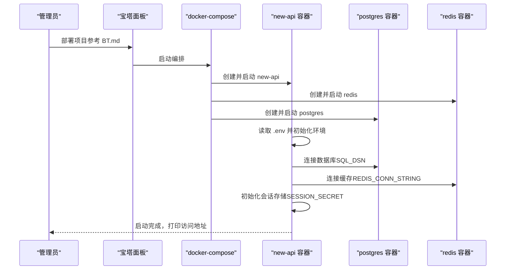
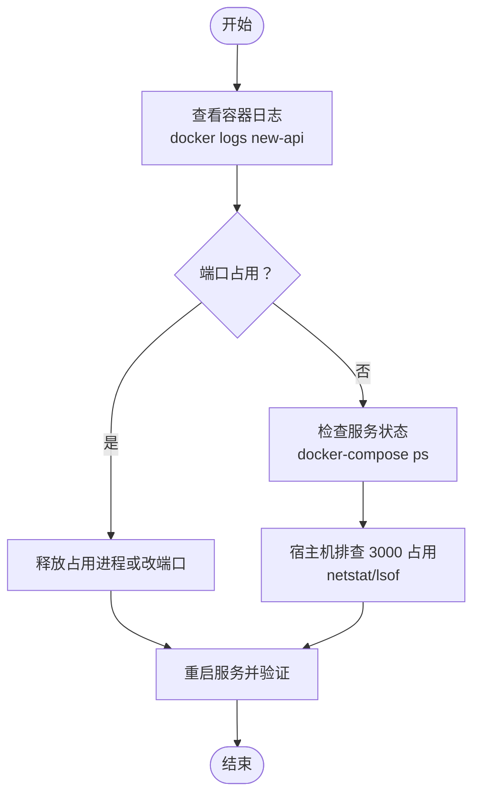
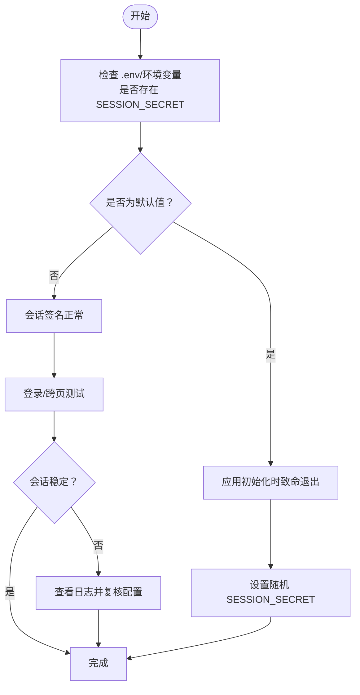
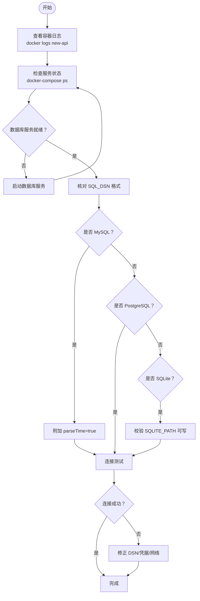
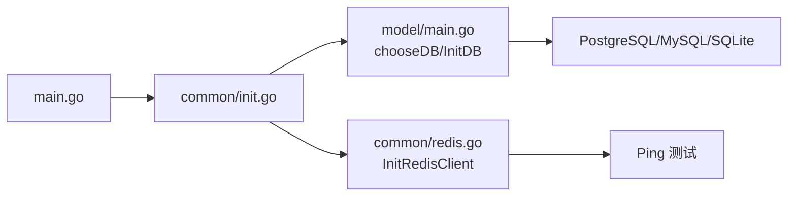

# 故障排除

<cite>
**本文引用的文件**
- [BT.md](file://docs/installation/BT.md)
- [.env.example](file://.env.example)
- [docker-compose.yml](file://docker-compose.yml)
- [Dockerfile](file://Dockerfile)
- [main.go](file://main.go)
- [common/init.go](file://common/init.go)
- [common/env.go](file://common/env.go)
- [common/redis.go](file://common/redis.go)
- [common/sys_log.go](file://common/sys_log.go)
- [model/main.go](file://model/main.go)
- [common/database.go](file://common/database.go)
</cite>

## 目录
1. [简介](#简介)
2. [项目结构与部署入口](#项目结构与部署入口)
3. [核心组件与关键配置](#核心组件与关键配置)
4. [架构总览](#架构总览)
5. [详细故障排查流程](#详细故障排查流程)
6. [依赖关系分析](#依赖关系分析)
7. [性能与稳定性建议](#性能与稳定性建议)
8. [故障排查清单](#故障排查清单)
9. [结论](#结论)

## 简介
本指南面向通过宝塔面板（BT.md）部署本项目的用户，聚焦以下典型部署错误的诊断与修复：
- 端口冲突（3000 端口被占用）
- 权限不足（数据目录写入失败）
- 环境变量未生效（SESSION_SECRET 缺失导致会话异常）
- 数据库连接失败（SQL_DSN 配置错误或服务未启动）
- Redis 连接超时

同时提供基于 docker-compose 的诊断步骤：查看容器日志、检查服务状态、验证网络连通性，并强调多实例部署中 SESSION_SECRET 的重要性。

## 项目结构与部署入口
- 宝塔面板安装说明位于 docs/installation/BT.md，其中明确指出“密钥为环境变量 SESSION_SECRET”。
- 部署编排由 docker-compose.yml 提供，包含 new-api、redis、postgres 三个服务，端口映射 3000:3000。
- 应用入口 main.go 在启动时加载 .env 并初始化数据库、Redis、会话存储等资源。
- Dockerfile 将应用暴露 3000 端口并以 /data 作为工作目录。

```mermaid
graph TB
subgraph "宿主机"
BT["宝塔面板<br/>部署截图"]
Port["宿主机端口 3000"]
end
subgraph "容器编排"
DC["docker-compose.yml"]
NA["new-api 容器<br/>端口 3000 映射"]
RD["redis 容器"]
PG["postgres 容器"]
end
subgraph "应用进程"
MAIN["main.go 启动流程"]
ENV[".env 环境变量"]
INIT["common/init.go 环境初始化"]
DB["model/main.go 数据库初始化"]
REDIS["common/redis.go Redis 初始化"]
end
BT --> DC
DC --> NA
DC --> RD
DC --> PG
Port <- --> NA
ENV --> INIT --> MAIN
MAIN --> DB
MAIN --> REDIS
```

图表来源
- [docker-compose.yml](file://docker-compose.yml#L1-L85)
- [Dockerfile](file://Dockerfile#L1-L39)
- [main.go](file://main.go#L127-L170)
- [common/init.go](file://common/init.go#L30-L113)
- [model/main.go](file://model/main.go#L118-L175)
- [common/redis.go](file://common/redis.go#L23-L54)

章节来源
- [BT.md](file://docs/installation/BT.md#L1-L4)
- [docker-compose.yml](file://docker-compose.yml#L1-L85)
- [Dockerfile](file://Dockerfile#L1-L39)
- [main.go](file://main.go#L127-L170)

## 核心组件与关键配置
- 端口与监听
  - 默认监听端口来自命令行标志位，若未显式设置则使用默认值；应用启动后会打印本地与网络访问地址。
  - docker-compose 将容器内 3000 端口映射到宿主机 3000 端口。
- 环境变量
  - SESSION_SECRET：用于会话签名，若未设置或仍为默认值将触发致命错误。
  - SQL_DSN：数据库连接串，支持 PostgreSQL/MySQL/SQLite；compose 中默认指向 postgres 服务。
  - REDIS_CONN_STRING：Redis 连接串，compose 中默认指向 redis 服务。
  - 其他关键变量：PORT、ERROR_LOG_ENABLED、BATCH_UPDATE_ENABLED、SYNC_FREQUENCY 等。
- 数据目录与日志
  - Dockerfile 指定工作目录为 /data，compose 将 ./data 挂载到 /data；日志目录可通过 --log-dir 或环境变量指定。
- 会话存储
  - 使用 cookie 存储，依赖 SESSION_SECRET；若缺失或不正确会导致会话异常。

章节来源
- [main.go](file://main.go#L127-L170)
- [common/init.go](file://common/init.go#L30-L113)
- [common/env.go](file://common/env.go#L1-L39)
- [Dockerfile](file://Dockerfile#L1-L39)
- [docker-compose.yml](file://docker-compose.yml#L1-L85)

## 架构总览
下图展示从宝塔面板到应用启动的关键交互链路，以及各组件间的依赖关系。



图表来源
- [docker-compose.yml](file://docker-compose.yml#L1-L85)
- [main.go](file://main.go#L211-L260)
- [common/init.go](file://common/init.go#L30-L113)
- [common/redis.go](file://common/redis.go#L23-L54)
- [model/main.go](file://model/main.go#L118-L175)

## 详细故障排查流程

### 一、端口冲突（3000 端口被占用）
- 现象
  - 应用无法绑定 3000 端口，启动报错或直接退出。
- 诊断步骤
  - 查看容器日志：docker logs new-api
  - 检查服务状态：docker-compose ps
  - 在宿主机上确认 3000 端口占用者：netstat -tulnp | grep :3000 或 lsof -i :3000
- 解决方案
  - 方案 A：释放占用 3000 的进程
  - 方案 B：修改 compose 端口映射（例如将宿主机端口改为 3001），并在应用层设置 PORT=3001
  - 方案 C：在 compose 中调整 new-api 的 ports 字段，避免冲突



图表来源
- [docker-compose.yml](file://docker-compose.yml#L1-L85)
- [main.go](file://main.go#L158-L169)

章节来源
- [docker-compose.yml](file://docker-compose.yml#L1-L85)
- [main.go](file://main.go#L158-L169)

### 二、权限不足（数据目录写入失败）
- 现象
  - 应用启动后无法写入 /data 或日志目录，出现权限错误。
- 诊断步骤
  - 查看容器日志：docker logs new-api
  - 检查挂载目录权限：ls -ld ./data
  - 确认容器内 /data 可写：docker exec -it new-api ls -ld /data
- 解决方案
  - 修改宿主机 ./data 目录权限，确保运行用户可写
  - 若使用宝塔部署，请在站点目录设置正确的文件权限
  - 如需自定义日志目录，可在启动时传入 --log-dir 或设置 LOG_DIR 环境变量

章节来源
- [Dockerfile](file://Dockerfile#L1-L39)
- [docker-compose.yml](file://docker-compose.yml#L1-L85)
- [common/init.go](file://common/init.go#L66-L78)

### 三、环境变量未生效（SESSION_SECRET 缺失导致会话异常）
- 现象
  - 登录或跨页面会话失效，浏览器控制台或日志出现会话相关错误。
- 诊断步骤
  - 查看容器日志：docker logs new-api
  - 确认 .env 文件已正确放置且包含 SESSION_SECRET
  - 在 compose 中检查 environment 是否包含 SESSION_SECRET
- 关键要点（多实例部署）
  - 多实例部署时，所有实例必须共享同一 SESSION_SECRET，否则会话无法跨实例互通，导致登录状态丢失。
  - compose 中注释了 SESSION_SECRET 的示例，务必在生产环境设置为随机字符串。
- 解决方案
  - 在 .env 或 docker-compose 的 environment 中设置 SESSION_SECRET
  - 若仍为默认值，应用会在初始化阶段直接致命退出，需立即修正



图表来源
- [common/init.go](file://common/init.go#L48-L57)
- [main.go](file://main.go#L143-L151)
- [docker-compose.yml](file://docker-compose.yml#L36-L36)

章节来源
- [BT.md](file://docs/installation/BT.md#L1-L4)
- [common/init.go](file://common/init.go#L48-L57)
- [main.go](file://main.go#L143-L151)
- [docker-compose.yml](file://docker-compose.yml#L36-L36)

### 四、数据库连接失败（SQL_DSN 配置错误或服务未启动）
- 现象
  - 应用启动时报数据库连接错误，或健康检查失败。
- 诊断步骤
  - 查看容器日志：docker logs new-api
  - 检查服务状态：docker-compose ps
  - 验证数据库服务是否可用：进入 new-api 容器执行数据库连接测试（如 psql/mysql 命令）
  - 核对 SQL_DSN 格式：compose 中默认指向 postgres，若切换 MySQL 需取消注释对应部分并调整 DSN
- 解决方案
  - 确保 SQL_DSN 正确（包含用户名、密码、主机、端口、数据库名）
  - 若使用 MySQL，确保 parseTime=true 已附加（代码会自动处理）
  - 若使用 SQLite，确保 SQLITE_PATH 指向可写路径
  - 确认数据库服务已启动并可达



图表来源
- [docker-compose.yml](file://docker-compose.yml#L1-L85)
- [model/main.go](file://model/main.go#L118-L175)
- [common/database.go](file://common/database.go#L1-L15)

章节来源
- [docker-compose.yml](file://docker-compose.yml#L1-L85)
- [model/main.go](file://model/main.go#L118-L175)
- [common/database.go](file://common/database.go#L1-L15)

### 五、Redis 连接超时
- 现象
  - 应用启动时报 Redis 连接失败，或功能依赖缓存时出现异常。
- 诊断步骤
  - 查看容器日志：docker logs new-api
  - 检查服务状态：docker-compose ps
  - 在 new-api 容器内测试 Redis 连接（如使用 redis-cli）
  - 核对 REDIS_CONN_STRING 格式与网络可达性
- 解决方案
  - 确认 REDIS_CONN_STRING 正确（含主机、端口、DB 索引等）
  - 确保 Redis 服务已启动并可从 new-api 容器访问
  - 如需池化参数，可通过环境变量调整连接池大小

章节来源
- [common/redis.go](file://common/redis.go#L23-L54)
- [docker-compose.yml](file://docker-compose.yml#L1-L85)

## 依赖关系分析
- 组件耦合
  - main.go 依赖 common/init.go 进行环境初始化，再依次初始化数据库、日志数据库、Redis。
  - 数据库初始化根据 SQL_DSN 自动选择 PostgreSQL/MySQL/SQLite。
  - Redis 初始化依赖 REDIS_CONN_STRING，并进行 Ping 测试。
- 外部依赖
  - docker-compose 管理 new-api、redis、postgres 三类服务，彼此通过内部网络通信。
- 循环依赖
  - 代码层面未见循环导入；启动顺序严格遵循初始化链路。



图表来源
- [main.go](file://main.go#L211-L260)
- [common/init.go](file://common/init.go#L30-L113)
- [model/main.go](file://model/main.go#L118-L175)
- [common/redis.go](file://common/redis.go#L23-L54)

章节来源
- [main.go](file://main.go#L211-L260)
- [common/init.go](file://common/init.go#L30-L113)
- [model/main.go](file://model/main.go#L118-L175)
- [common/redis.go](file://common/redis.go#L23-L54)

## 性能与稳定性建议
- 端口与网络
  - 避免与宿主机已有服务冲突；必要时修改映射端口并同步应用端口配置。
- 数据库
  - 合理设置 SQL_MAX_IDLE_CONNS、SQL_MAX_OPEN_CONNS、SQL_MAX_LIFETIME，避免连接池耗尽。
  - MySQL 需确保 parseTime=true，以保证时间字段解析一致。
- 缓存
  - Redis 连接池大小可通过环境变量调整；在高并发场景适当增大。
- 日志
  - 启用 ERROR_LOG_ENABLED 记录错误日志，便于定位问题。
- 多实例
  - 所有实例必须共享同一 SESSION_SECRET，确保会话一致性。

[本节为通用建议，无需特定文件来源]

## 故障排查清单
- 端口冲突
  - docker logs new-api
  - docker-compose ps
  - netstat/lsof :3000
  - 修改映射或释放占用
- 权限不足
  - docker logs new-api
  - ls -ld ./data
  - docker exec -it new-api ls -ld /data
  - 修正目录权限或更换日志目录
- SESSION_SECRET 未生效
  - docker logs new-api
  - 检查 .env 与 compose environment
  - 多实例统一设置随机值
- 数据库连接失败
  - docker logs new-api
  - docker-compose ps
  - 核对 SQL_DSN 格式与凭据
  - 切换 MySQL 时附加 parseTime=true
- Redis 连接超时
  - docker logs new-api
  - docker-compose ps
  - 核对 REDIS_CONN_STRING 与网络可达性

章节来源
- [docker-compose.yml](file://docker-compose.yml#L1-L85)
- [main.go](file://main.go#L127-L170)
- [common/init.go](file://common/init.go#L48-L57)
- [common/redis.go](file://common/redis.go#L23-L54)
- [model/main.go](file://model/main.go#L118-L175)

## 结论
通过以上流程与工具，可快速定位并解决端口冲突、权限不足、环境变量缺失、数据库与 Redis 连接问题。特别提醒：多实例部署务必统一 SESSION_SECRET，否则会话状态无法跨实例共享。建议在生产环境中完善日志记录与健康检查，并定期巡检数据库与缓存服务状态。