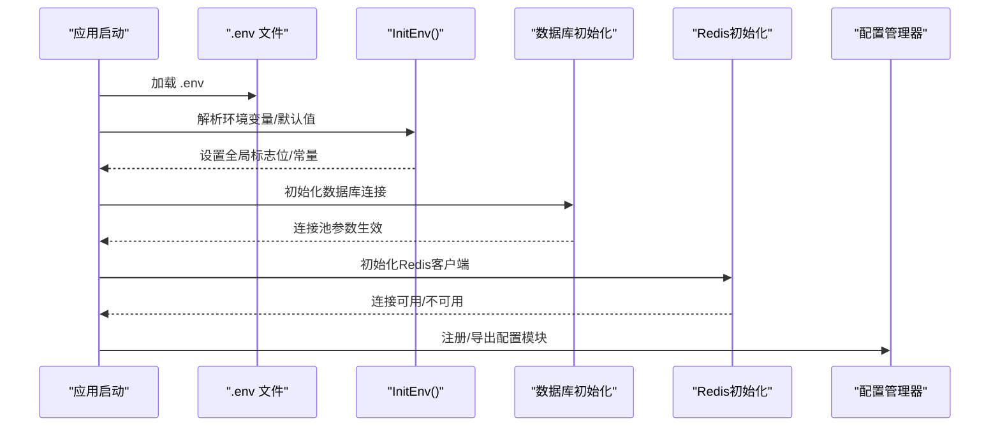
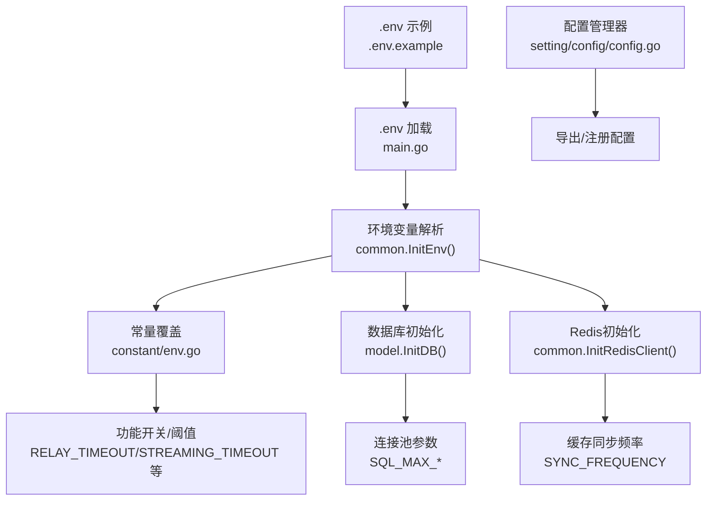
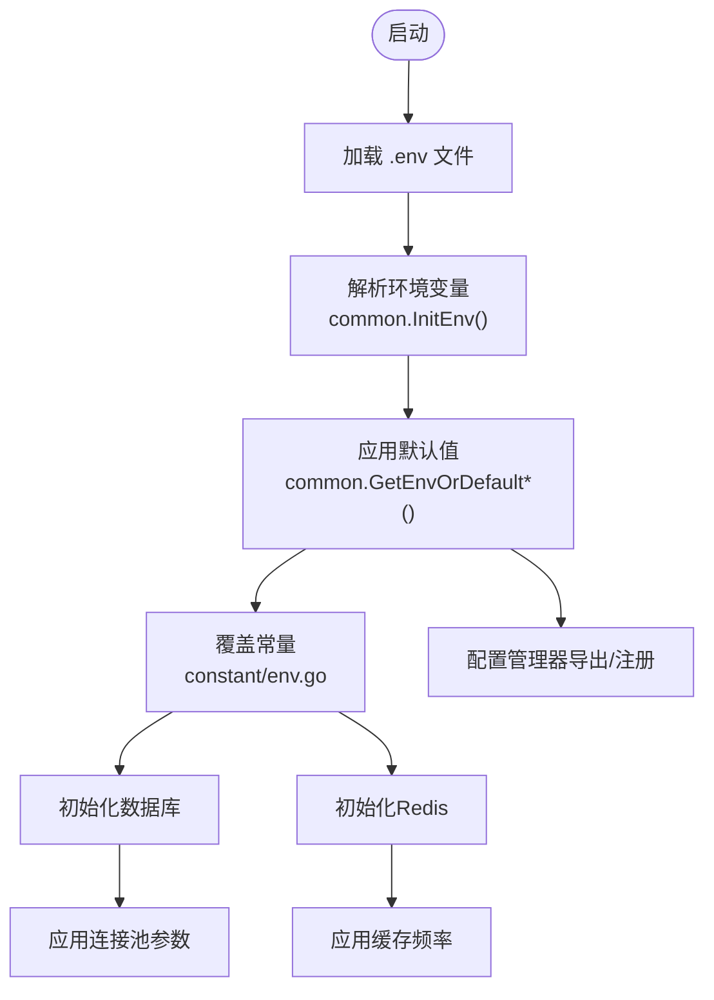
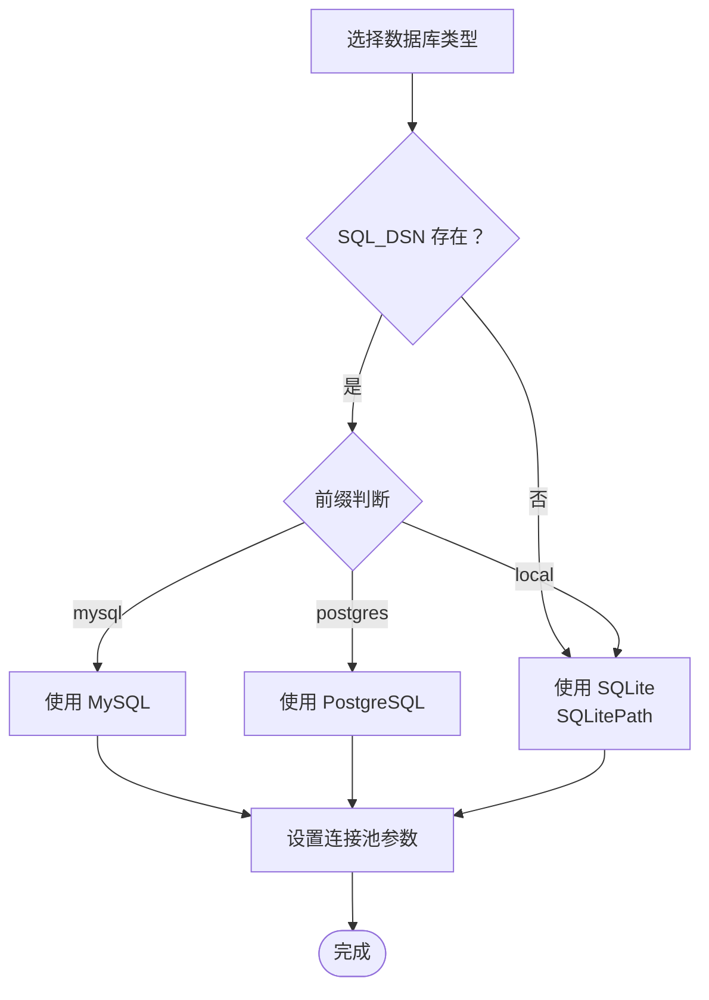
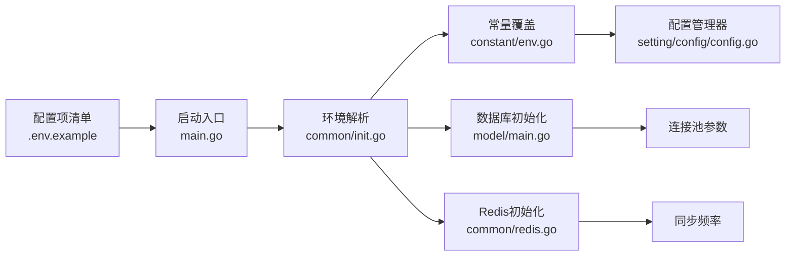

# 环境配置

<cite>
**本文引用的文件**
- [.env.example](file://.env.example)
- [main.go](file://main.go)
- [common/init.go](file://common/init.go)
- [common/env.go](file://common/env.go)
- [common/database.go](file://common/database.go)
- [model/main.go](file://model/main.go)
- [common/redis.go](file://common/redis.go)
- [constant/env.go](file://constant/env.go)
- [setting/config/config.go](file://setting/config/config.go)
- [controller/linuxdo.go](file://controller/linuxdo.go)
</cite>

## 目录
1. [简介](#简介)
2. [项目结构与配置入口](#项目结构与配置入口)
3. [核心配置分类详解](#核心配置分类详解)
4. [架构总览](#架构总览)
5. [详细组件分析](#详细组件分析)
6. [依赖关系分析](#依赖关系分析)
7. [性能与稳定性考量](#性能与稳定性考量)
8. [故障排查指南](#故障排查指南)
9. [结论](#结论)
10. [附录：生产环境最佳实践](#附录生产环境最佳实践)

## 简介
本文件围绕系统环境配置体系进行深入解析，基于 .env.example 文件梳理并解释各关键配置项，涵盖数据库、缓存、安全、功能与第三方集成等维度；同时阐明环境变量如何覆盖默认值，结合 setting/config/config.go 的配置加载逻辑与 constant/env.go 中的常量定义，给出生产环境配置的最佳实践与性能调优建议。

## 项目结构与配置入口
- 配置加载流程概览：
  - 应用启动时优先加载 .env 文件（若存在），随后调用公共初始化函数完成环境变量解析与默认值回退。
  - 数据库、日志库、Redis 等子系统在初始化阶段读取相应环境变量，决定连接方式、池大小、超时策略等。
  - 部分全局常量由 constant/env.go 提供默认值，可在运行期通过环境变量覆盖。

图表来源
- [main.go](file://main.go#L211-L260)
- [common/init.go](file://common/init.go#L30-L149)
- [model/main.go](file://model/main.go#L177-L211)
- [common/redis.go](file://common/redis.go#L23-L54)
- [setting/config/config.go](file://setting/config/config.go#L13-L287)

章节来源
- [main.go](file://main.go#L211-L260)
- [common/init.go](file://common/init.go#L30-L149)

## 核心配置分类详解
以下依据 .env.example 的注释与实际代码实现，对关键配置项进行分类说明，并指出其在代码中的使用位置与默认行为。

### 数据库配置
- SQL_DSN：数据库连接字符串，支持 MySQL、PostgreSQL 与 SQLite。当未设置时自动降级为 SQLite。
- LOG_SQL_DSN：日志数据库连接字符串，用于独立的日志库初始化。
- SQLITE_PATH：SQLite 文件路径，默认值见 common/database.go。
- 连接池参数：
  - SQL_MAX_IDLE_CONNS：最大空闲连接数
  - SQL_MAX_OPEN_CONNS：最大打开连接数
  - SQL_MAX_LIFETIME：连接最大生命周期（秒）

上述参数在数据库初始化阶段生效，且会根据环境变量动态调整。

章节来源
- [.env.example](file://.env.example#L13-L26)
- [common/database.go](file://common/database.go#L1-L15)
- [model/main.go](file://model/main.go#L177-L211)

### 缓存配置
- REDIS_CONN_STRING：Redis 连接字符串，未设置时缓存功能禁用。
- SYNC_FREQUENCY：缓存同步频率（秒），用于缓存键过期时间等场景。
- MEMORY_CACHE_ENABLED：内存缓存开关，影响部分内存缓存逻辑。
- CHANNEL_UPDATE_FREQUENCY：渠道更新频率（秒）。
- BATCH_UPDATE_ENABLED：批量更新开关。
- BATCH_UPDATE_INTERVAL：批量更新间隔（秒）。

章节来源
- [.env.example](file://.env.example#L28-L41)
- [common/redis.go](file://common/redis.go#L19-L21)
- [common/init.go](file://common/init.go#L80-L83)
- [common/init.go](file://common/init.go#L90-L95)

### 安全配置
- SESSION_SECRET：会话密钥，必须设置为随机字符串，否则启动即终止。
- CRYPTO_SECRET：加密密钥，若未设置则与 SESSION_SECRET 保持一致。
- DEBUG：调试模式开关，影响日志级别与部分调试行为。
- NODE_TYPE：节点类型，非 slave 即为主节点。

章节来源
- [.env.example](file://.env.example#L55-L57)
- [common/init.go](file://common/init.go#L48-L62)
- [common/init.go](file://common/init.go#L80-L84)

### 功能配置
- RELAY_TIMEOUT：请求超时（秒），0 表示不限制。
- STREAMING_TIMEOUT：流式响应超时（秒），默认 300。
- UPDATE_TASK：更新任务开关。
- GEMINI_VISION_MAX_IMAGE_NUM：Gemini 视觉最大图片数量。
- 其他：
  - DIFY_DEBUG：Dify 渠道调试开关
  - GET_MEDIA_TOKEN / GET_MEDIA_TOKEN_NOT_STREAM：媒体 token 统计开关
  - FORCE_STREAM_OPTION：强制返回 usage 信息
  - MAX_FILE_DOWNLOAD_MB / STREAM_SCANNER_MAX_BUFFER_MB：下载与扫描缓冲限制
  - ERROR_LOG_ENABLED：错误日志开关
  - TASK_QUERY_LIMIT：任务查询上限
  - TASK_PRICE_PATCH：任务价格补丁列表（逗号分隔）

章节来源
- [.env.example](file://.env.example#L46-L54)
- [constant/env.go](file://constant/env.go#L1-L22)
- [common/init.go](file://common/init.go#L115-L149)

### 第三方集成
- LinuxDo OAuth：
  - LINUX_DO_TOKEN_ENDPOINT：令牌端点
  - LINUX_DO_USER_ENDPOINT：用户信息端点
  - 在控制器中通过环境变量读取端点地址，发起 OAuth 授权码流程。

章节来源
- [.env.example](file://.env.example#L70-L73)
- [controller/linuxdo.go](file://controller/linuxdo.go#L81-L156)

## 架构总览
下图展示配置加载与使用的整体流程，包括 .env 解析、环境变量覆盖默认值、数据库/Redis 初始化、以及配置管理器的注册与导出。

图表来源
- [main.go](file://main.go#L211-L260)
- [common/init.go](file://common/init.go#L30-L149)
- [constant/env.go](file://constant/env.go#L1-L22)
- [model/main.go](file://model/main.go#L177-L211)
- [common/redis.go](file://common/redis.go#L23-L54)
- [setting/config/config.go](file://setting/config/config.go#L13-L287)

## 详细组件分析

### 配置加载与优先级机制
- 优先级顺序（从高到低）：
  1) 环境变量（含 .env 文件）
  2) 程序内默认值
- 关键实现要点：
  - .env 文件加载：应用启动时尝试加载 .env，若不存在仅记录调试日志。
  - 环境变量解析：统一通过公共工具函数进行解析与类型转换，失败时回退默认值并记录告警。
  - 常量覆盖：部分全局常量在运行期可被环境变量覆盖，以保证灵活性。
  - 配置管理器：支持将结构体配置序列化为键值对并写入数据库，亦可从数据库反序列化回结构体，便于集中管理。

图表来源
- [main.go](file://main.go#L211-L260)
- [common/init.go](file://common/init.go#L30-L149)
- [common/env.go](file://common/env.go#L1-L39)
- [constant/env.go](file://constant/env.go#L1-L22)
- [setting/config/config.go](file://setting/config/config.go#L13-L287)

章节来源
- [main.go](file://main.go#L211-L260)
- [common/init.go](file://common/init.go#L30-L149)
- [common/env.go](file://common/env.go#L1-L39)
- [setting/config/config.go](file://setting/config/config.go#L13-L287)

### 数据库配置与连接池
- 连接选择逻辑：
  - 若设置 SQL_DSN 且以 postgres:// 或 postgresql:// 开头，使用 PostgreSQL。
  - 若以 local 开头，使用 SQLite（路径来自 SQLitePath）。
  - 否则按 MySQL 处理，并自动追加 parseTime=true。
- 连接池参数：
  - SQL_MAX_IDLE_CONNS、SQL_MAX_OPEN_CONNS、SQL_MAX_LIFETIME 由环境变量控制。
- 日志库初始化：
  - 可单独设置 LOG_SQL_DSN，用于日志库连接。

图表来源
- [model/main.go](file://model/main.go#L118-L175)
- [common/database.go](file://common/database.go#L1-L15)
- [common/init.go](file://common/init.go#L194-L196)

章节来源
- [model/main.go](file://model/main.go#L118-L175)
- [common/database.go](file://common/database.go#L1-L15)
- [common/init.go](file://common/init.go#L194-L196)

### 缓存与同步频率
- Redis：
  - 未设置 REDIS_CONN_STRING 则禁用 Redis。
  - 连接成功后执行 Ping 测试，失败则致命错误。
  - 连接池大小可通过 REDIS_POOL_SIZE 控制。
- 缓存同步频率：
  - SYNC_FREQUENCY 用于缓存键过期时间等场景。
  - 内存缓存开关 MEMORY_CACHE_ENABLED 影响渠道缓存等逻辑。

章节来源
- [common/redis.go](file://common/redis.go#L23-L54)
- [common/redis.go](file://common/redis.go#L19-L21)
- [common/init.go](file://common/init.go#L80-L83)

### 安全与会话密钥
- SESSION_SECRET 必须设置为随机字符串，否则启动即终止。
- CRYPTO_SECRET 若未设置则与 SESSION_SECRET 一致，确保加密一致性。
- DEBUG 控制调试模式，NODE_TYPE 控制节点角色。

章节来源
- [common/init.go](file://common/init.go#L48-L62)
- [common/init.go](file://common/init.go#L80-L84)

### 功能与超时配置
- RELAY_TIMEOUT：请求超时（秒），0 表示不限制。
- STREAMING_TIMEOUT：流式响应超时（秒），默认 300。
- 其他功能开关与阈值：
  - DIFY_DEBUG、GET_MEDIA_TOKEN、GET_MEDIA_TOKEN_NOT_STREAM、FORCE_STREAM_OPTION
  - MAX_FILE_DOWNLOAD_MB、STREAM_SCANNER_MAX_BUFFER_MB、ERROR_LOG_ENABLED、TASK_QUERY_LIMIT
  - TASK_PRICE_PATCH：逗号分隔的任务价格补丁列表

章节来源
- [.env.example](file://.env.example#L46-L54)
- [constant/env.go](file://constant/env.go#L1-L22)
- [common/init.go](file://common/init.go#L115-L149)

### 第三方集成：LinuxDo OAuth
- 通过 LINUX_DO_TOKEN_ENDPOINT 与 LINUX_DO_USER_ENDPOINT 发起授权码流程。
- 控制器中读取环境变量作为默认端点，配合 Basic 认证与重定向 URI 完成令牌交换与用户信息获取。

章节来源
- [.env.example](file://.env.example#L70-L73)
- [controller/linuxdo.go](file://controller/linuxdo.go#L81-L156)

## 依赖关系分析
- 配置来源与依赖：
  - .env.example 提供配置项清单与注释。
  - main.go 负责加载 .env 并触发初始化。
  - common/init.go 统一解析环境变量并设置全局标志位与常量。
  - model/main.go 读取数据库相关环境变量并设置连接池。
  - common/redis.go 读取 Redis 相关环境变量并建立连接。
  - constant/env.go 提供默认常量并在运行期被覆盖。
  - setting/config/config.go 提供配置注册、导出与序列化能力。

图表来源
- [.env.example](file://.env.example#L1-L77)
- [main.go](file://main.go#L211-L260)
- [common/init.go](file://common/init.go#L30-L149)
- [constant/env.go](file://constant/env.go#L1-L22)
- [model/main.go](file://model/main.go#L177-L211)
- [common/redis.go](file://common/redis.go#L23-L54)
- [setting/config/config.go](file://setting/config/config.go#L13-L287)

章节来源
- [.env.example](file://.env.example#L1-L77)
- [main.go](file://main.go#L211-L260)
- [common/init.go](file://common/init.go#L30-L149)
- [constant/env.go](file://constant/env.go#L1-L22)
- [model/main.go](file://model/main.go#L177-L211)
- [common/redis.go](file://common/redis.go#L23-L54)
- [setting/config/config.go](file://setting/config/config.go#L13-L287)

## 性能与稳定性考量
- 数据库连接池
  - SQL_MAX_IDLE_CONNS 与 SQL_MAX_OPEN_CONNS 应与并发负载匹配，避免连接不足或过度占用。
  - SQL_MAX_LIFETIME 建议设置为略小于上游连接超时，防止僵尸连接。
- Redis
  - REDIS_POOL_SIZE 与 SYNC_FREQUENCY 需结合业务吞吐与缓存命中率调优。
  - 当 Redis 不可用时，系统会禁用相关缓存功能，需关注降级影响。
- 超时设置
  - RELAY_TIMEOUT 与 STREAMING_TIMEOUT 需根据下游服务延迟与网络状况合理设置。
- 内存缓存
  - MEMORY_CACHE_ENABLED 可提升读取性能，但需注意内存占用与一致性。

[本节为通用指导，不直接分析具体文件]

## 故障排查指南
- 启动报错：SESSION_SECRET 未设置或仍为默认值
  - 现象：启动即终止并提示必须设置随机字符串。
  - 处理：在 .env 中设置有效的 SESSION_SECRET。
- Redis 连接失败
  - 现象：Redis Ping 失败或连接字符串解析错误。
  - 处理：检查 REDIS_CONN_STRING 格式与可达性；确认 REDIS_POOL_SIZE 合理。
- 数据库连接异常
  - 现象：SQL_DSN 格式错误或数据库不可达。
  - 处理：确认 SQL_DSN 前缀与参数；若使用 SQLite，确认路径有效。
- LinuxDo OAuth 回调失败
  - 现象：无法获取访问令牌或用户信息。
  - 处理：核对 LINUX_DO_TOKEN_ENDPOINT 与 LINUX_DO_USER_ENDPOINT；检查 Basic 凭据与重定向 URI。

章节来源
- [common/init.go](file://common/init.go#L48-L62)
- [common/redis.go](file://common/redis.go#L35-L54)
- [model/main.go](file://model/main.go#L118-L175)
- [controller/linuxdo.go](file://controller/linuxdo.go#L81-L156)

## 结论
本系统通过 .env.example 提供清晰的配置项清单，并在启动阶段统一解析环境变量，结合公共工具函数与配置管理器实现灵活的覆盖与持久化。数据库、缓存、安全与功能配置均具备明确的优先级与默认回退策略，第三方集成（如 LinuxDo OAuth）也通过环境变量实现端点可配。生产部署应重点关注敏感信息保护、多节点一致性与性能参数调优。

[本节为总结性内容，不直接分析具体文件]

## 附录：生产环境最佳实践
- 敏感信息保护
  - 严格禁止将 .env 文件纳入版本控制；使用密钥管理服务注入环境变量。
  - SESSION_SECRET 必须为强随机字符串，且在所有实例间保持一致。
- 多节点部署
  - 所有节点共享同一 SESSION_SECRET，避免会话跨节点失效。
  - Redis 集群或哨兵模式部署，确保高可用与一致性。
- 数据库
  - 生产环境优先使用 MySQL/PostgreSQL；SQLite 仅适用于开发或单机场景。
  - 合理设置连接池参数，监控慢查询与连接泄漏。
- 缓存与同步
  - 根据业务峰值调整 SYNC_FREQUENCY 与 REDIS_POOL_SIZE。
  - 启用内存缓存时，关注内存占用与缓存一致性策略。
- 超时与稳定性
  - RELAY_TIMEOUT 与 STREAMING_TIMEOUT 结合下游 SLA 设定，避免长时间阻塞。
  - 开启 ERROR_LOG_ENABLED 以便问题追踪。
- 第三方集成
  - LinuxDo OAuth 的端点与凭据需通过环境变量注入，避免硬编码。

[本节为通用指导，不直接分析具体文件]