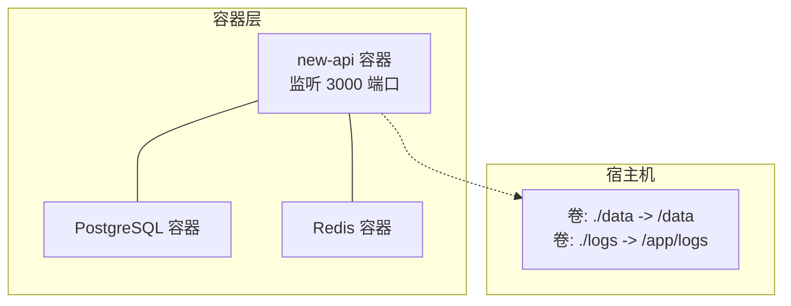
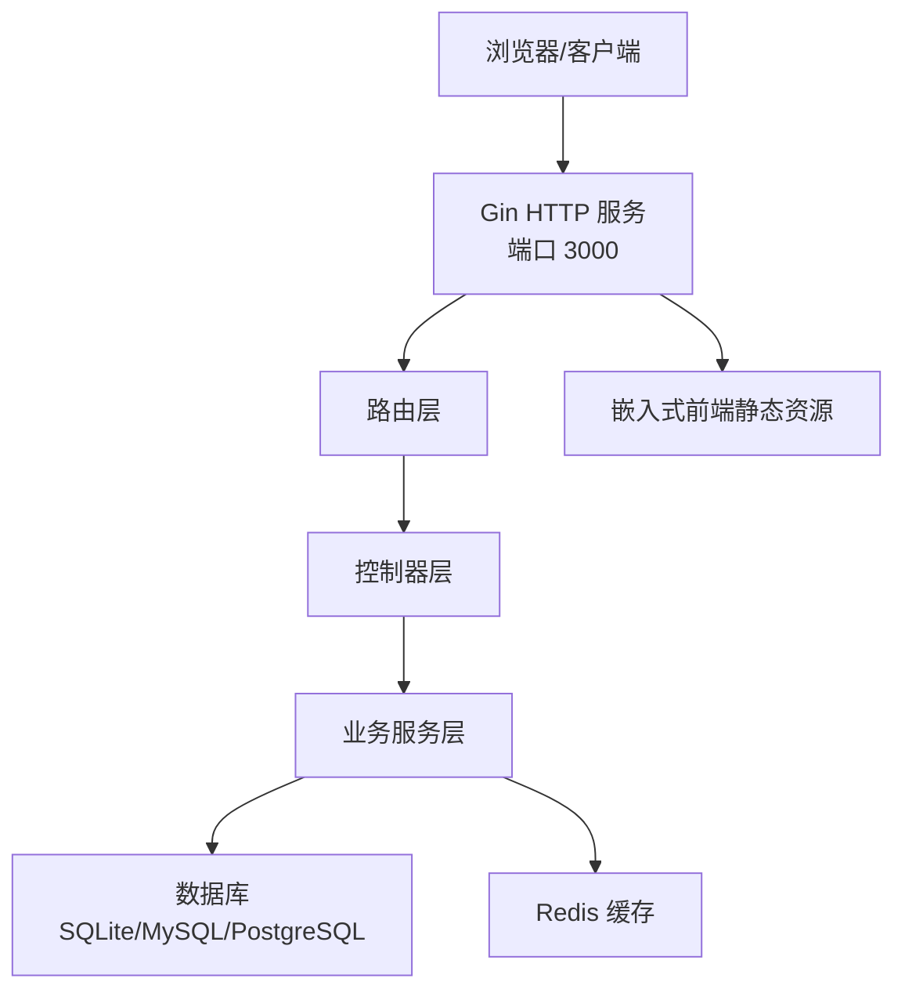
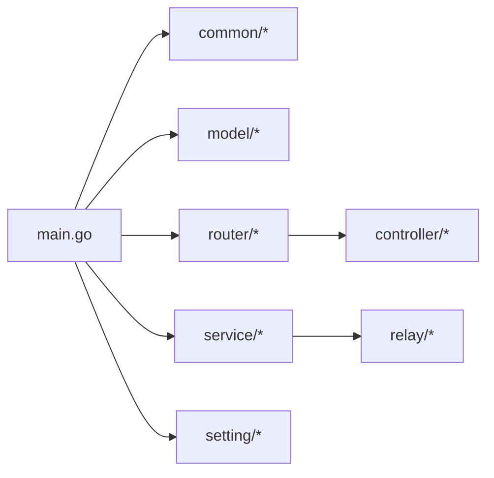

# 快速入门

<cite>
**本文引用的文件**
- [README.md](file://README.md)
- [docker-compose.yml](file://docker-compose.yml)
- [Dockerfile](file://Dockerfile)
- [.env.example](file://.env.example)
- [main.go](file://main.go)
- [docs/installation/BT.md](file://docs/installation/BT.md)
- [setting/config/config.go](file://setting/config/config.go)
- [model/main.go](file://model/main.go)
- [bin/migration_v0.2-v0.3.sql](file://bin/migration_v0.2-v0.3.sql)
- [bin/migration_v0.3-v0.4.sql](file://bin/migration_v0.3-v0.4.sql)
- [common/env.go](file://common/env.go)
</cite>

## 目录
1. [简介](#简介)
2. [项目结构](#项目结构)
3. [核心组件](#核心组件)
4. [架构总览](#架构总览)
5. [详细组件分析](#详细组件分析)
6. [依赖关系分析](#依赖关系分析)
7. [性能与配置建议](#性能与配置建议)
8. [故障排查指南](#故障排查指南)
9. [结论](#结论)
10. [附录](#附录)

## 简介
本指南面向首次部署 new-api 的用户，目标是帮助你在最短时间内完成环境准备、初始配置与启动运行，并成功访问系统。文档覆盖三种部署方式：
- Docker Compose（推荐）
- Docker 命令行
- 宝塔面板

同时，提供环境变量说明、数据库选择与初始化流程、常见问题与排错建议，确保新手也能独立完成安装。

## 项目结构
new-api 是一个基于 Go 的后端服务，内置前端静态资源并通过 Gin 框架提供 Web 与中继接口；数据库支持 SQLite、MySQL 与 PostgreSQL；通过 Docker 镜像打包了前端构建产物与后端二进制。

图表来源
- [docker-compose.yml](file://docker-compose.yml#L1-L85)

章节来源
- [README.md](file://README.md#L102-L149)
- [docker-compose.yml](file://docker-compose.yml#L1-L85)
- [Dockerfile](file://Dockerfile#L1-L39)

## 核心组件
- 启动入口与初始化
  - main.go 负责加载 .env、初始化日志、数据库、Redis、路由与 HTTP 服务器，并注入分析脚本。
- 配置管理
  - setting/config/config.go 提供统一的配置注册、导入导出与热更新能力。
- 数据库与迁移
  - model/main.go 支持 SQLite、MySQL、PostgreSQL，自动迁移核心表；包含中文字符集检查与并发迁移优化。
- 环境变量解析
  - common/env.go 提供整型、布尔、字符串的环境变量解析辅助方法。
- 部署与运行
  - Dockerfile 将前端构建产物嵌入后端镜像；docker-compose.yml 提供一键编排与健康检查。

章节来源
- [main.go](file://main.go#L1-L170)
- [setting/config/config.go](file://setting/config/config.go#L1-L90)
- [model/main.go](file://model/main.go#L1-L120)
- [common/env.go](file://common/env.go#L1-L39)
- [Dockerfile](file://Dockerfile#L1-L39)
- [docker-compose.yml](file://docker-compose.yml#L1-L85)

## 架构总览
new-api 采用“容器化 + 多数据库 + 缓存”的架构。默认使用 PostgreSQL + Redis，数据持久化于宿主机卷，便于升级与备份。

图表来源
- [main.go](file://main.go#L127-L170)
- [docker-compose.yml](file://docker-compose.yml#L1-L85)

## 详细组件分析

### 部署方式一：Docker Compose（推荐）
- 准备工作
  - 安装 Docker 与 Docker Compose。
  - 准备一个可写目录用于存放数据与日志（例如 ./data 与 ./logs）。
- 步骤
  1) 克隆仓库并进入目录
  2) 编辑 docker-compose.yml（如需使用 MySQL，按注释切换服务与连接串）
  3) 启动服务：docker-compose up -d
  4) 访问 http://localhost:3000
- 关键点
  - 默认使用 PostgreSQL 与 Redis，端口映射 3000:3000。
  - 数据卷映射至 /data 与 /app/logs，便于持久化与日志查看。
  - 健康检查通过访问 /api/status 判断服务就绪。
- 环境变量
  - 可在 docker-compose.yml 的 environment 字段设置，如 SQL_DSN、REDIS_CONN_STRING、TZ、ERROR_LOG_ENABLED、BATCH_UPDATE_ENABLED 等。
  - 如需多机部署或启用加密功能，务必设置 SESSION_SECRET 与 CRYPTO_SECRET。

章节来源
- [README.md](file://README.md#L102-L149)
- [docker-compose.yml](file://docker-compose.yml#L1-L85)

### 部署方式二：Docker 命令行
- 使用 SQLite（默认）
  - 映射数据目录至 /data，端口 3000:3000，设置时区。
- 使用 MySQL
  - 通过环境变量 SQL_DSN 指向 MySQL，示例命令见 README。
- 注意事项
  - 数据持久化：务必挂载 /data 目录。
  - 端口冲突：如 3000 已被占用，修改 -p 映射。
  - 多机部署：必须设置 SESSION_SECRET。

章节来源
- [README.md](file://README.md#L118-L149)

### 部署方式三：宝塔面板
- 步骤
  1) 安装宝塔面板（版本要求见 README）
  2) 应用商店搜索 “New-API”
  3) 一键安装
- 密钥提示
  - 宝塔安装后，需要设置环境变量 SESSION_SECRET（密钥）。

章节来源
- [README.md](file://README.md#L363-L372)
- [docs/installation/BT.md](file://docs/installation/BT.md#L1-L4)

### 环境变量与初始配置
- 常用变量
  - SESSION_SECRET：多机部署必需
  - CRYPTO_SECRET：启用 Redis 时建议设置
  - SQL_DSN：数据库连接串（支持 SQLite、MySQL、PostgreSQL）
  - REDIS_CONN_STRING：Redis 连接串
  - TZ：时区
  - ERROR_LOG_ENABLED：启用错误日志
  - BATCH_UPDATE_ENABLED：启用批量更新
  - STREAMING_TIMEOUT：流式超时（秒）
  - PORT：HTTP 端口（默认 3000）
- .env 示例
  - .env.example 展示了可选的调试、数据库、缓存、任务、超时、Gemini 视觉、会话密钥、其他配置等键位。
- 启动流程
  - main.go 会优先加载 .env，随后初始化日志、数据库、Redis、路由与 HTTP 服务器。
  - 若未设置 SESSION_SECRET，登录状态可能异常；若使用 Redis，建议设置 CRYPTO_SECRET。

章节来源
- [README.md](file://README.md#L296-L315)
- [.env.example](file://.env.example#L1-L77)
- [main.go](file://main.go#L211-L261)
- [common/env.go](file://common/env.go#L1-L39)

### 数据库选择与初始化
- 支持的数据库
  - SQLite：无需额外服务，适合单机测试
  - MySQL：需满足版本要求，自动迁移并检查中文字符集
  - PostgreSQL：默认 Compose 方案
- 初始化流程
  - 启动后自动执行数据库迁移（AutoMigrate），创建核心表。
  - 若数据库中不存在用户，将创建 root 用户并初始化系统状态。
  - 日志库可单独配置（LOG_SQL_DSN），否则与主库共用。
- 迁移脚本
  - bin/migration_v0.2-v0.3.sql 与 bin/migration_v0.3-v0.4.sql 提供历史版本迁移逻辑，系统会在启动时根据需要执行。

章节来源
- [model/main.go](file://model/main.go#L177-L248)
- [bin/migration_v0.2-v0.3.sql](file://bin/migration_v0.2-v0.3.sql#L1-L7)
- [bin/migration_v0.3-v0.4.sql](file://bin/migration_v0.3-v0.4.sql#L1-L18)

### 配置热更新与分析脚本注入
- 配置热更新
  - setting/config/config.go 提供配置注册、从数据库加载、保存到数据库与导出能力，支持多模块配置合并。
- 分析脚本注入
  - main.go 支持注入 Umami 与 Google Analytics 脚本，通过环境变量控制。

章节来源
- [setting/config/config.go](file://setting/config/config.go#L1-L90)
- [main.go](file://main.go#L172-L209)

## 依赖关系分析
- 组件耦合
  - main.go 依赖 common、model、router、service、setting 等模块；router 负责路由注册；model 负责数据库与缓存初始化；service 提供 HTTP 客户端与工具。
- 外部依赖
  - Docker 镜像内嵌前端构建产物，运行时暴露 3000 端口；Compose 默认依赖 PostgreSQL 与 Redis。
- 潜在循环依赖
  - 代码层面未发现明显循环依赖；各模块职责清晰。

图表来源
- [main.go](file://main.go#L1-L170)

章节来源
- [main.go](file://main.go#L1-L170)

## 性能与配置建议
- 数据库连接池
  - 可通过 SQL_MAX_IDLE_CONNS、SQL_MAX_OPEN_CONNS、SQL_MAX_LIFETIME 调整连接池参数，提升高并发场景下的稳定性。
- 流式处理
  - STREAMING_TIMEOUT 可根据上游模型的空补全情况适当增大，避免早期断流。
- 缓存与批量更新
  - 启用 Redis 可显著降低数据库压力；BATCH_UPDATE_ENABLED 可减少频繁写入。
- 多机部署
  - 必须设置 SESSION_SECRET；若使用 Redis，建议设置 CRYPTO_SECRET 以保障数据安全。

章节来源
- [README.md](file://README.md#L296-L315)
- [.env.example](file://.env.example#L1-L77)
- [model/main.go](file://model/main.go#L194-L200)

## 故障排查指南
- 无法访问服务
  - 检查端口映射与防火墙；确认容器健康检查通过（Compose 中已内置健康检查）。
- 登录状态异常或多机部署失效
  - 未设置 SESSION_SECRET 导致会话不一致，需在环境变量中设置。
- 数据库连接失败
  - 确认 SQL_DSN 格式正确；MySQL 需满足字符集要求；PostgreSQL 默认密码与 Compose 一致。
- Redis 连接失败
  - 确认 REDIS_CONN_STRING 正确；Compose 默认使用 redis 服务名。
- 日志与错误定位
  - 开启 ERROR_LOG_ENABLED 并查看 /app/logs（Compose 挂载）；或查看容器日志。
- 首次启动无用户
  - 若数据库为空，系统会自动创建 root 用户并初始化系统；请妥善保管初始凭证。

章节来源
- [docker-compose.yml](file://docker-compose.yml#L42-L51)
- [README.md](file://README.md#L374-L388)
- [model/main.go](file://model/main.go#L64-L90)

## 结论
通过本指南，你可以快速完成 new-api 的部署与初始配置。建议优先使用 Docker Compose，它能一次性拉起 PostgreSQL、Redis 与应用服务，并提供健康检查与日志卷。生产环境请务必设置 SESSION_SECRET、CRYPTO_SECRET，并根据业务规模调整数据库连接池与缓存策略。

## 附录

### 快速操作清单
- Docker Compose
  - 修改 docker-compose.yml（如需 MySQL）
  - docker-compose up -d
  - 访问 http://localhost:3000
- Docker 命令行
  - 使用 SQLite：挂载 /data，端口映射 3000:3000
  - 使用 MySQL：设置 SQL_DSN 环境变量
- 宝塔面板
  - 应用商店安装 New-API
  - 设置 SESSION_SECRET

章节来源
- [README.md](file://README.md#L102-L149)
- [docker-compose.yml](file://docker-compose.yml#L1-L85)
- [docs/installation/BT.md](file://docs/installation/BT.md#L1-L4)