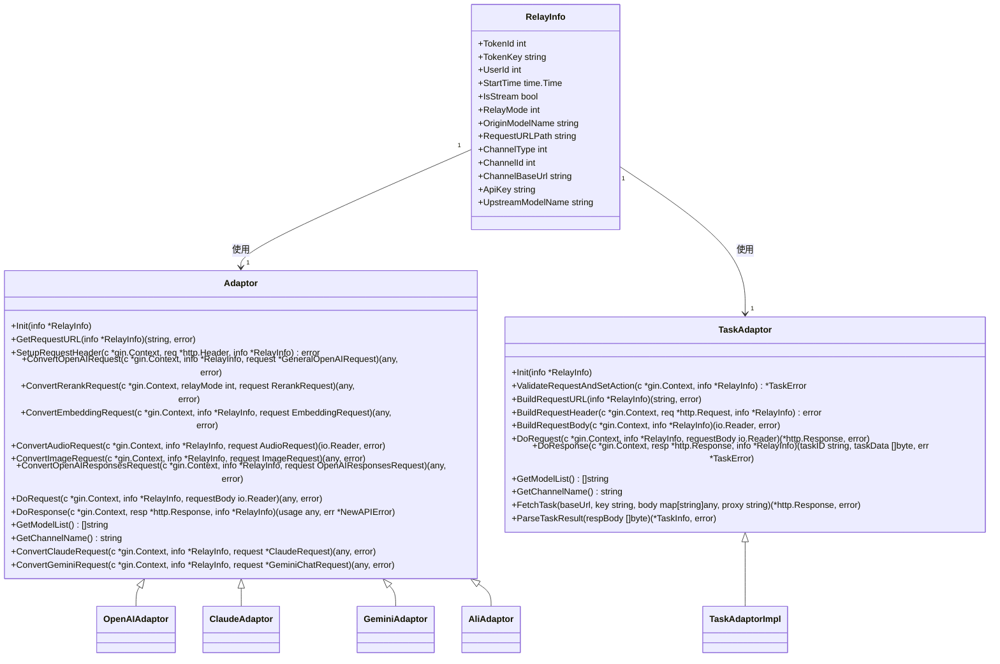
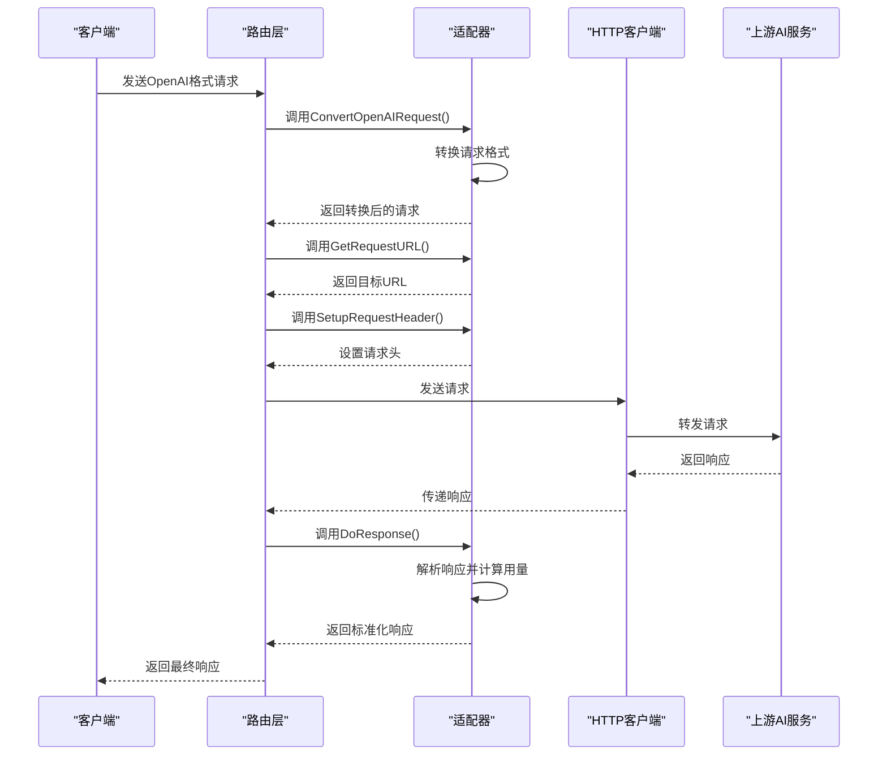
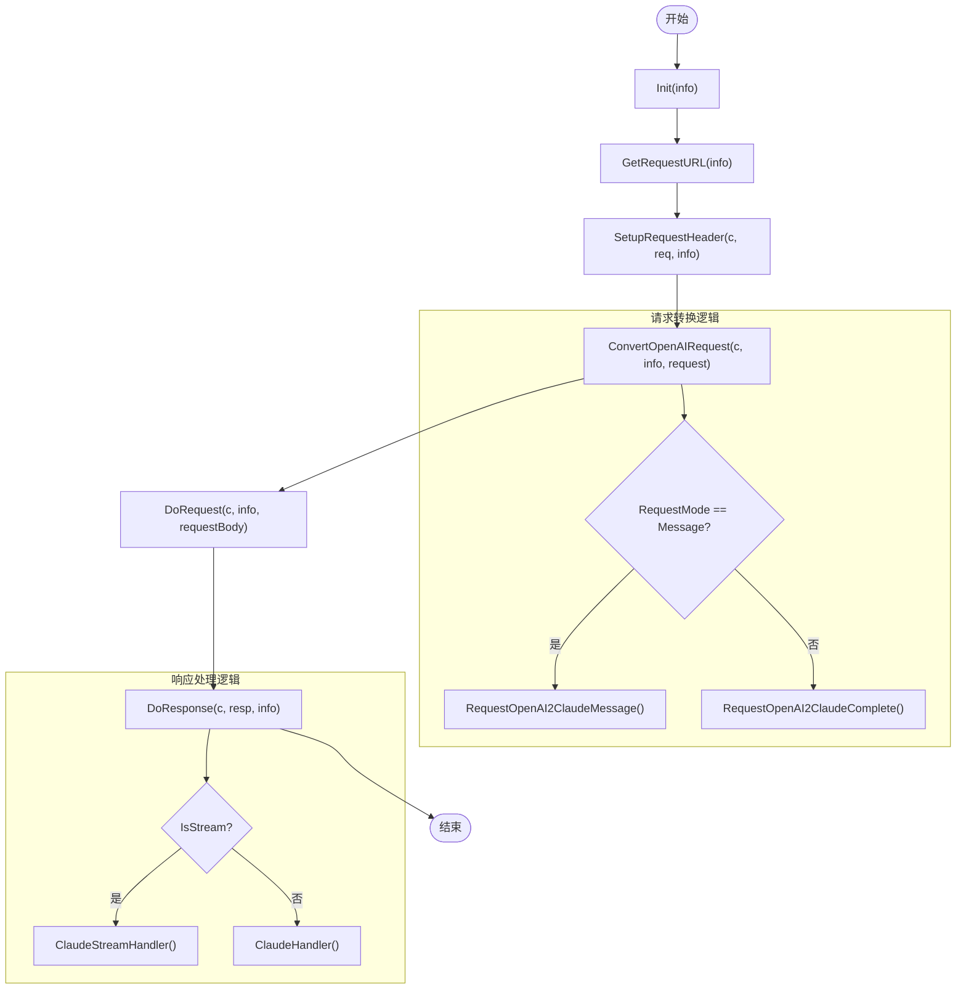
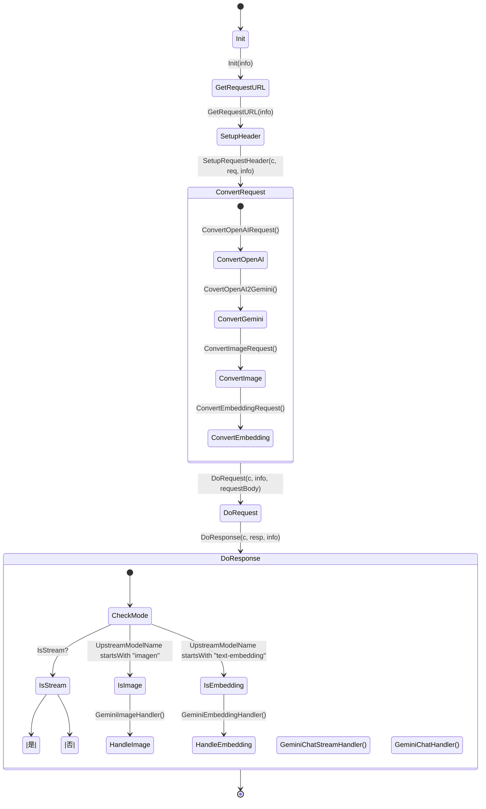
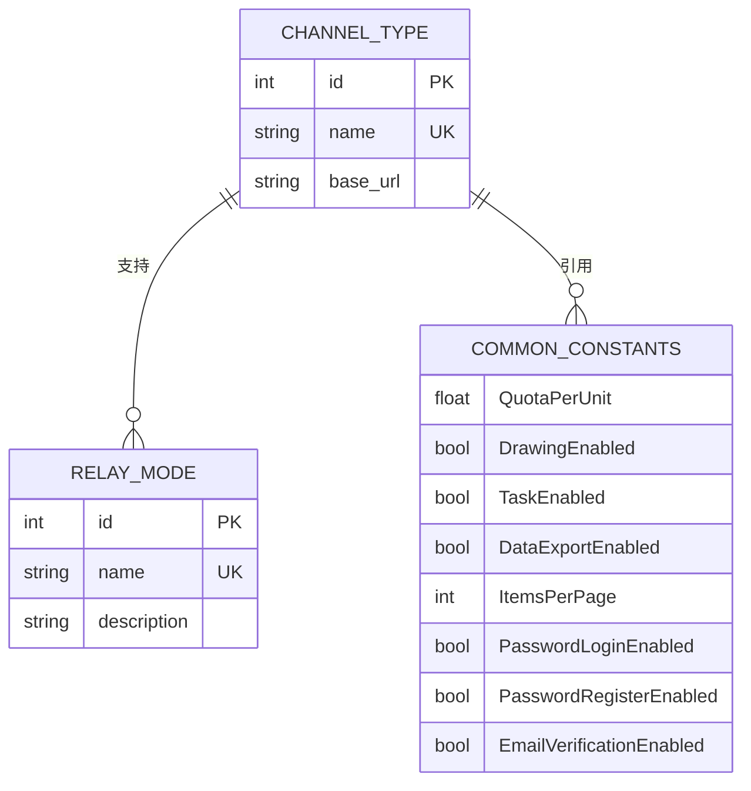
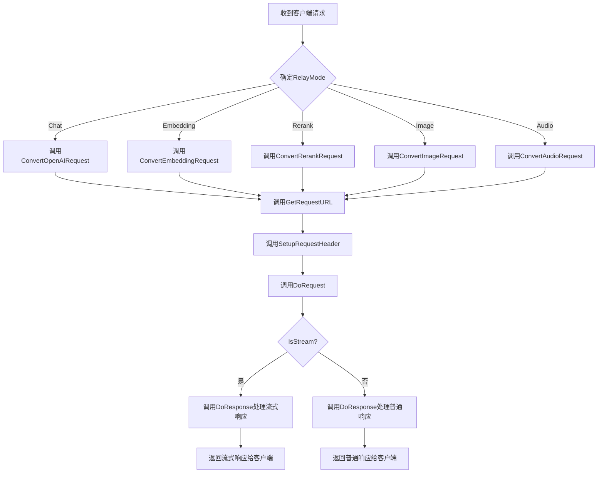
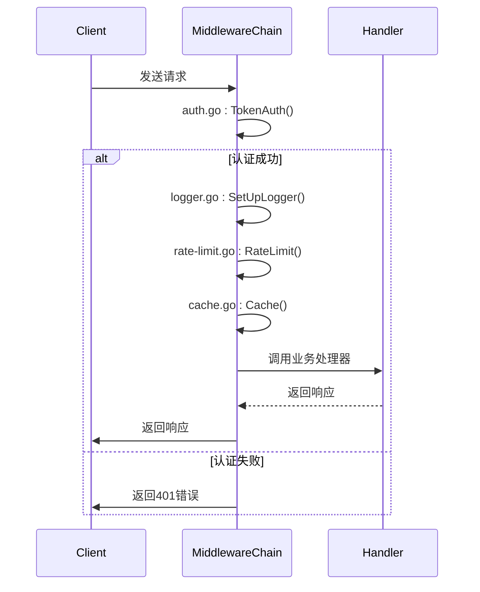
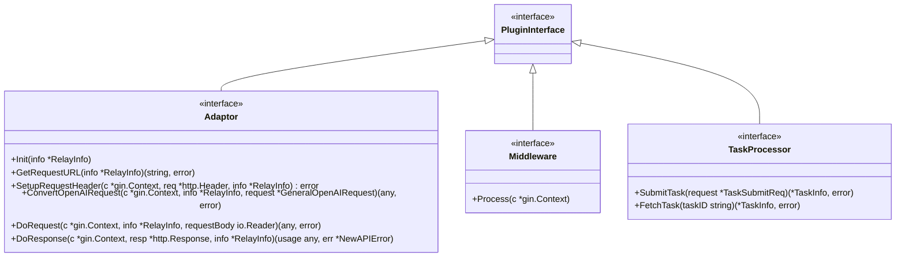
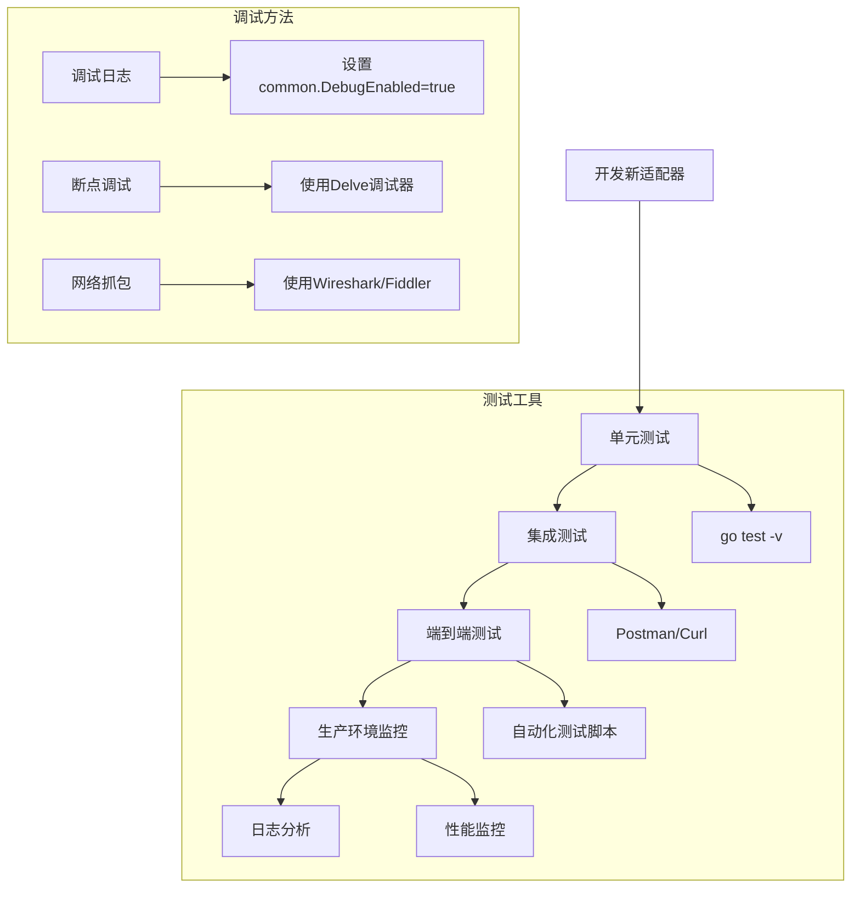

# 扩展开发

<cite>
**本文档引用的文件**   
- [adaptor.go](file://relay/channel/adapter.go)
- [api_request.go](file://relay/channel/api_request.go)
- [constants.go](file://common/constants.go)
- [openai_request.go](file://dto/openai_request.go)
- [openai_response.go](file://dto/openai_response.go)
- [openai/adaptor.go](file://relay/channel/openai/adaptor.go)
- [claude/adaptor.go](file://relay/channel/claude/adaptor.go)
- [gemini/adaptor.go](file://relay/channel/gemini/adaptor.go)
- [ali/adaptor.go](file://relay/channel/ali/adaptor.go)
- [ali/dto.go](file://relay/channel/ali/dto.go)
- [channel.go](file://constant/channel.go)
- [relay_info.go](file://relay/common/relay_info.go)
- [auth.go](file://middleware/auth.go)
- [logger.go](file://middleware/logger.go)
</cite>

## 目录
1. [适配器开发](#适配器开发)
2. [常量与配置](#常量与配置)
3. [请求/响应处理](#请求响应处理)
4. [中间件开发](#中间件开发)
5. [插件框架与接口](#插件框架与接口)
6. [测试与调试](#测试与调试)

## 适配器开发

本节详细说明如何为新的AI服务添加适配器。适配器是系统与不同AI服务提供商之间的桥梁，负责将标准化的请求转换为特定服务的格式，并将响应转换回标准格式。

核心适配器接口定义在 `relay/channel/adapter.go` 文件中，包含 `Adaptor` 和 `TaskAdaptor` 两个主要接口。开发者需要实现这些接口来支持新的AI服务。



**Diagram sources**
- [relay/channel/adapter.go](file://relay/channel/adapter.go#L15-L57)
- [relay/common/relay_info.go](file://relay/common/relay_info.go#L81-L129)

**Section sources**
- [relay/channel/adapter.go](file://relay/channel/adapter.go#L1-L58)
- [relay/common/relay_info.go](file://relay/common/relay_info.go#L1-L637)

### OpenAI 适配器实现

`relay/channel/openai/adaptor.go` 文件提供了 OpenAI 适配器的完整实现，可作为开发新适配器的参考模板。该适配器实现了 `Adaptor` 接口的所有方法，处理了从请求转换、URL构建、头部设置到响应处理的完整流程。



**Diagram sources**
- [relay/channel/openai/adaptor.go](file://relay/channel/openai/adaptor.go#L36-L651)
- [relay/channel/api_request.go](file://relay/channel/api_request.go#L61-L324)

### Claude 适配器实现

`relay/channel/claude/adaptor.go` 文件展示了如何为Anthropic的Claude服务创建适配器。该实现展示了如何处理特定于Claude的请求模式（completion vs message）和API版本控制。



**Diagram sources**
- [relay/channel/claude/adaptor.go](file://relay/channel/claude/adaptor.go#L24-L134)

### Gemini 适配器实现

`relay/channel/gemini/adaptor.go` 文件提供了Google Gemini服务的适配器实现。该适配器展示了如何处理流式响应、图像生成和嵌入等复杂功能。



**Diagram sources**
- [relay/channel/gemini/adaptor.go](file://relay/channel/gemini/adaptor.go#L21-L285)

## 常量与配置

系统使用多个常量文件来定义全局配置和通道类型。这些常量对于适配器的正确行为至关重要。



**Diagram sources**
- [constant/channel.go](file://constant/channel.go#L3-L207)
- [common/constants.go](file://common/constants.go#L1-L208)

### 通道类型常量

`constant/channel.go` 文件定义了所有支持的AI服务通道类型，包括唯一的整数ID、基础URL和可读名称。新服务的适配器必须在此文件中注册其类型。

```go
const (
    ChannelTypeUnknown        = 0
    ChannelTypeOpenAI         = 1
    ChannelTypeMidjourney     = 2
    ChannelTypeAzure          = 3
    // ... 其他类型
    ChannelTypeAli            = 17
    ChannelTypeGemini         = 24
    ChannelTypeClaude         = 14
)
```

### 全局常量

`common/constants.go` 文件包含系统范围的配置常量，如配额设置、功能开关和速率限制参数。这些常量影响所有适配器的行为。

```go
var (
    QuotaPerUnit = 500 * 1000.0 // $0.002 / 1K tokens
    DrawingEnabled = true
    TaskEnabled = true
    DataExportEnabled = true
    PasswordLoginEnabled = true
    PasswordRegisterEnabled = true
    EmailVerificationEnabled = false
)
```

**Section sources**
- [constant/channel.go](file://constant/channel.go#L1-L207)
- [common/constants.go](file://common/constants.go#L1-L208)

## 请求响应处理

本节详细说明适配器如何处理请求和响应的转换逻辑。核心处理流程包括请求转换、API调用和响应处理三个阶段。



**Diagram sources**
- [relay/channel/api_request.go](file://relay/channel/api_request.go#L61-L324)
- [relay/channel/adapter.go](file://relay/channel/adapter.go#L15-L57)

### 请求转换

请求转换是适配器的核心功能，负责将标准化的请求对象转换为特定服务所需的格式。以阿里云适配器为例，`relay/channel/ali/adaptor.go` 中的 `ConvertOpenAIRequest` 方法展示了这一过程：

```go
func (a *Adaptor) ConvertOpenAIRequest(c *gin.Context, info *relaycommon.RelayInfo, request *dto.GeneralOpenAIRequest) (any, error) {
    if request == nil {
        return nil, errors.New("request is nil")
    }
    aliReq := requestOpenAI2Ali(*request)
    return aliReq, nil
}
```

同时，`relay/channel/ali/dto.go` 文件定义了阿里云服务特有的数据结构：

```go
type AliChatRequest struct {
    Model      string        `json:"model"`
    Input      AliInput      `json:"input,omitempty"`
    Parameters AliParameters `json:"parameters,omitempty"`
}

type AliInput struct {
    Messages []AliMessage `json:"messages"`
}

type AliMessage struct {
    Content any    `json:"content"`
    Role    string `json:"role"`
}
```

### 响应处理

响应处理负责将上游服务的响应转换为标准化格式，并提取用量信息。`relay/channel/openai/adaptor.go` 中的 `DoResponse` 方法展示了如何根据不同的 `RelayMode` 调用相应的处理函数：

```go
func (a *Adaptor) DoResponse(c *gin.Context, resp *http.Response, info *relaycommon.RelayInfo) (usage any, err *types.NewAPIError) {
    switch info.RelayMode {
    case relayconstant.RelayModeRealtime:
        err, usage = OpenaiRealtimeHandler(c, info)
    case relayconstant.RelayModeAudioSpeech:
        usage = OpenaiTTSHandler(c, resp, info)
    case relayconstant.RelayModeAudioTranslation:
        fallthrough
    case relayconstant.RelayModeAudioTranscription:
        err, usage = OpenaiSTTHandler(c, resp, info, a.ResponseFormat)
    default:
        if info.IsStream {
            usage, err = OaiStreamHandler(c, info, resp)
        } else {
            usage, err = OpenaiHandler(c, info, resp)
        }
    }
    return
}
```

**Section sources**
- [relay/channel/ali/adaptor.go](file://relay/channel/ali/adaptor.go#L86-L107)
- [relay/channel/ali/dto.go](file://relay/channel/ali/dto.go#L1-L152)
- [relay/channel/openai/adaptor.go](file://relay/channel/openai/adaptor.go#L576-L616)

## 中间件开发

中间件是系统处理请求和响应的关键组件，负责认证、日志记录、速率限制等功能。开发者可以创建自定义中间件来扩展系统功能。



**Diagram sources**
- [middleware/auth.go](file://middleware/auth.go#L1-L322)
- [middleware/logger.go](file://middleware/logger.go#L1-L27)

### 认证中间件

`middleware/auth.go` 文件实现了系统的认证逻辑，包括会话认证和令牌认证。`TokenAuth` 函数是处理API密钥认证的核心：

```go
func TokenAuth() func(c *gin.Context) {
    return func(c *gin.Context) {
        // 处理WebSocket认证
        if c.Request.Header.Get("Sec-WebSocket-Protocol") != "" {
            key := extractKeyFromWebSocketProtocol(c)
            c.Request.Header.Set("Authorization", "Bearer "+key)
        }
        
        // 处理Gemini API密钥
        if isGeminiPath(c.Request.URL.Path) {
            skKey := c.Query("key")
            if skKey != "" {
                c.Request.Header.Set("Authorization", "Bearer "+skKey)
            }
        }
        
        // 验证令牌
        key := extractBearerToken(c)
        token, err := model.ValidateUserToken(key)
        if err != nil {
            abortWithOpenAiMessage(c, http.StatusUnauthorized, err.Error())
            return
        }
        
        // 设置上下文信息
        SetupContextForToken(c, token)
        c.Next()
    }
}
```

### 日志中间件

`middleware/logger.go` 文件实现了请求日志记录功能，使用Gin框架的内置日志格式化器：

```go
func SetUpLogger(server *gin.Engine) {
    server.Use(gin.LoggerWithFormatter(func(param gin.LogFormatterParams) string {
        requestID := getRequestID(param)
        return fmt.Sprintf("[GIN] %s | %s | %3d | %13v | %15s | %7s %s\n",
            param.TimeStamp.Format("2006/01/02 - 15:04:05"),
            requestID,
            param.StatusCode,
            param.Latency,
            param.ClientIP,
            param.Method,
            param.Path,
        )
    }))
}
```

**Section sources**
- [middleware/auth.go](file://middleware/auth.go#L1-L322)
- [middleware/logger.go](file://middleware/logger.go#L1-L27)

## 插件框架与接口

系统提供了灵活的插件框架，允许开发者通过实现特定接口来扩展功能。核心接口包括适配器接口、中间件接口和任务处理器接口。



**Diagram sources**
- [relay/channel/adapter.go](file://relay/channel/adapter.go#L15-L57)
- [middleware/auth.go](file://middleware/auth.go#L1-L322)

### 扩展开发最佳实践

1. **遵循接口契约**：确保新适配器完全实现 `Adaptor` 接口的所有方法
2. **错误处理**：在所有可能失败的操作中返回适当的错误信息
3. **资源管理**：正确管理HTTP连接、文件句柄等资源，避免泄漏
4. **并发安全**：确保适配器在多goroutine环境下是安全的
5. **日志记录**：在关键路径上添加适当的日志记录，便于调试
6. **配置灵活性**：通过 `ChannelSetting` 和 `ChannelOtherSettings` 支持配置选项

**Section sources**
- [relay/channel/adapter.go](file://relay/channel/adapter.go#L15-L57)

## 测试与调试

有效的测试和调试策略对于确保新功能的稳定性和可靠性至关重要。系统提供了多种工具和方法来支持开发者的测试工作。



**Diagram sources**
- [relay/channel/api_request.go](file://relay/channel/api_request.go#L61-L324)

### 测试策略

1. **单元测试**：为适配器的每个方法编写单元测试，验证其正确性
2. **集成测试**：使用真实或模拟的上游服务测试完整的请求-响应流程
3. **边界测试**：测试各种边界条件，如空请求、超大请求、网络超时等
4. **性能测试**：评估适配器在高负载下的性能表现
5. **兼容性测试**：确保适配器与不同版本的上游API兼容

### 调试技巧

1. **启用调试模式**：在 `common/constants.go` 中设置 `DebugEnabled = true` 以启用详细日志
2. **使用请求ID**：利用 `RequestIdKey` 跟踪特定请求的完整处理流程
3. **检查中间件**：确保认证、日志等中间件正确处理请求
4. **验证配置**：确认通道配置（如API密钥、基础URL）正确无误
5. **监控资源使用**：注意内存和连接使用情况，避免资源泄漏

**Section sources**
- [common/constants.go](file://common/constants.go#L1-L208)
- [relay/channel/api_request.go](file://relay/channel/api_request.go#L61-L324)