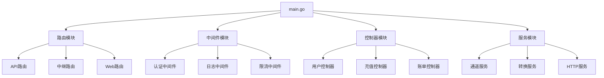
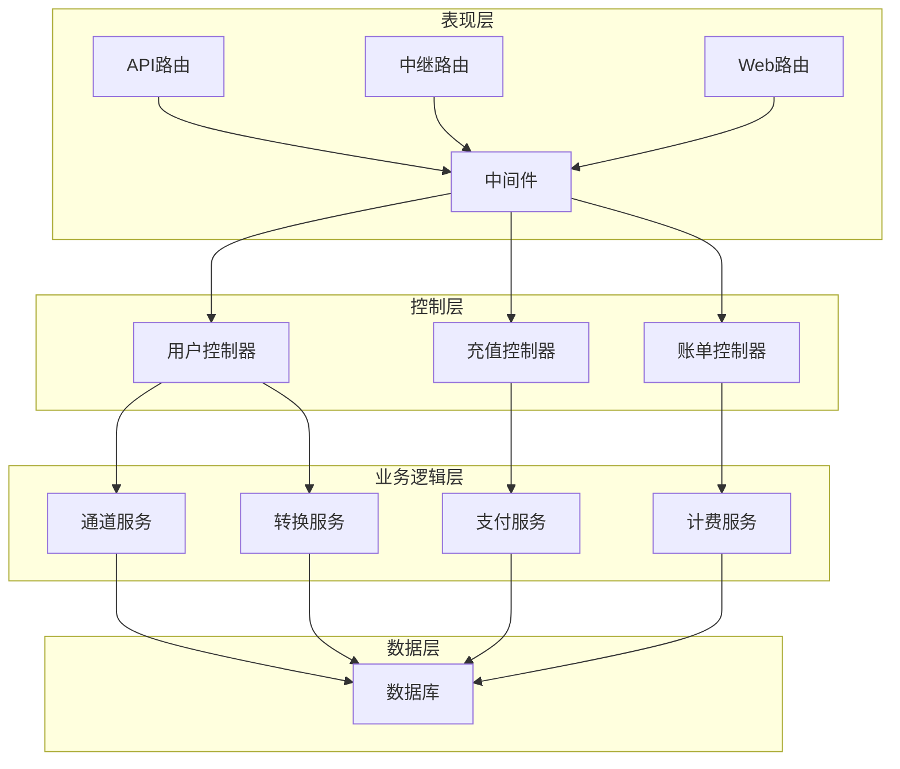
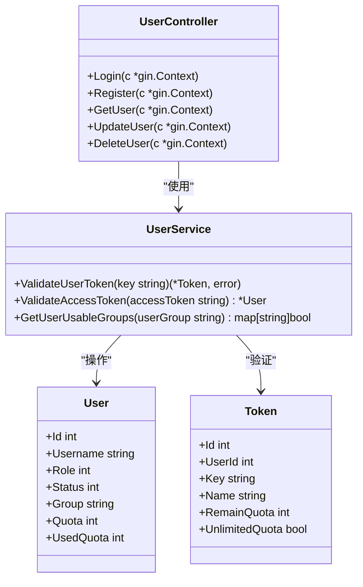
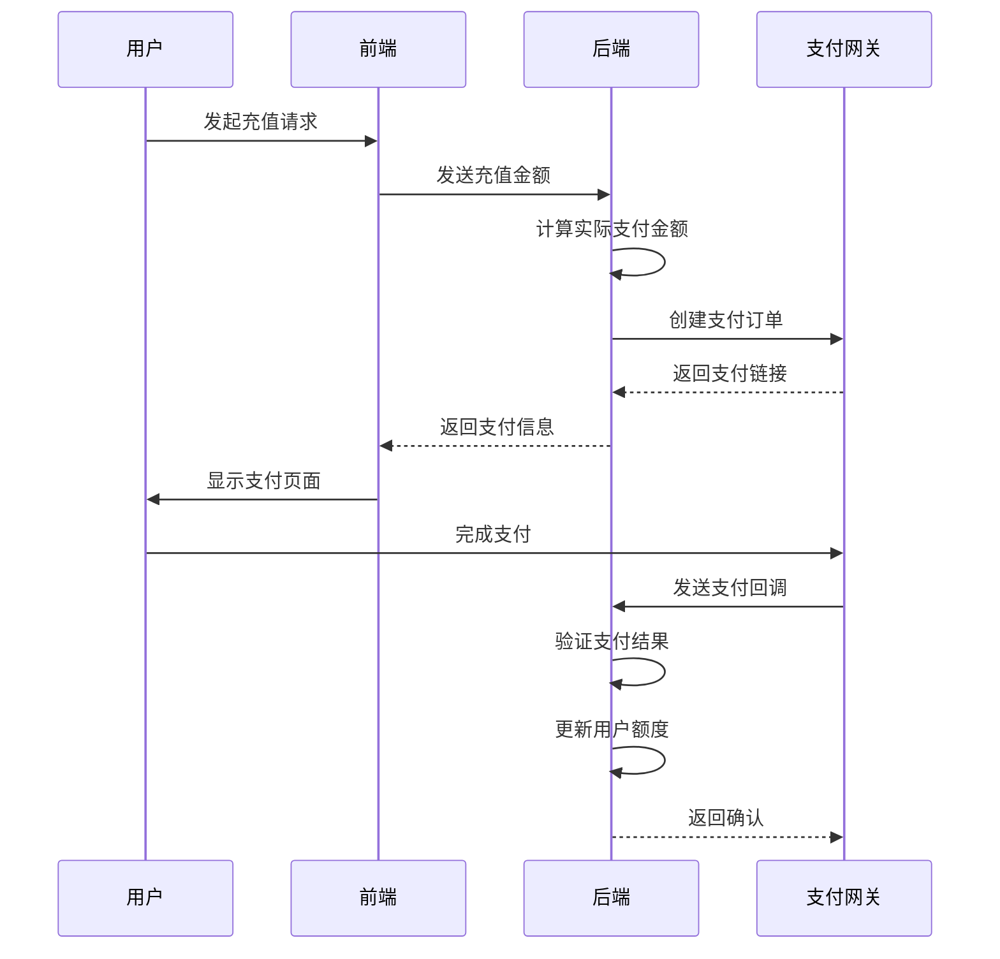
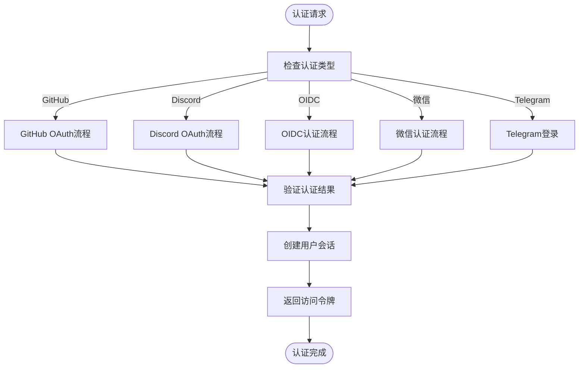
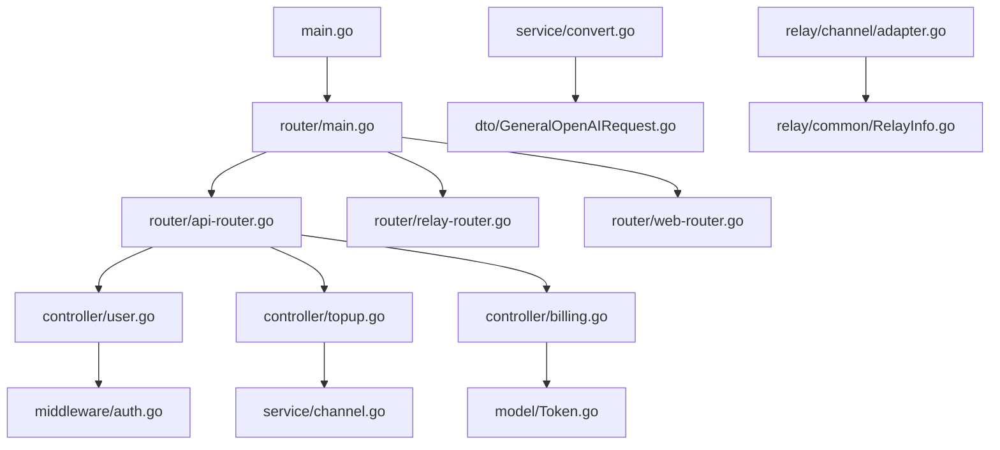

# 插件开发框架

<cite>
**本文档引用的文件**   
- [main.go](file://main.go)
- [router/main.go](file://router/main.go)
- [router/api-router.go](file://router/api-router.go)
- [router/relay-router.go](file://router/relay-router.go)
- [router/web-router.go](file://router/web-router.go)
- [middleware/auth.go](file://middleware/auth.go)
- [middleware/utils.go](file://middleware/utils.go)
- [controller/user.go](file://controller/user.go)
- [controller/topup.go](file://controller/topup.go)
- [controller/billing.go](file://controller/billing.go)
- [service/channel.go](file://service/channel.go)
- [service/convert.go](file://service/convert.go)
- [setting/payment_stripe.go](file://setting/payment_stripe.go)
- [setting/payment_creem.go](file://setting/payment_creem.go)
- [relay/channel/adapter.go](file://relay/channel/adapter.go)
</cite>

## 目录
1. [简介](#简介)
2. [项目结构](#项目结构)
3. [核心组件](#核心组件)
4. [架构概述](#架构概述)
5. [详细组件分析](#详细组件分析)
6. [依赖分析](#依赖分析)
7. [性能考虑](#性能考虑)
8. [故障排除指南](#故障排除指南)
9. [结论](#结论)

## 简介
本项目是一个高度可扩展的API代理服务，旨在为用户提供统一的接口来访问多种AI服务。系统采用插件化架构设计，通过控制器（controller）、中间件（middleware）和服务层（service）的组合实现功能扩展。核心架构支持灵活的插件开发模式，允许开发者轻松创建新的API端点、注入自定义业务逻辑、扩展用户管理和计费功能。系统通过适配器模式支持多种第三方服务集成，如支付系统（Stripe、Creem）和认证方式（GitHub、Discord、OIDC等）。整体设计遵循松耦合原则，确保插件与核心系统的独立性，同时提供清晰的API和接口规范。

## 项目结构
项目采用分层架构设计，主要分为以下几个核心模块：

**Diagram sources**
- [main.go](file://main.go#L1-L261)
- [router/main.go](file://router/main.go#L1-L34)

**Section sources**
- [main.go](file://main.go#L1-L261)
- [router/main.go](file://router/main.go#L1-L34)

## 核心组件
系统的核心组件包括路由系统、认证系统、控制器和服务层。路由系统负责将请求分发到相应的处理程序，认证系统确保请求的安全性，控制器处理具体的业务逻辑，服务层提供可复用的业务功能。这种分层设计使得系统具有良好的可维护性和可扩展性。

**Section sources**
- [main.go](file://main.go#L1-L261)
- [router/main.go](file://router/main.go#L1-L34)

## 架构概述
系统采用典型的MVC架构模式，结合插件化设计理念，实现了高度的模块化和可扩展性。整体架构分为三层：表现层（路由和中间件）、控制层（控制器）和业务逻辑层（服务）。

**Diagram sources**
- [main.go](file://main.go#L1-L261)
- [router/main.go](file://router/main.go#L1-L34)
- [controller/user.go](file://controller/user.go#L1-L800)
- [controller/topup.go](file://controller/topup.go#L1-L393)
- [controller/billing.go](file://controller/billing.go#L1-L109)

## 详细组件分析
### 用户管理组件分析
用户管理组件负责处理用户相关的所有操作，包括用户注册、登录、信息更新和权限管理。系统通过会话和访问令牌两种方式实现用户认证，支持多角色权限控制。

**Diagram sources**
- [controller/user.go](file://controller/user.go#L1-L800)
- [middleware/auth.go](file://middleware/auth.go#L1-L322)

### 支付集成组件分析
支付集成组件实现了对多种支付方式的支持，包括Stripe、Creem和易支付。系统通过配置化的方式管理支付参数，支持灵活的计费策略和折扣设置。

**Diagram sources**
- [controller/topup.go](file://controller/topup.go#L1-L393)
- [setting/payment_stripe.go](file://setting/payment_stripe.go#L1-L9)
- [setting/payment_creem.go](file://setting/payment_creem.go#L1-L7)

### 认证扩展组件分析
认证扩展组件支持多种第三方认证方式，包括GitHub、Discord、OIDC等。系统通过统一的认证接口实现不同认证方式的插件化管理。

**Diagram sources**
- [controller/user.go](file://controller/user.go#L1-L800)
- [middleware/auth.go](file://middleware/auth.go#L1-L322)

## 依赖分析
系统依赖关系清晰，各模块之间通过定义良好的接口进行通信，实现了低耦合高内聚的设计目标。

**Diagram sources**
- [main.go](file://main.go#L1-L261)
- [router/main.go](file://router/main.go#L1-L34)
- [controller/user.go](file://controller/user.go#L1-L800)
- [controller/topup.go](file://controller/topup.go#L1-L393)
- [controller/billing.go](file://controller/billing.go#L1-L109)

**Section sources**
- [main.go](file://main.go#L1-L261)
- [router/main.go](file://router/main.go#L1-L34)
- [controller/user.go](file://controller/user.go#L1-L800)
- [controller/topup.go](file://controller/topup.go#L1-L393)
- [controller/billing.go](file://controller/billing.go#L1-L109)

## 性能考虑
系统在设计时充分考虑了性能优化，通过多种机制确保高并发场景下的稳定运行。内存缓存用于加速频繁访问的数据查询，批量更新机制减少数据库操作次数，异步任务处理耗时操作。同时，系统实现了精细的限流策略，防止API被滥用。

## 故障排除指南
当系统出现异常时，首先检查日志文件中的错误信息。常见的问题包括数据库连接失败、Redis服务不可用、支付配置错误等。对于认证相关的问题，需要检查会话配置和令牌验证逻辑。支付回调失败通常与网络配置或签名验证有关。

**Section sources**
- [main.go](file://main.go#L1-L261)
- [middleware/utils.go](file://middleware/utils.go#L1-L37)

## 结论
本系统通过精心设计的插件化架构，实现了高度的可扩展性和灵活性。控制器、中间件和服务层的组合使用，使得新功能的开发和集成变得简单高效。系统支持多种第三方服务的无缝集成，为用户提供了一站式的AI服务访问体验。清晰的API规范和松耦合的设计原则，确保了系统的长期可维护性和可扩展性。