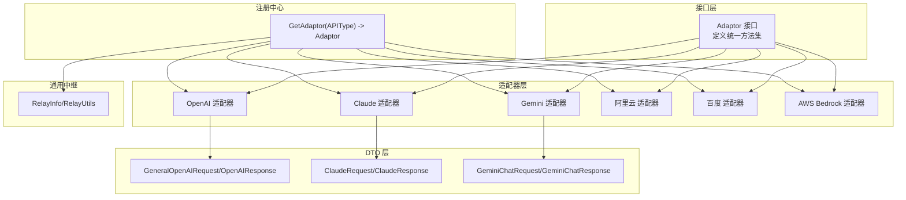
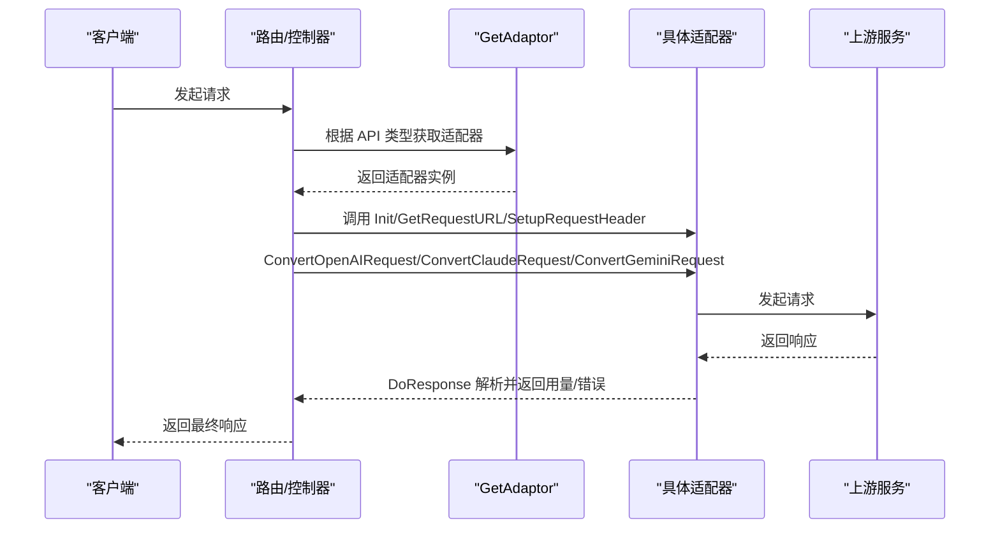
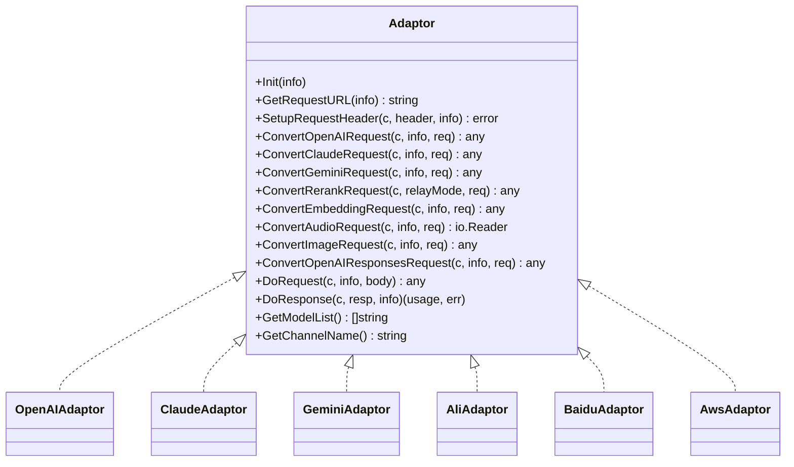
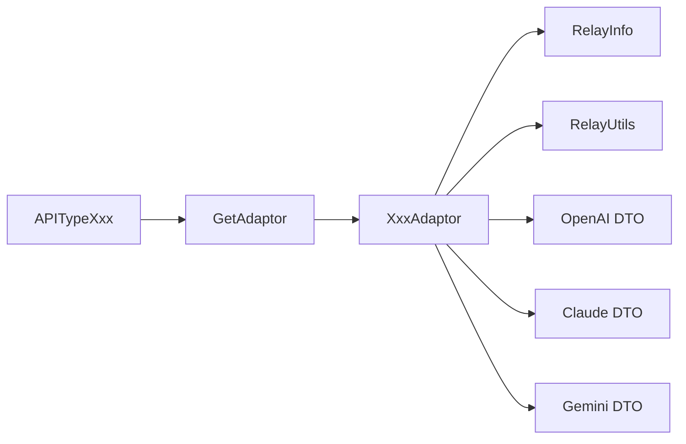

# 添加新的AI服务

<cite>
**本文引用的文件**
- [relay/channel/adapter.go](file://relay/channel/adapter.go)
- [relay/relay_adaptor.go](file://relay/relay_adaptor.go)
- [constant/api_type.go](file://constant/api_type.go)
- [dto/openai_request.go](file://dto/openai_request.go)
- [dto/openai_response.go](file://dto/openai_response.go)
- [dto/claude.go](file://dto/claude.go)
- [dto/gemini.go](file://dto/gemini.go)
- [relay/channel/openai/adaptor.go](file://relay/channel/openai/adaptor.go)
- [relay/channel/claude/adaptor.go](file://relay/channel/claude/adaptor.go)
- [relay/channel/gemini/adaptor.go](file://relay/channel/gemini/adaptor.go)
- [relay/channel/ali/adaptor.go](file://relay/channel/ali/adaptor.go)
- [relay/channel/aws/adaptor.go](file://relay/channel/aws/adaptor.go)
- [relay/channel/baidu/adaptor.go](file://relay/channel/baidu/adaptor.go)
- [relay/common/relay_info.go](file://relay/common/relay_info.go)
- [relay/common/relay_utils.go](file://relay/common/relay_utils.go)
- [constant/README.md](file://constant/README.md)
</cite>

## 目录
1. [简介](#简介)
2. [项目结构](#项目结构)
3. [核心组件](#核心组件)
4. [架构总览](#架构总览)
5. [详细组件分析](#详细组件分析)
6. [依赖分析](#依赖分析)
7. [性能考虑](#性能考虑)
8. [故障排查指南](#故障排查指南)
9. [结论](#结论)
10. [附录](#附录)

## 简介
本指南面向希望为系统新增“AI服务适配器”的开发者，目标是帮助你从零开始实现一个新的适配器，使其与现有中继逻辑无缝集成。内容涵盖：
- 实现 Adaptor 接口的方法清单与职责边界
- 在 constant/ 目录中定义新的 API 类型常量
- 在 relay/relay_adaptor.go 的 GetAdaptor 函数中注册新适配器
- 如何处理特定服务商的认证、请求格式与响应解析
- 测试新适配器的最佳实践与兼容性保障

## 项目结构
系统采用“接口抽象 + 适配器实现 + 注册中心”的分层设计：
- 接口层：定义统一的适配器接口，屏蔽不同上游服务差异
- 适配器层：每个上游服务商一个目录，实现各自的请求预处理、响应后处理、错误映射
- 注册中心：根据 API 类型常量选择对应适配器
- DTO 层：通用 OpenAI 风格请求/响应结构，便于跨服务转换
- 通用中继：RelayInfo、RelayUtils 提供统一的上下文与工具

图表来源
- [relay/channel/adapter.go](file://relay/channel/adapter.go#L1-L58)
- [relay/relay_adaptor.go](file://relay/relay_adaptor.go#L52-L122)
- [dto/openai_request.go](file://dto/openai_request.go#L1-L120)
- [dto/openai_response.go](file://dto/openai_response.go#L1-L120)
- [dto/claude.go](file://dto/claude.go#L192-L215)
- [dto/gemini.go](file://dto/gemini.go#L14-L23)
- [relay/common/relay_info.go](file://relay/common/relay_info.go#L81-L129)
- [relay/common/relay_utils.go](file://relay/common/relay_utils.go#L25-L37)

章节来源
- [relay/channel/adapter.go](file://relay/channel/adapter.go#L1-L58)
- [relay/relay_adaptor.go](file://relay/relay_adaptor.go#L52-L122)
- [constant/api_type.go](file://constant/api_type.go#L1-L40)
- [dto/openai_request.go](file://dto/openai_request.go#L1-L120)
- [dto/openai_response.go](file://dto/openai_response.go#L1-L120)
- [dto/claude.go](file://dto/claude.go#L192-L215)
- [dto/gemini.go](file://dto/gemini.go#L14-L23)
- [relay/common/relay_info.go](file://relay/common/relay_info.go#L81-L129)
- [relay/common/relay_utils.go](file://relay/common/relay_utils.go#L25-L37)

## 核心组件
- Adaptor 接口：定义了适配器必须实现的一整套方法，覆盖初始化、URL 构建、请求头设置、各类请求体转换、请求发起、响应处理、模型列表与通道名等。
- RelayInfo：承载一次中继调用的上下文信息，包括请求路径、模型名、是否流式、价格与用量、通道元数据等。
- RelayUtils：提供 URL 拼接、API 版本获取、任务请求校验等通用工具。
- DTO 层：通用 OpenAI 风格结构，便于跨服务转换；Claude/Gemini 专用结构用于各自协议转换。

章节来源
- [relay/channel/adapter.go](file://relay/channel/adapter.go#L15-L32)
- [relay/common/relay_info.go](file://relay/common/relay_info.go#L81-L129)
- [relay/common/relay_utils.go](file://relay/common/relay_utils.go#L25-L37)
- [dto/openai_request.go](file://dto/openai_request.go#L1-L120)
- [dto/openai_response.go](file://dto/openai_response.go#L1-L120)
- [dto/claude.go](file://dto/claude.go#L192-L215)
- [dto/gemini.go](file://dto/gemini.go#L14-L23)

## 架构总览
新增适配器的总体流程如下：
1. 在 constant/api_type.go 中新增 API 类型常量
2. 在 relay/relay_adaptor.go 的 GetAdaptor 中注册该常量与适配器
3. 创建适配器目录与文件，实现 Adaptor 接口的所有方法
4. 在适配器中完成认证、请求格式转换、响应解析与错误映射
5. 编写测试用例验证兼容性与正确性

图表来源
- [relay/relay_adaptor.go](file://relay/relay_adaptor.go#L52-L122)
- [relay/channel/adapter.go](file://relay/channel/adapter.go#L15-L32)
- [relay/channel/openai/adaptor.go](file://relay/channel/openai/adaptor.go#L97-L179)

章节来源
- [relay/relay_adaptor.go](file://relay/relay_adaptor.go#L52-L122)
- [relay/channel/adapter.go](file://relay/channel/adapter.go#L15-L32)

## 详细组件分析

### Adaptor 接口方法详解
以下方法是实现适配器的关键入口，需逐项完成：
- Init(info): 初始化适配器状态，读取 RelayInfo 中的通道类型、模型名等
- GetRequestURL(info): 计算上游完整请求 URL，必要时拼接查询参数
- SetupRequestHeader(c, header, info): 设置鉴权头、版本头、特殊头等
- ConvertOpenAIRequest/ConvertClaudeRequest/ConvertGeminiRequest: 将通用 DTO 转换为上游协议对象
- ConvertRerankRequest/ConvertEmbeddingRequest/ConvertAudioRequest/ConvertImageRequest/ConvertOpenAIResponsesRequest: 处理各类非聊天请求
- DoRequest(c, info, requestBody): 发起上游请求（普通 API、表单、WS 等）
- DoResponse(c, resp, info): 解析上游响应，生成统一用量与错误
- GetModelList()/GetChannelName(): 返回可用模型列表与通道名

章节来源
- [relay/channel/adapter.go](file://relay/channel/adapter.go#L15-L32)

### 适配器实现范式（以 OpenAI/Claude/Gemini 为例）
- OpenAI 适配器展示了典型的“请求预处理 + DoRequest + DoResponse”模式，包含：
  - GetRequestURL：根据通道类型与 RelayMode 动态拼接 URL
  - SetupRequestHeader：设置 Authorization、组织头、实时语音头等
  - ConvertOpenAIRequest：对温度、TopP、推理级别等进行兼容性调整
  - DoRequest/DoResponse：分流到不同处理器（流式/非流式、音频/图像/嵌入等）
- Claude 适配器展示了“消息/补全两种模式”的切换与头部处理
- Gemini 适配器展示了“文本/图像/嵌入/流式”的多形态处理

章节来源
- [relay/channel/openai/adaptor.go](file://relay/channel/openai/adaptor.go#L97-L179)
- [relay/channel/openai/adaptor.go](file://relay/channel/openai/adaptor.go#L216-L336)
- [relay/channel/openai/adaptor.go](file://relay/channel/openai/adaptor.go#L576-L616)
- [relay/channel/claude/adaptor.go](file://relay/channel/claude/adaptor.go#L47-L66)
- [relay/channel/claude/adaptor.go](file://relay/channel/claude/adaptor.go#L77-L87)
- [relay/channel/claude/adaptor.go](file://relay/channel/claude/adaptor.go#L89-L98)
- [relay/channel/claude/adaptor.go](file://relay/channel/claude/adaptor.go#L114-L125)
- [relay/channel/gemini/adaptor.go](file://relay/channel/gemini/adaptor.go#L128-L169)
- [relay/channel/gemini/adaptor.go](file://relay/channel/gemini/adaptor.go#L171-L175)
- [relay/channel/gemini/adaptor.go](file://relay/channel/gemini/adaptor.go#L177-L188)
- [relay/channel/gemini/adaptor.go](file://relay/channel/gemini/adaptor.go#L242-L276)

### 从零开始添加一个新适配器（以“某新服务商 X”为例）
以下步骤基于现有实现模式总结而来，便于你快速落地：

1) 定义新的 API 类型常量
- 在 constant/api_type.go 中新增一行常量，例如：APITypeXxx
- 保持自增顺序，避免破坏已有映射

章节来源
- [constant/api_type.go](file://constant/api_type.go#L1-L40)
- [constant/README.md](file://constant/README.md#L1-L26)

2) 在注册中心注册适配器
- 在 relay/relay_adaptor.go 的 GetAdaptor 中增加 case 分支，返回你的适配器实例
- 若涉及任务平台（长耗时任务），在 GetTaskAdaptor 中注册

章节来源
- [relay/relay_adaptor.go](file://relay/relay_adaptor.go#L52-L122)
- [relay/relay_adaptor.go](file://relay/relay_adaptor.go#L124-L163)

3) 创建适配器目录与文件
- 在 relay/channel/xxx 下创建 adaptor.go，实现 Adaptor 接口的所有方法
- 参考现有适配器的 Init/GetRequestURL/SetupRequestHeader/Convert*/DoRequest/DoResponse/GetModelList/GetChannelName

章节来源
- [relay/channel/adapter.go](file://relay/channel/adapter.go#L15-L32)
- [relay/channel/openai/adaptor.go](file://relay/channel/openai/adaptor.go#L97-L179)
- [relay/channel/claude/adaptor.go](file://relay/channel/claude/adaptor.go#L47-L66)
- [relay/channel/gemini/adaptor.go](file://relay/channel/gemini/adaptor.go#L128-L169)

4) 处理认证与请求头
- SetupRequestHeader 中设置鉴权头（如 Authorization、API Key、版本头等）
- 若服务商支持实时/WS，参考 OpenAI 的 DoWssRequest 或自定义 WS 处理

章节来源
- [relay/channel/openai/adaptor.go](file://relay/channel/openai/adaptor.go#L181-L214)
- [relay/channel/claude/adaptor.go](file://relay/channel/claude/adaptor.go#L77-L87)
- [relay/channel/aws/adaptor.go](file://relay/channel/aws/adaptor.go#L104-L110)

5) 请求预处理与格式转换
- ConvertOpenAIRequest：将通用 OpenAI 请求转换为目标服务商协议，必要时调整参数（如温度、TopP、推理级别）
- ConvertClaudeRequest/GeminiRequest：若目标服务商支持 Claude/Gemini 协议，可复用转换逻辑
- ConvertEmbeddingRequest/ImageRequest/AudioRequest/RerankRequest：按需实现

章节来源
- [dto/openai_request.go](file://dto/openai_request.go#L1-L120)
- [dto/claude.go](file://dto/claude.go#L192-L215)
- [dto/gemini.go](file://dto/gemini.go#L14-L23)
- [relay/channel/openai/adaptor.go](file://relay/channel/openai/adaptor.go#L216-L336)
- [relay/channel/ali/adaptor.go](file://relay/channel/ali/adaptor.go#L86-L107)
- [relay/channel/baidu/adaptor.go](file://relay/channel/baidu/adaptor.go#L121-L130)

6) 请求发起与响应处理
- DoRequest：根据 RelayMode 选择普通 API、表单上传或 WebSocket
- DoResponse：根据 RelayMode 选择对应的处理器（流式/非流式、音频/图像/嵌入/重排等）

章节来源
- [relay/channel/openai/adaptor.go](file://relay/channel/openai/adaptor.go#L576-L616)
- [relay/channel/claude/adaptor.go](file://relay/channel/claude/adaptor.go#L114-L125)
- [relay/channel/gemini/adaptor.go](file://relay/channel/gemini/adaptor.go#L242-L276)
- [relay/channel/ali/adaptor.go](file://relay/channel/ali/adaptor.go#L157-L187)
- [relay/channel/baidu/adaptor.go](file://relay/channel/baidu/adaptor.go#L146-L162)

7) 错误映射与用量统计
- DoResponse 中将上游错误映射为统一的 NewAPIError 结构
- 统一用量结构 Usage，便于计费与配额扣减

章节来源
- [dto/openai_response.go](file://dto/openai_response.go#L222-L241)
- [relay/channel/openai/adaptor.go](file://relay/channel/openai/adaptor.go#L588-L616)

8) 模型列表与通道名
- GetModelList：返回该通道支持的模型列表
- GetChannelName：返回通道名称，便于日志与统计

章节来源
- [relay/channel/openai/adaptor.go](file://relay/channel/openai/adaptor.go#L618-L650)
- [relay/channel/claude/adaptor.go](file://relay/channel/claude/adaptor.go#L127-L134)
- [relay/channel/gemini/adaptor.go](file://relay/channel/gemini/adaptor.go#L278-L285)
- [relay/channel/ali/adaptor.go](file://relay/channel/ali/adaptor.go#L189-L196)
- [relay/channel/baidu/adaptor.go](file://relay/channel/baidu/adaptor.go#L164-L171)

### 适配器实现类图（示意）

图表来源
- [relay/channel/adapter.go](file://relay/channel/adapter.go#L15-L32)
- [relay/channel/openai/adaptor.go](file://relay/channel/openai/adaptor.go#L36-L40)
- [relay/channel/claude/adaptor.go](file://relay/channel/claude/adaptor.go#L24-L27)
- [relay/channel/gemini/adaptor.go](file://relay/channel/gemini/adaptor.go#L21-L23)
- [relay/channel/ali/adaptor.go](file://relay/channel/ali/adaptor.go#L21-L23)
- [relay/channel/baidu/adaptor.go](file://relay/channel/baidu/adaptor.go#L19-L21)
- [relay/channel/aws/adaptor.go](file://relay/channel/aws/adaptor.go#L28-L34)

## 依赖分析
- GetAdaptor 通过 API 类型常量选择适配器，确保新增常量与分支一一对应
- 适配器内部依赖 RelayInfo/RelayUtils 提供统一上下文与工具
- DTO 层为跨服务转换提供基础，减少各适配器重复实现

图表来源
- [constant/api_type.go](file://constant/api_type.go#L1-L40)
- [relay/relay_adaptor.go](file://relay/relay_adaptor.go#L52-L122)
- [relay/common/relay_info.go](file://relay/common/relay_info.go#L81-L129)
- [relay/common/relay_utils.go](file://relay/common/relay_utils.go#L25-L37)
- [dto/openai_request.go](file://dto/openai_request.go#L1-L120)
- [dto/claude.go](file://dto/claude.go#L192-L215)
- [dto/gemini.go](file://dto/gemini.go#L14-L23)

章节来源
- [relay/relay_adaptor.go](file://relay/relay_adaptor.go#L52-L122)
- [relay/common/relay_info.go](file://relay/common/relay_info.go#L81-L129)
- [relay/common/relay_utils.go](file://relay/common/relay_utils.go#L25-L37)

## 性能考虑
- 流式处理：优先使用流式响应以降低延迟，注意在 SetupRequestHeader 中设置必要的流式头
- 参数裁剪：在 ConvertOpenAIRequest 中按服务商限制裁剪不支持的参数，减少无效请求
- 头部最小化：仅设置必需的鉴权与版本头，避免冗余开销
- 重试与超时：结合上游 SDK 或 HTTP 客户端设置合理的超时与重试策略（如 AWS Bedrock）

## 故障排查指南
- 常见错误映射：DoResponse 中将上游错误统一映射为 NewAPIError，便于前端与日志一致化
- 日志与调试：RelayInfo.ToString 提供完整上下文，可用于定位问题
- 任务平台：对于长耗时任务，参考 GetTaskAdaptor 的平台映射与 TaskAdaptor 接口

章节来源
- [dto/openai_response.go](file://dto/openai_response.go#L374-L415)
- [relay/common/relay_info.go](file://relay/common/relay_info.go#L184-L257)
- [relay/relay_adaptor.go](file://relay/relay_adaptor.go#L124-L163)

## 结论
通过遵循上述步骤与模式，你可以快速为系统新增一个“AI服务适配器”。关键在于：
- 严格实现 Adaptor 接口方法
- 正确处理认证与请求头
- 在 Convert* 方法中完成协议转换
- 在 DoResponse 中完成错误映射与用量统计
- 在 GetAdaptor 中完成注册，确保与现有中继逻辑兼容

## 附录

### API 类型常量扩展流程
- 在 constant/api_type.go 中新增一行常量
- 在 relay/relay_adaptor.go 的 GetAdaptor 中增加 case 分支
- 若涉及任务平台，在 GetTaskAdaptor 中注册

章节来源
- [constant/api_type.go](file://constant/api_type.go#L1-L40)
- [relay/relay_adaptor.go](file://relay/relay_adaptor.go#L52-L122)
- [relay/relay_adaptor.go](file://relay/relay_adaptor.go#L124-L163)

### 适配器方法实现要点速查
- Init：读取 RelayInfo 中的 ChannelType/UpstreamModelName 等
- GetRequestURL：根据 RelayMode/RelayFormat/ChannelType 拼接 URL
- SetupRequestHeader：设置鉴权头、版本头、特殊头
- Convert*：将通用 DTO 转为目标协议对象
- DoRequest：根据 RelayMode 选择普通/表单/WS 请求
- DoResponse：分流到对应处理器，返回 usage 与错误
- GetModelList/GetChannelName：返回模型列表与通道名

章节来源
- [relay/channel/adapter.go](file://relay/channel/adapter.go#L15-L32)
- [relay/channel/openai/adaptor.go](file://relay/channel/openai/adaptor.go#L97-L179)
- [relay/channel/openai/adaptor.go](file://relay/channel/openai/adaptor.go#L576-L616)
- [relay/channel/claude/adaptor.go](file://relay/channel/claude/adaptor.go#L77-L87)
- [relay/channel/gemini/adaptor.go](file://relay/channel/gemini/adaptor.go#L128-L169)
- [relay/channel/ali/adaptor.go](file://relay/channel/ali/adaptor.go#L157-L187)
- [relay/channel/baidu/adaptor.go](file://relay/channel/baidu/adaptor.go#L146-L162)