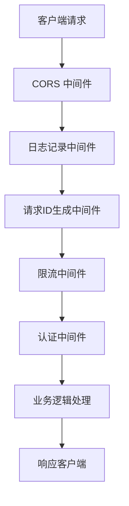
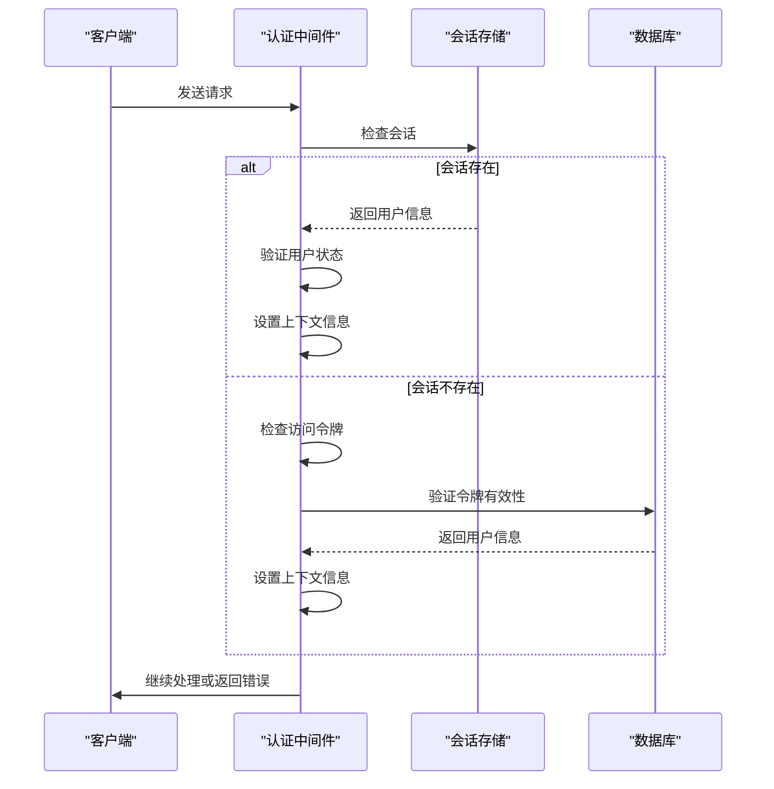
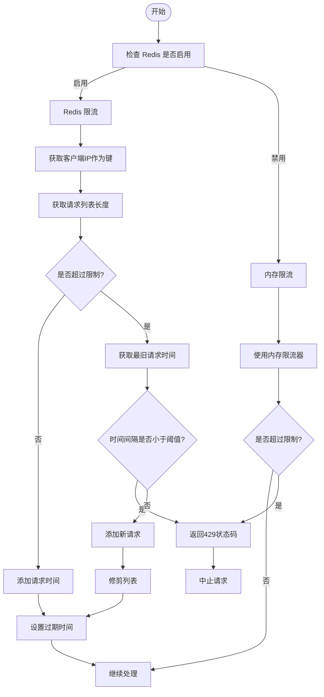
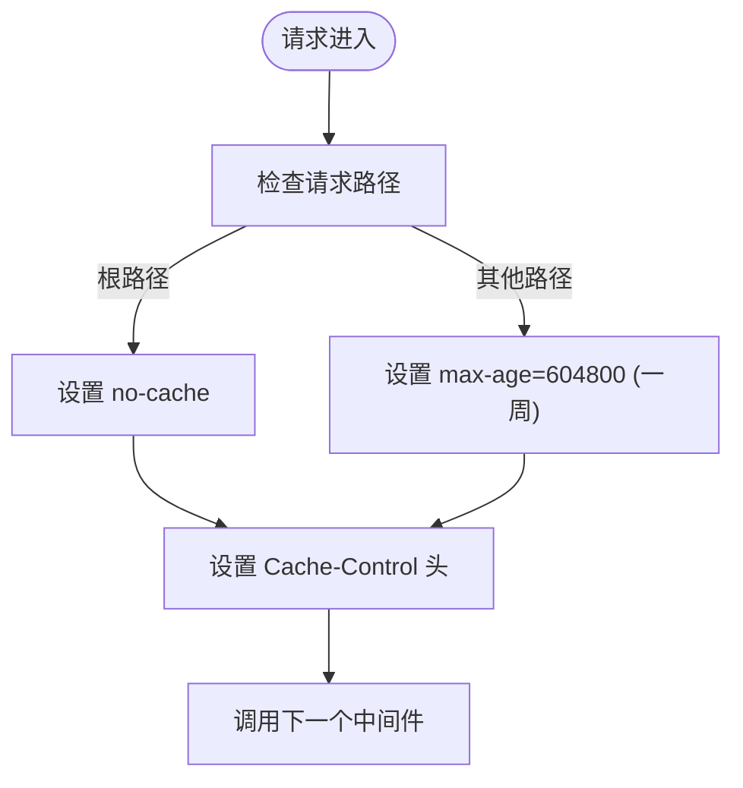
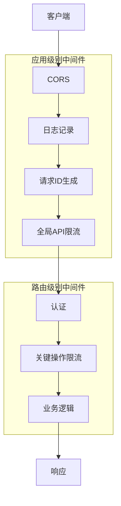
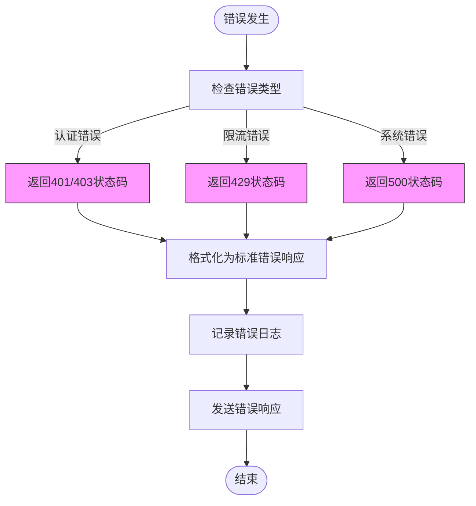
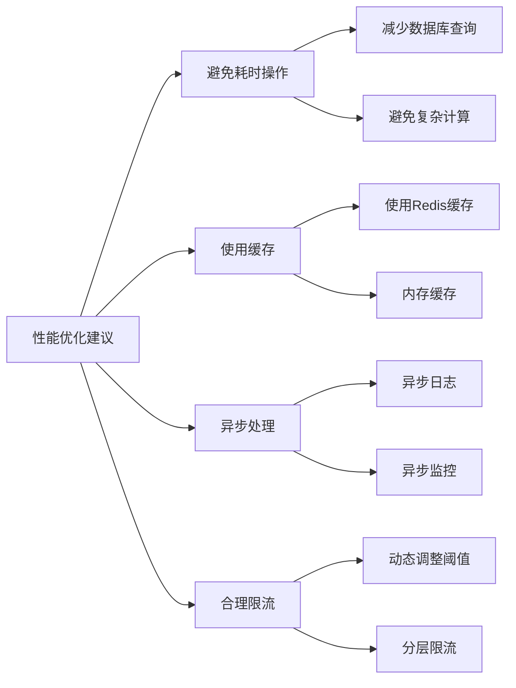
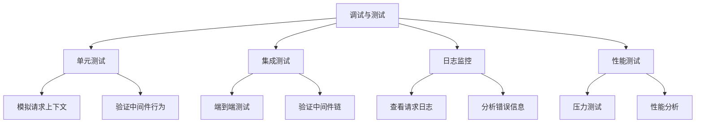

# 自定义中间件开发

<cite>
**本文档中引用的文件**  
- [auth.go](file://middleware/auth.go)
- [rate-limit.go](file://middleware/rate-limit.go)
- [cache.go](file://middleware/cache.go)
- [logger.go](file://middleware/logger.go)
- [request-id.go](file://middleware/request-id.go)
- [utils.go](file://middleware/utils.go)
- [cors.go](file://middleware/cors.go)
- [recover.go](file://middleware/recover.go)
- [main.go](file://main.go)
- [api-router.go](file://router/api-router.go)
- [common/gin.go](file://common/gin.go)
- [constant/context_key.go](file://constant/context_key.go)
</cite>

## 目录
1. [简介](#简介)
2. [中间件工作原理](#中间件工作原理)
3. [核心中间件分析](#核心中间件分析)
4. [中间件执行顺序](#中间件执行顺序)
5. [数据共享机制](#数据共享机制)
6. [错误处理机制](#错误处理机制)
7. [性能优化建议](#性能优化建议)
8. [调试与测试](#调试与测试)
9. [总结](#总结)

## 简介
本文档深入讲解 Gin 框架中间件的工作原理和实现模式，通过分析现有的 `auth.go`、`rate-limit.go` 和 `cache.go` 等文件，展示如何创建用于认证、限流、日志记录、请求ID生成等功能的中间件。文档详细说明了中间件的执行顺序、数据共享机制和错误处理策略，并提供性能优化建议。

## 中间件工作原理
Gin 框架的中间件是函数，它们在请求处理流程中被依次调用。每个中间件都有机会在请求被处理前和响应被发送后执行代码。中间件通过 `c.Next()` 方法将控制权传递给下一个中间件或最终的处理函数。



**Diagram sources**
- [cors.go](file://middleware/cors.go#L8-L15)
- [logger.go](file://middleware/logger.go#L10-L26)
- [request-id.go](file://middleware/request-id.go#L10-L19)
- [rate-limit.go](file://middleware/rate-limit.go#L76-L87)
- [auth.go](file://middleware/auth.go#L30-L143)

**Section sources**
- [main.go](file://main.go#L128-L157)
- [api-router.go](file://router/api-router.go#L11-L200)

## 核心中间件分析
### 认证中间件
认证中间件负责验证用户身份和权限。系统提供了多种认证方式，包括会话认证、访问令牌认证和API密钥认证。



**Diagram sources**
- [auth.go](file://middleware/auth.go#L19-L322)
- [common/gin.go](file://common/gin.go#L62-L102)

**Section sources**
- [auth.go](file://middleware/auth.go#L19-L322)
- [common/gin.go](file://common/gin.go#L62-L102)

### 限流中间件
限流中间件用于控制请求频率，防止系统被滥用。系统支持基于 Redis 和内存的两种限流实现。



**Diagram sources**
- [rate-limit.go](file://middleware/rate-limit.go#L21-L118)
- [common/gin.go](file://common/gin.go#L19-L33)

**Section sources**
- [rate-limit.go](file://middleware/rate-limit.go#L21-L118)
- [common/gin.go](file://common/gin.go#L19-L33)

### 缓存中间件
缓存中间件负责设置HTTP缓存头，优化客户端缓存行为。



**Diagram sources**
- [cache.go](file://middleware/cache.go#L7-L16)

**Section sources**
- [cache.go](file://middleware/cache.go#L7-L16)

## 中间件执行顺序
中间件的执行顺序对系统行为有重要影响。在应用级别注册的中间件先于路由级别注册的中间件执行。



**Diagram sources**
- [main.go](file://main.go#L140-L157)
- [api-router.go](file://router/api-router.go#L11-L200)

**Section sources**
- [main.go](file://main.go#L140-L157)
- [api-router.go](file://router/api-router.go#L11-L200)

## 数据共享机制
中间件之间通过 Gin 上下文（Context）共享数据，使用 `c.Set` 和 `c.Get` 方法进行数据存取。

```mermaid
classDiagram
class Context {
+Set(key string, value any)
+Get(key string) (value any, exists bool)
+GetString(key string) string
+GetInt(key string) int
+GetBool(key string) bool
}
class AuthMiddleware {
+authHelper(c *gin.Context, minRole int)
+UserAuth() func(c *gin.Context)
+AdminAuth() func(c *gin.Context)
}
class RateLimitMiddleware {
+rateLimitFactory(maxRequestNum int, duration int64, mark string) func(c *gin.Context)
+GlobalAPIRateLimit() func(c *gin.Context)
}
class LoggerMiddleware {
+SetUpLogger(server *gin.Engine)
}
Context <|-- AuthMiddleware : "使用"
Context <|-- RateLimitMiddleware : "使用"
Context <|-- LoggerMiddleware : "使用"
note right of Context
上下文对象用于在中间件之间
共享数据，如用户信息、请求ID等
end note
```

**Diagram sources**
- [auth.go](file://middleware/auth.go#L125-L130)
- [common/gin.go](file://common/gin.go#L21-L33)
- [request-id.go](file://middleware/request-id.go#L13-L16)

**Section sources**
- [auth.go](file://middleware/auth.go#L125-L130)
- [common/gin.go](file://common/gin.go#L21-L33)
- [request-id.go](file://middleware/request-id.go#L13-L16)

## 错误处理机制
系统采用统一的错误处理机制，通过中间件捕获和处理错误，确保返回一致的错误格式。



**Diagram sources**
- [utils.go](file://middleware/utils.go#L11-L37)
- [auth.go](file://middleware/auth.go#L41-L71)
- [rate-limit.go](file://middleware/rate-limit.go#L56-L57)

**Section sources**
- [utils.go](file://middleware/utils.go#L11-L37)
- [auth.go](file://middleware/auth.go#L41-L71)
- [rate-limit.go](file://middleware/rate-limit.go#L56-L57)

## 性能优化建议
为确保中间件的高性能，应遵循以下优化建议：

1. **避免耗时操作**：在中间件中避免执行数据库查询、网络请求等耗时操作
2. **使用缓存**：对频繁访问的数据使用缓存，减少重复计算
3. **异步处理**：将非关键操作（如日志记录）改为异步处理
4. **合理限流**：根据系统负载设置合理的限流阈值



**Diagram sources**
- [rate-limit.go](file://middleware/rate-limit.go#L15-L16)
- [common/gin.go](file://common/gin.go#L19-L33)
- [logger.go](file://middleware/logger.go#L10-L26)

**Section sources**
- [rate-limit.go](file://middleware/rate-limit.go#L15-L16)
- [common/gin.go](file://common/gin.go#L19-L33)
- [logger.go](file://middleware/logger.go#L10-L26)

## 调试与测试
有效的调试和测试方法对于确保中间件的可靠性至关重要。



**Diagram sources**
- [main.go](file://main.go#L129-L137)
- [utils.go](file://middleware/utils.go#L11-L37)

**Section sources**
- [main.go](file://main.go#L129-L137)
- [utils.go](file://middleware/utils.go#L11-L37)

## 总结
本文档详细介绍了 Gin 框架中间件的开发和使用。通过分析现有的中间件实现，我们了解了认证、限流、缓存等功能的实现模式。中间件的正确使用对于构建高性能、安全的Web应用至关重要。开发者应遵循最佳实践，合理设计中间件链，确保系统的稳定性和可维护性。