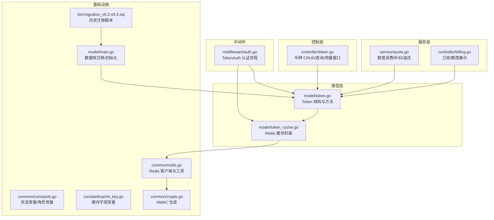
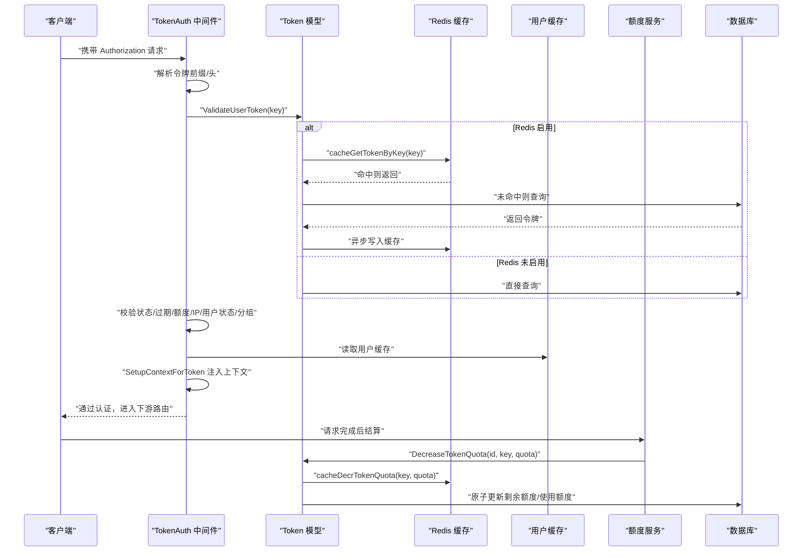
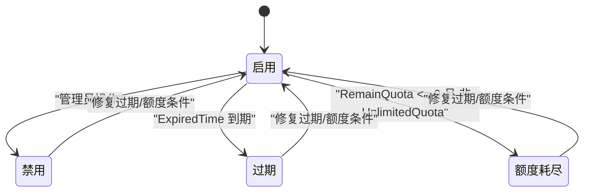
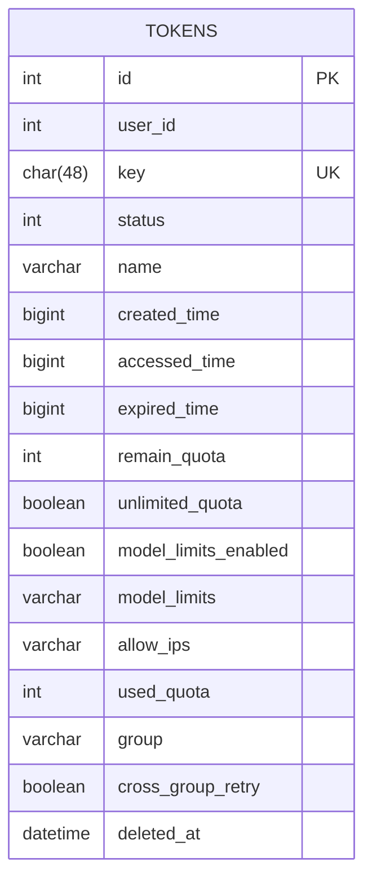
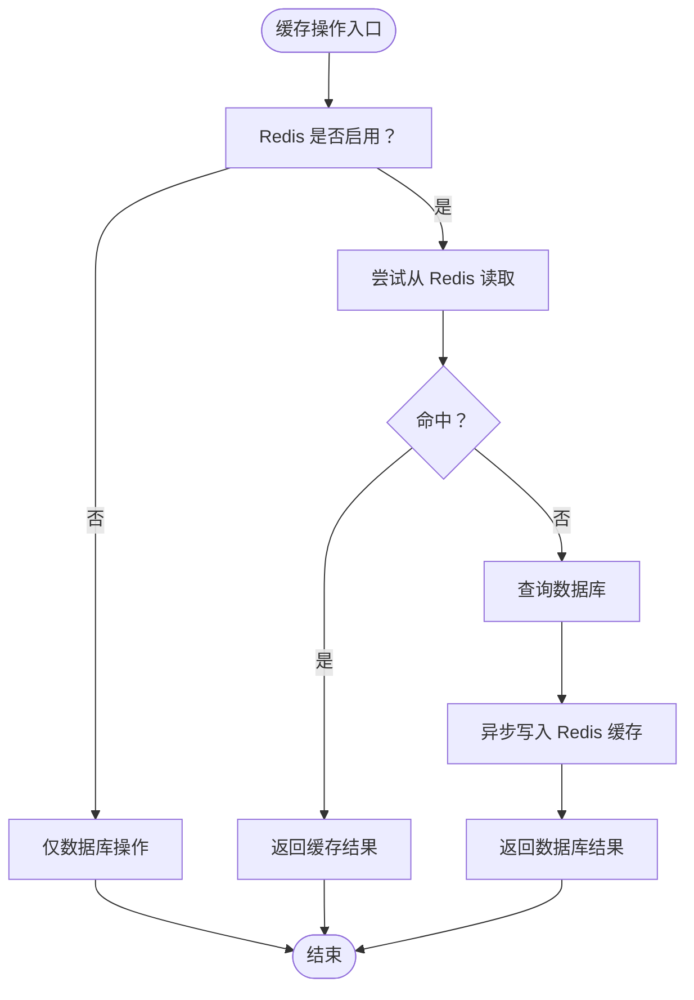
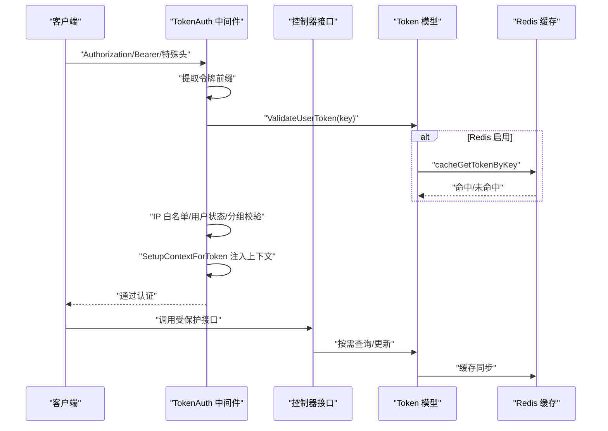
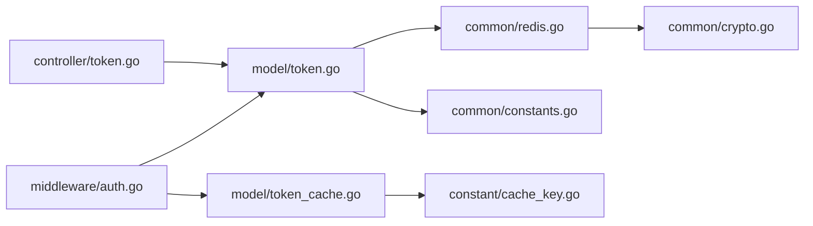

# 令牌模型

<cite>
**本文引用的文件**
- [model/token.go](file://model/token.go)
- [controller/token.go](file://controller/token.go)
- [middleware/auth.go](file://middleware/auth.go)
- [common/redis.go](file://common/redis.go)
- [model/token_cache.go](file://model/token_cache.go)
- [common/constants.go](file://common/constants.go)
- [constant/cache_key.go](file://constant/cache_key.go)
- [common/crypto.go](file://common/crypto.go)
- [model/main.go](file://model/main.go)
- [bin/migration_v0.2-v0.3.sql](file://bin/migration_v0.2-v0.3.sql)
- [service/quota.go](file://service/quota.go)
- [controller/billing.go](file://controller/billing.go)
</cite>

## 目录
1. [简介](#简介)
2. [项目结构](#项目结构)
3. [核心组件](#核心组件)
4. [架构总览](#架构总览)
5. [详细组件分析](#详细组件分析)
6. [依赖关系分析](#依赖关系分析)
7. [性能考量](#性能考量)
8. [故障排查指南](#故障排查指南)
9. [结论](#结论)
10. [附录](#附录)

## 简介
本文件系统性梳理“令牌模型”的数据结构、状态机、与用户/渠道/配额的关系，以及在 Redis 中的缓存策略与安全机制，并覆盖令牌的全生命周期管理（生成、验证、刷新、撤销），结合中间件认证流程说明令牌在请求链路中的处理机制。目标是帮助开发者与运维人员快速理解并正确使用令牌体系。

## 项目结构
围绕令牌模型的关键目录与文件：
- 数据模型与持久化：model/token.go
- 控制器接口：controller/token.go
- 认证中间件：middleware/auth.go
- 缓存与Redis：common/redis.go、model/token_cache.go
- 常量与枚举：common/constants.go、constant/cache_key.go
- 加密与哈希：common/crypto.go
- 数据库迁移与初始化：model/main.go、bin/migration_v0.2-v0.3.sql
- 额度消费与结算：service/quota.go、controller/billing.go

图表来源
- [model/token.go](file://model/token.go#L1-L366)
- [controller/token.go](file://controller/token.go#L1-L292)
- [middleware/auth.go](file://middleware/auth.go#L1-L322)
- [common/redis.go](file://common/redis.go#L1-L328)
- [model/token_cache.go](file://model/token_cache.go#L1-L66)
- [common/constants.go](file://common/constants.go#L160-L208)
- [constant/cache_key.go](file://constant/cache_key.go#L1-L15)
- [common/crypto.go](file://common/crypto.go#L1-L33)
- [model/main.go](file://model/main.go#L250-L346)
- [bin/migration_v0.2-v0.3.sql](file://bin/migration_v0.2-v0.3.sql#L1-L6)
- [service/quota.go](file://service/quota.go#L203-L456)
- [controller/billing.go](file://controller/billing.go#L1-L56)

章节来源
- [model/token.go](file://model/token.go#L1-L366)
- [controller/token.go](file://controller/token.go#L1-L292)
- [middleware/auth.go](file://middleware/auth.go#L1-L322)
- [common/redis.go](file://common/redis.go#L1-L328)
- [model/token_cache.go](file://model/token_cache.go#L1-L66)
- [common/constants.go](file://common/constants.go#L160-L208)
- [constant/cache_key.go](file://constant/cache_key.go#L1-L15)
- [common/crypto.go](file://common/crypto.go#L1-L33)
- [model/main.go](file://model/main.go#L250-L346)
- [bin/migration_v0.2-v0.3.sql](file://bin/migration_v0.2-v0.3.sql#L1-L6)
- [service/quota.go](file://service/quota.go#L203-L456)
- [controller/billing.go](file://controller/billing.go#L1-L56)

## 核心组件
- 令牌实体（Token）
  - 关键字段：用户标识、令牌值、状态、名称、创建/访问时间、过期时间、剩余额度、使用额度、是否无限额度、模型限制开关与列表、允许的IP列表、分组、跨组重试、软删除索引。
  - 字段约束与默认值：部分字段带有 GORM 索引或默认值；过期时间 -1 表示永不过期；剩余额度默认 0。
- 令牌状态机
  - 枚举：启用、禁用、过期、额度耗尽。
  - 转换逻辑：过期检查、额度检查、状态更新（Redis 同步）。
- 令牌与用户/渠道/配额的关系
  - 用户：令牌属于用户，控制器按用户维度查询与管理。
  - 渠道：令牌可绑定分组，分组影响渠道选择与计价比率。
  - 配额：令牌具备剩余额度与使用额度，支持增减与预扣后补扣/返还。
- Redis 缓存
  - 缓存键：基于 HMAC 的 token 哈希作为 Redis 哈希键，避免明文泄露。
  - 缓存字段：剩余额度、分组等关键字段支持原子增量/减量。
- 认证流程
  - 中间件 TokenAuth：解析 Authorization，提取令牌前缀，校验状态、过期、额度、IP 白名单、用户状态与分组可用性，注入上下文供后续路由使用。

章节来源
- [model/token.go](file://model/token.go#L14-L31)
- [common/constants.go](file://common/constants.go#L183-L188)
- [middleware/auth.go](file://middleware/auth.go#L199-L321)
- [model/token_cache.go](file://model/token_cache.go#L1-L66)
- [common/redis.go](file://common/redis.go#L1-L328)

## 架构总览
下图展示令牌在认证与额度消费中的整体交互：

图表来源
- [middleware/auth.go](file://middleware/auth.go#L199-L321)
- [model/token.go](file://model/token.go#L146-L206)
- [model/token_cache.go](file://model/token_cache.go#L30-L66)
- [common/redis.go](file://common/redis.go#L241-L328)
- [service/quota.go](file://service/quota.go#L203-L456)

## 详细组件分析

### 令牌实体与状态机
- 字段定义与用途
  - 用户标识：UserId，用于令牌归属与权限控制。
  - 令牌值：Key（char(48)），唯一索引，用于请求认证。
  - 状态：Status（启用/禁用/过期/额度耗尽），配合控制器与中间件共同维护。
  - 名称：Name，便于识别与管理。
  - 时间戳：CreatedTime、AccessedTime，用于审计与统计。
  - 过期时间：ExpiredTime，默认 -1 表示永不过期；到期后状态可能更新为过期。
  - 配额：RemainQuota、UsedQuota、UnlimitedQuota，决定额度是否可用与是否能继续使用。
  - 模型限制：ModelLimitsEnabled、ModelLimits（逗号分隔），用于限制可用模型。
  - IP 白名单：AllowIps（多行文本，每行一个IP），中间件会校验来源IP。
  - 分组与跨组重试：Group、CrossGroupRetry，影响渠道选择与重试策略。
  - 软删除：DeletedAt，GORM 软删除索引。
- 状态机转换
  - 启用 -> 过期：当 ExpiredTime 小于当前时间且非永不过期时，状态更新为过期。
  - 启用 -> 额度耗尽：当非无限额度且剩余额度小于等于 0 时，状态更新为额度耗尽。
  - 禁用：管理员或业务逻辑可将状态置为禁用。
  - 过期/额度耗尽 -> 启用：需满足条件（如修改过期时间或剩余额度）后方可启用。
- 验证与更新
  - ValidateUserToken：统一入口，执行状态、过期、额度检查，并在必要时更新状态。
  - SelectUpdate/Update/Delete：按需更新状态、额度、模型限制、IP白名单、分组等字段，并同步到 Redis。

图表来源
- [model/token.go](file://model/token.go#L75-L117)
- [common/constants.go](file://common/constants.go#L183-L188)

章节来源
- [model/token.go](file://model/token.go#L14-L31)
- [model/token.go](file://model/token.go#L75-L117)
- [model/token.go](file://model/token.go#L170-L206)
- [common/constants.go](file://common/constants.go#L183-L188)

### 令牌与用户、渠道、配额的关系
- 与用户
  - 令牌属于用户（UserId），控制器按用户维度进行查询、搜索、删除与批量删除。
  - 订阅/额度展示接口可按令牌维度返回额度信息。
- 与渠道/分组
  - 令牌可绑定 Group，中间件在认证时根据用户组与令牌分组校验可用性与比率配置。
  - CrossGroupRetry 控制跨组重试策略。
- 与配额
  - 额度增减通过 IncreaseTokenQuota/DecreaseTokenQuota 实现，支持 Redis 原子增量/减量与数据库原子更新。
  - 额度消费采用预扣费后补扣/返还机制，保证一致性。

章节来源
- [controller/token.go](file://controller/token.go#L1-L292)
- [middleware/auth.go](file://middleware/auth.go#L263-L321)
- [service/quota.go](file://service/quota.go#L203-L456)
- [controller/billing.go](file://controller/billing.go#L1-L56)

### 数据库表结构与索引设计
- 表：tokens
  - 主键：id
  - 索引：user_id、deleted_at（软删）、key（唯一）
  - 字段：见“令牌实体字段定义”
- 初始化与迁移
  - AutoMigrate 在启动时对 Token 进行迁移。
  - 历史迁移脚本会将用户额度与令牌剩余额度进行汇总处理。

图表来源
- [model/token.go](file://model/token.go#L14-L31)
- [model/main.go](file://model/main.go#L250-L303)
- [bin/migration_v0.2-v0.3.sql](file://bin/migration_v0.2-v0.3.sql#L1-L6)

章节来源
- [model/token.go](file://model/token.go#L14-L31)
- [model/main.go](file://model/main.go#L250-L303)
- [bin/migration_v0.2-v0.3.sql](file://bin/migration_v0.2-v0.3.sql#L1-L6)

### Redis 缓存机制与安全性
- 缓存键设计
  - 使用 HMAC 对令牌值进行哈希，键格式为 token:<hmac>，避免明文泄露。
- 缓存字段
  - 通过 Redis Hash 存储令牌对象字段，支持原子增量/减量（剩余额度、分组等）。
- 安全性考虑
  - 防止明文泄露：键使用 HMAC，值使用哈希存储。
  - TTL 维护：对存在 TTL 的键进行事务性操作，保证原子性与过期时间一致性。
  - 速率限制：全局/关键路径限流与过期时间配合，降低热点竞争。
- 与数据库的同步
  - 读路径：优先 Redis，未命中回源数据库，并异步写入缓存。
  - 写路径：更新后异步写入缓存，删除后清理缓存。

图表来源
- [model/token.go](file://model/token.go#L146-L168)
- [model/token_cache.go](file://model/token_cache.go#L1-L66)
- [common/redis.go](file://common/redis.go#L107-L159)
- [common/redis.go](file://common/redis.go#L241-L328)
- [common/crypto.go](file://common/crypto.go#L11-L21)

章节来源
- [model/token_cache.go](file://model/token_cache.go#L1-L66)
- [common/redis.go](file://common/redis.go#L107-L159)
- [common/redis.go](file://common/redis.go#L241-L328)
- [common/crypto.go](file://common/crypto.go#L11-L21)

### 令牌生命周期管理
- 生成
  - 控制器接收前端请求，生成随机令牌值并入库，记录创建/访问时间、过期时间、剩余额度、模型限制、IP白名单、分组等。
- 验证
  - 中间件 TokenAuth 解析 Authorization，调用 ValidateUserToken 完成状态、过期、额度、IP白名单、用户状态与分组校验。
- 刷新
  - 增加剩余额度：IncreaseTokenQuota 支持 Redis 原子增量与数据库更新。
- 撤销/禁用
  - 更新状态为禁用；删除令牌时同步清理缓存。

章节来源
- [controller/token.go](file://controller/token.go#L138-L185)
- [middleware/auth.go](file://middleware/auth.go#L199-L321)
- [model/token.go](file://model/token.go#L266-L324)
- [model/token.go](file://model/token.go#L208-L221)

### 认证流程中的令牌处理
- 中间件 TokenAuth
  - WebSocket/Anthropic/Gemini 等特殊场景下从不同位置提取令牌。
  - 提取令牌后调用 ValidateUserToken 并进行 IP 白名单、用户状态、分组可用性校验。
  - 通过后 SetupContextForToken 注入用户/令牌上下文（用户ID、令牌ID、令牌Key、令牌名称、是否无限额度、剩余额度、模型限制、分组、跨组重试等）。
- 控制器接口
  - 查询令牌列表、搜索、获取单个、删除、批量删除、更新状态/配置。
  - 提供令牌用量查询接口，返回剩余额度、使用额度、模型限制、过期时间等。

图表来源
- [middleware/auth.go](file://middleware/auth.go#L199-L321)
- [controller/token.go](file://controller/token.go#L1-L292)
- [model/token.go](file://model/token.go#L146-L206)
- [model/token_cache.go](file://model/token_cache.go#L52-L66)

章节来源
- [middleware/auth.go](file://middleware/auth.go#L199-L321)
- [controller/token.go](file://controller/token.go#L1-L292)

## 依赖关系分析
- 组件耦合
  - Token 模型与 Redis 缓存解耦，通过封装函数隔离缓存细节。
  - 中间件依赖 Token 模型与用户缓存，但不直接依赖具体渠道实现。
- 外部依赖
  - Redis：连接字符串、池大小、Ping 测试、TTL 维护。
  - 数据库：GORM 自动迁移、软删除、索引。
- 循环依赖
  - 未发现直接循环依赖；缓存封装位于 model 层，避免了控制器与缓存的直接耦合。

图表来源
- [middleware/auth.go](file://middleware/auth.go#L1-L322)
- [controller/token.go](file://controller/token.go#L1-L292)
- [model/token.go](file://model/token.go#L1-L366)
- [model/token_cache.go](file://model/token_cache.go#L1-L66)
- [common/redis.go](file://common/redis.go#L1-L328)
- [common/crypto.go](file://common/crypto.go#L1-L33)
- [common/constants.go](file://common/constants.go#L160-L208)
- [constant/cache_key.go](file://constant/cache_key.go#L1-L15)

章节来源
- [middleware/auth.go](file://middleware/auth.go#L1-L322)
- [controller/token.go](file://controller/token.go#L1-L292)
- [model/token.go](file://model/token.go#L1-L366)
- [model/token_cache.go](file://model/token_cache.go#L1-L66)
- [common/redis.go](file://common/redis.go#L1-L328)
- [common/crypto.go](file://common/crypto.go#L1-L33)
- [common/constants.go](file://common/constants.go#L160-L208)
- [constant/cache_key.go](file://constant/cache_key.go#L1-L15)

## 性能考量
- 读路径优化
  - Redis 命中率：通过 HMAC 键与哈希存储提升查找效率；异步写入避免阻塞主流程。
  - 批量更新：支持批量额度更新，减少数据库压力。
- 写路径优化
  - 原子操作：Redis HINCRBY/INCRBY 与数据库表达式更新，保证并发一致性。
  - 异步缓存更新：写入后异步更新缓存，降低写放大。
- 缓存 TTL
  - 依据同步频率设置键过期时间，平衡一致性与性能。
- 限流与降级
  - 全局/关键路径限流，Redis Ping 测试失败时可降级至纯数据库模式。

章节来源
- [common/redis.go](file://common/redis.go#L1-L328)
- [model/token.go](file://model/token.go#L266-L324)
- [model/token_cache.go](file://model/token_cache.go#L1-L66)

## 故障排查指南
- 常见问题
  - 令牌过期：检查 ExpiredTime 与当前时间；若 Redis 启用，确认状态是否已更新。
  - 额度耗尽：检查 UnlimitedQuota 与 RemainQuota；可通过增加剩余额度恢复。
  - IP 白名单拒绝：核对 AllowIps 与客户端真实IP。
  - 分组不可用：核对用户组与令牌分组的可用性与比率配置。
- 排查步骤
  - 中间件日志：查看 TokenAuth 的错误消息与上下文注入情况。
  - 缓存一致性：确认 Redis 中 token:<hmac> 是否存在，字段是否正确。
  - 数据库一致性：核对数据库中的剩余额度与使用额度是否一致。
- 相关定位
  - 认证失败：中间件 TokenAuth 的 abortWithOpenAiMessage 输出。
  - 额度异常：service/quota.go 的补扣/返还逻辑与控制器 billing 接口。

章节来源
- [middleware/auth.go](file://middleware/auth.go#L238-L260)
- [service/quota.go](file://service/quota.go#L203-L456)
- [controller/billing.go](file://controller/billing.go#L1-L56)

## 结论
令牌模型通过清晰的数据结构、严谨的状态机与完善的缓存/数据库同步机制，实现了高可用、高性能的认证与额度管理体系。结合中间件的统一认证流程与服务层的额度结算逻辑，能够稳定支撑多渠道、多模型的复杂场景。建议在生产环境中开启 Redis 缓存、合理设置 TTL 与批量更新策略，并持续监控额度与缓存命中率。

## 附录
- 最佳实践
  - 令牌命名规范：使用语义化名称，便于审计与排障。
  - 额度管理：定期盘点剩余额度，避免长期无限额度导致预算失控。
  - 分组策略：明确分组与渠道映射，避免跨组滥用。
  - 缓存安全：严格管理 REDIS_CONN_STRING 与 SYNC_FREQUENCY，防止缓存穿透与雪崩。
- 安全建议
  - 防重放：结合 HMAC 与 TTL，确保令牌键不可逆；对高频接口增加限流。
  - 传输安全：强制 HTTPS，避免明文传输 Authorization。
  - 权限最小化：仅授予必要的模型限制与分组权限。