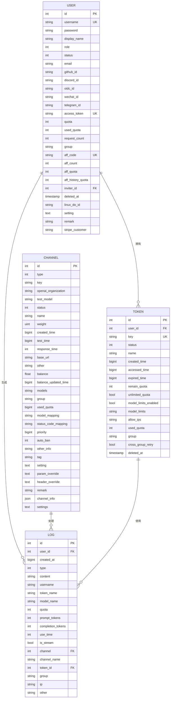
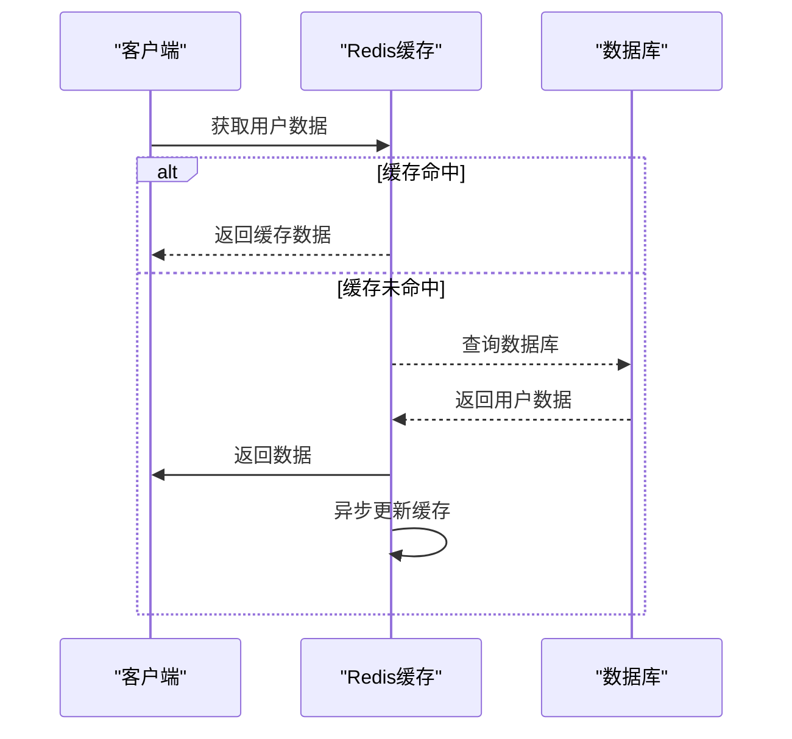
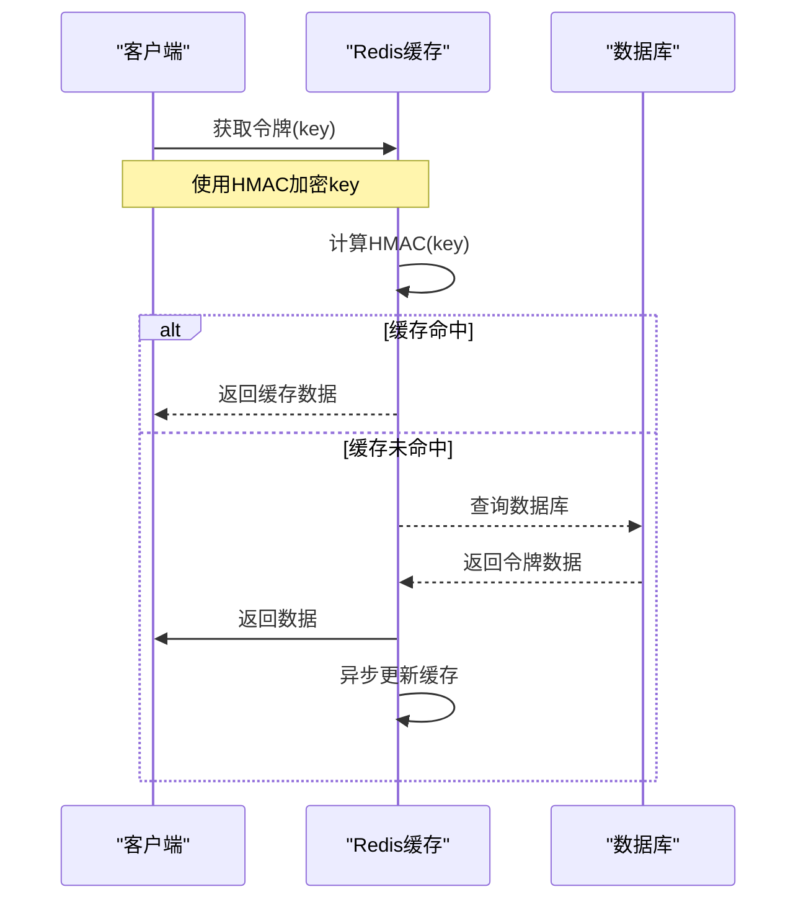
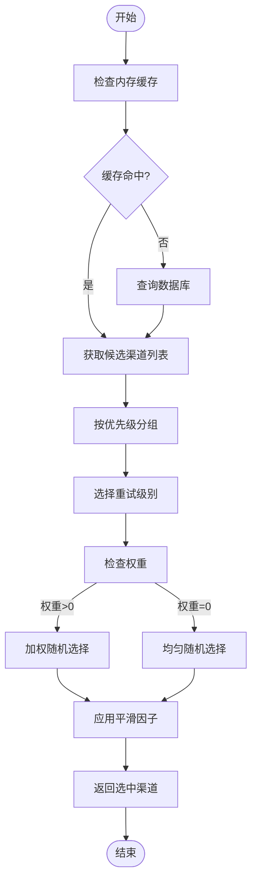
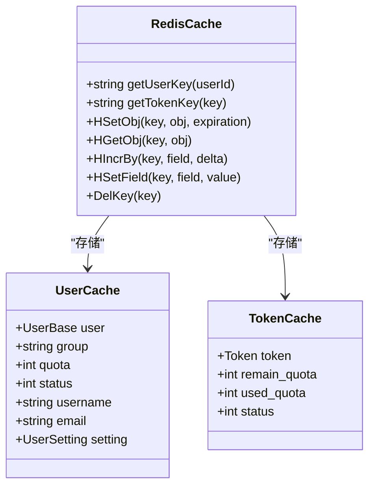
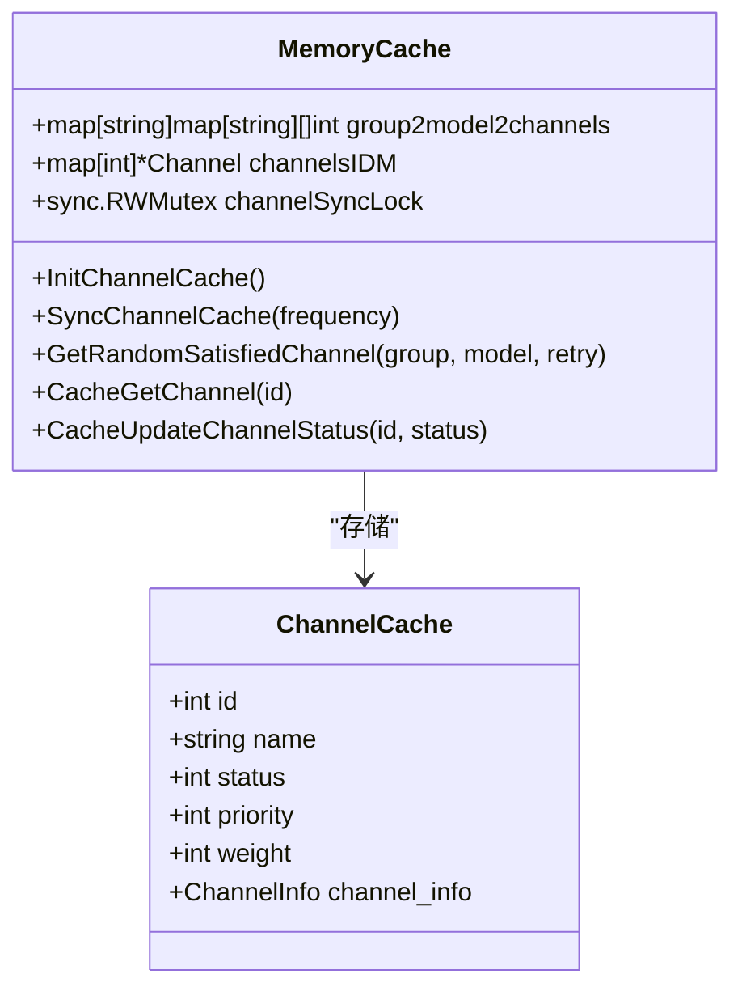
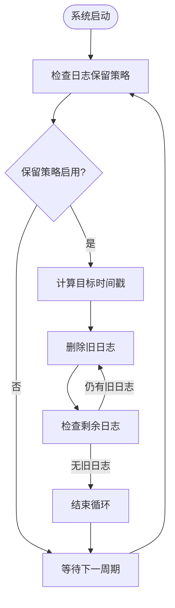
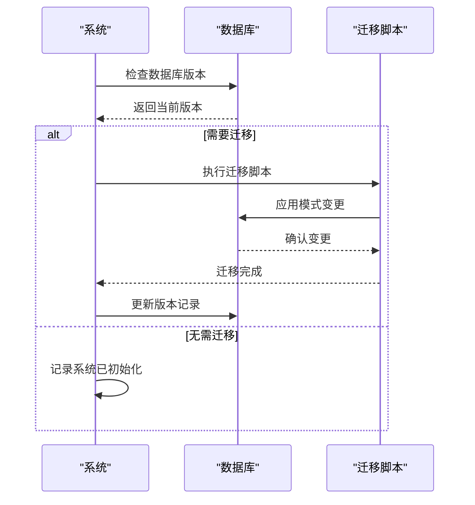
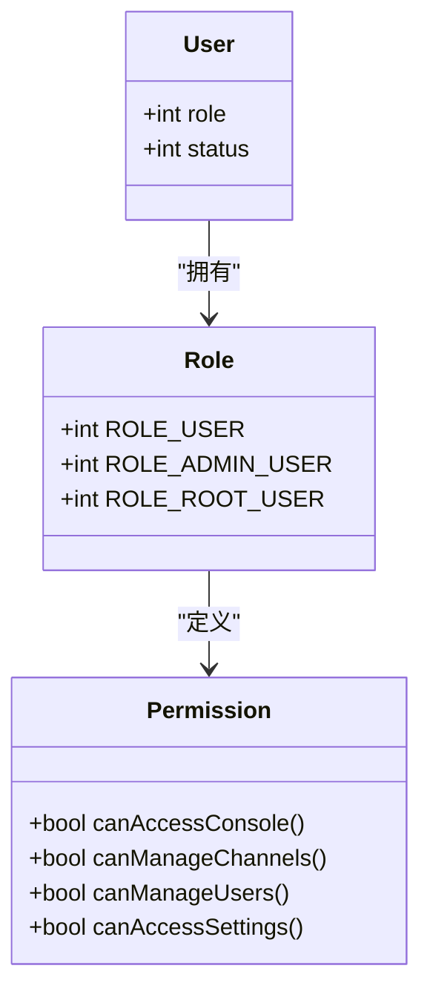
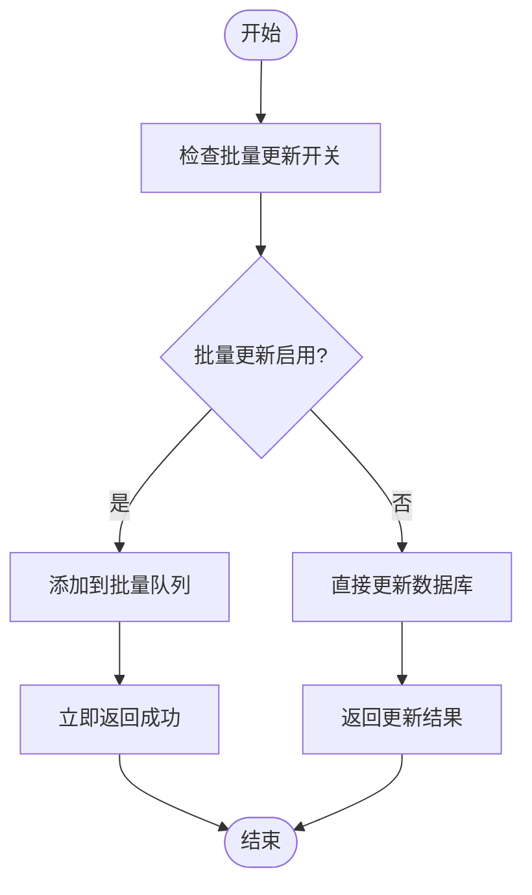

# 数据模型

<cite>
**本文档引用的文件**   
- [database.go](file://common/database.go)
- [main.go](file://model/main.go)
- [user.go](file://model/user.go)
- [channel.go](file://model/channel.go)
- [token.go](file://model/token.go)
- [log.go](file://model/log.go)
- [redis.go](file://common/redis.go)
- [user_cache.go](file://model/user_cache.go)
- [token_cache.go](file://model/token_cache.go)
- [channel_cache.go](file://model/channel_cache.go)
- [migration_v0.2-v0.3.sql](file://bin/migration_v0.2-v0.3.sql)
- [migration_v0.3-v0.4.sql](file://bin/migration_v0.3-v0.4.sql)
</cite>

## 目录
1. [简介](#简介)
2. [核心实体关系](#核心实体关系)
3. [实体字段定义](#实体字段定义)
4. [主键、外键与约束](#主键外键与约束)
5. [数据库索引](#数据库索引)
6. [数据访问模式](#数据访问模式)
7. [缓存策略](#缓存策略)
8. [数据生命周期与保留策略](#数据生命周期与保留策略)
9. [数据迁移与版本管理](#数据迁移与版本管理)
10. [数据安全与访问控制](#数据安全与访问控制)
11. [性能考虑](#性能考虑)

## 简介
本数据模型文档详细描述了AI API网关系统的核心数据实体，包括用户、渠道、令牌、日志和账单等。系统支持多种数据库类型，包括MySQL、SQLite和PostgreSQL，并通过GORM进行ORM管理。数据模型设计注重性能、可扩展性和安全性，通过Redis缓存层优化高频访问数据的读取性能。

**Section sources**
- [database.go](file://common/database.go#L1-L16)
- [main.go](file://model/main.go#L1-L479)

## 核心实体关系
系统的核心实体包括用户（User）、渠道（Channel）、令牌（Token）、日志（Log）和账单（Billing）。用户是系统的核心实体，可以创建多个令牌用于API访问。每个令牌关联到一个用户，并具有独立的配额和访问控制策略。渠道代表不同的AI服务提供商，如OpenAI、Azure等，用户请求通过负载均衡算法路由到合适的渠道。日志实体记录所有API调用和系统事件，用于审计和分析。

**Diagram sources**
- [user.go](file://model/user.go#L20-L50)
- [channel.go](file://model/channel.go#L21-L58)
- [token.go](file://model/token.go#L14-L32)
- [log.go](file://model/log.go#L20-L40)

## 实体字段定义
### 用户（User）
用户实体存储系统用户的核心信息，包括身份认证、配额和权限设置。

| 字段名 | 数据类型 | 描述 |
|--------|---------|------|
| id | int | 用户唯一标识符，主键 |
| username | string(20) | 用户名，唯一索引 |
| password | string | 密码哈希值，不为空 |
| display_name | string(20) | 显示名称，用于界面展示 |
| role | int | 用户角色（普通用户、管理员、超级管理员） |
| status | int | 用户状态（启用、禁用） |
| email | string(50) | 电子邮件地址，用于通知和验证 |
| github_id | string | GitHub OAuth ID |
| discord_id | string | Discord ID |
| oidc_id | string | OIDC认证ID |
| wechat_id | string | 微信ID |
| telegram_id | string | Telegram ID |
| access_token | char(32) | 系统管理访问令牌，唯一索引 |
| quota | int | 总配额，单位为额度单位 |
| used_quota | int | 已使用配额 |
| request_count | int | 请求计数 |
| group | varchar(64) | 用户分组，用于权限和路由控制 |
| aff_code | varchar(32) | 邀请码，唯一索引 |
| aff_count | int | 邀请计数 |
| aff_quota | int | 邀请剩余额度 |
| aff_history_quota | int | 邀请历史额度 |
| inviter_id | int | 邀请人ID，外键关联用户 |
| deleted_at | timestamp | 软删除时间戳 |
| linux_do_id | string | Linux.do ID |
| setting | text | 用户设置，JSON格式存储 |
| remark | varchar(255) | 备注信息 |
| stripe_customer | varchar(64) | Stripe客户ID |

**Section sources**
- [user.go](file://model/user.go#L20-L50)

### 渠道（Channel）
渠道实体代表不同的AI服务提供商，包含连接信息、状态和路由策略。

| 字段名 | 数据类型 | 描述 |
|--------|---------|------|
| id | int | 渠道唯一标识符，主键 |
| type | int | 渠道类型（OpenAI、Azure等） |
| key | string | API密钥，不为空 |
| openai_organization | string | OpenAI组织ID |
| test_model | string | 测试模型名称 |
| status | int | 渠道状态（启用、禁用、自动禁用） |
| name | string | 渠道名称，用于界面展示 |
| weight | uint | 权重，用于负载均衡 |
| created_time | bigint | 创建时间戳 |
| test_time | bigint | 最后测试时间戳 |
| response_time | int | 响应时间（毫秒） |
| base_url | string | 基础URL，覆盖默认URL |
| other | string | 其他信息 |
| balance | float | 余额（美元） |
| balance_updated_time | bigint | 余额更新时间戳 |
| models | string | 支持的模型列表，逗号分隔 |
| group | varchar(64) | 分组，用于路由控制 |
| used_quota | bigint | 已使用配额 |
| model_mapping | text | 模型映射，JSON格式 |
| status_code_mapping | varchar(1024) | 状态码映射 |
| priority | bigint | 优先级，用于路由选择 |
| auto_ban | int | 自动禁用开关 |
| other_info | string | 其他信息，JSON格式存储 |
| tag | string | 标签，用于批量操作 |
| setting | text | 渠道额外设置 |
| param_override | text | 参数覆盖，JSON格式 |
| header_override | text | 头部覆盖，JSON格式 |
| remark | string | 备注信息 |
| channel_info | json | 渠道信息，包含多Key模式配置 |
| settings | text | 其他设置，存储Azure版本等信息 |

**Section sources**
- [channel.go](file://model/channel.go#L21-L58)

### 令牌（Token）
令牌实体用于API访问认证，每个令牌关联到一个用户并具有独立的配额和限制。

| 字段名 | 数据类型 | 描述 |
|--------|---------|------|
| id | int | 令牌唯一标识符，主键 |
| user_id | int | 关联用户ID，外键 |
| key | char(48) | 令牌密钥，唯一索引 |
| status | int | 令牌状态（启用、禁用、过期、额度用尽） |
| name | string | 令牌名称，用于识别 |
| created_time | bigint | 创建时间戳 |
| accessed_time | bigint | 最后访问时间戳 |
| expired_time | bigint | 过期时间戳，-1表示永不过期 |
| remain_quota | int | 剩余配额 |
| unlimited_quota | bool | 无限配额开关 |
| model_limits_enabled | bool | 模型限制开关 |
| model_limits | varchar(1024) | 模型限制列表，逗号分隔 |
| allow_ips | string | 允许IP列表，换行分隔 |
| used_quota | int | 已使用配额 |
| group | string | 分组，用于路由控制 |
| cross_group_retry | bool | 跨分组重试开关 |
| deleted_at | timestamp | 软删除时间戳 |

**Section sources**
- [token.go](file://model/token.go#L14-L32)

### 日志（Log）
日志实体记录所有API调用和系统事件，用于审计、分析和计费。

| 字段名 | 数据类型 | 描述 |
|--------|---------|------|
| id | int | 日志唯一标识符，主键 |
| user_id | int | 关联用户ID，外键 |
| created_at | bigint | 创建时间戳 |
| type | int | 日志类型（充值、消费、管理、系统、错误、退款） |
| content | string | 日志内容 |
| username | string | 用户名，用于查询 |
| token_name | string | 令牌名称，用于查询 |
| model_name | string | 模型名称，用于查询 |
| quota | int | 配额消耗 |
| prompt_tokens | int | 提示词Token数 |
| completion_tokens | int | 完成Token数 |
| use_time | int | 使用时间（秒） |
| is_stream | bool | 是否流式响应 |
| channel | int | 关联渠道ID，外键 |
| channel_name | string | 渠道名称，虚拟字段 |
| token_id | int | 关联令牌ID，外键 |
| group | string | 分组 |
| ip | string | 客户端IP地址 |
| other | string | 其他信息，JSON格式存储 |

**Section sources**
- [log.go](file://model/log.go#L20-L40)

## 主键外键与约束
### 主键
所有核心实体均使用自增整数作为主键：
- 用户表（users）：id（int）
- 渠道表（channels）：id（int）
- 令牌表（tokens）：id（int）
- 日志表（logs）：id（int）

### 外键
系统定义了以下外键关系以维护数据完整性：
- 令牌表（tokens）的user_id字段外键关联用户表（users）的id字段
- 日志表（logs）的user_id字段外键关联用户表（users）的id字段
- 日志表（logs）的token_id字段外键关联令牌表（tokens）的id字段
- 日志表（logs）的channel字段外键关联渠道表（channels）的id字段
- 用户表（users）的inviter_id字段外键关联用户表（users）的id字段（自引用）

### 约束
系统实现了多种约束以确保数据质量和一致性：
- 唯一性约束：用户名、邮箱、访问令牌、邀请码、令牌密钥等字段具有唯一性约束
- 非空约束：密码、密钥等关键字段设置为非空
- 默认值约束：状态字段、配额字段等设置合理的默认值
- 检查约束：在MySQL环境下确保数据库和表的字符集支持中文

**Section sources**
- [user.go](file://model/user.go#L20-L50)
- [channel.go](file://model/channel.go#L21-L58)
- [token.go](file://model/token.go#L14-L32)
- [log.go](file://model/log.go#L20-L40)
- [main.go](file://model/main.go#L250-L274)

## 数据库索引
系统为高频查询字段创建了适当的索引以优化查询性能：

### 用户表索引
- 主键索引：id（唯一）
- 唯一索引：username（唯一）、access_token（唯一）、aff_code（唯一）
- 普通索引：role、status、email、github_id、discord_id、oidc_id、wechat_id、telegram_id、group、inviter_id

### 渠道表索引
- 主键索引：id（唯一）
- 普通索引：status、name、tag、group
- 组合索引：priority desc（用于排序查询）

### 令牌表索引
- 主键索引：id（唯一）
- 唯一索引：key（唯一）
- 普通索引：user_id、status、name
- 软删除索引：deleted_at

### 日志表索引
- 主键索引：id（唯一）
- 普通索引：user_id、type、username、token_name、model_name、channel、token_id、group、ip
- 组合索引：created_at（用于时间范围查询）

**Section sources**
- [user.go](file://model/user.go#L20-L50)
- [channel.go](file://model/channel.go#L21-L58)
- [token.go](file://model/token.go#L14-L32)
- [log.go](file://model/log.go#L20-L40)

## 数据访问模式
系统实现了多种数据访问模式以满足不同场景的需求：

### 用户数据访问
用户数据访问遵循读写分离模式，优先从Redis缓存读取，缓存未命中时从数据库读取，并异步更新缓存。

**Diagram sources**
- [user_cache.go](file://model/user_cache.go#L74-L113)
- [user.go](file://model/user.go#L669-L695)

### 令牌数据访问
令牌数据访问模式与用户数据类似，但增加了HMAC加密以提高安全性。

**Diagram sources**
- [token_cache.go](file://model/token_cache.go#L53-L65)
- [token.go](file://model/token.go#L146-L168)

### 渠道选择算法
系统实现了基于优先级和权重的渠道选择算法，支持多Key模式和轮询/随机策略。

**Diagram sources**
- [channel_cache.go](file://model/channel_cache.go#L96-L191)
- [channel.go](file://model/channel.go#L105-L189)

## 缓存策略
系统采用多层次缓存策略以优化性能和响应时间。

### Redis缓存
Redis缓存用于存储高频访问的实体数据，具有以下特点：
- 用户数据：使用哈希结构存储，键名为"user:{userId}"
- 令牌数据：使用HMAC加密的键名，键名为"token:{HMAC(key)}"
- 过期时间：由SYNC_FREQUENCY环境变量控制，默认60秒
- 原子操作：支持配额的原子增减操作

**Diagram sources**
- [redis.go](file://common/redis.go#L107-L328)
- [user_cache.go](file://model/user_cache.go#L60-L71)
- [token_cache.go](file://model/token_cache.go#L11-L18)

### 内存缓存
内存缓存用于存储渠道信息，实现快速的渠道选择和负载均衡。

**Diagram sources**
- [channel_cache.go](file://model/channel_cache.go#L17-L266)

## 数据生命周期与保留策略
系统实现了完整的数据生命周期管理策略。

### 数据保留策略
- 用户数据：永久保留，支持软删除
- 渠道数据：永久保留，支持软删除
- 令牌数据：永久保留，支持软删除
- 日志数据：可配置的保留策略，支持自动清理

### 数据归档规则
系统通过以下机制管理日志数据的生命周期：

**Diagram sources**
- [log.go](file://model/log.go#L390-L411)

## 数据迁移与版本管理
系统提供了完善的数据迁移和版本管理机制。

### 数据库迁移
系统通过自动迁移功能管理数据库模式变更：

**Diagram sources**
- [main.go](file://model/main.go#L250-L274)
- [migration_v0.2-v0.3.sql](file://bin/migration_v0.2-v0.3.sql)
- [migration_v0.3-v0.4.sql](file://bin/migration_v0.3-v0.4.sql)

### 版本管理策略
系统采用语义化版本管理策略，确保数据模型的向后兼容性：
- 主版本变更：不兼容的API变更
- 次版本变更：向后兼容的功能新增
- 修订版本变更：向后兼容的问题修正

## 数据安全与访问控制
系统实现了多层次的数据安全和访问控制机制。

### 访问控制
系统基于角色的访问控制（RBAC）模型：

**Diagram sources**
- [user.go](file://model/user.go#L26-L27)
- [constant.go](file://constant/constant.go)

### 数据安全
系统采用多种安全措施保护数据：
- 密码哈希：使用安全的哈希算法存储密码
- HMAC加密：对敏感数据进行HMAC加密
- 字段清理：在返回响应前清理敏感字段
- IP限制：支持令牌级别的IP访问控制

## 性能考虑
系统在设计时充分考虑了性能优化。

### 批量更新
系统支持批量更新以减少数据库写入压力：

**Diagram sources**
- [user.go](file://model/user.go#L766-L781)
- [token.go](file://model/token.go#L266-L282)

### 连接池配置
系统优化了数据库连接池配置以提高并发性能：
- 最大空闲连接：100（可通过SQL_MAX_IDLE_CONNS环境变量配置）
- 最大打开连接：1000（可通过SQL_MAX_OPEN_CONNS环境变量配置）
- 连接最大生命周期：60秒（可通过SQL_MAX_LIFETIME环境变量配置）

**Section sources**
- [main.go](file://model/main.go#L194-L196)
- [main.go](file://model/main.go#L234-L236)