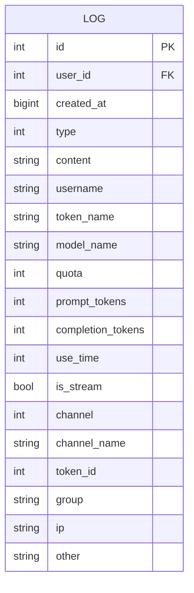
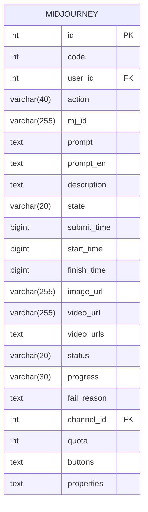
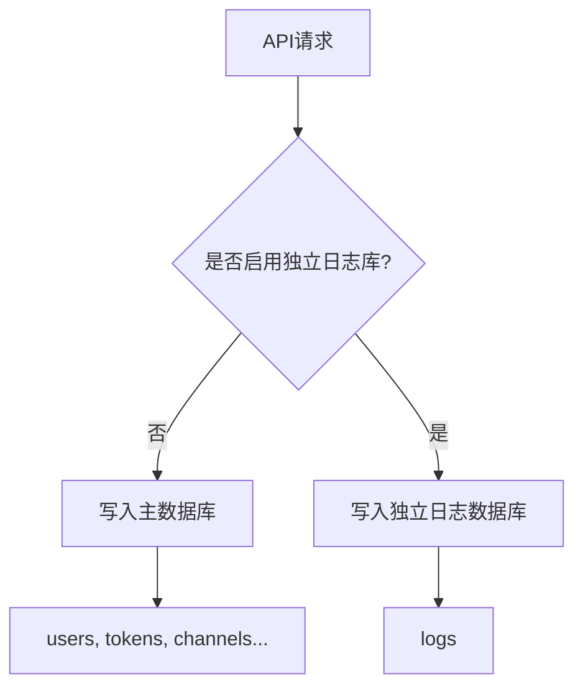
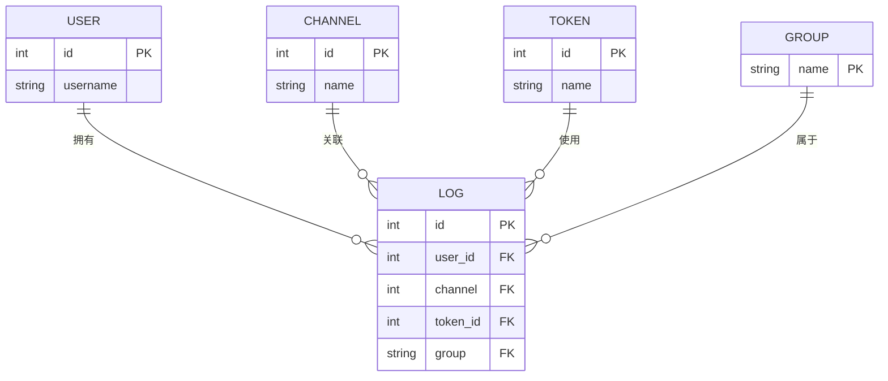
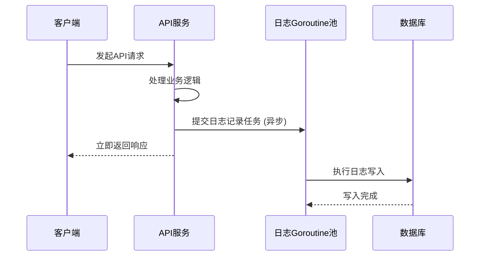

# 日志模型

<cite>
**本文档引用的文件**   
- [log.go](file://model/log.go)
- [midjourney.go](file://model/midjourney.go)
- [logger.go](file://logger/logger.go)
- [log.go](file://middleware/logger.go)
- [service/midjourney.go](file://service/midjourney.go)
- [service/log_info_generate.go](file://service/log_info_generate.go)
- [dto/midjourney.go](file://dto/midjourney.go)
- [common/sys_log.go](file://common/sys_log.go)
- [common/str.go](file://common/str.go)
- [main.go](file://model/main.go)
- [database.go](file://common/database.go)
</cite>

## 目录
1. [简介](#简介)
2. [日志实体结构](#日志实体结构)
3. [日志分类与存储策略](#日志分类与存储策略)
4. [日志关联关系](#日志关联关系)
5. [数据库设计与分区策略](#数据库设计与分区策略)
6. [日志写入性能优化](#日志写入性能优化)
7. [日志生成与查询实现](#日志生成与查询实现)
8. [日志安全与合规](#日志安全与合规)
9. [结论](#结论)

## 简介

本日志模型文档全面解析了系统中各类日志实体的结构、存储、关联关系及安全合规要求。系统实现了多维度的日志记录机制，包括使用日志、任务日志和Midjourney日志等，用于追踪用户操作、系统性能和资源消耗。日志系统与用户、渠道、令牌等核心实体紧密关联，为系统监控、计费和审计提供了数据基础。通过异步写入、批量处理等性能优化方案，确保了日志记录的高效性，同时通过敏感信息脱敏等安全措施保障了数据隐私。

**Section sources**
- [log.go](file://model/log.go#L20-L40)
- [midjourney.go](file://model/midjourney.go#L3-L26)

## 日志实体结构

系统定义了多种日志实体，每种实体都包含请求/响应数据、耗时、状态码、用户标识、渠道信息等关键字段。

### 使用日志 (Log)

`Log` 结构体是系统核心的使用日志实体，记录了用户通过API调用消耗额度的详细信息。

**关键字段：**
- **用户标识**: `UserId` (用户ID), `Username` (用户名)
- **请求信息**: `ModelName` (模型名称), `PromptTokens` (提示词Token数), `CompletionTokens` (完成Token数), `IsStream` (是否流式响应)
- **消耗信息**: `Quota` (消耗额度), `UseTime` (使用耗时，秒)
- **渠道信息**: `ChannelId` (渠道ID), `ChannelName` (渠道名称), `TokenId` (令牌ID), `TokenName` (令牌名称)
- **时间戳**: `CreatedAt` (创建时间，Unix时间戳)
- **分组**: `Group` (用户组)
- **IP地址**: `Ip` (客户端IP，根据用户设置可选记录)
- **扩展信息**: `Other` (JSON格式的其他信息，如模型比率、分组比率、缓存Token等)



**Diagram sources**
- [log.go](file://model/log.go#L20-L40)

### Midjourney任务日志 (Midjourney)

`Midjourney` 结构体专门用于记录与Midjourney服务相关的任务日志。

**关键字段：**
- **任务标识**: `MjId` (Midjourney任务ID), `Action` (操作类型，如imagine, upscale等)
- **用户与渠道**: `UserId` (用户ID), `ChannelId` (渠道ID)
- **任务内容**: `Prompt` (原始提示词), `PromptEn` (英文提示词), `Description` (描述)
- **状态与进度**: `State` (状态), `Status` (状态码), `Progress` (进度，如"100%"), `FailReason` (失败原因)
- **时间戳**: `SubmitTime` (提交时间), `StartTime` (开始时间), `FinishTime` (完成时间)
- **结果**: `ImageUrl` (图片URL), `VideoUrl` (视频URL), `VideoUrls` (视频URL数组)
- **消耗**: `Quota` (消耗额度)
- **扩展信息**: `Buttons` (按钮信息), `Properties` (属性信息)



**Diagram sources**
- [midjourney.go](file://model/midjourney.go#L3-L26)

**Section sources**
- [log.go](file://model/log.go#L20-L40)
- [midjourney.go](file://model/midjourney.go#L3-L26)
- [dto/midjourney.go](file://dto/midjourney.go#L47-L68)

## 日志分类与存储策略

### 日志分类

日志通过 `type` 字段进行分类，主要类型包括：
- `LogTypeConsume` (2): 消耗日志，记录成功的API调用。
- `LogTypeError` (5): 错误日志，记录API调用失败的情况。
- `LogTypeTopup` (1): 充值日志。
- `LogTypeRefund` (6): 退款日志。
- `LogTypeManage` (3): 管理日志。
- `LogTypeSystem` (4): 系统日志。

### 存储策略

系统采用灵活的存储策略，支持将日志存储在主数据库或独立的专用日志数据库中。
- **主数据库存储**: 当环境变量 `LOG_SQL_DSN` 为空时，日志与用户、令牌等核心数据存储在同一个数据库中。
- **独立日志数据库**: 当设置了 `LOG_SQL_DSN` 环境变量时，日志会被写入一个独立的数据库，实现读写分离，减轻主数据库压力。
- **数据库类型**: 支持 SQLite、MySQL 和 PostgreSQL 作为日志存储后端。



**Diagram sources**
- [main.go](file://model/main.go#L213-L247)
- [database.go](file://common/database.go#L3-L15)

**Section sources**
- [log.go](file://model/log.go#L43-L51)
- [main.go](file://model/main.go#L213-L247)

## 日志关联关系

日志实体与系统中的多个核心实体存在明确的关联关系。

### 与用户的关系

所有日志都通过 `UserId` 字段与 `User` 实体关联。`Username` 字段在日志创建时被填充，确保即使用户信息后续变更，日志记录的用户名仍保持不变。

### 与渠道的关系

日志通过 `ChannelId` 字段与 `Channel` 实体关联。在查询日志时，系统会通过 `GetAllLogs` 函数中的额外查询，将 `ChannelId` 映射为 `ChannelName`，方便用户理解。

### 与令牌的关系

日志通过 `TokenId` 字段与 `Token` 实体关联。`TokenName` 字段同样在日志创建时被填充，用于标识具体的API密钥。

### 与分组的关系

日志通过 `Group` 字段与用户分组关联，用于按分组进行额度统计和权限管理。



**Diagram sources**
- [log.go](file://model/log.go#L22-L38)
- [midjourney.go](file://model/midjourney.go#L6-L7)

**Section sources**
- [log.go](file://model/log.go#L22-L38)
- [midjourney.go](file://model/midjourney.go#L6-L7)

## 数据库设计与分区策略

### 表结构设计

基于 `Log` 和 `Midjourney` 结构体，数据库表设计如下：

**logs 表**
| 字段名 | 类型 | 约束 | 说明 |
| :--- | :--- | :--- | :--- |
| id | INT | PRIMARY KEY, INDEX | 主键 |
| user_id | INT | INDEX | 用户ID |
| created_at | BIGINT | INDEX | 创建时间戳 |
| type | INT | INDEX | 日志类型 |
| content | TEXT | | 内容 |
| username | VARCHAR(255) | INDEX | 用户名 |
| token_name | VARCHAR(255) | INDEX | 令牌名称 |
| model_name | VARCHAR(255) | INDEX | 模型名称 |
| quota | INT | DEFAULT 0 | 消耗额度 |
| prompt_tokens | INT | DEFAULT 0 | 提示词Token数 |
| completion_tokens | INT | DEFAULT 0 | 完成Token数 |
| use_time | INT | DEFAULT 0 | 使用耗时(秒) |
| is_stream | BOOLEAN | | 是否流式 |
| channel | INT | INDEX | 渠道ID |
| token_id | INT | INDEX | 令牌ID |
| group | VARCHAR(255) | INDEX | 分组 |
| ip | VARCHAR(255) | INDEX | IP地址 |
| other | TEXT | | 其他信息(JSON) |

**midjourney 表**
| 字段名 | 类型 | 约束 | 说明 |
| :--- | :--- | :--- | :--- |
| id | INT | PRIMARY KEY | 主键 |
| user_id | INT | INDEX | 用户ID |
| action | VARCHAR(40) | INDEX | 操作类型 |
| mj_id | VARCHAR(255) | INDEX | Midjourney任务ID |
| prompt | TEXT | | 原始提示词 |
| prompt_en | TEXT | | 英文提示词 |
| state | VARCHAR(20) | | 状态 |
| submit_time | BIGINT | INDEX | 提交时间 |
| start_time | BIGINT | INDEX | 开始时间 |
| finish_time | BIGINT | INDEX | 完成时间 |
| image_url | VARCHAR(255) | | 图片URL |
| status | VARCHAR(20) | INDEX | 状态码 |
| progress | VARCHAR(30) | INDEX | 进度 |
| channel_id | INT | | 渠道ID |
| quota | INT | | 消耗额度 |

### 分区策略建议

为了优化海量日志数据的查询性能，建议对 `logs` 表按时间进行分区：
- **分区键**: `created_at`
- **分区类型**: 范围分区 (RANGE)
- **分区粒度**: 按月分区，例如 `logs_2024_01`, `logs_2024_02` 等。
- **优势**: 查询特定时间段的日志时，数据库可以快速定位到相关分区，避免全表扫描，极大提升查询效率。

**Section sources**
- [log.go](file://model/log.go#L20-L40)
- [midjourney.go](file://model/midjourney.go#L3-L26)

## 日志写入性能优化

系统通过多种机制确保日志写入的高性能，避免阻塞主业务流程。

### 异步写入

核心的消耗日志 (`LogTypeConsume`) 的写入是异步的。在 `RecordConsumeLog` 函数中，日志记录操作被提交到一个Goroutine池（`gopool.Go`）中执行，这意味着API请求的响应不会等待日志写入数据库完成。

```go
// 伪代码示意
func RecordConsumeLog(c *gin.Context, userId int, params RecordConsumeLogParams) {
    // ... 构建日志对象 ...
    gopool.Go(func() {
        // 在独立的Goroutine中执行数据库写入
        LOG_DB.Create(log)
    })
}
```

### 批量处理

虽然代码中未直接体现批量插入，但通过使用Goroutine池，多个日志写入请求可以被并发处理。结合数据库连接池的配置，可以有效利用数据库的批量处理能力。

### 连接池配置

系统对数据库连接池进行了优化配置，确保有足够的连接来处理并发的日志写入请求：
- `SQL_MAX_IDLE_CONNS`: 最大空闲连接数 (默认100)
- `SQL_MAX_OPEN_CONNS`: 最大打开连接数 (默认1000)
- `SQL_MAX_LIFETIME`: 连接最大生命周期 (默认60秒)



**Diagram sources**
- [log.go](file://model/log.go#L198-L202)
- [main.go](file://model/main.go#L234-L236)

**Section sources**
- [log.go](file://model/log.go#L198-L202)
- [main.go](file://model/main.go#L234-L236)

## 日志生成与查询实现

### 日志生成流程

1.  **API请求到达**: Gin框架接收到HTTP请求。
2.  **中间件处理**: `middleware/logger.go` 中的 `SetUpLogger` 记录基础的HTTP访问日志（方法、路径、状态码、耗时等）。
3.  **业务处理**: 在API处理逻辑中，当需要记录详细使用日志时，调用 `service/log_info_generate.go` 中的 `GenerateTextOtherInfo` 等函数生成包含模型比率、缓存信息等的 `other` 字段。
4.  **记录日志**: 调用 `model/log.go` 中的 `RecordConsumeLog` 函数，将日志信息异步写入数据库。

### 日志查询接口

系统提供了丰富的日志查询API，由 `controller/log.go` 实现：
- `GetAllLogs`: 管理员查询所有日志，支持按类型、时间范围、模型、用户、令牌、渠道、分组等条件过滤。
- `GetUserLogs`: 用户查询自己的日志。
- `SearchAllLogs` / `SearchUserLogs`: 按关键字搜索日志。
- `GetLogsStat`: 统计指定条件下的额度消耗、RPM、TPM等指标。

**Section sources**
- [log.go](file://middleware/logger.go#L10-L27)
- [log_info_generate.go](file://service/log_info_generate.go#L34-L130)
- [log.go](file://model/log.go#L81-L203)
- [log.go](file://controller/log.go#L13-L170)

## 日志安全与合规

### 敏感信息脱敏

系统通过多种方式保护日志中的敏感信息：
- **IP地址**: 默认不记录用户IP。只有当用户在个人设置中明确开启“记录IP日志”选项时，才会记录IP。
- **请求/响应内容**: `Log` 实体的 `Content` 字段可能包含请求或响应内容。系统通过 `common/str.go` 中的 `MaskSensitiveInfo` 函数对URL、IP、域名等敏感信息进行脱敏处理，例如将 `https://api.example.com/key=secret` 脱敏为 `https://***.com/***/?key=***`。
- **管理信息**: 在 `formatUserLogs` 函数中，会从 `other` 字段的JSON数据中删除 `admin_info` 键，防止将管理员操作信息暴露给普通用户。

### 保留策略

系统提供了删除历史日志的功能：
- **接口**: `DeleteHistoryLogs` API允许删除指定时间戳之前的所有日志。
- **机制**: 通过 `DeleteOldLog` 函数，以分批（每次100条）的方式删除旧日志，避免长时间的数据库锁。

### 审计合规

- **完整记录**: 日志记录了用户、模型、渠道、消耗额度、时间等关键审计信息。
- **不可变性**: 日志一旦生成，其核心字段（如 `UserId`, `Quota`, `CreatedAt`）不可修改，保证了审计数据的可靠性。
- **访问控制**: 只有管理员可以查询所有用户的日志，普通用户只能查询自己的日志。

**Section sources**
- [log.go](file://model/log.go#L106-L110)
- [log.go](file://model/log.go#L53-L64)
- [str.go](file://common/str.go#L167-L208)
- [log.go](file://controller/log.go#L149-L169)
- [log.go](file://model/log.go#L390-L411)

## 结论

本日志模型设计全面且高效，涵盖了从实体结构、存储策略、性能优化到安全合规的各个方面。通过异步写入和独立日志库的策略，确保了系统的高性能；通过精细的字段设计和关联关系，满足了复杂的查询和统计需求；通过IP可选记录和内容脱敏等措施，保障了用户隐私和数据安全。该模型为系统的稳定运行、资源计费和安全审计提供了坚实的数据基础。