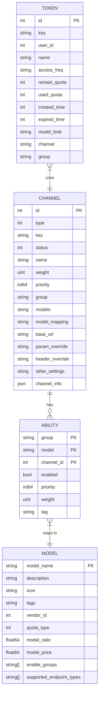
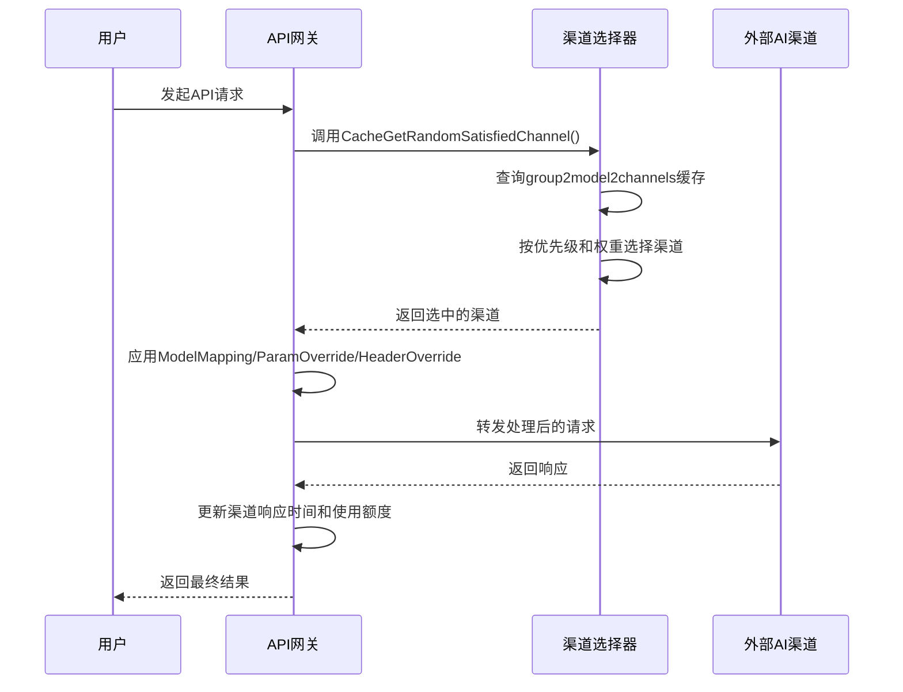

# 渠道模型

<cite>
**本文档引用的文件**   
- [channel.go](file://model/channel.go)
- [channel_cache.go](file://model/channel_cache.go)
- [channel_settings.go](file://dto/channel_settings.go)
- [channel.go](file://controller/channel.go)
- [ability.go](file://model/ability.go)
- [channel-billing.go](file://controller/channel-billing.go)
- [channel_select.go](file://service/channel_select.go)
- [redis.go](file://common/redis.go)
- [channel.go](file://constant/channel.go)
</cite>

## 目录
1. [渠道实体结构](#渠道实体结构)
2. [渠道与核心实体的映射关系](#渠道与核心实体的映射关系)
3. [渠道缓存机制](#渠道缓存机制)
4. [渠道业务逻辑](#渠道业务逻辑)
5. [渠道选择与服务中继](#渠道选择与服务中继)
6. [配置示例](#配置示例)
7. [常见问题排查](#常见问题排查)

## 渠道实体结构

渠道（Channel）是系统中连接外部AI服务的核心实体，其结构设计旨在支持多供应商、多模型、高可用性的复杂场景。核心字段包括渠道类型、状态、权重、API密钥、速率限制、负载均衡策略等。

### 核心字段解析

渠道的核心数据结构定义在 `model/channel.go` 文件中，主要字段如下：

| 字段 | 类型 | 说明 |
| :--- | :--- | :--- |
| `Id` | int | 渠道唯一标识符 |
| `Type` | int | 渠道类型，如OpenAI、Azure、Gemini等，具体值定义在 `constant/channel.go` |
| `Key` | string | API密钥，支持单密钥和多密钥模式 |
| `Status` | int | 渠道状态：1-启用，2-手动禁用，3-自动禁用 |
| `Name` | string | 渠道名称，用于标识 |
| `Weight` | *uint | 负载均衡权重，用于加权随机选择 |
| `Priority` | *int64 | 优先级，数值越大优先级越高 |
| `AutoBan` | *int | 是否启用自动禁用功能，1-启用，0-禁用 |
| `Group` | string | 所属分组，用于权限和路由控制 |
| `Models` | string | 支持的模型列表，以逗号分隔 |
| `ModelMapping` | *string | 模型重定向映射，JSON格式，用于将请求中的模型名映射到实际模型 |
| `BaseURL` | *string | 自定义API基础URL，为空时使用默认URL |
| `ParamOverride` | *string | 参数覆盖，JSON格式，用于覆盖请求中的特定参数 |
| `HeaderOverride` | *string | 请求头覆盖，JSON格式，用于添加或修改请求头 |
| `OtherSettings` | string | 其他设置，存储特定于渠道的额外信息，如Azure版本等 |
| `ChannelInfo` | ChannelInfo | 多密钥模式下的状态信息，包含轮询索引、密钥状态等 |

### 多密钥模式

渠道支持多密钥模式，通过 `ChannelInfo` 结构体管理。该结构体包含以下关键字段：
- `IsMultiKey`: 布尔值，标识是否为多密钥模式。
- `MultiKeySize`: 整数，表示密钥总数。
- `MultiKeyStatusList`: 映射，记录每个密钥的启用/禁用状态。
- `MultiKeyDisabledReason`: 映射，记录每个密钥被禁用的原因。
- `MultiKeyPollingIndex`: 整数，轮询模式下的当前索引。
- `MultiKeyMode`: 枚举，负载均衡策略，支持 `random` (随机) 和 `polling` (轮询)。

多密钥模式下，`Key` 字段可以存储多个密钥，支持通过换行符 `\n` 或JSON数组格式分隔。系统通过 `GetKeys()` 方法解析密钥列表。

**Section sources**
- [channel.go](file://model/channel.go#L21-L58)

## 渠道与核心实体的映射关系

渠道模型与系统中的其他核心实体（如模型、令牌、计费规则）通过明确的映射关系进行关联，确保了系统的灵活性和可扩展性。

### 实体关系图 (ER图)



**Diagram sources**
- [channel.go](file://model/channel.go#L21-L58)
- [ability.go](file://model/ability.go#L16-L24)
- [pricing.go](file://model/pricing.go#L17-L30)
- [token.go](file://model/token.go#L15-L35)

### 关键映射关系说明

1.  **渠道与能力 (Channel to Ability)**:
    *   **关系**: 一对多。一个渠道可以支持多个模型（能力），每个能力由 `group`、`model` 和 `channel_id` 三个字段共同作为主键。
    *   **作用**: `Ability` 表是渠道选择算法的核心。它记录了在特定分组 (`group`) 下，哪个渠道 (`channel_id`) 支持哪个模型 (`model`)，以及该能力的启用状态、优先级和权重。当用户发起请求时，系统会根据用户分组和请求模型查询 `Ability` 表，找到所有可用的渠道。

2.  **能力与计费规则 (Ability to Pricing)**:
    *   **关系**: 多对一。多个 `Ability` 记录可以映射到同一个计费规则。
    *   **作用**: `MODEL` 表（在代码中为 `Pricing` 结构体）定义了每个模型的计费规则，包括倍率 (`model_ratio`)、价格 (`model_price`) 等。`Ability` 表中的 `model` 字段与 `MODEL` 表的 `model_name` 进行关联，从而确定使用该渠道的模型时应如何计费。

3.  **令牌与渠道 (Token to Channel)**:
    *   **关系**: 多对一。一个令牌可以绑定到一个或多个渠道。
    *   **作用**: `TOKEN` 表中的 `channel` 字段可以指定该令牌只能使用特定的渠道。这为精细化的访问控制提供了可能，例如，可以创建一个令牌，使其只能调用某个特定供应商的渠道。

**Section sources**
- [channel.go](file://model/channel.go#L37-L38)
- [ability.go](file://model/ability.go#L16-L24)
- [pricing.go](file://model/pricing.go#L17-L30)
- [token.go](file://model/token.go#L15-L35)

## 渠道缓存机制

为了应对高并发场景，系统实现了基于内存和Redis的双重缓存机制，极大地提升了渠道选择的性能。

### 内存缓存

内存缓存是性能优化的核心，其实现在 `model/channel_cache.go` 文件中。主要数据结构如下：

*   `group2model2channels`: 一个嵌套的映射，结构为 `map[group]map[model][]channel_id`。它将所有**已启用**的渠道按分组和模型进行索引。当需要为某个分组和模型选择渠道时，可以直接通过此映射快速获取所有候选渠道ID列表。
*   `channelsIDM`: 一个映射，结构为 `map[channel_id]*Channel`。它缓存了所有渠道（包括已禁用的）的完整对象。

缓存的初始化 (`InitChannelCache`) 会在系统启动时从数据库加载所有渠道和能力数据，并构建上述两个映射。`SyncChannelCache` 函数会定期（由 `SYNC_FREQUENCY` 配置）同步数据库的变更。

### Redis缓存

当 `REDIS_CONN_STRING` 环境变量被设置时，系统会启用Redis作为分布式缓存。`common/redis.go` 文件提供了对Redis的封装。

*   **缓存内容**: 主要用于缓存渠道 (`Channel`) 和令牌 (`Token`) 的完整对象。
*   **实现方式**: 使用 `RedisHSetObj` 和 `RedisHGetObj` 方法将结构体对象以哈希(Hash)的形式存储在Redis中。例如，一个渠道对象会被存储为 `channel:1` 的哈希，其中字段名作为哈希的键，字段值作为哈希的值。
*   **过期策略**: 缓存项会设置过期时间，确保数据的最终一致性。

### 缓存读取流程

当需要获取一个渠道时，系统会遵循以下流程：
1.  如果启用了内存缓存 (`MemoryCacheEnabled`)，则调用 `CacheGetChannel`，直接从 `channelsIDM` 映射中读取。
2.  如果未启用内存缓存，则直接从数据库查询。
3.  在某些场景下（如渠道选择），会直接使用 `group2model2channels` 映射来获取候选渠道ID列表，然后再从 `channelsIDM` 中获取完整的渠道对象。

这种缓存机制使得在高并发下，渠道选择操作几乎不涉及数据库查询，从而将响应时间从毫秒级降低到微秒级。

**Section sources**
- [channel_cache.go](file://model/channel_cache.go#L17-L85)
- [redis.go](file://common/redis.go#L16-L239)

## 渠道业务逻辑

渠道的业务逻辑涵盖了启用/禁用、故障转移、健康检查等关键功能，确保了服务的稳定性和高可用性。

### 启用与禁用

渠道的状态管理是其生命周期的核心。

*   **手动操作**: 管理员可以通过API手动启用或禁用渠道。`EnableChannelByTag` 和 `DisableChannelByTag` 函数可以批量操作具有相同标签的渠道。
*   **自动禁用**: 当渠道发生错误（如API密钥失效、余额不足）时，系统可以根据配置自动禁用该渠道。`service/ShouldDisableChannel` 函数会根据错误码和错误消息判断是否触发自动禁用。例如，当收到 `invalid_api_key` 或 `insufficient_quota` 错误时，系统会自动禁用渠道。
*   **自动启用**: 当一个被自动禁用的渠道恢复服务后，系统可以自动将其重新启用。`service/ShouldEnableChannel` 函数负责判断此条件。

### 故障转移与健康检查

系统通过健康检查和故障转移机制来保证服务的连续性。

*   **健康检查**: `controller/channel-test.go` 中的 `testAllChannels` 函数会定期（由 `monitor_setting.auto_test_channel_minutes` 配置）对所有启用的渠道进行测试。测试内容包括发送一个实际的API请求，检查响应是否成功。
*   **故障转移**: 当一个渠道在测试中失败时，`UpdateChannelStatus` 函数会被调用，将其状态更新为“自动禁用”。同时，`handlerMultiKeyUpdate` 函数会处理多密钥模式下的故障转移：如果一个密钥失效，系统会将其标记为禁用，并尝试使用该渠道下的其他可用密钥。当所有密钥都失效时，整个渠道才会被禁用。
*   **响应时间监控**: 系统会记录每个渠道的平均响应时间 (`ResponseTime`)。如果响应时间超过阈值 (`ChannelDisableThreshold`)，渠道也会被自动禁用。

**Section sources**
- [channel.go](file://model/channel.go#L608-L695)
- [channel-test.go](file://controller/channel-test.go#L536-L643)
- [channel-billing.go](file://controller/channel-billing.go#L454-L505)
- [service.go](file://service/channel.go#L47-L99)

## 渠道选择与服务中继

渠道选择是系统的核心功能，决定了用户的请求最终由哪个外部API处理。

### 渠道选择算法

渠道选择算法实现在 `service/channel_select.go` 的 `CacheGetRandomSatisfiedChannel` 函数中，其流程如下：

1.  **确定分组**: 首先确定请求的目标分组 (`tokenGroup`)。如果分组为 "auto"，则会根据用户分组和预设的自动分组规则，按优先级顺序遍历所有可用分组。
2.  **获取候选渠道**: 调用 `model.GetRandomSatisfiedChannel`，根据分组和模型名，从 `group2model2channels` 缓存中获取所有候选渠道ID列表。
3.  **按优先级分组**: 将候选渠道按 `Priority` 降序排序，并将具有相同优先级的渠道分为一组。
4.  **重试机制**: `retry` 参数决定了选择第几优先级的组。`retry=0` 选择最高优先级的组，`retry=1` 选择次高优先级的组，以此类推。
5.  **负载均衡**: 在选中的优先级组内，根据 `Weight` 字段进行加权随机选择。权重越高，被选中的概率越大。

### 服务中继流程

服务中继流程由 `relay` 包处理，其核心步骤如下：

1.  **接收请求**: API网关接收来自用户的请求。
2.  **渠道选择**: 调用 `CacheGetRandomSatisfiedChannel` 选择一个合适的渠道。
3.  **请求预处理**: 根据渠道的 `ModelMapping`、`ParamOverride` 和 `HeaderOverride` 对原始请求进行修改。
4.  **转发请求**: 将修改后的请求转发到所选渠道的API端点。
5.  **结果返回**: 将渠道的响应结果返回给用户。
6.  **后处理**: 更新渠道的 `ResponseTime` 和 `UsedQuota`，并根据响应结果决定是否需要更新渠道状态（如禁用）。



**Diagram sources**
- [channel_select.go](file://service/channel_select.go#L83-L162)
- [channel_cache.go](file://model/channel_cache.go#L96-L190)

## 配置示例

### 创建一个支持多密钥的OpenAI渠道

```json
{
  "mode": "multi_to_single",
  "multi_key_mode": "polling",
  "channel": {
    "type": 1,
    "name": "OpenAI多密钥轮询",
    "key": "sk-xxxxxxxx1\nsk-xxxxxxxx2\nsk-xxxxxxxx3",
    "status": 1,
    "group": "default",
    "models": "gpt-3.5-turbo,gpt-4",
    "priority": 100,
    "weight": 5,
    "auto_ban": 1,
    "model_mapping": "{\"gpt-3.5-turbo\": \"gpt-3.5-turbo-1106\"}",
    "param_override": "{\"temperature\": 0.7}",
    "header_override": "{\"X-Custom-Header\": \"value\"}"
  }
}
```

### 配置渠道的额外设置 (Azure)

```json
{
  "azure_responses_version": "2023-05-15",
  "vertex_key_type": "json",
  "openrouter_enterprise": true
}
```

## 常见问题排查

| 问题 | 可能原因 | 解决方案 |
| :--- | :--- | :--- |
| 渠道测试失败 | API密钥错误、网络不通、配额用尽 | 检查密钥是否正确，确认网络可达，检查服务商后台配额 |
| 请求返回401错误 | API密钥无效或已过期 | 更新渠道的API密钥 |
| 请求返回429错误 | 触发了速率限制 | 检查渠道和模型的速率限制配置，或联系服务商提升限额 |
| 模型无法使用 | 模型未在渠道的`Models`字段中列出 | 编辑渠道，将模型添加到`Models`列表中 |
| 自动禁用功能未生效 | `AUTOMATIC_DISABLE_CHANNEL_ENABLED` 环境变量未开启 | 在环境变量中设置 `AUTOMATIC_DISABLE_CHANNEL_ENABLED=true` |
| Redis连接失败 | `REDIS_CONN_STRING` 配置错误 | 检查Redis连接字符串是否正确 |