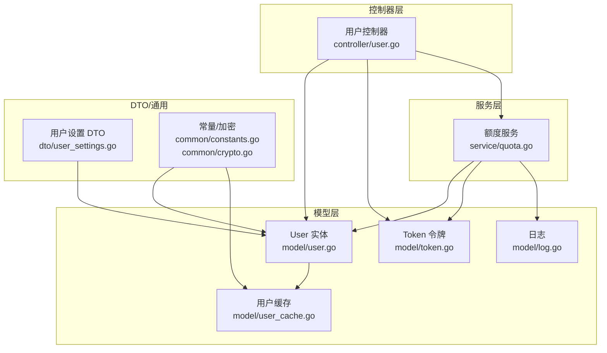
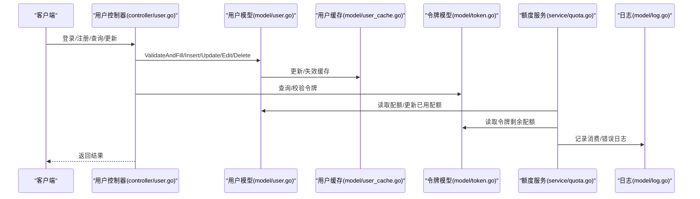
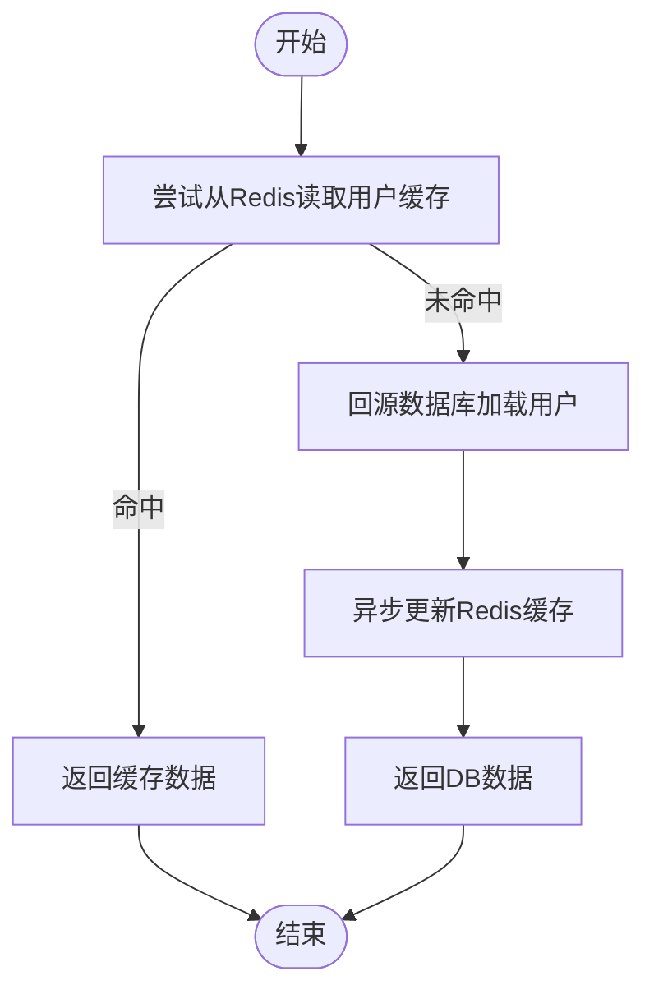
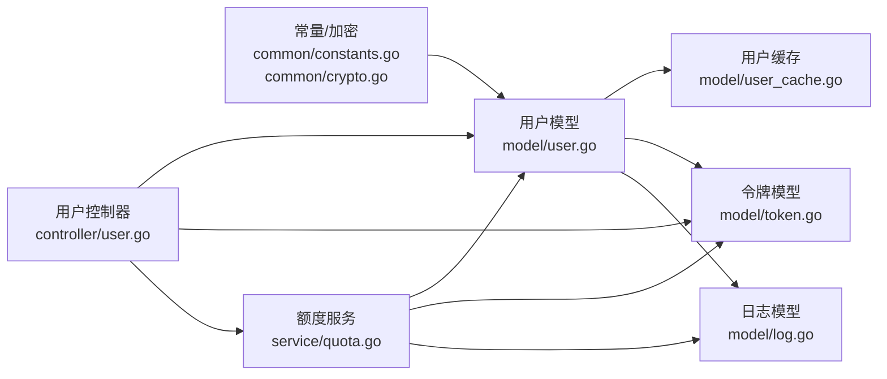

# 用户模型

<cite>
**本文引用的文件列表**
- [model/user.go](file://model/user.go)
- [controller/user.go](file://controller/user.go)
- [dto/user_settings.go](file://dto/user_settings.go)
- [model/user_cache.go](file://model/user_cache.go)
- [service/quota.go](file://service/quota.go)
- [model/token.go](file://model/token.go)
- [model/log.go](file://model/log.go)
- [common/constants.go](file://common/constants.go)
- [common/crypto.go](file://common/crypto.go)
</cite>

## 目录
1. [简介](#简介)
2. [项目结构](#项目结构)
3. [核心组件](#核心组件)
4. [架构总览](#架构总览)
5. [详细组件分析](#详细组件分析)
6. [依赖关系分析](#依赖关系分析)
7. [性能考量](#性能考量)
8. [故障排查指南](#故障排查指南)
9. [结论](#结论)
10. [附录](#附录)

## 简介
本文件系统性梳理用户模型的字段定义、数据类型、主键与约束、状态与权限等级、配额管理、通知设置、与令牌及账单使用日志的关系，并给出数据库表结构示例、典型数据记录、用户缓存机制（Redis）的实现与失效策略、数据访问模式、性能优化建议与安全控制（如密码加密）。同时结合代码路径说明用户创建、更新、查询等操作的实现逻辑。

## 项目结构
围绕用户模型的关键目录与文件：
- model 层：用户实体、缓存、令牌、日志等持久化与缓存逻辑
- controller 层：用户登录、注册、查询、更新、配额转移等接口
- dto 层：用户设置结构体
- service 层：额度计算、消费、通知等业务逻辑
- common 层：常量、加密、Redis、速率限制等通用能力

图表来源
- [model/user.go](file://model/user.go#L1-L120)
- [model/user_cache.go](file://model/user_cache.go#L1-L120)
- [model/token.go](file://model/token.go#L1-L120)
- [model/log.go](file://model/log.go#L1-L120)
- [controller/user.go](file://controller/user.go#L1-L120)
- [service/quota.go](file://service/quota.go#L1-L120)
- [dto/user_settings.go](file://dto/user_settings.go#L1-L24)
- [common/constants.go](file://common/constants.go#L130-L200)
- [common/crypto.go](file://common/crypto.go#L1-L32)

章节来源
- [model/user.go](file://model/user.go#L1-L120)
- [controller/user.go](file://controller/user.go#L1-L120)

## 核心组件
- 用户实体 User：包含身份标识、状态、权限、配额、邀请体系、第三方账号绑定、设置、备注、Stripe 客户标识等字段
- 用户设置 DTO UserSetting：包含通知类型、阈值、Webhook、推送地址与令牌、是否记录IP日志、侧边栏模块配置等
- 用户缓存 UserBase：用于Redis哈希缓存的轻量结构，承载常用读取字段
- 额度服务 Quota：负责按模型/分组/价格计算配额消耗、预扣费、补扣费、通知与日志记录
- 令牌 Token：用户拥有的密钥，关联额度、有效期、模型限制、IP白名单等
- 日志 Log：消费、充值、管理、系统、错误等类型日志，记录用户行为轨迹

章节来源
- [model/user.go](file://model/user.go#L18-L120)
- [dto/user_settings.go](file://dto/user_settings.go#L1-L24)
- [model/user_cache.go](file://model/user_cache.go#L16-L46)
- [service/quota.go](file://service/quota.go#L1-L120)
- [model/token.go](file://model/token.go#L14-L32)
- [model/log.go](file://model/log.go#L20-L60)

## 架构总览
用户模型在系统中的交互流程概览如下：

图表来源
- [controller/user.go](file://controller/user.go#L1-L120)
- [model/user.go](file://model/user.go#L432-L520)
- [model/user_cache.go](file://model/user_cache.go#L60-L120)
- [model/token.go](file://model/token.go#L146-L200)
- [service/quota.go](file://service/quota.go#L480-L582)
- [model/log.go](file://model/log.go#L81-L120)

## 详细组件分析

### 用户实体与字段定义
- 主键与索引
  - Id：自增主键
  - Username：唯一索引
  - Email、GitHubId、DiscordId、OidcId、WeChatId、TelegramId、LinuxDOId：多字段索引
  - DeletedAt：软删除索引
- 字段与约束
  - 角色 Role：整型，默认普通用户
  - 状态 Status：整型，默认启用
  - 密码 Password：非空，长度约束
  - 显示名 DisplayName：索引
  - 邀请相关：AffCode、AffCount、AffQuota、AffHistoryQuota、InviterId
  - 配额相关：Quota、UsedQuota、RequestCount
  - 分组 Group：默认“default”
  - 备注 Remark：可选
  - StripeCustomer：索引
  - Setting：文本字段，存储用户侧边栏与通知等配置
- 关系
  - 与 Token：一对多（用户拥有多个令牌）
  - 与 Log：一对多（用户产生多条日志）

章节来源
- [model/user.go](file://model/user.go#L18-L120)
- [model/token.go](file://model/token.go#L14-L32)
- [model/log.go](file://model/log.go#L20-L40)

### 用户状态、权限等级与邀请体系
- 状态
  - 启用/禁用：通过 Status 字段区分
- 权限等级
  - 游客、普通用户、管理员、超级管理员
- 邀请体系
  - AffCode 作为邀请码；邀请人增加 AffCount、AffQuota、AffHistoryQuota；被邀请人获得配额赠送
  - 支持将邀请额度转入自身配额（事务保证一致性）

章节来源
- [common/constants.go](file://common/constants.go#L136-L145)
- [common/constants.go](file://common/constants.go#L178-L181)
- [model/user.go](file://model/user.go#L328-L429)

### 配额管理与通知设置
- 配额字段
  - Quota：可用配额
  - UsedQuota：已用配额
  - RequestCount：请求次数
- 通知设置
  - UserSetting：包含通知类型、阈值、Webhook、推送地址与令牌、是否记录IP日志、侧边栏模块配置
- 额度计算与消费
  - 依据模型/分组/价格计算配额消耗
  - 支持预扣费、补扣费、返还
  - 低配额提醒：根据用户设置阈值触发通知

章节来源
- [dto/user_settings.go](file://dto/user_settings.go#L1-L24)
- [service/quota.go](file://service/quota.go#L1-L120)
- [service/quota.go](file://service/quota.go#L480-L582)

### 用户缓存机制（Redis）与失效策略
- 缓存结构
  - UserBase：包含常用字段，便于快速读取
- 缓存键
  - user:{userId}
- 读取策略
  - 先查Redis哈希，失败则回源DB，成功后异步更新缓存
- 写入/更新
  - 更新用户信息后调用更新缓存方法
- 失效策略
  - 删除用户时主动失效对应缓存键
  - 单字段更新：Status、Quota、Group、Username、Setting分别写入对应字段
- 原子配额操作
  - 通过Redis哈希字段原子增减，降低DB压力

图表来源
- [model/user_cache.go](file://model/user_cache.go#L73-L120)
- [model/user_cache.go](file://model/user_cache.go#L129-L138)
- [model/user_cache.go](file://model/user_cache.go#L181-L220)

章节来源
- [model/user_cache.go](file://model/user_cache.go#L1-L220)

### 用户与令牌、账单/使用日志的关系
- 令牌关联
  - Token.UserId 关联用户
  - 令牌具备有效期、剩余配额、模型限制、IP白名单等
- 额度消费链路
  - 预扣费：检查用户与令牌配额
  - 补扣费/返还：根据最终用量调整用户与令牌配额
  - 记录消费日志：含模型、Token、通道、分组、耗时、其他信息
- 错误日志
  - 可按用户设置选择是否记录IP

章节来源
- [model/token.go](file://model/token.go#L14-L32)
- [service/quota.go](file://service/quota.go#L480-L582)
- [model/log.go](file://model/log.go#L81-L120)

### 数据库表结构示例与典型数据记录
- 用户表（示意）
  - 字段：id、username、password、display_name、role、status、email、github_id、discord_id、oidc_id、wechat_id、telegram_id、access_token、quota、used_quota、request_count、group、aff_code、aff_count、aff_quota、aff_history_quota、inviter_id、deleted_at、setting、remark、stripe_customer、linux_do_id
  - 主键：id
  - 约束：username 唯一；多字段索引：email、github_id、discord_id、oidc_id、wechat_id、telegram_id、linux_do_id、deleted_at
- 典型数据记录
  - 用户：普通用户，启用状态，配额初始值，分组 default，邀请码随机生成
  - 令牌：用户ID关联，剩余配额、有效期、模型限制、IP白名单等

章节来源
- [model/user.go](file://model/user.go#L18-L120)
- [model/token.go](file://model/token.go#L14-L32)

### 用户创建、更新、查询的实现逻辑（代码路径）
- 创建用户
  - 注册接口接收参数，校验邮箱验证码（若开启），检查是否存在或已注销，插入用户并初始化配额与设置，必要时生成默认令牌
  - 插入后根据角色生成默认侧边栏配置并落库
- 更新用户
  - 管理端更新：校验权限等级，支持修改角色与配额，记录管理日志
  - 自更新：校验原密码，支持修改显示名、密码等，更新缓存
- 查询用户
  - 获取自身：隐藏管理员备注，返回权限与侧边栏模块
  - 获取他人：受权限等级限制，避免越权查看
- 删除用户
  - 管理端删除：校验权限等级，执行硬删除

章节来源
- [controller/user.go](file://controller/user.go#L145-L274)
- [controller/user.go](file://controller/user.go#L307-L332)
- [controller/user.go](file://controller/user.go#L405-L482)
- [controller/user.go](file://controller/user.go#L601-L759)
- [controller/user.go](file://controller/user.go#L778-L800)

### 安全控制措施（密码加密、敏感信息处理）
- 密码加密
  - 使用 bcrypt 对密码进行加盐哈希存储
- 敏感字段清理
  - 登录流程中对敏感字段进行清理，避免明文保存
- 令牌校验
  - 令牌状态、过期、额度耗尽均进行严格校验
- 会话与权限
  - 登录后写入会话，携带角色、状态、分组等上下文

章节来源
- [common/crypto.go](file://common/crypto.go#L23-L32)
- [controller/user.go](file://controller/user.go#L97-L126)
- [model/token.go](file://model/token.go#L75-L117)

## 依赖关系分析
- 用户模型依赖
  - 常量与加密：角色、状态、配额单位、加密算法
  - 用户缓存：Redis 哈希读写、字段原子增减
  - 额度服务：用户与令牌配额读取、预扣费/补扣费、日志记录
  - 令牌模型：令牌有效性与额度校验
  - 日志模型：消费与错误日志
- 控制器依赖
  - 用户控制器协调用户、令牌、额度服务与日志

图表来源
- [common/constants.go](file://common/constants.go#L136-L200)
- [common/crypto.go](file://common/crypto.go#L1-L32)
- [model/user.go](file://model/user.go#L1-L120)
- [model/user_cache.go](file://model/user_cache.go#L1-L120)
- [model/token.go](file://model/token.go#L1-L120)
- [model/log.go](file://model/log.go#L1-L120)
- [service/quota.go](file://service/quota.go#L1-L120)
- [controller/user.go](file://controller/user.go#L1-L120)

## 性能考量
- 读取热点优化
  - 用户缓存：Redis 哈希缓存常用字段，读取失败回源DB并异步更新缓存
  - 单字段原子增减：Redis 哈希字段原子增减配额，减少DB写放大
- 写入一致性
  - 邀请额度转入：使用数据库事务，防止并发导致的不一致
- 批量更新
  - 额度变更支持批量更新策略，降低DB压力
- 日志与通知
  - 消费日志按需记录，错误日志可按用户设置决定是否记录IP

章节来源
- [model/user_cache.go](file://model/user_cache.go#L129-L138)
- [model/user.go](file://model/user.go#L339-L374)
- [service/quota.go](file://service/quota.go#L766-L790)

## 故障排查指南
- 登录失败
  - 检查用户名/密码是否正确、用户状态是否启用
- 额度不足
  - 核对用户配额、令牌剩余配额、模型/分组倍率与价格
- 令牌异常
  - 校验状态、过期时间、剩余配额、IP白名单
- 缓存不一致
  - 删除用户缓存键后重试，确认Redis可用与TTL设置
- 日志缺失
  - 检查日志开关与用户设置是否记录IP

章节来源
- [controller/user.go](file://controller/user.go#L30-L120)
- [service/quota.go](file://service/quota.go#L480-L582)
- [model/token.go](file://model/token.go#L75-L117)
- [model/user_cache.go](file://model/user_cache.go#L52-L58)

## 结论
用户模型围绕“身份、状态、权限、配额、通知、邀请”构建，通过Redis缓存与原子操作优化读写性能，配合严格的令牌校验与日志记录保障安全与可观测性。控制器层统一编排用户生命周期操作，服务层聚焦额度计算与通知，形成清晰的分层架构。

## 附录
- 术语
  - 配额：额度单位，按模型/分组/价格换算
  - 邀请额度：邀请人赠送的额度，可转入自身配额
  - 预扣费/补扣费：先预扣，再根据实际用量补扣或返还
- 最佳实践
  - 优先使用缓存读取用户信息，写入后立即失效缓存
  - 并发场景下使用事务保证邀请额度转入一致性
  - 合理设置通知阈值，避免频繁打扰
  - 严格校验令牌状态与额度，防止越权使用