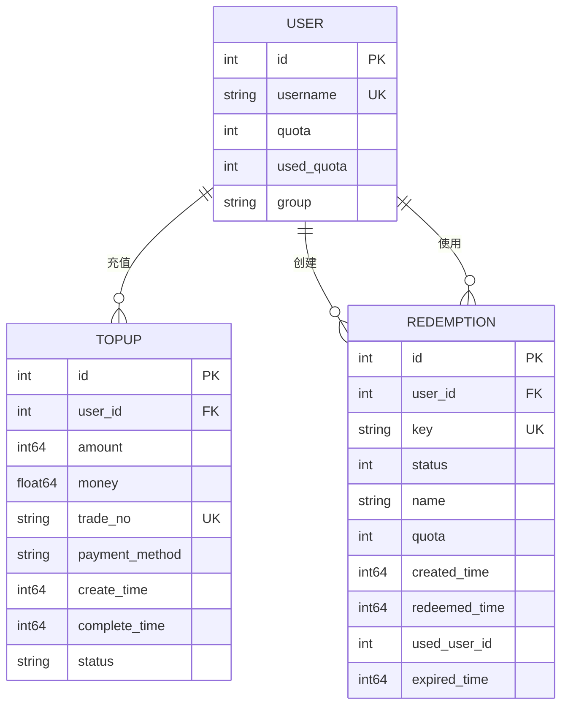
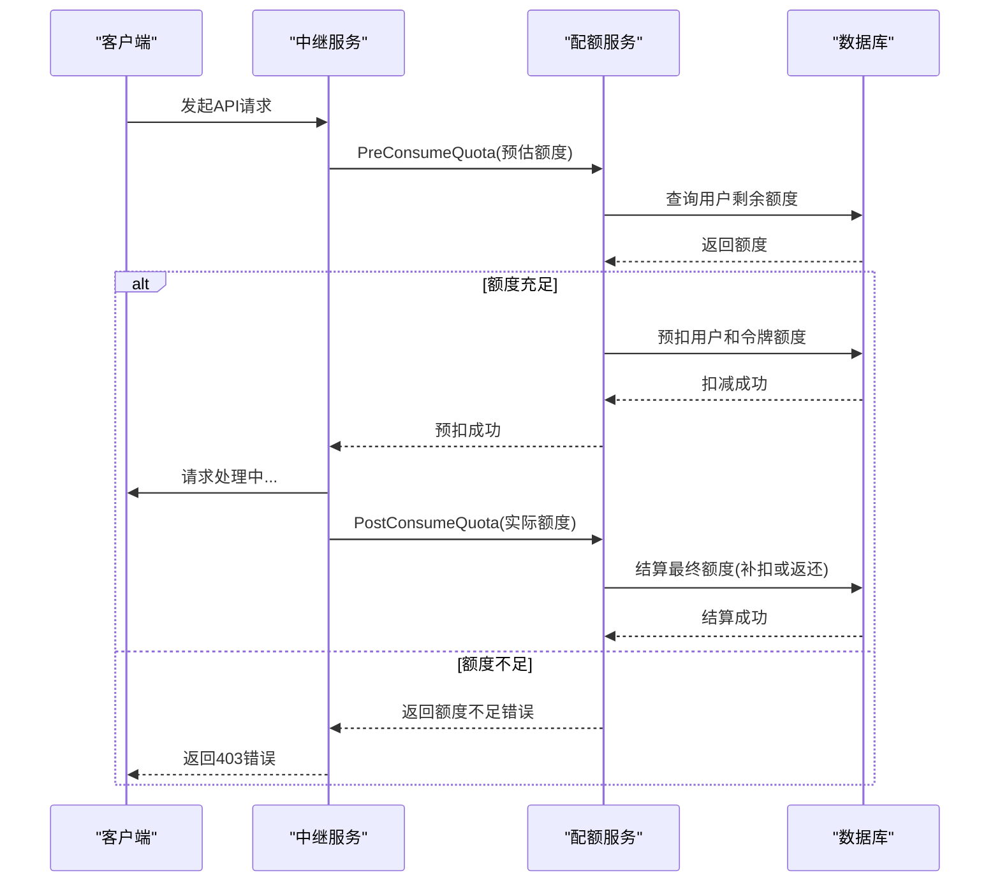

# 计费模型

<cite>
**本文档引用的文件**
- [billing.go](file://controller/billing.go)
- [topup.go](file://controller/topup.go)
- [pricing.go](file://controller/pricing.go)
- [redemption.go](file://controller/redemption.go)
- [pricing.go](file://model/pricing.go)
- [topup.go](file://model/topup.go)
- [redemption.go](file://model/redemption.go)
- [pre_consume_quota.go](file://service/pre_consume_quota.go)
- [quota.go](file://service/quota.go)
- [payment_setting.go](file://setting/operation_setting/payment_setting.go)
- [group_ratio.go](file://setting/ratio_setting/group_ratio.go)
- [topup-ratio.go](file://common/topup-ratio.go)
- [pricing_refresh.go](file://model/pricing_refresh.go)
- [user.go](file://model/user.go)
</cite>

## 目录
1. [引言](#引言)
2. [核心实体与关系](#核心实体与关系)
3. [计费模式实现机制](#计费模式实现机制)
4. [价格与汇率管理](#价格与汇率管理)
5. [核心业务流程](#核心业务流程)
6. [数据一致性与安全](#数据一致性与安全)
7. [对账与财务安全](#对账与财务安全)

## 引言

本文档全面阐述了AI API平台的计费模型，详细描述了定价策略、充值记录、兑换码、配额消耗等核心实体的结构和关系。文档深入解析了按量、包月、积分等多种计费模式的实现机制，说明了价格刷新、汇率换算、多货币支持等功能的逻辑。通过ER图展示了计费相关实体的关联，并阐述了配额预扣、实时扣费、账单生成等核心流程。同时，文档结合代码逻辑说明了充值、消费、退款等操作的实现细节，并涵盖了计费数据一致性保障、对账机制和财务安全要求。

**Section sources**
- [billing.go](file://controller/billing.go#L1-L109)
- [topup.go](file://controller/topup.go#L1-L393)
- [pricing.go](file://controller/pricing.go#L1-L75)

## 核心实体与关系

计费系统的核心围绕用户配额（Quota）、充值记录（TopUp）和兑换码（Redemption）三大实体展开。用户配额是计费的基本单位，所有消费行为都基于此进行扣减。充值记录实体记录了用户通过在线支付（如Stripe、易支付）完成的每一笔交易，是财务对账的重要依据。兑换码实体则用于发放优惠或奖励，允许用户通过兑换码直接增加配额。

**Diagram sources**
- [user.go](file://model/user.go#L20-L50)
- [topup.go](file://model/topup.go#L14-L24)
- [redemption.go](file://model/redemption.go#L14-L27)

## 计费模式实现机制

系统支持多种计费模式，其核心实现依赖于灵活的倍率和价格配置。

### 按量计费
按量计费是最主要的计费模式。其核心逻辑在 `service/quota.go` 中的 `calculateAudioQuota` 函数中实现。消费额度的计算基于以下公式：
`消费额度 = (输入文本Token + 输出文本Token * 补全倍率 + 输入音频Token * 音频倍率 + 输出音频Token * 音频倍率 * 音频补全倍率) * 模型倍率 * 分组倍率`

该公式通过 `QuotaInfo` 结构体传递所有参数，并由 `calculateAudioQuota` 函数统一计算。模型倍率和分组倍率分别由 `ratio_setting.GetModelRatio` 和 `ratio_setting.GetGroupRatio` 获取，支持精细化的定价策略。

### 包月与积分模式
系统通过“额度单位”（QuotaPerUnit）的概念来支持包月和积分模式。在 `common` 包中，`QuotaPerUnit` 常量定义了每个额度单位所代表的实际价值。例如，当 `QuotaPerUnit` 设置为100时，10000个额度单位就等价于100美元。前端通过 `operation_setting.GetQuotaDisplayType()` 决定显示为USD、CNY还是TOKENS，后端在 `billing.go` 的 `GetSubscription` 和 `GetUsage` 接口中根据此设置进行金额换算。

**Section sources**
- [quota.go](file://service/quota.go#L50-L87)
- [billing.go](file://controller/billing.go#L48-L55)

## 价格与汇率管理

### 价格刷新机制
为了保证定价数据的实时性，系统采用了缓存与定时刷新的策略。`model/pricing.go` 中的 `GetPricing()` 函数是获取定价信息的主要入口。该函数会检查 `lastGetPricingTime` 时间戳，如果距离上次刷新超过1分钟，则会获取 `updatePricingLock` 锁，然后调用 `updatePricing()` 函数重新从数据库加载模型元数据、供应商信息和能力配置，并构建最新的 `pricingMap` 缓存。

管理员可以通过调用 `RefreshPricing()` 函数强制立即刷新缓存，该函数会绕过1分钟的延迟检查，直接执行 `updatePricing()`。此机制确保了在修改模型配置后，前端能快速获取到最新的价格信息。

### 汇率与多货币支持
系统支持多货币显示，主要通过 `operation_setting` 包中的 `USDExchangeRate` 和 `QuotaPerUnit` 配置项实现。当 `GetQuotaDisplayType()` 返回 `CNY` 时，后端会将额度除以 `QuotaPerUnit` 再乘以 `USDExchangeRate` 来换算成人民币金额。前端通过 `getCurrencyConfig()` 函数读取 `localStorage` 中的 `usd_exchange_rate` 等信息，动态地将美元金额转换为用户选择的货币进行显示。

**Section sources**
- [pricing.go](file://model/pricing.go#L57-L68)
- [pricing_refresh.go](file://model/pricing_refresh.go#L6-L14)
- [billing.go](file://controller/billing.go#L48-L55)

## 核心业务流程

### 配额预扣与实时扣费
为了防止用户超额消费，系统实现了配额预扣机制。在 `service/pre_consume_quota.go` 中的 `PreConsumeQuota` 函数负责此逻辑。该函数首先检查用户和令牌的剩余额度，如果额度充足，则根据预估的消费额度调用 `model.DecreaseUserQuota` 和 `PreConsumeTokenQuota` 进行预扣。

消费完成后，`PostConsumeQuota` 函数会根据实际消费额度进行最终结算。如果实际消费大于预扣额度，则进行补扣；如果小于预扣额度，则返还差额。整个流程通过 `relayInfo.FinalPreConsumedQuota` 记录预扣额度，确保了账目的精确性。

**Diagram sources**
- [pre_consume_quota.go](file://service/pre_consume_quota.go#L33-L78)
- [quota.go](file://service/quota.go#L504-L533)

### 充值流程
在线充值流程由 `controller/topup.go` 中的 `RequestEpay` 函数处理。用户发起充值请求后，系统会根据用户分组和充值金额，通过 `getPayMoney` 函数计算出应付金额。该函数会应用分组充值倍率（`GetTopupGroupRatio`）和阶梯折扣（`AmountDiscount`）。

计算出金额后，系统会生成一个唯一的交易号（tradeNo），创建一条状态为“pending”的 `TopUp` 记录，并调用第三方支付网关（如易支付）的API拉起支付。支付成功后，支付网关会通过 `EpayNotify` 回调通知系统。为防止并发攻击，系统使用 `orderLocks` 同步映射为每个交易号加锁，确保同一订单不会被重复处理。回调成功后，系统会更新订单状态为“success”，并通过 `IncreaseUserQuota` 增加用户额度。

**Section sources**
- [topup.go](file://controller/topup.go#L130-L203)
- [topup.go](file://controller/topup.go#L232-L292)
- [topup.go](file://model/topup.go#L58-L104)

### 兑换码流程
兑换码流程由 `controller/redemption.go` 中的 `AddRedemption` 和 `Redeem` 函数实现。管理员通过 `AddRedemption` 批量生成指定名称、额度和过期时间的兑换码。生成的兑换码会插入到数据库中，状态为“enabled”。

用户通过 `Redeem` 接口兑换时，系统会使用 `FOR UPDATE` 行级锁查询兑换码，确保其状态为“enabled”且未过期。验证通过后，系统会更新用户额度，并将兑换码状态改为“used”，同时记录 `used_user_id` 和 `redeemed_time`。此流程保证了兑换码的原子性和唯一性。

**Section sources**
- [redemption.go](file://controller/redemption.go#L61-L120)
- [redemption.go](file://controller/redemption.go#L115-L155)
- [redemption.go](file://model/redemption.go#L115-L149)

## 数据一致性与安全

### 分布式锁与事务
在高并发场景下，系统通过多种机制保障数据一致性。对于支付回调和兑换码兑换这类关键操作，系统使用了细粒度的锁机制。

在 `topup.go` 中，`orderLocks` 是一个 `sync.Map`，为每个交易号维护一个独立的 `sync.Mutex`。`LockOrder` 和 `UnlockOrder` 函数确保了同一订单的处理是串行的，防止了重复充值。在 `redemption.go` 中，`Redeem` 函数使用数据库的 `FOR UPDATE` 锁来锁定兑换码记录，防止多个请求同时兑换同一个码。

所有涉及额度变更的操作都包裹在数据库事务中。例如，`ManualCompleteTopUp` 函数在补单时，会将更新订单状态和增加用户额度的操作放在同一个事务内，确保了操作的原子性，避免了部分成功导致的数据不一致。

### 财务安全
系统在财务安全方面采取了多重措施。首先，所有敏感的财务操作（如充值、补单）都要求管理员权限。其次，系统记录了详尽的操作日志。`RecordLog` 函数被广泛用于记录用户额度变更、充值成功、管理员补单等关键事件，为后续的审计和对账提供了依据。

此外，系统通过 `common.SysLog` 记录所有内部错误，特别是与财务相关的错误（如“充值失败”、“更新用户失败”），便于运维人员及时发现和排查问题。对于用户额度的变更，系统不仅更新用户表，还会更新 `used_quota` 字段，以便于统计和展示。

**Section sources**
- [topup.go](file://controller/topup.go#L205-L230)
- [topup.go](file://model/topup.go#L71-L95)
- [redemption.go](file://model/redemption.go#L129-L149)
- [topup.go](file://model/topup.go#L252-L298)

## 对账与财务安全

系统的对账机制主要依赖于完整的交易记录和日志。`TopUp` 表记录了所有在线充值的原始交易数据，包括交易号、支付金额、支付方式和状态，这些数据可直接与第三方支付平台的账单进行核对。

`Log` 表（通过 `RecordLog` 函数写入）则记录了所有额度变动的业务上下文，如“使用在线充值成功”、“通过兑换码充值”等。这些日志将技术操作与业务动作关联起来，是内部对账和用户查询的重要依据。

为了进一步保障财务安全，系统在 `topup.go` 中实现了 `ManualCompleteTopUp` 管理员补单接口。该接口允许管理员手动完成因网络问题而未收到回调的订单，但同样需要加锁和事务保护，确保操作的安全性。同时，系统通过 `GetAllTopUps` 和 `SearchAllTopUps` 等接口为管理员提供了全平台的充值记录查询能力，便于进行财务审计。

**Section sources**
- [topup.go](file://model/topup.go#L237-L307)
- [topup.go](file://controller/topup.go#L375-L392)
- [topup.go](file://controller/topup.go#L347-L369)
- [topup.go](file://model/topup.go#L106-L137)