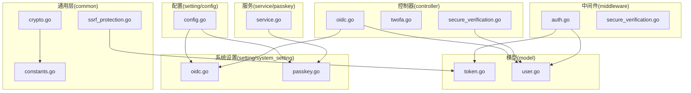
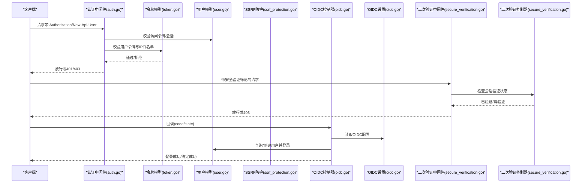
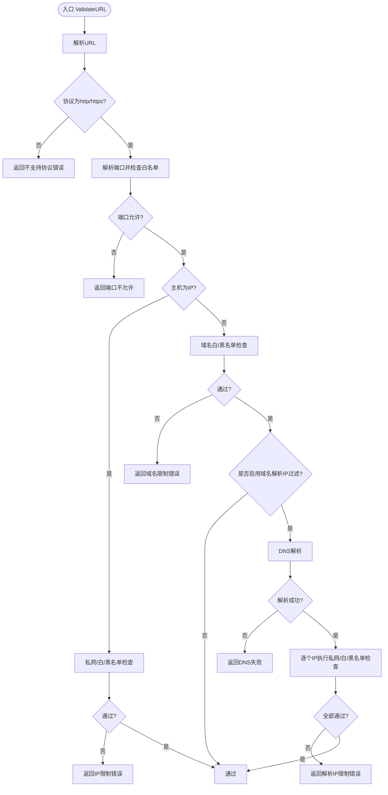
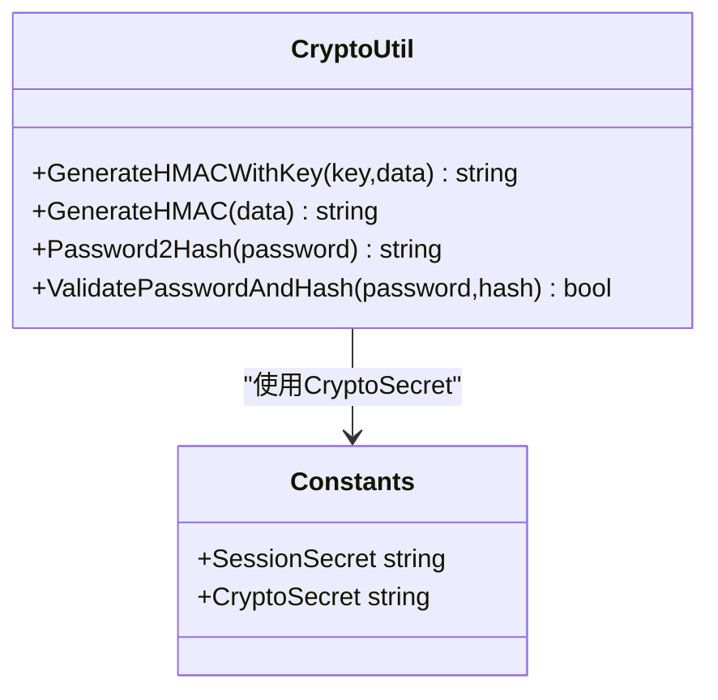
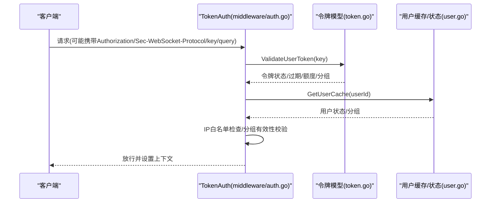
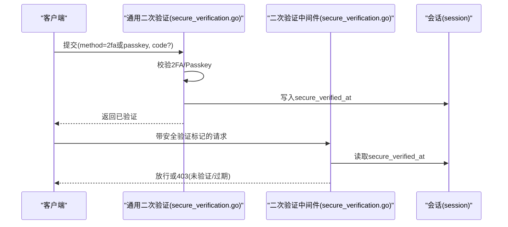
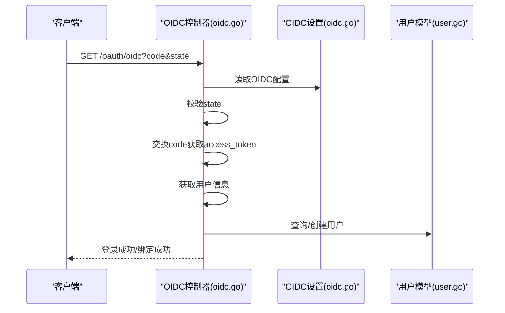
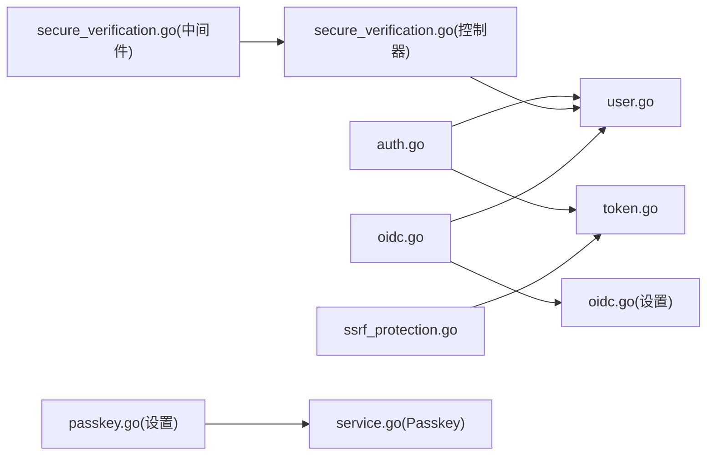

# 安全建议

<cite>
**本文引用的文件**
- [ssrf_protection.go](file://common/ssrf_protection.go)
- [crypto.go](file://common/crypto.go)
- [auth.go](file://middleware/auth.go)
- [secure_verification.go](file://controller/secure_verification.go)
- [secure_verification.go](file://middleware/secure_verification.go)
- [oidc.go](file://controller/oidc.go)
- [oidc.go](file://setting/system_setting/oidc.go)
- [passkey.go](file://setting/system_setting/passkey.go)
- [service.go](file://service/passkey/service.go)
- [token.go](file://model/token.go)
- [constants.go](file://common/constants.go)
- [config.go](file://setting/config/config.go)
- [twofa.go](file://controller/twofa.go)
- [user.go](file://model/user.go)
- [.env.example](file://.env.example)
</cite>

## 目录
1. [引言](#引言)
2. [项目结构](#项目结构)
3. [核心组件](#核心组件)
4. [架构总览](#架构总览)
5. [详细组件分析](#详细组件分析)
6. [依赖关系分析](#依赖关系分析)
7. [性能与安全特性](#性能与安全特性)
8. [故障排查指南](#故障排查指南)
9. [结论](#结论)
10. [附录](#附录)

## 引言
本文件面向开发与运维人员，系统性梳理 new-api 的安全防护机制，重点覆盖以下方面：
- SSRF 防护：请求目标验证、协议限制与域名/IP白黑名单策略
- 加密与密钥管理：HMAC 与密码哈希、密钥生成与轮换建议
- 认证与授权：JWT/访问令牌、用户令牌校验、权限分级与二次验证
- OIDC 集成：安全配置要点与回调校验
- 环境变量与敏感信息保护：配置加载与安全存储
- 定期轮换策略：API 密钥与系统密钥的周期性更新建议
- 安全审计清单与常见漏洞防范

## 项目结构
围绕安全主题，涉及的关键目录与文件如下：
- common：通用安全工具（SSRF、加密、常量等）
- middleware：认证中间件与二次验证中间件
- controller：通用二次验证接口、OIDC 登录/绑定、2FA 管理
- model：令牌模型与用户模型（含令牌校验、用户状态）
- setting/system_setting：OIDC、Passkey 系统配置
- service/passkey：Passkey WebAuthn 配置与安全参数
- setting/config：统一配置管理（用于持久化系统设置）

图表来源
- [ssrf_protection.go](file://common/ssrf_protection.go#L1-L328)
- [crypto.go](file://common/crypto.go#L1-L33)
- [auth.go](file://middleware/auth.go#L1-L322)
- [secure_verification.go](file://controller/secure_verification.go#L1-L315)
- [secure_verification.go](file://middleware/secure_verification.go#L1-L132)
- [twofa.go](file://controller/twofa.go#L1-L555)
- [oidc.go](file://controller/oidc.go#L1-L229)
- [oidc.go](file://setting/system_setting/oidc.go#L1-L26)
- [passkey.go](file://setting/system_setting/passkey.go#L1-L51)
- [service.go](file://service/passkey/service.go#L1-L178)
- [token.go](file://model/token.go#L1-L366)
- [user.go](file://model/user.go#L1-L932)
- [config.go](file://setting/config/config.go#L1-L288)

章节来源
- [ssrf_protection.go](file://common/ssrf_protection.go#L1-L328)
- [auth.go](file://middleware/auth.go#L1-L322)
- [secure_verification.go](file://controller/secure_verification.go#L1-L315)
- [secure_verification.go](file://middleware/secure_verification.go#L1-L132)
- [oidc.go](file://controller/oidc.go#L1-L229)
- [oidc.go](file://setting/system_setting/oidc.go#L1-L26)
- [passkey.go](file://setting/system_setting/passkey.go#L1-L51)
- [service.go](file://service/passkey/service.go#L1-L178)
- [token.go](file://model/token.go#L1-L366)
- [user.go](file://model/user.go#L1-L932)
- [config.go](file://setting/config/config.go#L1-L288)

## 核心组件
- SSRF 防护：统一的 SSRFProtection 结构体与 ValidateURL 方法，支持协议限制、端口白名单、域名/IP白黑名单、可选对域名解析后的 IP 再过滤
- 加密与密钥：HMAC 与 bcrypt 密码哈希；系统密钥（Session/Crypto）由常量生成
- 认证与授权：基于会话与访问令牌的用户认证，令牌校验与用户状态检查，权限分级（访客/普通/管理员/根）
- 二次验证：通用二次验证接口与 Passkey 验证流程，结合会话超时控制
- OIDC 集成：回调参数校验、用户信息获取、自动注册与登录
- 配置管理：统一配置注册、持久化与导出，支持系统设置（OIDC、Passkey）

章节来源
- [ssrf_protection.go](file://common/ssrf_protection.go#L1-L328)
- [crypto.go](file://common/crypto.go#L1-L33)
- [auth.go](file://middleware/auth.go#L1-L322)
- [secure_verification.go](file://controller/secure_verification.go#L1-L315)
- [secure_verification.go](file://middleware/secure_verification.go#L1-L132)
- [oidc.go](file://controller/oidc.go#L1-L229)
- [oidc.go](file://setting/system_setting/oidc.go#L1-L26)
- [passkey.go](file://setting/system_setting/passkey.go#L1-L51)
- [service.go](file://service/passkey/service.go#L1-L178)
- [token.go](file://model/token.go#L1-L366)
- [user.go](file://model/user.go#L1-L932)
- [config.go](file://setting/config/config.go#L1-L288)

## 架构总览
下图展示了安全相关组件之间的交互关系与数据流。

图表来源
- [auth.go](file://middleware/auth.go#L1-L322)
- [token.go](file://model/token.go#L1-L366)
- [user.go](file://model/user.go#L1-L932)
- [ssrf_protection.go](file://common/ssrf_protection.go#L1-L328)
- [oidc.go](file://controller/oidc.go#L1-L229)
- [oidc.go](file://setting/system_setting/oidc.go#L1-L26)
- [secure_verification.go](file://middleware/secure_verification.go#L1-L132)
- [secure_verification.go](file://controller/secure_verification.go#L1-L315)

## 详细组件分析

### SSRF 防护：ssrf_protection.go
- 设计要点
  - 协议限制：仅允许 http/https
  - 端口白名单：支持单端口与端口范围
  - 域名过滤：支持白名单/黑名单模式，支持通配符
  - IP 过滤：支持 CIDR 与单 IP，支持私网地址开关
  - 可选域名解析后 IP 再过滤：避免 DNS 重绑定风险
- 关键流程
  - 解析 URL -> 校验协议 -> 解析端口 -> 端口白名单 -> 主机为 IP 则直接 IP 过滤 -> 否则域名白/黑名单 -> 如启用域名解析 IP 过滤则执行 DNS 解析再逐个 IP 过滤
- 复杂度与性能
  - 时间复杂度近似 O(N)，N 为域名/IP 列表长度；DNS 解析为额外开销
  - 建议：域名/IP 列表尽量精简，必要时启用 ApplyIPFilterForDomain 以降低内部网络暴露风险

图表来源
- [ssrf_protection.go](file://common/ssrf_protection.go#L223-L302)

章节来源
- [ssrf_protection.go](file://common/ssrf_protection.go#L1-L328)

### 加密与密钥管理：crypto.go 与 constants.go
- HMAC 应用
  - GenerateHMACWithKey：对任意数据生成 HMAC-SHA256 并十六进制编码
  - GenerateHMAC：使用系统密钥（CryptoSecret）生成 HMAC
  - 用途：令牌签名、防篡改校验、日志签名等
- 密码哈希
  - Password2Hash：bcrypt 哈希
  - ValidatePasswordAndHash：bcrypt 校验
  - 用途：用户密码存储与校验
- 系统密钥
  - SessionSecret、CryptoSecret 由 UUID 生成，建议部署时替换为强随机值
- 最佳实践
  - 密钥轮换：定期更换 SessionSecret/CryptoSecret，并同步更新环境变量
  - 存储：密钥仅在内存中使用，避免写入日志或持久化
  - 传输：通过 HTTPS 与安全通道下发密钥

图表来源
- [crypto.go](file://common/crypto.go#L1-L33)
- [constants.go](file://common/constants.go#L1-L208)

章节来源
- [crypto.go](file://common/crypto.go#L1-L33)
- [constants.go](file://common/constants.go#L1-L208)

### 认证与授权：middleware/auth.go 与 model/token.go
- 会话与访问令牌
  - 会话中读取 username/role/id/status
  - 若无会话，尝试 Authorization 头中的访问令牌
  - 校验用户状态与角色，设置上下文
- 用户令牌校验
  - TokenAuth：从多种头部/路径提取令牌，校验令牌状态、过期、额度、IP 白名单
  - 用户状态与分组比对、额度扣减上下文设置
- 权限分级
  - RoleGuestUser/RoleCommonUser/RoleAdminUser/RoleRootUser
  - UserAuth/AdminAuth/RootAuth 三类路由保护
- 令牌模型
  - Key、Status、ExpiredTime、RemainQuota、UnlimitedQuota、AllowIps、Group、CrossGroupRetry 等
  - GetIpLimitsMap：解析 AllowIps 为映射，用于快速匹配

图表来源
- [auth.go](file://middleware/auth.go#L179-L322)
- [token.go](file://model/token.go#L1-L366)
- [user.go](file://model/user.go#L1-L932)

章节来源
- [auth.go](file://middleware/auth.go#L1-L322)
- [token.go](file://model/token.go#L1-L366)
- [user.go](file://model/user.go#L1-L932)

### 二次验证：controller/secure_verification.go 与 middleware/secure_verification.go
- 通用二次验证
  - 支持 2FA 与 Passkey 两种方式
  - 成功后在会话中记录时间戳，有效期 300 秒
  - 提供状态查询与过期清理
- Passkey 验证
  - 与 Passkey 服务层配合，完成 begin/finish 流程
  - 成功后设置会话并记录日志
- 中间件二次验证
  - SecureVerificationRequired：强制要求已验证
  - OptionalSecureVerification：可选检查并在上下文中设置标记
  - ClearSecureVerification：登出或强制重新验证时清除

图表来源
- [secure_verification.go](file://controller/secure_verification.go#L1-L315)
- [secure_verification.go](file://middleware/secure_verification.go#L1-L132)

章节来源
- [secure_verification.go](file://controller/secure_verification.go#L1-L315)
- [secure_verification.go](file://middleware/secure_verification.go#L1-L132)

### OIDC 集成：controller/oidc.go 与 setting/system_setting/oidc.go
- 安全要点
  - 回调参数校验：state 必须与会话一致
  - 令牌交换与用户信息获取：严格检查响应与状态码
  - 自动注册：当未绑定且允许注册时自动创建用户
  - 用户状态检查：封禁用户禁止登录
- 配置管理
  - OIDCSettings：ClientId、ClientSecret、WellKnown、Endpoints
  - 通过配置管理器注册与持久化

图表来源
- [oidc.go](file://controller/oidc.go#L1-L229)
- [oidc.go](file://setting/system_setting/oidc.go#L1-L26)
- [user.go](file://model/user.go#L1-L932)

章节来源
- [oidc.go](file://controller/oidc.go#L1-L229)
- [oidc.go](file://setting/system_setting/oidc.go#L1-L26)
- [user.go](file://model/user.go#L1-L932)

### Passkey 安全配置：setting/system_setting/passkey.go 与 service/passkey/service.go
- 安全参数
  - RPDisplayName/RPID/Origins/UserVerification/AttachmentPreference
  - Origins 与 RPID 推导：优先显式配置，否则从 ServerAddress 推导
  - 不安全 Origin 限制：默认不允许 http://，除非明确允许
- WebAuthn 配置
  - 居民密钥必需、用户验证偏好、超时控制
  - 会话键管理：注册/登录/验证三类会话键

章节来源
- [passkey.go](file://setting/system_setting/passkey.go#L1-L51)
- [service.go](file://service/passkey/service.go#L1-L178)

### 环境变量与敏感信息保护
- 环境变量读取
  - GetEnvOrDefault/GetEnvOrDefaultString/GetEnvOrDefaultBool：统一读取与默认值处理
- 配置持久化
  - ConfigManager：注册配置模块、导出/导入、保存/加载
- 建议
  - 将敏感配置（如 OIDC ClientSecret、Passkey RPID/Origins）通过配置管理器持久化，避免硬编码
  - 使用只读权限的配置文件与最小权限的运行账户

章节来源
- [env.go](file://common/env.go#L1-L39)
- [config.go](file://setting/config/config.go#L1-L288)

## 依赖关系分析
- 组件耦合
  - 认证中间件依赖令牌模型与用户模型，用于令牌校验与用户状态
  - 二次验证控制器依赖用户模型与会话，中间件依赖会话
  - OIDC 控制器依赖 OIDC 设置与用户模型
  - SSRF 防护独立于业务逻辑，可被各上游调用
- 外部依赖
  - WebAuthn 库用于 Passkey
  - HTTP 客户端用于 OIDC 令牌交换与用户信息获取
- 循环依赖
  - 当前文件未见循环导入；若新增文件需注意避免双向依赖

图表来源
- [auth.go](file://middleware/auth.go#L1-L322)
- [token.go](file://model/token.go#L1-L366)
- [user.go](file://model/user.go#L1-L932)
- [secure_verification.go](file://controller/secure_verification.go#L1-L315)
- [secure_verification.go](file://middleware/secure_verification.go#L1-L132)
- [oidc.go](file://controller/oidc.go#L1-L229)
- [oidc.go](file://setting/system_setting/oidc.go#L1-L26)
- [passkey.go](file://setting/system_setting/passkey.go#L1-L51)
- [service.go](file://service/passkey/service.go#L1-L178)
- [ssrf_protection.go](file://common/ssrf_protection.go#L1-L328)

## 性能与安全特性
- SSRF 防护
  - 建议：对域名/IP 列表进行缓存与去重；必要时启用域名解析 IP 过滤
- 认证与授权
  - 建议：对高危操作增加二次验证；令牌额度与过期检查应尽早失败
- 2FA 与 Passkey
  - 建议：强制启用用户验证；Passkey 仅允许 HTTPS Origin
- OIDC
  - 建议：严格校验 state；限制回调域；定期轮换 ClientSecret

[本节为通用指导，无需特定文件来源]

## 故障排查指南
- SSRF 防护
  - 现象：请求被拒绝
  - 排查：确认协议为 http/https；检查端口是否在白名单；域名/IP 是否在白/黑名单；是否启用域名解析 IP 过滤
- 认证失败
  - 现象：401/403
  - 排查：Authorization/New-Api-User 是否正确；访问令牌是否有效；用户状态是否启用；令牌是否过期/额度耗尽；IP 是否在 AllowIps
- 二次验证
  - 现象：403 需要安全验证
  - 排查：是否已通过 2FA/Passkey；会话是否过期；SecureVerificationSessionKey 是否存在
- OIDC
  - 现象：回调失败/无法获取用户信息
  - 排查：state 是否一致；TokenEndpoint/UserInfoEndpoint 是否可达；ClientSecret 是否正确；回调地址是否匹配

章节来源
- [ssrf_protection.go](file://common/ssrf_protection.go#L223-L302)
- [auth.go](file://middleware/auth.go#L1-L322)
- [secure_verification.go](file://controller/secure_verification.go#L1-L315)
- [secure_verification.go](file://middleware/secure_verification.go#L1-L132)
- [oidc.go](file://controller/oidc.go#L1-L229)

## 结论
new-api 在 SSRF 防护、加密与密钥管理、认证授权、二次验证、OIDC 集成等方面提供了较为完善的基础设施。建议在生产环境中：
- 严格启用 SSRF 防护策略，最小化域名/IP 白名单
- 强制启用二次验证，尤其是高危操作
- 严格配置 OIDC 与 Passkey，确保 HTTPS 与安全 Origin
- 建立密钥与 API 密钥的定期轮换流程
- 使用配置管理器集中管理敏感设置

[本节为总结，无需特定文件来源]

## 附录

### 安全审计检查清单
- SSRF 防护
  - 是否启用 SSRF 防护
  - 协议是否仅允许 http/https
  - 端口白名单是否最小化
  - 域名/IP 白名单是否按需配置
  - 是否启用域名解析 IP 过滤
- 加密与密钥
  - SessionSecret/CryptoSecret 是否已轮换
  - 密钥是否仅在内存中使用
  - 是否使用 bcrypt 存储密码
- 认证与授权
  - 是否对高危路由启用 User/Auth/Admin/Root 保护
  - 令牌是否检查过期/额度/IP 白名单
  - 用户状态是否启用
- 二次验证
  - 是否对高危操作启用 SecureVerificationRequired
  - 会话超时是否合理
- OIDC/Passkey
  - 是否启用用户验证
  - 是否仅允许 HTTPS Origin
  - ClientSecret 是否安全存储
- 配置管理
  - 敏感配置是否通过配置管理器持久化
  - 是否限制配置导出敏感字段

[本节为通用指导，无需特定文件来源]

### 常见漏洞与防范
- SSRF
  - 防范：协议限制、端口白名单、域名/IP 白名单、DNS 解析 IP 再过滤
- 令牌泄露
  - 防范：最小权限令牌、定期轮换、额度与过期控制、IP 白名单
- 会话劫持
  - 防范：HTTPS、安全 Cookie、短会话、二次验证
- OIDC 回调劫持
  - 防范：state 校验、回调域白名单、ClientSecret 保密
- 密钥泄露
  - 防范：密钥轮换、最小权限、只在内存使用、不落盘

[本节为通用指导，无需特定文件来源]

### 定期轮换策略建议
- API 密钥
  - 周期：每 90 天轮换一次
  - 流程：生成新密钥、切换流量、停用旧密钥、清理历史
- 系统密钥
  - 周期：每 180 天轮换一次
  - 流程：生成新密钥、更新环境变量、重启服务、验证功能
- OIDC ClientSecret
  - 周期：每 90 天轮换一次
  - 流程：在 OIDC 提供方更新密钥、更新配置、验证登录

[本节为通用指导，无需特定文件来源]