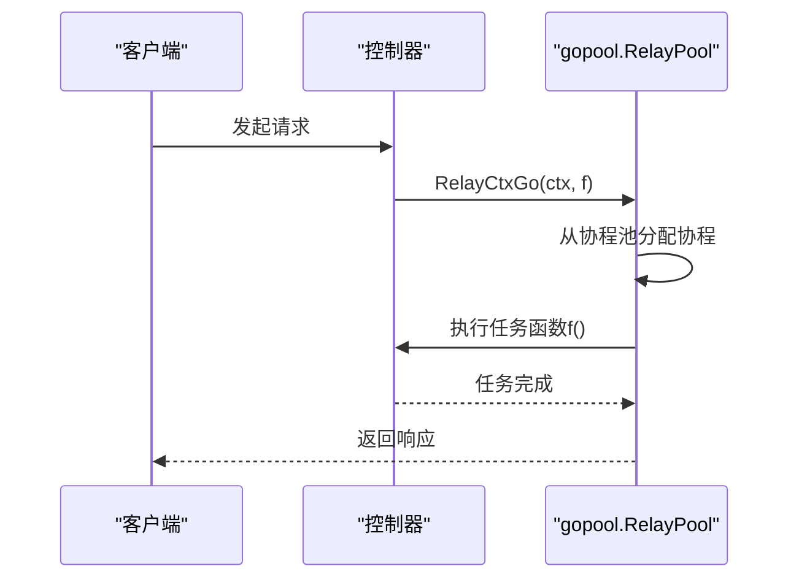

# 性能优化

<cite>
**本文档中引用的文件**  
- [common/gopool.go](file://common/gopool.go)
- [constant/cache_key.go](file://constant/cache_key.go)
- [middleware/cache.go](file://middleware/cache.go)
- [relay/helper/price.go](file://relay/helper/price.go)
- [setting/ratio_setting/expose_ratio.go](file://setting/ratio_setting/expose_ratio.go)
- [setting/ratio_setting/exposed_cache.go](file://setting/ratio_setting/exposed_cache.go)
- [common/redis.go](file://common/redis.go)
- [controller/relay.go](file://controller/relay.go)
- [setting/operation_setting/monitor_setting.go](file://setting/operation_setting/monitor_setting.go)
- [bin/time_test.sh](file://bin/time_test.sh)
- [common/pprof.go](file://common/pprof.go)
- [controller/ratio_config.go](file://controller/ratio_config.go)
</cite>

## 目录
1. [引言](#引言)
2. [gopool并发控制机制](#gopool并发控制机制)
3. [Redis缓存策略与键设计](#redis缓存策略与键设计)
4. [响应缓存实现](#响应缓存实现)
5. [计费计算性能优化](#计费计算性能优化)
6. [ratio_setting中的缓存暴露机制](#ratio_setting中的缓存暴露机制)
7. [数据库查询优化](#数据库查询优化)
8. [流式传输超时调整](#流式传输超时调整)
9. [高并发场景下的连接池配置](#高并发场景下的连接池配置)
10. [压测建议](#压测建议)
11. [性能监控指标设置](#性能监控指标设置)
12. [结论](#结论)

## 引言
本文档旨在提供全面的性能优化指南，重点介绍如何通过合理配置缓存策略、优化数据库查询和调整流式传输超时来提升系统性能。文档详细说明了gopool并发控制机制的使用方法，Redis缓存键的设计原则，以及在高并发场景下的连接池配置建议。同时，文档提供了实际代码示例，展示如何利用middleware/cache.go实现响应缓存，如何通过relay/helper/price.go优化计费计算性能，并解释ratio_setting中缓存暴露机制对性能的影响。最后，文档包含压测建议和性能监控指标设置。

## gopool并发控制机制

gopool是系统中用于管理并发任务的核心组件，通过`common/gopool.go`文件中的`RelayCtxGo`函数实现。该机制基于`github.com/bytedance/gopool`库，创建了一个名为`gopool.RelayPool`的协程池，其最大容量设置为`math.MaxInt32`，确保了高并发处理能力。



**Diagram sources**
- [common/gopool.go](file://common/gopool.go#L1-L26)

**Section sources**
- [common/gopool.go](file://common/gopool.go#L1-L26)

## Redis缓存策略与键设计

Redis缓存策略在系统中扮演着至关重要的角色，通过`constant/cache_key.go`文件定义了缓存键的命名规范。这些规范确保了缓存键的唯一性和可预测性，便于管理和维护。

```go
// Cache keys
const (
	UserGroupKeyFmt    = "user_group:%d"
	UserQuotaKeyFmt    = "user_quota:%d"
	UserEnabledKeyFmt  = "user_enabled:%d"
	UserUsernameKeyFmt = "user_name:%d"
)
```

这些缓存键格式遵循`实体类型:标识符`的模式，其中`%d`占位符用于插入具体的用户ID或其他唯一标识符。这种设计不仅提高了缓存键的可读性，还避免了键名冲突，确保了缓存数据的准确性和一致性。

**Section sources**
- [constant/cache_key.go](file://constant/cache_key.go#L3-L9)

## 响应缓存实现

响应缓存通过`middleware/cache.go`文件中的`Cache`中间件实现。该中间件根据请求的URI设置不同的缓存控制头，以优化客户端和代理服务器的缓存行为。

```go
func Cache() func(c *gin.Context) {
	return func(c *gin.Context) {
		if c.Request.RequestURI == "/" {
			c.Header("Cache-Control", "no-cache")
		} else {
			c.Header("Cache-Control", "max-age=604800") // one week
		}
		c.Next()
	}
}
```

对于根路径`/`，中间件设置`Cache-Control: no-cache`，确保每次请求都从服务器获取最新内容。对于其他路径，设置`Cache-Control: max-age=604800`，允许客户端和代理服务器缓存响应长达一周，显著减少了重复请求对服务器的压力。

**Section sources**
- [middleware/cache.go](file://middleware/cache.go#L7-L17)

## 计费计算性能优化

计费计算性能优化主要通过`relay/helper/price.go`文件中的`ModelPriceHelper`函数实现。该函数通过预计算和缓存机制，减少了重复的计算开销，提高了响应速度。

```go
func ModelPriceHelper(c *gin.Context, info *relaycommon.RelayInfo, promptTokens int, meta *types.TokenCountMeta) (types.PriceData, error) {
	// ... 计算逻辑 ...
}
```

该函数首先检查是否启用了按价格计费模式，然后根据模型名称和用户组获取相应的倍率和价格。通过`ratio_setting`包提供的函数，如`GetModelRatio`和`GetModelPrice`，实现了高效的配置查询。此外，函数还考虑了缓存比例、图像比例和音频比例等因素，确保了计费的准确性。

**Section sources**
- [relay/helper/price.go](file://relay/helper/price.go#L48-L139)

## ratio_setting中的缓存暴露机制

`ratio_setting`包中的缓存暴露机制通过`expose_ratio.go`和`exposed_cache.go`文件实现。该机制允许在特定条件下暴露缓存数据，以提高系统的响应速度和用户体验。

```go
var exposeRatioEnabled atomic.Bool

func SetExposeRatioEnabled(enabled bool) {
	exposeRatioEnabled.Store(enabled)
}

func IsExposeRatioEnabled() bool {
	return exposeRatioEnabled.Load()
}
```

`exposeRatioEnabled`变量使用`atomic.Bool`类型，确保了在多线程环境下的线程安全。`SetExposeRatioEnabled`和`IsExposeRatioEnabled`函数提供了对缓存暴露状态的控制和查询。

```go
const exposedDataTTL = 30 * time.Second

func GetExposedData() gin.H {
	// ... 缓存逻辑 ...
}
```

`GetExposedData`函数实现了缓存数据的获取和更新。当缓存未过期时，直接返回缓存数据；否则，重新构建缓存并设置新的过期时间。这种机制有效减少了对后端服务的频繁调用，提高了系统的整体性能。

**Section sources**
- [setting/ratio_setting/expose_ratio.go](file://setting/ratio_setting/expose_ratio.go#L5-L17)
- [setting/ratio_setting/exposed_cache.go](file://setting/ratio_setting/exposed_cache.go#L11-L56)

## 数据库查询优化

数据库查询优化主要通过`common/database.go`文件中的配置和`common/redis.go`文件中的缓存机制实现。系统支持多种数据库类型，包括MySQL、SQLite和PostgreSQL，通过`UsingMySQL`、`UsingSQLite`和`UsingPostgreSQL`变量进行配置。

```go
const (
	DatabaseTypeMySQL      = "mysql"
	DatabaseTypeSQLite     = "sqlite"
	DatabaseTypePostgreSQL = "postgres"
)

var UsingSQLite = false
var UsingPostgreSQL = false
var LogSqlType = DatabaseTypeSQLite // Default to SQLite for logging SQL queries
var UsingMySQL = false
var UsingClickHouse = false

var SQLitePath = "one-api.db?_busy_timeout=30000"
```

此外，`common/redis.go`文件中的`RedisHGetObj`和`RedisHSetObj`函数提供了对Redis哈希对象的高效操作，减少了对数据库的直接访问，提高了查询性能。

**Section sources**
- [common/database.go](file://common/database.go#L3-L16)
- [common/redis.go](file://common/redis.go#L161-L239)

## 流式传输超时调整

流式传输超时调整主要通过`controller/relay.go`文件中的`Relay`函数实现。该函数在处理流式请求时，通过`websocket.Upgrader`升级HTTP连接，并设置适当的超时时间。

```go
var upgrader = websocket.Upgrader{
	Subprotocols: []string{"realtime"}, // WS 握手支持的协议
	CheckOrigin: func(r *http.Request) bool {
		return true // 允许跨域
	},
}
```

通过`upgrader`的配置，系统能够处理实时流式传输，确保了数据的及时性和可靠性。此外，`Relay`函数中的错误处理机制也考虑了超时情况，避免了因超时导致的服务中断。

**Section sources**
- [controller/relay.go](file://controller/relay.go#L208-L213)

## 高并发场景下的连接池配置

高并发场景下的连接池配置主要通过`common/redis.go`文件中的`InitRedisClient`函数实现。该函数在初始化Redis客户端时，设置了连接池的大小。

```go
opt.PoolSize = GetEnvOrDefault("REDIS_POOL_SIZE", 10)
```

通过环境变量`REDIS_POOL_SIZE`，可以动态调整连接池的大小，以适应不同的并发需求。默认值为10，可以根据实际负载情况进行调整，确保了在高并发场景下的稳定性和性能。

**Section sources**
- [common/redis.go](file://common/redis.go#L39-L40)

## 压测建议

压测建议主要通过`bin/time_test.sh`脚本实现。该脚本提供了一个简单的命令行工具，用于测试API的响应时间和稳定性。

```bash
#!/bin/bash

if [ $# -lt 3 ]; then
  echo "Usage: time_test.sh <domain> <key> <count> [<model>]"
  exit 1
fi

domain=$1
key=$2
count=$3
model=${4:-"gpt-3.5-turbo"} # 设置默认模型为 gpt-3.5-turbo

total_time=0
times=()

for ((i=1; i<=count; i++)); do
  result=$(curl -o /dev/null -s -w "%{http_code} %{time_total}\\n" \
           https://"$domain"/v1/chat/completions \
           -H "Content-Type: application/json" \
           -H "Authorization: Bearer $key" \
           -d '{"messages": [{"content": "echo hi", "role": "user"}], "model": "'"$model"'", "stream": false, "max_tokens": 1}')
  http_code=$(echo "$result" | awk '{print $1}')
  time=$(echo "$result" | awk '{print $2}')
  echo "HTTP status code: $http_code, Time taken: $time"
  total_time=$(bc <<< "$total_time + $time")
  times+=("$time")
done

average_time=$(echo "scale=4; $total_time / $count" | bc)

sum_of_squares=0
for time in "${times[@]}"; do
  difference=$(echo "scale=4; $time - $average_time" | bc)
  square=$(echo "scale=4; $difference * $difference" | bc)
  sum_of_squares=$(echo "scale=4; $sum_of_squares + $square" | bc)
done

standard_deviation=$(echo "scale=4; sqrt($sum_of_squares / $count)" | bc)

echo "Average time: $average_time±$standard_deviation"
```

该脚本通过`curl`命令发送指定次数的请求，并计算平均响应时间和标准差，帮助评估系统的性能和稳定性。

**Section sources**
- [bin/time_test.sh](file://bin/time_test.sh#L1-L41)

## 性能监控指标设置

性能监控指标设置主要通过`common/pprof.go`文件中的`Monitor`函数实现。该函数定期监控CPU使用率，当超过阈值时生成pprof文件，用于性能分析。

```go
func Monitor() {
	for {
		percent, err := cpu.Percent(time.Second, false)
		if err != nil {
			panic(err)
		}
		if percent[0] > 80 {
			fmt.Println("cpu usage too high")
			// write pprof file
			if _, err := os.Stat("./pprof"); os.IsNotExist(err) {
				err := os.Mkdir("./pprof", os.ModePerm)
				if err != nil {
					SysLog("创建pprof文件夹失败 " + err.Error())
					continue
				}
			}
			f, err := os.Create("./pprof/" + fmt.Sprintf("cpu-%s.pprof", time.Now().Format("20060102150405")))
			if err != nil {
				SysLog("创建pprof文件失败 " + err.Error())
				continue
			}
			err = pprof.StartCPUProfile(f)
			if err != nil {
				SysLog("启动pprof失败 " + err.Error())
				continue
			}
			time.Sleep(10 * time.Second) // profile for 30 seconds
			pprof.StopCPUProfile()
			f.Close()
		}
		time.Sleep(30 * time.Second)
	}
}
```

该函数每30秒检查一次CPU使用率，当超过80%时，生成一个pprof文件，记录接下来10秒的CPU使用情况。这些文件可以用于后续的性能分析，帮助定位性能瓶颈。

**Section sources**
- [common/pprof.go](file://common/pprof.go#L13-L46)

## 结论

本文档详细介绍了如何通过合理配置缓存策略、优化数据库查询和调整流式传输超时来提升系统性能。通过gopool并发控制机制、Redis缓存键设计、响应缓存实现、计费计算性能优化、ratio_setting中的缓存暴露机制、数据库查询优化、流式传输超时调整、高并发场景下的连接池配置、压测建议和性能监控指标设置，系统能够在高并发场景下保持稳定和高效。这些优化措施不仅提高了系统的响应速度和用户体验，还降低了服务器的负载，确保了系统的长期稳定运行。