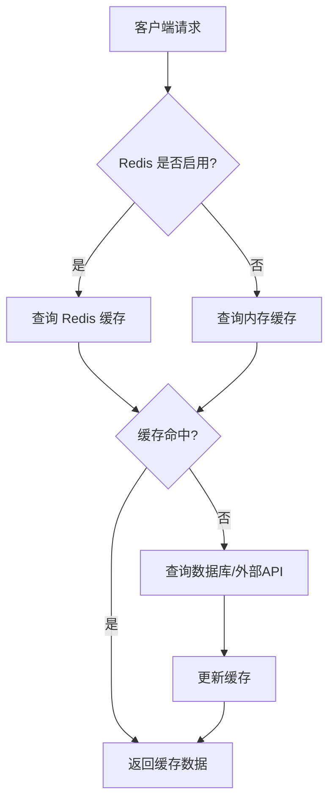
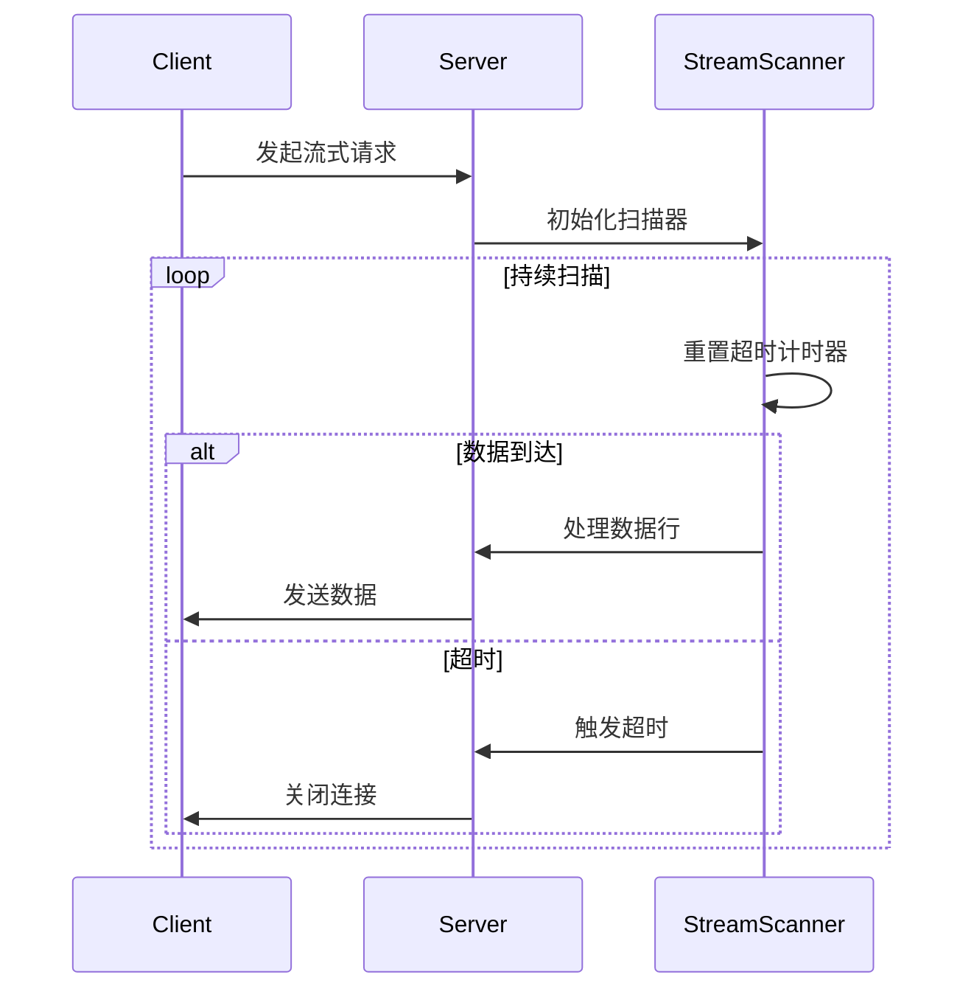
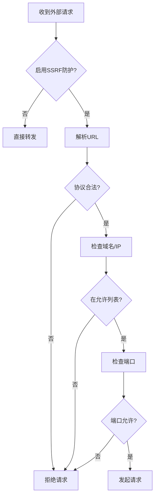
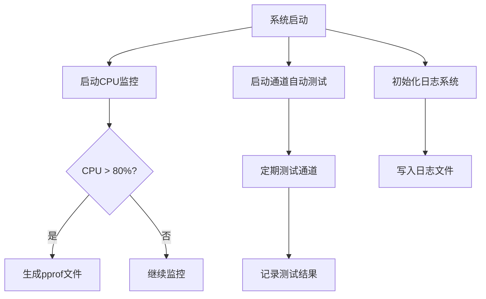

# 最佳实践

<cite>
**本文档中引用的文件**  
- [main.go](file://main.go)
- [config.go](file://setting/config/config.go)
- [env.go](file://common/env.go)
- [redis.go](file://common/redis.go)
- [database.go](file://common/database.go)
- [cache.go](file://middleware/cache.go)
- [rate-limit.go](file://middleware/rate-limit.go)
- [auth.go](file://middleware/auth.go)
- [ssrf_protection.go](file://common/ssrf_protection.go)
- [pprof.go](file://common/pprof.go)
- [logger.go](file://logger/logger.go)
- [monitor_setting.go](file://setting/operation_setting/monitor_setting.go)
- [stream_scanner.go](file://relay/helper/stream_scanner.go)
</cite>

## 目录
1. [引言](#引言)
2. [性能优化](#性能优化)
3. [安全建议](#安全建议)
4. [运维指南](#运维指南)
5. [生产部署经验](#生产部署经验)
6. [结论](#结论)

## 引言

本最佳实践文档旨在为 `new-api` 项目的部署和维护提供全面的指导。文档涵盖了性能优化、安全防护、系统监控和生产环境部署等关键方面，帮助运维和开发团队构建一个高效、安全、稳定的系统。

**Section sources**
- [main.go](file://main.go#L1-L261)

## 性能优化

### 缓存配置

`new-api` 项目通过 Redis 和内存缓存机制来提升系统性能。合理配置缓存可以显著减少数据库查询和外部 API 调用的延迟。

- **Redis 缓存**：项目默认使用 Redis 作为主要的缓存后端。通过设置 `REDIS_CONN_STRING` 环境变量来启用 Redis。缓存的键值过期时间由 `SYNC_FREQUENCY` 环境变量控制，默认为 60 秒。
- **内存缓存**：当 Redis 未启用时，系统会自动降级到内存缓存模式。内存缓存通过 `common.InMemoryRateLimiter` 结构体实现，适用于小型部署。

**Diagram sources**
- [redis.go](file://common/redis.go#L1-L328)
- [rate-limit.go](file://middleware/rate-limit.go#L1-L118)

**Section sources**
- [redis.go](file://common/redis.go#L1-L328)
- [rate-limit.go](file://middleware/rate-limit.go#L1-L118)

### 数据库查询优化

项目支持多种数据库后端，包括 MySQL、SQLite 和 PostgreSQL。优化数据库查询是提升性能的关键。

- **连接池**：使用 GORM 作为 ORM 框架，确保配置了适当的连接池大小，以避免连接耗尽。
- **索引**：为频繁查询的字段（如 `user_id`, `token_key`）创建数据库索引。
- **批量操作**：对于大量数据的插入或更新，使用批量操作以减少网络往返次数。

**Section sources**
- [database.go](file://common/database.go#L1-L16)

### 流式传输超时调整

对于流式响应（如 SSE），合理设置超时参数可以平衡用户体验和服务器资源消耗。

- **流式超时**：通过 `STREAMING_TIMEOUT` 环境变量设置流式传输的超时时间（单位：秒）。默认值在 `constant` 包中定义。
- **Ping 机制**：系统支持定期发送 ping 消息以保持连接活跃。此功能可通过 `operation_setting.GetGeneralSetting().PingIntervalEnabled` 控制。

**Diagram sources**
- [stream_scanner.go](file://relay/helper/stream_scanner.go#L1-L273)

**Section sources**
- [stream_scanner.go](file://relay/helper/stream_scanner.go#L1-L273)

## 安全建议

### 密钥管理

安全的密钥管理是防止未授权访问的基础。

- **环境变量存储**：所有敏感密钥（如数据库密码、Redis 连接字符串）应通过环境变量注入，避免硬编码在代码中。
- **访问令牌**：用户通过 `Authorization` 头部的 Bearer Token 进行身份验证。系统支持会话和访问令牌两种认证方式。
- **IP 限制**：令牌可以配置允许访问的 IP 地址列表，进一步限制其使用范围。

**Section sources**
- [auth.go](file://middleware/auth.go#L1-L322)
- [env.go](file://common/env.go#L1-L39)

### 防止 SSRF 攻击

服务器端请求伪造（SSRF）是云原生应用的常见威胁。`new-api` 项目内置了强大的 SSRF 防护机制。

- **IP 过滤**：默认禁止访问私有 IP 地址段（如 10.0.0.0/8, 192.168.0.0/16）。
- **域名白/黑名单**：支持配置域名白名单或黑名单，精确控制可访问的外部服务。
- **端口限制**：可以指定允许访问的端口范围，防止攻击者扫描内部服务。

**Diagram sources**
- [ssrf_protection.go](file://common/ssrf_protection.go#L1-L328)

**Section sources**
- [ssrf_protection.go](file://common/ssrf_protection.go#L1-L328)

### 认证与授权

项目实现了基于角色的访问控制（RBAC），确保用户只能访问其权限范围内的资源。

- **角色等级**：定义了 `RoleCommonUser`, `RoleAdminUser`, `RoleRootUser` 三个角色，权限逐级递增。
- **中间件**：通过 `UserAuth`, `AdminAuth`, `RootAuth` 等中间件实现不同级别的访问控制。
- **令牌分组**：支持为令牌分配分组，实现更细粒度的权限管理。

**Section sources**
- [auth.go](file://middleware/auth.go#L1-L322)

## 运维指南

### 监控系统健康状况

实时监控是保障系统稳定运行的关键。

- **CPU 监控**：当 CPU 使用率持续超过 80% 时，系统会自动触发 `pprof`，生成性能分析文件用于诊断。
- **通道测试**：系统可以配置自动测试通道的可用性，频率由 `CHANNEL_TEST_FREQUENCY` 环境变量控制。
- **日志监控**：关键操作和错误信息会被记录到日志文件中，便于追踪问题。

**Diagram sources**
- [pprof.go](file://common/pprof.go#L1-L46)
- [monitor_setting.go](file://setting/operation_setting/monitor_setting.go#L1-L36)

**Section sources**
- [pprof.go](file://common/pprof.go#L1-L46)
- [monitor_setting.go](file://setting/operation_setting/monitor_setting.go#L1-L36)

### 日志分析

有效的日志分析能快速定位问题根源。

- **日志级别**：支持 INFO, WARN, ERR, DEBUG 四个日志级别，便于过滤信息。
- **日志轮转**：当日志文件达到一定大小（`maxLogCount`）时，系统会自动创建新的日志文件。
- **日志目录**：通过 `LOG_DIR` 环境变量指定日志文件的存储目录。

**Section sources**
- [logger.go](file://logger/logger.go#L1-L161)

### 灾难恢复计划

制定完善的灾难恢复计划是生产环境的必备措施。

- **数据备份**：定期备份数据库文件（如 `one-api.db`）和配置文件。
- **配置版本控制**：将 `.env` 文件和关键配置纳入版本控制系统。
- **快速恢复**：准备部署脚本和 Docker 镜像，确保能在短时间内恢复服务。

## 生产部署经验

### 部署模式

- **Docker 部署**：推荐使用 `Dockerfile` 和 `docker-compose.yml` 进行容器化部署，确保环境一致性。
- **多节点部署**：对于高可用需求，可以部署多个实例，并通过负载均衡器分发流量。
- **环境隔离**：严格区分开发、测试和生产环境，使用不同的数据库和配置。

### 经验教训

- **资源监控**：始终监控服务器的 CPU、内存和网络带宽，避免资源耗尽导致服务中断。
- **配置管理**：复杂的配置（如分组比率、渠道设置）应通过管理界面进行，避免直接修改数据库。
- **安全审计**：定期审查日志和访问记录，及时发现异常行为。

**Section sources**
- [main.go](file://main.go#L1-L261)
- [config.go](file://setting/config/config.go#L1-L288)

## 结论

遵循本最佳实践文档中的建议，可以显著提升 `new-api` 项目的性能、安全性和稳定性。持续的监控、定期的维护和及时的更新是保障生产环境长期健康运行的关键。