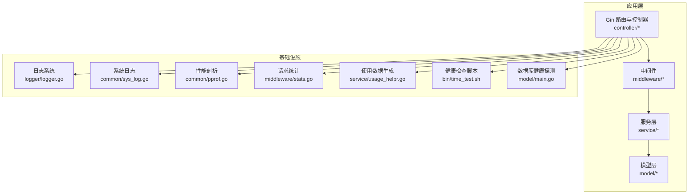
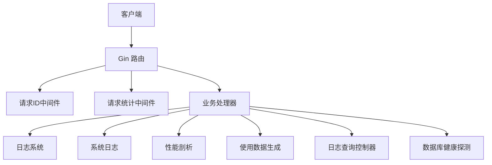
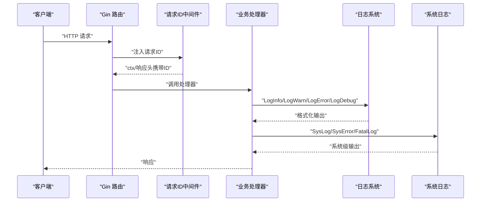
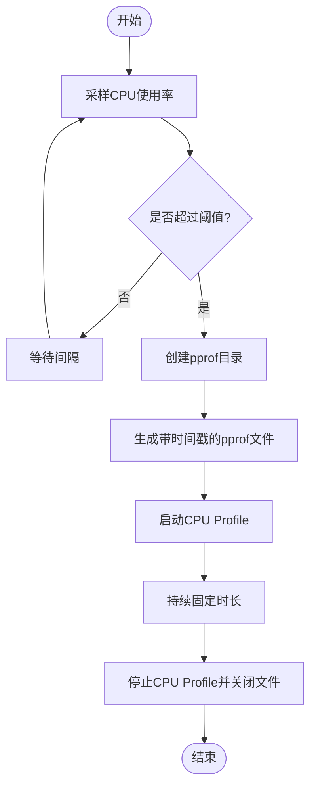
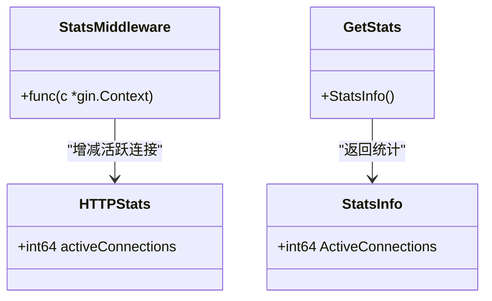
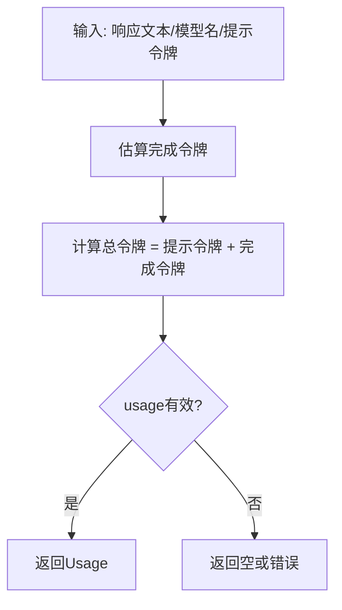
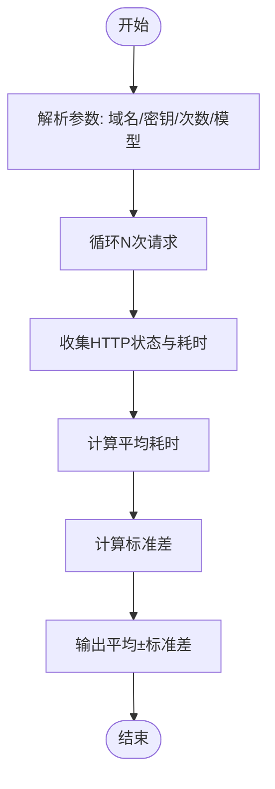
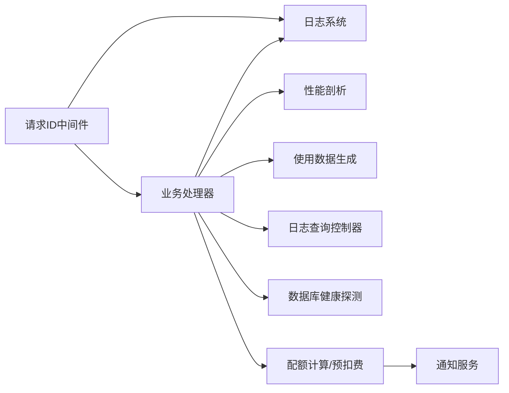

# 运维指南

<cite>
**本文引用的文件列表**
- [logger/logger.go](file://logger/logger.go)
- [common/pprof.go](file://common/pprof.go)
- [middleware/stats.go](file://middleware/stats.go)
- [service/usage_helpr.go](file://service/usage_helpr.go)
- [bin/time_test.sh](file://bin/time_test.sh)
- [middleware/request-id.go](file://middleware/request-id.go)
- [common/sys_log.go](file://common/sys_log.go)
- [controller/log.go](file://controller/log.go)
- [model/main.go](file://model/main.go)
- [common/database.go](file://common/database.go)
- [service/quota.go](file://service/quota.go)
- [service/pre_consume_quota.go](file://service/pre_consume_quota.go)
- [controller/billing.go](file://controller/billing.go)
- [service/webhook.go](file://service/webhook.go)
- [service/user_notify.go](file://service/user_notify.go)
- [controller/user.go](file://controller/user.go)
- [setting/config/config.go](file://setting/config/config.go)
- [Dockerfile](file://Dockerfile)
</cite>

## 目录
1. [简介](#简介)
2. [项目结构与入口](#项目结构与入口)
3. [核心组件与职责](#核心组件与职责)
4. [架构总览](#架构总览)
5. [详细组件分析](#详细组件分析)
6. [依赖关系分析](#依赖关系分析)
7. [性能与监控](#性能与监控)
8. [日志与排障](#日志与排障)
9. [数据库与备份恢复](#数据库与备份恢复)
10. [配额核对与异常识别](#配额核对与异常识别)
11. [健康检查与可用性保障](#健康检查与可用性保障)
12. [常见告警与响应预案](#常见告警与响应预案)
13. [结论](#结论)

## 简介
本运维指南面向系统管理员与平台工程师，围绕日志分级与请求ID追踪、性能剖析、请求统计监控、使用数据生成与配额核对、健康检查脚本、数据库备份与灾难恢复、以及常见告警响应预案等主题，提供可操作的运维实践。文档严格基于仓库源码与脚本，避免臆测，确保可落地执行。

## 项目结构与入口
- 后端服务采用 Go + Gin 框架，前端构建产物嵌入容器镜像。
- 关键运行路径：
  - 日志与系统级日志：logger/logger.go、common/sys_log.go
  - 性能剖析：common/pprof.go
  - 请求统计：middleware/stats.go
  - 使用数据生成：service/usage_helpr.go
  - 健康检查脚本：bin/time_test.sh
  - 请求ID注入：middleware/request-id.go
  - 日志查询与统计：controller/log.go
  - 数据库健康探测：model/main.go
  - 配额计算与通知：service/quota.go、service/pre_consume_quota.go、controller/billing.go
  - Webhook与通知：service/webhook.go、service/user_notify.go、controller/user.go
  - 配置管理：setting/config/config.go
  - 容器镜像：Dockerfile

**章节来源**
- [Dockerfile](file://Dockerfile#L1-L39)

## 核心组件与职责
- 日志系统：统一输出格式、级别控制、请求ID关联、日志轮转触发。
- 性能剖析：CPU使用率阈值监控，自动采集 CPU Profile。
- 请求统计：活跃连接数统计，供健康与容量评估。
- 使用数据生成：将响应文本估算为消耗令牌，辅助配额核对。
- 健康检查：批量请求压测脚本，统计平均耗时与标准差。
- 请求ID：全局注入唯一标识，贯穿日志与审计。
- 日志查询与统计：提供全量/用户日志检索与用量统计接口。
- 数据库健康：周期性 Ping，确保连接可用。
- 配额与通知：按模型/分组比率计算配额，触发多种通知渠道。
- 配置管理：集中式配置读写与导出，支持动态更新。
- 容器化：多阶段构建，产物内嵌前端静态资源。

**章节来源**
- [logger/logger.go](file://logger/logger.go#L1-L161)
- [common/pprof.go](file://common/pprof.go#L1-L46)
- [middleware/stats.go](file://middleware/stats.go#L1-L42)
- [service/usage_helpr.go](file://service/usage_helpr.go#L1-L34)
- [bin/time_test.sh](file://bin/time_test.sh#L1-L41)
- [middleware/request-id.go](file://middleware/request-id.go#L1-L20)
- [common/sys_log.go](file://common/sys_log.go#L1-L56)
- [controller/log.go](file://controller/log.go#L1-L170)
- [model/main.go](file://model/main.go#L450-L478)
- [setting/config/config.go](file://setting/config/config.go#L1-L288)

## 架构总览
下图展示日志、统计、剖析、使用数据与健康检查在系统中的交互位置。

**图表来源**
- [middleware/request-id.go](file://middleware/request-id.go#L1-L20)
- [middleware/stats.go](file://middleware/stats.go#L1-L42)
- [logger/logger.go](file://logger/logger.go#L1-L161)
- [common/sys_log.go](file://common/sys_log.go#L1-L56)
- [common/pprof.go](file://common/pprof.go#L1-L46)
- [service/usage_helpr.go](file://service/usage_helpr.go#L1-L34)
- [controller/log.go](file://controller/log.go#L1-L170)
- [model/main.go](file://model/main.go#L450-L478)

## 详细组件分析

### 日志系统与请求ID追踪（logger/logger.go、middleware/request-id.go、common/sys_log.go）
- 日志分级与输出
  - 级别常量定义：INFO、WARN、ERR、DEBUG；INFO 使用标准输出，其他级别使用错误输出。
  - 输出格式包含：级别、时间戳、请求ID、消息。
  - DEBUG 仅在调试开关开启时生效。
- 请求ID追踪
  - 中间件生成全局唯一ID，注入到上下文与响应头，便于跨组件串联日志。
- 日志轮转机制
  - 当累计日志条数超过阈值时，触发后台重建日志文件句柄，实现滚动更新。
  - 日志文件命名包含时间戳，便于归档与定位。
- 系统日志
  - 提供 SYS、FATAL 等系统级日志输出，便于启动成功、致命错误等场景记录。

**图表来源**
- [middleware/request-id.go](file://middleware/request-id.go#L1-L20)
- [logger/logger.go](file://logger/logger.go#L1-L161)
- [common/sys_log.go](file://common/sys_log.go#L1-L56)

**章节来源**
- [logger/logger.go](file://logger/logger.go#L1-L161)
- [middleware/request-id.go](file://middleware/request-id.go#L1-L20)
- [common/sys_log.go](file://common/sys_log.go#L1-L56)

### 性能剖析（common/pprof.go）
- 功能概述
  - 定时采样 CPU 使用率，超过阈值后自动生成 CPU Profile 文件，持续固定时长。
  - 生成目录与文件名包含时间戳，便于区分与归档。
- 使用建议
  - 在高负载或性能波动期启用，结合火焰图工具分析热点。
  - 注意磁盘空间与权限，确保输出目录存在且可写。

**图表来源**
- [common/pprof.go](file://common/pprof.go#L1-L46)

**章节来源**
- [common/pprof.go](file://common/pprof.go#L1-L46)

### 请求统计监控（middleware/stats.go）
- 功能概述
  - 统计活跃连接数，线程安全累加/递减，提供原子读取接口。
  - 可用于健康检查、容量规划与限流策略参考。
- 使用建议
  - 结合外部监控系统定期抓取活跃连接指标，观察峰值与均值变化趋势。

**图表来源**
- [middleware/stats.go](file://middleware/stats.go#L1-L42)

**章节来源**
- [middleware/stats.go](file://middleware/stats.go#L1-L42)

### 使用数据生成（service/usage_helpr.go）
- 功能概述
  - 将响应文本估算为完成令牌数，结合提示令牌与模型名称生成使用统计。
  - 提供有效性校验，确保统计有意义。
- 使用建议
  - 与实际计费配额对比，发现异常使用模式（如令牌估算异常偏高）。
  - 结合日志查询接口定位具体请求与用户。

**图表来源**
- [service/usage_helpr.go](file://service/usage_helpr.go#L1-L34)

**章节来源**
- [service/usage_helpr.go](file://service/usage_helpr.go#L1-L34)

### 健康检查脚本（bin/time_test.sh）
- 功能概述
  - 批量向指定域名发起请求，统计平均耗时与标准差，辅助评估稳定性与波动性。
- 使用建议
  - 在变更前后对比，关注显著波动。
  - 与日志与统计监控联动，定位异常时段。

**图表来源**
- [bin/time_test.sh](file://bin/time_test.sh#L1-L41)

**章节来源**
- [bin/time_test.sh](file://bin/time_test.sh#L1-L41)

### 日志查询与统计（controller/log.go）
- 功能概述
  - 提供全量/用户日志查询、关键词搜索、按条件聚合统计（额度、RPM、TPM）。
- 使用建议
  - 通过统计接口快速定位异常用户或模型。
  - 结合请求ID与使用数据生成结果进行交叉验证。

**章节来源**
- [controller/log.go](file://controller/log.go#L1-L170)

### 数据库健康探测（model/main.go）
- 功能概述
  - 周期性 Ping 数据库，降低重复连接开销，记录健康状态。
- 使用建议
  - 与外部监控联动，出现 Ping 失败时优先检查连接池、网络与数据库实例。

**章节来源**
- [model/main.go](file://model/main.go#L450-L478)

### 配额计算与通知（service/quota.go、service/pre_consume_quota.go、controller/billing.go）
- 功能概述
  - 按模型/分组比率计算配额，支持显示类型切换（USD/CNY/TOKENS）。
  - 预扣费前校验用户剩余额度，不足时拒绝请求并返回友好错误。
  - 支持多种通知渠道（邮件、Webhook、Bark、Gotify），按用户设置触发。
- 使用建议
  - 定期核对显示类型与汇率，确保账单一致性。
  - 配置预警阈值，提前通知用户。

**章节来源**
- [service/quota.go](file://service/quota.go#L56-L87)
- [service/pre_consume_quota.go](file://service/pre_consume_quota.go#L31-L45)
- [controller/billing.go](file://controller/billing.go#L1-L56)
- [service/webhook.go](file://service/webhook.go#L1-L59)
- [service/user_notify.go](file://service/user_notify.go#L82-L123)
- [controller/user.go](file://controller/user.go#L1134-L1199)

### 配置管理（setting/config/config.go）
- 功能概述
  - 统一注册、读取、保存配置，支持复杂类型序列化/反序列化，导出扁平键值。
- 使用建议
  - 通过数据库集中管理配置，避免硬编码；变更后及时导出校验。

**章节来源**
- [setting/config/config.go](file://setting/config/config.go#L1-L288)

## 依赖关系分析
- 日志系统依赖 Gin 默认 Writer/ErrorWriter，确保输出一致。
- 请求ID中间件依赖公共键常量，保证上下文与响应头一致。
- 性能剖析依赖 CPU 采样库，定时任务独立于业务处理。
- 请求统计中间件无外部依赖，仅维护原子计数。
- 使用数据生成依赖模型估算函数，输出 DTO。
- 日志查询控制器依赖模型层聚合统计。
- 数据库健康探测依赖底层 DB 对象。
- 配额与通知链路涉及服务层、DTO、通知服务与控制器。

**图表来源**
- [middleware/request-id.go](file://middleware/request-id.go#L1-L20)
- [logger/logger.go](file://logger/logger.go#L1-L161)
- [common/pprof.go](file://common/pprof.go#L1-L46)
- [service/usage_helpr.go](file://service/usage_helpr.go#L1-L34)
- [controller/log.go](file://controller/log.go#L1-L170)
- [model/main.go](file://model/main.go#L450-L478)
- [service/quota.go](file://service/quota.go#L56-L87)
- [service/pre_consume_quota.go](file://service/pre_consume_quota.go#L31-L45)
- [service/webhook.go](file://service/webhook.go#L1-L59)
- [service/user_notify.go](file://service/user_notify.go#L82-L123)

## 性能与监控
- CPU 分析
  - 使用性能剖析模块自动采集高负载时的 CPU Profile，结合可视化工具定位热点。
- 请求统计
  - 通过活跃连接数指标评估并发压力，结合外部监控系统建立告警阈值。
- 日志轮转
  - 当日志量达到阈值时自动重建文件句柄，避免单文件过大影响 IO。

**章节来源**
- [common/pprof.go](file://common/pprof.go#L1-L46)
- [middleware/stats.go](file://middleware/stats.go#L1-L42)
- [logger/logger.go](file://logger/logger.go#L1-L161)

## 日志与排障
- 日志分级与请求ID
  - 使用 INFO/WARN/ERR/DEBUG 级别输出，并在每条日志中附带请求ID，便于跨组件串联。
- 系统日志
  - 启动成功、致命错误等场景使用系统日志输出，便于快速定位。
- 日志查询与统计
  - 通过控制器接口检索日志与统计额度/RPM/TPM，结合使用数据生成结果进行交叉验证。
- 故障排查流程建议
  - 步骤1：确认请求ID，定位对应日志片段。
  - 步骤2：查看性能剖析文件，确认是否存在热点。
  - 步骤3：核对配额与预扣费逻辑，排除额度不足导致的失败。
  - 步步4：检查数据库健康探测与连接池状态。

**章节来源**
- [logger/logger.go](file://logger/logger.go#L1-L161)
- [common/sys_log.go](file://common/sys_log.go#L1-L56)
- [controller/log.go](file://controller/log.go#L1-L170)
- [service/usage_helpr.go](file://service/usage_helpr.go#L1-L34)

## 数据库与备份恢复
- 数据库类型与路径
  - 支持 MySQL、SQLite、PostgreSQL 等类型，SQLite 默认用于 SQL 日志记录。
  - SQLite 路径与连接参数可在配置中调整。
- 健康探测
  - 定期 Ping 数据库，记录成功日志，便于监控。
- 备份策略建议
  - MySQL/PostgreSQL：使用官方备份工具进行全量/增量备份，定期校验恢复。
  - SQLite：在容器外挂载持久卷，定期复制数据库文件。
- 灾难恢复流程
  - 步骤1：确认备份文件可用性与完整性。
  - 步骤2：停止服务，恢复数据库至目标时间点。
  - 步骤3：启动服务，执行数据库健康探测。
  - 步骤4：核对关键指标（活跃连接、日志量、配额统计）。

**章节来源**
- [common/database.go](file://common/database.go#L1-L15)
- [model/main.go](file://model/main.go#L450-L478)

## 配额核对与异常识别
- 配额计算
  - 基于模型/分组比率与令牌估算计算，支持显示类型切换。
- 预扣费
  - 发起请求前校验剩余额度，不足则拒绝并返回明确错误。
- 异常识别
  - 使用数据生成与日志统计联动，识别异常用户或模型。
  - 配置预警阈值，提前通知用户，避免欠费中断。

**章节来源**
- [service/quota.go](file://service/quota.go#L56-L87)
- [service/pre_consume_quota.go](file://service/pre_consume_quota.go#L31-L45)
- [controller/billing.go](file://controller/billing.go#L1-L56)

## 健康检查与可用性保障
- 健康检查脚本
  - 批量请求评估平均耗时与波动，辅助容量规划与回归检测。
- 数据库健康
  - 周期性 Ping，异常时触发告警。
- 外部监控
  - 结合活跃连接、日志量、CPU Profile、数据库 Ping 状态，建立综合监控面板。

**章节来源**
- [bin/time_test.sh](file://bin/time_test.sh#L1-L41)
- [model/main.go](file://model/main.go#L450-L478)

## 常见告警与响应预案
- CPU 使用率过高
  - 行动：采集 CPU Profile，定位热点；必要时扩容或优化。
- 预扣费失败（额度不足）
  - 行动：检查用户剩余额度与模型比率；提醒用户充值。
- 数据库 Ping 失败
  - 行动：检查连接池、网络与实例状态；必要时切换备用节点。
- 日志量激增
  - 行动：确认是否开启 DEBUG；检查轮转触发逻辑；必要时临时降级日志级别。
- Webhook/Bark/Gotify 通知失败
  - 行动：检查密钥与URL格式；验证签名与超时；查看通知服务日志。

**章节来源**
- [common/pprof.go](file://common/pprof.go#L1-L46)
- [service/pre_consume_quota.go](file://service/pre_consume_quota.go#L31-L45)
- [model/main.go](file://model/main.go#L450-L478)
- [service/webhook.go](file://service/webhook.go#L1-L59)
- [service/user_notify.go](file://service/user_notify.go#L82-L123)
- [controller/user.go](file://controller/user.go#L1134-L1199)

## 结论
本指南基于仓库现有代码与脚本，给出了日志、性能、统计、使用数据、健康检查、数据库与通知等运维要点。建议在生产环境中结合外部监控系统与自动化流程，形成闭环的可观测性与应急响应体系。