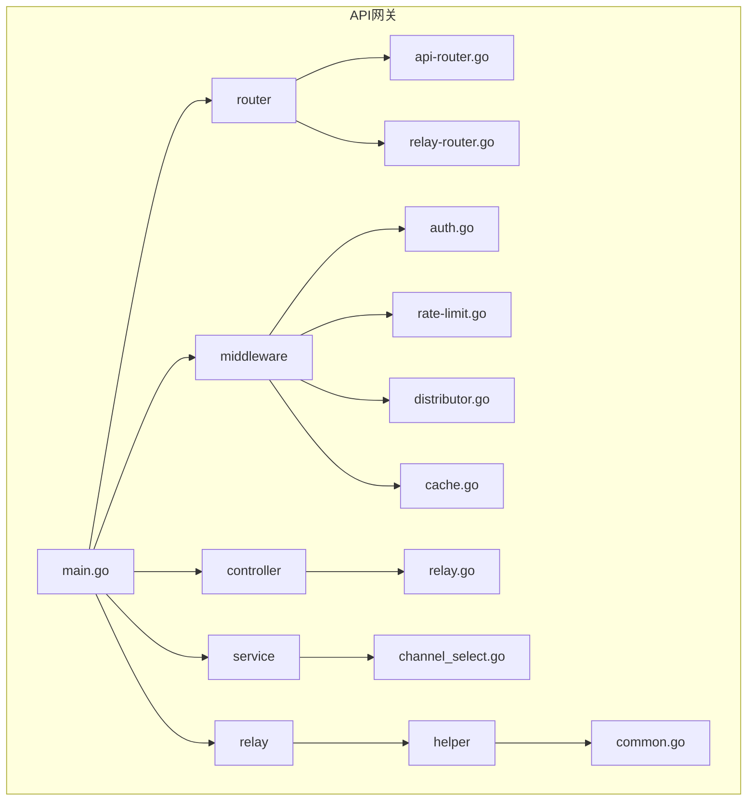
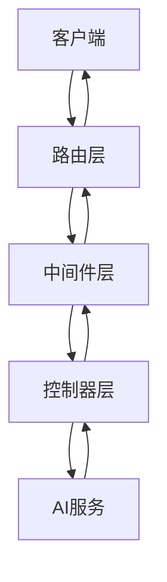
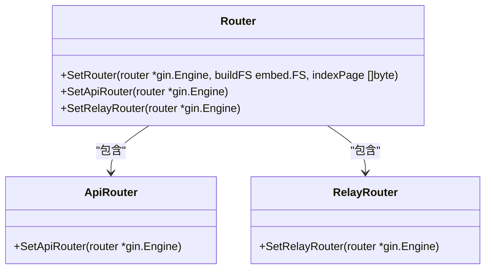
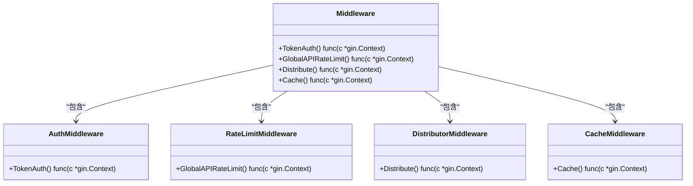
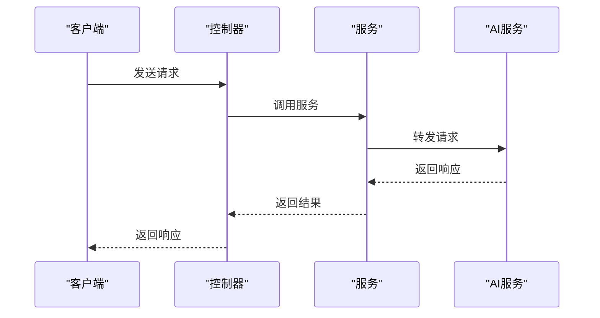
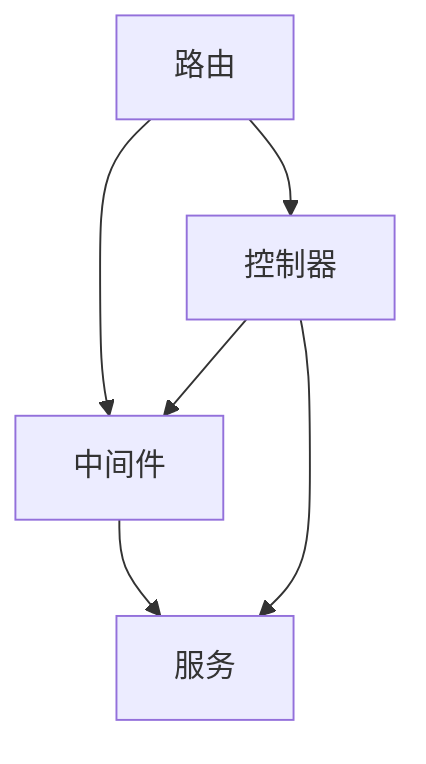

# API网关

<cite>
**本文档引用的文件**
- [main.go](file://main.go)
- [router/main.go](file://router/main.go)
- [router/api-router.go](file://router/api-router.go)
- [router/relay-router.go](file://router/relay-router.go)
- [controller/relay.go](file://controller/relay.go)
- [middleware/auth.go](file://middleware/auth.go)
- [middleware/rate-limit.go](file://middleware/rate-limit.go)
- [middleware/distributor.go](file://middleware/distributor.go)
- [middleware/cache.go](file://middleware/cache.go)
- [service/channel_select.go](file://service/channel_select.go)
- [relay/helper/common.go](file://relay/helper/common.go)
- [common/gin.go](file://common/gin.go)
- [middleware/utils.go](file://middleware/utils.go)
</cite>

## 目录
1. [简介](#简介)
2. [项目结构](#项目结构)
3. [核心组件](#核心组件)
4. [架构概述](#架构概述)
5. [详细组件分析](#详细组件分析)
6. [依赖分析](#依赖分析)
7. [性能考虑](#性能考虑)
8. [故障排除指南](#故障排除指南)
9. [结论](#结论)

## 简介
API网关是new-api项目的核心组件，作为所有客户端请求的统一入口点。它负责接收来自客户端的请求，进行身份验证、速率限制、缓存等处理，然后将请求转发到适当的AI服务。网关实现了智能路由、负载均衡和故障转移机制，确保请求能够高效、可靠地处理。通过Gin框架和一系列中间件链，API网关提供了强大的请求处理能力，支持多种AI服务的集成，包括OpenAI、Claude、Gemini等。

## 项目结构
API网关的实现分布在多个目录中，主要组件包括路由、控制器、中间件和服务。路由组件定义了API端点，控制器处理业务逻辑，中间件负责身份验证、速率限制等横切关注点，服务组件提供具体的业务功能。

**图源**
- [main.go](file://main.go#L1-L261)
- [router/main.go](file://router/main.go#L1-L34)
- [middleware/auth.go](file://middleware/auth.go#L1-L322)

## 核心组件
API网关的核心组件包括路由、中间件和控制器。路由组件定义了API端点，中间件负责处理身份验证、速率限制等通用功能，控制器处理具体的业务逻辑。这些组件协同工作，确保请求能够被正确处理和转发。

**节源**
- [main.go](file://main.go#L1-L261)
- [router/main.go](file://router/main.go#L1-L34)
- [controller/relay.go](file://controller/relay.go#L1-L501)

## 架构概述
API网关采用分层架构，包括路由层、中间件层和控制器层。路由层负责定义API端点，中间件层处理身份验证、速率限制等通用功能，控制器层处理具体的业务逻辑。这种分层架构使得系统具有良好的可维护性和可扩展性。

**图源**
- [main.go](file://main.go#L1-L261)
- [router/main.go](file://router/main.go#L1-L34)
- [controller/relay.go](file://controller/relay.go#L1-L501)

## 详细组件分析
### 路由组件分析
路由组件定义了API网关的所有端点，包括API路由、中继路由等。它使用Gin框架的路由功能，将不同的URL路径映射到相应的处理函数。

#### 路由组件类图

**图源**
- [router/main.go](file://router/main.go#L1-L34)
- [router/api-router.go](file://router/api-router.go#L1-L261)
- [router/relay-router.go](file://router/relay-router.go#L1-L206)

### 中间件组件分析
中间件组件负责处理身份验证、速率限制、缓存等通用功能。它通过Gin框架的中间件机制，将这些功能应用到所有或特定的请求上。

#### 中间件组件类图

**图源**
- [middleware/auth.go](file://middleware/auth.go#L1-L322)
- [middleware/rate-limit.go](file://middleware/rate-limit.go#L1-L118)
- [middleware/distributor.go](file://middleware/distributor.go#L1-L392)
- [middleware/cache.go](file://middleware/cache.go#L1-L17)

### 控制器组件分析
控制器组件负责处理具体的业务逻辑，包括请求转发、格式转换和错误处理。它通过调用服务组件来完成具体的业务功能。

#### 控制器组件序列图

**图源**
- [controller/relay.go](file://controller/relay.go#L1-L501)
- [service/channel_select.go](file://service/channel_select.go#L1-L163)

## 依赖分析
API网关的各个组件之间存在紧密的依赖关系。路由组件依赖于中间件和控制器组件，中间件组件依赖于服务组件，控制器组件依赖于服务和中间件组件。这种依赖关系确保了系统的各个部分能够协同工作。

**图源**
- [main.go](file://main.go#L1-L261)
- [router/main.go](file://router/main.go#L1-L34)
- [controller/relay.go](file://controller/relay.go#L1-L501)

## 性能考虑
API网关在设计时考虑了性能优化。通过使用Gin框架的高性能特性，以及合理的中间件链设计，确保了请求处理的高效性。此外，网关还实现了缓存机制，减少了对后端服务的重复请求，提高了整体性能。

## 故障排除指南
当API网关出现问题时，可以按照以下步骤进行排查：
1. 检查日志文件，查看是否有错误信息。
2. 检查配置文件，确保配置正确。
3. 检查网络连接，确保与后端服务的连接正常。
4. 检查中间件配置，确保中间件按预期工作。

**节源**
- [middleware/utils.go](file://middleware/utils.go#L1-L37)
- [controller/relay.go](file://controller/relay.go#L1-L501)

## 结论
API网关作为new-api项目的核心组件，提供了强大的请求处理能力。通过合理的架构设计和组件划分，确保了系统的可维护性和可扩展性。未来可以进一步优化性能，增加更多的监控和诊断功能，提高系统的稳定性和可靠性。