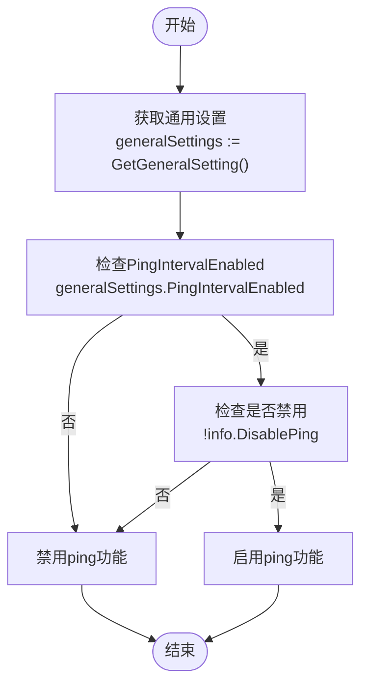
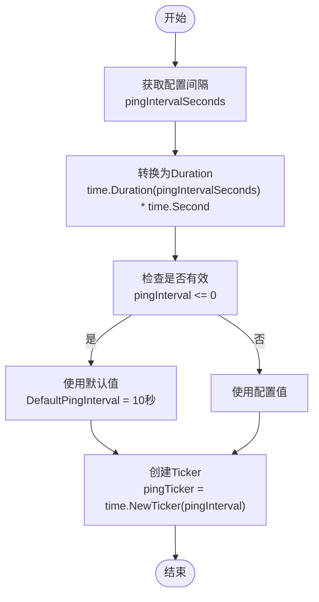
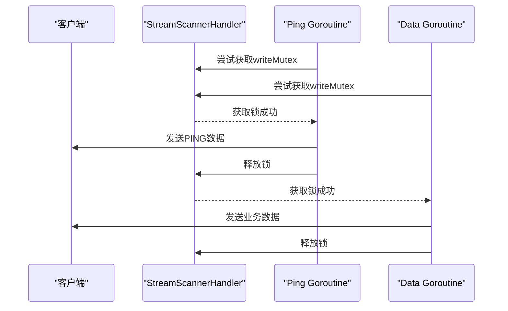
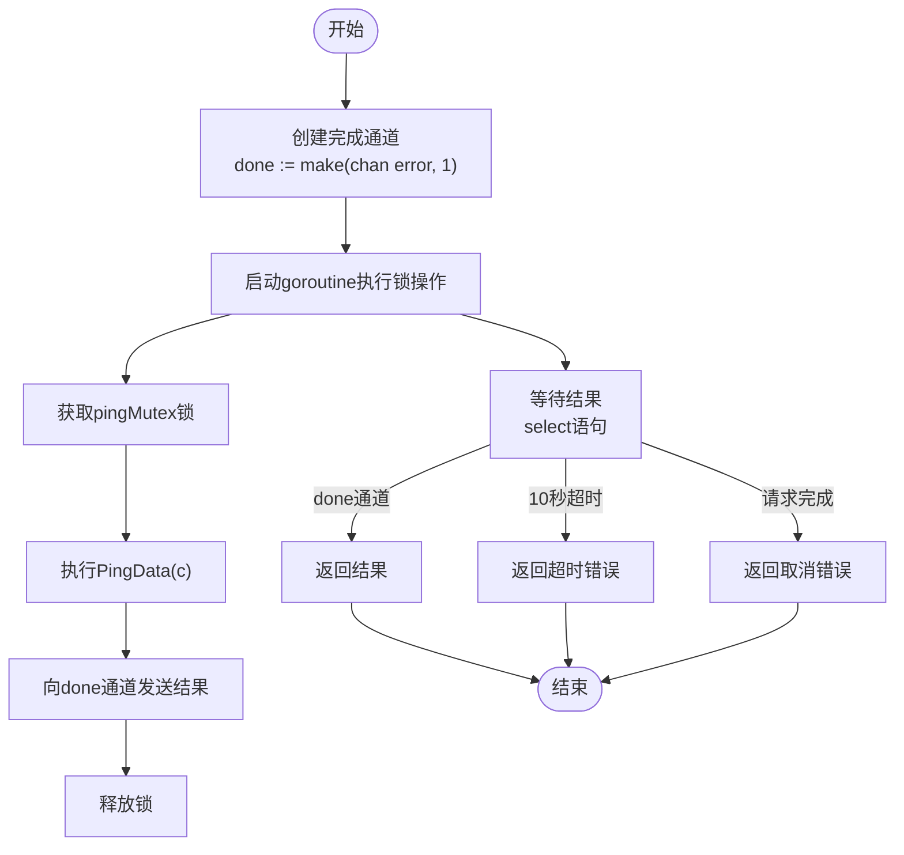

# SSE心跳保活机制

<cite>
**本文档引用文件**  
- [stream_scanner.go](file://relay/helper/stream_scanner.go)
- [api_request.go](file://relay/channel/api_request.go)
- [general_setting.go](file://setting/operation_setting/general_setting.go)
- [common.go](file://relay/helper/common.go)
- [env.go](file://constant/env.go)
</cite>

## 目录
1. [引言](#引言)
2. [心跳机制配置决策](#心跳机制配置决策)
3. [pingTicker创建与管理](#pingticker创建与管理)
4. [并发控制与互斥锁](#并发控制与互斥锁)
5. [PingData函数实现](#pingdata函数实现)
6. [超时保护机制](#超时保护机制)
7. [sendPingData超时控制](#sendpingdata超时控制)
8. [配置最佳实践](#配置最佳实践)
9. [故障排查指南](#故障排查指南)

## 引言
本文档全面解析new-api项目中SSE（Server-Sent Events）心跳保活的实现方案。重点分析在StreamScannerHandler中如何根据operation_setting.GetGeneralSetting()配置决定是否启用ping功能，详细描述pingTicker的创建和管理机制，包括默认间隔（DefaultPingInterval）和自定义间隔的优先级处理。同时深入探讨独立goroutine中ping数据发送的并发控制、writeMutex互斥锁的防冲突机制、PingData函数的实现细节和错误处理策略，以及超时保护机制如何防止goroutine泄漏。

**Section sources**
- [stream_scanner.go](file://relay/helper/stream_scanner.go#L1-L272)

## 心跳机制配置决策
在`StreamScannerHandler`函数中，系统通过`operation_setting.GetGeneralSetting()`获取全局配置来决定是否启用ping功能。该决策基于两个条件的逻辑与运算：

1. `generalSettings.PingIntervalEnabled`：来自operation_setting的通用设置，表示是否启用ping间隔功能
2. `!info.DisablePing`：来自请求上下文的禁用标志，表示是否明确禁用ping功能

只有当这两个条件同时满足时，才会启用ping功能。这种双重检查机制确保了系统管理员和业务逻辑都能对心跳行为进行控制。



**Diagram sources**
- [stream_scanner.go](file://relay/helper/stream_scanner.go#L61-L63)

**Section sources**
- [stream_scanner.go](file://relay/helper/stream_scanner.go#L61-L63)

## pingTicker创建与管理
pingTicker的创建和管理遵循严格的优先级处理规则，确保系统在各种配置情况下都能正常工作。

### 默认与自定义间隔处理
系统首先从`generalSettings.PingIntervalSeconds`获取用户配置的ping间隔（以秒为单位），然后将其转换为time.Duration类型。如果配置的间隔小于等于0，则使用默认的`DefaultPingInterval`（10秒）作为替代值。

这种设计确保了即使用户配置了无效值（如负数或零），系统仍能以合理的默认值运行，提高了系统的健壮性。

### 创建流程
当确定启用ping功能后，系统会创建一个time.Ticker实例，其间隔由上述逻辑确定。该ticker用于定期触发ping操作，保持SSE连接的活跃状态。



**Diagram sources**
- [stream_scanner.go](file://relay/helper/stream_scanner.go#L63-L70)

**Section sources**
- [stream_scanner.go](file://relay/helper/stream_scanner.go#L63-L70)

## 并发控制与互斥锁
在SSE流式传输过程中，多个goroutine可能同时尝试向客户端写入数据，包括业务数据和ping数据。为防止并发写冲突，系统采用了writeMutex互斥锁机制。

### writeMutex的作用
`writeMutex sync.Mutex`被声明为StreamScannerHandler函数的局部变量，用于保护所有写操作。每当需要向客户端写入数据时（无论是业务数据还是ping数据），都必须先获取该锁。

### 写操作保护
在ping goroutine中，发送ping数据的代码被包裹在goroutine中执行，确保锁的正确获取和释放：

```go
go func() {
    writeMutex.Lock()
    defer writeMutex.Unlock()
    done <- PingData(c)
}()
```

这种设计确保了写操作的原子性，避免了多个goroutine同时写入导致的数据混乱或连接错误。



**Diagram sources**
- [stream_scanner.go](file://relay/helper/stream_scanner.go#L57)
- [stream_scanner.go](file://relay/helper/stream_scanner.go#L142-L144)

**Section sources**
- [stream_scanner.go](file://relay/helper/stream_scanner.go#L57)
- [stream_scanner.go](file://relay/helper/stream_scanner.go#L142-L144)

## PingData函数实现
PingData函数负责向SSE连接写入心跳数据，其主要功能是发送一个注释行（comment line），不会被客户端解析为事件数据。

### 实现细节
函数首先检查gin.Context和ResponseWriter的有效性，确保写入目标存在。然后检查请求上下文是否已完成，避免向已关闭的连接写入数据。

核心写入操作使用`c.Writer.Write([]byte(": PING\n\n"))`发送SSE注释行。根据SSE规范，以冒号开头的行被视为注释，不会触发客户端的message事件，但能保持TCP连接活跃。

### 错误处理策略
函数采用分层错误处理策略：
1. 基础检查：验证上下文和写入器的有效性
2. 上下文检查：验证请求上下文是否已完成
3. 写入检查：捕获写入操作的错误并包装返回
4. 刷新检查：调用FlushWriter确保数据立即发送

所有错误都被适当地包装和记录，便于问题排查。

```mermaid
flowchart TD
Start([开始]) --> CheckContext["检查Context有效性<br/>c == nil || c.Writer == nil"]
CheckContext --> |无效| ReturnError["返回错误"]
CheckContext --> |有效| CheckRequest["检查请求上下文<br/>c.Request.Context().Err() != nil"]
CheckRequest --> |已完成| ReturnError
CheckRequest --> |活跃| WriteData["写入PING数据<br/>Write([]byte(\": PING\\n\\n\"))"]
WriteData --> |失败| HandleWriteError["处理写入错误"]
WriteData --> |成功| Flush["刷新写入器<br/>FlushWriter(c)"]
Flush --> |失败| HandleFlushError["处理刷新错误"]
Flush --> |成功| ReturnSuccess["返回nil"]
HandleWriteError --> ReturnError
HandleFlushError --> ReturnError
ReturnError --> End([结束])
ReturnSuccess --> End
```

**Diagram sources**
- [common.go](file://relay/helper/common.go#L94-L107)

**Section sources**
- [common.go](file://relay/helper/common.go#L94-L107)

## 超时保护机制
为防止ping goroutine因各种原因无限期运行导致资源泄漏，系统实现了多层超时保护机制。

### maxPingDuration设置
系统设置了`maxPingDuration := 30 * time.Minute`，即30分钟的最大运行时间。这意味着即使客户端连接保持活跃，ping goroutine也会在30分钟后自动退出。

### 定时器实现
通过`pingTimeout := time.NewTimer(maxPingDuration)`创建一个一次性定时器，并在goroutine的select语句中监听其通道。当定时器到期时，会触发超时处理逻辑，优雅地退出goroutine。

### 资源清理
在defer语句中调用`pingTimeout.Stop()`确保定时器被正确清理，避免资源泄漏。这种设计确保了无论goroutine因何种原因退出，相关资源都能被正确释放。

```mermaid
flowchart TD
Start([开始]) --> CreateTimer["创建超时定时器<br/>pingTimeout := time.NewTimer(30分钟)"]
CreateTimer --> DeferStop["defer pingTimeout.Stop()"]
DeferStop --> MainLoop["主循环select"]
MainLoop --> |ticker.C| SendPing["发送PING"]
MainLoop --> |ctx.Done()| Exit["退出"]
MainLoop --> |stopChan| Exit
MainLoop --> |c.Request.Context().Done()| Exit
MainLoop --> |pingTimeout.C| Timeout["超时处理"]
Timeout --> LogError["记录超时日志"]
Timeout --> Return["返回退出"]
Exit --> Return
Return --> StopTimer["定时器已停止"]
```

**Diagram sources**
- [stream_scanner.go](file://relay/helper/stream_scanner.go#L132-L134)
- [stream_scanner.go](file://relay/helper/stream_scanner.go#L171-L173)

**Section sources**
- [stream_scanner.go](file://relay/helper/stream_scanner.go#L132-L134)
- [stream_scanner.go](file://relay/helper/stream_scanner.go#L171-L173)

## sendPingData超时控制
在api_request.go文件中，`sendPingData`函数实现了更精细的超时控制，确保不会因单次ping操作阻塞过长时间。

### 10秒超时设置
函数设置了10秒的超时限制，通过select语句同时监听三个通道：
- `done`：ping操作完成通道
- `time.After(10 * time.Second)`：10秒超时通道
- `c.Request.Context().Done()`：请求上下文完成通道

### 并发安全
与StreamScannerHandler中的实现类似，`sendPingData`也使用了互斥锁（mutex）来保护写操作。不同的是，这里使用了独立的`pingMutex`而非共享的`writeMutex`，提供了更细粒度的并发控制。

### 错误处理
当超时发生时，函数返回特定的超时错误，便于调用方进行针对性处理。这种设计确保了即使网络状况不佳，系统也能在合理时间内恢复，避免资源长时间占用。



**Diagram sources**
- [api_request.go](file://relay/channel/api_request.go#L221-L249)

**Section sources**
- [api_request.go](file://relay/channel/api_request.go#L221-L249)

## 配置最佳实践
为确保SSE心跳机制的稳定运行，建议遵循以下配置最佳实践：

### 通用设置配置
在`operation_setting.GeneralSetting`中合理配置ping相关参数：
- `PingIntervalEnabled`：生产环境建议启用，开发环境可根据需要关闭
- `PingIntervalSeconds`：建议设置为10-30秒之间，平衡连接保持和网络开销

### 环境变量配置
通过环境变量设置相关参数：
- `STREAMING_TIMEOUT`：流式传输超时时间，应大于ping间隔
- `RELAY_TIMEOUT`：代理超时时间，应大于流式传输超时

### 监控与调试
启用调试模式时，系统会输出详细的超时和ping间隔信息，便于问题排查：
```go
if common.DebugEnabled {
    println("streaming timeout seconds:", int64(streamingTimeout.Seconds()))
    println("ping interval seconds:", int64(pingInterval.Seconds()))
}
```

### 资源管理
确保在所有退出路径上正确清理资源：
- 使用defer语句确保ticker和定时器被停止
- 使用sync.WaitGroup等待所有goroutine退出
- 设置合理的等待超时（如5秒），避免清理过程无限期阻塞

**Section sources**
- [general_setting.go](file://setting/operation_setting/general_setting.go#L13-L33)
- [env.go](file://constant/env.go#L3)
- [stream_scanner.go](file://relay/helper/stream_scanner.go#L82-L105)

## 故障排查指南
当遇到SSE心跳相关问题时，可按照以下步骤进行排查：

### 常见问题与解决方案
| 问题现象 | 可能原因 | 解决方案 |
|--------|--------|--------|
| 客户端连接频繁断开 | ping功能未启用 | 检查`PingIntervalEnabled`是否为true |
| 网络流量异常高 | ping间隔过短 | 检查`PingIntervalSeconds`配置值 |
| 系统资源占用高 | goroutine泄漏 | 检查`maxPingDuration`是否生效 |
| 写入操作失败 | 并发写冲突 | 确认`writeMutex`是否正确使用 |

### 日志分析
系统在关键位置记录了详细的日志信息：
- `logger.LogError(c, "ping data send timeout")`：ping发送超时
- `logger.LogError(c, "ping goroutine max duration reached")`：goroutine运行超时
- `println("ping data sent")`：调试模式下的成功日志

### 调试步骤
1. **确认配置**：检查`operation_setting.GetGeneralSetting()`返回的配置是否符合预期
2. **验证ticker**：确认`pingTicker`是否被正确创建和启动
3. **检查并发**：通过调试日志确认writeMutex是否有效防止并发写冲突
4. **测试超时**：验证10秒超时机制是否正常工作
5. **监控资源**：观察goroutine数量是否随时间增长，判断是否存在泄漏

### 性能优化建议
- 适当调整`DefaultPingInterval`以平衡连接稳定性和网络开销
- 确保`maxPingDuration`设置合理，避免长时间运行的goroutine
- 在高并发场景下，考虑优化互斥锁的粒度，减少竞争

**Section sources**
- [stream_scanner.go](file://relay/helper/stream_scanner.go#L148-L158)
- [stream_scanner.go](file://relay/helper/stream_scanner.go#L171-L173)
- [api_request.go](file://relay/channel/api_request.go#L197-L199)