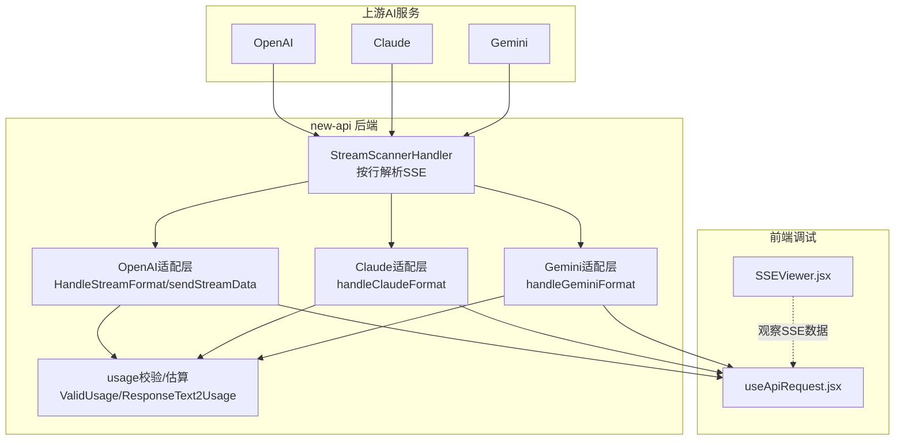
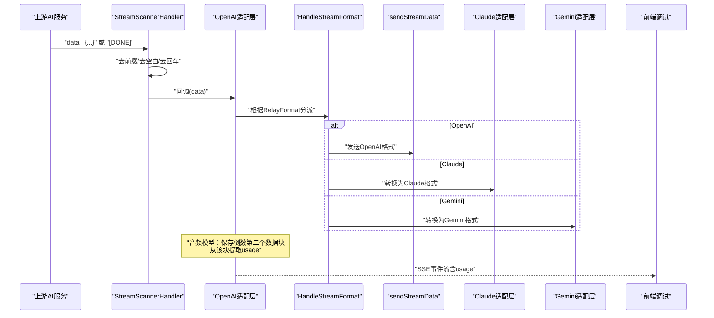
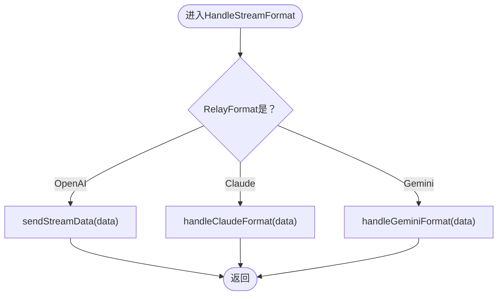
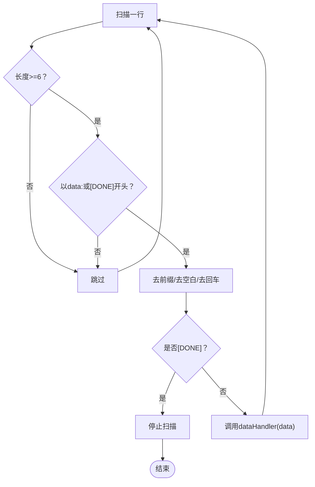
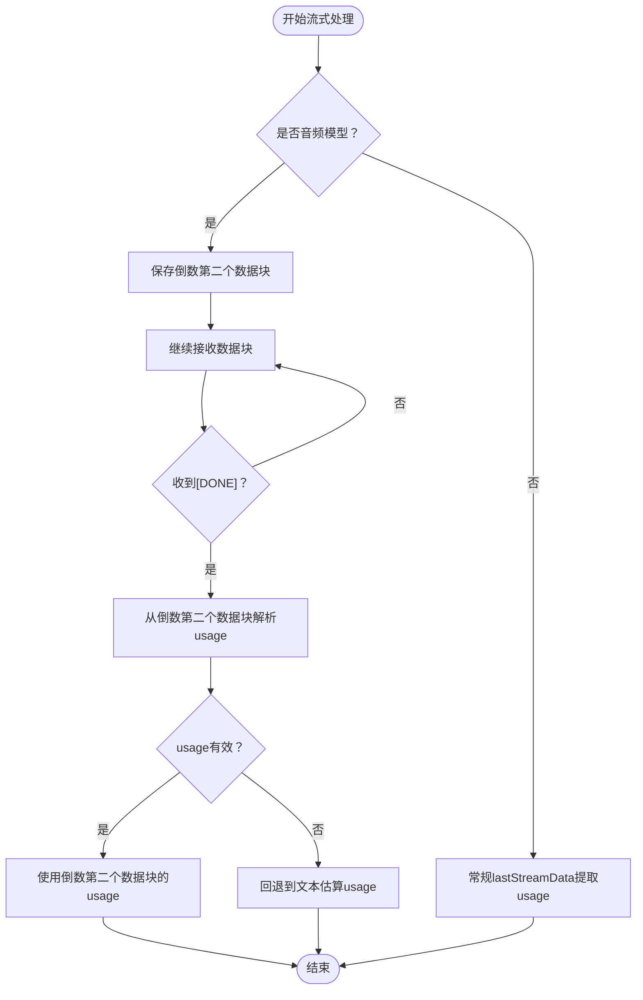
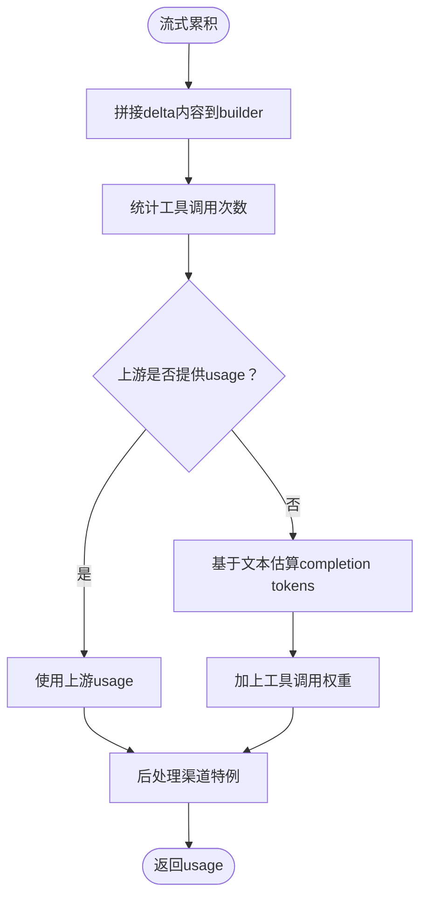
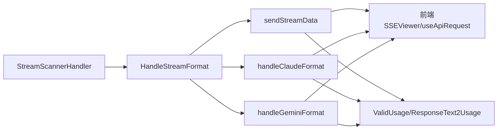

# SSE数据格式化处理

<cite>
**本文引用的文件**
- [openai_helper.go](file://relay/channel/openai/helper.go)
- [openai_relay_openai.go](file://relay/channel/openai/relay-openai.go)
- [openai_response.go](file://dto/openai_response.go)
- [stream_scanner.go](file://relay/helper/stream_scanner.go)
- [custom_event.go](file://common/custom-event.go)
- [usage_helpr.go](file://service/usage_helpr.go)
- [token_counter.go](file://service/token_counter.go)
- [gemini_relay.go](file://relay/channel/gemini/relay-gemini.go)
- [claude_relay.go](file://relay/channel/claude/relay-claude.go)
- [relay_format.go](file://types/relay_format.go)
- [useApiRequest.jsx](file://web/src/hooks/playground/useApiRequest.jsx)
- [SSEViewer.jsx](file://web/src/components/playground/SSEViewer.jsx)
</cite>

## 目录
1. [引言](#引言)
2. [项目结构](#项目结构)
3. [核心组件](#核心组件)
4. [架构总览](#架构总览)
5. [详细组件分析](#详细组件分析)
6. [依赖关系分析](#依赖关系分析)
7. [性能考虑](#性能考虑)
8. [故障排查指南](#故障排查指南)
9. [结论](#结论)
10. [附录](#附录)

## 引言
本文件系统性阐述 new-api 对不同 AI 服务（OpenAI、Claude、Gemini 等）SSE 响应格式的标准化处理策略，重点围绕 HandleStreamFormat 函数如何解析与转换来自上游的原始 SSE 数据，以及针对 gpt-4o-audio 等音频模型的 usage 特殊提取逻辑。同时说明对 SSE 数据前缀（data:）、结束标记（[DONE]）等差异的处理方式，流式场景下的 usage 累积与计算机制，并结合 openai_response.go 中的数据结构设计，给出标准化输出格式的设计考量与扩展兼容建议。

## 项目结构
- 后端处理链路：
  - 流式扫描器负责按行解析上游 SSE，过滤并分发有效数据块。
  - OpenAI 适配层根据 RelayFormat 将数据转换为统一输出格式，并在必要时提取 usage。
  - Claude/Gemini 适配层分别进行格式转换与最终响应拼装。
  - usage 验证与估算逻辑贯穿流式与非流式路径。
- 前端调试工具：
  - 提供 SSE Viewer 与 useApiRequest 的事件监听，便于观察 data: 前缀、[DONE] 结束标记及解析错误。

图表来源
- [stream_scanner.go](file://relay/helper/stream_scanner.go#L1-L273)
- [openai_helper.go](file://relay/channel/openai/helper.go#L1-L262)
- [openai_relay_openai.go](file://relay/channel/openai/relay-openai.go#L106-L194)
- [gemini_relay.go](file://relay/channel/gemini/relay-gemini.go#L981-L1270)
- [usage_helpr.go](file://service/usage_helpr.go#L21-L33)
- [SSEViewer.jsx](file://web/src/components/playground/SSEViewer.jsx#L26-L266)
- [useApiRequest.jsx](file://web/src/hooks/playground/useApiRequest.jsx#L331-L459)

章节来源
- [stream_scanner.go](file://relay/helper/stream_scanner.go#L1-L273)
- [openai_helper.go](file://relay/channel/openai/helper.go#L1-L262)
- [openai_relay_openai.go](file://relay/channel/openai/relay-openai.go#L106-L194)
- [gemini_relay.go](file://relay/channel/gemini/relay-gemini.go#L981-L1270)
- [usage_helpr.go](file://service/usage_helpr.go#L21-L33)
- [SSEViewer.jsx](file://web/src/components/playground/SSEViewer.jsx#L26-L266)
- [useApiRequest.jsx](file://web/src/hooks/playground/useApiRequest.jsx#L331-L459)

## 核心组件
- 流式扫描器（StreamScannerHandler）
  - 负责按行读取上游 SSE，识别 data: 前缀与 [DONE] 结束标记，剥离多余空白与回车，触发业务回调。
  - 提供超时、心跳（ping）、客户端断开检测与 goroutine 清理等鲁棒性保障。
- OpenAI 适配层（HandleStreamFormat/sendStreamData）
  - 根据 RelayFormat 将上游流式响应转换为统一输出格式；支持“思考转内容”（thinking to content）等可选行为。
  - 在音频模型场景下，通过保存倒数第二个数据块来提取 usage。
- Claude/Gemini 适配层
  - Claude：将 OpenAI 流式响应转换为 Claude 格式并逐块发送。
  - Gemini：将 OpenAI 流式响应转换为 Gemini 格式并通过自定义事件发送。
- usage 校验与估算（ValidUsage/ResponseText2Usage）
  - 校验 usage 是否有效；当上游未提供 usage 时，基于响应文本与模型估算完成 token 数。

章节来源
- [stream_scanner.go](file://relay/helper/stream_scanner.go#L1-L273)
- [openai_helper.go](file://relay/channel/openai/helper.go#L1-L262)
- [openai_relay_openai.go](file://relay/channel/openai/relay-openai.go#L106-L194)
- [usage_helpr.go](file://service/usage_helpr.go#L21-L33)

## 架构总览
下面以序列图展示一次典型 OpenAI 流式响应的标准化处理流程，包括 SSE 解析、格式转换与 usage 提取。

图表来源
- [stream_scanner.go](file://relay/helper/stream_scanner.go#L205-L251)
- [openai_helper.go](file://relay/channel/openai/helper.go#L21-L34)
- [openai_relay_openai.go](file://relay/channel/openai/relay-openai.go#L129-L164)
- [gemini_relay.go](file://relay/channel/gemini/relay-gemini.go#L981-L1020)

## 详细组件分析

### HandleStreamFormat 与格式转换
- 功能定位
  - 根据 info.RelayFormat 将上游流式响应转换为统一输出格式，支持 OpenAI、Claude、Gemini 三种模式。
- OpenAI 模式
  - 若未强制格式化且无需“思考转内容”，直接透传原始数据块。
  - 否则将数据反序列化为流式响应对象，按需进行“思考内容”到“内容”的转换，并发送对象化数据块。
- Claude 模式
  - 将 OpenAI 流式响应转换为 Claude 格式，逐块发送 ClaudeData。
- Gemini 模式
  - 将 OpenAI 流式响应转换为 Gemini 格式，通过自定义事件发送 data: 前缀。

图表来源
- [openai_helper.go](file://relay/channel/openai/helper.go#L21-L34)
- [openai_helper.go](file://relay/channel/openai/helper.go#L36-L76)
- [openai_helper.go](file://relay/channel/openai/helper.go#L201-L254)

章节来源
- [openai_helper.go](file://relay/channel/openai/helper.go#L21-L34)
- [openai_helper.go](file://relay/channel/openai/helper.go#L36-L76)
- [openai_helper.go](file://relay/channel/openai/helper.go#L201-L254)

### SSE 解析与差异处理（data:、[DONE]、前缀剥离）
- 行级解析与过滤
  - 仅接受长度足够且以 "data:" 开头或以 "[DONE]" 结尾的行。
  - 剥离前导空格与行尾回车，确保后续解析稳定。
- 结束标记处理
  - 遇到 "[DONE]" 立即停止读取，避免继续消费剩余数据。
- 心跳与超时
  - 通过定时器与 pingTicker 保持连接活性，超时或客户端断开时优雅退出。

图表来源
- [stream_scanner.go](file://relay/helper/stream_scanner.go#L205-L251)

章节来源
- [stream_scanner.go](file://relay/helper/stream_scanner.go#L205-L251)

### usage 的特殊处理：音频模型从倒数第二个数据块提取
- 场景背景
  - 音频模型（如 gpt-4o-audio）的 usage 通常不在最后一个数据块中，而是在倒数第二个数据块中。
- 实现要点
  - 在流式扫描回调中，维护 lastStreamData 与 secondLastStreamData。
  - 当检测到 isAudioModel 且存在上一个数据块时，记录 secondLastStreamData。
  - 流结束后，从 secondLastStreamData 中解析 usage 并校验有效性。
- 适用范围
  - 仅对包含 "audio" 的模型名生效，其他模型走常规 lastStreamData 的 usage 提取逻辑。

图表来源
- [openai_relay_openai.go](file://relay/channel/openai/relay-openai.go#L126-L164)
- [usage_helpr.go](file://service/usage_helpr.go#L30-L33)

章节来源
- [openai_relay_openai.go](file://relay/channel/openai/relay-openai.go#L126-L164)
- [usage_helpr.go](file://service/usage_helpr.go#L30-L33)

### usage 的累积与计算机制（流式场景）
- 文本内容累积
  - 将每个流式响应的 delta 内容与推理内容拼接到 builder 中，用于后续 token 估算。
- 工具调用计数
  - 统计工具调用次数，作为额外的 completion token 加权。
- usage 计算优先级
  - 若上游流式响应已携带 usage 且有效，则直接采用。
  - 否则基于响应文本与模型估算 completion tokens，并叠加工具调用权重。
- Claude/Gemini 的特殊处理
  - Claude：在流式转换过程中将 usage 写入转换上下文，最终发送。
  - Gemini：通过自定义事件发送 data: 前缀，保证前端正确解析。

图表来源
- [openai_helper.go](file://relay/channel/openai/helper.go#L78-L93)
- [openai_helper.go](file://relay/channel/openai/helper.go#L95-L167)
- [openai_relay_openai.go](file://relay/channel/openai/relay-openai.go#L179-L194)
- [gemini_relay.go](file://relay/channel/gemini/relay-gemini.go#L981-L1020)

章节来源
- [openai_helper.go](file://relay/channel/openai/helper.go#L78-L93)
- [openai_helper.go](file://relay/channel/openai/helper.go#L95-L167)
- [openai_relay_openai.go](file://relay/channel/openai/relay-openai.go#L179-L194)
- [gemini_relay.go](file://relay/channel/gemini/relay-gemini.go#L981-L1020)

### 标准化输出格式设计考量（结合 openai_response.go）
- Usage 结构
  - 包含 prompt_tokens、completion_tokens、total_tokens、prompt_tokens_details、completion_tokens_details 等字段，满足多模态（文本/音频/图像）与缓存命中统计需求。
- OpenAI 流式响应结构
  - choices.delta.content/reasoning_content/reasoning/tool_calls 等字段，支持逐步增量输出与工具调用。
- 设计目标
  - 统一各上游服务的差异，保证下游消费者（前端/SDK）能稳定解析。
  - 保留关键元信息（finish_reason、system_fingerprint 等），便于调试与兼容。

章节来源
- [openai_response.go](file://dto/openai_response.go#L222-L264)
- [openai_response.go](file://dto/openai_response.go#L141-L197)
- [openai_response.go](file://dto/openai_response.go#L266-L289)

### 处理非标准SSE响应的扩展方法与兼容性建议
- 前端兼容
  - SSEViewer.jsx 与 useApiRequest.jsx 已内置对 [DONE] 的识别与错误解析提示，便于快速定位问题。
- 后端健壮性
  - StreamScannerHandler 已实现超时、心跳、断开检测与 goroutine 清理，建议在新增通道时复用该模式。
- 扩展步骤
  - 在 openai_helper.go 中增加新的 RelayFormat 分支，并实现对应的 handleXxxFormat 函数。
  - 在 openai_relay_openai.go 中完善音频模型等特殊场景的 usage 提取逻辑。
  - 在前端调试组件中补充对应格式的可视化与统计。

章节来源
- [SSEViewer.jsx](file://web/src/components/playground/SSEViewer.jsx#L26-L266)
- [useApiRequest.jsx](file://web/src/hooks/playground/useApiRequest.jsx#L331-L459)
- [stream_scanner.go](file://relay/helper/stream_scanner.go#L1-L273)
- [openai_helper.go](file://relay/channel/openai/helper.go#L21-L34)

## 依赖关系分析
- 组件耦合
  - StreamScannerHandler 与 OpenAI/Claude/Gemini 适配层解耦良好，通过 dataHandler 回调传递数据。
  - usage 相关逻辑集中在 service 层（ValidUsage/ResponseText2Usage），便于跨适配层复用。
- 关键依赖链
  - 上游SSE -> StreamScannerHandler -> HandleStreamFormat -> sendStreamData/handleClaudeFormat/handleGeminiFormat -> 前端SSEViewer/useApiRequest。
  - usage 校验与估算贯穿上述链路，确保在无上游usage时仍能提供合理计费依据。

图表来源
- [stream_scanner.go](file://relay/helper/stream_scanner.go#L1-L273)
- [openai_helper.go](file://relay/channel/openai/helper.go#L21-L34)
- [openai_helper.go](file://relay/channel/openai/helper.go#L36-L76)
- [openai_helper.go](file://relay/channel/openai/helper.go#L201-L254)
- [usage_helpr.go](file://service/usage_helpr.go#L21-L33)

章节来源
- [stream_scanner.go](file://relay/helper/stream_scanner.go#L1-L273)
- [openai_helper.go](file://relay/channel/openai/helper.go#L21-L34)
- [openai_helper.go](file://relay/channel/openai/helper.go#L36-L76)
- [openai_helper.go](file://relay/channel/openai/helper.go#L201-L254)
- [usage_helpr.go](file://service/usage_helpr.go#L21-L33)

## 性能考虑
- 流式缓冲与超时
  - StreamScannerHandler 使用可配置的最大缓冲与超时，避免内存膨胀与长时间阻塞。
- 心跳与断开检测
  - 定期 ping 与超时保护，降低长连接异常占用。
- 前端渲染优化
  - SSEViewer.jsx 对解析错误与 DONE 标记进行统计与折叠，减少 DOM 压力。

章节来源
- [stream_scanner.go](file://relay/helper/stream_scanner.go#L1-L273)
- [SSEViewer.jsx](file://web/src/components/playground/SSEViewer.jsx#L26-L266)

## 故障排查指南
- 常见问题
  - SSE 未显示或解析错误：检查 data: 前缀与 [DONE] 结束标记是否正确；查看前端 SSEViewer 的错误统计。
  - usage 为空：确认上游是否提供 usage；若为音频模型，检查是否正确提取倒数第二个数据块。
  - 连接中断或超时：关注后端日志中的超时与断开信息。
- 排查步骤
  - 在 useApiRequest.jsx 中观察 readyState 与 status，定位 HTTP 错误或连接断开。
  - 在 SSEViewer.jsx 中查看每条消息的解析结果与 DONE 标记。
  - 在后端日志中确认 StreamScannerHandler 的扫描与回调执行情况。

章节来源
- [useApiRequest.jsx](file://web/src/hooks/playground/useApiRequest.jsx#L375-L425)
- [SSEViewer.jsx](file://web/src/components/playground/SSEViewer.jsx#L26-L266)
- [stream_scanner.go](file://relay/helper/stream_scanner.go#L260-L272)

## 结论
new-api 通过 StreamScannerHandler 统一解析上游 SSE，借助 HandleStreamFormat 将不同服务的流式响应转换为一致的输出格式，并针对音频模型等特殊情况实现了倒数第二个数据块的 usage 提取。配合 usage 校验与估算逻辑，系统在保证兼容性的前提下，提供了稳健的流式计费与调试能力。前端调试组件进一步提升了可观测性与问题定位效率。

## 附录
- RelayFormat 类型定义
  - 支持 openai、claude、gemini、openai_responses、openai_audio、openai_image、openai_realtime、rerank、embedding 等格式。

章节来源
- [relay_format.go](file://types/relay_format.go#L1-L18)