# SSE流式响应处理

<cite>
**本文档引用的文件**   
- [responses_handler.go](file://relay/responses_handler.go)
- [stream_scanner.go](file://relay/helper/stream_scanner.go)
- [useApiRequest.jsx](file://web/src/hooks/playground/useApiRequest.jsx)
- [custom-event.go](file://common/custom-event.go)
- [helper.go](file://relay/channel/openai/helper.go)
- [relay-openai.go](file://relay/channel/openai/relay-openai.go)
- [SSEViewer.jsx](file://web/src/components/playground/SSEViewer.jsx)
- [usage_helpr.go](file://service/usage_helpr.go)
- [audio.go](file://relay/channel/openai/audio.go)
</cite>

## 目录
1. [引言](#引言)
2. [核心处理机制](#核心处理机制)
3. [流式响应处理流程](#流式响应处理流程)
4. [不同AI服务的SSE格式处理](#不同ai服务的sse格式处理)
5. [usage信息提取策略](#usage信息提取策略)
6. [前端SSE客户端实现](#前端sse客户端实现)
7. [错误处理与最佳实践](#错误处理与最佳实践)
8. [总结](#总结)

## 引言
本文档深入解析new-api项目中HTTP流式响应（Server-Sent Events, SSE）的处理机制。SSE技术允许服务器向客户端推送实时数据，对于AI应用中的流式文本生成、语音合成等场景至关重要。文档重点分析了`responses_handler.go`中通过`ResponseHelper`处理流式请求的完整流程，包括请求转发和响应流的接收。特别关注`streamTTSResponse`和`StreamScannerHandler`函数如何实现分块数据的读取、处理和转发，确保流式响应的稳定性和低延迟。

## 核心处理机制

### ResponseHelper处理流程
`ResponseHelper`是处理流式响应的核心函数，位于`responses_handler.go`文件中。该函数负责初始化通道元数据、验证请求类型、进行模型映射、初始化适配器，并最终处理请求和响应。

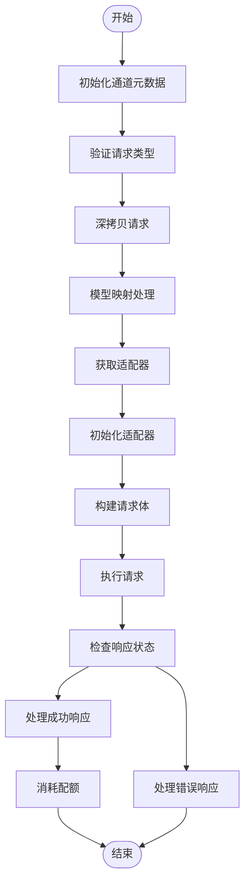

**Diagram sources**
- [responses_handler.go](file://relay/responses_handler.go#L21-L113)

**Section sources**
- [responses_handler.go](file://relay/responses_handler.go#L21-L113)

### StreamScannerHandler流式扫描器
`StreamScannerHandler`函数是流式响应处理的核心组件，位于`stream_scanner.go`文件中。该函数使用`bufio.Scanner`来逐行读取服务器发送的SSE数据流，并通过goroutine实现并发处理。

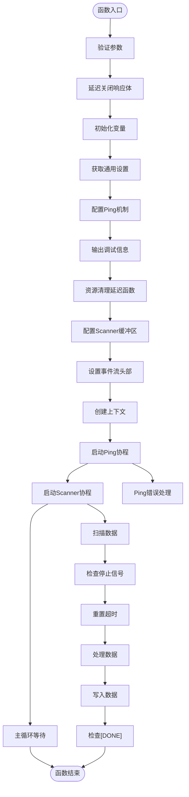

**Diagram sources**
- [stream_scanner.go](file://relay/helper/stream_scanner.go#L37-L271)

**Section sources**
- [stream_scanner.go](file://relay/helper/stream_scanner.go#L37-L271)

## 流式响应处理流程

### streamTTSResponse音频流处理
`streamTTSResponse`函数专门处理文本转语音（TTS）的流式响应，位于`relay-openai.go`文件中。该函数直接将音频数据流式传输给客户端，而不进行SSE格式的封装。

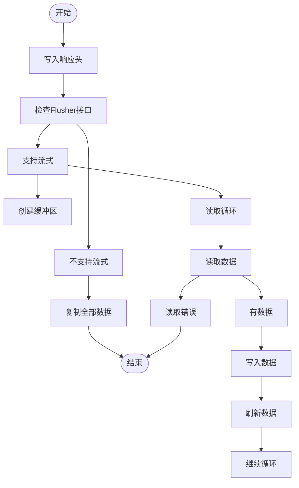

**Diagram sources**
- [relay-openai.go](file://relay/channel/openai/relay-openai.go#L295-L326)

**Section sources**
- [relay-openai.go](file://relay/channel/openai/relay-openai.go#L295-L326)

### 流式数据处理完整流程
完整的流式响应处理流程结合了`StreamScannerHandler`和`HandleStreamFormat`函数，实现了从接收原始SSE数据到格式化输出的完整过程。

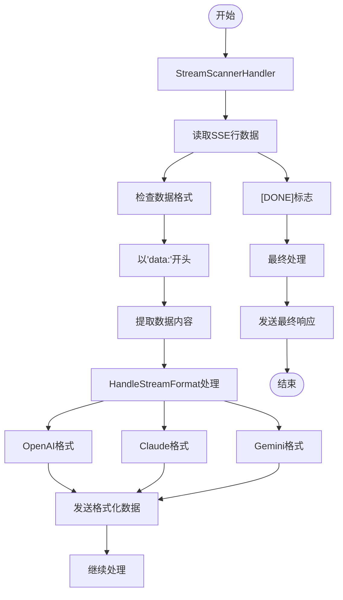

**Section sources**
- [relay-openai.go](file://relay/channel/openai/relay-openai.go#L129-L191)
- [helper.go](file://relay/channel/openai/helper.go#L22-L33)

## 不同AI服务的SSE格式处理

### HandleStreamFormat格式化处理
`HandleStreamFormat`函数是处理不同AI服务SSE格式差异的核心，位于`helper.go`文件中。该函数根据`RelayFormat`类型将原始SSE数据转换为相应服务的格式。

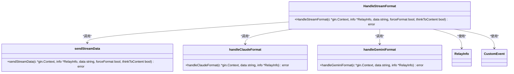

**Diagram sources**
- [helper.go](file://relay/channel/openai/helper.go#L22-L33)

**Section sources**
- [helper.go](file://relay/channel/openai/helper.go#L22-L33)

### OpenAI格式处理
对于OpenAI格式，`sendStreamData`函数直接将原始数据通过`CustomEvent`发送给客户端，保持了OpenAI原生的SSE格式。

### Claude格式处理
Claude格式处理通过`handleClaudeFormat`函数实现，该函数将OpenAI格式的流式响应转换为Claude兼容的格式。

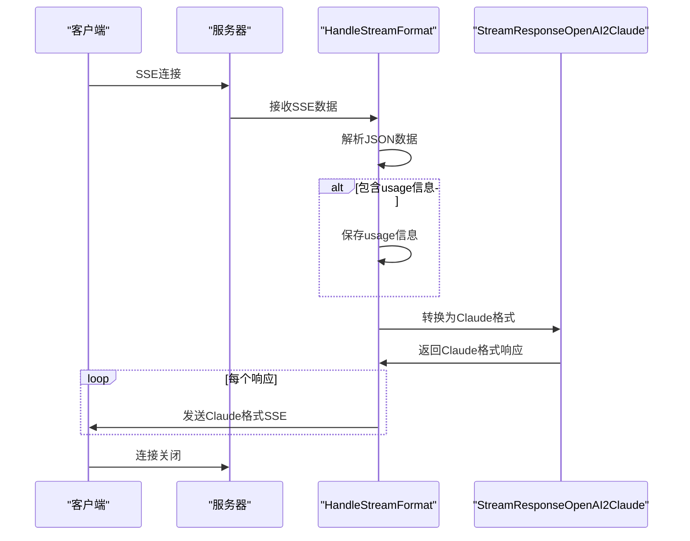

**Diagram sources**
- [helper.go](file://relay/channel/openai/helper.go#L36-L49)

### Gemini格式处理
Gemini格式处理通过`handleGeminiFormat`函数实现，该函数将OpenAI格式的流式响应转换为Gemini兼容的格式。

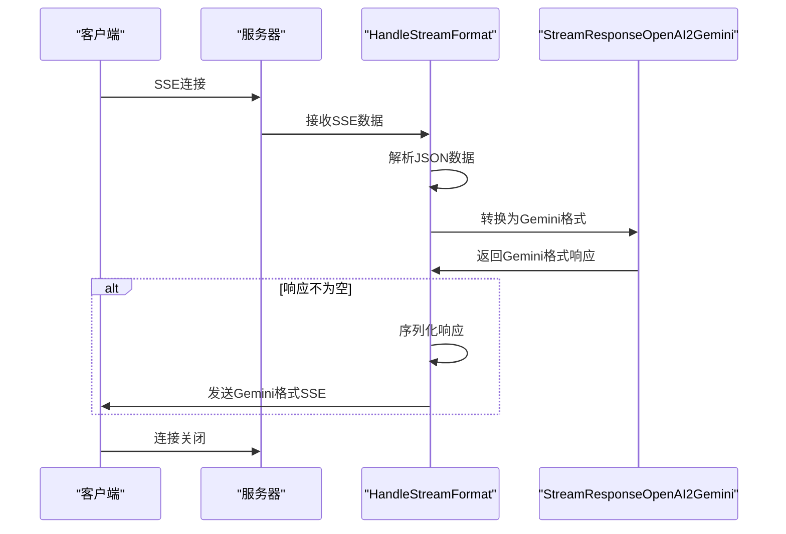

**Diagram sources**
- [helper.go](file://relay/channel/openai/helper.go#L52-L75)

## usage信息提取策略

### 音频模型的特殊处理
对于音频模型，系统采用特殊策略从倒数第二个SSE数据块中提取usage信息，这在`relay-openai.go`文件中实现。

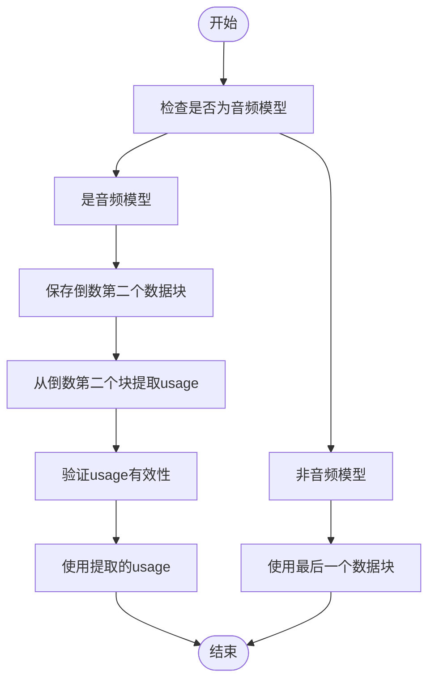

**Section sources**
- [relay-openai.go](file://relay/channel/openai/relay-openai.go#L148-L164)

### usage信息处理流程
usage信息的提取和处理遵循特定的优先级顺序，确保准确计算令牌使用量。

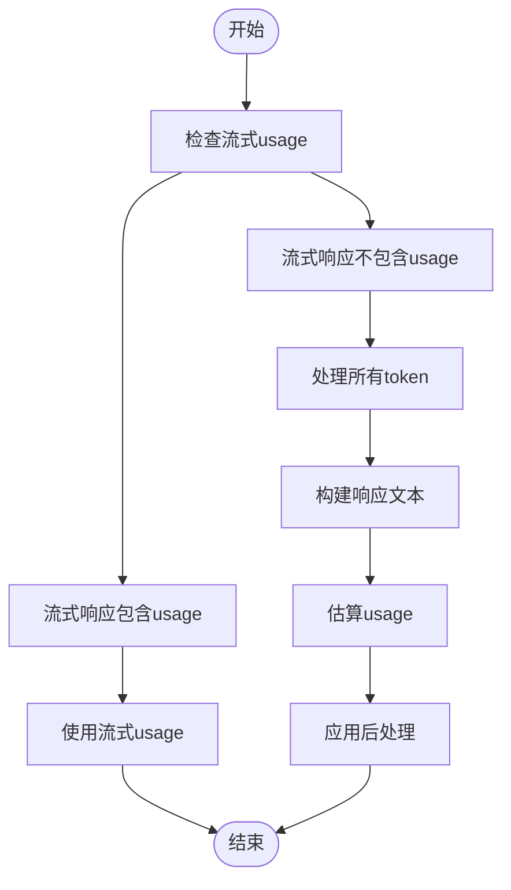

**Section sources**
- [relay-openai.go](file://relay/channel/openai/relay-openai.go#L184-L189)
- [usage_helpr.go](file://service/usage_helpr.go#L22-L28)

## 前端SSE客户端实现

### useApiRequest钩子
前端通过`useApiRequest.jsx`中的`useApiRequest`钩子实现SSE客户端功能，该钩子封装了SSE连接的创建、消息处理和错误处理。

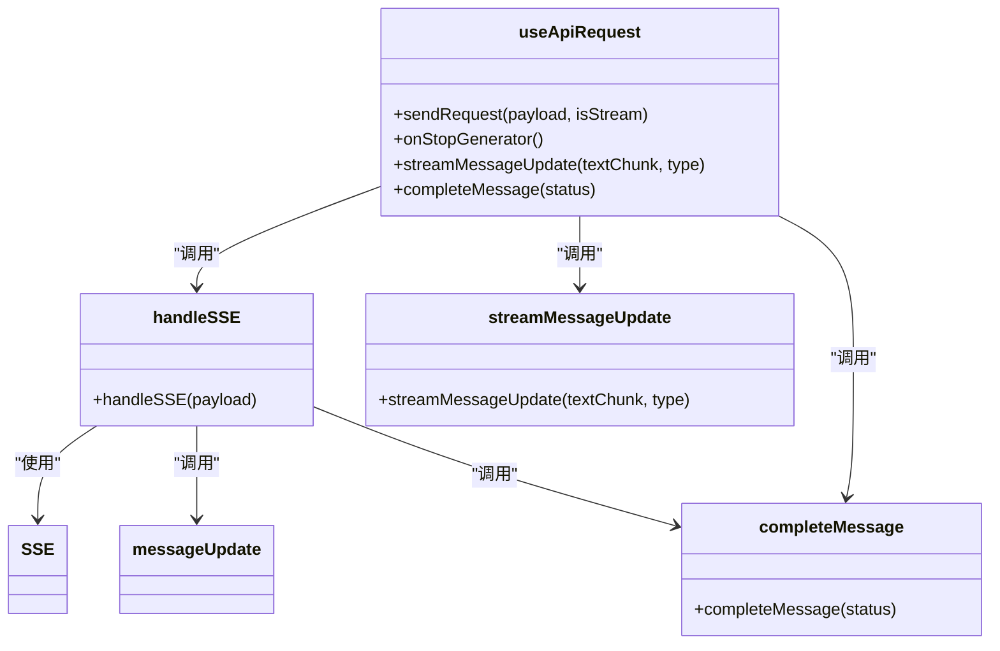

**Section sources**
- [useApiRequest.jsx](file://web/src/hooks/playground/useApiRequest.jsx#L37-L451)

### SSEViewer组件
`SSEViewer.jsx`组件提供了一个交互式的SSE数据流查看器，用于调试和监控流式响应。

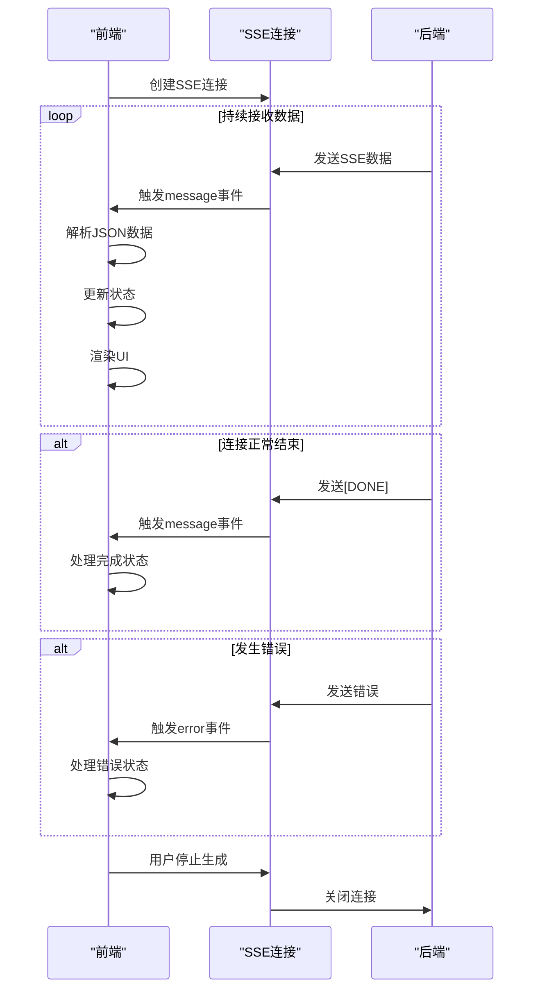

**Section sources**
- [useApiRequest.jsx](file://web/src/hooks/playground/useApiRequest.jsx#L301-L329)
- [SSEViewer.jsx](file://web/src/components/playground/SSEViewer.jsx#L32-L266)

## 错误处理与最佳实践

### 流式连接中断处理
系统实现了完善的流式连接中断处理机制，确保在各种异常情况下都能正确清理资源。

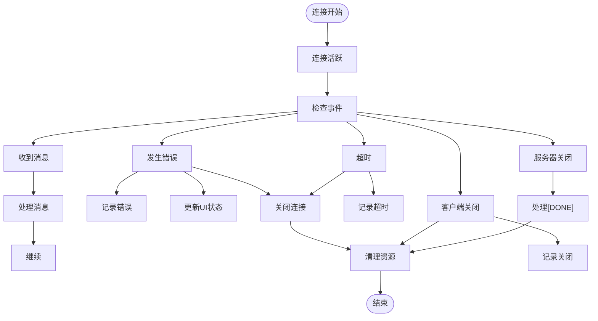

**Section sources**
- [useApiRequest.jsx](file://web/src/hooks/playground/useApiRequest.jsx#L375-L424)
- [stream_scanner.go](file://relay/helper/stream_scanner.go#L261-L270)

### 超时和数据解析错误处理
系统对超时和数据解析错误进行了专门处理，确保用户体验的稳定性。

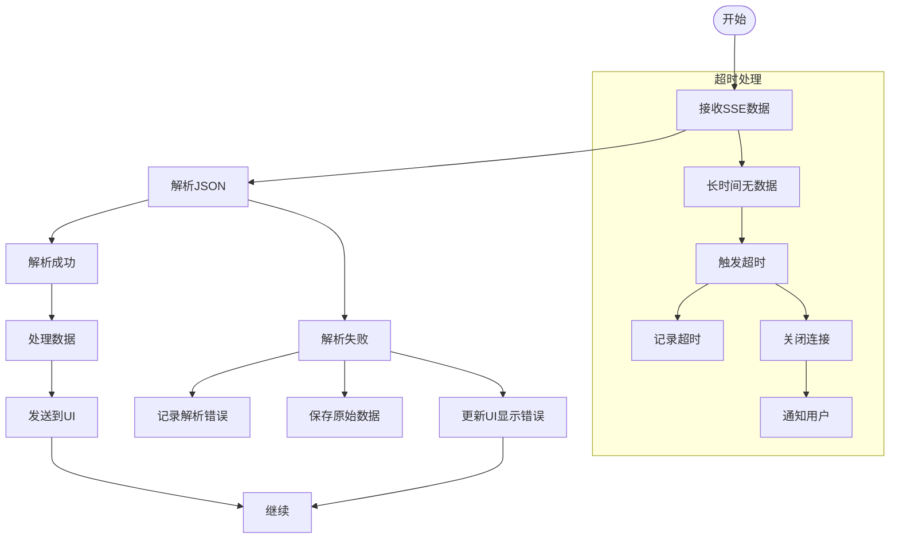

**Section sources**
- [useApiRequest.jsx](file://web/src/hooks/playground/useApiRequest.jsx#L358-L372)
- [stream_scanner.go](file://relay/helper/stream_scanner.go#L261-L264)

### 最佳实践总结
1. **资源清理**: 始终确保在函数结束时关闭响应体和清理goroutine
2. **错误处理**: 对所有可能的错误情况进行处理，包括网络错误、解析错误和超时
3. **并发安全**: 使用互斥锁保护并发写操作，避免数据竞争
4. **性能优化**: 合理设置缓冲区大小和超时时间，平衡性能和资源消耗
5. **格式兼容**: 支持多种AI服务的SSE格式，确保良好的兼容性

## 总结
new-api项目中的SSE流式响应处理机制设计精巧，通过`ResponseHelper`、`StreamScannerHandler`和`HandleStreamFormat`等核心组件，实现了高效、稳定和兼容的流式响应处理。系统不仅支持标准的OpenAI格式，还通过格式转换支持Claude和Gemini等不同AI服务。对于音频模型等特殊场景，系统采用了从倒数第二个SSE数据块提取usage信息的创新策略。前端通过`useApiRequest`钩子和`SSEViewer`组件提供了完整的SSE客户端实现，结合完善的错误处理机制，确保了流式交互的稳定性和用户体验。