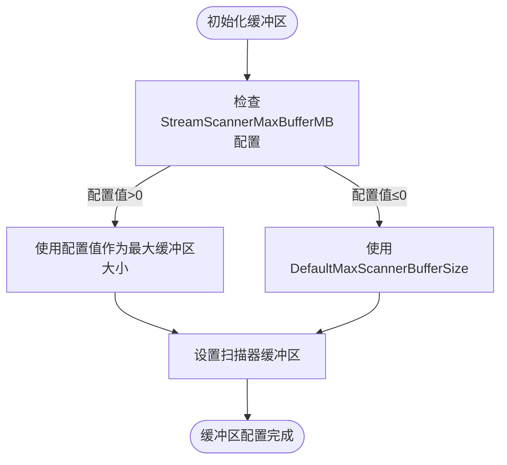
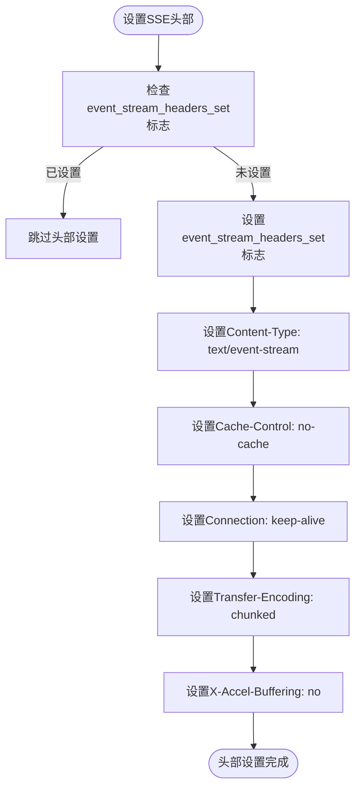
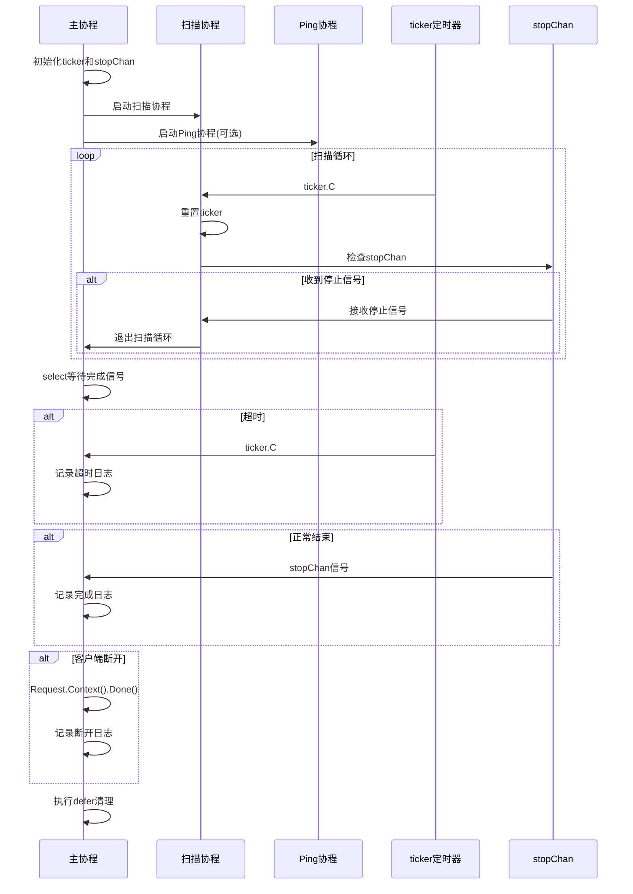

# SSE流式数据扫描

<cite>
**本文档引用的文件**
- [stream_scanner.go](file://relay/helper/stream_scanner.go)
- [common.go](file://relay/helper/common.go)
- [custom-event.go](file://common/custom-event.go)
- [general_setting.go](file://setting/operation_setting/general_setting.go)
- [env.go](file://constant/env.go)
- [api_request.go](file://relay/channel/api_request.go)
</cite>

## 目录
1. [简介](#简介)
2. [核心实现机制](#核心实现机制)
3. [缓冲区配置与动态调整](#缓冲区配置与动态调整)
4. [SSE头部设置](#sse头部设置)
5. [超时控制与停止信号](#超时控制与停止信号)
6. [SSE数据块处理](#sse数据块处理)
7. [SSE事件格式标准化](#sse事件格式标准化)
8. [性能优化建议](#性能优化建议)

## 简介
本文档深入分析StreamScannerHandler的核心实现机制，详细说明如何使用bufio.Scanner对SSE响应流进行高效扫描。文档涵盖了缓冲区大小配置、超时控制机制、SSE数据块处理以及事件格式标准化等关键方面，为理解和优化SSE流式数据处理提供全面的技术指导。

## 核心实现机制
StreamScannerHandler是处理SSE（Server-Sent Events）流式响应的核心组件，它通过bufio.Scanner对SSE响应流进行高效扫描。该处理器采用多协程架构，包含主扫描协程、ping保活协程和资源清理机制，确保流式数据的稳定传输和异常处理。

处理器首先检查响应体和数据处理器的有效性，然后初始化必要的控制通道和定时器。stopChan用于协调各个协程的停止信号，ticker用于实现流式传输的超时控制，而writeMutex则保护并发写操作的安全性。整个处理流程通过sync.WaitGroup确保所有协程正确退出，避免资源泄漏。

在初始化阶段，处理器会根据系统配置确定ping保活机制是否启用，并设置相应的ping间隔。调试模式下，相关超时和间隔参数会被输出，便于问题排查。资源清理通过defer函数实现，确保在函数退出时能够正确停止所有定时器并关闭通道。

**Section sources**
- [stream_scanner.go](file://relay/helper/stream_scanner.go#L37-L105)

## 缓冲区配置与动态调整
StreamScannerHandler采用精心设计的缓冲区配置策略，以平衡内存使用和处理效率。系统定义了两个关键常量：InitialScannerBufferSize（初始缓冲区大小）和DefaultMaxScannerBufferSize（默认最大缓冲区大小），分别为64KB和64MB。



缓冲区大小通过getScannerBufferSize函数动态确定。该函数首先检查constant.StreamScannerMaxBufferMB配置项，如果配置了自定义值（大于0），则使用该值作为最大缓冲区大小；否则使用默认的64MB。这种设计允许系统管理员根据实际需求和服务器资源灵活调整缓冲区大小。

在StreamScannerHandler中，通过scanner.Buffer方法设置缓冲区，传入初始分配的64KB字节切片和计算得到的最大缓冲区大小。这种双层缓冲策略既保证了小数据包的处理效率，又能够应对大数据流的突发情况，避免缓冲区溢出。

**Diagram sources**
- [stream_scanner.go](file://relay/helper/stream_scanner.go#L25-L35)
- [stream_scanner.go](file://relay/helper/stream_scanner.go#L107)

**Section sources**
- [stream_scanner.go](file://relay/helper/stream_scanner.go#L24-L35)
- [env.go](file://constant/env.go#L6)

## SSE头部设置
SetEventStreamHeaders函数负责设置符合SSE规范的HTTP响应头部，确保客户端能够正确识别和处理服务器发送的事件流。该函数通过检查上下文中的"event_stream_headers_set"标志来避免重复设置头部，提高处理效率。



函数设置了五个关键头部字段：Content-Type指定为"text/event-stream"，这是SSE协议的MIME类型；Cache-Control设置为"no-cache"，防止中间代理缓存事件流；Connection设置为"keep-alive"，保持长连接；Transfer-Encoding设置为"chunked"，支持分块传输；X-Accel-Buffering设置为"no"，禁用Nginx等反向代理的缓冲，确保数据实时传输。

这些头部设置遵循W3C的SSE规范，确保了跨浏览器和客户端的兼容性。通过在多个渠道处理器中调用SetEventStreamHeaders，系统保证了所有SSE响应的一致性。

**Diagram sources**
- [common.go](file://relay/helper/common.go#L40-L55)

**Section sources**
- [common.go](file://relay/helper/common.go#L40-L55)
- [stream_scanner.go](file://relay/helper/stream_scanner.go#L109)

## 超时控制与停止信号
StreamScannerHandler采用ticker和stopChan协同工作的机制来实现精确的超时控制和优雅的停止信号处理。这一机制确保了流式传输的稳定性和资源的及时释放。



超时控制通过time.NewTicker实现，超时时间由constant.StreamingTimeout配置项决定。在每次成功读取一行数据后，通过ticker.Reset(streamingTimeout)重置定时器，实现了"心跳"机制。如果在指定时间内没有新数据到达，ticker.C通道将产生信号，触发超时处理逻辑。

停止信号通过stopChan通道传递，这是一个带缓冲的bool通道，能够避免发送时的阻塞。当需要停止流式处理时（如客户端断开连接、收到[DONE]标志或发生错误），通过common.SafeSendBool(stopChan, true)安全地发送停止信号。主循环通过select语句监听ticker.C、stopChan和c.Request.Context().Done()三个通道，根据不同的信号源执行相应的处理逻辑。

资源清理在defer函数中完成，确保所有协程能够优雅退出。通过向stopChan发送停止信号、停止所有定时器，并使用sync.WaitGroup等待最多5秒，确保了资源的完全释放。

**Diagram sources**
- [stream_scanner.go](file://relay/helper/stream_scanner.go#L53-L56)
- [stream_scanner.go](file://relay/helper/stream_scanner.go#L260-L271)

**Section sources**
- [stream_scanner.go](file://relay/helper/stream_scanner.go#L50-L105)
- [stream_scanner.go](file://relay/helper/stream_scanner.go#L260-L271)

## SSE数据块处理
StreamScannerHandler对SSE数据块的处理包括分隔识别和格式清洗两个关键步骤，确保接收到的数据符合预期格式并能够正确传递给数据处理器。

```mermaid
flowchart TD
Start([开始扫描]) --> ScanLine["scanner.Scan()"]
ScanLine --> CheckStop["检查stopChan和上下文"]
CheckStop --> |需要停止| Exit["退出扫描循环"]
CheckStop --> |继续| ResetTicker["重置ticker"]
ResetTicker --> GetText["scanner.Text()获取数据"]
GetText --> CheckLength["检查数据长度<6?"]
CheckLength --> |是| Continue["跳过，继续下一行"]
CheckLength --> |否| CheckPrefix["检查data:或[DONE]前缀"]
CheckPrefix --> |不匹配| Continue
CheckPrefix --> |匹配| ExtractData["data = data[5:]提取数据"]
ExtractData --> TrimLeft["strings.TrimLeft(data, \" \")"]
TrimLeft --> TrimSuffix["strings.TrimSuffix(data, \"\\r\")"]
TrimSuffix --> CheckDone["检查[DONE]标志"]
CheckDone --> |是| HandleDone["记录日志，退出"]
CheckDone --> |否| SetFirstTime["设置首次响应时间"]
SetFirstTime --> HandleData["调用dataHandler处理数据"]
HandleData --> CheckSuccess["处理成功?"]
CheckSuccess --> |否| Exit
CheckSuccess --> |是| Continue
```

数据分隔识别通过检查每行数据的前缀实现。处理器首先验证数据长度是否至少为6个字符，然后检查是否以"data:"开头或为"[DONE]"标志。这种双重检查确保了只处理有效的SSE数据块，过滤掉可能存在的空行或其他非数据内容。

格式清洗包括三个步骤：使用data = data[5:]移除"data:"前缀，使用strings.TrimLeft(data, " ")去除左侧空白字符，以及使用strings.TrimSuffix(data, "\r")去除行尾的回车符。这些清洗操作确保了传递给dataHandler的数据是纯净的JSON字符串或其他有效格式。

对于"[DONE]"标志的处理，系统将其视为流式传输完成的信号，直接退出扫描循环，避免继续读取后续可能存在的无效数据。同时，系统会记录相应的日志信息，便于监控和调试。

**Diagram sources**
- [stream_scanner.go](file://relay/helper/stream_scanner.go#L211-L249)

**Section sources**
- [stream_scanner.go](file://relay/helper/stream_scanner.go#L211-L249)

## SSE事件格式标准化
通过custom-event.go文件，系统实现了SSE事件格式的标准化输出机制，确保所有服务器发送的事件都符合W3C SSE规范。这一机制为不同渠道的响应提供了统一的输出格式。

CustomEvent结构体定义了SSE事件的标准属性，包括Event（事件类型）、Id（事件ID）、Retry（重试间隔）和Data（事件数据）。系统通过WriteContentType方法设置正确的Content-Type和Cache-Control头部，与SetEventStreamHeaders函数协同工作，确保响应头部的一致性。

```mermaid
classDiagram
class CustomEvent {
+Event string
+Id string
+Retry uint
+Data interface{}
+Mutex sync.Mutex
+Render(w http.ResponseWriter) error
+WriteContentType(w http.ResponseWriter)
}
class stringWriter {
+Write([]byte) (int, error)
+writeString(string) (int, error)
}
class stringWrapper {
+Writer io.Writer
}
CustomEvent --> stringWriter : "使用"
stringWrapper --> stringWriter : "实现"
stringWrapper --> io.Writer : "组合"
```

在实际使用中，系统通过c.Render(-1, common.CustomEvent{Data: "data: " + str})等方式将数据渲染为SSE格式。对于JSON数据，先通过common.Marshal序列化，然后包装为CustomEvent。Ping数据则通过写入": PING\n\n"这种注释格式实现，不会触发客户端的message事件，仅用于保持连接活跃。

这种标准化机制使得不同渠道的响应能够以统一的格式返回给客户端，简化了前端处理逻辑，提高了系统的可维护性和扩展性。

**Diagram sources**
- [custom-event.go](file://common/custom-event.go#L51-L58)
- [common.go](file://relay/helper/common.go#L94-L107)

**Section sources**
- [custom-event.go](file://common/custom-event.go#L1-L88)
- [common.go](file://relay/helper/common.go#L94-L107)

## 性能优化建议
基于对StreamScannerHandler的深入分析，提出以下性能优化建议：

1. **合理设置缓冲区大小**：根据实际业务场景和服务器资源，通过StreamScannerMaxBufferMB环境变量调整最大缓冲区大小。对于高吞吐量场景，可适当增加缓冲区以减少内存分配开销；对于资源受限环境，则应减小缓冲区以节约内存。

2. **优化超时阈值**：根据网络状况和业务需求调整StreamingTimeout配置。过短的超时可能导致正常传输被中断，而过长的超时则会延迟错误检测。建议根据实际测试结果设置合理的超时值。

3. **合理配置Ping间隔**：通过operation_setting中的PingIntervalEnabled和PingIntervalSeconds控制ping保活机制。在高并发场景下，适当延长ping间隔可以减少不必要的网络流量和CPU开销。

4. **监控协程行为**：利用调试模式输出的超时和间隔信息，监控系统的实际运行状况，及时发现潜在的性能瓶颈。

5. **资源清理优化**：确保defer函数中的资源清理逻辑高效执行，避免goroutine泄漏。通过设置合理的最大等待时间（当前为5秒），平衡资源释放的及时性和系统性能。

**Section sources**
- [env.go](file://constant/env.go#L3)
- [general_setting.go](file://setting/operation_setting/general_setting.go#L15-L16)
- [stream_scanner.go](file://relay/helper/stream_scanner.go#L50)