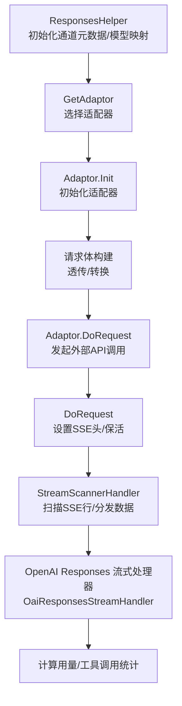
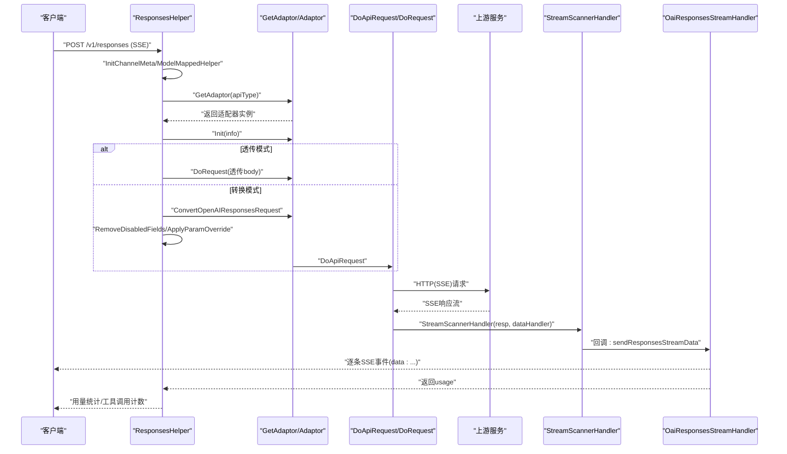
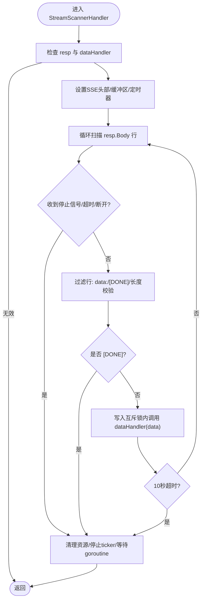
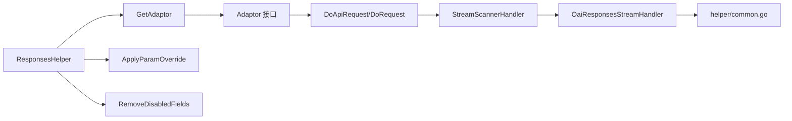

# SSE请求处理流程

<cite>
**本文引用的文件**
- [responses_handler.go](file://relay/responses_handler.go)
- [stream_scanner.go](file://relay/helper/stream_scanner.go)
- [api_request.go](file://relay/channel/api_request.go)
- [adaptor.go](file://relay/relay_adaptor.go)
- [model_mapped.go](file://relay/helper/model_mapped.go)
- [override.go](file://relay/common/override.go)
- [relay_info.go](file://relay/common/relay_info.go)
- [common.go](file://relay/helper/common.go)
- [adaptor.go(openai)](file://relay/channel/openai/adaptor.go)
- [relay_responses.go](file://relay/channel/openai/relay_responses.go)
</cite>

## 目录
1. [简介](#简介)
2. [项目结构](#项目结构)
3. [核心组件](#核心组件)
4. [架构总览](#架构总览)
5. [详细组件分析](#详细组件分析)
6. [依赖关系分析](#依赖关系分析)
7. [性能考量](#性能考量)
8. [故障排查指南](#故障排查指南)
9. [结论](#结论)

## 简介
本文件围绕 new-api 中“SSE（Server-Sent Events）流式请求”的完整处理流程进行深入解析，重点覆盖从 ResponsesHelper 函数开始的请求初始化、模型映射、适配器选择与外部调用、请求体构建（透传与转换）、参数覆盖与禁用字段移除、以及通过 StreamScannerHandler 接收上游响应并进入流式处理管道的全过程。文档同时给出关键调用链的可视化图示，并提供面向非技术读者的可读性说明与最佳实践建议。

## 项目结构
与 SSE 流式处理直接相关的核心模块分布如下：
- 控制层与入口：responses_handler.go（ResponsesHelper）
- 通用辅助：helper/model_mapped.go（模型映射）、helper/common.go（SSE事件封装与刷新）、helper/stream_scanner.go（SSE扫描与分发）
- 适配器与外部调用：relay/relay_adaptor.go（GetAdaptor）、channel/api_request.go（DoApiRequest/DoRequest）、channel/openai/adaptor.go（OpenAI适配器）
- OpenAI Responses 流式处理：channel/openai/relay_responses.go（OaiResponsesStreamHandler）
- 请求体构建与参数覆盖：common/override.go（ApplyParamOverride）、common/relay_info.go（RemoveDisabledFields）

图表来源
- [responses_handler.go](file://relay/responses_handler.go#L21-L114)
- [adaptor.go](file://relay/relay_adaptor.go#L52-L98)
- [adaptor.go(openai)](file://relay/channel/openai/adaptor.go#L181-L200)
- [api_request.go](file://relay/channel/api_request.go#L252-L324)
- [stream_scanner.go](file://relay/helper/stream_scanner.go#L37-L110)
- [relay_responses.go](file://relay/channel/openai/relay_responses.go#L71-L151)

章节来源
- [responses_handler.go](file://relay/responses_handler.go#L21-L114)
- [adaptor.go](file://relay/relay_adaptor.go#L52-L98)
- [api_request.go](file://relay/channel/api_request.go#L252-L324)
- [stream_scanner.go](file://relay/helper/stream_scanner.go#L37-L110)
- [relay_responses.go](file://relay/channel/openai/relay_responses.go#L71-L151)

## 核心组件
- ResponsesHelper：负责初始化通道元数据、模型映射、请求体构建（透传或转换）、参数覆盖与禁用字段移除、调用适配器发起外部请求、处理响应与用量统计。
- GetAdaptor：根据 ApiType 返回具体适配器实例，统一外部调用入口。
- StreamScannerHandler：扫描上游 SSE 文本行，过滤 data: 或 [DONE]，并发安全地将数据交由回调处理，支持超时与保活。
- OpenAI Responses 流式处理器：解析流式消息类型，按类型更新用量、工具调用次数与输出文本，必要时回退估算 token 数量。
- 参数覆盖与禁用字段：通过 ApplyParamOverride 与 RemoveDisabledFields 实现灵活的请求参数调整与隐私/安全字段屏蔽。

章节来源
- [responses_handler.go](file://relay/responses_handler.go#L21-L114)
- [adaptor.go](file://relay/relay_adaptor.go#L52-L98)
- [stream_scanner.go](file://relay/helper/stream_scanner.go#L37-L110)
- [relay_responses.go](file://relay/channel/openai/relay_responses.go#L71-L151)
- [override.go](file://relay/common/override.go#L35-L120)
- [relay_info.go](file://relay/common/relay_info.go#L609-L636)

## 架构总览
SSE 流式处理的关键调用链如下所示：

图表来源
- [responses_handler.go](file://relay/responses_handler.go#L21-L114)
- [adaptor.go](file://relay/relay_adaptor.go#L52-L98)
- [api_request.go](file://relay/channel/api_request.go#L61-L90)
- [stream_scanner.go](file://relay/helper/stream_scanner.go#L37-L110)
- [relay_responses.go](file://relay/channel/openai/relay_responses.go#L71-L151)

## 详细组件分析

### ResponsesHelper 初始化与请求体构建
- 初始化通道元数据与模型映射：调用 InitChannelMeta 与 ModelMappedHelper，支持链式模型映射与循环检测。
- 透传模式与转换模式：
  - 透传模式：直接读取客户端原始请求体，无需转换。
  - 转换模式：调用适配器 ConvertOpenAIResponsesRequest，再进行 RemoveDisabledFields 与 ApplyParamOverride。
- 参数覆盖与禁用字段移除：
  - ApplyParamOverride 支持新旧两种格式，基于条件判断与路径操作（set/delete/merge 等）。
  - RemoveDisabledFields 根据通道配置移除敏感或高风险字段，默认屏蔽 service_tier、safety_identifier 等。
- 发起外部请求：调用 Adaptor.DoRequest，内部委托 DoApiRequest/DoRequest 完成 HTTP(SSE) 请求与保活设置。

章节来源
- [responses_handler.go](file://relay/responses_handler.go#L21-L114)
- [model_mapped.go](file://relay/helper/model_mapped.go#L1-L58)
- [override.go](file://relay/common/override.go#L35-L120)
- [relay_info.go](file://relay/common/relay_info.go#L609-L636)
- [adaptor.go](file://relay/relay_adaptor.go#L52-L98)
- [api_request.go](file://relay/channel/api_request.go#L61-L90)

### 适配器选择与外部调用
- GetAdaptor 根据 ApiType 返回对应适配器（如 OpenAI、Azure、Gemini 等）。
- OpenAI 适配器的请求 URL 与头部设置会根据 RelayMode 与通道类型动态调整，例如 Azure 的 Responses API 特殊路径。
- DoApiRequest/DoRequest 负责拼装请求头、设置 Accept: text/event-stream（流式场景）、建立 HTTP 连接并处理保活（SSE ping）。

章节来源
- [adaptor.go](file://relay/relay_adaptor.go#L52-L98)
- [adaptor.go(openai)](file://relay/channel/openai/adaptor.go#L110-L179)
- [api_request.go](file://relay/channel/api_request.go#L27-L39)
- [api_request.go](file://relay/channel/api_request.go#L252-L324)

### StreamScannerHandler：SSE扫描与分发
- 资源管理：设置 SSE 头部、缓冲区大小、定时器与保活 ticker；在 defer 中确保 goroutine 正常退出与资源回收。
- 行扫描与过滤：按行扫描 resp.Body，仅处理以 "data:" 开头或 "[DONE]" 的行，去除多余空白与换行符。
- 并发安全与超时：通过写入互斥锁与超时通道保证 dataHandler 的执行不会阻塞；主循环监听超时、停止信号与客户端断开。
- 保活机制：根据全局设置与通道配置启用 ping，定期发送 ": PING" 保持连接活跃。

图表来源
- [stream_scanner.go](file://relay/helper/stream_scanner.go#L37-L110)
- [stream_scanner.go](file://relay/helper/stream_scanner.go#L179-L272)

章节来源
- [stream_scanner.go](file://relay/helper/stream_scanner.go#L37-L110)
- [stream_scanner.go](file://relay/helper/stream_scanner.go#L179-L272)

### OpenAI Responses 流式处理器
- 数据解析：将每条 SSE 数据反序列化为 ResponsesStreamResponse，识别类型并分别处理：
  - response.completed：提取 usage 信息（prompt/completion/total tokens 与 cached tokens）。
  - response.output_text.delta：累积输出文本，用于后续 token 估算。
  - item.done：统计内置工具调用次数（如网络搜索）。
- 用量计算：若 completion tokens 为 0，则基于累积输出文本估算；prompt tokens 若缺失则回退估算。
- 工具调用统计：针对内置工具（如网络搜索）进行计数，便于后续用量统计。

章节来源
- [relay_responses.go](file://relay/channel/openai/relay_responses.go#L71-L151)

### 参数覆盖与禁用字段移除（高级功能）
- 参数覆盖（ApplyParamOverride）：
  - 新格式：支持 operations 列表，每个操作包含 path、mode（set/delete/merge 等）、conditions（含逻辑与比较运算）与上下文构建。
  - 旧格式：直接键值覆盖。
- 禁用字段移除（RemoveDisabledFields）：
  - 根据通道设置默认屏蔽高风险字段（如 service_tier、safety_identifier），除非显式允许。
  - 透传 store 字段默认允许，除非显式禁用。

章节来源
- [override.go](file://relay/common/override.go#L35-L120)
- [override.go](file://relay/common/override.go#L311-L482)
- [relay_info.go](file://relay/common/relay_info.go#L609-L636)

## 依赖关系分析
- 控制层依赖适配器接口，适配器再依赖通道层的 HTTP 请求与保活逻辑。
- StreamScannerHandler 依赖 helper/common.go 的 SSE 事件封装与刷新能力。
- OpenAI Responses 流式处理器依赖 DTO 与服务层 token 计数工具。

图表来源
- [responses_handler.go](file://relay/responses_handler.go#L21-L114)
- [adaptor.go](file://relay/relay_adaptor.go#L52-L98)
- [api_request.go](file://relay/channel/api_request.go#L61-L90)
- [stream_scanner.go](file://relay/helper/stream_scanner.go#L37-L110)
- [relay_responses.go](file://relay/channel/openai/relay_responses.go#L71-L151)
- [common.go](file://relay/helper/common.go#L41-L107)

章节来源
- [responses_handler.go](file://relay/responses_handler.go#L21-L114)
- [adaptor.go](file://relay/relay_adaptor.go#L52-L98)
- [api_request.go](file://relay/channel/api_request.go#L61-L90)
- [stream_scanner.go](file://relay/helper/stream_scanner.go#L37-L110)
- [relay_responses.go](file://relay/channel/openai/relay_responses.go#L71-L151)
- [common.go](file://relay/helper/common.go#L41-L107)

## 性能考量
- 缓冲区与超时：StreamScannerHandler 使用可配置的最大缓冲区与超时定时器，避免内存膨胀与僵尸连接。
- 并发与互斥：写入互斥锁与超时通道确保回调执行不阻塞主扫描循环。
- 保活策略：SSE ping 间隔与最大持续时间限制，防止 goroutine 泄漏。
- 请求体构建：透传模式减少转换开销；转换模式通过参数覆盖与禁用字段移除降低无效字段带来的上游压力。

[本节为通用指导，不直接分析具体文件]

## 故障排查指南
- SSE 无响应或超时：
  - 检查上游服务是否返回正确的 text/event-stream 响应。
  - 关注 StreamScannerHandler 的超时日志与停止信号。
- 客户端断开连接：
  - 观察主循环对 Request Context Done 的处理，确认连接提前终止。
- 参数覆盖与禁用字段问题：
  - 确认 ApplyParamOverride 的格式与条件表达式正确。
  - 检查 RemoveDisabledFields 是否误删必要字段。
- 用量统计异常：
  - 在 OpenAI Responses 流式处理器中，确认 completion tokens 估算逻辑是否触发。

章节来源
- [stream_scanner.go](file://relay/helper/stream_scanner.go#L260-L272)
- [relay_responses.go](file://relay/channel/openai/relay_responses.go#L133-L149)
- [override.go](file://relay/common/override.go#L35-L120)
- [relay_info.go](file://relay/common/relay_info.go#L609-L636)

## 结论
new-api 的 SSE 流式请求处理以 ResponsesHelper 为核心入口，结合 GetAdaptor 与适配器层完成请求体构建与外部调用，随后通过 StreamScannerHandler 对上游 SSE 响应进行行级扫描与并发安全分发，最终由 OpenAI Responses 流式处理器完成用量与工具调用统计。该流程在参数覆盖与禁用字段移除方面提供了强大的灵活性与安全性保障，同时通过保活与超时机制确保长连接稳定运行。