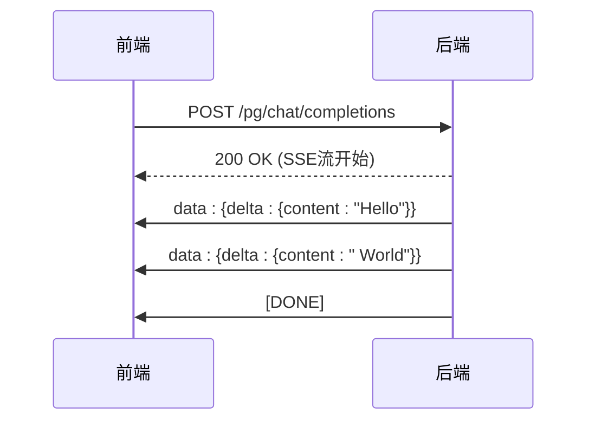
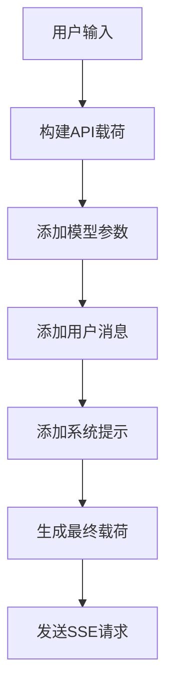
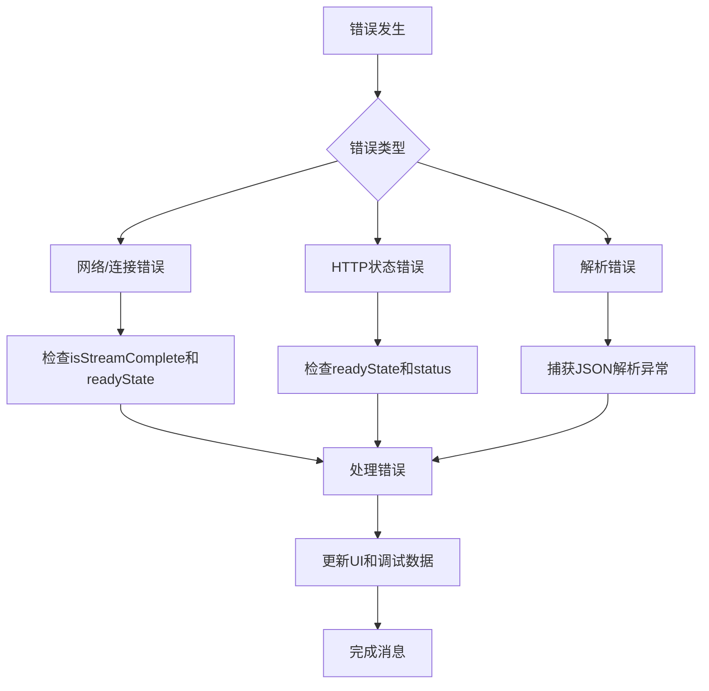
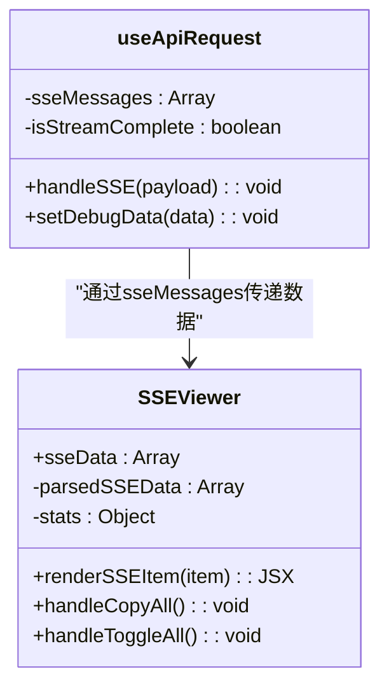
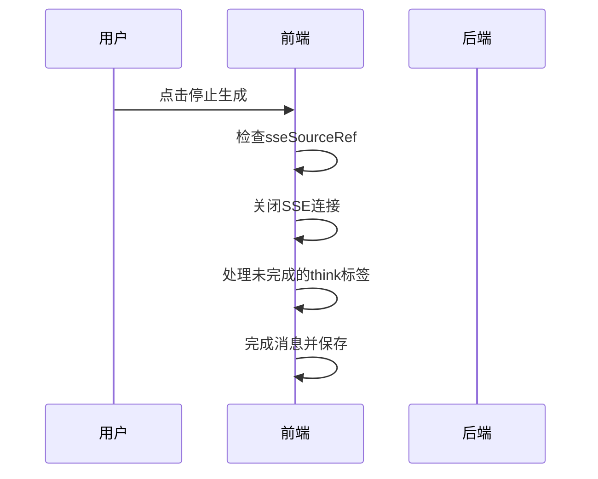
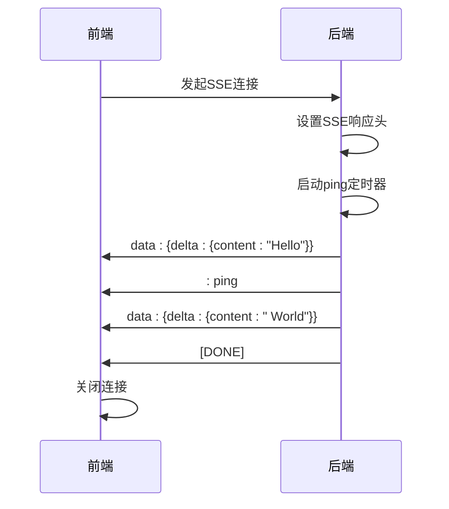

# 前端SSE客户端实现

<cite>
**本文档引用的文件**   
- [useApiRequest.jsx](file://web/src/hooks/playground/useApiRequest.jsx)
- [stream_scanner.go](file://relay/helper/stream_scanner.go)
- [SSEViewer.jsx](file://web/src/components/playground/SSEViewer.jsx)
- [playground.constants.js](file://web/src/constants/playground.constants.js)
- [usePlaygroundState.js](file://web/src/hooks/playground/usePlaygroundState.js)
- [api.js](file://web/src/helpers/api.js)
- [utils.jsx](file://web/src/helpers/utils.jsx)
- [index.jsx](file://web/src/pages/Playground/index.jsx)
</cite>

## 目录
1. [简介](#简介)
2. [核心组件](#核心组件)
3. [SSE连接建立](#sse连接建立)
4. [请求配置](#请求配置)
5. [数据流处理](#数据流处理)
6. [错误处理机制](#错误处理机制)
7. [调试与监控](#调试与监控)
8. [用户交互控制](#用户交互控制)
9. [前后端协同工作机制](#前后端协同工作机制)
10. [结论](#结论)

## 简介
本文档深入解析前端playground中SSE（Server-Sent Events）客户端的完整实现。基于`useApiRequest.jsx`中的`handleSSE`函数，详细说明如何使用`useApiRequest`钩子建立与后端的流式连接。文档将详细描述请求头和载荷的配置方法，分析message事件监听器如何处理数据流，包括[DATA]和[DONE]标记的识别与处理。同时，将解释错误处理机制，涵盖网络错误、解析错误和HTTP状态错误的区分与响应策略，并说明如何通过`sseMessages`状态跟踪完整的SSE消息序列用于调试。最后，文档将描述`onStopGenerator`如何实现用户主动停止生成的功能，并结合后端`stream_scanner.go`的实现，说明前后端在流式通信中的协同工作机制。

## 核心组件
前端SSE客户端的实现主要依赖于几个核心组件和钩子。`useApiRequest`钩子是SSE功能的核心，它封装了所有与SSE相关的逻辑，包括连接建立、数据流处理、错误处理和用户交互控制。该钩子通过`handleSSE`函数处理流式请求，通过`handleNonStreamRequest`处理非流式请求，并通过`onStopGenerator`提供停止生成的功能。

`usePlaygroundState`钩子负责管理playground页面的所有状态，包括用户输入、消息列表、调试数据等。其中，`sseSourceRef`是一个`useRef`对象，用于存储当前的SSE连接实例，使得多个组件可以安全地访问和操作同一个连接。

`SSEViewer`组件用于可视化展示SSE数据流，它接收来自`debugData`中的`sseMessages`数组，并将其格式化为可读的JSON格式，方便开发者调试和分析流式响应。

**Section sources**
- [useApiRequest.jsx](file://web/src/hooks/playground/useApiRequest.jsx#L289-L451)
- [usePlaygroundState.js](file://web/src/hooks/playground/usePlaygroundState.js#L110-L111)
- [SSEViewer.jsx](file://web/src/components/playground/SSEViewer.jsx#L32-L267)

## SSE连接建立
SSE连接的建立是通过`useApiRequest`钩子中的`handleSSE`函数实现的。该函数使用`SSE`库创建一个新的SSE连接实例。连接的URL由`API_ENDPOINTS.CHAT_COMPLETIONS`常量定义，指向后端的`/pg/chat/completions`端点。



**Diagram sources **
- [useApiRequest.jsx](file://web/src/hooks/playground/useApiRequest.jsx#L301-L308)
- [stream_scanner.go](file://relay/helper/stream_scanner.go#L37-L273)

**Section sources**
- [useApiRequest.jsx](file://web/src/hooks/playground/useApiRequest.jsx#L289-L451)
- [playground.constants.js](file://web/src/constants/playground.constants.js#L78-L81)

## 请求配置
SSE请求的配置包括请求头和请求体（载荷）两部分。请求头中包含`Content-Type`和`New-Api-User`两个关键字段。`Content-Type`设置为`application/json`，表明请求体是JSON格式。`New-Api-User`字段的值通过`getUserIdFromLocalStorage`函数从本地存储中获取用户的ID，用于后端的身份验证和用户识别。

请求体（载荷）是一个JSON对象，由`buildApiPayload`函数构建。该函数接收用户消息、系统提示、输入参数和参数启用状态作为输入，生成符合API要求的请求体。请求体中包含`model`、`group`、`messages`、`stream`等字段，以及根据`parameterEnabled`状态动态添加的其他参数，如`temperature`、`top_p`等。



**Diagram sources **
- [useApiRequest.jsx](file://web/src/hooks/playground/useApiRequest.jsx#L302-L308)
- [api.js](file://web/src/helpers/api.js#L98-L145)
- [utils.jsx](file://web/src/helpers/utils.jsx#L61-L66)

**Section sources**
- [useApiRequest.jsx](file://web/src/hooks/playground/useApiRequest.jsx#L302-L308)
- [api.js](file://web/src/helpers/api.js#L98-L145)

## 数据流处理
SSE数据流的处理是通过监听`message`事件实现的。当后端发送数据时，前端会接收到一个`message`事件，事件的`data`属性包含服务器发送的数据。`handleSSE`函数中的`message`事件监听器会解析这些数据，并根据数据内容更新UI。

数据流的处理逻辑如下：首先检查`data`是否为`[DONE]`，如果是，则关闭SSE连接，标记流正常完成，并调用`completeMessage`函数完成消息。如果不是`[DONE]`，则尝试将`data`解析为JSON对象。解析成功后，提取`choices[0].delta`中的`reasoning_content`、`reasoning`和`content`字段，并调用`streamMessageUpdate`函数更新消息内容。如果解析失败，则记录错误信息，并调用`completeMessage`函数以错误状态完成消息。

```mermaid
flowchart TD
A[收到message事件] --> B{data == [DONE]?}
B --> |是| C[关闭连接]
C --> D[完成消息]
B --> |否| E[解析JSON]
E --> F{解析成功?}
F --> |是| G[提取delta内容]
G --> H[更新消息]
F --> |否| I[记录错误]
I --> J[以错误完成消息]
```

**Diagram sources **
- [useApiRequest.jsx](file://web/src/hooks/playground/useApiRequest.jsx#L316-L373)

**Section sources**
- [useApiRequest.jsx](file://web/src/hooks/playground/useApiRequest.jsx#L316-L373)

## 错误处理机制
SSE客户端实现了多层次的错误处理机制，能够区分和处理不同类型的错误。错误处理主要通过监听`error`和`readystatechange`事件来实现。

`error`事件监听器处理网络错误和连接异常。当发生网络错误或连接中断时，会触发`error`事件。监听器会检查`isStreamComplete`标志位和`readyState`，只有在流未正常完成且连接状态异常时才处理错误。处理逻辑包括记录错误信息、更新调试数据、显示错误消息，并调用`completeMessage`函数以错误状态完成消息。

`readystatechange`事件监听器处理HTTP状态错误。当`readyState`大于等于2且`status`不为200时，表明发生了HTTP状态错误。处理逻辑与`error`事件类似，包括记录错误信息、更新调试数据、显示错误消息，并调用`completeMessage`函数以错误状态完成消息。

此外，在解析SSE消息时，如果`JSON.parse`失败，也会被捕获并作为解析错误处理。



**Diagram sources **
- [useApiRequest.jsx](file://web/src/hooks/playground/useApiRequest.jsx#L375-L425)

**Section sources**
- [useApiRequest.jsx](file://web/src/hooks/playground/useApiRequest.jsx#L375-L425)

## 调试与监控
为了便于调试和监控SSE通信过程，前端实现了`sseMessages`状态来跟踪完整的SSE消息序列。`sseMessages`是一个数组，存储了从连接建立到关闭期间接收到的所有SSE消息，包括原始的`data`字符串和`[DONE]`标记。

`SSEViewer`组件利用`sseMessages`状态，将SSE数据流以结构化的方式展示给开发者。它会解析每条消息，显示其JSON格式，并提供展开/收起、复制全部等功能。同时，`SSEViewer`还会统计消息总数、错误数和完成数，帮助开发者快速了解通信状态。



**Diagram sources **
- [SSEViewer.jsx](file://web/src/components/playground/SSEViewer.jsx#L32-L267)
- [useApiRequest.jsx](file://web/src/hooks/playground/useApiRequest.jsx#L296-L297)

**Section sources**
- [SSEViewer.jsx](file://web/src/components/playground/SSEViewer.jsx#L32-L267)
- [useApiRequest.jsx](file://web/src/hooks/playground/useApiRequest.jsx#L296-L297)

## 用户交互控制
用户可以通过点击“停止生成”按钮来主动停止SSE流的生成。这一功能由`onStopGenerator`函数实现。当用户触发停止操作时，`onStopGenerator`会首先检查`sseSourceRef.current`是否存在，如果存在，则调用其`close()`方法关闭SSE连接。

关闭连接后，函数会处理最后一条正在生成的消息。它会调用`processIncompleteThinkTags`函数处理可能未闭合的`<think>`标签，然后将消息状态更新为`COMPLETE`，并调用`saveMessages`函数保存更新后的消息列表。



**Diagram sources **
- [useApiRequest.jsx](file://web/src/hooks/playground/useApiRequest.jsx#L454-L495)

**Section sources**
- [useApiRequest.jsx](file://web/src/hooks/playground/useApiRequest.jsx#L454-L495)

## 前后端协同工作机制
前端SSE客户端与后端`stream_scanner.go`模块协同工作，实现高效的流式通信。后端使用`bufio.Scanner`读取响应体，并通过`SetEventStreamHeaders`设置SSE响应头。后端还实现了ping机制，定期发送ping数据以保持连接活跃，防止超时。

前端通过`handleSSE`函数建立连接，并通过`message`事件监听器接收数据。当接收到`[DONE]`标记时，前端会关闭连接，完成消息。如果连接因超时或错误中断，前端会根据错误类型进行相应的处理。



**Diagram sources **
- [useApiRequest.jsx](file://web/src/hooks/playground/useApiRequest.jsx#L301-L308)
- [stream_scanner.go](file://relay/helper/stream_scanner.go#L37-L273)

**Section sources**
- [useApiRequest.jsx](file://web/src/hooks/playground/useApiRequest.jsx#L301-L308)
- [stream_scanner.go](file://relay/helper/stream_scanner.go#L37-L273)

## 结论
本文档详细解析了前端playground中SSE客户端的完整实现。通过`useApiRequest`钩子，前端能够高效地建立与后端的流式连接，处理数据流，并提供完善的错误处理和用户交互控制。`sseMessages`状态和`SSEViewer`组件为调试和监控提供了强大的支持。前后端通过SSE协议和`stream_scanner.go`模块的协同工作，实现了稳定、高效的流式通信。这一实现为用户提供了一个流畅、实时的交互体验。