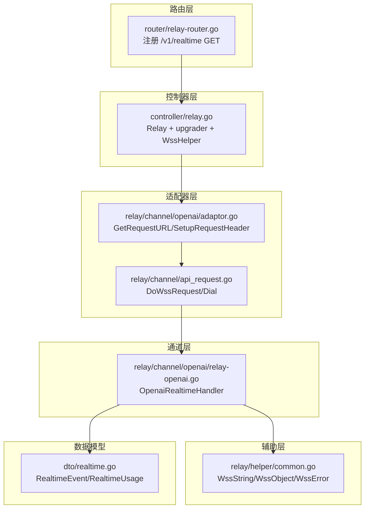
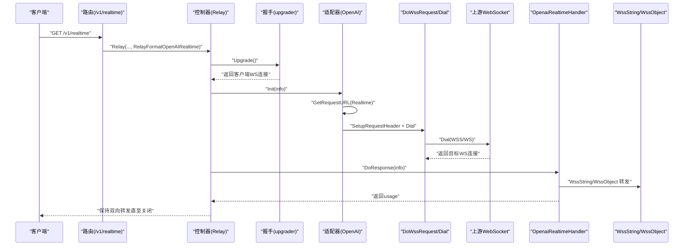
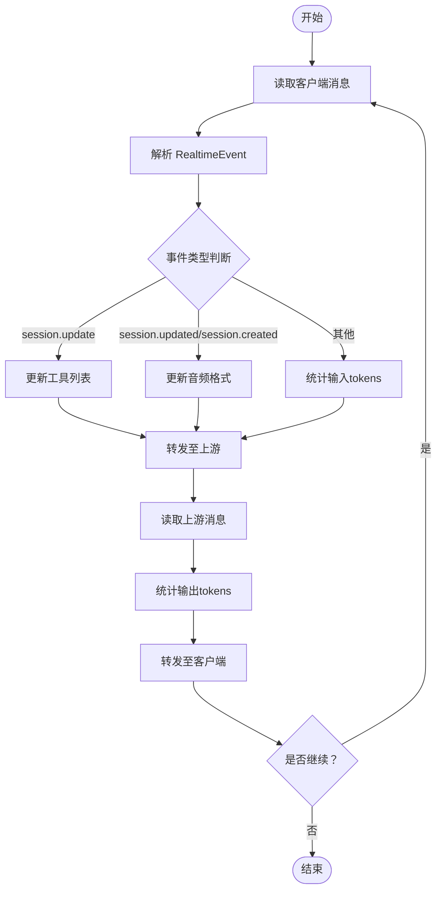
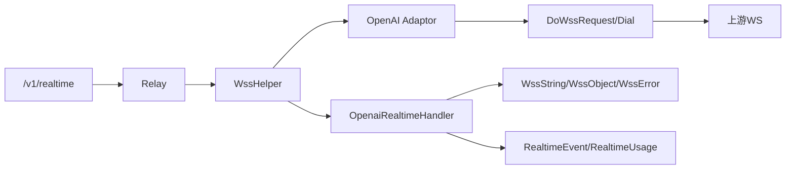

# WebSocket协议处理

<cite>
**本文引用的文件列表**
- [controller/relay.go](file://controller/relay.go)
- [relay/websocket.go](file://relay/websocket.go)
- [relay/channel/openai/relay-openai.go](file://relay/channel/openai/relay-openai.go)
- [relay/channel/openai/adaptor.go](file://relay/channel/openai/adaptor.go)
- [relay/channel/api_request.go](file://relay/channel/api_request.go)
- [relay/helper/common.go](file://relay/helper/common.go)
- [dto/realtime.go](file://dto/realtime.go)
- [router/relay-router.go](file://router/relay-router.go)
- [relay/common/relay_info.go](file://relay/common/relay_info.go)
- [docs/openapi/relay.json](file://docs/openapi/relay.json)
</cite>

## 目录
1. [引言](#引言)
2. [项目结构](#项目结构)
3. [核心组件](#核心组件)
4. [架构总览](#架构总览)
5. [详细组件分析](#详细组件分析)
6. [依赖关系分析](#依赖关系分析)
7. [性能考量](#性能考量)
8. [故障排查指南](#故障排查指南)
9. [结论](#结论)
10. [附录：客户端连接示例与常见问题](#附录客户端连接示例与常见问题)

## 引言
本文件系统性梳理 new-api 中基于 WebSocket 的 OpenAI 实时会话（Realtime API）实现机制，覆盖从路由入口、握手升级、适配器与上游连接、双通道转发、消息类型与数据结构、连接生命周期管理（心跳、错误处理、资源清理）等关键环节，并提供客户端连接示例与常见问题排查建议，帮助开发者快速理解与集成。

## 项目结构
围绕 WebSocket 实时会话的关键目录与文件：
- 路由层：定义 /v1/realtime WebSocket 入口，统一交由 Relay 控制器处理
- 控制器层：完成鉴权、参数校验、渠道选择、握手升级与错误回传
- 适配器层：OpenAI 适配器负责请求 URL 构造、协议头设置、DoRequest/DoResponse 分发
- 通道层：OpenAI 实时处理器实现双通道转发与计费统计
- 辅助层：通用 WebSocket 工具（发送字符串/对象、错误事件封装）
- 数据模型：RealtimeEvent 及其相关结构体，承载消息类型与数据载荷

图表来源
- [router/relay-router.go](file://router/relay-router.go#L67-L73)
- [controller/relay.go](file://controller/relay.go#L64-L103)
- [relay/channel/openai/adaptor.go](file://relay/channel/openai/adaptor.go#L110-L200)
- [relay/channel/api_request.go](file://relay/channel/api_request.go#L125-L151)
- [relay/channel/openai/relay-openai.go](file://relay/channel/openai/relay-openai.go#L293-L552)
- [relay/helper/common.go](file://relay/helper/common.go#L124-L156)
- [dto/realtime.go](file://dto/realtime.go#L1-L89)

章节来源
- [router/relay-router.go](file://router/relay-router.go#L67-L73)
- [controller/relay.go](file://controller/relay.go#L64-L103)

## 核心组件
- WebSocket 路由入口：/v1/realtime GET，绑定到 Relay 并指定格式为 OpenAI Realtime
- 握手升级器：upgrader 配置子协议为 "realtime"，允许跨域
- 适配器：OpenAI 适配器负责将下游 WebSocket URL 从 HTTPS/HTTP 映射为 WSS/WS，并设置 Sec-WebSocket-Protocol 头
- 上游连接：DoWssRequest 通过 websocket.DefaultDialer 建立到上游的 WebSocket 连接
- 双通道处理器：OpenaiRealtimeHandler 实现客户端到上游、上游到客户端的双向转发
- 事件工具：WssString/WssObject/WssError 提供消息发送与错误事件封装
- 数据模型：dto/realtime.go 定义 RealtimeEvent 与 RealtimeUsage，承载会话更新、消息项、音频增量、函数调用参数等

章节来源
- [router/relay-router.go](file://router/relay-router.go#L67-L73)
- [controller/relay.go](file://controller/relay.go#L208-L213)
- [relay/channel/openai/adaptor.go](file://relay/channel/openai/adaptor.go#L110-L200)
- [relay/channel/api_request.go](file://relay/channel/api_request.go#L125-L151)
- [relay/channel/openai/relay-openai.go](file://relay/channel/openai/relay-openai.go#L293-L552)
- [relay/helper/common.go](file://relay/helper/common.go#L124-L156)
- [dto/realtime.go](file://dto/realtime.go#L1-L89)

## 架构总览
下图展示从客户端到上游 OpenAI Realtime 的完整链路：路由 -> 控制器 -> 适配器 -> 上游 WebSocket -> 双通道转发 -> 计费统计。

图表来源
- [router/relay-router.go](file://router/relay-router.go#L67-L73)
- [controller/relay.go](file://controller/relay.go#L64-L103)
- [controller/relay.go](file://controller/relay.go#L208-L213)
- [relay/channel/openai/adaptor.go](file://relay/channel/openai/adaptor.go#L110-L200)
- [relay/channel/api_request.go](file://relay/channel/api_request.go#L125-L151)
- [relay/channel/openai/relay-openai.go](file://relay/channel/openai/relay-openai.go#L293-L552)
- [relay/helper/common.go](file://relay/helper/common.go#L124-L156)

## 详细组件分析

### WebSocket 连接升级与握手
- 路由注册：/v1/realtime GET 绑定到 Relay，RelayFormatOpenAIRealtime 指示实时会话
- 握手升级：upgrader 配置子协议为 "realtime"，CheckOrigin 返回 true 允许跨域
- 错误处理：升级失败时通过 helper.WssError 发送 "error" 类型事件并结束

章节来源
- [router/relay-router.go](file://router/relay-router.go#L67-L73)
- [controller/relay.go](file://controller/relay.go#L64-L103)
- [controller/relay.go](file://controller/relay.go#L208-L213)
- [relay/helper/common.go](file://relay/helper/common.go#L146-L156)

### WssHelper 初始化与上游连接
- WssHelper 负责：
  - 初始化通道元信息
  - 获取适配器并初始化
  - 调用适配器 DoRequest 建立上游 WebSocket 连接
  - 调用适配器 DoResponse 执行实时转发与计费
- 上游连接：DoWssRequest 通过 websocket.DefaultDialer.Dial 建立连接，适配器设置 Content-Type 与 Sec-WebSocket-Protocol 头

章节来源
- [relay/websocket.go](file://relay/websocket.go#L15-L46)
- [relay/channel/api_request.go](file://relay/channel/api_request.go#L125-L151)
- [relay/channel/openai/adaptor.go](file://relay/channel/openai/adaptor.go#L181-L200)

### OpenaiRealtimeHandler 双通道通信模式
- 双通道并发读取：
  - 客户端到上游：读取客户端 WS 消息，解析 RealtimeEvent，统计输入 token，转发给上游
  - 上游到客户端：读取上游 WS 消息，解析 RealtimeEvent，统计输出 token，转发给客户端
- 关键逻辑：
  - 识别 session.update/session.updated/session.created 更新音频格式
  - 识别 response.create/response.done 等事件进行计费统计
  - 使用 helper.WssString/WssObject 进行消息发送
  - 使用 errChan、clientClosed、targetClosed 统一错误与关闭处理
- 计费统计：preConsumeUsage 累加 input/output tokens，最终汇总 usage 返回

图表来源
- [relay/channel/openai/relay-openai.go](file://relay/channel/openai/relay-openai.go#L293-L552)

章节来源
- [relay/channel/openai/relay-openai.go](file://relay/channel/openai/relay-openai.go#L293-L552)

### 消息类型与数据结构（dto/realtime.go）
- 常见事件类型：
  - 会话控制：session.update、session.updated、session.created
  - 会话项：conversation.item.create、conversation.item.created
  - 响应流：response.create、response.done
  - 音频与转写：response.audio.delta、response.audio_transcript.delta
  - 函数调用：response.function_call_arguments.delta、response.function_call_arguments.done
- 数据结构要点：
  - RealtimeEvent：包含 event_id、type、session/item/response/error/audio/delta 等字段
  - RealtimeUsage：包含 total/input/output tokens 与明细
  - RealtimeSession/RealtimeItem/RealtimeContent：会话、消息项与内容载体

章节来源
- [dto/realtime.go](file://dto/realtime.go#L1-L89)

### 连接生命周期管理
- 心跳与保活：
  - 适配器在 Realtime 模式下设置 Sec-WebSocket-Protocol 头，包含 "realtime"、"openai-beta.realtime-v1" 等
  - 通用流式场景有 PingData 与定时器保活（用于 SSE/流式），WebSocket 实时路径主要依赖上游连接保活
- 错误处理：
  - 升级失败：helper.WssError 发送 "error" 事件
  - 转发错误：errChan 汇聚错误，记录日志并触发关闭
  - 关闭语义：正常关闭与异常关闭区分处理
- 资源清理：
  - defer 关闭上游 WebSocket
  - 适配器 DoResponse 返回后进行配额消费与后置计费

章节来源
- [relay/channel/openai/adaptor.go](file://relay/channel/openai/adaptor.go#L181-L200)
- [relay/helper/common.go](file://relay/helper/common.go#L146-L156)
- [relay/channel/openai/relay-openai.go](file://relay/channel/openai/relay-openai.go#L293-L552)
- [relay/websocket.go](file://relay/websocket.go#L15-L46)

## 依赖关系分析
- 路由到控制器：/v1/realtime -> Relay(RelayFormatOpenAIRealtime)
- 控制器到适配器：Relay -> WssHelper -> GetAdaptor -> DoRequest/DoResponse
- 适配器到上游：GetRequestURL 将 HTTPS/HTTP 映射为 WSS/WS；SetupRequestHeader 设置协议头
- 适配器到通道：DoResponse 在 Realtime 模式下调用 OpenaiRealtimeHandler
- 通道到工具：WssString/WssObject/WssError 用于消息发送与错误事件
- 通道到数据模型：RealtimeEvent/RealtimeUsage 作为消息与计费载体

图表来源
- [router/relay-router.go](file://router/relay-router.go#L67-L73)
- [controller/relay.go](file://controller/relay.go#L64-L103)
- [relay/websocket.go](file://relay/websocket.go#L15-L46)
- [relay/channel/openai/adaptor.go](file://relay/channel/openai/adaptor.go#L110-L200)
- [relay/channel/api_request.go](file://relay/channel/api_request.go#L125-L151)
- [relay/channel/openai/relay-openai.go](file://relay/channel/openai/relay-openai.go#L293-L552)
- [relay/helper/common.go](file://relay/helper/common.go#L124-L156)
- [dto/realtime.go](file://dto/realtime.go#L1-L89)

章节来源
- [router/relay-router.go](file://router/relay-router.go#L67-L73)
- [controller/relay.go](file://controller/relay.go#L64-L103)
- [relay/websocket.go](file://relay/websocket.go#L15-L46)
- [relay/channel/openai/adaptor.go](file://relay/channel/openai/adaptor.go#L110-L200)
- [relay/channel/api_request.go](file://relay/channel/api_request.go#L125-L151)
- [relay/channel/openai/relay-openai.go](file://relay/channel/openai/relay-openai.go#L293-L552)
- [relay/helper/common.go](file://relay/helper/common.go#L124-L156)
- [dto/realtime.go](file://dto/realtime.go#L1-L89)

## 性能考量
- 并发转发：双通道使用 goroutine 并发读取，避免阻塞
- 缓冲队列：send/receive chan 带缓冲，降低阻塞概率
- 计费粒度：按事件类型统计 input/output tokens，减少重复计算
- 连接复用：上游 WebSocket 由适配器统一建立与关闭，避免泄漏
- 超时与保活：上游连接保活策略由上游服务决定；本地未实现额外心跳定时器

[本节为通用性能讨论，无需列出具体文件来源]

## 故障排查指南
- 升级失败：
  - 检查子协议是否包含 "realtime"
  - 查看控制器错误回传："error" 事件
- 上游连接失败：
  - 确认上游基础地址是否为 WSS/WS
  - 检查 Sec-WebSocket-Protocol 头是否正确设置
- 转发异常：
  - 观察 errChan 日志，定位读写错误
  - 区分客户端/上游关闭语义
- 计费异常：
  - 确认 RealtimeEvent 类型是否被正确识别
  - 核对 input/output tokens 统计是否累加

章节来源
- [controller/relay.go](file://controller/relay.go#L208-L213)
- [relay/helper/common.go](file://relay/helper/common.go#L146-L156)
- [relay/channel/openai/relay-openai.go](file://relay/channel/openai/relay-openai.go#L293-L552)
- [relay/channel/openai/adaptor.go](file://relay/channel/openai/adaptor.go#L181-L200)

## 结论
new-api 的 OpenAI 实时会话通过清晰的分层设计实现了从路由、握手、适配器、上游连接到双通道转发与计费统计的完整闭环。OpenaiRealtimeHandler 采用双通道并发模型，结合 RealtimeEvent 类型识别与令牌统计，满足实时语音与文本交互的低延迟需求。配合 WssError 与错误通道机制，整体具备良好的错误处理与资源清理能力。

[本节为总结性内容，无需列出具体文件来源]

## 附录：客户端连接示例与常见问题

### 客户端建立 WebSocket 连接的步骤
- 路由与鉴权：
  - 使用 GET /v1/realtime 建立 WebSocket 连接
  - 该端点在 OpenAPI 文档中标注为 WebSocket 协议切换（101）
- 子协议与头部：
  - 客户端需在握手时声明子协议 "realtime"
  - 服务端 upgrader 已允许 "realtime"
- 请求参数：
  - 可通过查询参数指定模型（如 model=gpt-4o-realtime-preview）

章节来源
- [docs/openapi/relay.json](file://docs/openapi/relay.json#L1831-L1880)
- [router/relay-router.go](file://router/relay-router.go#L67-L73)
- [controller/relay.go](file://controller/relay.go#L208-L213)

### 常见连接失败排查清单
- 子协议不匹配：确认客户端声明了 "realtime" 子协议
- 跨域问题：服务端 upgrader 允许跨域，若仍失败检查代理/网关配置
- 上游地址协议：确保上游基础地址映射为 WSS/WS（适配器已自动转换）
- 认证与密钥：确认 Authorization/密钥设置正确
- 服务端错误事件：关注 "error" 事件内容，定位具体原因

章节来源
- [controller/relay.go](file://controller/relay.go#L208-L213)
- [relay/channel/openai/adaptor.go](file://relay/channel/openai/adaptor.go#L110-L200)
- [relay/helper/common.go](file://relay/helper/common.go#L146-L156)