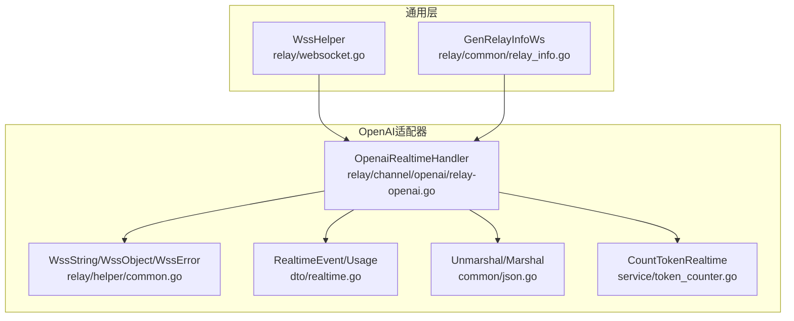
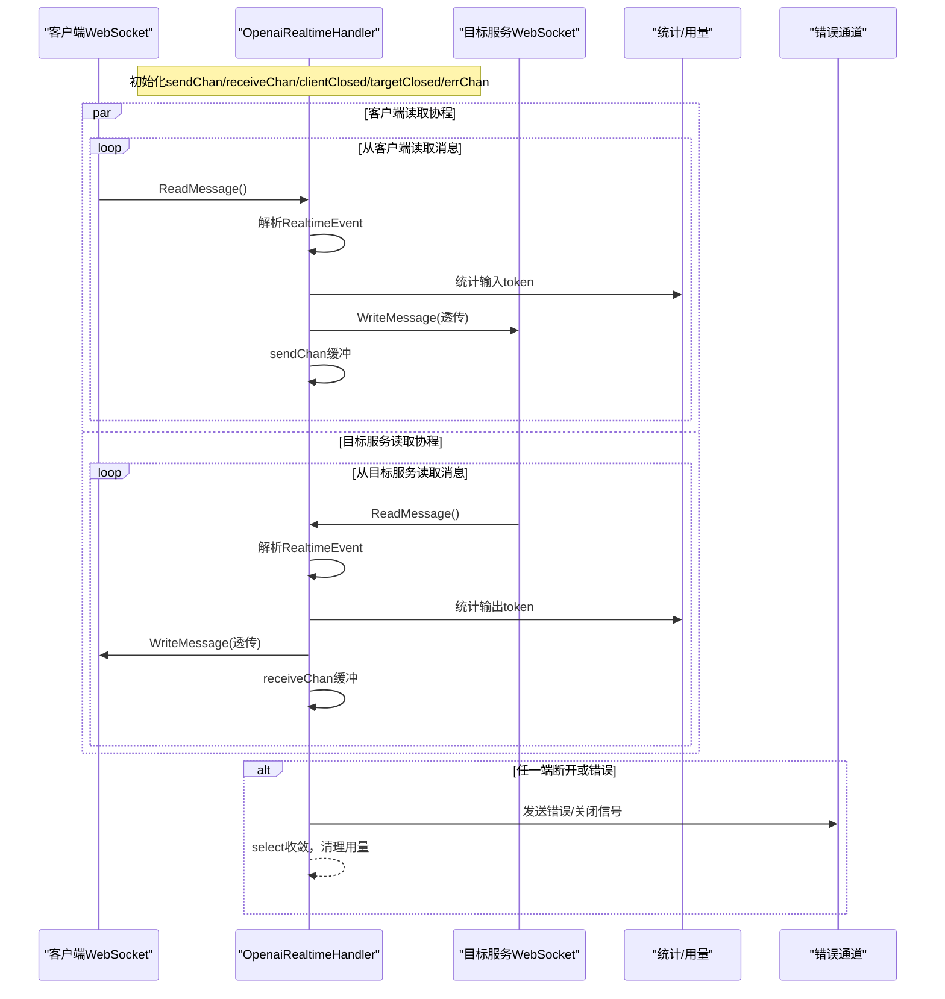
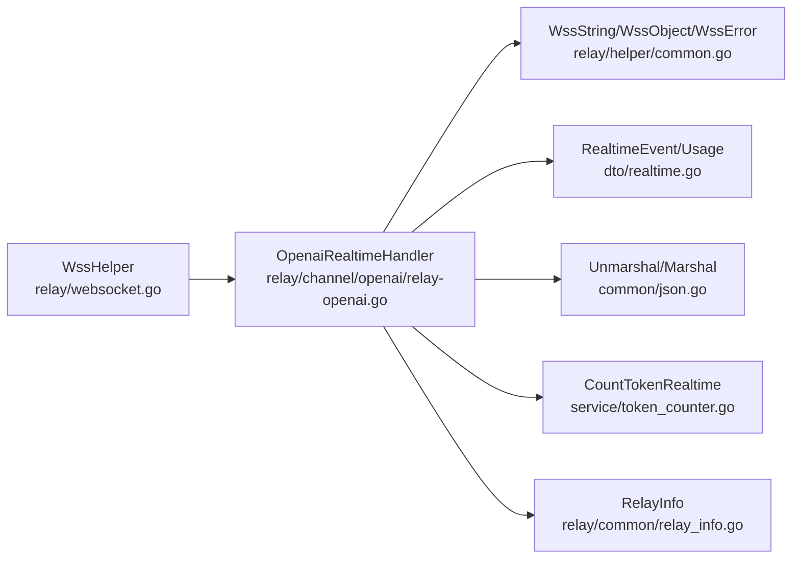

# WebSocket消息转发

<cite>
**本文引用的文件列表**
- [relay-openai.go](file://relay/channel/openai/relay-openai.go)
- [common.go](file://relay/helper/common.go)
- [realtime.go](file://dto/realtime.go)
- [websocket.go](file://relay/websocket.go)
- [relay_info.go](file://relay/common/relay_info.go)
- [json.go](file://common/json.go)
- [token_counter.go](file://service/token_counter.go)
</cite>

## 目录
1. [简介](#简介)
2. [项目结构与入口](#项目结构与入口)
3. [核心组件](#核心组件)
4. [架构总览](#架构总览)
5. [关键流程详解](#关键流程详解)
6. [依赖关系分析](#依赖关系分析)
7. [性能与可靠性考量](#性能与可靠性考量)
8. [故障排查指南](#故障排查指南)
9. [结论](#结论)

## 简介
本文件聚焦于new-api中OpenAI实时（Realtime）WebSocket双向消息转发的实现机制，系统性解析OpenaiRealtimeHandler函数的双goroutine并发模式、通道缓冲策略、连接状态同步、消息解析与透传、以及helper.WssString的安全写入与错误处理。文档旨在帮助读者快速理解并高效维护该模块。

## 项目结构与入口
- WebSocket接入与适配器调用位于通用转发层，随后由OpenAI适配器执行具体逻辑。
- 入口路径概览：
  - 通用WebSocket辅助：relay/websocket.go
  - OpenAI适配器：relay/channel/openai/relay-openai.go
  - 实时事件数据结构：dto/realtime.go
  - 写入工具与错误封装：relay/helper/common.go
  - JSON编解码：common/json.go
  - 实时Token统计：service/token_counter.go
  - 连接信息初始化：relay/common/relay_info.go

图表来源
- [websocket.go](file://relay/websocket.go#L1-L47)
- [relay-openai.go](file://relay/channel/openai/relay-openai.go#L329-L534)
- [common.go](file://relay/helper/common.go#L124-L156)
- [realtime.go](file://dto/realtime.go#L1-L89)
- [json.go](file://common/json.go#L1-L46)
- [token_counter.go](file://service/token_counter.go#L344-L396)
- [relay_info.go](file://relay/common/relay_info.go#L277-L285)

章节来源
- [websocket.go](file://relay/websocket.go#L1-L47)
- [relay_info.go](file://relay/common/relay_info.go#L277-L285)

## 核心组件
- 双goroutine并发转发器：OpenaiRealtimeHandler
  - 一个goroutine从客户端读取消息并转发至目标服务，同时进行实时事件解析与token统计。
  - 另一个goroutine从目标服务读取消息并转发回客户端，同时进行实时事件解析与token统计。
- 通道缓冲：
  - sendChan：用于记录发送侧消息，便于后续统计或审计。
  - receiveChan：用于记录接收侧消息，便于后续统计或审计。
- 连接状态同步：
  - clientClosed：当客户端断开（非正常关闭）时触发。
  - targetClosed：当目标服务断开（非正常关闭）时触发。
- 错误通道：
  - errChan：收集读写异常、panic等错误，统一汇聚到select中处理。
- 写入工具：
  - helper.WssString：以文本帧安全写入WebSocket，返回错误以便上层处理。
- 实时事件数据结构：
  - dto.RealtimeEvent：承载type、session、item、response、delta、audio等字段，驱动透传与统计。

章节来源
- [relay-openai.go](file://relay/channel/openai/relay-openai.go#L338-L534)
- [common.go](file://relay/helper/common.go#L124-L156)
- [realtime.go](file://dto/realtime.go#L1-L89)

## 架构总览
OpenaiRealtimeHandler采用“双读一写”的并发模式，通过select统一监听客户端、目标服务、错误与上下文取消，确保任一端断开或出错都能及时退出并汇总用量。

图表来源
- [relay-openai.go](file://relay/channel/openai/relay-openai.go#L329-L534)
- [common.go](file://relay/helper/common.go#L124-L156)
- [token_counter.go](file://service/token_counter.go#L344-L396)

## 关键流程详解

### 1. 并发模式与通道缓冲
- 两个goroutine分别负责：
  - 客户端到目标服务：读取消息 -> 解析RealtimeEvent -> 统计输入token -> 透传写入目标服务 -> sendChan缓冲。
  - 目标服务到客户端：读取消息 -> 解析RealtimeEvent -> 统计输出token -> 透传写入客户端 -> receiveChan缓冲。
- 通道容量均为100，作为轻量级环形缓冲，避免阻塞；默认分支用于丢弃溢出，保证转发主链路不被阻塞。

章节来源
- [relay-openai.go](file://relay/channel/openai/relay-openai.go#L348-L512)

### 2. 连接状态同步
- clientClosed与targetClosed均为无缓冲通道，用于在读取失败且非正常关闭时通知select提前退出。
- select优先级：客户端断开、目标服务断开、errChan错误、c.Done()取消。
- 一旦任一通道被触发，立即记录日志并进入收尾阶段。

章节来源
- [relay-openai.go](file://relay/channel/openai/relay-openai.go#L338-L534)

### 3. RealtimeEvent解析与透传
- 使用common.Unmarshal将原始字节解码为dto.RealtimeEvent，依据type分支处理：
  - session.update：更新工具列表到info.RealtimeTools，供后续response.done时统计工具token。
  - session.updated/session.created：更新音频格式（输入/输出），影响后续音频token统计。
  - response.done：合并usage到当前批次usage，触发预扣费并清空批次。
  - 其他事件：根据内容类型分别统计文本token或音频token。
- 透传阶段直接将原始消息字符串写入对端，保持协议一致性。

章节来源
- [relay-openai.go](file://relay/channel/openai/relay-openai.go#L368-L510)
- [realtime.go](file://dto/realtime.go#L1-L89)
- [json.go](file://common/json.go#L1-L25)

### 4. helper.WssString安全写入与错误处理
- WssString负责：
  - 参数校验（ws非空）。
  - 以文本帧写入WebSocket。
  - 返回错误，便于上层统一处理。
- 在客户端/目标服务写入失败时，均会通过errChan上报并触发select收敛，确保及时退出。

章节来源
- [common.go](file://relay/helper/common.go#L124-L156)
- [relay-openai.go](file://relay/channel/openai/relay-openai.go#L394-L501)

### 5. Token统计与用量汇总
- 输入token统计：
  - session.update：按instructions估算文本token。
  - input_audio_buffer.append：按音频时长估算音频token。
  - conversation.item.created（message/input_text）：按文本估算token。
- 输出token统计：
  - response.audio.delta：按音频时长估算音频token。
  - response.audio_transcript.delta / response.function_call_arguments.delta：按文本估算token。
  - response.done：按工具定义估算工具token。
- 用量汇总：
  - 响应done事件后，将当前批次usage预扣费并清空。
  - 请求结束时，若存在localUsage则同样预扣费并累加到sumUsage。

章节来源
- [token_counter.go](file://service/token_counter.go#L344-L396)
- [relay-openai.go](file://relay/channel/openai/relay-openai.go#L383-L510)

### 6. 通道缓冲的作用与边界
- sendChan/receiveChan容量为100，用于：
  - 记录最近的消息体，便于后续审计或二次处理（如用量统计）。
  - 避免转发主链路因下游慢消费而阻塞。
- 默认分支丢弃溢出，确保不会阻塞读写主循环。

章节来源
- [relay-openai.go](file://relay/channel/openai/relay-openai.go#L340-L404)

### 7. 错误处理与panic恢复
- 读取goroutine内部使用defer recover捕获panic，统一通过errChan上报。
- 读取失败时区分正常关闭与异常错误，异常错误通过errChan上报。
- select收敛后统一记录日志并进行用量预扣费。

章节来源
- [relay-openai.go](file://relay/channel/openai/relay-openai.go#L348-L534)

## 依赖关系分析

图表来源
- [relay-openai.go](file://relay/channel/openai/relay-openai.go#L329-L534)
- [common.go](file://relay/helper/common.go#L124-L156)
- [realtime.go](file://dto/realtime.go#L1-L89)
- [json.go](file://common/json.go#L1-L25)
- [token_counter.go](file://service/token_counter.go#L344-L396)
- [relay_info.go](file://relay/common/relay_info.go#L277-L285)
- [websocket.go](file://relay/websocket.go#L1-L47)

章节来源
- [relay-openai.go](file://relay/channel/openai/relay-openai.go#L329-L534)
- [websocket.go](file://relay/websocket.go#L1-L47)

## 性能与可靠性考量
- 并发模型：
  - 双goroutine独立读写，避免互相阻塞，提升吞吐。
  - 通道容量适中（100），兼顾内存占用与背压能力。
- 资源管理：
  - 读取goroutine内recover，防止panic导致进程崩溃。
  - select统一收敛，确保异常与取消场景下的有序退出。
- 统计准确性：
  - 严格区分输入/输出token来源，避免重复或遗漏。
  - response.done时即时预扣费，降低最终结算复杂度。
- 可靠性：
  - 非正常关闭（非CloseNormalClosure/CloseGoingAway）才视为错误，避免误报。
  - 写入失败统一上报，便于上层重试或降级。

[本节为通用建议，无需列出具体文件来源]

## 故障排查指南
- 常见问题定位
  - 客户端/目标服务频繁断开：检查clientClosed/targetClosed是否被触发，查看errChan中的错误类型。
  - 写入失败：确认helper.WssString返回的错误，核对对端连接状态与网络状况。
  - 用量异常：核对RealtimeEvent.type分支是否正确统计（音频/文本/工具）。
- 排查步骤
  - 查看OpenaiRealtimeHandler中的日志输出，定位事件类型与token统计点。
  - 检查dto.RealtimeEvent字段是否完整，必要时增加调试打印。
  - 核对音频格式字段（input_audio_format/output_audio_format）是否正确更新。
- 相关参考
  - 错误通道与panic恢复：OpenaiRealtimeHandler中errChan与defer recover。
  - 写入工具：helper.WssString的参数校验与错误返回。
  - 事件解析：common.Unmarshal与dto.RealtimeEvent字段映射。

章节来源
- [relay-openai.go](file://relay/channel/openai/relay-openai.go#L338-L534)
- [common.go](file://relay/helper/common.go#L124-L156)
- [realtime.go](file://dto/realtime.go#L1-L89)

## 结论
OpenaiRealtimeHandler通过双goroutine并发与通道缓冲实现了高可靠、低延迟的WebSocket双向消息转发。借助dto.RealtimeEvent的结构化解析与service.CountTokenRealtime的细粒度统计，系统在保证协议透传的同时，精确计量了输入/输出token并支持预扣费。配合helper.WssString的安全写入与统一错误收敛，整体具备良好的可维护性与可观测性。