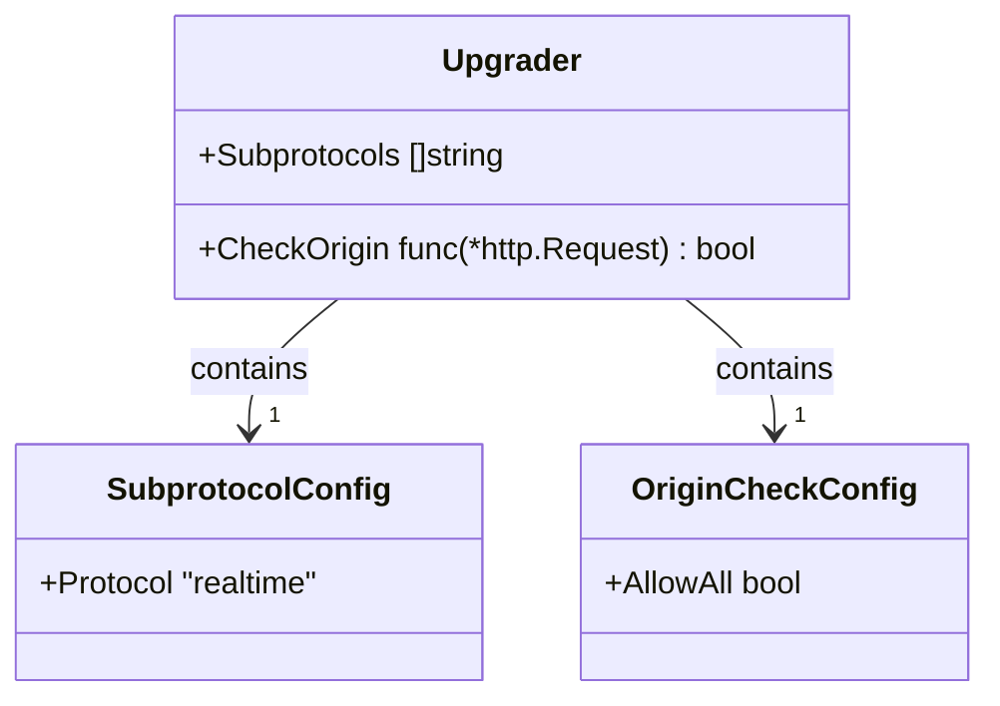
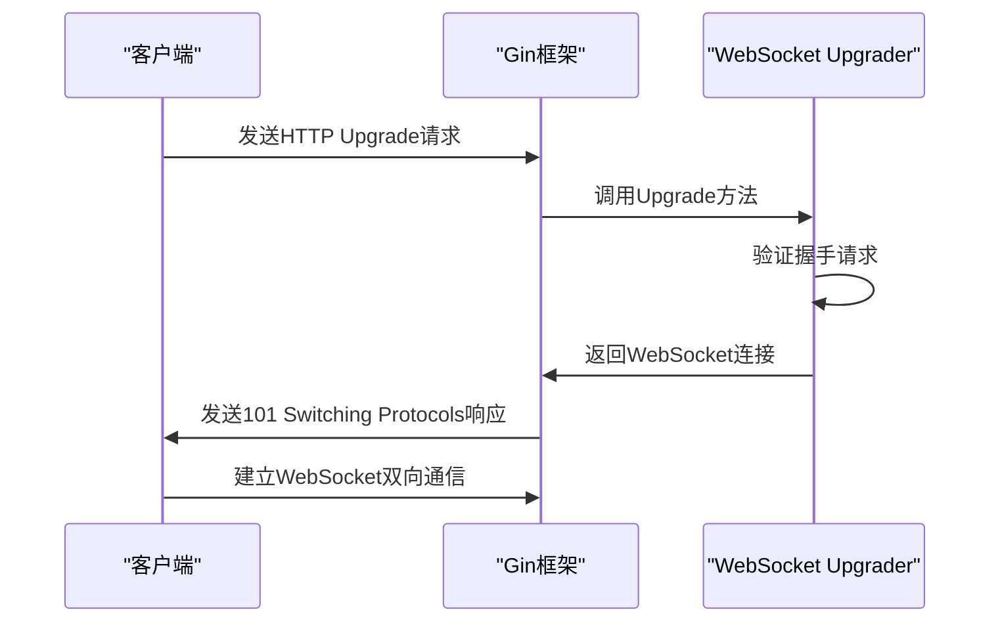
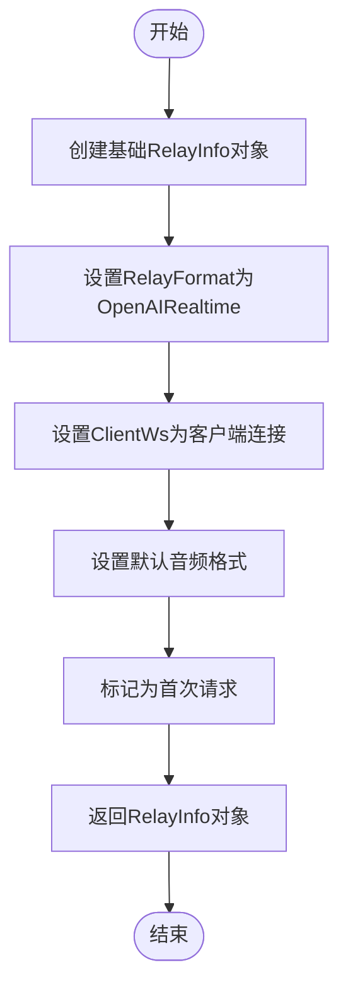
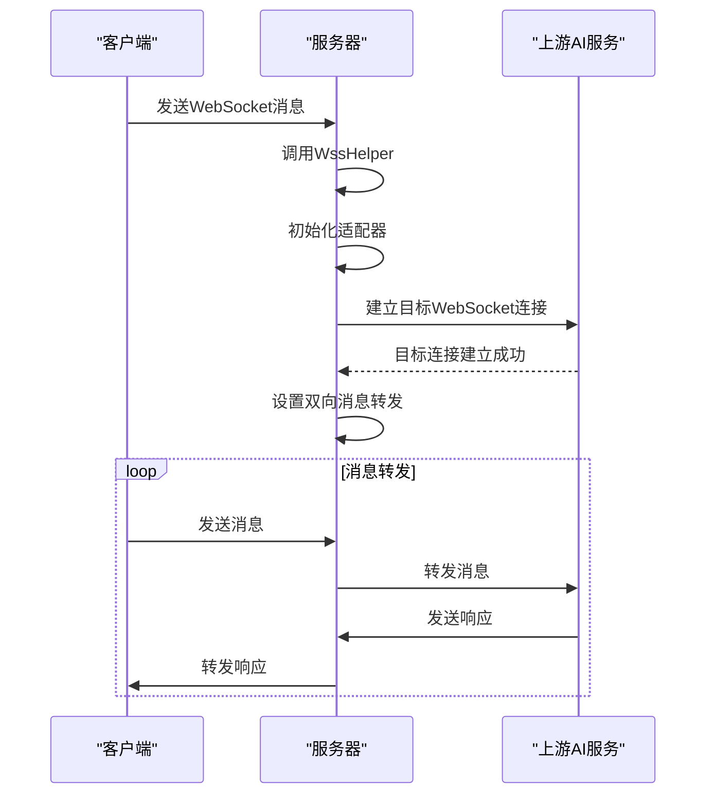

# WebSocket连接处理

<cite>
**本文档引用的文件**   
- [controller/relay.go](file://controller/relay.go#L208-L251)
- [relay/common/relay_info.go](file://relay/common/relay_info.go#L277-L285)
- [relay/websocket.go](file://relay/websocket.go#L15-L46)
- [relay/channel/openai/relay-openai.go](file://relay/channel/openai/relay-openai.go#L329-L552)
- [relay/channel/api_request.go](file://relay/channel/api_request.go#L125-L151)
- [relay/helper/common.go](file://relay/helper/common.go#L146-L156)

## 目录
1. [WebSocket连接建立](#websocket连接建立)
2. [upgrader配置分析](#upgrader配置分析)
3. [Relay函数中的连接升级](#relay函数中的连接升级)
4. [RelayInfo对象创建](#relayinfo对象创建)
5. [目标连接初始化](#目标连接初始化)
6. [上下文管理与资源清理](#上下文管理与资源清理)

## WebSocket连接建立

WebSocket连接的建立始于客户端向服务器发送HTTP升级请求。在new-api项目中，该过程通过Gin框架的路由配置触发。当客户端请求`/v1/realtime`端点时，系统会调用`controller.Relay`函数，并传入`types.RelayFormatOpenAIRealtime`格式参数，指示这是一个实时WebSocket连接请求。

整个连接建立流程遵循标准的WebSocket握手协议，服务器通过`gorilla/websocket`库提供的`Upgrader`对象将HTTP连接升级为WebSocket连接。成功升级后，服务器与客户端之间建立了一个双向通信通道，允许实时数据交换。

## upgrader配置分析

在`controller/relay.go`文件中，定义了一个全局的`upgrader`变量，用于配置WebSocket连接的升级过程。该变量的配置包含两个关键属性：`Subprotocols`和`CheckOrigin`。



**Diagram sources**
- [controller/relay.go](file://controller/relay.go#L208-L213)

### Subprotocols配置

`Subprotocols`字段被设置为包含单个字符串`"realtime"`的切片。这表明服务器支持`realtime`子协议，允许客户端在握手过程中通过`Sec-WebSocket-Protocol`头部指定使用该协议。此配置确保了客户端和服务器之间在WebSocket连接上使用一致的通信协议，为实时AI交互提供了标准化的通信基础。

```go
var upgrader = websocket.Upgrader{
    Subprotocols: []string{"realtime"}, // WS 握手支持的协议，如果有使用 Sec-WebSocket-Protocol，则必须在此声明对应的 Protocol TODO add other protocol
    CheckOrigin: func(r *http.Request) bool {
        return true // 允许跨域
    },
}
```

### CheckOrigin跨域策略

`CheckOrigin`字段被配置为一个始终返回`true`的匿名函数，实现了宽松的跨域资源共享（CORS）策略。这种配置允许来自任何源的客户端建立WebSocket连接，极大地提高了API的可用性和灵活性。虽然这种配置在生产环境中可能存在安全风险，但在当前实现中，它简化了客户端集成过程，特别适用于需要从不同域名或开发环境访问API的场景。

**Section sources**
- [controller/relay.go](file://controller/relay.go#L208-L213)

## Relay函数中的连接升级

`Relay`函数是处理WebSocket连接升级的核心。当`relayFormat`参数为`types.RelayFormatOpenAIRealtime`时，函数会执行连接升级逻辑。该过程通过调用`upgrader.Upgrade`方法实现，该方法接收Gin上下文的响应写入器和原始HTTP请求作为参数。



**Diagram sources**
- [controller/relay.go](file://controller/relay.go#L75-L83)

### 握手过程与错误处理

连接升级过程包含完善的错误处理机制。如果`upgrader.Upgrade`方法调用失败（例如，由于无效的握手请求），系统会捕获错误并通过`helper.WssError`函数向客户端发送适当的错误响应。此错误响应被封装在`defer`语句中，确保即使在后续处理中发生错误，也能正确地向客户端传达连接升级失败的原因。

```go
if relayFormat == types.RelayFormatOpenAIRealtime {
    var err error
    ws, err = upgrader.Upgrade(c.Writer, c.Request, nil)
    if err != nil {
        helper.WssError(c, ws, types.NewError(err, types.ErrorCodeGetChannelFailed, types.ErrOptionWithSkipRetry()).ToOpenAIError())
        return
    }
    defer ws.Close()
}
```

成功升级后，返回的`*websocket.Conn`对象被存储在`ws`变量中，并通过`defer ws.Close()`语句确保连接在函数执行完毕后自动关闭，防止资源泄漏。

**Section sources**
- [controller/relay.go](file://controller/relay.go#L75-L83)

## RelayInfo对象创建

在WebSocket连接成功升级后，系统需要创建一个`RelayInfo`对象来存储与本次会话相关的上下文信息。这一过程通过调用`relaycommon.GenRelayInfoWs`函数实现，该函数专门用于WebSocket连接的初始化。



**Diagram sources**
- [relay/common/relay_info.go](file://relay/common/relay_info.go#L277-L285)

### GenRelayInfoWs函数实现

`GenRelayInfoWs`函数接收Gin上下文和客户端WebSocket连接作为参数，创建并初始化一个`RelayInfo`结构体。该函数不仅调用`genBaseRelayInfo`来设置基础信息，还专门配置了WebSocket相关的属性：

- 将`RelayFormat`设置为`types.RelayFormatOpenAIRealtime`，标识这是一个实时连接
- 将`ClientWs`字段指向客户端的WebSocket连接，用于后续的消息收发
- 设置默认的输入和输出音频格式为`"pcm16"`
- 将`IsFirstRequest`标记为`true`，表示这是会话的第一次请求

这些配置为后续的实时AI交互奠定了基础，确保了系统能够正确处理WebSocket会话的特定需求。

```go
func GenRelayInfoWs(c *gin.Context, ws *websocket.Conn) *RelayInfo {
    info := genBaseRelayInfo(c, nil)
    info.RelayFormat = types.RelayFormatOpenAIRealtime
    info.ClientWs = ws
    info.InputAudioFormat = "pcm16"
    info.OutputAudioFormat = "pcm16"
    info.IsFirstRequest = true
    return info
}
```

**Section sources**
- [relay/common/relay_info.go](file://relay/common/relay_info.go#L277-L285)

## 目标连接初始化

在客户端WebSocket连接建立后，系统需要与上游AI服务建立另一个WebSocket连接，即目标连接。这一过程由`relay.WssHelper`函数协调完成，该函数负责初始化适配器、建立目标连接并设置双向消息转发。



**Diagram sources**
- [relay/websocket.go](file://relay/websocket.go#L15-L46)

### WssHelper函数流程

`WssHelper`函数是目标连接初始化的核心。其执行流程如下：

1. 调用`info.InitChannelMeta(c)`初始化渠道元数据
2. 根据`info.ApiType`获取相应的适配器
3. 调用适配器的`DoRequest`方法建立与上游服务的目标WebSocket连接
4. 将返回的连接存储在`info.TargetWs`字段中，并通过`defer info.TargetWs.Close()`确保连接清理

```go
func WssHelper(c *gin.Context, info *relaycommon.RelayInfo) (newAPIError *types.NewAPIError) {
    info.InitChannelMeta(c)
    
    adaptor := GetAdaptor(info.ApiType)
    if adaptor == nil {
        return types.NewError(fmt.Errorf("invalid api type: %d", info.ApiType), types.ErrorCodeInvalidApiType, types.ErrOptionWithSkipRetry())
    }
    adaptor.Init(info)
    
    statusCodeMappingStr := c.GetString("status_code_mapping")
    resp, err := adaptor.DoRequest(c, info, nil)
    if err != nil {
        return types.NewError(err, types.ErrorCodeDoRequestFailed)
    }
    
    if resp != nil {
        info.TargetWs = resp.(*websocket.Conn)
        defer info.TargetWs.Close()
    }
    
    usage, newAPIError := adaptor.DoResponse(c, nil, info)
    if newAPIError != nil {
        service.ResetStatusCode(newAPIError, statusCodeMappingStr)
        return newAPIError
    }
    service.PostWssConsumeQuota(c, info, info.UpstreamModelName, usage.(*dto.RealtimeUsage), "")
    return nil
}
```

**Section sources**
- [relay/websocket.go](file://relay/websocket.go#L15-L46)

## 上下文管理与资源清理

WebSocket连接的生命周期管理是确保系统稳定性和资源高效利用的关键。new-api项目通过Go语言的`defer`机制实现了优雅的资源清理。

### defer ws.Close()调用时机

在`controller/relay.go`文件中，`defer ws.Close()`语句被放置在成功升级WebSocket连接之后。这意味着无论`Relay`函数以何种方式退出（正常返回或发生错误），`ws.Close()`方法都将在函数执行完毕前被调用。

```go
if relayFormat == types.RelayFormatOpenAIRealtime {
    var err error
    ws, err = upgrader.Upgrade(c.Writer, c.Request, nil)
    if err != nil {
        helper.WssError(c, ws, types.NewError(err, types.ErrorCodeGetChannelFailed, types.ErrOptionWithSkipRetry()).ToOpenAIError())
        return
    }
    defer ws.Close()
}
```

这种设计确保了客户端WebSocket连接在会话结束时能够被正确关闭，释放相关系统资源。类似的，`WssHelper`函数中也使用了`defer info.TargetWs.Close()`来确保目标连接的清理。

### 错误处理与资源清理

系统还实现了完善的错误处理链。当发生错误时，`defer`函数会检查`newAPIError`是否为`nil`，如果不为`nil`，则记录错误日志并向客户端发送错误响应。这种机制确保了即使在异常情况下，系统也能提供有意义的反馈并正确清理资源。

```go
defer func() {
    if newAPIError != nil {
        logger.LogError(c, fmt.Sprintf("relay error: %s", newAPIError.Error()))
        newAPIError.SetMessage(common.MessageWithRequestId(newAPIError.Error(), requestId))
        switch relayFormat {
        case types.RelayFormatOpenAIRealtime:
            helper.WssError(c, ws, newAPIError.ToOpenAIError())
        case types.RelayFormatClaude:
            c.JSON(newAPIError.StatusCode, gin.H{
                "type":  "error",
                "error": newAPIError.ToClaudeError(),
            })
        default:
            c.JSON(newAPIError.StatusCode, gin.H{
                "error": newAPIError.ToOpenAIError(),
            })
        }
    }
}()
```

**Section sources**
- [controller/relay.go](file://controller/relay.go#L85-L103)
- [relay/websocket.go](file://relay/websocket.go#L35-L36)