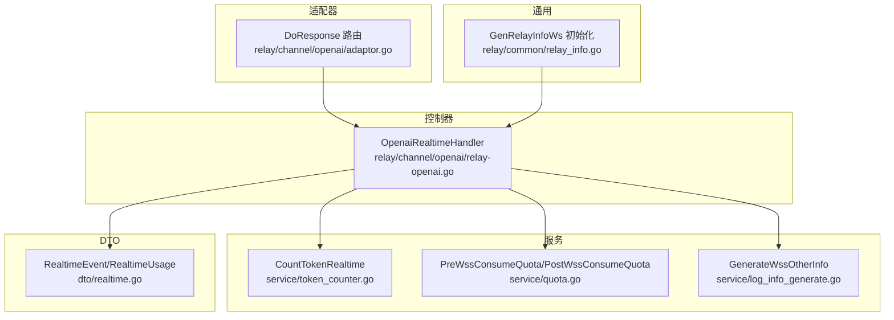
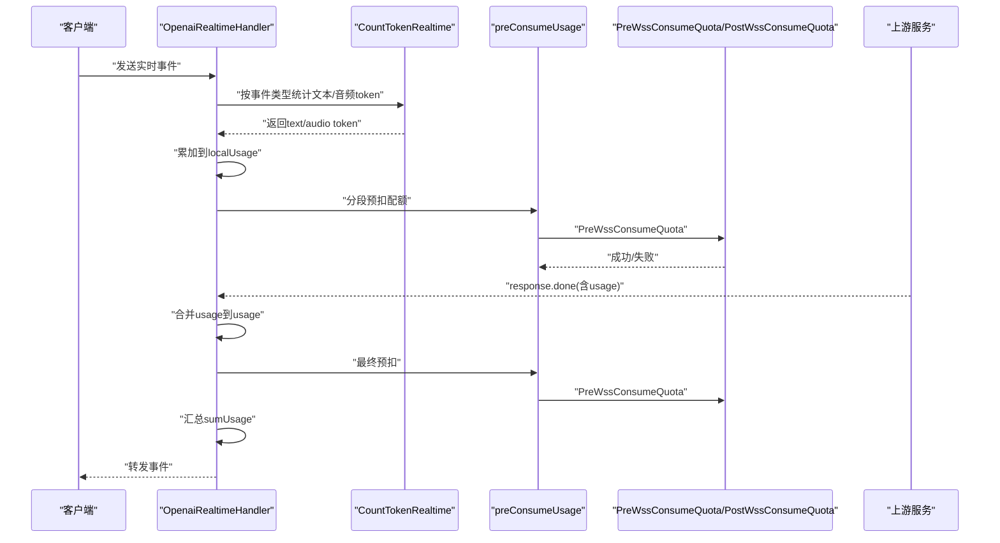
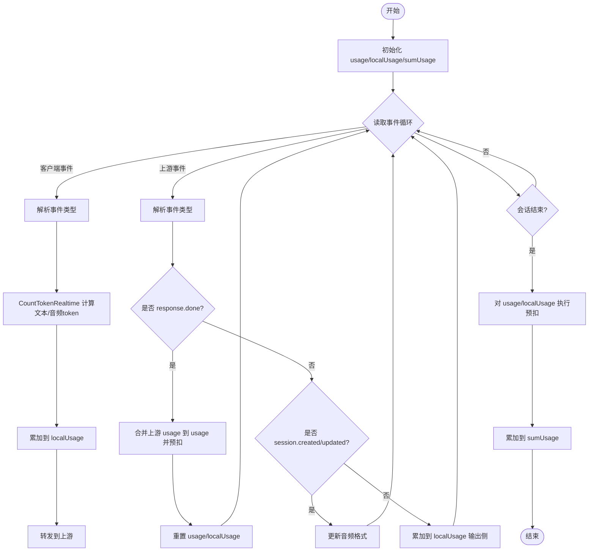
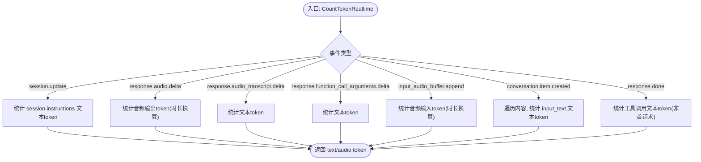
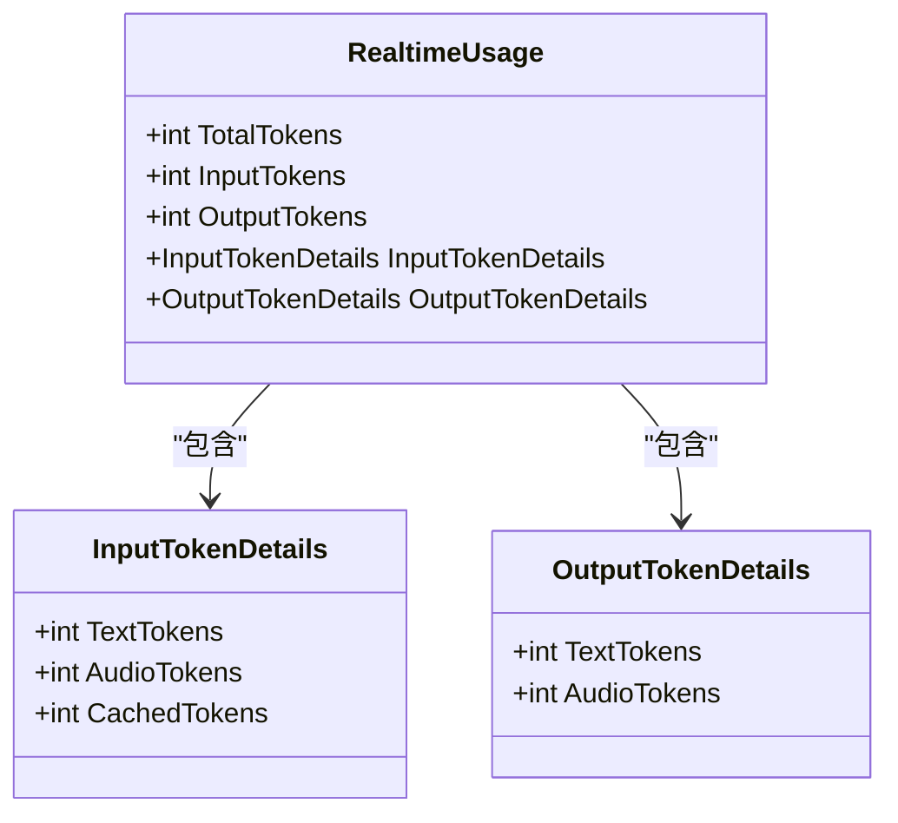
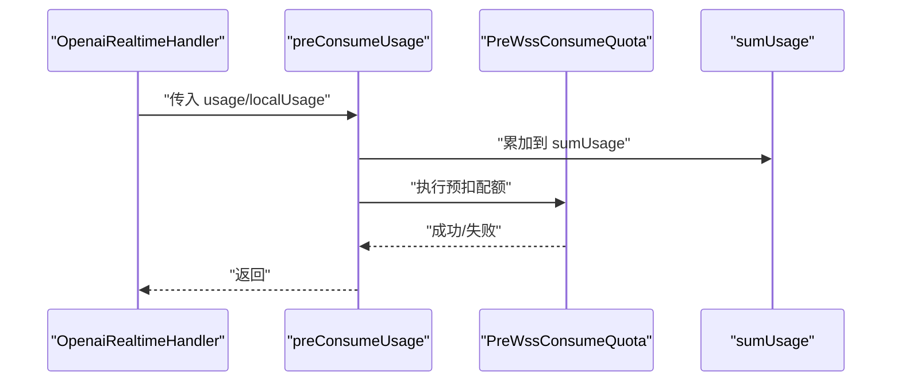
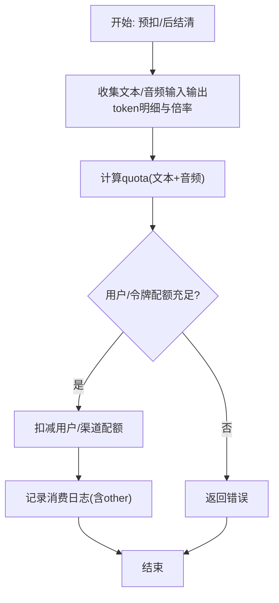
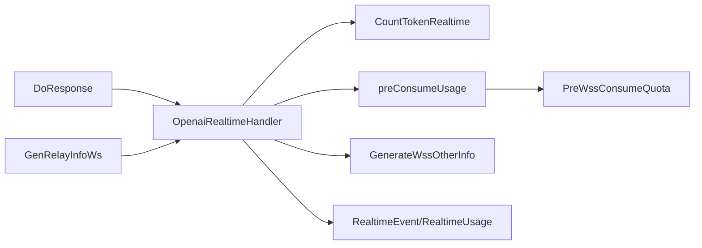

# 实时会话用量统计

<cite>
**本文引用的文件**
- [relay-openai.go](file://relay/channel/openai/relay-openai.go)
- [token_counter.go](file://service/token_counter.go)
- [quota.go](file://service/quota.go)
- [log_info_generate.go](file://service/log_info_generate.go)
- [realtime.go](file://dto/realtime.go)
- [adaptor.go](file://relay/channel/openai/adaptor.go)
- [relay_info.go](file://relay/common/relay_info.go)
</cite>

## 目录
1. [引言](#引言)
2. [项目结构](#项目结构)
3. [核心组件](#核心组件)
4. [架构总览](#架构总览)
5. [详细组件分析](#详细组件分析)
6. [依赖关系分析](#依赖关系分析)
7. [性能考量](#性能考量)
8. [故障排查指南](#故障排查指南)
9. [结论](#结论)

## 引言
本文件聚焦于 new-api 中实时会话（Realtime API）的用量统计与计费机制，围绕以下目标展开：
- 解析 OpenaiRealtimeHandler 如何在会话过程中对不同事件类型（如 session.update、conversation.item.create、response.audio.delta 等）进行文本与音频 token 的统计。
- 说明 RealtimeUsage 结构体中 TotalTokens、InputTokens、OutputTokens 等字段的累加逻辑，以及 InputTokenDetails 和 OutputTokenDetails 中 TextTokens 与 AudioTokens 的细分统计方法。
- 讲解 preConsumeUsage 函数如何在会话过程中分段预扣配额，并在 response.done 事件中依据上游返回的 usage 进行最终结算；sumUsage 变量如何累积整体会话的总用量。
- 说明计费侧如何将用量转换为配额并记录消费日志。

## 项目结构
实时会话相关的关键模块分布如下：
- 控制器层：OpenaiRealtimeHandler 负责实时 WebSocket 会话的读写、事件解析与用量统计。
- 服务层：token_counter 提供 CountTokenRealtime 用于按事件类型统计文本与音频 token；quota 提供预扣与后结清的配额计算与记录。
- DTO 层：realtime 定义实时事件与用量的数据结构。
- 适配器层：adaptor 将请求路由到 OpenaiRealtimeHandler。
- 通用信息：relay_info 初始化实时会话的音频格式等上下文。

图表来源
- [relay-openai.go](file://relay/channel/openai/relay-openai.go#L293-L552)
- [token_counter.go](file://service/token_counter.go#L344-L453)
- [quota.go](file://service/quota.go#L89-L279)
- [log_info_generate.go](file://service/log_info_generate.go#L76-L98)
- [realtime.go](file://dto/realtime.go#L24-L89)
- [adaptor.go](file://relay/channel/openai/adaptor.go#L588-L616)
- [relay_info.go](file://relay/common/relay_info.go#L277-L285)

章节来源
- [adaptor.go](file://relay/channel/openai/adaptor.go#L588-L616)
- [relay-openai.go](file://relay/channel/openai/relay-openai.go#L293-L552)
- [token_counter.go](file://service/token_counter.go#L344-L453)
- [quota.go](file://service/quota.go#L89-L279)
- [log_info_generate.go](file://service/log_info_generate.go#L76-L98)
- [realtime.go](file://dto/realtime.go#L24-L89)
- [relay_info.go](file://relay/common/relay_info.go#L277-L285)

## 核心组件
- OpenaiRealtimeHandler：实时会话主流程，负责客户端与上游的双向转发、事件解析、用量统计与预扣配额。
- CountTokenRealtime：按事件类型统计文本与音频 token 的核心函数。
- RealtimeUsage：实时用量结构体，包含总 token、输入/输出 token 及其明细。
- preConsumeUsage：分段预扣配额并累加到 sumUsage 的桥接函数。
- PreWssConsumeQuota/PostWssConsumeQuota：预扣与最终结算配额的核心逻辑。
- GenerateWssOtherInfo：生成消费日志附加信息（文本/音频输入输出 token 数）。

章节来源
- [relay-openai.go](file://relay/channel/openai/relay-openai.go#L293-L552)
- [token_counter.go](file://service/token_counter.go#L344-L453)
- [realtime.go](file://dto/realtime.go#L40-L89)
- [quota.go](file://service/quota.go#L89-L279)
- [log_info_generate.go](file://service/log_info_generate.go#L76-L98)

## 架构总览
实时会话从适配器进入 OpenaiRealtimeHandler，随后在事件循环中：
- 读取客户端或上游事件，调用 CountTokenRealtime 计算文本/音频 token。
- 将 token 累加到 localUsage，并通过 preConsumeUsage 分段预扣配额。
- 在 response.done 事件中，若上游返回 usage，则合并到 usage 并再次预扣；最后在会话结束时，将 usage 与 localUsage 合并到 sumUsage 并进行最终结算。

图表来源
- [relay-openai.go](file://relay/channel/openai/relay-openai.go#L330-L552)
- [token_counter.go](file://service/token_counter.go#L344-L453)
- [quota.go](file://service/quota.go#L89-L279)

## 详细组件分析

### OpenaiRealtimeHandler 流程与用量统计
- 初始化：创建 usage、localUsage、sumUsage 三个用量对象，标记为流式会话。
- 客户端事件处理：
  - 解析事件类型，调用 CountTokenRealtime 计算文本/音频 token。
  - 累加到 localUsage 的 TotalTokens、InputTokens、InputTokenDetails.Text/AudioTokens。
  - 将事件转发给上游。
- 上游事件处理：
  - response.done：若上游返回 usage，则合并到 usage 并进行一次预扣；随后重置 usage 与 localUsage。
  - session.created/session.updated：更新音频格式（输入/输出）。
  - 其他输出事件：累加到 localUsage 的 OutputTokens 与 OutputTokenDetails.Text/AudioTokens。
- 会话结束：若 usage 或 localUsage 存在未结算的 token，则调用 preConsumeUsage 进行最终预扣；并将累计结果写入 sumUsage 返回。

图表来源
- [relay-openai.go](file://relay/channel/openai/relay-openai.go#L330-L552)

章节来源
- [relay-openai.go](file://relay/channel/openai/relay-openai.go#L330-L552)

### CountTokenRealtime：按事件类型统计文本与音频 token
- session.update：统计 session.instructions 的文本 token。
- response.audio.delta：统计音频输出 token（基于音频时长换算）。
- response.audio_transcript.delta / response.function_call_arguments.delta：统计文本 token。
- input_audio_buffer.append：统计音频输入 token（基于音频时长换算）。
- conversation.item.created（message 类型）：遍历内容，统计 input_text 的文本 token。
- response.done：若非首请求，统计工具调用参数的文本 token，并额外计入工具名等开销。

图表来源
- [token_counter.go](file://service/token_counter.go#L344-L453)

章节来源
- [token_counter.go](file://service/token_counter.go#L344-L453)

### RealtimeUsage 字段累加逻辑与明细统计
- 总量字段：
  - TotalTokens：每段 localUsage 累加 text+audio。
  - InputTokens/OutputTokens：分别累加输入/输出侧 text+audio。
- 明细字段：
  - InputTokenDetails：TextTokens、AudioTokens、CachedTokens。
  - OutputTokenDetails：TextTokens、AudioTokens。
- 累加位置：
  - 输入侧：OpenaiRealtimeHandler 在客户端事件与 session.update 时累加。
  - 输出侧：OpenaiRealtimeHandler 在上游输出事件时累加。
  - 合并：preConsumeUsage 将 usage 与 localUsage 合并到 sumUsage，同时累加到 total/input/output 及明细字段。

图表来源
- [realtime.go](file://dto/realtime.go#L40-L89)

章节来源
- [realtime.go](file://dto/realtime.go#L40-L89)
- [relay-openai.go](file://relay/channel/openai/relay-openai.go#L330-L552)

### preConsumeUsage：分段预扣与最终结算
- 功能：
  - 将当前段 localUsage/usage 累加到 sumUsage。
  - 调用 PreWssConsumeQuota 执行预扣配额。
- 触发时机：
  - 每次事件段结束后（localUsage）。
  - response.done 事件合并上游 usage 后（usage）。
  - 会话结束时（usage 与 localUsage）。
- 最终结算：
  - 会话结束时，PreWssConsumeQuota/PostWssConsumeQuota 根据实际用量与预扣差额进行补扣或返还。

图表来源
- [relay-openai.go](file://relay/channel/openai/relay-openai.go#L536-L552)
- [quota.go](file://service/quota.go#L89-L155)

章节来源
- [relay-openai.go](file://relay/channel/openai/relay-openai.go#L536-L552)
- [quota.go](file://service/quota.go#L89-L155)

### 配额计算与计费：PreWssConsumeQuota/PostWssConsumeQuota
- 预扣阶段（PreWssConsumeQuota）：
  - 从 relayInfo 获取模型倍率、分组倍率、音频/文本 token 明细。
  - 计算 quota（考虑文本与音频的单独倍率），校验用户与令牌配额是否充足。
  - 扣减用户与渠道已用配额，并记录日志。
- 后结清阶段（PostWssConsumeQuota）：
  - 计算最终配额，与预扣差额进行补扣或返还。
  - 记录消费日志，包含文本/音频输入输出 token 数与倍率信息。
- 日志附加信息（GenerateWssOtherInfo）：
  - 将 RealtimeUsage 的 InputTokenDetails/OutputTokenDetails 中的 TextTokens/AudioTokens 注入到 other 字段，便于前端展示与审计。

图表来源
- [quota.go](file://service/quota.go#L89-L279)
- [log_info_generate.go](file://service/log_info_generate.go#L76-L98)

章节来源
- [quota.go](file://service/quota.go#L89-L279)
- [log_info_generate.go](file://service/log_info_generate.go#L76-L98)

### 适配器与上下文初始化
- 适配器 DoResponse 将实时模式请求路由到 OpenaiRealtimeHandler。
- GenRelayInfoWs 初始化实时会话的音频格式（默认 pcm16），并标记为流式会话。

章节来源
- [adaptor.go](file://relay/channel/openai/adaptor.go#L588-L616)
- [relay_info.go](file://relay/common/relay_info.go#L277-L285)

## 依赖关系分析
- OpenaiRealtimeHandler 依赖：
  - CountTokenRealtime：按事件类型统计 token。
  - preConsumeUsage：分段预扣与累加 sumUsage。
  - PreWssConsumeQuota/PostWssConsumeQuota：配额计算与结算。
  - GenerateWssOtherInfo：消费日志附加信息。
- DTO RealtimeEvent/RealtimeUsage 提供事件与用量的数据契约。
- 适配器与上下文初始化确保实时模式正确进入处理器。

图表来源
- [relay-openai.go](file://relay/channel/openai/relay-openai.go#L293-L552)
- [token_counter.go](file://service/token_counter.go#L344-L453)
- [quota.go](file://service/quota.go#L89-L279)
- [log_info_generate.go](file://service/log_info_generate.go#L76-L98)
- [realtime.go](file://dto/realtime.go#L24-L89)
- [adaptor.go](file://relay/channel/openai/adaptor.go#L588-L616)
- [relay_info.go](file://relay/common/relay_info.go#L277-L285)

章节来源
- [relay-openai.go](file://relay/channel/openai/relay-openai.go#L293-L552)
- [token_counter.go](file://service/token_counter.go#L344-L453)
- [quota.go](file://service/quota.go#L89-L279)
- [log_info_generate.go](file://service/log_info_generate.go#L76-L98)
- [realtime.go](file://dto/realtime.go#L24-L89)
- [adaptor.go](file://relay/channel/openai/adaptor.go#L588-L616)
- [relay_info.go](file://relay/common/relay_info.go#L277-L285)

## 性能考量
- 事件驱动的分段统计与预扣：避免一次性累积巨大用量，降低内存压力与结算复杂度。
- 音频 token 采用时长换算而非逐帧解析，减少 CPU 开销。
- 预扣与后结清分离：在会话过程中尽量快速响应，最终统一结算，提升吞吐。

## 故障排查指南
- 预扣失败：
  - 检查用户与令牌剩余配额是否充足（PreWssConsumeQuota 内部校验）。
  - 关注日志中“total tokens is 0”提示，可能上游超时或异常导致无法结算。
- 用量不一致：
  - 确认 response.done 是否携带 usage；若未携带，需依赖本地统计并在会话结束时统一结算。
  - 检查是否正确区分 InputTokenDetails 与 OutputTokenDetails 的累加位置。
- 计费异常：
  - 核对模型倍率、分组倍率与音频/文本倍率配置，确认 GenerateWssOtherInfo 中的字段是否正确注入。

章节来源
- [quota.go](file://service/quota.go#L89-L279)
- [relay-openai.go](file://relay/channel/openai/relay-openai.go#L435-L552)

## 结论
new-api 的实时会话用量统计与计费通过 OpenaiRealtimeHandler、CountTokenRealtime、preConsumeUsage 与 PreWssConsumeQuota/PostWssConsumeQuota 协同实现：
- 事件驱动的分段统计与预扣，保证会话过程中的资源可控。
- response.done 事件提供上游用量时，优先使用上游数据进行最终结算。
- sumUsage 累积整体会话用量，配合日志与前端展示，形成完整的审计闭环。