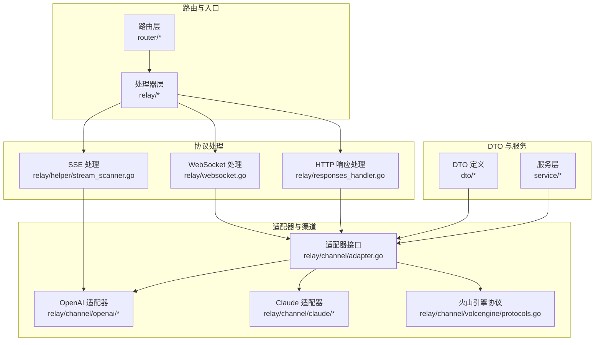
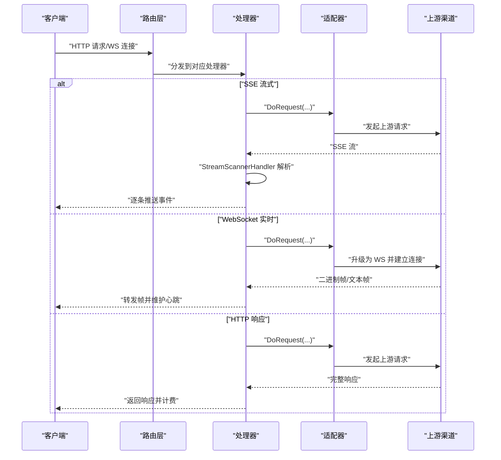
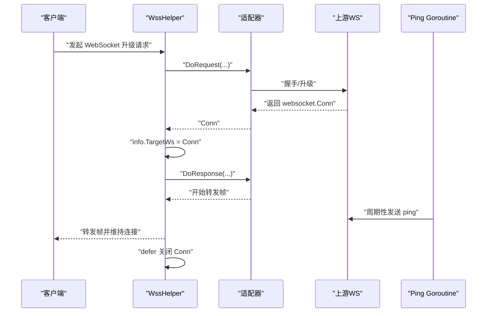
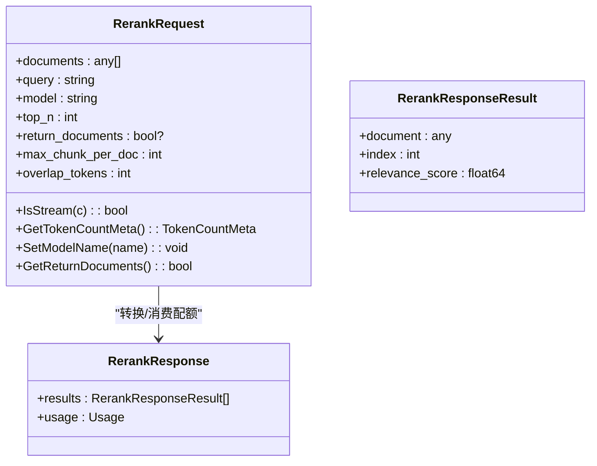
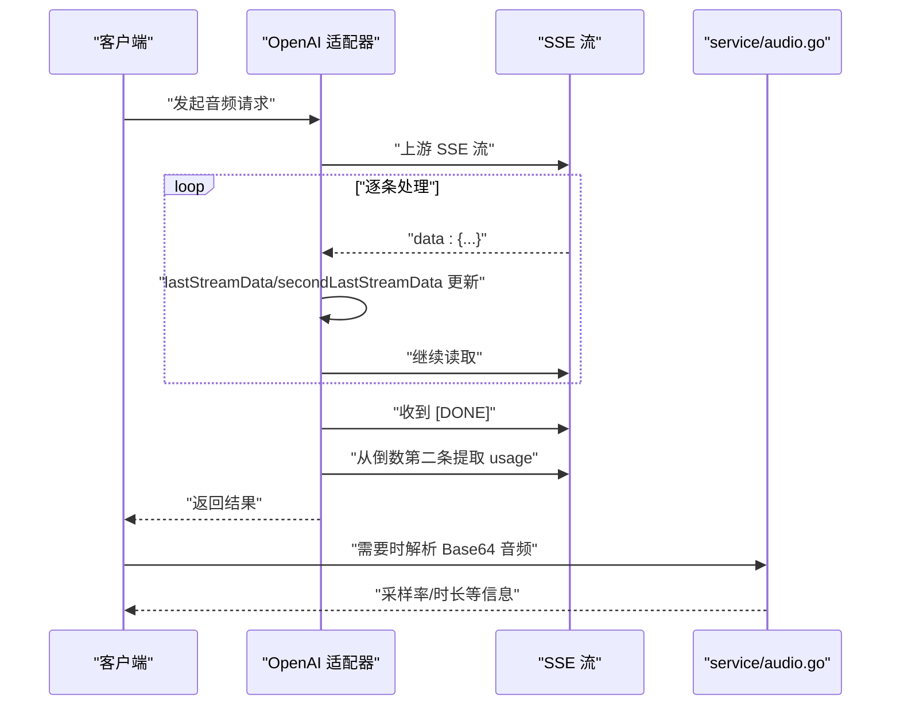
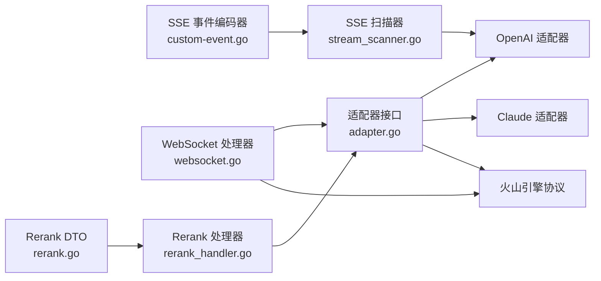

# 协议处理

<cite>
**本文引用的文件**
- [responses_handler.go](file://relay/responses_handler.go)
- [websocket.go](file://relay/websocket.go)
- [realtime.go](file://dto/realtime.go)
- [rerank.go](file://dto/rerank.go)
- [rerank_handler.go](file://relay/rerank_handler.go)
- [claude_handler.go](file://relay/claude_handler.go)
- [claude.go](file://dto/claude.go)
- [audio_handler.go](file://relay/audio_handler.go)
- [audio.go](file://dto/audio.go)
- [stream_scanner.go](file://relay/helper/stream_scanner.go)
- [custom-event.go](file://common/custom-event.go)
- [protocols.go](file://relay/channel/volcengine/protocols.go)
- [api_request.go](file://relay/channel/api_request.go)
- [relay-openai.go](file://relay/channel/openai/relay-openai.go)
- [audio.go](file://service/audio.go)
- [useApiRequest.jsx](file://web/src/hooks/playground/useApiRequest.jsx)
- [SSEViewer.jsx](file://web/src/components/playground/SSEViewer.jsx)
- [api.js](file://web/src/helpers/api.js)
</cite>

## 目录
1. [简介](#简介)
2. [项目结构与总体架构](#项目结构与总体架构)
3. [核心组件与协议处理能力概览](#核心组件与协议处理能力概览)
4. [架构总览](#架构总览)
5. [详细组件分析](#详细组件分析)
   - [WebSocket 实时交互（Claude 实时会话）](#websocket-实时交互claude-实时会话)
   - [HTTP 流式响应（SSE）实现](#http-流式响应sse实现)
   - [重排序（rerank）功能](#重排序rerank功能)
   - [多媒体数据传输与编码处理](#多媒体数据传输与编码处理)
6. [依赖关系分析](#依赖关系分析)
7. [性能与稳定性考量](#性能与稳定性考量)
8. [故障排查指南](#故障排查指南)
9. [结论](#结论)
10. [附录：客户端实现示例与最佳实践](#附录客户端实现示例与最佳实践)

## 简介
本文件系统性梳理 new-api 在不同通信协议与数据格式上的处理能力，重点覆盖：
- WebSocket 协议在实时 AI 交互（如 Claude 实时会话）中的应用，包括连接升级、消息帧处理与心跳机制
- HTTP 流式响应（SSE）的实现细节，特别是如何通过 stream_scanner 与 openai 适配器处理分块数据并保持连接稳定
- 重排序（rerank）功能的请求/响应数据结构与处理流程
- 音频、图像、视频等多媒体数据的传输与编码处理
- 提供客户端实现不同协议交互的参考路径与常见问题解决方案

## 项目结构与总体架构
new-api 采用“适配器模式 + 统一路由层”的架构设计：
- 路由层负责接收请求并选择对应处理器（HTTP、WebSocket、SSE）
- 处理器根据上游渠道（OpenAI、Claude、Gemini 等）调用适配器进行请求转换与响应处理
- DTO 层定义跨渠道统一的数据结构，便于协议与格式转换
- 辅助模块提供流扫描、事件编码、心跳等通用能力



图表来源
- [websocket.go](file://relay/websocket.go#L1-L47)
- [responses_handler.go](file://relay/responses_handler.go#L1-L114)
- [stream_scanner.go](file://relay/helper/stream_scanner.go#L1-L272)
- [adapter.go](file://relay/channel/adapter.go#L1-L58)
- [protocols.go](file://relay/channel/volcengine/protocols.go#L209-L533)

章节来源
- [websocket.go](file://relay/websocket.go#L1-L47)
- [responses_handler.go](file://relay/responses_handler.go#L1-L114)
- [stream_scanner.go](file://relay/helper/stream_scanner.go#L1-L272)
- [adapter.go](file://relay/channel/adapter.go#L1-L58)

## 核心组件与协议处理能力概览
- WebSocket 实时交互：通过适配器执行连接升级，使用 gorilla/websocket 与二进制帧封装，支持心跳与超时保护
- SSE 流式响应：基于 bufio.Scanner 逐条解析 data: 行，支持 [DONE] 结束标记、超时与客户端断连检测
- 重排序（rerank）：统一请求/响应结构，按渠道适配器转换并消费配额
- 多媒体数据：音频模型识别、SSE 中的音频模型特殊处理、Base64 音频解码与采样率计算

章节来源
- [websocket.go](file://relay/websocket.go#L1-L47)
- [stream_scanner.go](file://relay/helper/stream_scanner.go#L1-L272)
- [rerank_handler.go](file://relay/rerank_handler.go#L1-L101)
- [audio.go](file://dto/audio.go#L1-L68)
- [audio.go](file://service/audio.go#L1-L48)

## 架构总览
下图展示从客户端到上游渠道的关键交互路径与协议选择：



图表来源
- [responses_handler.go](file://relay/responses_handler.go#L1-L114)
- [websocket.go](file://relay/websocket.go#L1-L47)
- [stream_scanner.go](file://relay/helper/stream_scanner.go#L1-L272)
- [adapter.go](file://relay/channel/adapter.go#L1-L58)

## 详细组件分析

### WebSocket 实时交互（Claude 实时会话）
- 连接升级：处理器调用适配器执行 DoRequest(...)，返回 websocket.Conn；随后设置 info.TargetWs 并在退出时关闭
- 消息帧处理：适配器侧定义了二进制帧结构与序列化/反序列化方法，支持多种消息类型与事件标识
- 心跳机制：通道层提供 ping goroutine，周期性发送 ping 数据并带超时保护，避免 goroutine 泄漏



图表来源
- [websocket.go](file://relay/websocket.go#L1-L47)
- [protocols.go](file://relay/channel/volcengine/protocols.go#L209-L533)
- [api_request.go](file://relay/channel/api_request.go#L169-L265)

章节来源
- [websocket.go](file://relay/websocket.go#L1-L47)
- [protocols.go](file://relay/channel/volcengine/protocols.go#L209-L533)
- [api_request.go](file://relay/channel/api_request.go#L169-L265)

### HTTP 流式响应（SSE）实现
- SSE 解析：StreamScannerHandler 使用 bufio.Scanner 逐行读取，过滤 data: 前缀与 [DONE] 结束标记，支持可配置最大缓冲与超时
- OpenAI 兼容：OpenAI 适配器在 SSE 流中维护 lastStreamData/secondLastStreamData，对音频模型从倒数第二条流中提取 usage
- 事件编码：自定义事件编码器确保 Content-Type 与缓存策略符合 SSE 规范
- 错误与断连：监听 readyState 与 error 事件，区分正常关闭与异常中断，并记录调试信息

```mermaid
flowchart TD
Start(["开始 SSE 流"]) --> Init["初始化 Scanner/定时器/互斥量"]
Init --> Loop{"读取下一行"}
Loop --> |data: 或 [DONE]| Check["去前缀/去回车/Trim"]
Check --> Done{"[DONE]?"}
Done --> |是| Stop["停止读取并退出"]
Done --> |否| Handler["调用 dataHandler(data)"]
Handler --> Timeout{"写入超时?"}
Timeout --> |是| Abort["记录日志并退出"]
Timeout --> |否| Loop
Loop --> |EOF/错误| Err{"scanner.Err() 是否非 EOF"}
Err --> |是| LogErr["记录错误日志"] --> End(["结束"])
Err --> |否| End
```

图表来源
- [stream_scanner.go](file://relay/helper/stream_scanner.go#L1-L272)
- [custom-event.go](file://common/custom-event.go#L1-L87)
- [relay-openai.go](file://relay/channel/openai/relay-openai.go#L126-L164)
- [useApiRequest.jsx](file://web/src/hooks/playground/useApiRequest.jsx#L331-L459)

章节来源
- [stream_scanner.go](file://relay/helper/stream_scanner.go#L1-L272)
- [custom-event.go](file://common/custom-event.go#L1-L87)
- [relay-openai.go](file://relay/channel/openai/relay-openai.go#L126-L164)
- [useApiRequest.jsx](file://web/src/hooks/playground/useApiRequest.jsx#L331-L459)

### 重排序（rerank）功能
- 请求结构：RerankRequest 支持 documents/query/model/top_n/return_documents/max_chunk_per_doc/overlap_tokens 等字段
- 计费与配额：RerankHelper 将请求转换为上游格式后发起请求，DoResponse 后消费配额
- DTO 与响应：RerankResponse 包含 results 与 usage 字段，便于统计与计费



图表来源
- [rerank.go](file://dto/rerank.go#L1-L68)
- [rerank_handler.go](file://relay/rerank_handler.go#L1-L101)

章节来源
- [rerank.go](file://dto/rerank.go#L1-L68)
- [rerank_handler.go](file://relay/rerank_handler.go#L1-L101)

### 多媒体数据传输与编码处理
- 音频模型识别：OpenAI 适配器在 SSE 流中识别音频模型，从倒数第二条流中提取 usage
- Base64 音频解码：service/audio.go 提供 Base64 音频数据解析与采样率计算
- SSE 中的音频模型：AudioRequest.IsStream(c) 返回 true 时走 SSE 流式输出
- 通道层协议：火山引擎协议定义了二进制帧的消息头、事件类型、序列号与载荷，支持音频仅帧与全帧



图表来源
- [relay-openai.go](file://relay/channel/openai/relay-openai.go#L126-L164)
- [audio.go](file://service/audio.go#L1-L48)
- [audio.go](file://dto/audio.go#L1-L68)
- [protocols.go](file://relay/channel/volcengine/protocols.go#L209-L533)

章节来源
- [relay-openai.go](file://relay/channel/openai/relay-openai.go#L126-L164)
- [audio.go](file://service/audio.go#L1-L48)
- [audio.go](file://dto/audio.go#L1-L68)
- [protocols.go](file://relay/channel/volcengine/protocols.go#L209-L533)

## 依赖关系分析
- 适配器接口统一了 Convert/DoRequest/DoResponse 等能力，便于扩展新渠道
- SSE 依赖 stream_scanner 与自定义事件编码器，确保兼容性与稳定性
- WebSocket 依赖 gorilla/websocket 与通道层协议编解码
- 重排序功能依赖各渠道适配器的 ConvertRerankRequest 实现



图表来源
- [adapter.go](file://relay/channel/adapter.go#L1-L58)
- [stream_scanner.go](file://relay/helper/stream_scanner.go#L1-L272)
- [custom-event.go](file://common/custom-event.go#L1-L87)
- [websocket.go](file://relay/websocket.go#L1-L47)
- [rerank_handler.go](file://relay/rerank_handler.go#L1-L101)
- [rerank.go](file://dto/rerank.go#L1-L68)

章节来源
- [adapter.go](file://relay/channel/adapter.go#L1-L58)
- [stream_scanner.go](file://relay/helper/stream_scanner.go#L1-L272)
- [custom-event.go](file://common/custom-event.go#L1-L87)
- [websocket.go](file://relay/websocket.go#L1-L47)
- [rerank_handler.go](file://relay/rerank_handler.go#L1-L101)
- [rerank.go](file://dto/rerank.go#L1-L68)

## 性能与稳定性考量
- SSE 缓冲与超时：StreamScannerHandler 支持可配置的最大缓冲与超时，避免内存膨胀与长时间阻塞
- 写入超时保护：dataHandler 写入增加超时，防止阻塞导致资源泄漏
- 心跳与超时：WebSocket ping goroutine 带最大持续时间与超时控制，避免 goroutine 泄漏
- 音频模型特殊处理：OpenAI 适配器从倒数第二条 SSE 中提取 usage，减少延迟并提升准确性

章节来源
- [stream_scanner.go](file://relay/helper/stream_scanner.go#L1-L272)
- [api_request.go](file://relay/channel/api_request.go#L169-L265)
- [relay-openai.go](file://relay/channel/openai/relay-openai.go#L126-L164)

## 故障排查指南
- SSE 连接异常
  - 检查 readyState 与 status，区分正常关闭与异常中断
  - 查看 SSEViewer 中的解析错误与 [DONE] 标记
  - 参考 useApiRequest.jsx 的错误监听与调试输出
- WebSocket 连接失败
  - 确认适配器 DoRequest 返回的 websocket.Conn 是否成功
  - 检查 ping goroutine 是否报错或超时
- 重排序请求失败
  - 确认请求字段（documents/query/model）是否正确
  - 检查各渠道适配器的 ConvertRerankRequest 实现
- 音频模型计费异常
  - 确认 SSE 中是否正确提取 usage（倒数第二条）
  - 检查 service/audio.go 的 Base64 解码与采样率计算

章节来源
- [useApiRequest.jsx](file://web/src/hooks/playground/useApiRequest.jsx#L331-L459)
- [SSEViewer.jsx](file://web/src/components/playground/SSEViewer.jsx#L26-L75)
- [websocket.go](file://relay/websocket.go#L1-L47)
- [api_request.go](file://relay/channel/api_request.go#L169-L265)
- [rerank_handler.go](file://relay/rerank_handler.go#L1-L101)
- [relay-openai.go](file://relay/channel/openai/relay-openai.go#L126-L164)
- [audio.go](file://service/audio.go#L1-L48)

## 结论
new-api 在协议处理方面具备完善的抽象与实现：
- WebSocket 通过适配器与通道层协议实现稳定的实时交互与心跳管理
- SSE 通过流扫描器与事件编码器保障分块数据的可靠解析与连接稳定性
- 重排序功能以统一 DTO 与适配器转换实现跨渠道一致性
- 多媒体数据在音频模型上实现了特殊处理与计费优化

## 附录：客户端实现示例与最佳实践
- SSE 客户端参考
  - 事件监听与错误处理：参见 useApiRequest.jsx 中的 addEventListener('message/error/readystatechange')
  - 调试查看：SSEViewer.jsx 展示解析后的消息与统计
  - 参考路径
    - [useApiRequest.jsx](file://web/src/hooks/playground/useApiRequest.jsx#L331-L459)
    - [SSEViewer.jsx](file://web/src/components/playground/SSEViewer.jsx#L26-L75)
- WebSocket 客户端参考
  - 通过适配器升级为 WS 并建立连接，参考 websocket.go 的连接流程
  - 参考路径
    - [websocket.go](file://relay/websocket.go#L1-L47)
    - [protocols.go](file://relay/channel/volcengine/protocols.go#L209-L533)
- HTTP 客户端参考
  - Axios 实例与拦截器、构建请求负载与错误处理
  - 参考路径
    - [api.js](file://web/src/helpers/api.js#L1-L200)