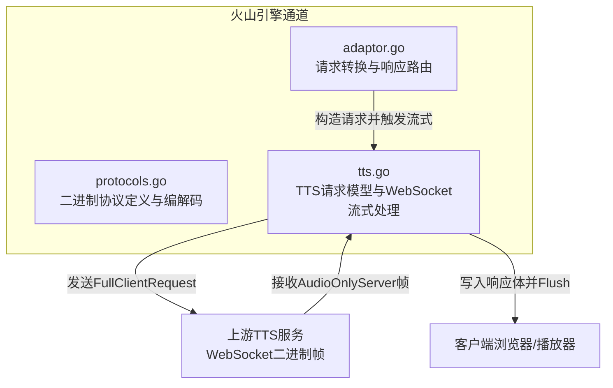
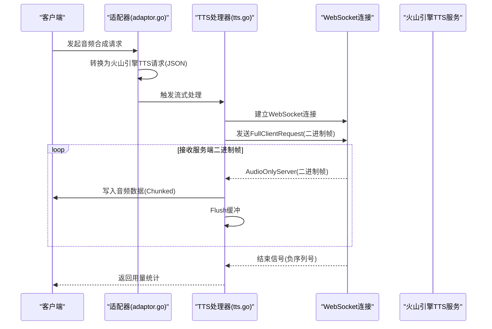
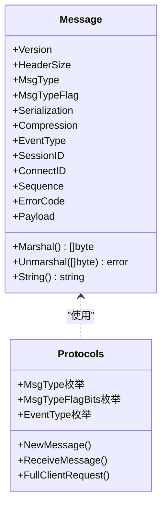
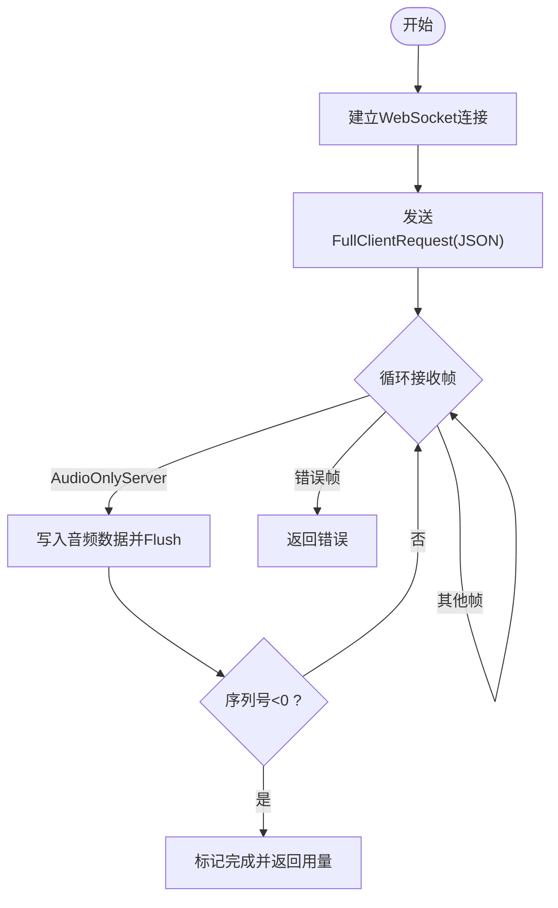
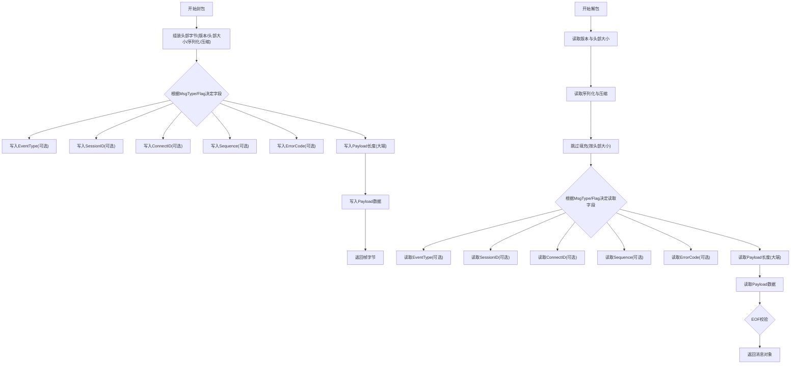
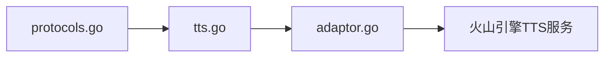

# 二进制流式传输协议

<cite>
**本文引用的文件**
- [protocols.go](file://relay/channel/volcengine/protocols.go)
- [tts.go](file://relay/channel/volcengine/tts.go)
- [adaptor.go](file://relay/channel/volcengine/adaptor.go)
</cite>

## 目录
1. [简介](#简介)
2. [项目结构](#项目结构)
3. [核心组件](#核心组件)
4. [架构总览](#架构总览)
5. [详细组件分析](#详细组件分析)
6. [依赖关系分析](#依赖关系分析)
7. [性能考量](#性能考量)
8. [故障排查指南](#故障排查指南)
9. [结论](#结论)

## 简介
本文件围绕火山引擎TTS服务所采用的自定义二进制协议进行深入解析，重点覆盖：
- 消息头结构与位分配：版本、头部大小、消息类型、序列化方式、压缩方式等字段的位域布局
- 消息类型：客户端/服务端音频仅传输类型及错误类型
- 有效载荷格式：二进制帧中的事件类型、会话标识、连接标识、序列号、错误码以及音频数据
- 流式传输机制：通过WebSocket接收二进制帧，结合Transfer-Encoding: chunked实现客户端实时播放
- 事件类型：TTSSentenceStart/End、TTSResponse等在语音合成过程中的触发时机与数据格式
- 封包/解包与流式传输的完整实现路径

## 项目结构
与TTS二进制协议直接相关的代码位于volcengine通道目录下，主要包含协议编解码、TTS请求适配器与WebSocket流式处理逻辑。

图表来源
- [protocols.go](file://relay/channel/volcengine/protocols.go#L1-L120)
- [tts.go](file://relay/channel/volcengine/tts.go#L1-L120)
- [adaptor.go](file://relay/channel/volcengine/adaptor.go#L235-L282)

章节来源
- [protocols.go](file://relay/channel/volcengine/protocols.go#L1-L120)
- [tts.go](file://relay/channel/volcengine/tts.go#L1-L120)
- [adaptor.go](file://relay/channel/volcengine/adaptor.go#L235-L282)

## 核心组件
- 协议定义与编解码：负责消息头的位域布局、消息类型枚举、事件类型枚举、消息体的封包/解包
- TTS请求模型与WebSocket处理：封装TTS请求参数、建立WebSocket连接、发送客户端请求、循环读取服务端二进制帧并实时转发音频数据
- 请求适配器：将OpenAI风格的音频请求转换为火山引擎TTS请求，决定是否使用WebSocket流式模式

章节来源
- [protocols.go](file://relay/channel/volcengine/protocols.go#L1-L120)
- [tts.go](file://relay/channel/volcengine/tts.go#L1-L120)
- [adaptor.go](file://relay/channel/volcengine/adaptor.go#L48-L105)

## 架构总览
下图展示了从客户端到上游TTS服务的端到端流程，以及二进制帧在中间层的处理路径。

图表来源
- [adaptor.go](file://relay/channel/volcengine/adaptor.go#L355-L386)
- [tts.go](file://relay/channel/volcengine/tts.go#L246-L305)
- [protocols.go](file://relay/channel/volcengine/protocols.go#L507-L534)

## 详细组件分析

### 一、二进制消息头结构与位分配
- 版本Version：占高位4位，当前固定为Version1
- 头部大小HeaderSize：占低位4位，当前固定为HeaderSize4（表示头部长度单位为4字节）
- 序列化Serialization：占高位4位，当前固定为SerializationJSON
- 压缩Compression：占低位4位，当前固定为CompressionNone
- 消息类型MsgType：占高位4位，消息类型标志位占低位4位
- 消息类型标志MsgTypeFlag：用于携带事件、正/负序列号等扩展信息
- 事件类型EventType：当标志含事件时写入
- 会话标识SessionID：当事件需要时写入
- 连接标识ConnectID：当事件需要时写入
- 序列号Sequence：当标志含正/负序号时写入
- 错误码ErrorCode：当消息类型为错误时写入
- 有效载荷Payload：二进制音频数据，前4字节为长度字段

图表来源
- [protocols.go](file://relay/channel/volcengine/protocols.go#L1-L120)
- [protocols.go](file://relay/channel/volcengine/protocols.go#L209-L354)

章节来源
- [protocols.go](file://relay/channel/volcengine/protocols.go#L1-L120)
- [protocols.go](file://relay/channel/volcengine/protocols.go#L209-L354)

### 二、消息类型与有效载荷格式
- 客户端请求
  - MsgTypeFullClientRequest：客户端向服务端提交TTS任务
  - 有效载荷：JSON字符串，内容为TTS请求对象
- 服务端响应
  - MsgTypeAudioOnlyServer：服务端返回音频数据块
  - 有效载荷：二进制音频数据
  - 可选事件：EventType_TTSSentenceStart/End、EventType_TTSResponse等
  - 可选序列号：正序号递增，负序号表示结束
- 其他类型
  - MsgTypeError：错误消息，包含错误码与错误文本
  - MsgTypeFrontEndResultServer：前端结果，当前处理中被忽略

章节来源
- [protocols.go](file://relay/channel/volcengine/protocols.go#L46-L72)
- [protocols.go](file://relay/channel/volcengine/protocols.go#L100-L126)
- [tts.go](file://relay/channel/volcengine/tts.go#L263-L296)

### 三、事件类型及其在语音合成中的作用
- 会话生命周期事件
  - EventType_StartSession/CancelSession/FinishSession
  - EventType_SessionStarted/SessionCanceled/SessionFinished/SessionFailed
- 连接生命周期事件
  - EventType_StartConnection/FinishConnection
  - EventType_ConnectionStarted/ConnectionFailed/ConnectionFinished
- 用量响应
  - EventType_UsageResponse
- TTS相关事件
  - EventType_TTSSentenceStart：句子开始
  - EventType_TTSSentenceEnd：句子结束
  - EventType_TTSResponse：句子级响应
  - EventType_TTSEnded：整体结束
- Podcast相关事件
  - EventType_PodcastRoundStart/Response/End
- ASR相关事件
  - EventType_ASRInfo/Response/ASREnded
- ChatTTSText与ChatResponse/Ended
  - EventType_ChatTTSText
  - EventType_ChatResponse/ChatEnded
- 字幕相关事件
  - EventType_SourceSubtitleStart/Response/End
  - EventType_TranslationSubtitleStart/Response/End

这些事件在服务端按语音合成流程产生，客户端可据此进行UI提示、日志记录与播放控制。

章节来源
- [protocols.go](file://relay/channel/volcengine/protocols.go#L74-L126)

### 四、WebSocket流式传输与实时播放
- 建立WebSocket连接
  - 使用适配器生成的WebSocket地址与认证头
- 发送FullClientRequest
  - 将TTS请求JSON序列化后作为有效载荷发送
- 循环接收AudioOnlyServer帧
  - 对每个二进制帧调用ReceiveMessage解包
  - 当有效载荷非空时，写入响应体并Flush，实现边播边播
- 结束条件
  - 当收到负序列号的AudioOnlyServer帧时，认为合成完成，返回用量统计

图表来源
- [tts.go](file://relay/channel/volcengine/tts.go#L246-L305)
- [protocols.go](file://relay/channel/volcengine/protocols.go#L507-L534)

章节来源
- [tts.go](file://relay/channel/volcengine/tts.go#L246-L305)
- [protocols.go](file://relay/channel/volcengine/protocols.go#L507-L534)

### 五、封包与解包流程详解
- 封包(Marshal)
  - 组装头部字节数组，按位域组合版本、头部大小、序列化、压缩
  - 根据消息类型与标志位，依次写入事件、会话ID、连接ID、序列号、错误码、有效载荷长度与数据
  - 有效载荷长度使用大端32位整数
- 解包(Unmarshal)
  - 读取版本与头部大小，推导头部长度
  - 读取序列化与压缩字段
  - 根据消息类型与标志位，依次读取事件、会话ID、连接ID、序列号、错误码、有效载荷长度与数据
  - 校验帧尾无多余数据

图表来源
- [protocols.go](file://relay/channel/volcengine/protocols.go#L274-L354)
- [protocols.go](file://relay/channel/volcengine/protocols.go#L356-L505)

章节来源
- [protocols.go](file://relay/channel/volcengine/protocols.go#L274-L354)
- [protocols.go](file://relay/channel/volcengine/protocols.go#L356-L505)

### 六、请求转换与路由
- 请求转换(ConvertAudioRequest)
  - 将OpenAI风格的音频请求映射为火山引擎TTS请求
  - 设置响应格式编码、速率、语音类型等
  - 在上下文中保存请求与响应格式
  - 当Operation为submit时启用流式
- 响应路由(DoResponse)
  - 若为音频合成且启用流式，则调用WebSocket处理函数
  - 否则走HTTP一次性响应处理

章节来源
- [adaptor.go](file://relay/channel/volcengine/adaptor.go#L48-L105)
- [adaptor.go](file://relay/channel/volcengine/adaptor.go#L355-L386)

## 依赖关系分析
- 协议层依赖gorilla/websocket进行WebSocket读写
- TTS层依赖适配器提供的请求URL与认证头
- 适配器层负责上游URL选择与请求头设置

图表来源
- [protocols.go](file://relay/channel/volcengine/protocols.go#L1-L20)
- [tts.go](file://relay/channel/volcengine/tts.go#L1-L20)
- [adaptor.go](file://relay/channel/volcengine/adaptor.go#L235-L282)

章节来源
- [protocols.go](file://relay/channel/volcengine/protocols.go#L1-L20)
- [tts.go](file://relay/channel/volcengine/tts.go#L1-L20)
- [adaptor.go](file://relay/channel/volcengine/adaptor.go#L235-L282)

## 性能考量
- 流式写入：每次收到音频帧即写入并Flush，降低首包延迟，提升实时性
- 头部紧凑：固定版本与头部大小，减少头部开销
- 有效载荷长度：使用大端32位长度字段，便于跨平台解析
- 错误快速返回：遇到错误帧立即终止并返回错误状态码

[本节为通用建议，不涉及具体文件分析]

## 故障排查指南
- WebSocket连接失败
  - 检查鉴权头格式与Token有效性
  - 确认WebSocket地址正确
- 接收帧异常
  - 非二进制/文本帧会导致解包失败
  - 头部长度不足或字段顺序错误会触发解包错误
- 错误帧
  - 收到错误类型帧时，应记录错误码与错误文本并返回给客户端
- 播放中断
  - 检查客户端是否正确处理Transfer-Encoding: chunked
  - 确保每次写入后Flush，避免缓冲未及时输出

章节来源
- [tts.go](file://relay/channel/volcengine/tts.go#L246-L305)
- [protocols.go](file://relay/channel/volcengine/protocols.go#L507-L534)

## 结论
该实现以自定义二进制协议承载TTS语音合成的流式数据，通过WebSocket实现实时传输，并以Transfer-Encoding: chunked驱动客户端边播边播。协议头采用紧凑的位域设计，消息类型与事件类型清晰划分了会话、连接、TTS与字幕等场景，配合序列号与结束信号，确保了可靠的流式播放与错误处理。适配器层将OpenAI风格请求转换为火山引擎兼容格式，并在必要时启用WebSocket流式模式，形成完整的端到端链路。