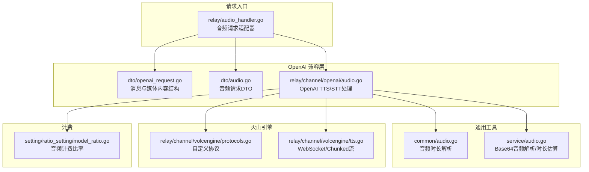
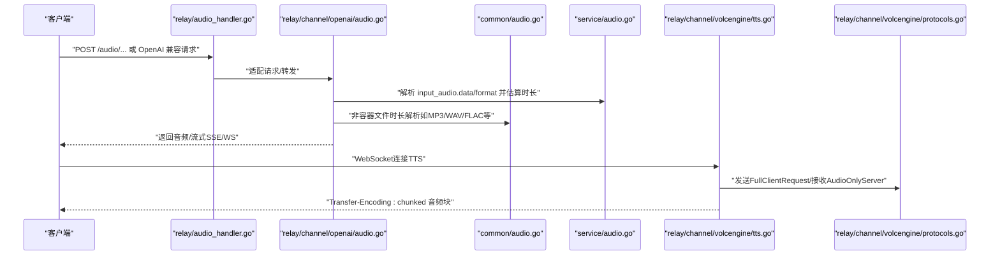
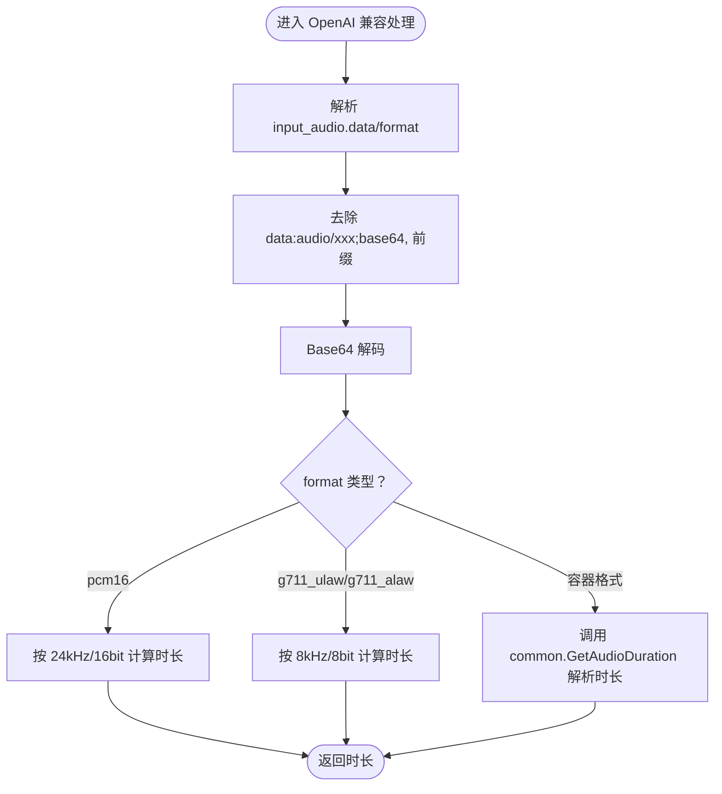
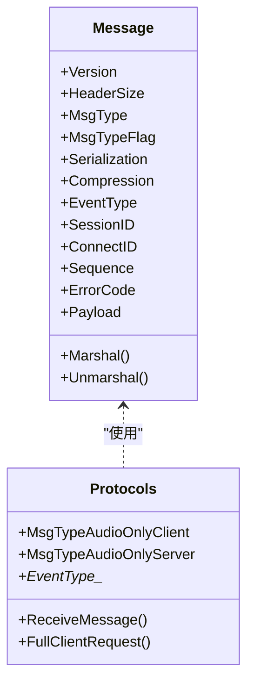
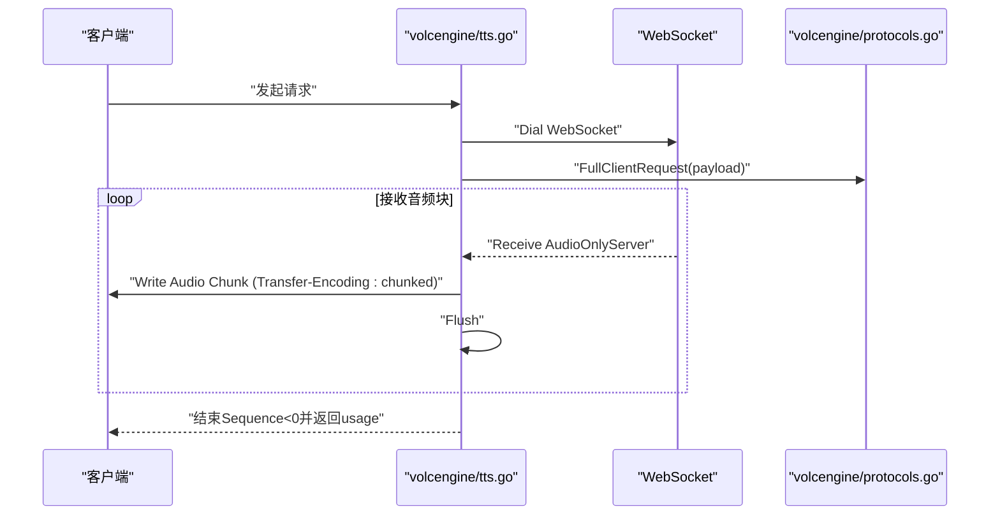
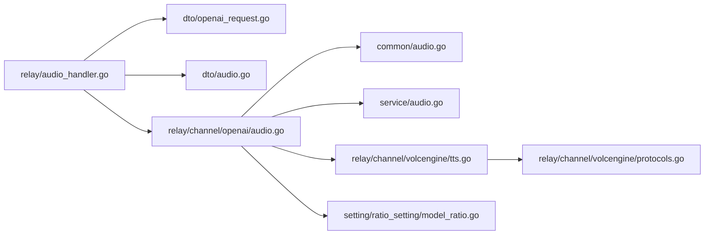

# 多媒体数据传输协议

<cite>
**本文引用的文件列表**
- [common/audio.go](file://common/audio.go)
- [service/audio.go](file://service/audio.go)
- [dto/audio.go](file://dto/audio.go)
- [dto/openai_request.go](file://dto/openai_request.go)
- [dto/realtime.go](file://dto/realtime.go)
- [relay/channel/volcengine/protocols.go](file://relay/channel/volcengine/protocols.go)
- [relay/channel/volcengine/tts.go](file://relay/channel/volcengine/tts.go)
- [relay/channel/openai/audio.go](file://relay/channel/openai/audio.go)
- [relay/channel/openai/relay-openai.go](file://relay/channel/openai/relay-openai.go)
- [setting/ratio_setting/model_ratio.go](file://setting/ratio_setting/model_ratio.go)
- [relay/audio_handler.go](file://relay/audio_handler.go)
- [relay/channel/minimax/tts.go](file://relay/channel/minimax/tts.go)
- [relay/channel/cloudflare/relay_cloudflare.go](file://relay/channel/cloudflare/relay_cloudflare.go)
</cite>

## 目录
1. [引言](#引言)
2. [项目结构与多媒体相关模块概览](#项目结构与多媒体相关模块概览)
3. [核心组件与职责](#核心组件与职责)
4. [架构总览](#架构总览)
5. [详细组件分析](#详细组件分析)
6. [依赖关系分析](#依赖关系分析)
7. [性能与计费特性](#性能与计费特性)
8. [故障排查指南](#故障排查指南)
9. [结论](#结论)
10. [附录：多媒体数据传输与播放示例](#附录多媒体数据传输与播放示例)

## 引言
本文件系统化阐述 new-api 中音频、视频等多媒体数据的传输与编码处理协议，覆盖以下关键点：
- 在 OpenAI 兼容 API 中通过 input_audio 字段传输 Base64 编码的音频数据，并在服务层解析音频格式（如 pcm16、g711_ulaw）与计算时长。
- 在 setting/ratio_setting 中配置不同音频模型的计费比率。
- 火山引擎 TTS 服务使用的自定义二进制协议（volcengine/protocols.go），包括消息头结构、消息类型（MsgTypeAudioOnlyClient/Server）与有效载荷格式。
- 在 tts.go 中处理 WebSocket 或 HTTP 流式传输的音频数据块，并通过 Transfer-Encoding: chunked 实现“边播边收”的实时播放。
- 视频识别等多媒体交互场景的请求/响应格式与适配。
- 提供多媒体数据编码、传输与播放的完整示例流程。

## 项目结构与多媒体相关模块概览
- 通用音频解析与时长计算：common/audio.go
- 服务层音频 Base64 解析与时长估算：service/audio.go
- OpenAI 兼容音频请求 DTO：dto/audio.go
- OpenAI 请求内容结构（含 input_audio、video_url 等）：dto/openai_request.go
- 实时多模态事件结构（含音频 delta）：dto/realtime.go
- 火山引擎自定义协议与 TTS 处理：relay/channel/volcengine/protocols.go、tts.go
- OpenAI 兼容 TTS/STT 处理：relay/channel/openai/audio.go
- OpenAI 实时多模态流处理：relay/channel/openai/relay-openai.go
- 计费比率配置：setting/ratio_setting/model_ratio.go
- 音频请求入口适配器：relay/audio_handler.go
- 其他厂商 TTS 示例：relay/channel/minimax/tts.go、relay/channel/cloudflare/relay_cloudflare.go

图表来源
- [relay/audio_handler.go](file://relay/audio_handler.go#L1-L45)
- [dto/openai_request.go](file://dto/openai_request.go#L1-L120)
- [dto/audio.go](file://dto/audio.go#L1-L47)
- [relay/channel/openai/audio.go](file://relay/channel/openai/audio.go#L1-L146)
- [common/audio.go](file://common/audio.go#L1-L120)
- [service/audio.go](file://service/audio.go#L1-L49)
- [relay/channel/volcengine/protocols.go](file://relay/channel/volcengine/protocols.go#L1-L120)
- [relay/channel/volcengine/tts.go](file://relay/channel/volcengine/tts.go#L1-L120)
- [setting/ratio_setting/model_ratio.go](file://setting/ratio_setting/model_ratio.go#L303-L316)

章节来源
- [relay/audio_handler.go](file://relay/audio_handler.go#L1-L45)
- [dto/openai_request.go](file://dto/openai_request.go#L1-L120)
- [dto/audio.go](file://dto/audio.go#L1-L47)
- [relay/channel/openai/audio.go](file://relay/channel/openai/audio.go#L1-L146)
- [common/audio.go](file://common/audio.go#L1-L120)
- [service/audio.go](file://service/audio.go#L1-L49)
- [relay/channel/volcengine/protocols.go](file://relay/channel/volcengine/protocols.go#L1-L120)
- [relay/channel/volcengine/tts.go](file://relay/channel/volcengine/tts.go#L1-L120)
- [setting/ratio_setting/model_ratio.go](file://setting/ratio_setting/model_ratio.go#L303-L316)

## 核心组件与职责
- 通用音频时长解析：支持多种容器与编码格式，提供统一时长计算接口，避免外部依赖。
- 服务层音频 Base64 解析：解析 input_audio 的 data/format，按格式估算时长。
- OpenAI 兼容请求结构：支持 input_audio、video_url 等媒体字段，便于多模态输入。
- 火山引擎自定义协议：定义消息头、消息类型、事件类型、序列号、负载长度等字段，支持音频只传模式。
- TTS 流式处理：支持 HTTP 流式与 WebSocket，通过 Transfer-Encoding: chunked 实现边播边收。
- 计费比率：针对音频模型提供默认与可配置的计费比率映射。

章节来源
- [common/audio.go](file://common/audio.go#L1-L120)
- [service/audio.go](file://service/audio.go#L1-L49)
- [dto/openai_request.go](file://dto/openai_request.go#L1-L120)
- [relay/channel/volcengine/protocols.go](file://relay/channel/volcengine/protocols.go#L1-L120)
- [relay/channel/volcengine/tts.go](file://relay/channel/volcengine/tts.go#L1-L120)
- [setting/ratio_setting/model_ratio.go](file://setting/ratio_setting/model_ratio.go#L303-L316)

## 架构总览
下图展示从客户端到上游服务的多媒体数据路径，重点标注了音频 Base64 解析、时长计算、协议编解码与流式传输的关键节点。

图表来源
- [relay/audio_handler.go](file://relay/audio_handler.go#L1-L45)
- [relay/channel/openai/audio.go](file://relay/channel/openai/audio.go#L1-L146)
- [common/audio.go](file://common/audio.go#L1-L120)
- [service/audio.go](file://service/audio.go#L1-L49)
- [relay/channel/volcengine/tts.go](file://relay/channel/volcengine/tts.go#L199-L305)
- [relay/channel/volcengine/protocols.go](file://relay/channel/volcengine/protocols.go#L226-L273)

## 详细组件分析

### 组件一：OpenAI 兼容 API 的 input_audio 字段与 Base64 解析
- 输入结构：OpenAI 请求的消息内容支持 input_audio，包含 data（Base64）与 format（如 pcm16、g711_ulaw 等）。
- 解析流程：
  - 服务层先去除 data:audio/xxx;base64, 前缀，再进行 Base64 解码。
  - 根据 format 计算采样率与样本数，得到时长。
  - 若为容器格式（如 mp3、wav、flac 等），调用通用时长解析函数进行精确时长计算。
- 用途：用于计费与令牌估算，以及 STT/实时多模态场景的输入音频预处理。

图表来源
- [service/audio.go](file://service/audio.go#L1-L49)
- [common/audio.go](file://common/audio.go#L1-L120)
- [dto/openai_request.go](file://dto/openai_request.go#L382-L404)

章节来源
- [dto/openai_request.go](file://dto/openai_request.go#L382-L404)
- [service/audio.go](file://service/audio.go#L1-L49)
- [common/audio.go](file://common/audio.go#L1-L120)

### 组件二：通用音频时长解析（common/audio.go）
- 支持格式：mp3、wav、flac、m4a/mp4、ogg/oga/opus、aiff、webm、aac 等。
- 实现要点：
  - mp3：逐帧时长累加。
  - wav：解析 fmt/data 块，基于采样率、声道数、位深计算时长。
  - flac：读取 STREAMINFO 块，按总采样数/采样率。
  - m4a/mp4：使用 go-mp4 探测 mvhd 时基。
  - ogg/vorbis：读取至末尾统计采样数。
  - opus（在 ogg 容器）：解析 granulepos 最大值作为总采样数。
  - aiff：使用 aiff 解码器获取时长。
  - webm：提示需完整 EBML 解析器，当前简化实现返回错误。
  - aac（ADTS）：遍历帧，按每帧 1024 采样计算总时长。
- 复杂度：大部分为线性扫描，时间复杂度 O(N)，N 为帧/页数量；webm 当前简化实现不满足严格需求。

章节来源
- [common/audio.go](file://common/audio.go#L1-L348)

### 组件三：服务层音频 Base64 解析与时长估算（service/audio.go）
- 功能：
  - 去除 data:audio/xxx;base64, 前缀并校验 Base64。
  - 根据 format 估算时长：pcm16 24kHz/16bit；g711_ulaw/g711_alaw 8kHz/8bit。
- 适用场景：当上游未提供容器文件头时，按约定参数估算时长，用于计费与令牌计算。

章节来源
- [service/audio.go](file://service/audio.go#L1-L49)

### 组件四：OpenAI 兼容 TTS/STT 处理（relay/channel/openai/audio.go）
- TTS 处理：
  - 流式 SSE：逐条解析 usage 字段，动态更新 usage。
  - 非流式：读取完整响应体，若为 pcm 格式直接按采样率/位深/声道计算时长；否则调用通用时长解析函数。
  - 更新 usage 的文本/音频令牌明细，最终汇总总令牌。
- STT 处理：
  - 读取响应体，写回客户端；若响应包含 usage，则采用之；否则按估算策略计算。

章节来源
- [relay/channel/openai/audio.go](file://relay/channel/openai/audio.go#L1-L146)

### 组件五：实时多模态事件与音频 delta（dto/realtime.go）
- RealtimeEvent 支持多种事件类型，其中包含 response.audio.delta 与音频内容字段，音频内容以 Base64 字符串形式携带。
- 用途：实时语音对话中，服务端通过 WebSocket 推送音频增量，客户端可边播边收。

章节来源
- [dto/realtime.go](file://dto/realtime.go#L1-L89)

### 组件六：OpenAI 实时多模态流处理（relay/channel/openai/relay-openai.go）
- 实时会话中，根据事件类型动态更新输入/输出音频格式，并统计文本与音频令牌用量。
- 对于音频模型，从倒数第二条 SSE 中提取 usage 信息，提升计费准确性。

章节来源
- [relay/channel/openai/relay-openai.go](file://relay/channel/openai/relay-openai.go#L106-L194)
- [dto/realtime.go](file://dto/realtime.go#L1-L89)

### 组件七：火山引擎 TTS 自定义二进制协议（volcengine/protocols.go）
- 消息头字段：
  - 版本、头长度、消息类型、消息标志、序列号、事件类型、会话ID、连接ID、错误码、负载长度与负载。
- 消息类型：
  - 完整客户端请求、音频只传客户端、完整服务端响应、音频只传服务端、前端结果、错误等。
- 有效载荷：
  - Payload 为二进制音频数据或 JSON 结构体，由序列化方式与压缩方式控制。
- 用途：在 WebSocket 上以二进制帧承载音频数据块，支持实时播放与断点续传。

图表来源
- [relay/channel/volcengine/protocols.go](file://relay/channel/volcengine/protocols.go#L209-L273)
- [relay/channel/volcengine/protocols.go](file://relay/channel/volcengine/protocols.go#L226-L273)

章节来源
- [relay/channel/volcengine/protocols.go](file://relay/channel/volcengine/protocols.go#L1-L120)
- [relay/channel/volcengine/protocols.go](file://relay/channel/volcengine/protocols.go#L209-L273)
- [relay/channel/volcengine/protocols.go](file://relay/channel/volcengine/protocols.go#L274-L354)
- [relay/channel/volcengine/protocols.go](file://relay/channel/volcengine/protocols.go#L356-L440)
- [relay/channel/volcengine/protocols.go](file://relay/channel/volcengine/protocols.go#L507-L534)

### 组件八：火山引擎 TTS 流式处理（volcengine/tts.go）
- WebSocket 流式：
  - 发送 FullClientRequest 后，循环接收 AudioOnlyServer 消息，将 Payload 写入客户端响应。
  - 设置 Transfer-Encoding: chunked，实现边播边收。
  - 当 Sequence 为负值时，表示结束，返回 usage。
- HTTP 流式：
  - 解析响应 JSON，Base64 解码 data 字段，按 encoding 设置 Content-Type 并返回音频数据。

图表来源
- [relay/channel/volcengine/tts.go](file://relay/channel/volcengine/tts.go#L199-L305)
- [relay/channel/volcengine/protocols.go](file://relay/channel/volcengine/protocols.go#L507-L534)

章节来源
- [relay/channel/volcengine/tts.go](file://relay/channel/volcengine/tts.go#L1-L120)
- [relay/channel/volcengine/tts.go](file://relay/channel/volcengine/tts.go#L199-L305)

### 组件九：视频识别等多媒体交互场景
- 请求/响应格式：
  - OpenAI 请求支持 video_url 字段，用于视频识别等场景。
  - 任务状态查询响应包含任务状态、URL、格式、元数据与错误信息。
- 适配器：
  - 不同渠道（如即梦、Vidu、Cloudflare 等）提供各自的请求结构与响应转换逻辑，统一输出为 OpenAI 兼容格式。

章节来源
- [dto/openai_request.go](file://dto/openai_request.go#L393-L404)
- [docs/openapi/relay.json](file://docs/openapi/relay.json#L4099-L4146)
- [relay/channel/minimax/tts.go](file://relay/channel/minimax/tts.go#L93-L126)
- [relay/channel/cloudflare/relay_cloudflare.go](file://relay/channel/cloudflare/relay_cloudflare.go#L121-L147)

## 依赖关系分析
- 低耦合高内聚：
  - common/audio.go 与 service/audio.go 分离通用解析与业务解析，便于扩展新格式。
  - OpenAI 兼容层通过 DTO 与适配器解耦上游差异。
  - 火山引擎协议独立于业务逻辑，仅负责消息编解码。
- 关键依赖链：
  - relay/audio_handler.go -> dto/openai_request.go/dto/audio.go -> relay/channel/openai/audio.go -> common/audio.go/service/audio.go
  - relay/channel/openai/audio.go -> relay/channel/volcengine/tts.go -> relay/channel/volcengine/protocols.go
  - 计费比率由 setting/ratio_setting/model_ratio.go 提供映射，贯穿各适配器。

图表来源
- [relay/audio_handler.go](file://relay/audio_handler.go#L1-L45)
- [dto/openai_request.go](file://dto/openai_request.go#L1-L120)
- [dto/audio.go](file://dto/audio.go#L1-L47)
- [relay/channel/openai/audio.go](file://relay/channel/openai/audio.go#L1-L146)
- [common/audio.go](file://common/audio.go#L1-L120)
- [service/audio.go](file://service/audio.go#L1-L49)
- [relay/channel/volcengine/tts.go](file://relay/channel/volcengine/tts.go#L1-L120)
- [relay/channel/volcengine/protocols.go](file://relay/channel/volcengine/protocols.go#L1-L120)
- [setting/ratio_setting/model_ratio.go](file://setting/ratio_setting/model_ratio.go#L303-L316)

## 性能与计费特性
- 时长计算：
  - 容器格式：通过解析器一次性扫描，时间复杂度 O(N)。
  - 非容器格式（pcm/g711）：按字节数与采样率直接计算，O(1)。
- 流式传输：
  - Transfer-Encoding: chunked 实现边播边收，降低首包延迟。
  - WebSocket AudioOnlyServer 消息按块推送，适合实时播放。
- 计费比率：
  - 默认音频模型比率映射集中于 setting/ratio_setting/model_ratio.go，包含 gpt-4o-audio、realtime 等模型的输入/输出比率。
  - 支持 JSON 导入导出与热更新，便于运营侧灵活调整。

章节来源
- [setting/ratio_setting/model_ratio.go](file://setting/ratio_setting/model_ratio.go#L303-L316)
- [setting/ratio_setting/model_ratio.go](file://setting/ratio_setting/model_ratio.go#L473-L486)
- [setting/ratio_setting/model_ratio.go](file://setting/ratio_setting/model_ratio.go#L653-L672)
- [setting/ratio_setting/model_ratio.go](file://setting/ratio_setting/model_ratio.go#L726-L747)
- [setting/ratio_setting/model_ratio.go](file://setting/ratio_setting/model_ratio.go#L759-L779)

## 故障排查指南
- Base64 解码失败：
  - 检查 input_audio.data 是否包含 data:audio/xxx;base64, 前缀，必要时先去除再解码。
  - 参考路径：service/audio.go
- 时长解析异常：
  - 容器格式：确认文件头有效且解析器可用；webm 当前简化实现可能返回错误。
  - 非容器格式：确认 format 与采样率/位深匹配。
  - 参考路径：common/audio.go
- WebSocket 连接失败：
  - 检查鉴权头 Authorization 与请求 URL；关注关闭码是否为正常关闭。
  - 参考路径：volcengine/tts.go
- Transfer-Encoding: chunked 无效：
  - 确认已设置 Header 并在循环中调用 Flush；检查客户端是否正确处理分块。
  - 参考路径：volcengine/tts.go
- 计费不准确：
  - 确认是否使用 SSE/WS 的 usage 字段；若缺失，回退到按大小估算。
  - 参考路径：relay/channel/openai/audio.go

章节来源
- [service/audio.go](file://service/audio.go#L1-L49)
- [common/audio.go](file://common/audio.go#L1-L120)
- [relay/channel/volcengine/tts.go](file://relay/channel/volcengine/tts.go#L199-L305)
- [relay/channel/openai/audio.go](file://relay/channel/openai/audio.go#L1-L146)

## 结论
new-api 在多媒体数据传输方面形成了从请求解析、时长计算、协议编解码到流式播放的完整闭环。通过 OpenAI 兼容的 input_audio 与 video_url 字段，结合通用音频解析与火山引擎自定义协议，实现了跨渠道的统一体验。Transfer-Encoding: chunked 与 WebSocket AudioOnlyServer 的组合，使得音频播放具备低延迟与高实时性。计费比率的集中管理与灵活更新，进一步提升了运营效率与成本可控性。

## 附录：多媒体数据传输与播放示例
- 示例一：OpenAI 兼容 TTS（非流式）
  - 客户端发送包含 input_audio 的请求，服务端解析 data/format，计算时长并转发上游。
  - 上游返回音频数据，服务端设置 Content-Type 并写回客户端。
  - 参考路径：dto/openai_request.go、service/audio.go、relay/channel/openai/audio.go

- 示例二：OpenAI 兼容 TTS（流式 SSE）
  - 服务端逐条解析 SSE，提取 usage 并动态更新计费；非流式时按容器格式或 PCM 参数计算时长。
  - 参考路径：relay/channel/openai/audio.go

- 示例三：实时多模态（WebSocket）
  - 客户端与服务端建立 WebSocket，服务端根据事件类型更新音频格式并统计令牌；服务端推送 response.audio.delta。
  - 参考路径：dto/realtime.go、relay/channel/openai/relay-openai.go

- 示例四：火山引擎 TTS（WebSocket + Chunked）
  - 客户端发起 WebSocket 连接，发送 FullClientRequest；服务端循环接收 AudioOnlyServer，按块写入并 Flush，设置 Transfer-Encoding: chunked。
  - 参考路径：relay/channel/volcengine/tts.go、relay/channel/volcengine/protocols.go

- 示例五：视频识别（任务状态查询）
  - 客户端提交视频识别任务，轮询任务状态，完成后返回视频 URL 与元数据。
  - 参考路径：dto/openai_request.go、docs/openapi/relay.json

章节来源
- [dto/openai_request.go](file://dto/openai_request.go#L382-L404)
- [service/audio.go](file://service/audio.go#L1-L49)
- [relay/channel/openai/audio.go](file://relay/channel/openai/audio.go#L1-L146)
- [dto/realtime.go](file://dto/realtime.go#L1-L89)
- [relay/channel/openai/relay-openai.go](file://relay/channel/openai/relay-openai.go#L106-L194)
- [relay/channel/volcengine/tts.go](file://relay/channel/volcengine/tts.go#L199-L305)
- [relay/channel/volcengine/protocols.go](file://relay/channel/volcengine/protocols.go#L226-L273)
- [docs/openapi/relay.json](file://docs/openapi/relay.json#L4099-L4146)