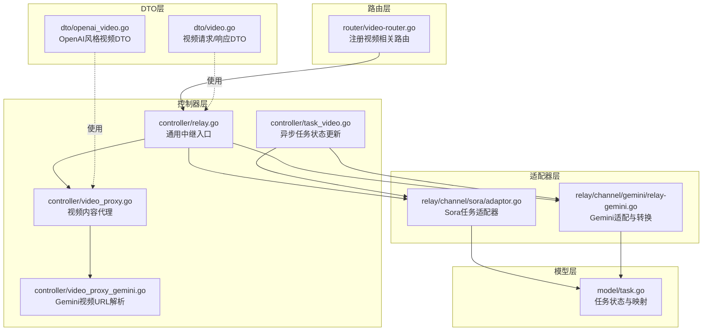
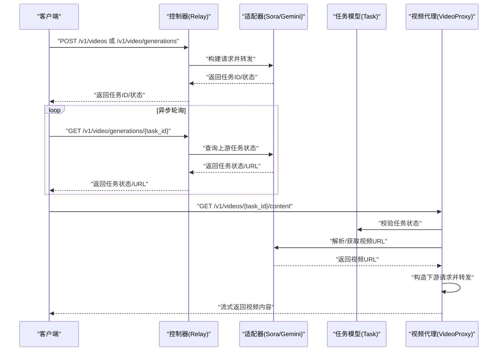
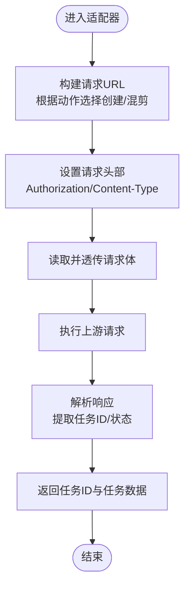
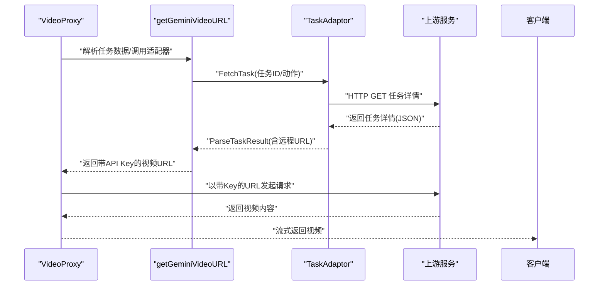
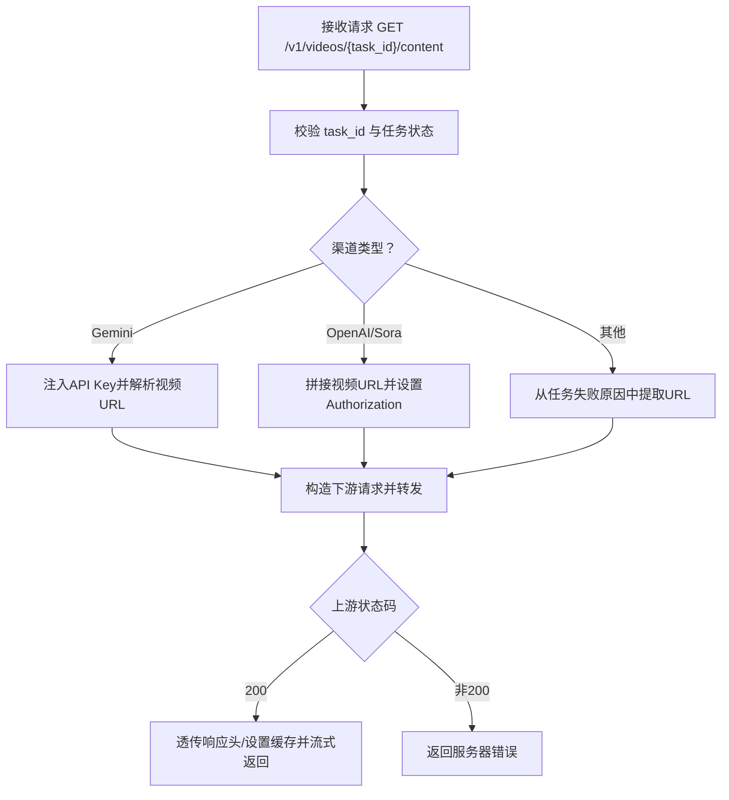
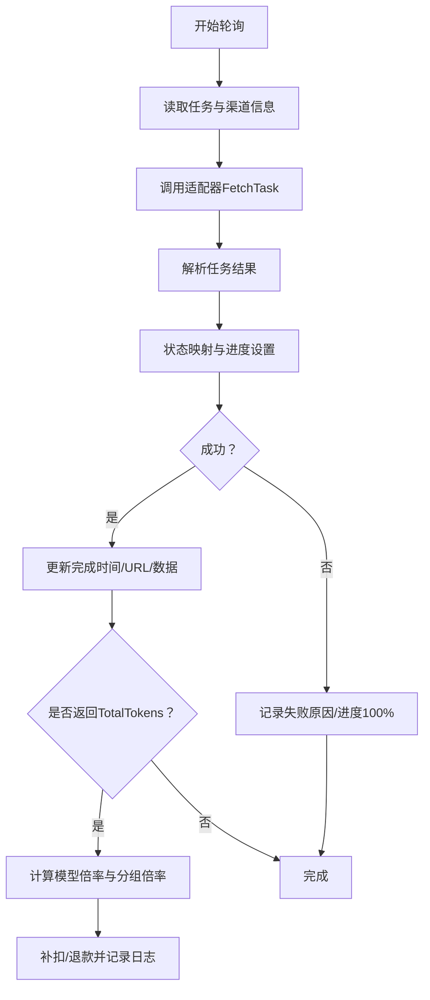
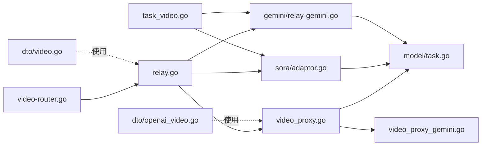

# 视频数据交互协议

<cite>
**本文引用的文件列表**
- [router/video-router.go](file://router/video-router.go)
- [controller/relay.go](file://controller/relay.go)
- [controller/video_proxy.go](file://controller/video_proxy.go)
- [controller/video_proxy_gemini.go](file://controller/video_proxy_gemini.go)
- [controller/task_video.go](file://controller/task_video.go)
- [dto/video.go](file://dto/video.go)
- [dto/openai_video.go](file://dto/openai_video.go)
- [relay/channel/sora/adaptor.go](file://relay/channel/sora/adaptor.go)
- [relay/channel/gemini/relay-gemini.go](file://relay/channel/gemini/relay-gemini.go)
- [model/task.go](file://model/task.go)
</cite>

## 目录
1. [简介](#简介)
2. [项目结构与路由映射](#项目结构与路由映射)
3. [核心组件与数据模型](#核心组件与数据模型)
4. [架构总览](#架构总览)
5. [详细组件分析](#详细组件分析)
6. [依赖关系分析](#依赖关系分析)
7. [性能与可靠性考量](#性能与可靠性考量)
8. [故障排查指南](#故障排查指南)
9. [结论](#结论)
10. [附录：API调用示例与响应解析](#附录api调用示例与响应解析)

## 简介
本文件系统性阐述 new-api 中“视频生成与识别”相关的多媒体交互协议，覆盖以下要点：
- 通过 Sora、Gemini 等模型进行视频生成的 API 调用方式与请求/响应格式
- 视频识别能力的实现机制（视频文件上传、帧提取、内容分析）与现有代码边界说明
- DTO 层的视频相关数据传输对象定义
- 视频代理与任务轮询的请求转发逻辑
- 完整的 API 调用示例与响应解析方法

## 项目结构与路由映射
new-api 的视频相关路由集中在视频模块，统一由路由层注册，控制器层负责鉴权、分发与代理，适配器层对接上游渠道（如 Sora、Gemini），模型层维护任务状态与计费。

图表来源
- [router/video-router.go](file://router/video-router.go#L1-L43)
- [controller/relay.go](file://controller/relay.go#L64-L200)
- [controller/video_proxy.go](file://controller/video_proxy.go#L1-L190)
- [controller/video_proxy_gemini.go](file://controller/video_proxy_gemini.go#L1-L160)
- [controller/task_video.go](file://controller/task_video.go#L1-L308)
- [dto/video.go](file://dto/video.go#L1-L48)
- [dto/openai_video.go](file://dto/openai_video.go#L1-L53)
- [relay/channel/sora/adaptor.go](file://relay/channel/sora/adaptor.go#L1-L216)
- [relay/channel/gemini/relay-gemini.go](file://relay/channel/gemini/relay-gemini.go#L1-L200)
- [model/task.go](file://model/task.go#L1-L200)

章节来源
- [router/video-router.go](file://router/video-router.go#L1-L43)

## 核心组件与数据模型
- 视频请求 DTO：定义视频生成的输入参数，如模型、提示词、图像输入、分辨率、帧率、时长、随机种子、返回格式、用户标识与自定义元数据等。
- 视频任务响应 DTO：包含任务ID、状态、结果URL、格式、元数据与错误信息。
- OpenAI 风格视频 DTO：用于统一视频任务状态与元数据的结构，便于与 OpenAI 兼容。
- 任务模型：封装任务ID、平台、用户、通道、状态、进度、失败原因、时间戳与私有数据等。

章节来源
- [dto/video.go](file://dto/video.go#L1-L48)
- [dto/openai_video.go](file://dto/openai_video.go#L1-L53)
- [model/task.go](file://model/task.go#L1-L200)

## 架构总览
视频交互分为两类场景：
- 视频生成：客户端向 new-api 提交生成请求，new-api 通过适配器对接上游渠道（如 Sora、Gemini），返回任务ID；随后客户端轮询任务状态，最终通过代理访问视频内容。
- 视频识别：仓库中未发现直接的视频识别实现（如上传视频文件、自动帧提取与内容分析）。相关内容在后续“概念性说明”中给出。

图表来源
- [router/video-router.go](file://router/video-router.go#L10-L24)
- [controller/relay.go](file://controller/relay.go#L64-L200)
- [controller/task_video.go](file://controller/task_video.go#L1-L308)
- [controller/video_proxy.go](file://controller/video_proxy.go#L1-L190)
- [controller/video_proxy_gemini.go](file://controller/video_proxy_gemini.go#L1-L160)
- [relay/channel/sora/adaptor.go](file://relay/channel/sora/adaptor.go#L114-L170)
- [model/task.go](file://model/task.go#L13-L30)

## 详细组件分析

### 视频生成：Sora 适配器
- 请求构建
  - URL：根据动作选择“创建视频”或“视频混剪”路径。
  - 头部：携带授权令牌与原始请求的 Content-Type。
  - 请求体：透传客户端原始请求体。
- 响应处理
  - 解析上游响应，提取任务ID；若上游返回字段差异，做兼容处理。
  - 返回标准任务ID与任务状态。
- 任务轮询
  - 通过 GET 任务详情接口查询状态；根据状态映射到内部任务状态。
  - 成功时，生成本地可访问的视频内容代理URL。

图表来源
- [relay/channel/sora/adaptor.go](file://relay/channel/sora/adaptor.go#L85-L170)

章节来源
- [relay/channel/sora/adaptor.go](file://relay/channel/sora/adaptor.go#L1-L216)

### 视频生成：Gemini 适配与代理
- 任务轮询
  - 通过任务适配器拉取任务状态；若上游返回远程URL，直接使用。
  - 若任务数据中已包含视频URI，优先提取。
  - 若解析失败，返回错误。
- 视频代理
  - 针对 Gemini 渠道，代理层会注入 API Key 到请求头。
  - 解析上游返回的视频URL，确保带 API Key 参数后转发。
  - 代理层对上游响应头进行透传，并设置缓存策略。

图表来源
- [controller/video_proxy.go](file://controller/video_proxy.go#L107-L163)
- [controller/video_proxy_gemini.go](file://controller/video_proxy_gemini.go#L1-L160)
- [controller/task_video.go](file://controller/task_video.go#L65-L112)

章节来源
- [controller/video_proxy.go](file://controller/video_proxy.go#L1-L190)
- [controller/video_proxy_gemini.go](file://controller/video_proxy_gemini.go#L1-L160)
- [controller/task_video.go](file://controller/task_video.go#L1-L308)

### 视频代理：内容访问控制与缓存
- 输入校验：要求 task_id 存在且任务已完成。
- 渠道类型分支：针对不同渠道构造视频URL，必要时注入API Key。
- 代理转发：构造下游请求，透传上游响应头，设置缓存策略，流式返回视频内容。
- 错误处理：对上游状态码、URL解析失败、客户端创建失败等情况进行统一错误响应。

图表来源
- [controller/video_proxy.go](file://controller/video_proxy.go#L19-L189)

章节来源
- [controller/video_proxy.go](file://controller/video_proxy.go#L1-L190)

### 任务状态与计费：异步轮询与补扣费
- 任务状态映射：将上游状态映射为内部任务状态，并设置进度百分比。
- 成功态：记录完成时间、失败原因（若非内联数据URL）、按需更新任务数据。
- 补扣费/退款：当上游返回 token 消耗时，依据模型倍率与分组倍率计算实际额度，进行补扣或退款，并记录日志。

图表来源
- [controller/task_video.go](file://controller/task_video.go#L1-L308)
- [model/task.go](file://model/task.go#L13-L30)

章节来源
- [controller/task_video.go](file://controller/task_video.go#L1-L308)
- [model/task.go](file://model/task.go#L1-L200)

### 请求/响应格式与参数说明
- 视频生成请求（DTO）
  - 字段：模型、提示词、图像输入、时长、宽高、帧率、随机种子、数量、返回格式、用户标识、自定义元数据。
  - 用途：描述视频生成的输入参数，支持多厂商差异化扩展。
- 视频生成响应（DTO）
  - 字段：任务ID、状态。
  - 用途：提交任务后的即时响应。
- 任务状态查询响应（DTO）
  - 字段：任务ID、状态、结果URL、格式、元数据、错误信息。
  - 用途：轮询任务状态时的响应。
- OpenAI 风格视频 DTO
  - 字段：任务ID、对象类型、模型、状态、进度、时间戳、尺寸、混剪来源、错误、元数据。
  - 用途：统一视频任务状态与元数据结构，便于与 OpenAI 兼容。

章节来源
- [dto/video.go](file://dto/video.go#L1-L48)
- [dto/openai_video.go](file://dto/openai_video.go#L1-L53)

## 依赖关系分析
- 路由层依赖控制器层；控制器层依赖适配器层与模型层；适配器层依赖上游渠道与任务模型。
- 视频代理依赖任务模型与渠道设置，同时依赖任务适配器解析上游任务结果。
- 任务轮询依赖适配器 FetchTask 接口，统一解析上游任务状态与URL。

图表来源
- [router/video-router.go](file://router/video-router.go#L10-L24)
- [controller/relay.go](file://controller/relay.go#L64-L200)
- [controller/video_proxy.go](file://controller/video_proxy.go#L1-L190)
- [controller/video_proxy_gemini.go](file://controller/video_proxy_gemini.go#L1-L160)
- [controller/task_video.go](file://controller/task_video.go#L1-L308)
- [relay/channel/sora/adaptor.go](file://relay/channel/sora/adaptor.go#L1-L216)
- [relay/channel/gemini/relay-gemini.go](file://relay/channel/gemini/relay-gemini.go#L1-L200)
- [model/task.go](file://model/task.go#L1-L200)
- [dto/video.go](file://dto/video.go#L1-L48)
- [dto/openai_video.go](file://dto/openai_video.go#L1-L53)

## 性能与可靠性考量
- 代理缓存：视频代理设置公共缓存策略，降低上游压力与网络抖动影响。
- 超时控制：代理层设置请求超时，避免阻塞。
- 流式传输：代理层采用 io.Copy 进行流式转发，减少内存占用。
- 重试与退避：中继层具备重试机制与通道错误处理，提升稳定性。
- 任务轮询：异步轮询任务状态，避免阻塞主线程；对上游状态码进行严格校验。

[本节为通用建议，无需列出具体文件来源]

## 故障排查指南
- 任务未完成：视频代理要求任务必须处于成功状态，否则返回无效请求错误。
- 渠道配置缺失：若渠道基础URL为空，将回退默认地址；若代理客户端创建失败，返回服务器错误。
- URL解析失败：上游返回URL解析异常或状态码非200时，返回服务器错误。
- Gemini API Key：代理层会注入API Key，若缺失或解析失败，返回服务器错误。
- 任务轮询异常：适配器解析失败或上游状态为空时，记录错误并设置失败状态。

章节来源
- [controller/video_proxy.go](file://controller/video_proxy.go#L19-L189)
- [controller/video_proxy_gemini.go](file://controller/video_proxy_gemini.go#L1-L160)
- [controller/task_video.go](file://controller/task_video.go#L1-L308)

## 结论
new-api 在视频生成方面提供了完善的中继与代理能力，支持 Sora、Gemini 等渠道的任务提交、状态轮询与视频内容代理访问。通过统一的 DTO 与任务模型，系统实现了跨渠道的一致性与可观测性。对于视频识别场景，当前仓库未提供直接实现，建议基于现有上传与代理框架扩展相应适配器与处理流程。

[本节为总结性内容，无需列出具体文件来源]

## 附录：API调用示例与响应解析

### 视频生成（OpenAI 兼容）
- 路由
  - POST /v1/videos：提交视频生成任务
  - GET /v1/videos/{task_id}：查询任务状态
- 请求参数（DTO）
  - 模型、提示词、图像输入、时长、宽高、帧率、随机种子、数量、返回格式、用户标识、自定义元数据
- 响应
  - 任务ID与状态（提交后立即返回）
  - 轮询后返回结果URL、格式、元数据或错误信息

章节来源
- [router/video-router.go](file://router/video-router.go#L20-L24)
- [dto/video.go](file://dto/video.go#L1-L48)

### 视频生成（Kling 专属）
- 路由
  - POST /kling/v1/videos/text2video
  - POST /kling/v1/videos/image2video
  - GET /kling/v1/videos/text2video/{task_id}
  - GET /kling/v1/videos/image2video/{task_id}
- 请求参数
  - 文本/图像输入、时长、分辨率、运动幅度、BGM等（以渠道为准）

章节来源
- [router/video-router.go](file://router/video-router.go#L26-L33)

### 视频内容访问
- 路由
  - GET /v1/videos/{task_id}/content
- 步骤
  - 校验 task_id 与任务状态
  - 根据渠道类型构造/解析视频URL
  - 注入API Key（如Gemini）
  - 透传响应头并设置缓存，流式返回视频内容

章节来源
- [router/video-router.go](file://router/video-router.go#L10-L18)
- [controller/video_proxy.go](file://controller/video_proxy.go#L1-L190)
- [controller/video_proxy_gemini.go](file://controller/video_proxy_gemini.go#L1-L160)

### 任务状态轮询与计费
- 轮询
  - 通过适配器 FetchTask 获取上游任务状态
  - 将上游状态映射为内部任务状态并更新进度
- 计费
  - 当上游返回 token 消耗时，按模型倍率与分组倍率计算实际额度，进行补扣或退款

章节来源
- [controller/task_video.go](file://controller/task_video.go#L1-L308)
- [relay/channel/sora/adaptor.go](file://relay/channel/sora/adaptor.go#L179-L211)

### 视频识别（概念性说明）
- 当前仓库未提供视频识别的具体实现（如上传视频文件、自动帧提取、内容分析）。
- 若需扩展，可在现有上传与代理框架基础上新增适配器与处理器，遵循统一的 DTO 与任务模型规范。

[本节为概念性说明，无需列出具体文件来源]