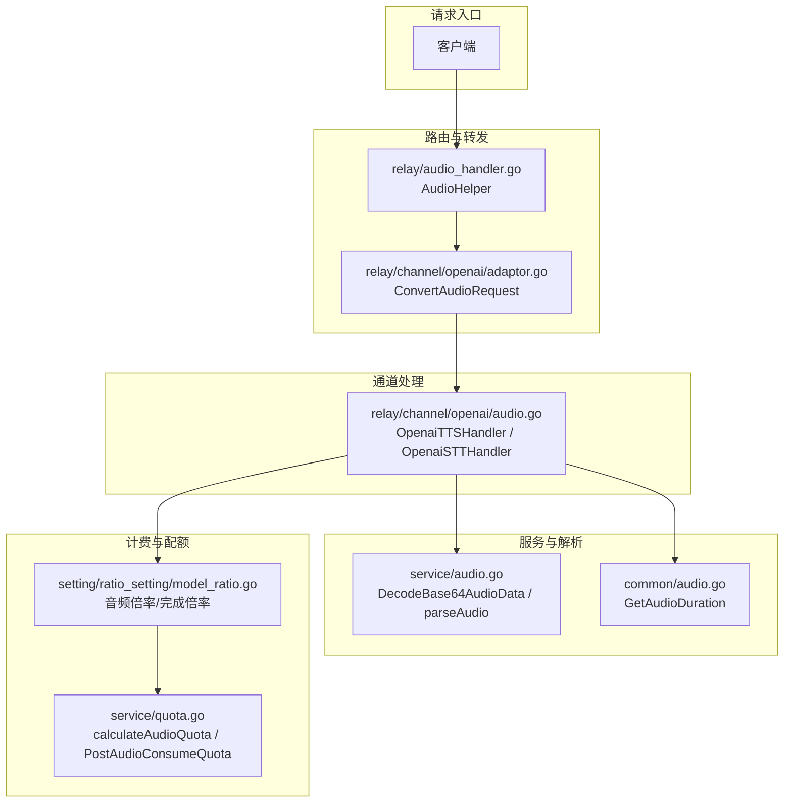
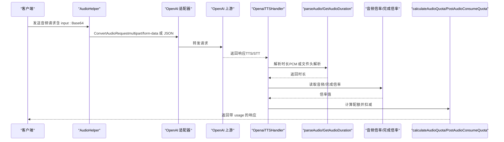
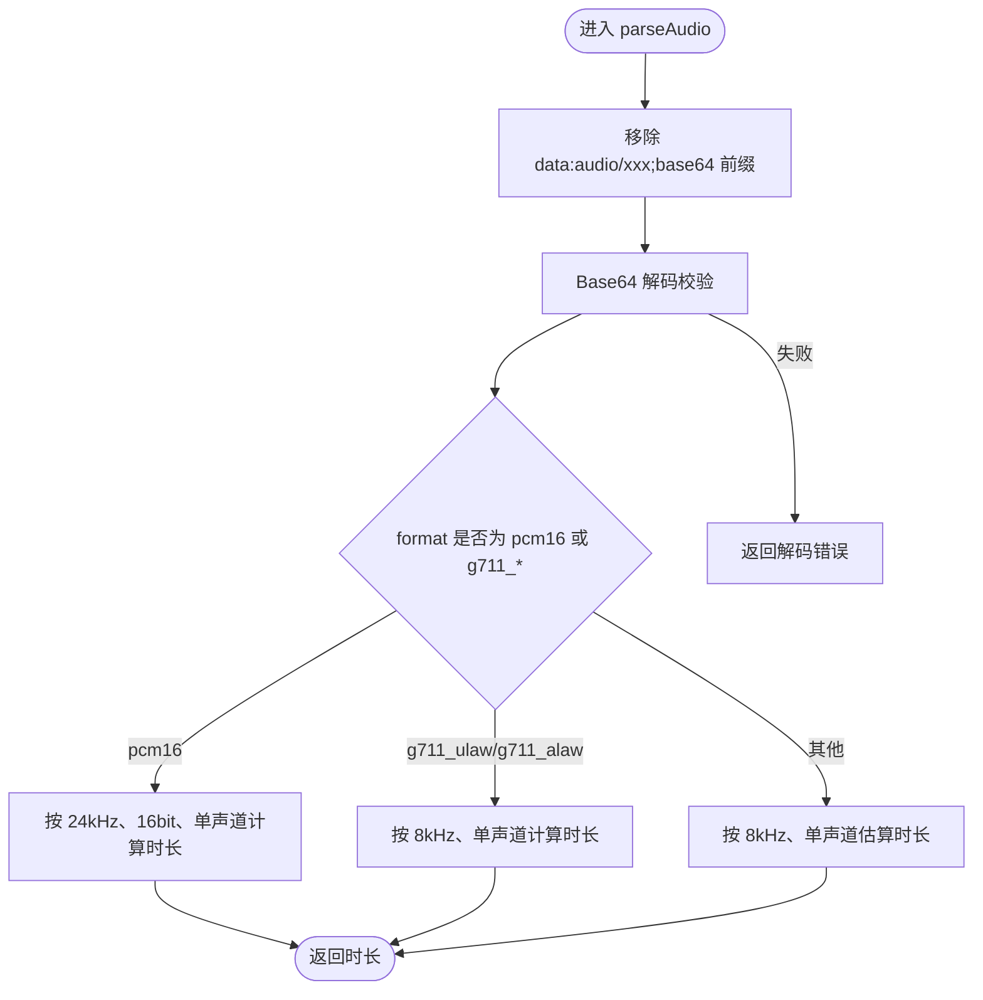
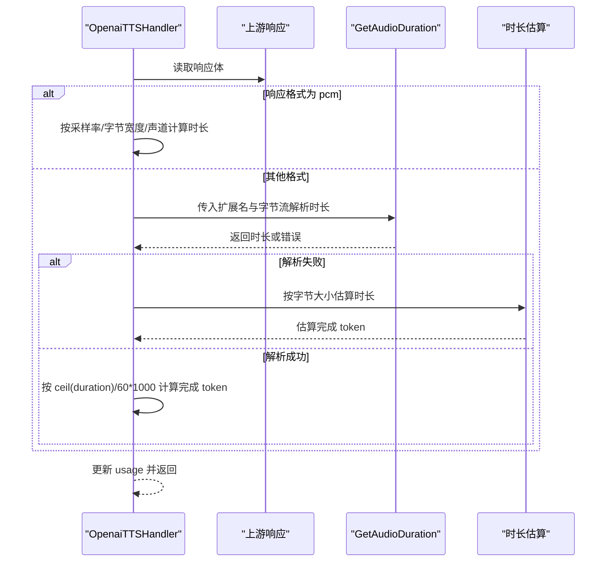
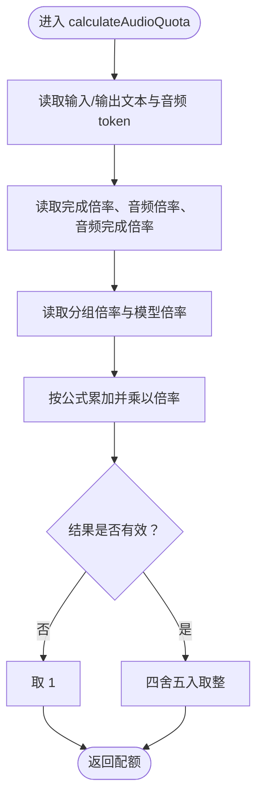
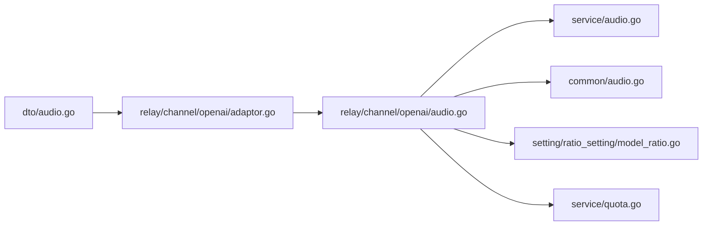

# 音频数据传输协议

<cite>
**本文引用的文件列表**
- [service/audio.go](file://service/audio.go)
- [common/audio.go](file://common/audio.go)
- [relay/channel/openai/audio.go](file://relay/channel/openai/audio.go)
- [relay/channel/openai/adaptor.go](file://relay/channel/openai/adaptor.go)
- [relay/audio_handler.go](file://relay/audio_handler.go)
- [dto/audio.go](file://dto/audio.go)
- [setting/ratio_setting/model_ratio.go](file://setting/ratio_setting/model_ratio.go)
- [service/quota.go](file://service/quota.go)
</cite>

## 目录
1. [引言](#引言)
2. [项目结构与角色定位](#项目结构与角色定位)
3. [核心组件与职责](#核心组件与职责)
4. [架构总览](#架构总览)
5. [详细组件分析](#详细组件分析)
6. [依赖关系分析](#依赖关系分析)
7. [性能与计费特性](#性能与计费特性)
8. [故障排查指南](#故障排查指南)
9. [结论](#结论)
10. [附录：示例与规范](#附录示例与规范)

## 引言
本文件系统化阐述 new-api 中音频数据在 OpenAI 兼容 API 下的传输与处理机制，覆盖以下关键点：
- 如何通过 input 字段携带 Base64 编码的音频数据（含 data:audio/xxx;base64 前缀的处理与校验）
- 在 service/audio.go 中对音频格式（pcm16、g711_ulaw、g711_alaw）的解析与时长计算
- 在 relay/channel/openai/audio.go 中对上游响应的时长解析与 token 估算
- 在 setting/ratio_setting/model_ratio.go 中针对音频模型（如 gpt-4o-audio-preview）的计费倍率与完成倍率配置
- 在 service/quota.go 中的计费逻辑与配额扣减流程
- 提供完整的传输、编码、解析与时长计算示例与规范说明

## 项目结构与角色定位
- DTO 层：定义音频请求与响应结构，承载模型、输入文本、语音、指令、响应格式等字段
- 适配层：将统一的音频请求转换为各渠道（如 OpenAI）的请求格式
- 服务层：负责音频 Base64 解码、格式解析与时长计算
- 通道层：对接上游 OpenAI 兼容接口，处理 TTS/STT 响应并计算 token
- 设置层：维护模型与音频计费倍率映射
- 配额层：基于 token 细分（文本/音频）与倍率计算配额并扣减

图表来源
- [relay/audio_handler.go](file://relay/audio_handler.go#L1-L78)
- [relay/channel/openai/adaptor.go](file://relay/channel/openai/adaptor.go#L346-L409)
- [relay/channel/openai/audio.go](file://relay/channel/openai/audio.go#L21-L112)
- [service/audio.go](file://service/audio.go#L9-L48)
- [common/audio.go](file://common/audio.go#L19-L49)
- [setting/ratio_setting/model_ratio.go](file://setting/ratio_setting/model_ratio.go#L303-L316)
- [service/quota.go](file://service/quota.go#L50-L87)

章节来源
- [relay/audio_handler.go](file://relay/audio_handler.go#L1-L78)
- [relay/channel/openai/adaptor.go](file://relay/channel/openai/adaptor.go#L346-L409)
- [relay/channel/openai/audio.go](file://relay/channel/openai/audio.go#L21-L112)
- [service/audio.go](file://service/audio.go#L9-L48)
- [common/audio.go](file://common/audio.go#L19-L49)
- [setting/ratio_setting/model_ratio.go](file://setting/ratio_setting/model_ratio.go#L303-L316)
- [service/quota.go](file://service/quota.go#L50-L87)

## 核心组件与职责
- DTO 层（音频请求）：承载模型名、输入文本、语音、指令、响应格式、速度、流式格式、元数据等字段
- 适配器（ConvertAudioRequest）：将统一请求转换为 OpenAI 兼容的 multipart/form-data（含 file 字段）或直接 JSON（speech 模式）
- 服务层（Base64 解码与格式解析）：移除 data:audio/xxx;base64 前缀，校验 Base64；按格式计算时长（pcm16、g711_ulaw、g711_alaw）
- 通道层（OpenaiTTSHandler/OpenaiSTTHandler）：解析上游响应，计算音频时长与 token；在 STT 场景下回传 usage
- 设置层（音频倍率/完成倍率）：为音频模型配置输入/输出倍率与完成倍率
- 配额层（calculateAudioQuota/PostAudioConsumeQuota）：按文本/音频 token 与倍率计算配额并扣减

章节来源
- [dto/audio.go](file://dto/audio.go#L12-L21)
- [relay/channel/openai/adaptor.go](file://relay/channel/openai/adaptor.go#L346-L409)
- [service/audio.go](file://service/audio.go#L9-L48)
- [relay/channel/openai/audio.go](file://relay/channel/openai/audio.go#L21-L112)
- [setting/ratio_setting/model_ratio.go](file://setting/ratio_setting/model_ratio.go#L303-L316)
- [service/quota.go](file://service/quota.go#L50-L87)

## 架构总览
下图展示从客户端到上游、再到计费与配额的整体链路，重点标注音频数据在各阶段的处理点。

图表来源
- [relay/audio_handler.go](file://relay/audio_handler.go#L1-L78)
- [relay/channel/openai/adaptor.go](file://relay/channel/openai/adaptor.go#L346-L409)
- [relay/channel/openai/audio.go](file://relay/channel/openai/audio.go#L21-L112)
- [service/audio.go](file://service/audio.go#L9-L48)
- [common/audio.go](file://common/audio.go#L19-L49)
- [setting/ratio_setting/model_ratio.go](file://setting/ratio_setting/model_ratio.go#L303-L316)
- [service/quota.go](file://service/quota.go#L50-L87)

## 详细组件分析

### 组件一：音频请求与传输（DTO 与适配器）
- DTO 结构：包含模型名、输入文本、语音、指令、响应格式、速度、流式格式、元数据等字段
- 适配器转换：
  - speech 模式：直接序列化为 JSON
  - 其他模式：构建 multipart/form-data，写入 model、其他表单项，并将 file 字段作为二进制上传
- 传输规范：
  - 输入字段 input 支持 Base64 字符串（可带 data:audio/xxx;base64 前缀），由服务层进行前缀剥离与 Base64 校验

章节来源
- [dto/audio.go](file://dto/audio.go#L12-L21)
- [relay/channel/openai/adaptor.go](file://relay/channel/openai/adaptor.go#L346-L409)
- [service/audio.go](file://service/audio.go#L34-L48)

### 组件二：Base64 音频数据解析与格式识别
- 前缀处理：若字符串包含逗号，则移除逗号及之前的 data:audio/xxx;base64 前缀
- Base64 校验：对剥离后的字符串执行标准 Base64 解码，失败则报错
- 格式与时长计算：
  - pcm16：按 24kHz、16bit、单声道计算样本数与时长
  - g711_ulaw / g711_alaw：按 8kHz、单声道计算时长
  - 其他格式：按原始字节数按 8kHz、单声道估算时长

图表来源
- [service/audio.go](file://service/audio.go#L9-L32)

章节来源
- [service/audio.go](file://service/audio.go#L9-L32)

### 组件三：上游响应时长解析与 token 估算
- TTS 响应处理：
  - 若响应格式为 pcm：直接按采样率 24000、字节宽度 2、声道 1 计算时长
  - 否则：根据响应格式扩展名调用 common.GetAudioDuration 进行文件头解析
  - 若解析失败：按字节大小粗略估算（每 KB 约 1 token），再按 ceil(duration)/60*1000 计算每分钟 1000 token 的完成 token
- STT 响应处理：
  - 读取上游返回的 usage，若存在则使用；否则按估算策略生成 usage

图表来源
- [relay/channel/openai/audio.go](file://relay/channel/openai/audio.go#L71-L112)
- [common/audio.go](file://common/audio.go#L19-L49)

章节来源
- [relay/channel/openai/audio.go](file://relay/channel/openai/audio.go#L71-L112)
- [common/audio.go](file://common/audio.go#L19-L49)

### 组件四：计费倍率与配额扣减
- 音频模型倍率配置：
  - defaultAudioRatio：为音频模型（如 gpt-4o-audio-preview、gpt-4o-mini-audio-preview 等）设置输入倍率
  - defaultAudioCompletionRatio：为音频模型设置输出完成倍率
- 计费公式（calculateAudioQuota）：
  - 输入文本 token + 输出文本 token×完成倍率 + 输入音频 token×音频倍率 + 输出音频 token×音频倍率×完成倍率
  - 最终乘以分组倍率与模型倍率，若结果非零且小于等于 0，则取 1
- 配额扣减（PostAudioConsumeQuota）：
  - 在音频场景下，区分输入/输出音频 token，结合倍率与分组/模型倍率计算配额并扣减

图表来源
- [service/quota.go](file://service/quota.go#L50-L87)
- [setting/ratio_setting/model_ratio.go](file://setting/ratio_setting/model_ratio.go#L303-L316)

章节来源
- [service/quota.go](file://service/quota.go#L50-L87)
- [setting/ratio_setting/model_ratio.go](file://setting/ratio_setting/model_ratio.go#L303-L316)

### 组件五：音频请求处理主流程（Relay）
- AudioHelper：
  - 初始化通道元信息
  - 校验请求类型为音频请求
  - 模型映射与适配器初始化
  - ConvertAudioRequest 生成请求体
  - 发起上游请求并处理响应
  - 若 usage 中包含音频 token，则调用 PostAudioConsumeQuota 扣减配额

章节来源
- [relay/audio_handler.go](file://relay/audio_handler.go#L1-L78)

## 依赖关系分析
- 低耦合高内聚：
  - DTO 与适配器之间通过统一的 AudioRequest 结构解耦
  - 服务层与通道层通过 usage 与时长解析接口解耦
- 关键依赖链：
  - relay/audio_handler.go 依赖 relay/channel/openai/adaptor.go 与 service/quota.go
  - relay/channel/openai/audio.go 依赖 service/audio.go 与 common/audio.go
  - service/quota.go 依赖 setting/ratio_setting/model_ratio.go

图表来源
- [dto/audio.go](file://dto/audio.go#L12-L21)
- [relay/channel/openai/adaptor.go](file://relay/channel/openai/adaptor.go#L346-L409)
- [relay/channel/openai/audio.go](file://relay/channel/openai/audio.go#L21-L112)
- [service/audio.go](file://service/audio.go#L9-L48)
- [common/audio.go](file://common/audio.go#L19-L49)
- [setting/ratio_setting/model_ratio.go](file://setting/ratio_setting/model_ratio.go#L303-L316)
- [service/quota.go](file://service/quota.go#L50-L87)

章节来源
- [dto/audio.go](file://dto/audio.go#L12-L21)
- [relay/channel/openai/adaptor.go](file://relay/channel/openai/adaptor.go#L346-L409)
- [relay/channel/openai/audio.go](file://relay/channel/openai/audio.go#L21-L112)
- [service/audio.go](file://service/audio.go#L9-L48)
- [common/audio.go](file://common/audio.go#L19-L49)
- [setting/ratio_setting/model_ratio.go](file://setting/ratio_setting/model_ratio.go#L303-L316)
- [service/quota.go](file://service/quota.go#L50-L87)

## 性能与计费特性
- 时长解析性能：
  - PCM 直接计算，O(1) 时间复杂度
  - 文件头解析依赖第三方库，复杂度与文件大小成正比
- 计费倍率：
  - 不同音频模型具有独立的音频倍率与完成倍率，可在设置层动态调整
- 配额计算：
  - 文本 token 与音频 token 分别参与计算，确保计费粒度清晰
  - 若倍率非零但计算结果小于等于 0，强制取 1，避免误扣

[本节为通用性能讨论，无需列出具体文件来源]

## 故障排查指南
- Base64 前缀与解码错误：
  - 现象：提示 Base64 解码失败
  - 排查：确认 input 字段是否包含 data:audio/xxx;base64 前缀；若存在需移除逗号及之前部分后再解码
- 时长解析失败：
  - 现象：无法获取音频时长，使用按字节估算的完成 token
  - 排查：确认响应格式扩展名与实际内容一致；对于不支持的容器（如 WebM），建议使用 ffprobe
- 倍率未生效：
  - 现象：计费异常
  - 排查：检查模型名称是否匹配 defaultAudioRatio/defaultAudioCompletionRatio 中的键；必要时在设置界面更新 JSON

章节来源
- [service/audio.go](file://service/audio.go#L34-L48)
- [relay/channel/openai/audio.go](file://relay/channel/openai/audio.go#L71-L112)
- [setting/ratio_setting/model_ratio.go](file://setting/ratio_setting/model_ratio.go#L303-L316)

## 结论
new-api 在 OpenAI 兼容 API 下实现了完整的音频数据传输与处理闭环：
- 请求侧通过统一 DTO 与适配器转换，支持 Base64 与文件上传两种方式
- 服务层与通道层分别承担 Base64 解析与时长计算、上游响应处理与 token 估算
- 设置层提供灵活的音频计费倍率配置，配额层以文本/音频双维度精确计费
- 整体流程清晰、可扩展性强，便于接入多渠道与多模型的音频能力

[本节为总结性内容，无需列出具体文件来源]

## 附录：示例与规范

### 请求格式与编码规范
- 请求体字段（示例字段）：
  - model：目标模型名（如 gpt-4o-audio-preview）
  - input：文本输入（用于 TTS 生成）
  - voice：声音风格（如 alloy、shimmer、nova）
  - instructions：附加指令（可选）
  - response_format：响应格式（如 mp3、flac、wav、pcm）
  - speed：语速（可选）
  - stream_format：流式格式（如 sse，可选）
  - metadata：元数据（可选）
- Base64 数据前缀处理：
  - input 字段可携带 data:audio/xxx;base64 前缀；服务层会自动剥离前缀并校验 Base64
- 传输方式：
  - speech 模式：直接发送 JSON
  - 其他模式：multipart/form-data，file 字段为音频文件

章节来源
- [dto/audio.go](file://dto/audio.go#L12-L21)
- [relay/channel/openai/adaptor.go](file://relay/channel/openai/adaptor.go#L346-L409)
- [service/audio.go](file://service/audio.go#L34-L48)

### 时长计算方法
- PCM（response_format=pcm）：
  - 采样率 24000 Hz，位深度 16 bit，声道 1
  - 时长 = 字节长度 / (采样率 × 每样本字节 × 声道数)
- 其他格式（如 mp3、wav、flac、m4a、ogg、aiff、aac）：
  - 通过 common.GetAudioDuration 解析文件头获取时长
  - 若解析失败，按字节大小估算完成 token（每 KB 约 1 token）

章节来源
- [relay/channel/openai/audio.go](file://relay/channel/openai/audio.go#L71-L112)
- [common/audio.go](file://common/audio.go#L19-L49)

### 计费逻辑与倍率配置
- 音频模型倍率（defaultAudioRatio）：
  - 示例：gpt-4o-audio-preview、gpt-4o-mini-audio-preview 等
- 音频完成倍率（defaultAudioCompletionRatio）：
  - 示例：gpt-4o-realtime、gpt-4o-mini-realtime、gpt-4o-mini-tts 等
- 配额计算（calculateAudioQuota）：
  - 输入文本 token + 输出文本 token×完成倍率 + 输入音频 token×音频倍率 + 输出音频 token×音频倍率×完成倍率
  - 最终乘以分组倍率与模型倍率，若结果小于等于 0 且倍率非零，取 1

章节来源
- [setting/ratio_setting/model_ratio.go](file://setting/ratio_setting/model_ratio.go#L303-L316)
- [service/quota.go](file://service/quota.go#L50-L87)

### 完整示例（步骤说明）
- 步骤 1：客户端构造请求
  - model: gpt-4o-audio-preview
  - input: "你好世界"
  - voice: "alloy"
  - response_format: "mp3"
  - （可选）stream_format: "sse"
- 步骤 2：服务端剥离 data:audio/xxx;base64 前缀并校验 Base64
- 步骤 3：通道层解析上游响应
  - 若 response_format=pcm：按采样率计算时长
  - 否则：按扩展名解析时长；失败则按字节估算
- 步骤 4：根据时长计算完成 token（每分钟 1000 token）
- 步骤 5：读取音频倍率与完成倍率，计算配额并扣减
- 步骤 6：返回带 usage 的响应

章节来源
- [service/audio.go](file://service/audio.go#L34-L48)
- [relay/channel/openai/audio.go](file://relay/channel/openai/audio.go#L71-L112)
- [setting/ratio_setting/model_ratio.go](file://setting/ratio_setting/model_ratio.go#L303-L316)
- [service/quota.go](file://service/quota.go#L50-L87)