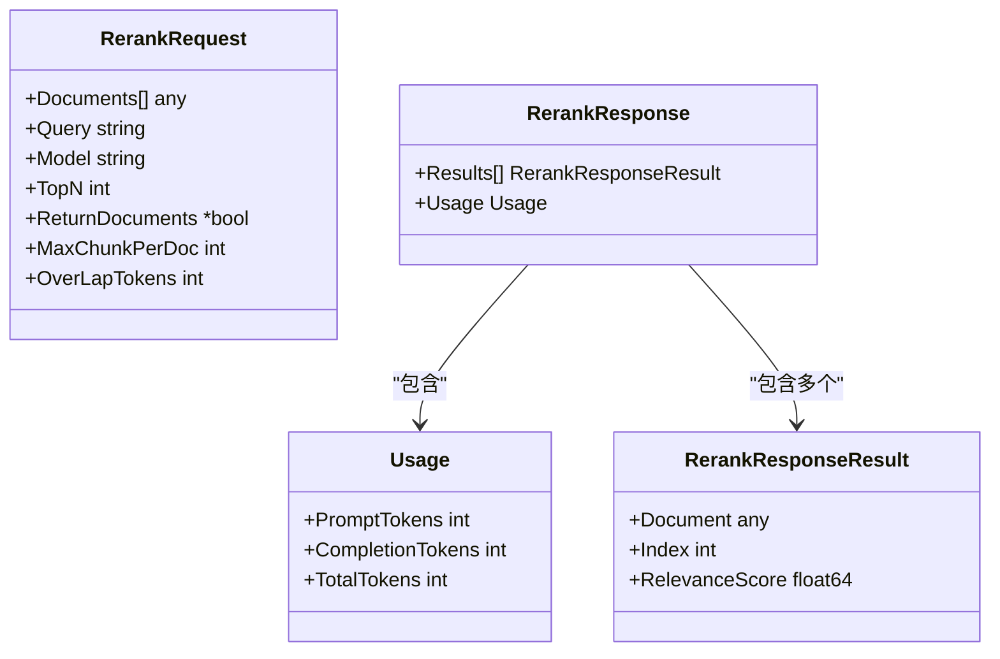
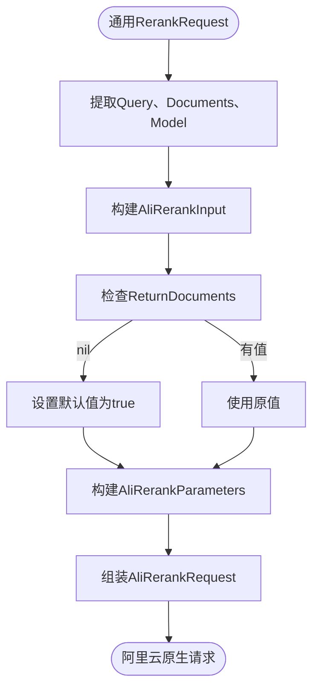
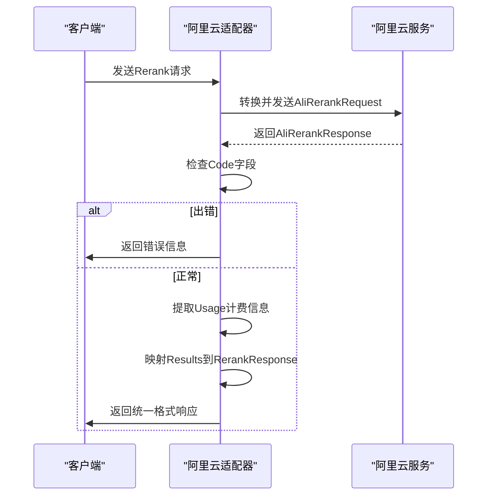
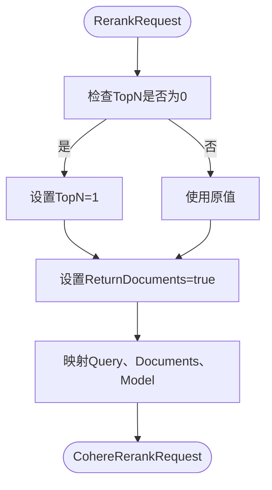
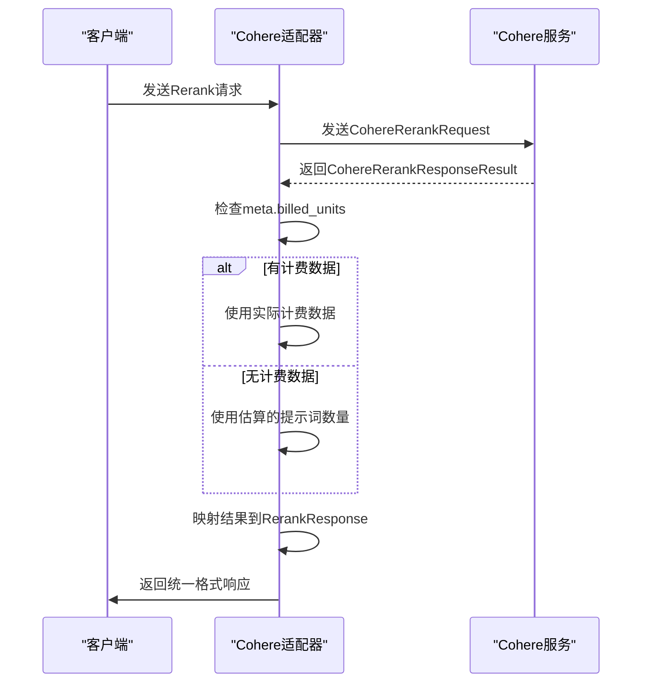
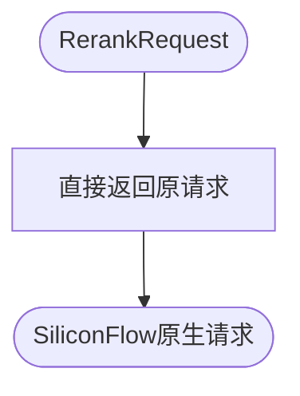
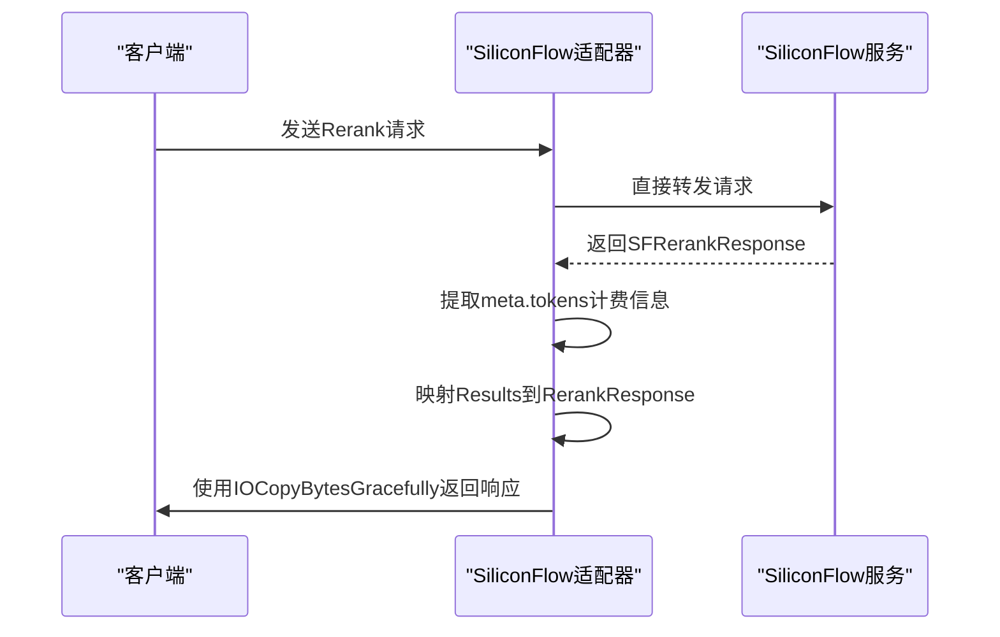
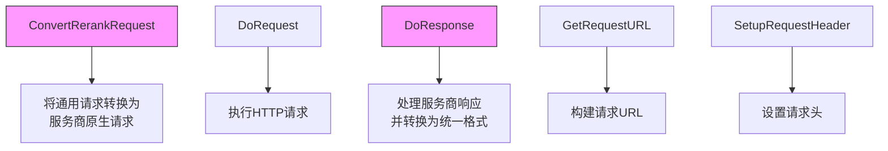

# 渠道适配器实现

<cite>
**本文档引用的文件**  
- [rerank.go](file://dto/rerank.go)
- [ali/rerank.go](file://relay/channel/ali/rerank.go)
- [ali/dto.go](file://relay/channel/ali/dto.go)
- [cohere/relay-cohere.go](file://relay/channel/cohere/relay-cohere.go)
- [cohere/dto.go](file://relay/channel/cohere/dto.go)
- [siliconflow/relay-siliconflow.go](file://relay/channel/siliconflow/relay-siliconflow.go)
- [siliconflow/dto.go](file://relay/channel/siliconflow/dto.go)
- [common_handler/rerank.go](file://relay/common_handler/rerank.go)
- [rerank_handler.go](file://relay/rerank_handler.go)
</cite>

## 目录
1. [引言](#引言)
2. [核心数据结构](#核心数据结构)
3. [阿里云适配器分析](#阿里云适配器分析)
4. [Cohere适配器分析](#cohere适配器分析)
5. [SiliconFlow适配器分析](#siliconflow适配器分析)
6. [适配器差异对比](#适配器差异对比)
7. [错误处理机制](#错误处理机制)
8. [新增服务商支持指南](#新增服务商支持指南)

## 引言
本文档详细分析了在AI服务网关系统中，针对重排序（Rerank）功能的多个渠道适配器的实现差异。重点对比了阿里云、Cohere和SiliconFlow三个服务商的适配器实现，包括请求转换、响应映射、计费信息提取和错误处理等关键环节。通过深入分析代码实现，为开发者提供清晰的适配器开发和维护指南。

## 核心数据结构
系统定义了统一的重排序请求和响应数据结构，作为各渠道适配器的输入和输出标准。



**图示来源**  
- [rerank.go](file://dto/rerank.go#L11-L67)

**本节来源**  
- [rerank.go](file://dto/rerank.go#L11-L67)

## 阿里云适配器分析
阿里云适配器实现了从统一的`RerankRequest`到阿里云原生请求格式的转换，并处理其响应。

### 请求转换
阿里云适配器将通用的重排序请求转换为阿里云特定的`AliRerankRequest`结构。该转换过程包括：
- 将查询和文档封装到`Input`字段
- 将`TopN`和`ReturnDocuments`参数封装到`Parameters`字段
- 默认启用文档返回功能



**图示来源**  
- [ali/rerank.go](file://relay/channel/ali/rerank.go#L16-L33)

### 响应处理
阿里云适配器的响应处理流程包括：
1. 解析阿里云原生响应`AliRerankResponse`
2. 检查`Code`字段判断是否出错
3. 从`Usage`字段提取计费信息
4. 映射结果到统一的`RerankResponse`格式



**图示来源**  
- [ali/rerank.go](file://relay/channel/ali/rerank.go#L35-L75)
- [ali/dto.go](file://relay/channel/ali/dto.go#L144-L151)

**本节来源**  
- [ali/rerank.go](file://relay/channel/ali/rerank.go#L16-L75)
- [ali/dto.go](file://relay/channel/ali/dto.go#L128-L151)

## Cohere适配器分析
Cohere适配器处理了与阿里云不同的响应结构和计费信息提取方式。

### 请求转换
Cohere适配器的请求转换相对直接，主要进行字段映射和默认值设置：
- `TopN`默认值为1
- `ReturnDocuments`固定为true
- 直接映射其他字段



**图示来源**  
- [cohere/relay-cohere.go](file://relay/channel/cohere/relay-cohere.go#L57-L68)

### 响应处理
Cohere适配器的响应处理具有以下特点：
- 计费信息从`meta`字段的`billed_units`中提取
- 支持回退机制：当`billed_units`为空时，使用估算的提示词数量
- 错误处理采用直接透传方式



**图示来源**  
- [cohere/relay-cohere.go](file://relay/channel/cohere/relay-cohere.go#L215-L249)
- [cohere/dto.go](file://relay/channel/cohere/dto.go#L42-L45)

**本节来源**  
- [cohere/relay-cohere.go](file://relay/channel/cohere/relay-cohere.go#L57-L249)
- [cohere/dto.go](file://relay/channel/cohere/dto.go#L34-L61)

## SiliconFlow适配器分析
SiliconFlow适配器的实现与其他服务商有显著不同。

### 请求转换
SiliconFlow适配器的请求转换最为简单，直接将通用请求作为原生请求使用，无需转换。



**图示来源**  
- [siliconflow/adaptor.go](file://relay/channel/siliconflow/adaptor.go#L102-L104)

### 响应处理
SiliconFlow适配器的响应处理流程：
- 从`meta.tokens`字段提取详细的输入和输出token计数
- 计费信息提取是必需的，没有回退机制
- 使用`IOCopyBytesGracefully`进行响应写入



**图示来源**  
- [siliconflow/relay-siliconflow.go](file://relay/channel/siliconflow/relay-siliconflow.go#L16-L45)
- [siliconflow/dto.go](file://relay/channel/siliconflow/dto.go#L14-L17)

**本节来源**  
- [siliconflow/adaptor.go](file://relay/channel/siliconflow/adaptor.go#L102-L104)
- [siliconflow/relay-siliconflow.go](file://relay/channel/siliconflow/relay-siliconflow.go#L16-L45)
- [siliconflow/dto.go](file://relay/channel/siliconflow/dto.go#L14-L17)

## 适配器差异对比
以下表格总结了三个服务商适配器的关键差异：

| 特性 | 阿里云 | Cohere | SiliconFlow |
|------|--------|--------|-------------|
| **请求转换复杂度** | 高 | 中 | 低 |
| **计费信息位置** | usage字段 | meta.billed_units字段 | meta.tokens字段 |
| **计费信息回退机制** | 无 | 有（使用估算值） | 无 |
| **错误处理方式** | 通过Code字段判断 | 直接透传 | 直接透传 |
| **文档返回处理** | 可配置 | 固定为true | 依赖上游 |
| **响应写入方式** | Writer.Write | Writer.Write | IOCopyBytesGracefully |

**本节来源**  
- [ali/rerank.go](file://relay/channel/ali/rerank.go)
- [cohere/relay-cohere.go](file://relay/channel/cohere/relay-cohere.go)
- [siliconflow/relay-siliconflow.go](file://relay/channel/siliconflow/relay-siliconflow.go)

## 错误处理机制
各服务商适配器采用了不同的错误处理策略：

### 阿里云错误处理
阿里云通过响应中的`Code`字段来判断错误状态。当`Code`不为空时，将其转换为标准的OpenAI错误格式返回。

```go
if aliResponse.Code != "" {
    return types.WithOpenAIError(types.OpenAIError{
        Message: aliResponse.Message,
        Type:    aliResponse.Code,
        Param:   aliResponse.RequestId,
        Code:    aliResponse.Code,
    }, resp.StatusCode), nil
}
```

这种机制允许精确捕获和传递阿里云特定的错误代码和消息。

### Cohere和SiliconFlow错误处理
Cohere和SiliconFlow采用直接透传的错误处理方式。它们不进行特殊的错误状态判断，而是依赖于通用的HTTP状态码和响应体解析错误处理。

当HTTP状态码不是200时，系统会通过`RelayErrorHandler`进行统一的错误处理，而不是在适配器层面处理特定错误。

**本节来源**  
- [ali/rerank.go](file://relay/channel/ali/rerank.go#L48-L55)
- [cohere/relay-cohere.go](file://relay/channel/cohere/relay-cohere.go)
- [siliconflow/relay-siliconflow.go](file://relay/channel/siliconflow/relay-siliconflow.go)
- [rerank_handler.go](file://relay/rerank_handler.go#L85-L88)

## 新增服务商支持指南
基于对现有适配器的分析，以下是新增服务商支持的步骤和注意事项。

### 实现步骤
1. **创建适配器目录**：在`relay/channel/`下创建新服务商的目录
2. **定义DTO结构**：创建`dto.go`文件，定义原生请求和响应结构
3. **实现Adaptor接口**：创建`adaptor.go`文件，实现`Adaptor`接口的所有方法
4. **实现响应处理器**：创建`relay-{service}.go`文件，实现`DoResponse`方法
5. **注册服务商**：在相关常量文件中注册新的服务商类型

### 关键方法实现
新增服务商需要重点关注以下方法的实现：



**图示来源**  
- [adaptor.go](file://relay/channel/adapter.go)

### 注意事项
1. **计费信息提取**：明确服务商计费信息的位置，决定是否需要回退机制
2. **错误处理策略**：根据服务商的错误响应格式选择合适的处理方式
3. **默认值处理**：为可选参数设置合理的默认值
4. **兼容性考虑**：确保转换逻辑能处理各种边界情况
5. **性能优化**：避免不必要的数据复制和转换操作

**本节来源**  
- [adaptor.go](file://relay/channel/adapter.go)
- [ali/rerank.go](file://relay/channel/ali/rerank.go)
- [cohere/relay-cohere.go](file://relay/channel/cohere/relay-cohere.go)
- [siliconflow/relay-siliconflow.go](file://relay/channel/siliconflow/relay-siliconflow.go)