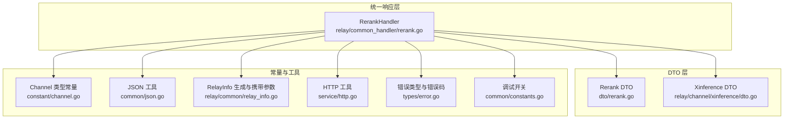
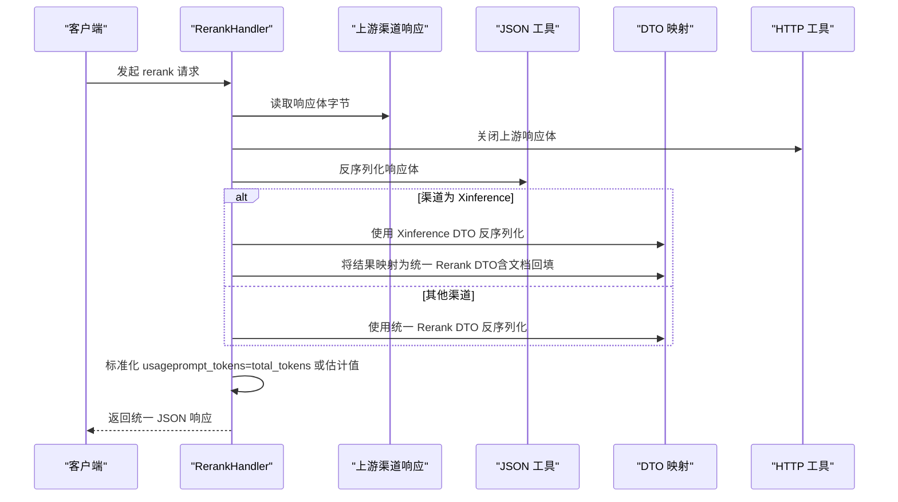
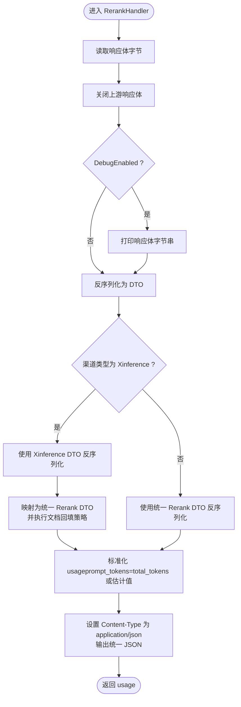
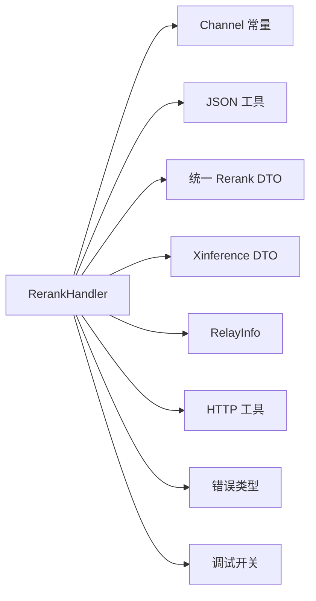

# 统一响应处理器

<cite>
**本文引用的文件列表**
- [relay/common_handler/rerank.go](file://relay/common_handler/rerank.go)
- [dto/rerank.go](file://dto/rerank.go)
- [relay/channel/xinference/dto.go](file://relay/channel/xinference/dto.go)
- [constant/channel.go](file://constant/channel.go)
- [relay/common/relay_info.go](file://relay/common/relay_info.go)
- [common/json.go](file://common/json.go)
- [service/http.go](file://service/http.go)
- [types/error.go](file://types/error.go)
- [common/constants.go](file://common/constants.go)
</cite>

## 目录
1. [简介](#简介)
2. [项目结构](#项目结构)
3. [核心组件](#核心组件)
4. [架构总览](#架构总览)
5. [详细组件分析](#详细组件分析)
6. [依赖关系分析](#依赖关系分析)
7. [性能考量](#性能考量)
8. [故障排查指南](#故障排查指南)
9. [结论](#结论)

## 简介
本文件聚焦于统一响应处理器中的 RerankHandler 实现机制，系统性说明其如何作为统一响应处理器，协调不同 AI 服务商的响应差异。重点解析 Xinference 特殊渠道的处理逻辑，包括：
- 响应结果的转换与映射
- 文档内容的回填策略（当上游返回空文档时使用原始请求文档）
- usage 信息的估算方法
- 通用处理流程：响应体读取、JSON 反序列化、usage 字段标准化（将 total_tokens 赋值给 prompt_tokens）和统一格式输出
- 调试日志的输出机制与错误处理策略

## 项目结构
RerankHandler 所在位置与相关模块如下：
- 统一响应处理器：relay/common_handler/rerank.go
- 请求/响应数据模型：dto/rerank.go
- Xinference 渠道 DTO：relay/channel/xinference/dto.go
- 渠道类型常量：constant/channel.go
- 通用中继信息：relay/common/relay_info.go
- JSON 工具：common/json.go
- HTTP 工具（关闭响应体、复制响应体）：service/http.go
- 错误类型与错误码：types/error.go
- 调试开关常量：common/constants.go

图表来源
- [relay/common_handler/rerank.go](file://relay/common_handler/rerank.go#L1-L76)
- [dto/rerank.go](file://dto/rerank.go#L1-L68)
- [relay/channel/xinference/dto.go](file://relay/channel/xinference/dto.go#L1-L12)
- [constant/channel.go](file://constant/channel.go#L1-L207)
- [relay/common/relay_info.go](file://relay/common/relay_info.go#L300-L310)
- [common/json.go](file://common/json.go#L1-L46)
- [service/http.go](file://service/http.go#L1-L61)
- [types/error.go](file://types/error.go#L1-L365)
- [common/constants.go](file://common/constants.go#L71-L72)

章节来源
- [relay/common_handler/rerank.go](file://relay/common_handler/rerank.go#L1-L76)
- [dto/rerank.go](file://dto/rerank.go#L1-L68)
- [relay/channel/xinference/dto.go](file://relay/channel/xinference/dto.go#L1-L12)
- [constant/channel.go](file://constant/channel.go#L1-L207)
- [relay/common/relay_info.go](file://relay/common/relay_info.go#L300-L310)
- [common/json.go](file://common/json.go#L1-L46)
- [service/http.go](file://service/http.go#L1-L61)
- [types/error.go](file://types/error.go#L1-L365)
- [common/constants.go](file://common/constants.go#L71-L72)

## 核心组件
- RerankHandler：统一响应处理器，负责读取上游响应、反序列化、差异化转换、usage 标准化与输出。
- Rerank DTO：统一的 rerank 响应结构，包含 results 和 usage 字段。
- Xinference DTO：Xinference 渠道特有的 rerank 响应结构，字段略有差异。
- RelayInfo：承载请求上下文、渠道类型、文档列表、返回文档开关等关键信息。
- JSON 工具：提供通用的 JSON 反序列化能力。
- HTTP 工具：提供安全关闭响应体与复制响应体的能力。
- 错误类型与错误码：统一错误封装与错误码定义。
- 调试开关：控制调试日志输出。

章节来源
- [relay/common_handler/rerank.go](file://relay/common_handler/rerank.go#L1-L76)
- [dto/rerank.go](file://dto/rerank.go#L41-L68)
- [relay/channel/xinference/dto.go](file://relay/channel/xinference/dto.go#L1-L12)
- [relay/common/relay_info.go](file://relay/common/relay_info.go#L41-L50)
- [common/json.go](file://common/json.go#L1-L46)
- [service/http.go](file://service/http.go#L1-L61)
- [types/error.go](file://types/error.go#L1-L365)
- [common/constants.go](file://common/constants.go#L71-L72)

## 架构总览
RerankHandler 的工作流如下：
- 读取上游响应体为字节
- 判断渠道类型（如 Xinference）
- 若为 Xinference，则使用 Xinference DTO 进行反序列化，并将结果映射到统一 Rerank DTO；否则直接使用统一 DTO 反序列化
- 文档回填策略：若上游返回的文档为空字符串或缺失，则回填为原始请求文档
- usage 标准化：将 total_tokens 赋值给 prompt_tokens；对于 Xinference，使用估计的 prompt tokens
- 输出统一格式 JSON，并返回 usage

图表来源
- [relay/common_handler/rerank.go](file://relay/common_handler/rerank.go#L18-L74)
- [common/json.go](file://common/json.go#L1-L46)
- [dto/rerank.go](file://dto/rerank.go#L41-L68)
- [relay/channel/xinference/dto.go](file://relay/channel/xinference/dto.go#L1-L12)
- [service/http.go](file://service/http.go#L1-L23)

## 详细组件分析

### RerankHandler 实现机制
- 响应体读取与关闭
  - 使用 io.ReadAll 读取响应体字节
  - 调用 CloseResponseBodyGracefully 安全关闭上游响应体
- 调试日志
  - 在 DebugEnabled 开启时打印 reranker 响应体字节串
- JSON 反序列化
  - 使用 common.Unmarshal 将字节反序列化为对应 DTO
  - 若反序列化失败，返回标准化错误
- 渠道差异化处理
  - 当 ChannelType 为 Xinference 时，先使用 Xinference DTO 反序列化，再映射到统一 Rerank DTO
  - 否则直接使用统一 Rerank DTO 反序列化
- 文档回填策略
  - 若 ReturnDocuments 为真且上游返回的文档为字符串且为空，则回填为原始请求文档（通过 RelayInfo 中的 Documents 列表）
  - 若文档为非字符串或非空字符串，则直接使用上游文档
- usage 标准化
  - 对于非 Xinference：将 total_tokens 赋值给 prompt_tokens
  - 对于 Xinference：使用 RelayInfo.GetEstimatePromptTokens 估算 prompt_tokens，并将 total_tokens 也设为相同值
- 统一格式输出
  - 设置 Content-Type 为 application/json
  - 使用 c.JSON 输出统一 RerankResponse 结构
  - 返回 usage

图表来源
- [relay/common_handler/rerank.go](file://relay/common_handler/rerank.go#L18-L74)
- [common/json.go](file://common/json.go#L1-L46)
- [dto/rerank.go](file://dto/rerank.go#L41-L68)
- [relay/channel/xinference/dto.go](file://relay/channel/xinference/dto.go#L1-L12)
- [relay/common/relay_info.go](file://relay/common/relay_info.go#L486-L499)
- [common/constants.go](file://common/constants.go#L71-L72)

章节来源
- [relay/common_handler/rerank.go](file://relay/common_handler/rerank.go#L18-L74)
- [common/json.go](file://common/json.go#L1-L46)
- [dto/rerank.go](file://dto/rerank.go#L41-L68)
- [relay/channel/xinference/dto.go](file://relay/channel/xinference/dto.go#L1-L12)
- [relay/common/relay_info.go](file://relay/common/relay_info.go#L486-L499)
- [common/constants.go](file://common/constants.go#L71-L72)

### Xinference 特殊渠道处理逻辑
- DTO 差异
  - Xinference 的 rerank 响应结构与统一结构存在字段差异，需先反序列化为 Xinference DTO，再映射到统一 DTO
- 文档回填
  - 当 ReturnDocuments 为真时，若上游返回的文档为字符串且为空，则回填为原始请求文档（通过 RelayInfo 的 Documents 列表）
- usage 估算
  - Xinference 不提供 usage 时，使用 RelayInfo.GetEstimatePromptTokens 估算 prompt_tokens，并将 total_tokens 设为相同值

章节来源
- [relay/common_handler/rerank.go](file://relay/common_handler/rerank.go#L28-L63)
- [relay/channel/xinference/dto.go](file://relay/channel/xinference/dto.go#L1-L12)
- [relay/common/relay_info.go](file://relay/common/relay_info.go#L486-L499)

### 通用处理流程
- 响应体读取：io.ReadAll
- JSON 反序列化：common.Unmarshal
- usage 标准化：将 total_tokens 赋值给 prompt_tokens（非 Xinference）
- 统一格式输出：c.Writer.Header().Set("Content-Type", "application/json") + c.JSON

章节来源
- [relay/common_handler/rerank.go](file://relay/common_handler/rerank.go#L18-L74)
- [common/json.go](file://common/json.go#L1-L46)

### 调试日志与错误处理
- 调试日志
  - DebugEnabled 为真时，打印 reranker 响应体字节串
- 错误处理
  - 响应体读取失败：返回 ErrorCodeReadResponseBodyFailed
  - JSON 反序列化失败：返回 ErrorCodeBadResponseBody
  - 其他上游错误：统一封装为 NewAPIError

章节来源
- [relay/common_handler/rerank.go](file://relay/common_handler/rerank.go#L18-L33)
- [common/constants.go](file://common/constants.go#L71-L72)
- [types/error.go](file://types/error.go#L1-L365)

## 依赖关系分析
- RerankHandler 依赖
  - 渠道类型常量：用于判断是否为 Xinference
  - JSON 工具：用于反序列化
  - DTO：统一与 Xinference 的 rerank DTO
  - RelayInfo：携带 Documents、ReturnDocuments、估计 token 等上下文
  - HTTP 工具：关闭响应体、复制响应体
  - 错误类型：统一错误封装
  - 调试开关：控制日志输出

图表来源
- [relay/common_handler/rerank.go](file://relay/common_handler/rerank.go#L1-L76)
- [constant/channel.go](file://constant/channel.go#L1-L207)
- [common/json.go](file://common/json.go#L1-L46)
- [dto/rerank.go](file://dto/rerank.go#L1-L68)
- [relay/channel/xinference/dto.go](file://relay/channel/xinference/dto.go#L1-L12)
- [relay/common/relay_info.go](file://relay/common/relay_info.go#L300-L310)
- [service/http.go](file://service/http.go#L1-L61)
- [types/error.go](file://types/error.go#L1-L365)
- [common/constants.go](file://common/constants.go#L71-L72)

## 性能考量
- 响应体读取与反序列化均为内存操作，建议确保上游响应体大小可控
- Xinference 的 usage 采用估计值，避免额外网络开销
- 关闭响应体与复制响应体均在处理完成后进行，避免资源泄漏

## 故障排查指南
- 常见错误与定位
  - 读取响应体失败：检查上游连接与超时配置
  - JSON 反序列化失败：确认上游返回格式是否符合预期 DTO
  - Xinference 文档为空：确认 ReturnDocuments 参数与原始请求文档列表
- 日志与调试
  - 开启 DebugEnabled 查看原始响应体字节串
  - 使用统一错误封装查看错误类型与错误码

章节来源
- [relay/common_handler/rerank.go](file://relay/common_handler/rerank.go#L18-L33)
- [common/constants.go](file://common/constants.go#L71-L72)
- [types/error.go](file://types/error.go#L1-L365)

## 结论
RerankHandler 通过统一的数据模型与渠道差异化处理，实现了对多厂商 rerank 接口的统一响应输出。其核心价值在于：
- 将上游差异抽象为统一 DTO，简化上层调用
- 在 Xinference 等无 usage 的渠道上，采用估计值保证计费一致性
- 提供可配置的文档回填策略，提升用户体验
- 通过调试日志与统一错误封装，便于问题定位与排障