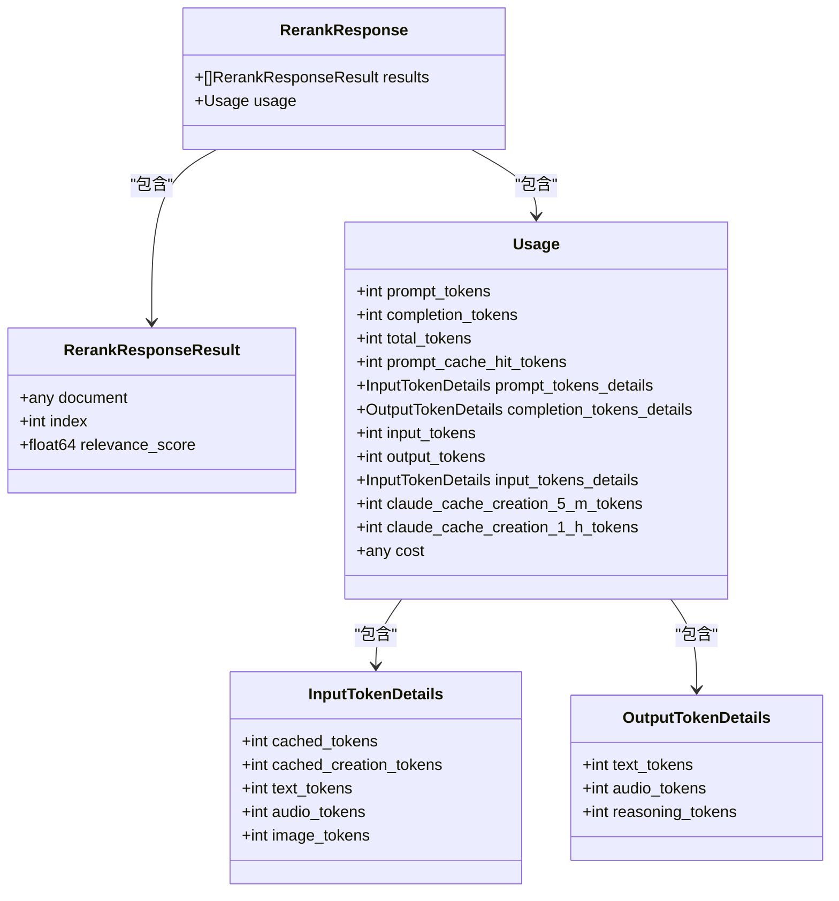
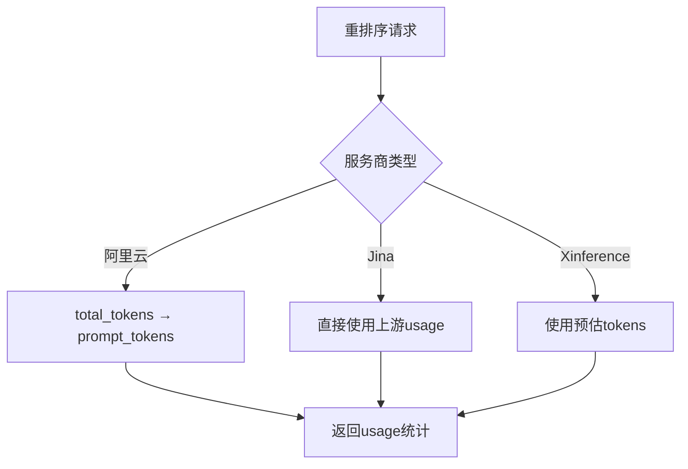
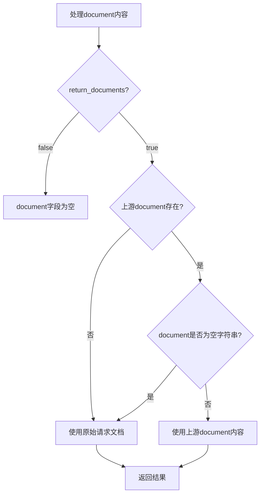
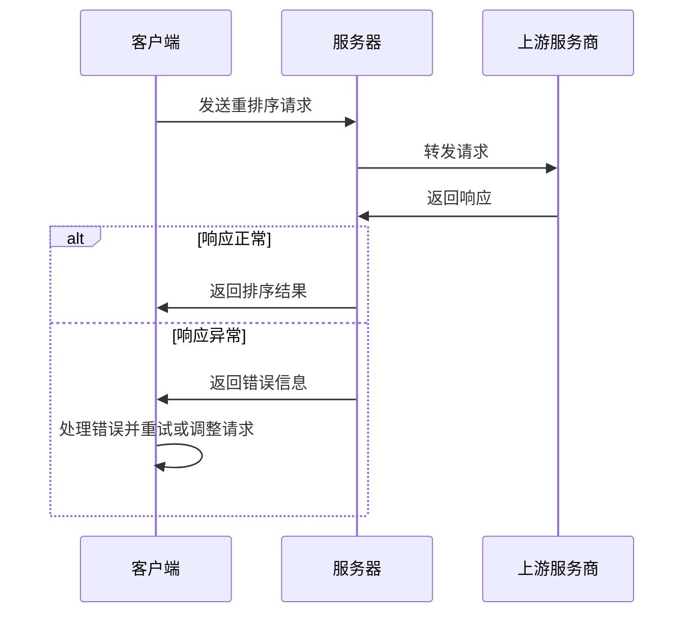

# 重排序响应协议

<cite>
**本文档引用的文件**
- [rerank.go](file://dto/rerank.go#L1-L68)
- [rerank.go](file://relay/channel/ali/rerank.go#L1-L76)
- [rerank.go](file://relay/common_handler/rerank.go#L1-L76)
- [rerank_handler.go](file://relay/rerank_handler.go#L1-L101)
- [openai_response.go](file://dto/openai_response.go#L221-L240)
</cite>

## 目录
1. [RerankResponse数据结构解析](#rerankresponse数据结构解析)
2. [RerankResponseResult字段详解](#rerankresponsresult字段详解)
3. [usage计费信息组成](#usage计费信息组成)
4. [return_documents为true时的document内容](#return_documents为true时的document内容)
5. [标准响应示例](#标准响应示例)
6. [错误响应处理指南](#错误响应处理指南)

## RerankResponse数据结构解析

RerankResponse是重排序API的响应结构体，包含排序结果和使用统计信息。该结构体定义在`dto/rerank.go`文件中，主要由两个核心部分组成：results数组和usage对象。



**Diagram sources**
- [rerank.go](file://dto/rerank.go#L64-L67)
- [openai_response.go](file://dto/openai_response.go#L221-L240)

**Section sources**
- [rerank.go](file://dto/rerank.go#L64-L67)

## RerankResponseResult字段详解

RerankResponseResult结构体定义了单个重排序结果的详细信息，包含三个核心字段：index、relevance_score和document。

### index字段
index字段表示该结果在原始文档列表中的索引位置。当重排序服务返回结果时，会保持与原始请求中documents数组的对应关系。例如，如果原始请求中有5个文档，index值将从0到4。

### relevance_score字段
relevance_score字段表示文档与查询的相关性得分，是一个浮点数。得分越高表示相关性越强。该分数由重排序模型计算得出，通常在0.0到1.0之间，但具体范围可能因服务商而异。

### document字段
document字段包含与排序结果关联的文档内容。当return_documents参数为true时，该字段会包含完整的文档信息；否则可能为空或仅包含引用信息。

**Section sources**
- [rerank.go](file://dto/rerank.go#L54-L58)

## usage计费信息组成

usage对象提供了重排序请求的资源使用统计信息，用于计费和配额管理。不同服务商在usage信息的组成上存在差异。

### 基本组成
usage结构体包含以下核心字段：
- **prompt_tokens**: 输入提示的token数量
- **completion_tokens**: 输出完成的token数量（重排序场景下通常为0）
- **total_tokens**: 总token数量
- **prompt_cache_hit_tokens**: 缓存命中token数量

### 不同服务商的差异
不同服务商在usage信息的提供上存在差异：

1. **阿里云适配器**：将total_tokens同时作为prompt_tokens返回，completion_tokens设置为0
2. **Jina适配器**：从上游响应中直接获取usage信息，并将prompt_tokens设置为等于total_tokens
3. **Xinference适配器**：使用预估的prompt tokens作为usage统计



**Diagram sources**
- [rerank.go](file://dto/rerank.go#L66)
- [ali/rerank.go](file://relay/channel/ali/rerank.go#L57-L61)
- [common_handler/rerank.go](file://relay/common_handler/rerank.go#L59-L62)

**Section sources**
- [openai_response.go](file://dto/openai_response.go#L221-L240)
- [ali/rerank.go](file://relay/channel/ali/rerank.go#L57-L61)
- [common_handler/rerank.go](file://relay/common_handler/rerank.go#L59-L62)

## return_documents为true时的document内容

当return_documents参数设置为true时，document字段会包含完整的文档内容，其来源和格式遵循特定规范。

### 内容来源
document字段的内容来源根据不同的服务商和响应情况而定：

1. 如果上游响应中的document字段为非空字符串，则直接使用该字符串
2. 如果上游响应中的document字段为空字符串，则使用原始请求中对应index位置的文档
3. 如果上游响应中的document字段为其他类型，则直接使用该值

### 格式规范
document字段的格式遵循以下规范：
- 可以是任意类型的JSON值（字符串、数字、对象、数组等）
- 当为对象时，通常包含text字段表示文档文本内容
- 保持与原始请求中documents数组的格式一致性



**Diagram sources**
- [common_handler/rerank.go](file://relay/common_handler/rerank.go#L40-L54)

**Section sources**
- [common_handler/rerank.go](file://relay/common_handler/rerank.go#L40-L54)

## 标准响应示例

以下是一个标准的重排序API响应示例：

```json
{
  "results": [
    {
      "index": 2,
      "relevance_score": 0.95,
      "document": {
        "text": "这是最相关的文档内容"
      }
    },
    {
      "index": 0,
      "relevance_score": 0.87,
      "document": {
        "text": "这是第二相关的文档内容"
      }
    }
  ],
  "usage": {
    "prompt_tokens": 100,
    "completion_tokens": 0,
    "total_tokens": 100
  }
}
```

该响应表示：
- 原始文档列表中的第3个文档（index=2）与查询最相关，得分为0.95
- 原始文档列表中的第1个文档（index=0）次之，得分为0.87
- 请求总共消耗了100个token，全部用于输入提示

**Section sources**
- [rerank.go](file://dto/rerank.go#L64-L67)

## 错误响应处理指南

### 解析relevance_score排序结果
解析relevance_score排序结果时应注意：
1. 按relevance_score降序排列结果
2. 处理可能的浮点数精度问题
3. 验证index值在有效范围内
4. 当return_documents为true时，确保document字段的完整性

### 处理截断的documents数据
当处理大量documents数据时，可能会遇到截断情况，应采取以下措施：
1. 检查响应中的usage信息，确认是否达到服务商的token限制
2. 实现分批处理逻辑，将大文档列表拆分为多个小批次
3. 使用top_n参数限制返回结果数量
4. 监控错误响应中的服务商特定错误码



**Diagram sources**
- [rerank_handler.go](file://relay/rerank_handler.go#L20-L101)
- [common_handler/rerank.go](file://relay/common_handler/rerank.go#L18-L75)

**Section sources**
- [rerank_handler.go](file://relay/rerank_handler.go#L20-L101)
- [common_handler/rerank.go](file://relay/common_handler/rerank.go#L18-L75)