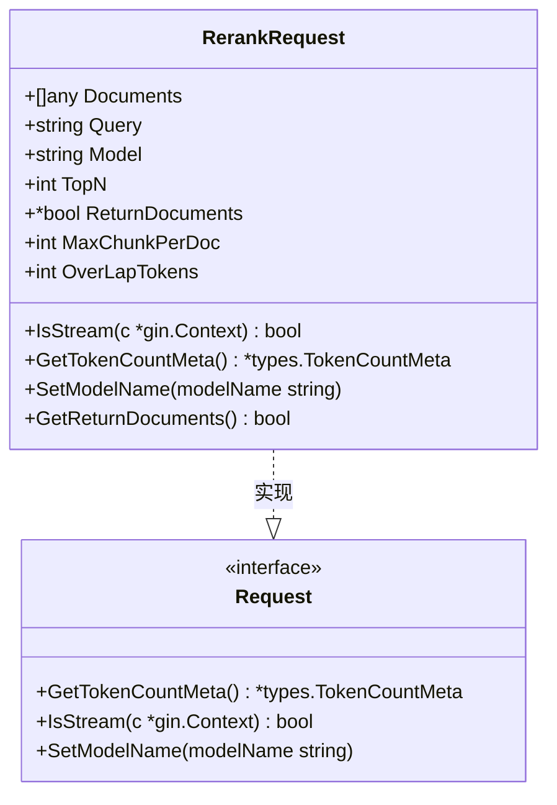
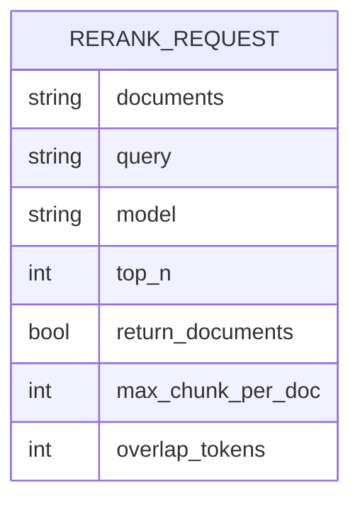
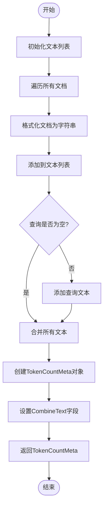

# 重排序请求协议

<cite>
**本文档中引用的文件**  
- [rerank.go](file://dto/rerank.go#L11-L67)
- [rerank.go](file://relay/common_handler/rerank.go#L18-L75)
- [rerank.go](file://relay/channel/ali/rerank.go#L16-L33)
- [request_meta.go](file://types/request_meta.go#L20-L31)
</cite>

## 目录
1. [引言](#引言)
2. [RerankRequest数据结构设计](#rerankrequest数据结构设计)
3. [核心字段详解](#核心字段详解)
4. [Token消耗计算机制](#token消耗计算机制)
5. [模型名称映射机制](#模型名称映射机制)
6. [ReturnDocuments字段设计原理](#returndocuments字段设计原理)
7. [请求示例与高级参数应用](#请求示例与高级参数应用)
8. [结论](#结论)

## 引言
重排序（Rerank）请求协议是AI服务中用于对文档集合进行相关性排序的核心接口。该协议定义了客户端如何向服务端发送查询请求，以获取与查询最相关的文档排序结果。本文档详细说明RerankRequest数据结构的设计与实现，包括其核心字段、方法实现以及实际应用示例。

## RerankRequest数据结构设计

RerankRequest结构体定义了重排序请求的完整数据模型，包含文档集合、查询语句、模型选择等关键信息。该结构体实现了Request接口，提供了标准化的方法来处理请求的流式传输、token计算和模型名称设置。



**图源**
- [rerank.go](file://dto/rerank.go#L11-L23)

**节源**
- [rerank.go](file://dto/rerank.go#L11-L23)

## 核心字段详解

RerankRequest包含多个核心字段，每个字段都有特定的业务含义和数据类型：

| 字段名称 | 数据类型 | 是否必填 | 默认值 | 业务含义 |
|---------|--------|--------|-------|--------|
| documents | []any | 是 | 无 | 待排序的文档集合，支持文本数组或对象数组 |
| query | string | 是 | 无 | 查询语句，用于与文档进行相关性匹配 |
| model | string | 是 | 无 | 使用的重排序模型名称 |
| top_n | int | 否 | 0 | 返回前N个最相关的结果，0表示返回所有结果 |
| return_documents | *bool | 否 | false | 是否在响应中返回原始文档内容 |
| max_chunk_per_doc | int | 否 | 0 | 每个文档最大分块数量 |
| overlap_tokens | int | 否 | 0 | 文档分块间的重叠token数量 |



**图源**
- [rerank.go](file://dto/rerank.go#L12-L18)

**节源**
- [rerank.go](file://dto/rerank.go#L12-L18)

## Token消耗计算机制

GetTokenCountMeta方法负责计算请求的token消耗，这是计费和资源管理的重要依据。该方法将所有文档和查询文本合并，为后续的token估算提供基础数据。

### 计算流程


该方法的具体实现逻辑如下：
1. 创建一个空的字符串切片用于存储所有文本
2. 遍历Documents字段中的每个文档，使用fmt.Sprintf("%v", document)将其转换为字符串并添加到列表中
3. 如果Query字段不为空，则将其也添加到文本列表中
4. 使用strings.Join将所有文本以换行符连接成一个完整的文本块
5. 创建并返回包含该文本块的TokenCountMeta对象

**图源**
- [rerank.go](file://dto/rerank.go#L25-L38)

**节源**
- [rerank.go](file://dto/rerank.go#L25-L38)

## 模型名称映射机制

SetModelName方法实现了模型名称的映射功能，确保请求使用正确的模型标识。该方法在保持原有模型名称的同时，提供了灵活的模型选择机制。

### 方法实现
```go
func (r *RerankRequest) SetModelName(modelName string) {
    if modelName != "" {
        r.Model = modelName
    }
}
```

该方法的设计考虑了以下场景：
- 当外部提供了明确的模型名称时，覆盖请求中的模型字段
- 当模型名称为空时，保持原有的模型选择不变
- 提供了一致的接口供不同渠道的适配器调用

这种方法允许系统在不同层级（如渠道配置、用户设置）进行模型映射，同时保持请求对象的纯净性。

**节源**
- [rerank.go](file://dto/rerank.go#L41-L45)

## ReturnDocuments字段设计原理

ReturnDocuments字段采用指针类型bool的设计具有重要的语义意义，它区分了"未设置"和"明确设置为false"两种状态。

### 设计原因
1. **三态逻辑支持**：指针类型可以表示三种状态：
   - nil：未设置，使用默认行为
   - true：明确要求返回文档
   - false：明确要求不返回文档

2. **默认值处理**：通过GetReturnDocuments方法实现智能默认值处理：
```go
func (r *RerankRequest) GetReturnDocuments() bool {
    if r.ReturnDocuments == nil {
        return false
    }
    return *r.ReturnDocuments
}
```

3. **向后兼容性**：当客户端未指定该参数时，系统可以应用默认策略，而不是强制要求客户端显式设置。

4. **渠道适配需求**：不同AI服务提供商对文档返回的处理方式不同，有些渠道（如Cohere）默认要求返回文档，而其他渠道可能有不同的默认行为。

在渠道适配层，可以根据具体服务的要求设置默认值。例如，在阿里云的适配器中：
```go
if returnDocuments == nil {
    t := true
    returnDocuments = &t
}
```

这表明某些服务可能默认需要返回文档内容，即使客户端未明确要求。

**节源**
- [rerank.go](file://dto/rerank.go#L47-L52)
- [rerank.go](file://relay/channel/ali/rerank.go#L17-L21)

## 请求示例与高级参数应用

### 基本请求示例
```json
{
  "documents": [
    "人工智能是计算机科学的一个分支",
    "机器学习是实现AI的一种方法",
    "深度学习是机器学习的子领域"
  ],
  "query": "什么是人工智能",
  "model": "bge-reranker-base",
  "top_n": 2,
  "return_documents": true
}
```

### 对象数组格式
```json
{
  "documents": [
    {"text": "人工智能概述", "url": "https://example.com/ai"},
    {"text": "机器学习基础", "url": "https://example.com/ml"},
    {"text": "深度学习教程", "url": "https://example.com/dl"}
  ],
  "query": "AI相关技术",
  "model": "jina-reranker-v1-turbo-en"
}
```

### 高级参数应用场景

#### max_chunk_per_doc参数
当处理长文档时，可以限制每个文档的最大分块数量：
```json
{
  "documents": ["很长的技术文档内容..."],
  "query": "关键概念",
  "max_chunk_per_doc": 5,
  "overlap_tokens": 10
}
```
应用场景：
- 防止过长文档占用过多排序资源
- 控制处理时间和计算成本
- 确保多个文档之间的公平性

#### overlap_tokens参数
设置文档分块间的重叠token，确保语义完整性：
```json
{
  "documents": ["连续的长文本内容..."],
  "query": "特定主题",
  "max_chunk_per_doc": 3,
  "overlap_tokens": 15
}
```
应用场景：
- 保持句子或段落的语义完整
- 避免在关键词中间切断文本
- 提高重排序的准确性

这些高级参数特别适用于处理技术文档、法律文件等长文本内容的场景，能够有效平衡处理效率和结果质量。

**节源**
- [rerank.go](file://dto/rerank.go#L17-L18)

## 结论
RerankRequest数据结构经过精心设计，提供了灵活而强大的重排序功能。其核心字段涵盖了重排序所需的所有必要信息，而指针类型的ReturnDocuments字段则巧妙地解决了默认值和三态逻辑的问题。GetTokenCountMeta方法为准确的资源计量提供了基础，SetModelName方法支持灵活的模型映射策略。通过合理使用max_chunk_per_doc和overlap_tokens等高级参数，可以在不同应用场景下优化重排序的性能和效果。整体设计既满足了基本功能需求，又为未来的扩展留下了充足的空间。