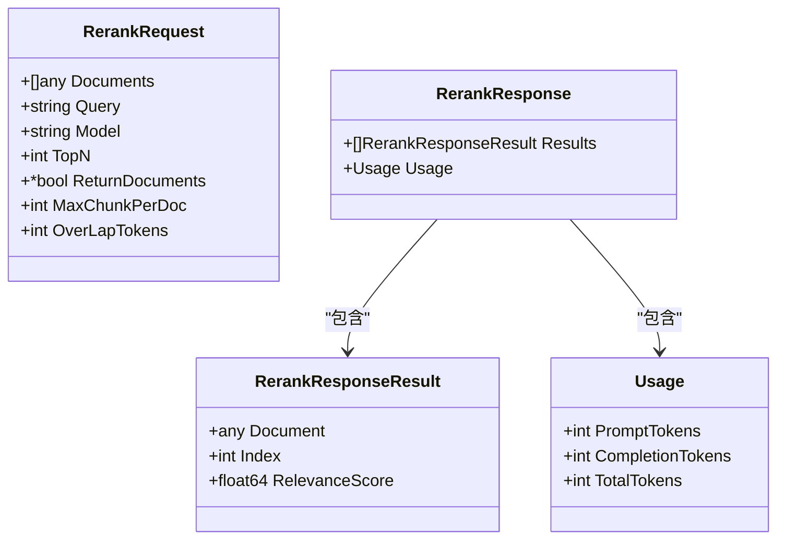
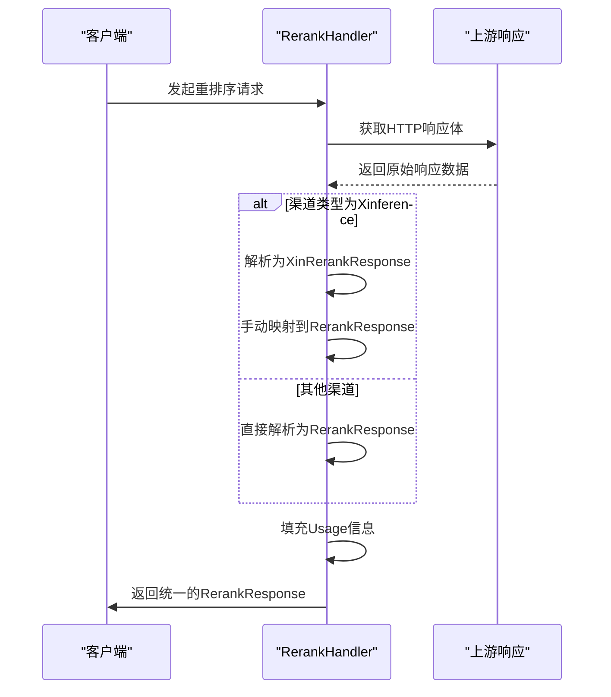

# 重排序（Rerank）协议处理

<cite>
**本文档引用的文件**   
- [rerank.go](file://dto/rerank.go)
- [rerank_handler.go](file://relay/rerank_handler.go)
- [common_handler/rerank.go](file://relay/common_handler/rerank.go)
- [channel/ali/rerank.go](file://relay/channel/ali/rerank.go)
- [channel/cohere/relay-cohere.go](file://relay/channel/cohere/relay-cohere.go)
- [channel/cohere/dto.go](file://relay/channel/cohere/dto.go)
- [channel/jina/adaptor.go](file://relay/channel/jina/adaptor.go)
- [channel/siliconflow/adaptor.go](file://relay/channel/siliconflow/adaptor.go)
- [channel/xinference/dto.go](file://relay/channel/xinference/dto.go)
</cite>

## 目录
1. [简介](#简介)
2. [核心数据结构](#核心数据结构)
3. [统一处理入口](#统一处理入口)
4. [渠道适配器实现](#渠道适配器实现)
5. [使用量与计费逻辑](#使用量与计费逻辑)
6. [请求示例与错误处理](#请求示例与错误处理)

## 简介
本文档全面介绍new-api系统中重排序（Rerank）API的协议处理机制。重排序功能允许用户对一组文档根据与查询的相关性进行重新排序，广泛应用于搜索、推荐等场景。系统通过统一的接口协议处理来自不同服务商（如Jina、Cohere、SiliconFlow等）的重排序请求，并将各服务商的原生响应格式转换为统一的标准化响应。文档详细说明了RerankRequest和RerankResponse数据结构的设计，分析了common_handler中RerankHandler如何作为统一入口处理不同服务商的响应，阐述了特定渠道适配器如何将上游服务的原生响应映射到统一格式，并解释了usage信息的计算和计费逻辑。

## 核心数据结构

重排序API的核心数据结构定义在`dto/rerank.go`文件中，主要包括请求和响应两个部分。

### RerankRequest 请求结构
`RerankRequest`结构体定义了客户端发起重排序请求时所需的所有参数。

**Section sources**
- [rerank.go](file://dto/rerank.go#L11-L19)

#### 核心字段定义
| 字段名 | 类型 | 是否必需 | 默认值 | 说明 |
| :--- | :--- | :--- | :--- | :--- |
| `documents` | `[]any` | 是 | 无 | 待排序的文档列表，每个文档可以是字符串或包含文本的对象 |
| `query` | `string` | 是 | 无 | 用于与文档进行相关性比较的查询语句 |
| `model` | `string` | 是 | 无 | 指定用于重排序的模型名称 |
| `top_n` | `int` | 否 | 0 (返回所有) | 指定返回最相关文档的数量 |
| `return_documents` | `*bool` | 否 | `false` | 指示响应中是否包含完整的文档内容 |
| `max_chunk_per_doc` | `int` | 否 | 0 | 每个文档允许的最大分块数 |
| `overlap_tokens` | `int` | 否 | 0 | 文档分块时重叠的token数量 |

### RerankResponse 响应结构
`RerankResponse`结构体定义了重排序服务返回给客户端的标准化响应格式。

**Section sources**
- [rerank.go](file://dto/rerank.go#L54-L67)

#### 核心字段定义
| 字段名 | 类型 | 说明 |
| :--- | :--- | :--- |
| `results` | `[]RerankResponseResult` | 包含排序结果的数组，按相关性分数从高到低排列 |
| `usage` | `Usage` | 包含本次请求的用量信息，用于计费 |

#### RerankResponseResult 结果项
`RerankResponseResult`是`results`数组中的每个元素，包含单个文档的排序信息。

| 字段名 | 类型 | 说明 |
| :--- | :--- | :--- |
| `document` | `any` | 原始文档内容，仅当`return_documents`为`true`时返回 |
| `index` | `int` | 该文档在原始`documents`数组中的索引位置 |
| `relevance_score` | `float64` | 文档与查询的相关性分数，值越高表示相关性越强 |



**Diagram sources **
- [rerank.go](file://dto/rerank.go#L11-L67)

## 统一处理入口

系统通过`common_handler`包中的`RerankHandler`函数作为处理不同服务商重排序响应的统一入口。该函数负责将上游服务商的原生响应解析并转换为系统内部统一的`RerankResponse`格式。

### 处理流程
1.  **读取响应体**：首先读取上游服务商返回的HTTP响应体。
2.  **判断渠道类型**：根据`RelayInfo`中的`ChannelType`判断请求来自哪个服务商。
3.  **解析与转换**：
    *   对于`Xinference`渠道，需要进行特殊的转换处理。
    *   对于其他渠道（如Jina），直接将响应体反序列化为`RerankResponse`。
4.  **设置用量信息**：根据估算的token数量填充`usage`字段。
5.  **返回响应**：将转换后的统一响应写回客户端。

**Section sources**
- [common_handler/rerank.go](file://relay/common_handler/rerank.go#L18-L75)

### Xinference 特殊处理
Xinference渠道的响应格式与其他服务商不同，需要在`RerankHandler`中进行特殊处理。其原生响应结构`XinRerankResponse`与系统内部的`RerankResponse`不完全一致，因此需要手动映射字段。



**Diagram sources **
- [common_handler/rerank.go](file://relay/common_handler/rerank.go#L18-L75)
- [xinference/dto.go](file://relay/channel/xinference/dto.go#L3-L11)

## 渠道适配器实现

不同的服务商（渠道）通过各自的适配器（Adaptor）实现将统一的`RerankRequest`转换为该服务商所需的原生请求格式，并将原生响应转换回统一的`RerankResponse`。

### 阿里云 (Ali) 适配器
阿里云渠道的`rerank.go`文件实现了其特有的请求转换和响应处理逻辑。

**Section sources**
- [channel/ali/rerank.go](file://relay/channel/ali/rerank.go#L16-L76)

#### 请求转换
`ConvertRerankRequest`函数将通用的`RerankRequest`转换为阿里云API所需的`AliRerankRequest`格式。一个关键的处理是，当`ReturnDocuments`字段为空时，默认设置为`true`。

#### 响应处理
`RerankHandler`函数处理阿里云的响应：
1.  反序列化为`AliRerankResponse`。
2.  检查响应中的`Code`字段，如果非空则表示错误，转换为系统错误。
3.  提取`usage`信息。
4.  将`AliRerankResponse`中的`results`直接赋值给`RerankResponse`的`results`。
5.  序列化并返回统一的响应。

### Cohere 适配器
Cohere渠道的适配器实现在`relay-cohere.go`文件中。

**Section sources**
- [channel/cohere/relay-cohere.go](file://relay/channel/cohere/relay-cohere.go#L57-L250)
- [channel/cohere/dto.go](file://relay/channel/cohere/dto.go#L34-L61)

#### 请求转换
`requestConvertRerank2Cohere`函数负责转换请求。它确保`TopN`至少为1，并将`ReturnDocuments`固定设置为`true`。

#### 响应处理
`cohereRerankHandler`函数处理Cohere的响应：
1.  反序列化为`CohereRerankResponseResult`。
2.  提取`usage`信息。如果服务商未返回用量，则使用估算值。
3.  将`CohereRerankResponseResult`中的`results`直接赋值给`RerankResponse`的`results`。
4.  序列化并返回统一的响应。

### Jina 适配器
Jina渠道的适配器较为简单，因为它返回的响应格式与系统内部的`RerankResponse`格式基本一致。

**Section sources**
- [channel/jina/adaptor.go](file://relay/channel/jina/adaptor.go#L84-L87)

#### 响应处理
`DoResponse`方法在检测到`RelayMode`为`Rerank`时，直接调用`common_handler.RerankHandler`。由于Jina的响应可以直接被`RerankResponse`结构体解析，因此`common_handler`中的逻辑会进入`else`分支，直接进行反序列化，无需特殊转换。

### SiliconFlow 适配器
SiliconFlow渠道的适配器实现也较为直接。

**Section sources**
- [channel/siliconflow/adaptor.go](file://relay/channel/siliconflow/adaptor.go#L110-L117)

#### 响应处理
`DoResponse`方法根据`RelayMode`调用`siliconflowRerankHandler`来处理重排序响应。该处理函数会将原生响应转换为统一的`RerankResponse`格式。

## 使用量与计费逻辑

系统的使用量（usage）信息是计费的核心依据。不同服务商在返回用量信息上存在差异，系统通过统一的逻辑进行处理。

### 用量信息来源
1.  **服务商提供**：如Cohere和阿里云会在响应中明确返回`input_tokens`和`output_tokens`，系统直接使用这些值。
2.  **系统估算**：对于不返回用量信息的服务商（如Jina），系统会根据请求内容估算token数量。`RerankRequest`中的`GetTokenCountMeta`方法负责此估算，它将所有文档和查询文本合并后计算总token数。

### 计费逻辑
1.  **计费点**：在`RerankHelper`函数的末尾，调用`postConsumeQuota`函数进行额度扣减。
2.  **计费依据**：主要依据`usage.TotalTokens`或`usage.PromptTokens`（对于重排序这类无输出的场景）进行计费。
3.  **兜底策略**：当服务商未返回用量时，使用估算值作为计费依据，确保不会漏计。

**Section sources**
- [rerank_handler.go](file://relay/rerank_handler.go#L98)
- [rerank.go](file://dto/rerank.go#L25-L38)
- [common_handler/rerank.go](file://relay/common_handler/rerank.go#L60-L62)

## 请求示例与错误处理

### 请求示例
```json
{
  "documents": [
    "人工智能是计算机科学的一个分支。",
    "机器学习是实现人工智能的一种方法。",
    "深度学习是机器学习的一个子领域。"
  ],
  "query": "什么是深度学习？",
  "model": "jina-reranker-v2-base-multilingual",
  "top_n": 2,
  "return_documents": true
}
```

### 响应示例
```json
{
  "results": [
    {
      "index": 2,
      "relevance_score": 0.95,
      "document": "深度学习是机器学习的一个子领域。"
    },
    {
      "index": 1,
      "relevance_score": 0.85,
      "document": "机器学习是实现人工智能的一种方法。"
    }
  ],
  "usage": {
    "prompt_tokens": 50,
    "completion_tokens": 0,
    "total_tokens": 50
  }
}
```

### 常见错误处理
系统通过`RerankHelper`函数在处理链的早期进行错误检查：
*   **请求类型错误**：如果请求体无法解析为`RerankRequest`，返回`400 Bad Request`。
*   **文档数量超限**：虽然核心代码未直接体现，但通常在`helper`或`service`层会有对`documents`数组长度的校验。
*   **查询为空**：同样，对`query`字段的非空校验应在处理链的早期完成。
*   **服务商错误**：上游服务商返回的错误（如4xx/5xx状态码）会被`RelayErrorHandler`捕获并转换为系统定义的错误码返回给客户端。

**Section sources**
- [rerank_handler.go](file://relay/rerank_handler.go#L20-L101)