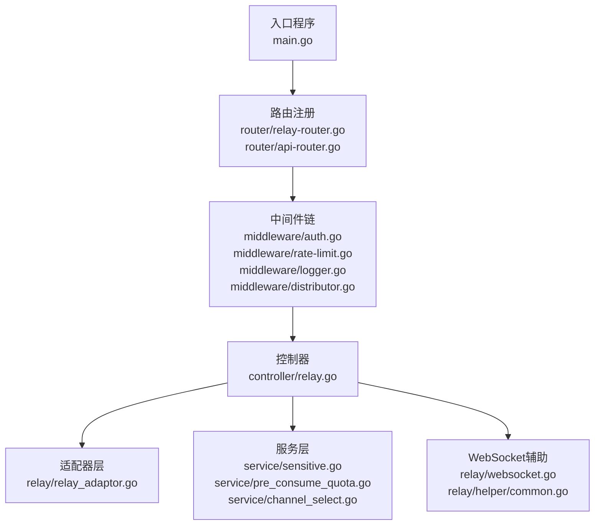
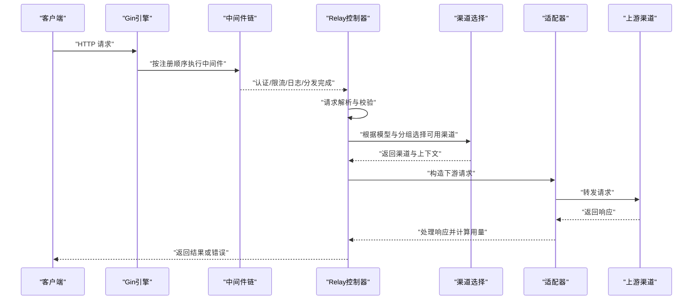
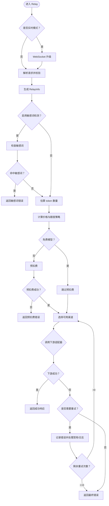
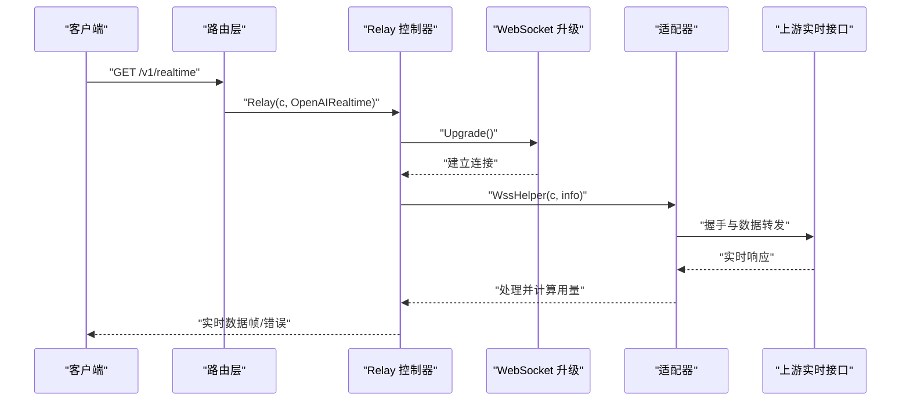
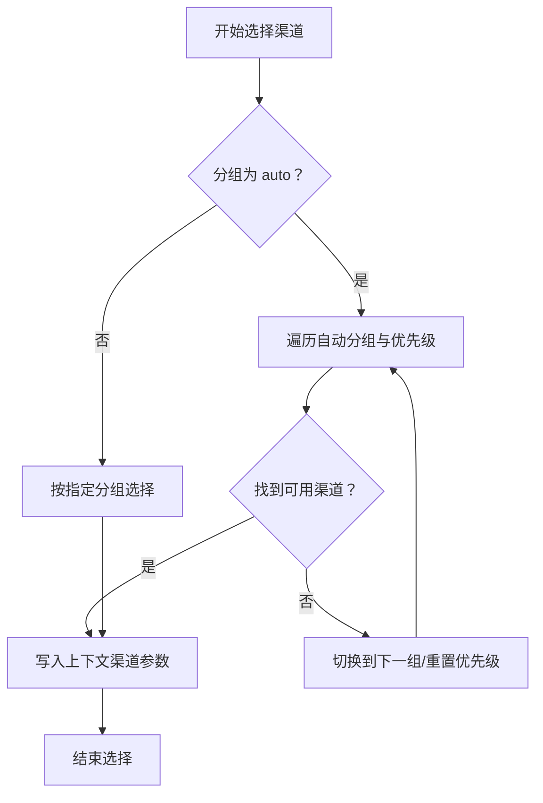
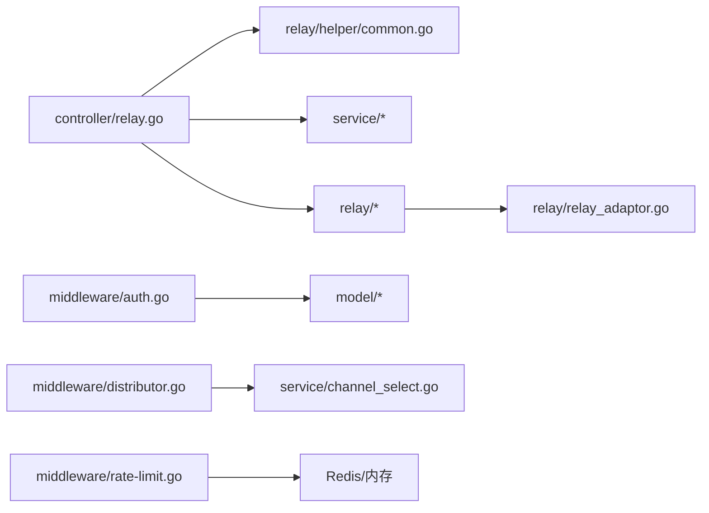

# 请求处理流程

<cite>
**本文引用的文件**
- [main.go](file://main.go)
- [router/api-router.go](file://router/api-router.go)
- [router/relay-router.go](file://router/relay-router.go)
- [middleware/auth.go](file://middleware/auth.go)
- [middleware/rate-limit.go](file://middleware/rate-limit.go)
- [middleware/logger.go](file://middleware/logger.go)
- [middleware/distributor.go](file://middleware/distributor.go)
- [controller/relay.go](file://controller/relay.go)
- [relay/websocket.go](file://relay/websocket.go)
- [relay/relay_adaptor.go](file://relay/relay_adaptor.go)
- [relay/helper/common.go](file://relay/helper/common.go)
- [service/sensitive.go](file://service/sensitive.go)
- [service/pre_consume_quota.go](file://service/pre_consume_quota.go)
- [service/channel_select.go](file://service/channel_select.go)
</cite>

## 目录
1. [简介](#简介)
2. [项目结构](#项目结构)
3. [核心组件](#核心组件)
4. [架构总览](#架构总览)
5. [详细组件分析](#详细组件分析)
6. [依赖关系分析](#依赖关系分析)
7. [性能考量](#性能考量)
8. [故障排查指南](#故障排查指南)
9. [结论](#结论)

## 简介
本文件系统性梳理 new-api 中 API 网关的请求处理全流程，从 Gin 路由接收 HTTP 请求开始，逐层展开中间件链（认证、速率限制、日志记录、分发与渠道选择），重点解析 controller/relay.go 中 Relay 函数的执行逻辑，覆盖请求解析、敏感词检测、令牌预扣费、通道选择与错误重试机制。同时说明 WebSocket 实时通信（如 OpenAI Realtime/Claude 实时模式）的特殊处理路径，并通过流程图展示正常与异常请求的处理分支，最后给出性能瓶颈识别与优化建议。

## 项目结构
new-api 采用典型的分层架构：入口程序初始化资源与 HTTP 服务器；路由层定义 API 与中转路由；中间件层负责认证、限流、日志、分发与渠道选择；控制器层承接业务逻辑；服务层封装敏感词检测、额度预扣费、通道选择等通用能力；适配器层对接不同上游渠道。

图表来源
- [main.go](file://main.go#L127-L170)
- [router/relay-router.go](file://router/relay-router.go#L13-L206)
- [router/api-router.go](file://router/api-router.go#L11-L260)
- [middleware/auth.go](file://middleware/auth.go#L146-L322)
- [middleware/rate-limit.go](file://middleware/rate-limit.go#L1-L118)
- [middleware/logger.go](file://middleware/logger.go#L1-L27)
- [middleware/distributor.go](file://middleware/distributor.go#L1-L392)
- [controller/relay.go](file://controller/relay.go#L64-L206)
- [relay/relay_adaptor.go](file://relay/relay_adaptor.go#L1-L163)
- [relay/websocket.go](file://relay/websocket.go#L1-L47)
- [relay/helper/common.go](file://relay/helper/common.go#L1-L212)
- [service/sensitive.go](file://service/sensitive.go#L1-L78)
- [service/pre_consume_quota.go](file://service/pre_consume_quota.go#L1-L80)
- [service/channel_select.go](file://service/channel_select.go#L1-L163)

章节来源
- [main.go](file://main.go#L127-L170)
- [router/relay-router.go](file://router/relay-router.go#L13-L206)
- [router/api-router.go](file://router/api-router.go#L11-L260)

## 核心组件
- 入口与中间件栈
  - 启动时初始化资源、数据库、Redis、日志与 HTTP 服务器，注册自定义恢复中间件、请求 ID、日志格式化、会话存储与路由。
  - 中间件链包含：请求 ID、日志、会话、全局 API 限流、模型级请求限流、CORS、解压、统计、分发与渠道选择、令牌认证等。
- 路由层
  - v1 与 v1beta 等多条路径映射到统一控制器，区分 OpenAI、Claude、Gemini、音频、图像、嵌入、重排等不同模式。
  - WebSocket 路由统一进入控制器的 Relay 函数，按格式区分 OpenAI Realtime 或 Claude 实时模式。
- 控制器
  - Relay 函数负责请求解析、敏感词检测、令牌预扣费、通道选择、错误重试、最终响应与错误回退。
- 服务层
  - 敏感词检测、预扣费与返还、通道选择策略（含自动分组与跨组重试）。
- 适配器层
  - 按渠道类型选择具体适配器，完成下游请求与响应处理。

章节来源
- [main.go](file://main.go#L127-L170)
- [router/relay-router.go](file://router/relay-router.go#L13-L206)
- [controller/relay.go](file://controller/relay.go#L64-L206)
- [service/sensitive.go](file://service/sensitive.go#L1-L78)
- [service/pre_consume_quota.go](file://service/pre_consume_quota.go#L1-L80)
- [service/channel_select.go](file://service/channel_select.go#L1-L163)
- [relay/relay_adaptor.go](file://relay/relay_adaptor.go#L1-L163)

## 架构总览
下图展示从客户端到下游渠道的整体调用链路与关键节点。

图表来源
- [main.go](file://main.go#L127-L170)
- [router/relay-router.go](file://router/relay-router.go#L63-L155)
- [middleware/distributor.go](file://middleware/distributor.go#L1-L392)
- [controller/relay.go](file://controller/relay.go#L64-L206)
- [relay/relay_adaptor.go](file://relay/relay_adaptor.go#L1-L163)

## 详细组件分析

### 中间件链与执行顺序
- 全局中间件
  - 自定义恢复中间件：捕获 panic 并返回统一错误结构。
  - 请求 ID 注入与日志格式化：便于追踪请求生命周期。
  - 会话存储：基于 Cookie 的会话管理。
- 路由级中间件
  - CORS、解压、统计、模型级请求限流、分发与渠道选择、令牌认证。
- 执行顺序要点
  - 认证与令牌校验在路由级中间件中完成，随后进行模型级限流与分发。
  - 分发中间件会根据请求路径与模型信息选择合适的渠道，并将渠道参数写入上下文。

章节来源
- [main.go](file://main.go#L127-L170)
- [middleware/logger.go](file://middleware/logger.go#L1-L27)
- [middleware/rate-limit.go](file://middleware/rate-limit.go#L1-L118)
- [middleware/distributor.go](file://middleware/distributor.go#L1-L392)
- [middleware/auth.go](file://middleware/auth.go#L146-L322)

### 路由与控制器入口
- v1 与 v1beta 路由
  - 统一挂载到 TokenAuth 与 Distribute，再根据路径映射到不同模式（聊天、图像、音频、嵌入、重排、Gemini 等）。
  - WebSocket 路由统一进入 Relay，按格式区分 OpenAI Realtime 与 Claude 实时模式。
- 控制器入口
  - Relay(c, relayFormat) 是主要处理函数，负责请求解析、敏感词检测、预扣费、通道选择与重试、错误处理与返回。

章节来源
- [router/relay-router.go](file://router/relay-router.go#L13-L206)
- [controller/relay.go](file://controller/relay.go#L64-L206)

### Relay 函数执行逻辑
- 关键步骤
  - WebSocket 实时模式：若为 OpenAI Realtime 或 Claude 实时模式，先进行 WebSocket 升级，后续走 WssHelper 流程。
  - 请求解析与校验：从请求体中解析并校验输入，生成 RelayInfo。
  - 敏感词检测：可选开启，若命中敏感词则直接返回错误。
  - 令牌预扣费：估算请求 token 数量，按价格与额度策略决定是否预扣费；免费模型跳过预扣费。
  - 通道选择：根据分组与模型选择可用渠道，写入上下文；支持跨组重试与自动分组策略。
  - 错误重试：根据错误类型与状态码决定是否重试，最多重试固定次数；每次重试记录使用的渠道链路。
  - 错误回退：若预扣费已发生但下游失败，异步返还预扣费。
- 上下文数据传递
  - 渠道信息、模型映射、分组、密钥索引、状态码映射、组织信息等均写入上下文，供适配器与后续处理使用。
  - 使用字符串切片记录“use_channel”，便于重试链路可视化与审计。

图表来源
- [controller/relay.go](file://controller/relay.go#L64-L206)
- [service/sensitive.go](file://service/sensitive.go#L1-L78)
- [service/pre_consume_quota.go](file://service/pre_consume_quota.go#L1-L80)
- [service/channel_select.go](file://service/channel_select.go#L1-L163)

章节来源
- [controller/relay.go](file://controller/relay.go#L64-L206)
- [service/sensitive.go](file://service/sensitive.go#L1-L78)
- [service/pre_consume_quota.go](file://service/pre_consume_quota.go#L1-L80)
- [service/channel_select.go](file://service/channel_select.go#L1-L163)

### WebSocket 实时通信（OpenAI Realtime/Claude 实时）
- OpenAI Realtime
  - 路由层统一进入 Relay，当 relayFormat 为 OpenAI Realtime 时，先进行 WebSocket 升级，随后调用 WssHelper 完成握手与数据转发。
  - 适配器根据 ApiType 初始化，完成请求与响应处理，并在完成后按实时用量进行后置消费。
- Claude 实时
  - 路由层进入 Relay，relayFormat 为 Claude 实时模式时，调用 ClaudeHelper 完成相应处理。
- 辅助工具
  - helper 包提供事件流头设置、SSE 数据帧发送、Ping、对象与字符串数据发送、WebSocket 错误消息发送等工具方法。

图表来源
- [router/relay-router.go](file://router/relay-router.go#L63-L73)
- [controller/relay.go](file://controller/relay.go#L64-L103)
- [relay/websocket.go](file://relay/websocket.go#L1-L47)
- [relay/helper/common.go](file://relay/helper/common.go#L1-L212)

章节来源
- [router/relay-router.go](file://router/relay-router.go#L63-L73)
- [controller/relay.go](file://controller/relay.go#L64-L103)
- [relay/websocket.go](file://relay/websocket.go#L1-L47)
- [relay/helper/common.go](file://relay/helper/common.go#L1-L212)

### 通道选择与错误重试
- 通道选择
  - 支持“auto”分组与跨组重试策略，按优先级遍历分组与优先级，直到找到可用渠道。
  - 将渠道参数写入上下文，包括密钥、基础 URL、状态码映射、模型映射等。
- 错误重试
  - 根据错误类型与状态码决定是否重试，例如 429、307、5xx（除 504/524）、408（Azure 不重试）等。
  - 若预扣费已发生且下游失败，异步返还预扣费。
  - 记录错误日志与 admin 信息，便于审计与定位。

图表来源
- [service/channel_select.go](file://service/channel_select.go#L1-L163)
- [middleware/distributor.go](file://middleware/distributor.go#L1-L392)

章节来源
- [service/channel_select.go](file://service/channel_select.go#L1-L163)
- [middleware/distributor.go](file://middleware/distributor.go#L1-L392)
- [controller/relay.go](file://controller/relay.go#L160-L206)

### 上下文（Context）数据传递
- 写入上下文的关键键值（节选）
  - 渠道相关：channel_id、channel_type、channel_name、channel_key、channel_base_url、channel_auto_ban、channel_status_code_mapping、channel_model_mapping、channel_header_override、channel_param_override、channel_other_setting、channel_organization。
  - 模型与分组：original_model、using_group、token_group、token_cross_group_retry。
  - 令牌与用户：token_id、token_key、token_name、token_quota、token_unlimited_quota、token_model_limit_enabled、token_model_limit。
  - 其他：request_start_time、system_prompt_override、特定渠道参数（如 api_version、region、plugin、bot_id 等）。
- 使用场景
  - 适配器读取上下文中的渠道与模型映射，构造下游请求。
  - 日志与错误记录使用上下文中的用户、令牌、渠道与分组信息。
  - 重试链路通过字符串切片记录“use_channel”。

章节来源
- [middleware/distributor.go](file://middleware/distributor.go#L306-L363)
- [controller/relay.go](file://controller/relay.go#L160-L206)

## 依赖关系分析
- 控制器依赖
  - Relay 依赖 helper、service（敏感词、预扣费、通道选择）、relay（适配器与处理器）、types（错误类型）、dto（请求/响应结构）。
- 适配器依赖
  - relay_adaptor 根据 API 类型返回对应渠道适配器，适配器实现统一接口，屏蔽上游差异。
- 中间件依赖
  - 认证中间件依赖模型层用户与令牌缓存；分发中间件依赖服务层通道选择与比率设置；限流中间件依赖内存或 Redis 存储。

图表来源
- [controller/relay.go](file://controller/relay.go#L1-L206)
- [relay/relay_adaptor.go](file://relay/relay_adaptor.go#L1-L163)
- [middleware/auth.go](file://middleware/auth.go#L146-L322)
- [middleware/distributor.go](file://middleware/distributor.go#L1-L392)
- [middleware/rate-limit.go](file://middleware/rate-limit.go#L1-L118)

章节来源
- [controller/relay.go](file://controller/relay.go#L1-L206)
- [relay/relay_adaptor.go](file://relay/relay_adaptor.go#L1-L163)
- [middleware/auth.go](file://middleware/auth.go#L146-L322)
- [middleware/distributor.go](file://middleware/distributor.go#L1-L392)
- [middleware/rate-limit.go](file://middleware/rate-limit.go#L1-L118)

## 性能考量
- 中间件顺序与开销
  - 解压与统计中间件可能引入额外 CPU 与内存开销，建议仅在必要路径启用。
  - 模型级请求限流与全局 API 限流应结合实际流量峰值合理配置，避免过度限流导致延迟上升。
- 通道选择与重试
  - “auto”分组与跨组重试策略在高并发下可能增加查询与上下文写入开销，建议监控分组命中率与重试次数。
  - 重试链路记录“use_channel”便于审计，但频繁重试会放大下游压力，需配合限流与熔断策略。
- 预扣费与返还
  - 预扣费与返还均为异步操作，注意幂等性与一致性，避免重复返还或漏扣。
- WebSocket 实时
  - 实时模式下需确保适配器与上游握手与数据转发的稳定性，避免阻塞主线程。
- 缓存与数据库
  - 渠道缓存与用户额度查询应尽量命中缓存，减少数据库压力；对热点模型与分组进行预热。

[本节为通用指导，无需列出具体文件来源]

## 故障排查指南
- 常见错误与定位
  - 认证失败：检查 Authorization 头、令牌有效性与 IP 白名单。
  - 令牌无权访问模型：检查令牌模型限制与分组比率配置。
  - 无可用渠道：检查分组、模型映射、渠道状态与优先级。
  - 额度不足：检查用户与令牌额度，确认预扣费与返还逻辑。
  - 重试过多：查看“use_channel”链路与错误日志，定位失败原因。
- 日志与审计
  - 中间件日志包含请求 ID、状态码、耗时与路径，便于快速定位。
  - 错误日志记录用户、令牌、渠道、分组与错误详情，支持 admin 信息聚合。
- 重试策略
  - 对 429、307、5xx（除 504/524）与 408（Azure 不重试）等状态码进行重试；对 400、2xx 等不重试。
  - 特定渠道 ID 指定场景不重试，避免干扰。

章节来源
- [middleware/logger.go](file://middleware/logger.go#L1-L27)
- [middleware/auth.go](file://middleware/auth.go#L146-L322)
- [middleware/distributor.go](file://middleware/distributor.go#L1-L392)
- [controller/relay.go](file://controller/relay.go#L160-L206)

## 结论
new-api 的请求处理流程以 Gin 为核心，通过中间件链实现认证、限流、日志与分发，控制器集中处理请求解析、敏感词检测、预扣费、通道选择与重试，适配器屏蔽上游差异。WebSocket 实时模式通过统一入口与专用辅助方法保障稳定传输。建议在高并发场景下优化中间件顺序、合理配置限流与重试策略，并持续监控渠道命中率与错误日志，以获得更优的吞吐与稳定性。